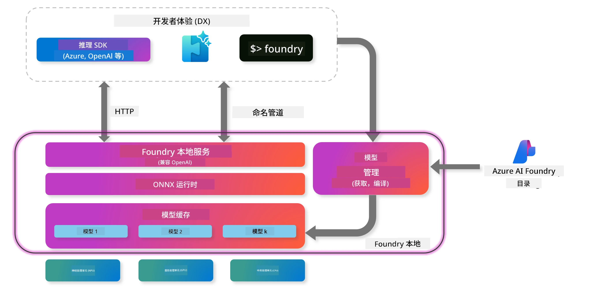
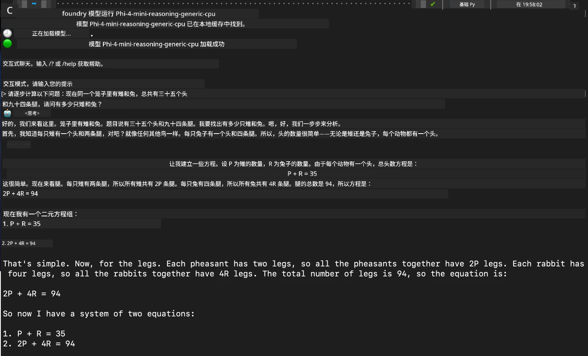

## 在 Foundry Local 中开始使用 Phi 家族模型

### Foundry Local 简介

Foundry Local 是一款强大的设备端 AI 推理解决方案，将企业级 AI 功能直接带到您的本地硬件上。本教程将引导您设置并使用 Phi 家族模型与 Foundry Local，帮助您完全控制 AI 负载，同时保持隐私并降低成本。

Foundry Local 通过在设备本地运行 AI 模型，提供性能、隐私、定制化和成本优势。它通过直观的 CLI、SDK 和 REST API，无缝集成到您现有的工作流程和应用程序中。




### 为什么选择 Foundry Local？

了解 Foundry Local 的优势将帮助您对 AI 部署策略做出明智的决策：

- **设备端推理：** 在您自己的硬件上本地运行模型，降低成本，同时确保所有数据保留在您的设备上。

- **模型定制化：** 从预设模型中选择或使用您自己的模型，以满足特定需求和用例。

- **成本效益：** 利用现有硬件，消除重复的云服务费用，使 AI 更加普及。

- **无缝集成：** 通过 SDK、API 端点或 CLI 连接您的应用程序，随着需求增长轻松扩展至 Microsoft Foundry。

> **入门提示：** 本教程聚焦通过 CLI 和 SDK 接口使用 Foundry Local。您将学习这两种方法，帮助您选择最适合的方案。

## 第 1 部分：设置 Foundry Local CLI

### 第 1 步：安装

Foundry Local CLI 是您管理和本地运行 AI 模型的入口。让我们先在系统上安装它。

**支持平台：** Windows 和 macOS

有关详细安装说明，请参阅[官方 Foundry Local 文档](https://github.com/microsoft/Foundry-Local/blob/main/README.md)。

### 第 2 步：浏览可用模型

安装 Foundry Local CLI 后，您可以查看适合您用例的可用模型。此命令将显示所有支持的模型：


```bash
foundry model list
```

### 第 3 步：了解 Phi 家族模型

Phi 家族提供多种优化针对不同用例和硬件配置的模型。以下是在 Foundry Local 中可用的 Phi 模型：

**可用 Phi 模型：**

- **phi-3.5-mini** - 用于基础任务的紧凑型模型
- **phi-3-mini-128k** - 支持更长对话的扩展上下文版本
- **phi-3-mini-4k** - 适用于通用用途的标准上下文模型
- **phi-4** - 具备更强大功能的高级模型
- **phi-4-mini** - Phi-4 的轻量版
- **phi-4-mini-reasoning** - 专为复杂推理任务设计

> **硬件兼容性：** 每个模型均可根据您的系统能力配置不同的硬件加速（CPU、GPU）。

### 第 4 步：运行您的第一个 Phi 模型

让我们从一个实际示例开始。我们将运行擅长解决复杂分步问题的 `phi-4-mini-reasoning` 模型。


**运行模型的命令：**

```bash
foundry model run Phi-4-mini-reasoning-generic-cpu
```

> **首次设置：** 首次运行模型时，Foundry Local 会自动将其下载到您的本地设备。下载时间取决于您的网络速度，请在初次设置时耐心等待。

### 第 5 步：用实际问题测试模型

现在，让我们用一个经典的逻辑问题测试模型，看看它如何进行分步推理：

**示例问题：**

```txt
Please calculate the following step by step: Now there are pheasants and rabbits in the same cage, there are thirty-five heads on top and ninety-four legs on the bottom, how many pheasants and rabbits are there?
```

**预期表现：** 模型应将此问题拆解为逻辑步骤，利用野鸡有两条腿、兔子有四条腿的事实，求解方程组。

**结果：**



## 第 2 部分：使用 Foundry Local SDK 构建应用

### 为什么使用 SDK？

虽然 CLI 适合测试和快速交互，SDK 使您能够以编程方式将 Foundry Local 集成到您的应用中。这开启了以下可能：

- 构建定制的 AI 驱动应用
- 创建自动化工作流
- 将 AI 功能集成到现有系统
- 开发聊天机器人和交互工具

### 支持的编程语言

Foundry Local 为多种编程语言提供 SDK 支持，以适应您的开发偏好：

**📦 可用 SDK：**

- **C# (.NET):** [SDK 文档与示例](https://github.com/microsoft/Foundry-Local/tree/main/sdk/cs)
- **Python:** [SDK 文档与示例](https://github.com/microsoft/Foundry-Local/tree/main/sdk/python)
- **JavaScript:** [SDK 文档与示例](https://github.com/microsoft/Foundry-Local/tree/main/sdk/js)
- **Rust:** [SDK 文档与示例](https://github.com/microsoft/Foundry-Local/tree/main/sdk/rust)

### 下一步

1. **根据您的开发环境选择合适的 SDK**
2. **遵循 SDK 相关文档获取详细实现指导**
3. **从简单示例开始，逐步构建复杂应用**
4. **探索各 SDK 仓库中提供的示例代码**

## 结论

您现在已学习如何：
- ✅ 安装并设置 Foundry Local CLI
- ✅ 发现并运行 Phi 家族模型
- ✅ 使用实际问题测试模型
- ✅ 了解适用于应用开发的 SDK 选项

Foundry Local 为将 AI 功能直接带入本地环境提供了强大基础，让您掌控性能、隐私和成本，同时保持灵活性，必要时还能扩展到云端解决方案。

---

<!-- CO-OP TRANSLATOR DISCLAIMER START -->
**免责声明**：  
本文件由 AI 翻译服务 [Co-op Translator](https://github.com/Azure/co-op-translator) 翻译而成。虽然我们力求准确，但请注意，自动翻译可能存在错误或不准确之处。原始文件的原文应被视为权威来源。对于重要信息，建议使用专业人工翻译。因使用本翻译而产生的任何误解或错误解释，我们概不负责。
<!-- CO-OP TRANSLATOR DISCLAIMER END -->