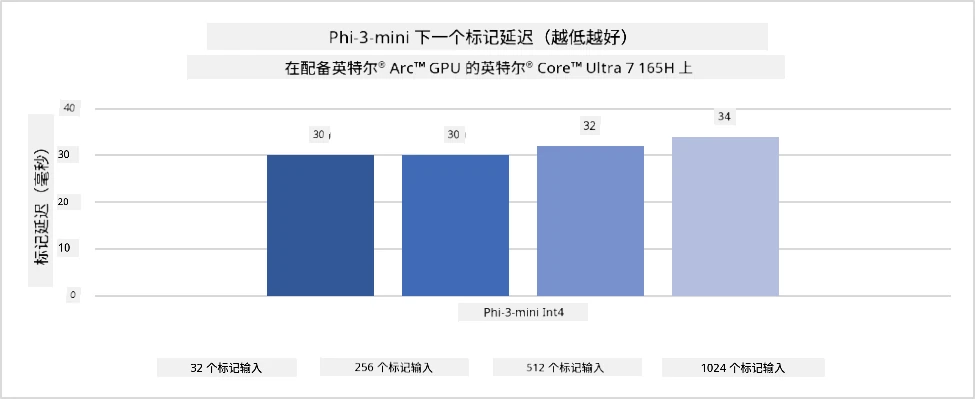
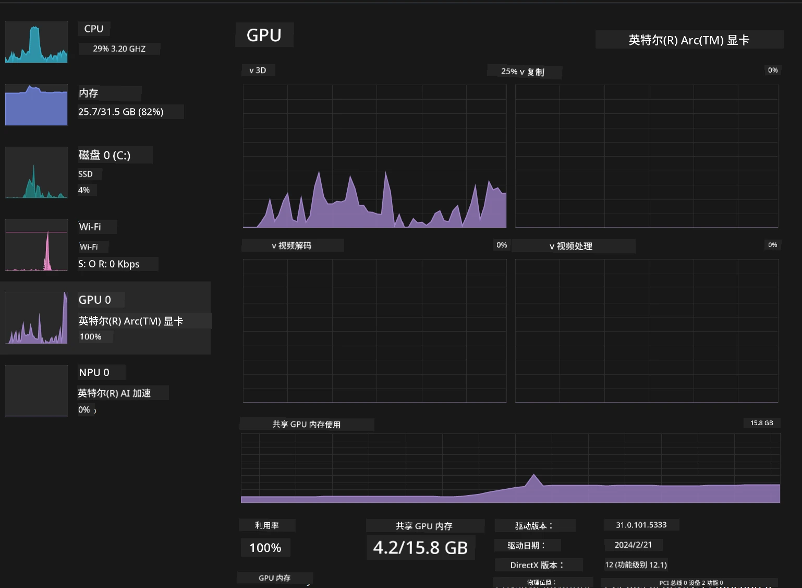

# **在 AI PC 上推理 Phi-3**

随着生成式 AI 的发展和边缘设备硬件能力的提升，越来越多的生成式 AI 模型可以集成到用户的自带设备（BYOD）中。AI PC 就是其中之一。自 2024 年起，Intel、AMD 和 Qualcomm 与 PC 厂商合作，通过硬件改造推出了支持本地化生成式 AI 模型部署的 AI PC。本文将聚焦 Intel AI PC，探讨如何在 Intel AI PC 上部署 Phi-3。

### 什么是 NPU

NPU（神经网络处理单元）是集成在更大 SoC 中的专用处理器或处理单元，专门用于加速神经网络运算和 AI 任务。与通用 CPU 和 GPU 不同，NPU 针对数据驱动的并行计算进行了优化，能够高效处理大量多媒体数据（如视频和图像）以及神经网络数据。它们特别擅长处理 AI 相关任务，如语音识别、视频通话中的背景虚化，以及照片或视频编辑中的目标检测等。

## NPU 与 GPU 的区别

虽然许多 AI 和机器学习任务运行在 GPU 上，但 GPU 和 NPU 之间存在关键区别。  
GPU 以其并行计算能力著称，但并非所有 GPU 在图形处理之外的任务中都同样高效。相比之下，NPU 是专门为神经网络运算中的复杂计算设计的，因此在 AI 任务中表现尤为出色。

总结来说，NPU 是加速 AI 计算的数学高手，是 AI PC 时代的重要推动力！

***本示例基于 Intel 最新的 Intel Core Ultra 处理器***

## **1. 使用 NPU 运行 Phi-3 模型**

Intel® NPU 设备是集成在 Intel 客户端 CPU 中的 AI 推理加速器，从 Intel® Core™ Ultra 代（前称 Meteor Lake）开始支持。它能够高效节能地执行人工神经网络任务。




**Intel NPU 加速库**

Intel NPU 加速库 [https://github.com/intel/intel-npu-acceleration-library](https://github.com/intel/intel-npu-acceleration-library) 是一个 Python 库，旨在利用 Intel 神经网络处理单元（NPU）的强大计算能力，提高应用程序的运行效率，支持兼容硬件上的高速计算。

这是在搭载 Intel® Core™ Ultra 处理器的 AI PC 上运行 Phi-3-mini 的示例。


使用 pip 安装 Python 库

```bash

   pip install intel-npu-acceleration-library

```

***注意*** 项目仍在开发中，但参考模型已经非常完善。

### **使用 Intel NPU 加速库运行 Phi-3**

利用 Intel NPU 加速时，该库不会影响传统的编码过程。你只需使用该库对原始 Phi-3 模型进行量化，如 FP16、INT8、INT4 等。

```python
from transformers import AutoTokenizer, pipeline,TextStreamer
from intel_npu_acceleration_library import NPUModelForCausalLM, int4
from intel_npu_acceleration_library.compiler import CompilerConfig
import warnings

model_id = "microsoft/Phi-3-mini-4k-instruct"

compiler_conf = CompilerConfig(dtype=int4)
model = NPUModelForCausalLM.from_pretrained(
    model_id, use_cache=True, config=compiler_conf, attn_implementation="sdpa"
).eval()

tokenizer = AutoTokenizer.from_pretrained(model_id)

text_streamer = TextStreamer(tokenizer, skip_prompt=True)
```

量化成功后，继续执行调用 NPU 运行 Phi-3 模型。

```python
generation_args = {
   "max_new_tokens": 1024,
   "return_full_text": False,
   "temperature": 0.3,
   "do_sample": False,
   "streamer": text_streamer,
}

pipe = pipeline(
   "text-generation",
   model=model,
   tokenizer=tokenizer,
)

query = "<|system|>You are a helpful AI assistant.<|end|><|user|>Can you introduce yourself?<|end|><|assistant|>"

with warnings.catch_warnings():
    warnings.simplefilter("ignore")
    pipe(query, **generation_args)
```

执行代码时，可以通过任务管理器查看 NPU 的运行状态。


***示例***：[AIPC_NPU_DEMO.ipynb](../../../../../code/03.Inference/AIPC/AIPC_NPU_DEMO.ipynb)

## **2. 使用 DirectML + ONNX Runtime 运行 Phi-3 模型**

### **什么是 DirectML**

[DirectML](https://github.com/microsoft/DirectML) 是一个高性能、硬件加速的 DirectX 12 机器学习库。DirectML 为广泛支持的硬件和驱动提供 GPU 加速，包括 AMD、Intel、NVIDIA 和 Qualcomm 等厂商所有支持 DirectX 12 的 GPU。

作为独立使用时，DirectML API 是一个低级别的 DirectX 12 库，适合高性能、低延迟的应用，如框架、游戏和其他实时应用。DirectML 与 Direct3D 12 的无缝互操作性、低开销以及跨硬件的一致性，使其非常适合在追求高性能且需要结果可靠可预测的场景中加速机器学习。

***注意***：最新的 DirectML 已支持 NPU（https://devblogs.microsoft.com/directx/introducing-neural-processor-unit-npu-support-in-directml-developer-preview/）

### DirectML 与 CUDA 的能力和性能对比：

**DirectML** 是微软开发的机器学习库，旨在加速 Windows 设备上的机器学习工作负载，包括台式机、笔记本和边缘设备。  
- 基于 DX12：DirectML 构建于 DirectX 12 之上，支持广泛的 GPU 硬件，包括 NVIDIA 和 AMD。  
- 支持范围广：利用 DX12，DirectML 可在任何支持 DX12 的 GPU 上运行，包括集成显卡。  
- 图像处理：DirectML 使用神经网络处理图像和其他数据，适合图像识别、目标检测等任务。  
- 易于设置：DirectML 设置简单，无需 GPU 厂商特定的 SDK 或库。  
- 性能表现：在某些情况下，DirectML 性能良好，甚至比 CUDA 更快，尤其是某些特定工作负载。  
- 局限性：但在 float16 大批量处理时，DirectML 可能表现较慢。

**CUDA** 是 NVIDIA 的并行计算平台和编程模型，允许开发者利用 NVIDIA GPU 的强大计算能力进行通用计算，包括机器学习和科学模拟。  
- NVIDIA 专用：CUDA 与 NVIDIA GPU 紧密集成，专为其设计。  
- 高度优化：为 GPU 加速任务提供卓越性能，尤其是在 NVIDIA GPU 上。  
- 广泛应用：许多机器学习框架（如 TensorFlow 和 PyTorch）支持 CUDA。  
- 可定制性：开发者可针对特定任务调优 CUDA 设置，实现最佳性能。  
- 局限性：CUDA 依赖 NVIDIA 硬件，限制了跨不同 GPU 的兼容性。

### 选择 DirectML 还是 CUDA

选择 DirectML 还是 CUDA 取决于具体使用场景、硬件条件和个人偏好。  
如果需要更广泛的兼容性和简便的设置，DirectML 是不错的选择；如果拥有 NVIDIA GPU 并追求高度优化的性能，CUDA 依然是强有力的方案。总之，两者各有优劣，建议根据需求和硬件环境做出选择。

### **使用 ONNX Runtime 进行生成式 AI**

在 AI 时代，AI 模型的可移植性非常重要。ONNX Runtime 可以轻松将训练好的模型部署到不同设备。开发者无需关注推理框架，使用统一的 API 即可完成模型推理。在生成式 AI 时代，ONNX Runtime 也进行了代码优化（https://onnxruntime.ai/docs/genai/）。通过优化后的 ONNX Runtime，量化后的生成式 AI 模型可以在不同终端上推理。使用 ONNX Runtime 进行生成式 AI，可以通过 Python、C#、C/C++ 调用 AI 模型 API，当然，在 iPhone 上部署时可以利用 C++ 的 ONNX Runtime 生成式 AI API。

[示例代码](https://github.com/Azure-Samples/Phi-3MiniSamples/tree/main/onnx)

***编译生成式 AI 的 ONNX Runtime 库***

```bash

winget install --id=Kitware.CMake  -e

git clone https://github.com/microsoft/onnxruntime.git

cd .\onnxruntime\

./build.bat --build_shared_lib --skip_tests --parallel --use_dml --config Release

cd ../

git clone https://github.com/microsoft/onnxruntime-genai.git

cd .\onnxruntime-genai\

mkdir ort

cd ort

mkdir include

mkdir lib

copy ..\onnxruntime\include\onnxruntime\core\providers\dml\dml_provider_factory.h ort\include

copy ..\onnxruntime\include\onnxruntime\core\session\onnxruntime_c_api.h ort\include

copy ..\onnxruntime\build\Windows\Release\Release\*.dll ort\lib

copy ..\onnxruntime\build\Windows\Release\Release\onnxruntime.lib ort\lib

python build.py --use_dml


```

**安装库**

```bash

pip install .\onnxruntime_genai_directml-0.3.0.dev0-cp310-cp310-win_amd64.whl

```

运行结果如下


***示例***：[AIPC_DirectML_DEMO.ipynb](../../../../../code/03.Inference/AIPC/AIPC_DirectML_DEMO.ipynb)

## **3. 使用 Intel OpenVINO 运行 Phi-3 模型**

### **什么是 OpenVINO**

[OpenVINO](https://github.com/openvinotoolkit/openvino) 是一个开源工具包，用于优化和部署深度学习模型。它为来自 TensorFlow、PyTorch 等流行框架的视觉、音频和语言模型提供加速性能。开始使用 OpenVINO。OpenVINO 也可以结合 CPU 和 GPU 来运行 Phi-3 模型。

***注意***：目前 OpenVINO 尚不支持 NPU。

### **安装 OpenVINO 库**

```bash

 pip install git+https://github.com/huggingface/optimum-intel.git

 pip install git+https://github.com/openvinotoolkit/nncf.git

 pip install openvino-nightly

```

### **使用 OpenVINO 运行 Phi-3**

与 NPU 类似，OpenVINO 通过运行量化模型来调用生成式 AI 模型。我们需要先对 Phi-3 模型进行量化，并通过 optimum-cli 在命令行完成模型量化。

**INT4**

```bash

optimum-cli export openvino --model "microsoft/Phi-3-mini-4k-instruct" --task text-generation-with-past --weight-format int4 --group-size 128 --ratio 0.6  --sym  --trust-remote-code ./openvinomodel/phi3/int4

```

**FP16**

```bash

optimum-cli export openvino --model "microsoft/Phi-3-mini-4k-instruct" --task text-generation-with-past --weight-format fp16 --trust-remote-code ./openvinomodel/phi3/fp16

```

转换后的格式如下图所示


通过 OVModelForCausalLM 加载模型路径（model_dir）、相关配置（ov_config = {"PERFORMANCE_HINT": "LATENCY", "NUM_STREAMS": "1", "CACHE_DIR": ""}）以及硬件加速设备（GPU.0）

```python

ov_model = OVModelForCausalLM.from_pretrained(
     model_dir,
     device='GPU.0',
     ov_config=ov_config,
     config=AutoConfig.from_pretrained(model_dir, trust_remote_code=True),
     trust_remote_code=True,
)

```

执行代码时，可以通过任务管理器查看 GPU 的运行状态



***示例***：[AIPC_OpenVino_Demo.ipynb](../../../../../code/03.Inference/AIPC/AIPC_OpenVino_Demo.ipynb)

### ***注意***：以上三种方法各有优势，但建议 AI PC 推理优先使用 NPU 加速。

**免责声明**：  
本文件使用 AI 翻译服务 [Co-op Translator](https://github.com/Azure/co-op-translator) 进行翻译。虽然我们力求准确，但请注意，自动翻译可能包含错误或不准确之处。原始文件的母语版本应被视为权威来源。对于重要信息，建议采用专业人工翻译。对于因使用本翻译而产生的任何误解或误释，我们概不负责。