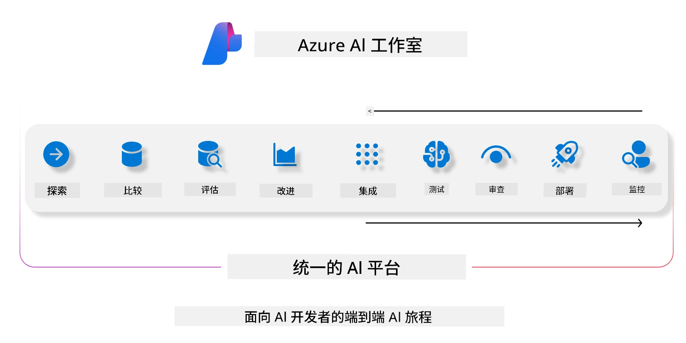
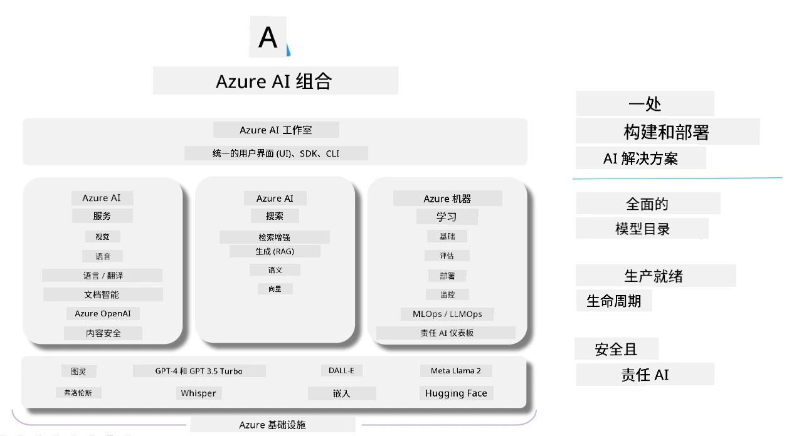

# **使用 Microsoft Foundry 进行评估**

如何使用 [Microsoft Foundry](https://ai.azure.com?WT.mc_id=aiml-138114-kinfeylo) 评估您的生成式 AI 应用程序。无论您是在评估单轮还是多轮对话，Microsoft Foundry 都提供用于评估模型性能和安全性的工具。

## 如何使用 Microsoft Foundry 评估生成式 AI 应用
更多详细说明请参见 [Microsoft Foundry 文档](https://learn.microsoft.com/azure/ai-studio/how-to/evaluate-generative-ai-app?WT.mc_id=aiml-138114-kinfeylo)

以下是入门步骤：

## 在 Microsoft Foundry 中评估生成式 AI 模型

**先决条件**

- 以 CSV 或 JSON 格式的测试数据集。
- 已部署的生成式 AI 模型（例如 Phi-3、GPT 3.5、GPT 4 或 Davinci 模型）。
- 一个运行时环境，包含用于执行评估的计算实例。

## 内置评估指标

Microsoft Foundry 允许您评估单轮以及复杂的多轮对话。
对于基于检索增强生成（RAG）场景，其中模型基于特定数据，您可以使用内置的评估指标来评估性能。
此外，您还可以评估一般的单轮问答场景（非 RAG）。

## 创建评估运行

从 Microsoft Foundry 用户界面，导航到 Evaluate 页面或 Prompt Flow 页面。
按照评估创建向导设置评估运行。您可以为评估提供可选名称。
选择与您的应用目标相符的场景。
选择一个或多个评估指标来评估模型输出。

## 自定义评估流程（可选）

为了更大的灵活性，您可以建立自定义评估流程。根据您的具体需求定制评估过程。

## 查看结果

完成评估运行后，在 Microsoft Foundry 中记录、查看并分析详细的评估指标。
深入了解您的应用能力和局限性。

**注意** Microsoft Foundry 当前处于公开预览阶段，建议仅用于实验和开发目的。对于生产工作负载，请考虑其他选项。
请参阅官方 [AI Foundry 文档](https://learn.microsoft.com/azure/ai-studio/?WT.mc_id=aiml-138114-kinfeylo) 获取更多细节和逐步指导。

---

<!-- CO-OP TRANSLATOR DISCLAIMER START -->
**免责声明**：  
本文件通过AI翻译服务[Co-op Translator](https://github.com/Azure/co-op-translator)进行翻译。尽管我们努力确保准确性，但请注意，自动翻译可能存在错误或不准确之处。原始语言的文档应被视为权威来源。对于重要信息，建议采用专业人工翻译。对于因使用本翻译而产生的任何误解或误译，我们不承担任何责任。
<!-- CO-OP TRANSLATOR DISCLAIMER END -->