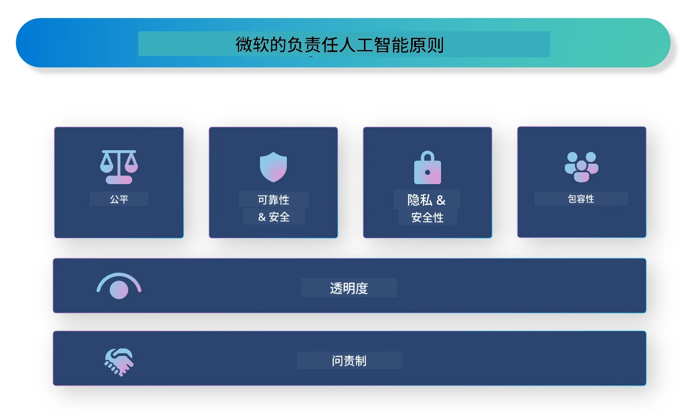

# **介绍负责任的人工智能**

[Microsoft Responsible AI](https://www.microsoft.com/ai/responsible-ai?WT.mc_id=aiml-138114-kinfeylo) 是一项旨在帮助开发人员和组织构建透明、值得信赖且负责任的人工智能系统的计划。该计划提供指导和资源，用于开发符合隐私、公平性和透明性等伦理原则的负责任的人工智能解决方案。我们还将探讨构建负责任人工智能系统所面临的一些挑战和最佳实践。

## Microsoft Responsible AI 概述

**伦理原则**

Microsoft Responsible AI 遵循一系列伦理原则，如隐私、公平性、透明度、责任制和安全性。这些原则旨在确保人工智能系统以伦理和负责任的方式开发。

**透明的人工智能**

Microsoft Responsible AI 强调人工智能系统透明性的重要性。这包括提供清晰的人工智能模型工作原理说明，以及确保数据来源和算法公开可用。

**负责任的人工智能**

[Microsoft Responsible AI](https://www.microsoft.com/ai/responsible-ai?WT.mc_id=aiml-138114-kinfeylo) 推动开发负责任的人工智能系统，这些系统能够提供人工智能模型决策过程的洞见，帮助用户理解并信任人工智能系统的输出。

**包容性**

人工智能系统应设计为惠及所有人。Microsoft 旨在创建考虑多元视角并避免偏见或歧视的包容性人工智能。

**可靠性和安全性**

确保人工智能系统的可靠性和安全性至关重要。Microsoft 致力于构建性能稳定且避免有害后果的健壮模型。

**人工智能中的公平性**

Microsoft Responsible AI 认识到如果人工智能系统基于存在偏见的数据或算法训练，可能会延续偏见。该计划提供开发公平人工智能系统的指导，确保不基于种族、性别或年龄等因素进行歧视。

**隐私和安全**

Microsoft Responsible AI 强调保护用户隐私和数据安全在人工智能系统中的重要性。这包括实施强大的数据加密和访问控制，并定期审计人工智能系统的漏洞。

**责任和问责制**

Microsoft Responsible AI 推动人工智能开发和部署中的责任与问责制。这包括确保开发人员和组织意识到人工智能系统潜在风险，并采取措施减轻这些风险。

## 构建负责任人工智能系统的最佳实践

**使用多样化数据集开发人工智能模型**

为了避免人工智能系统中的偏见，重要的是使用代表多种视角和经验的多样化数据集。

**使用可解释的人工智能技术**

可解释的人工智能技术帮助用户理解人工智能模型如何做出决策，从而增强对系统的信任。

**定期审计人工智能系统漏洞**

定期审计人工智能系统有助于识别需要解决的潜在风险和漏洞。

**实施强数据加密和访问控制**

数据加密和访问控制可以帮助保护人工智能系统中的用户隐私和安全。

**在人工智能开发中遵守伦理原则**

遵守公平、透明和问责等伦理原则，有助于建立对人工智能系统的信任，并确保其以负责任的方式开发。

## 使用 AI Foundry 实现负责任的人工智能

[Microsoft Foundry](https://ai.azure.com?WT.mc_id=aiml-138114-kinfeylo) 是一个强大的平台，使开发人员和组织能够快速创建智能、前沿、市场就绪且负责任的应用程序。以下是 Microsoft Foundry 的一些关键功能和能力：

**开箱即用的 API 和模型**

Microsoft Foundry 提供预构建和可定制的 API 和模型，涵盖广泛的人工智能任务，包括生成式人工智能、面向会话的自然语言处理、搜索、监控、翻译、语音、视觉和决策。

**Prompt Flow**

Microsoft Foundry 中的 Prompt Flow 使您能够创建对话式人工智能体验，设计和管理对话流程，简化聊天机器人、虚拟助手和其他交互应用的构建。

**检索增强生成（RAG）**

RAG 是结合基于检索和生成方法的技术，通过利用预先存在的知识（检索）和创新生成（生成）来提升生成响应的质量。

**生成式人工智能的评估和监控指标**

Microsoft Foundry 提供评估和监控生成式人工智能模型的工具，您可以评估其性能、公平性和其他重要指标，确保负责任的部署。此外，如果您创建了仪表板，可以使用 Azure Machine Learning Studio 中的无代码 UI 根据 [Responsible AI Toolbox](https://responsibleaitoolbox.ai/?WT.mc_id=aiml-138114-kinfeylo) Python 库定制并生成负责任人工智能仪表板和相关评分卡。该评分卡帮助您与技术和非技术利益相关者分享有关公平性、特征重要性和其他负责任部署考虑的关键见解。

使用 AI Foundry 实现负责任的人工智能，您可以遵循以下最佳实践：

**定义人工智能系统的问题和目标**

在开始开发过程之前，明确人工智能系统旨在解决的问题或目标非常重要，这有助于确定构建有效模型所需的数据、算法和资源。

**收集和预处理相关数据**

用于训练人工智能系统的数据质量和数量对其性能有重大影响，因此收集相关数据、清洗和预处理数据，并确保数据具有代表性非常重要。

**选择合适的评估**

存在多种评估算法，需根据您的数据和问题选择最合适的算法。

**评估和解释模型**

构建人工智能模型后，需使用适当的指标评估其性能，并以透明的方式解释结果。这有助于识别模型中的偏见或局限，并在必要时进行改进。

**确保透明性和可解释性**

人工智能系统应具备透明性和可解释性，使用户能够理解其工作原理和决策过程。这对于影响重大的人类生活领域（如医疗、金融和法律系统）尤为重要。

**监控和更新模型**

人工智能系统应持续监控和更新，确保随时间保持准确和有效。这需要持续维护、测试和重新训练模型。

总结，Microsoft Responsible AI 是一项旨在帮助开发人员和组织构建透明、值得信赖和负责任人工智能系统的计划。请记住，负责任的人工智能实施至关重要，Microsoft Foundry 致力于使其在组织中切实可行。通过遵循伦理原则和最佳实践，我们可以确保人工智能系统以负责任的方式开发和部署，造福整个社会。

---

<!-- CO-OP TRANSLATOR DISCLAIMER START -->
**免责声明**：
本文件通过 AI 翻译服务 [Co-op Translator](https://github.com/Azure/co-op-translator) 进行翻译。虽然我们努力确保准确性，但请注意自动翻译可能包含错误或不准确之处。原始语言的文档应被视为权威来源。对于关键信息，建议使用专业人工翻译。对于因使用本翻译而产生的任何误解或误释，我们概不负责。
<!-- CO-OP TRANSLATOR DISCLAIMER END -->