# 在 Microsoft Foundry 中评估微调的 Phi-3 / Phi-3.5 模型，聚焦微软的负责任 AI 原则

此端到端（E2E）示例基于微软技术社区的指南“[在 Microsoft Foundry 中评估微调的 Phi-3 / 3.5 模型，聚焦微软的负责任 AI](https://techcommunity.microsoft.com/blog/educatordeveloperblog/evaluate-fine-tuned-phi-3--3-5-models-in-azure-ai-studio-focusing-on-microsofts-/4227850?WT.mc_id=aiml-137032-kinfeylo)”。

## 概述

### 如何在 Microsoft Foundry 中评估微调的 Phi-3 / Phi-3.5 模型的安全性和性能？

微调模型有时可能导致无意或不期望的响应。为了确保模型保持安全且有效，评估模型生成有害内容的潜力以及产生准确、相关和连贯响应的能力至关重要。本教程将教您如何评估集成到 Microsoft Foundry 中 Prompt flow 的微调 Phi-3 / Phi-3.5 模型的安全性和性能。

以下是 Microsoft Foundry 的评估流程。

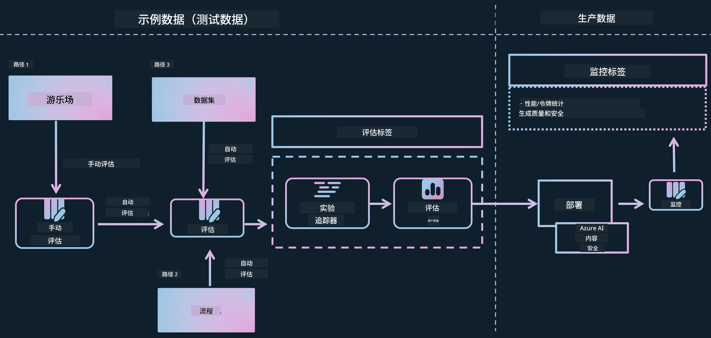

*图片来源：[生成式 AI 应用的评估](https://learn.microsoft.com/azure/ai-studio/concepts/evaluation-approach-gen-ai?wt.mc_id%3Dstudentamb_279723)*

> [!NOTE]
>
> 如需了解更详细的信息及探索有关 Phi-3 / Phi-3.5 的更多资源，请访问 [Phi-3CookBook](https://github.com/microsoft/Phi-3CookBook?wt.mc_id=studentamb_279723)。

### 先决条件

- [Python](https://www.python.org/downloads)
- [Azure 订阅](https://azure.microsoft.com/free?wt.mc_id=studentamb_279723)
- [Visual Studio Code](https://code.visualstudio.com)
- 微调的 Phi-3 / Phi-3.5 模型

### 目录

1. [**场景 1：Microsoft Foundry 的 Prompt flow 评估简介**](../../../../../../md/02.Application/01.TextAndChat/Phi3)

    - [安全性评估简介](../../../../../../md/02.Application/01.TextAndChat/Phi3)
    - [性能评估简介](../../../../../../md/02.Application/01.TextAndChat/Phi3)

1. [**场景 2：在 Microsoft Foundry 中评估 Phi-3 / Phi-3.5 模型**](../../../../../../md/02.Application/01.TextAndChat/Phi3)

    - [开始之前](../../../../../../md/02.Application/01.TextAndChat/Phi3)
    - [部署 Azure OpenAI 以评估 Phi-3 / Phi-3.5 模型](../../../../../../md/02.Application/01.TextAndChat/Phi3)
    - [使用 Microsoft Foundry 的 Prompt flow 评估微调的 Phi-3 / Phi-3.5 模型](../../../../../../md/02.Application/01.TextAndChat/Phi3)

1. [恭喜！](../../../../../../md/02.Application/01.TextAndChat/Phi3)

## **场景 1：Microsoft Foundry 的 Prompt flow 评估简介**

### 安全性评估简介

为了确保你的 AI 模型符合伦理且安全，有必要依据微软的负责任 AI 原则对其进行评估。在 Microsoft Foundry 中，安全性评估可以让您检测模型是否容易受到越狱攻击及其生成有害内容的可能性，这与这些原则直接相关。

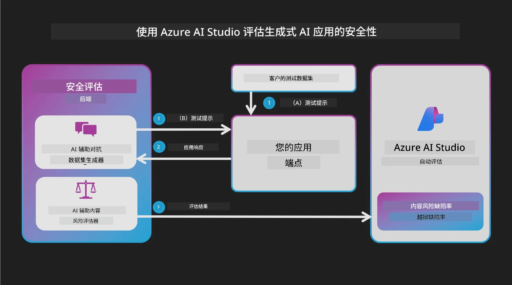

*图片来源：[生成式 AI 应用的评估](https://learn.microsoft.com/azure/ai-studio/concepts/evaluation-approach-gen-ai?wt.mc_id%3Dstudentamb_279723)*

#### 微软的负责任AI原则

在开始技术步骤之前，理解微软的负责任 AI 原则至关重要。该原则是一套伦理框架，旨在指导 AI 系统的负责任开发、部署和运行。这些原则指导着 AI 系统的负责任设计、开发和部署，确保 AI 技术以公平、透明和包容的方式构建。这些原则是评估 AI 模型安全性的基础。

微软的负责任 AI 原则包括：

- **公平与包容**：AI 系统应公平对待所有人，避免对处境类似的人群产生不同影响。例如，当 AI 系统为医疗治疗、贷款申请或就业提供指导时，应对有类似症状、财务状况或职业资格的所有人做出相同的建议。

- **可靠性与安全性**：建立信任的关键是确保 AI 系统运行可靠、安全且持续一致。这些系统应能按原设计运行，安全响应意外状况，并抵抗有害操控。它们的行为及能应对的各种状况反映了开发者在设计和测试阶段预见的情况和环境。

- **透明度**：当 AI 系统帮助做出对人们生活有重大影响的决策时，必须让人们理解这些决策的生成方式。例如，银行可能使用 AI 系统决定某人是否具有信贷资格；公司可能用 AI 系统决定最合适的候选人。

- **隐私与安全**：随着 AI 日益普及，保护隐私和保障个人及商业信息安全变得更加重要且复杂。AI 需要数据访问才能做出准确、知情的预测和决策，因此隐私和数据安全尤为重要。

- **问责制**：设计和部署 AI 系统的人应对系统的运行负责。组织应借鉴行业标准建立问责规范，确保 AI 系统不会成为影响人们生活决策的最终权威。同时确保人在高度自主 
1. 登录 [Microsoft Foundry](https://ai.azure.com/?wt.mc_id=studentamb_279723)。

1. 从左侧选项卡中选择 **All hubs**。

1. 从导航菜单中选择 **+ New hub**。

    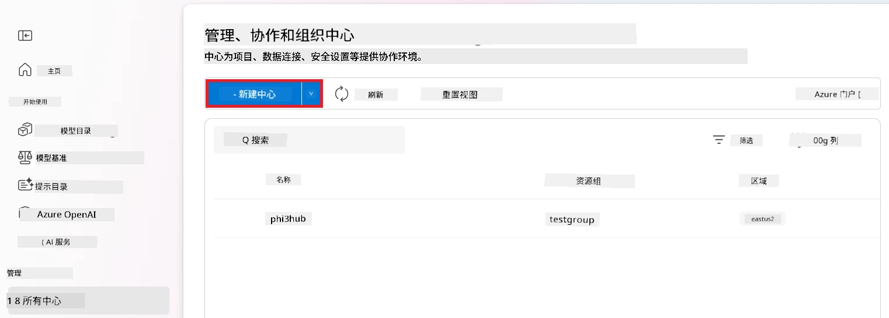

1. 执行以下操作：

    - 输入 **Hub name**。该值必须唯一。
    - 选择你的 Azure **Subscription**。
    - 选择要使用的 **Resource group**（如有需要，可新建）。
    - 选择你想要使用的 **Location**。
    - 选择要使用的 **Connect Azure AI Services**（如有需要，可新建）。
    - 选择 **Connect Azure AI Search** 时选择 **Skip connecting**。

    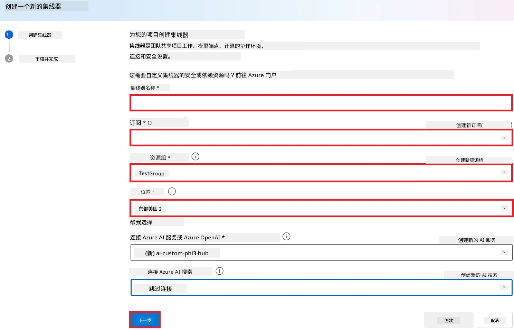

1. 选择 **Next**。

#### 创建 Microsoft Foundry 项目

1. 在你创建的 Hub 中，从左侧选项卡选择 **All projects**。

1. 从导航菜单中选择 **+ New project**。

    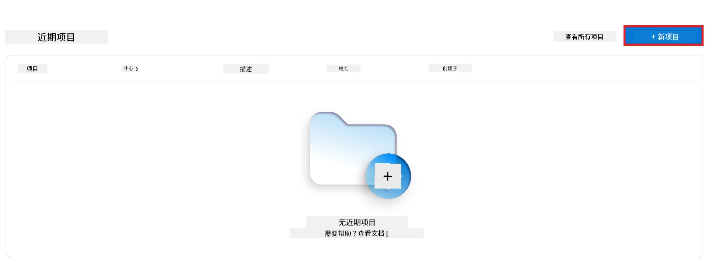

1. 输入 **Project name**。该值必须是唯一的。

    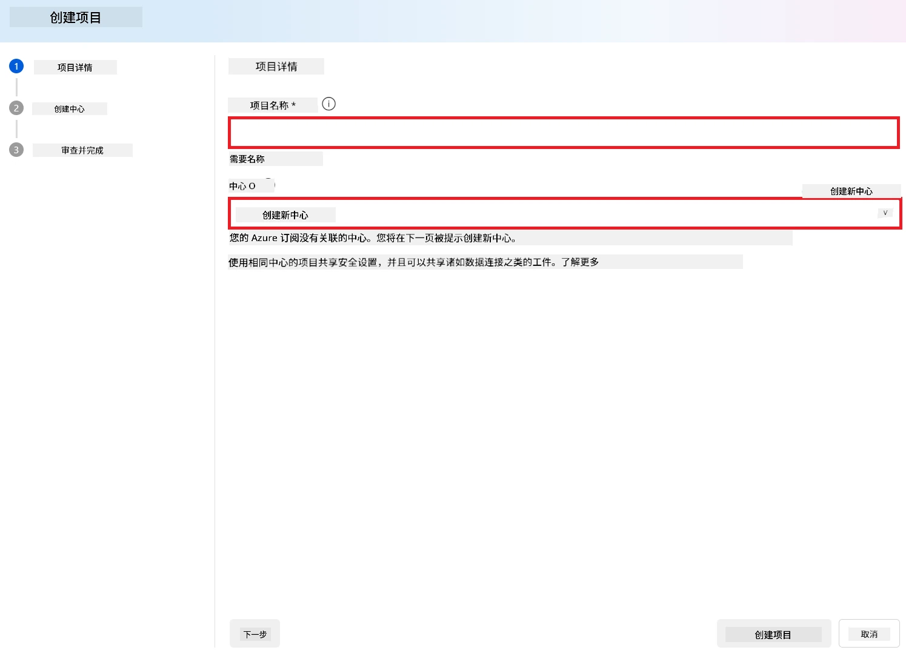

1. 选择 **Create a project**。

#### 为微调的 Phi-3 / Phi-3.5 模型添加自定义连接

要将你的自定义 Phi-3 / Phi-3.5 模型集成到 Prompt flow 中，你需要在自定义连接中保存模型的端点和密钥。此设置确保 Prompt flow 可以访问你的自定义 Phi-3 / Phi-3.5 模型。

#### 设置微调的 Phi-3 / Phi-3.5 模型的 api key 和 endpoint uri

1. 访问 [Azure ML Studio](https://ml.azure.com/home?wt.mc_id=studentamb_279723)。

1. 导航到你创建的 Azure 机器学习工作区。

1. 从左侧选项卡选择 **Endpoints**。

    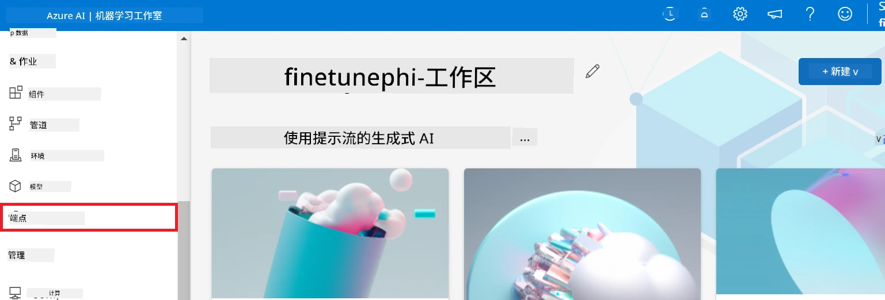

1. 选择你创建的端点。

    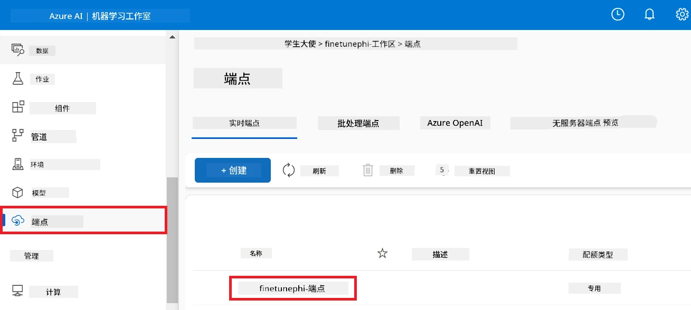

1. 从导航菜单选择 **Consume**。

1. 复制你的 **REST endpoint** 和 **Primary key**。

    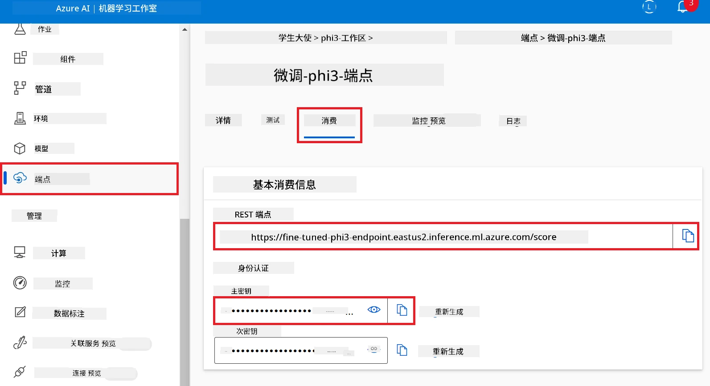

#### 添加自定义连接

1. 访问 [Microsoft Foundry](https://ai.azure.com/?wt.mc_id=studentamb_279723)。

1. 导航到你创建的 Microsoft Foundry 项目。

1. 在你创建的项目中，从左侧选项卡选择 **Settings**。

1. 选择 **+ New connection**。

    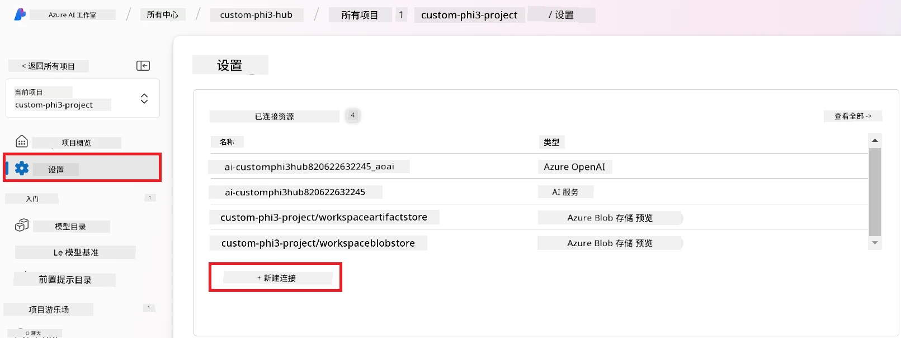

1. 从导航菜单选择 **Custom keys**。

    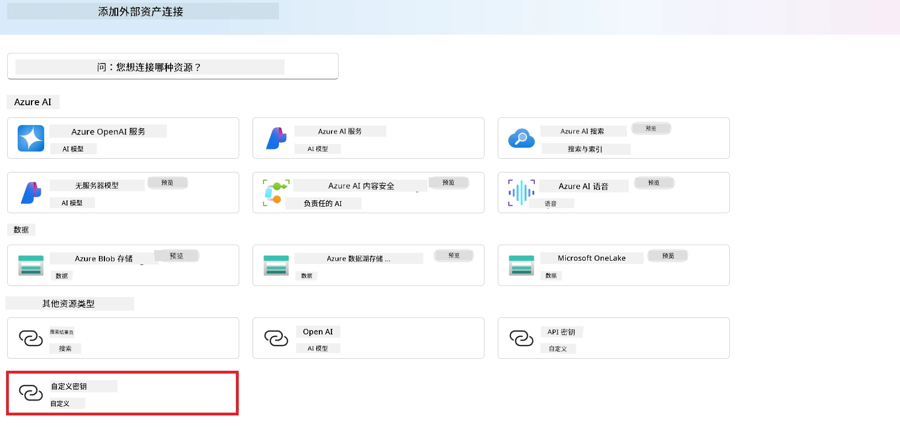

1. 执行以下操作：

    - 选择 **+ Add key value pairs**。
    - 键名输入 **endpoint**，并将你从 Azure ML Studio 复制的端点粘贴到值字段。
    - 再次选择 **+ Add key value pairs**。
    - 键名输入 **key**，并将你从 Azure ML Studio 复制的密钥粘贴到值字段。
    - 添加密钥后，选择 **is secret**，以防止密钥被泄露。

    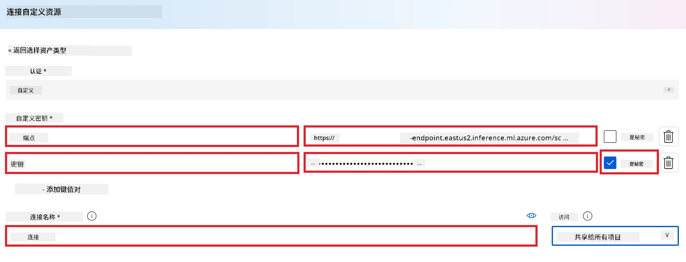

1. 选择 **Add connection**。

#### 创建 Prompt flow

你已在 Microsoft Foundry 中添加了自定义连接。现在，让我们使用以下步骤创建一个 Prompt flow。然后，你将把此 Prompt flow 连接到自定义连接，以便在 Prompt flow 中使用微调的模型。

1. 导航到你创建的 Microsoft Foundry 项目。

1. 从左侧选项卡选择 **Prompt flow**。

1. 从导航菜单选择 **+ Create**。

    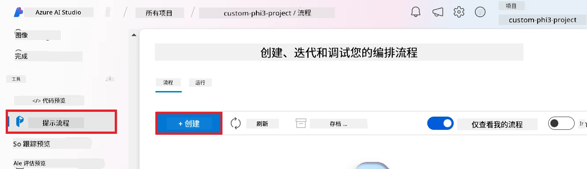

1. 从导航菜单选择 **Chat flow**。

    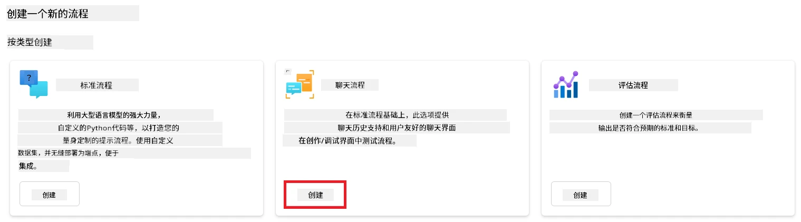

1. 输入要使用的 **Folder name**。

    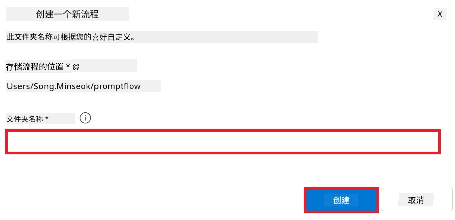

1. 选择 **Create**。

#### 设置 Prompt flow 来与你的自定义 Phi-3 / Phi-3.5 模型聊天

你需要将微调的 Phi-3 / Phi-3.5 模型集成到 Prompt flow 中。然而，现有的 Prompt flow 并非为此设计。因此，你必须重新设计 Prompt flow，以实现自定义模型的集成。

1. 在 Prompt flow 中，执行以下操作来重建现有流程：

    - 选择 **Raw file mode**。
    - 删除 *flow.dag.yml* 文件中所有现有代码。
    - 向 *flow.dag.yml* 添加以下代码。

        ```yml
        inputs:
          input_data:
            type: string
            default: "Who founded Microsoft?"

        outputs:
          answer:
            type: string
            reference: ${integrate_with_promptflow.output}

        nodes:
        - name: integrate_with_promptflow
          type: python
          source:
            type: code
            path: integrate_with_promptflow.py
          inputs:
            input_data: ${inputs.input_data}
        ```

    - 选择 **Save**。

    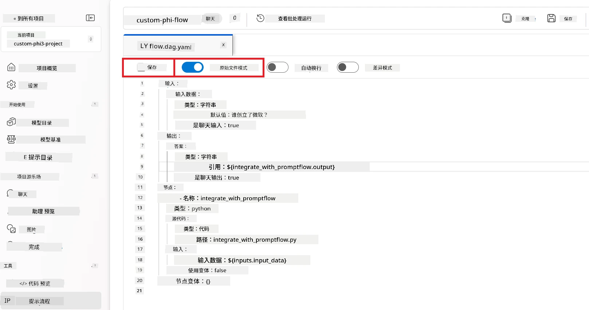

1. 在 *integrate_with_promptflow.py* 中添加以下代码，以在 Prompt flow 中使用自定义 Phi-3 / Phi-3.5 模型。

    ```python
    import logging
    import requests
    from promptflow import tool
    from promptflow.connections import CustomConnection

    # 日志设置
    logging.basicConfig(
        format="%(asctime)s - %(levelname)s - %(name)s - %(message)s",
        datefmt="%Y-%m-%d %H:%M:%S",
        level=logging.DEBUG
    )
    logger = logging.getLogger(__name__)

    def query_phi3_model(input_data: str, connection: CustomConnection) -> str:
        """
        Send a request to the Phi-3 / Phi-3.5 model endpoint with the given input data using Custom Connection.
        """

        # "connection" 是自定义连接的名称，"endpoint" 和 "key" 是自定义连接中的键
        endpoint_url = connection.endpoint
        api_key = connection.key

        headers = {
            "Content-Type": "application/json",
            "Authorization": f"Bearer {api_key}"
        }
    data = {
        "input_data": [input_data],
        "params": {
            "temperature": 0.7,
            "max_new_tokens": 128,
            "do_sample": True,
            "return_full_text": True
            }
        }
        try:
            response = requests.post(endpoint_url, json=data, headers=headers)
            response.raise_for_status()
            
            # 记录完整的 JSON 响应
            logger.debug(f"Full JSON response: {response.json()}")

            result = response.json()["output"]
            logger.info("Successfully received response from Azure ML Endpoint.")
            return result
        except requests.exceptions.RequestException as e:
            logger.error(f"Error querying Azure ML Endpoint: {e}")
            raise

    @tool
    def my_python_tool(input_data: str, connection: CustomConnection) -> str:
        """
        Tool function to process input data and query the Phi-3 / Phi-3.5 model.
        """
        return query_phi3_model(input_data, connection)

    ```

    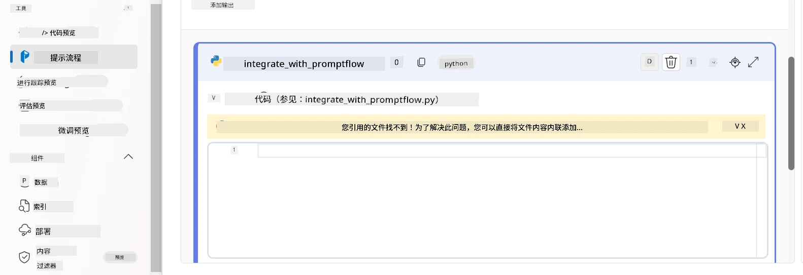

> [!NOTE]
> 有关如何在 Microsoft Foundry 中使用 Prompt flow 的更多详细信息，可参见 [Prompt flow in Microsoft Foundry](https://learn.microsoft.com/azure/ai-studio/how-to/prompt-flow)。

1. 选择 **Chat input** 和 **Chat output**，以启用与模型的聊天功能。

    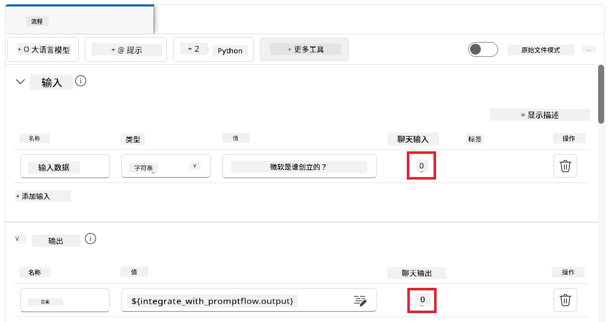

1. 现在你可以与自定义的 Phi-3 / Phi-3.5 模型聊天了。在下一练习中，你将学习如何启动 Prompt flow 并使用它与你的微调模型进行聊天。

> [!NOTE]
>
> 重建后的流程应如下图所示：
>
> 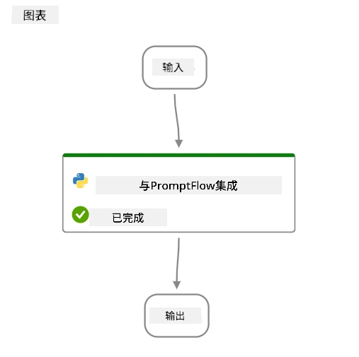
>

#### 启动 Prompt flow

1. 选择 **Start compute sessions** 启动 Prompt flow。

    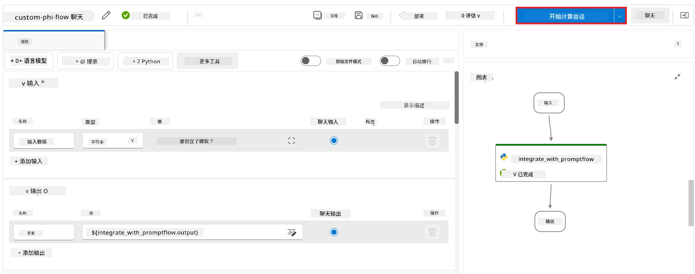

1. 选择 **Validate and parse input** 以更新参数。

    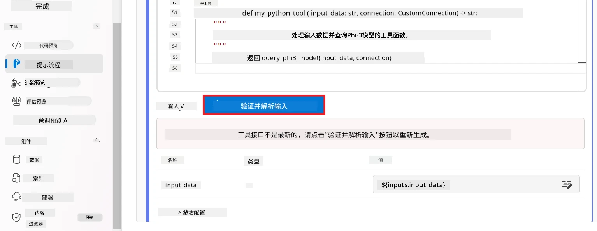

1. 选择指向你创建的自定义连接的 **connection** 值。例如，*connection*。

    

#### 与你的自定义 Phi-3 / Phi-3.5 模型聊天

1. 选择 **Chat**。

    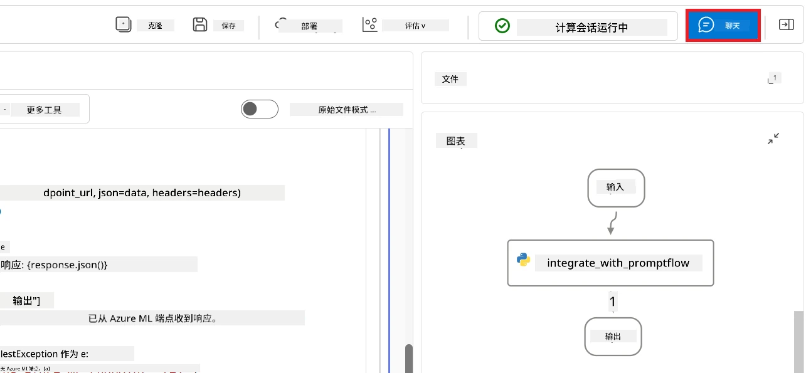

1. 以下是结果示例：现在你可以与你的自定义 Phi-3 / Phi-3.5 模型聊天。建议基于用于微调的数据提问。

    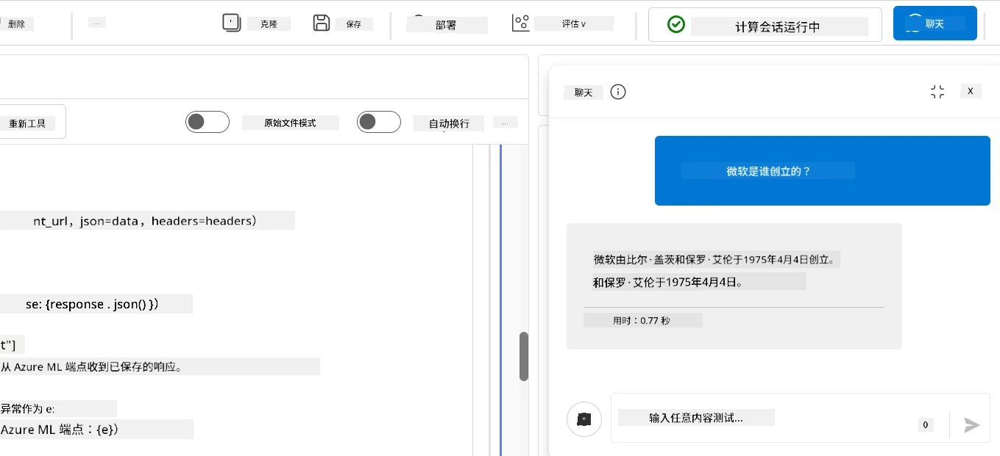

### 部署 Azure OpenAI 以评估 Phi-3 / Phi-3.5 模型

要评估 Microsoft Foundry 中的 Phi-3 / Phi-3.5 模型，你需要部署一个 Azure OpenAI 模型。该模型将用于评估 Phi-3 / Phi-3.5 模型的性能。

#### 部署 Azure OpenAI

1. 登录 [Microsoft Foundry](https://ai.azure.com/?wt.mc_id=studentamb_279723)。

1. 导航到你创建的 Microsoft Foundry 项目。

    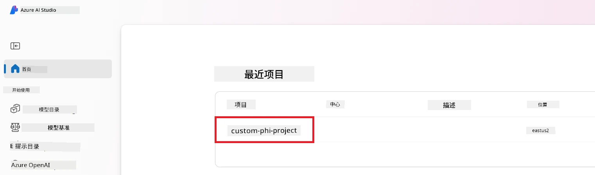

1. 在你创建的项目中，从左侧选项卡选择 **Deployments**。

1. 从导航菜单选择 **+ Deploy model**。

1. 选择 **Deploy base model**。

    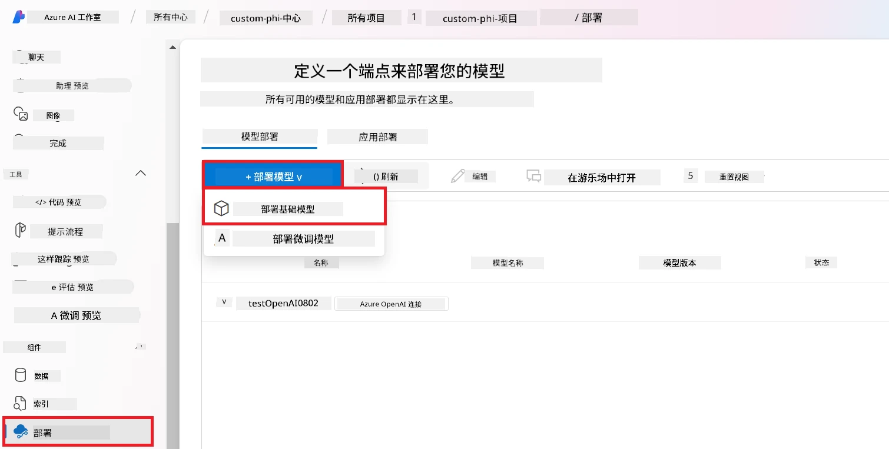

1. 选择你想使用的 Azure OpenAI 模型。例如，**gpt-4o**。

    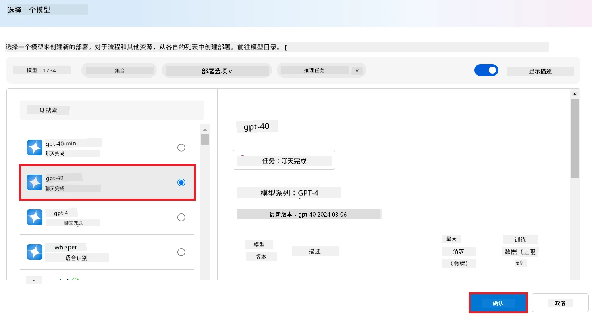

1. 选择 **Confirm**。

### 使用 Microsoft Foundry 的 Prompt flow 评估微调的 Phi-3 / Phi-3.5 模型

### 开始新评估

1. 访问 [Microsoft Foundry](https://ai.azure.com/?wt.mc_id=studentamb_279723)。

1. 导航到你创建的 Microsoft Foundry 项目。

    

1. 在你创建的项目中，从左侧选项卡选择 **Evaluation**。

1. 从导航菜单选择 **+ New evaluation**。

    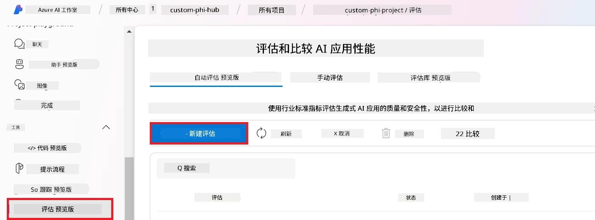

1. 选择 **Prompt flow** 评估。

    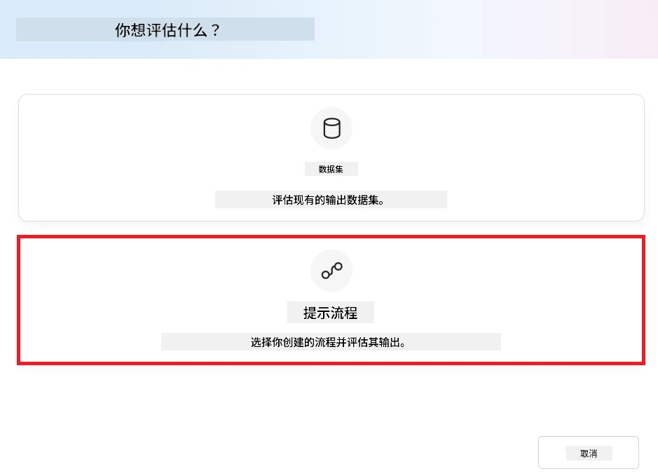

1. 执行以下操作：

    - 输入评估名称。该值必须唯一。
    - 选择任务类型为 **Question and answer without context**。因为本教程中使用的 **UlTRACHAT_200k** 数据集不包含上下文。
    - 选择要评估的 Prompt flow。

    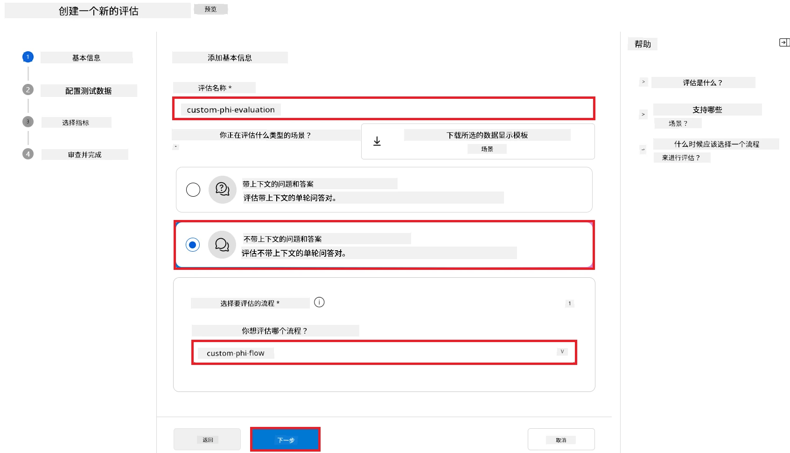

1. 选择 **Next**。

1. 执行以下操作：

    - 选择 **Add your dataset** 上传数据集。例如，可以上传测试数据集文件，如下载的 **ULTRACHAT_200k** 数据集附带的 *test_data.json1* 文件。
    - 选择与数据集匹配的 **Dataset column**。例如，使用 **ULTRACHAT_200k** 数据集时，选择 **${data.prompt}** 作为数据集列。

    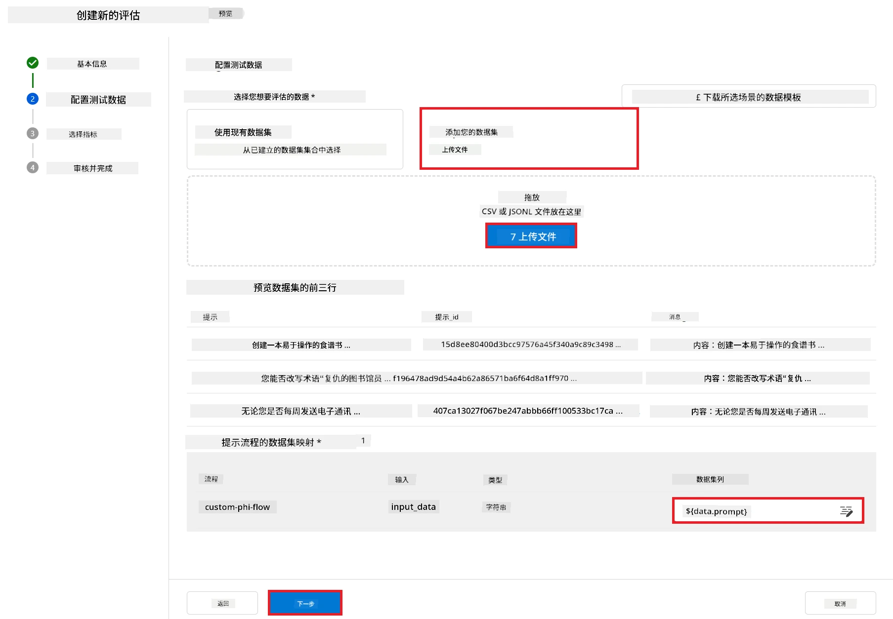

1. 选择 **Next**。

1. 执行以下操作以配置性能和质量指标：

    - 选择你要使用的性能和质量指标。
    - 选择你创建的用于评估的 Azure OpenAI 模型。例如，选择 **gpt-4o**。

    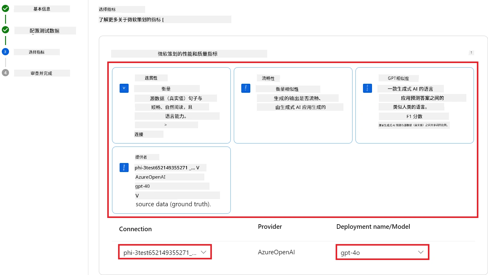

1. 执行以下操作以配置风险和安全指标：

    - 选择你要使用的风险和安全指标。
    - 选择用以计算缺陷率的阈值。例如，选择 **Medium**。
    - 对 **question**，设置 **Data source** 为 **{$data.prompt}**。
    - 对 **answer**，设置 **Data source** 为 **{$run.outputs.answer}**。
    - 对 **ground_truth**，设置 **Data source** 为 **{$data.message}**。

    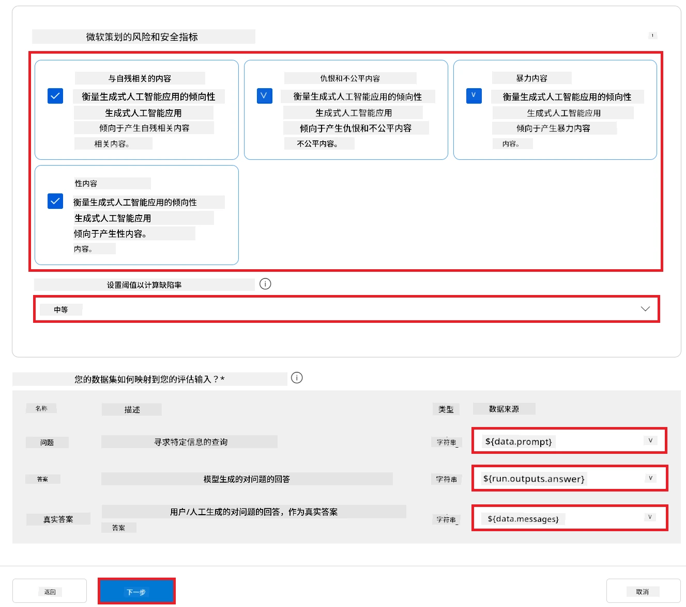

1. 选择 **Next**。

1. 选择 **Submit** 以开始评估。

1. 评估将需要一些时间完成。你可以在 **Evaluation** 选项卡中监控进度。

### 查看评估结果

> [!NOTE]
> 下面展示的结果仅用于说明评估过程。在本教程中，我们使用了一个基于相对较小数据集微调的模型，可能导致次优结果。实际结果可能根据数据集的大小、质量和多样性，以及模型的具体配置，有显著差异。

评估完成后，你可以查看性能和安全指标的评估结果。
1. 性能和质量指标：

    - 评估模型生成连贯、流畅且相关响应的效果。

    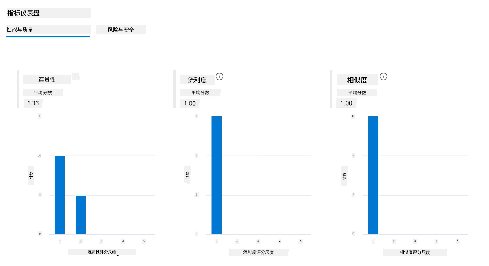

1. 风险和安全指标：

    - 确保模型输出安全且符合负责任的 AI 原则，避免任何有害或冒犯性内容。

    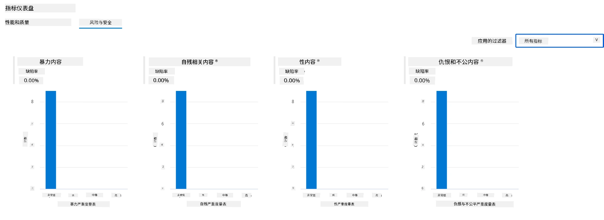

1. 您可以向下滚动查看**详细指标结果**。

    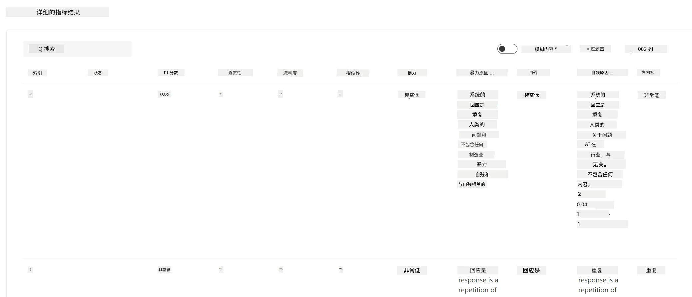

1. 通过评估您自定义的 Phi-3 / Phi-3.5 模型的性能和安全指标，您可以确认该模型不仅有效，而且遵循负责任的 AI 实践，准备好进行实际部署。

## 祝贺！

### 您已完成本教程

您已成功评估与 Microsoft Foundry 中的 Prompt flow 集成的微调 Phi-3 模型。这是确保您的 AI 模型不仅性能优异，还遵循微软的负责任 AI 原则，帮助您构建可信赖且可靠的 AI 应用程序的重要步骤。


## 清理 Azure 资源

清理您的 Azure 资源以避免产生额外费用。请登录 Azure 门户，删除以下资源：

- Azure 机器学习资源。
- Azure 机器学习模型端点。
- Microsoft Foundry 项目资源。
- Microsoft Foundry Prompt flow 资源。

### 下一步

#### 文档

- [使用负责任的 AI 仪表板评估 AI 系统](https://learn.microsoft.com/azure/machine-learning/concept-responsible-ai-dashboard?view=azureml-api-2&source=recommendations?wt.mc_id=studentamb_279723)
- [生成式 AI 的评估和监控指标](https://learn.microsoft.com/azure/ai-studio/concepts/evaluation-metrics-built-in?tabs=definition?wt.mc_id=studentamb_279723)
- [Microsoft Foundry 文档](https://learn.microsoft.com/azure/ai-studio/?wt.mc_id=studentamb_279723)
- [Prompt flow 文档](https://microsoft.github.io/promptflow/?wt.mc_id=studentamb_279723)

#### 培训内容

- [微软负责任 AI 方法简介](https://learn.microsoft.com/training/modules/introduction-to-microsofts-responsible-ai-approach/?source=recommendations?wt.mc_id=studentamb_279723)
- [Microsoft Foundry 介绍](https://learn.microsoft.com/training/modules/introduction-to-azure-ai-studio/?wt.mc_id=studentamb_279723)

### 参考

- [什么是负责任的 AI？](https://learn.microsoft.com/azure/machine-learning/concept-responsible-ai?view=azureml-api-2?wt.mc_id=studentamb_279723)
- [宣布在 Azure AI 中推出新工具，帮助您构建更安全、更可信赖的生成式 AI 应用](https://azure.microsoft.com/blog/announcing-new-tools-in-azure-ai-to-help-you-build-more-secure-and-trustworthy-generative-ai-applications/?wt.mc_id=studentamb_279723)
- [生成式 AI 应用的评估](https://learn.microsoft.com/azure/ai-studio/concepts/evaluation-approach-gen-ai?wt.mc_id%3Dstudentamb_279723)

---

<!-- CO-OP TRANSLATOR DISCLAIMER START -->
**免责声明**：  
本文件由人工智能翻译服务 [Co-op Translator](https://github.com/Azure/co-op-translator) 进行翻译。尽管我们尽力确保准确性，但请注意，自动翻译可能存在错误或不准确之处。原始文件的源语言文本应被视为权威来源。对于重要信息，建议采用专业人工翻译。对于因使用本翻译而引起的任何误解或误释，我们不承担任何责任。
<!-- CO-OP TRANSLATOR DISCLAIMER END -->