# 在 Microsoft Foundry 中评估微调后的 Phi-3 / Phi-3.5 模型，聚焦微软的责任 AI 原则

本端到端 (E2E) 示例基于微软技术社区的指南“[在 Microsoft Foundry 中评估微调后的 Phi-3 / 3.5 模型，聚焦微软的责任 AI](https://techcommunity.microsoft.com/blog/educatordeveloperblog/evaluate-fine-tuned-phi-3--3-5-models-in-azure-ai-studio-focusing-on-microsofts-/4227850?WT.mc_id=aiml-137032-kinfeylo)”。

## 概述

### 如何在 Microsoft Foundry 中评估微调后的 Phi-3 / Phi-3.5 模型的安全性和性能？

微调模型有时可能导致意外或不希望的响应。为了确保模型的安全性和有效性，评估模型生成有害内容的潜力以及其产生准确、相关和连贯响应的能力非常重要。在本教程中，您将学习如何在 Microsoft Foundry 集成 Prompt flow 的环境下评估微调后的 Phi-3 / Phi-3.5 模型的安全性和性能。

以下是 Microsoft Foundry 的评估流程。

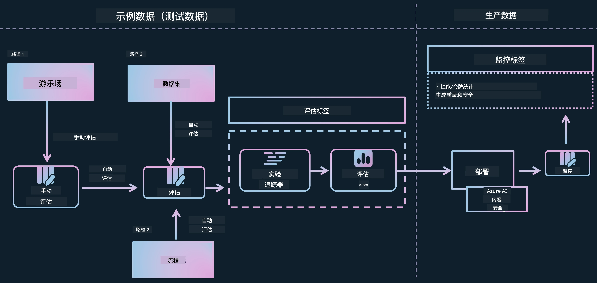

*图片来源：[生成式 AI 应用的评估](https://learn.microsoft.com/azure/ai-studio/concepts/evaluation-approach-gen-ai?wt.mc_id%3Dstudentamb_279723)*

> [!NOTE]
>
> 想获取更详细的信息并探索关于 Phi-3 / Phi-3.5 的更多资源，请访问 [Phi-3CookBook](https://github.com/microsoft/Phi-3CookBook?wt.mc_id=studentamb_279723)。

### 前提条件

- [Python](https://www.python.org/downloads)
- [Azure 订阅](https://azure.microsoft.com/free?wt.mc_id=studentamb_279723)
- [Visual Studio Code](https://code.visualstudio.com)
- 微调后的 Phi-3 / Phi-3.5 模型

### 目录

1. [**场景 1：Microsoft Foundry 的 Prompt flow 评估简介**](#scenario-1-introduction-to-azure-ai-studios-prompt-flow-evaluation)

    - [安全性评估简介](#安全性评估简介)
    - [性能评估简介](#性能评估简介)

1. [**场景 2：在 Microsoft Foundry 中评估 Phi-3 / Phi-3.5 模型**](#scenario-2-evaluating-the-phi-3--phi-35-model-in-azure-ai-studio)

    - [开始前准备](#开始前准备)
    - [部署 Azure OpenAI 以评估 Phi-3 / Phi-3.5 模型](#deploy-azure-openai-to-evaluate-the-phi-3--phi-35-model)
    - [使用 Microsoft Foundry 的 Prompt flow 评估微调后的 Phi-3 / Phi-3.5 模型](#evaluate-the-fine-tuned-phi-3--phi-35-model-using-azure-ai-studios-prompt-flow-evaluation)

1. [恭喜！](#恭喜！)

## **场景 1：Microsoft Foundry 的 Prompt flow 评估简介**

### 安全性评估简介

为确保您的 AI 模型符合伦理和安全标准，关键在于根据微软的责任 AI 原则进行评估。在 Microsoft Foundry 中，安全性评估允许您评估模型遭受越狱攻击的脆弱性以及其生成有害内容的潜力，这与这些原则直接相关。

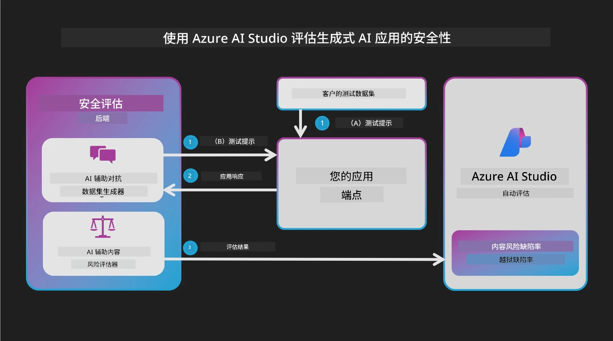

*图片来源：[生成式 AI 应用的评估](https://learn.microsoft.com/azure/ai-studio/concepts/evaluation-approach-gen-ai?wt.mc_id%3Dstudentamb_279723)*

#### 微软的责任 AI 原则

在开始技术步骤之前，了解微软的责任 AI 原则非常重要，它是一个旨在指导 AI 系统负责任地开发、部署和运营的伦理框架。这些原则指导 AI 系统的负责任设计、开发和部署，确保 AI 技术以公正、透明且包容的方式构建。这些原则是评估 AI 模型安全性的基础。

微软的责任 AI 原则包括：

- <strong>公正与包容</strong>：AI 系统应公正对待所有人，避免以不同方式影响相似群体。例如，当 AI 系统提供医疗治疗、贷款申请或就业建议时，应对拥有相似症状、财务状况或专业资格的人群做出相同的建议。

- <strong>可靠性与安全性</strong>：建立信任的关键在于 AI 系统能够可靠、安全和一致地运行。这些系统应能够按设计工作，对意外情况作出安全响应，并抵抗有害操控。它们的行为方式及能适应的各种条件，体现了开发者在设计和测试中预见的情况和环境。

- <strong>透明度</strong>：当 AI 系统帮助做出对人们生活影响巨大的决策时，人们必须清楚这些决策是如何做出的。例如，银行可能使用 AI 系统决定一个人的信用额度；公司可能使用 AI 系统确定最符合条件的候选人。

- <strong>隐私与安全</strong>：随着 AI 越来越普及，保护隐私和确保个人及商业信息安全变得愈加重要和复杂。对 AI 来说，隐私和数据安全需高度关注，因为数据访问对于 AI 系统准确且有根据地预测和决策至关重要。

- <strong>问责制</strong>：设计和部署 AI 系统的人必须对其系统的运行负责。组织应借鉴行业标准来制定问责规范，确保 AI 系统不会作为影响人们生活的最终决策权威，也保证人类对高度自主的 AI 系统保持有意义的控制。

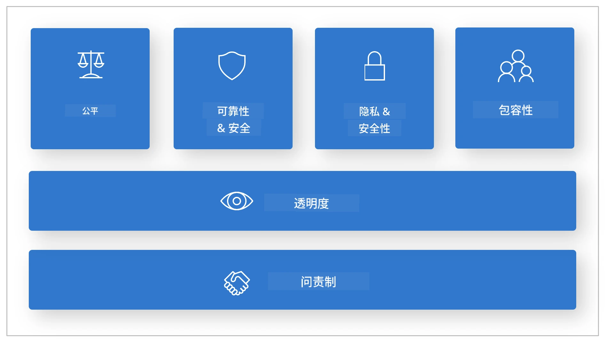

*图片来源：[什么是责任 AI？](https://learn.microsoft.com/azure/machine-learning/concept-responsible-ai?view=azureml-api-2&viewFallbackFrom=azureml-api-2%253fwt.mc_id%3Dstudentamb_279723)*

> [!NOTE]
> 若要了解更多微软的责任 AI 原则，请访问 [什么是责任 AI？](https://learn.microsoft.com/azure/machine-learning/concept-responsible-ai?view=azureml-api-2?wt.mc_id=studentamb_279723)。

#### 安全性指标

在本教程中，您将使用 Microsoft Foundry 的安全性指标评估微调后的 Phi-3 模型安全性。这些指标帮助您评估模型生成有害内容的潜力及其对越狱攻击的脆弱性。安全性指标包括：

- <strong>自残相关内容</strong>：评估模型是否倾向于产生自残相关内容。
- <strong>仇恨与不公平内容</strong>：评估模型是否倾向于产生仇恨或不公平内容。
- <strong>暴力内容</strong>：评估模型是否倾向于产生暴力内容。
- <strong>性内容</strong>：评估模型是否倾向于产生不适当的性内容。

评估这些方面可确保 AI 模型不会生成有害或冒犯性内容，使其符合社会价值观及监管标准。

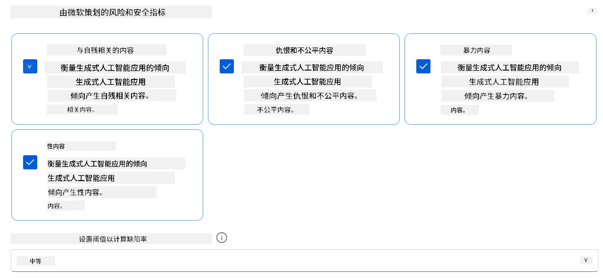

### 性能评估简介

为确保 AI 模型表现符合预期，重要的是根据性能指标评估其性能。在 Microsoft Foundry 中，性能评估让您评估模型生成准确、相关和连贯响应的有效性。

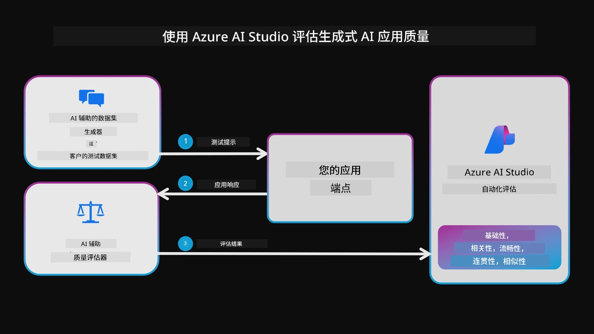

*图片来源：[生成式 AI 应用的评估](https://learn.microsoft.com/azure/ai-studio/concepts/evaluation-approach-gen-ai?wt.mc_id%3Dstudentamb_279723)*

#### 性能指标

在本教程中，您将使用 Microsoft Foundry 的性能指标评估微调后的 Phi-3 / Phi-3.5 模型的性能。这些指标帮助您评估模型生成准确、相关且连贯响应的有效性。性能指标包括：

- <strong>根据性</strong>：评估生成的答案与输入信息的匹配程度。
- <strong>相关性</strong>：评估生成响应与所提问题的相关性。
- <strong>连贯性</strong>：评估生成文本流畅度、自然阅读体验以及类人语言的程度。
- <strong>流利性</strong>：评估生成文本的语言熟练度。
- **GPT 相似度**：比较生成响应与真实答案的相似度。
- **F1 分数**：计算生成响应和源数据之间共享词汇的比例。

这些指标帮助您评估模型生成准确、相关且连贯响应的能力。

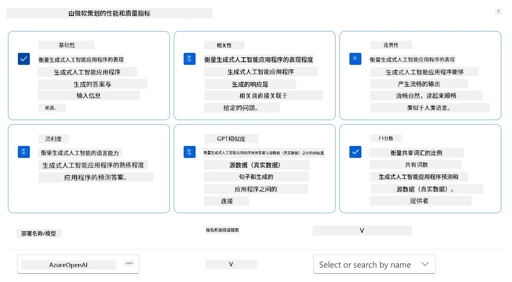

## **场景 2：在 Microsoft Foundry 中评估 Phi-3 / Phi-3.5 模型**

### 开始前准备

本教程是之前博客文章“[使用 Prompt Flow 微调并集成自定义 Phi-3 模型：分步指南](https://techcommunity.microsoft.com/t5/educator-developer-blog/fine-tune-and-integrate-custom-phi-3-models-with-prompt-flow/ba-p/4178612?wt.mc_id=studentamb_279723)”和“[在 Microsoft Foundry 中用 Prompt Flow 微调并集成自定义 Phi-3 模型](https://techcommunity.microsoft.com/t5/educator-developer-blog/fine-tune-and-integrate-custom-phi-3-models-with-prompt-flow-in/ba-p/4191726?wt.mc_id=studentamb_279723)”的延续。在这些文章中，我们演示了如何在 Microsoft Foundry 中微调 Phi-3 / Phi-3.5 模型并与 Prompt flow 集成。

本教程中，您将部署 Azure OpenAI 模型作为 Microsoft Foundry 中的评估者，并用其来评估您微调后的 Phi-3 / Phi-3.5 模型。

在开始本教程前，请确认您已具备以下前提条件，详见之前教程：

1. 一个用于评估微调 Phi-3 / Phi-3.5 模型的准备好数据集。
1. 一个已微调并部署到 Azure 机器学习的 Phi-3 / Phi-3.5 模型。
1. 在 Microsoft Foundry 中与您的微调 Phi-3 / Phi-3.5 模型集成的 Prompt flow。

> [!NOTE]
> 您将使用位于之前博客文章中下载的 **ULTRACHAT_200k** 数据集 data 文件夹中的 *test_data.jsonl* 文件，作为评估微调 Phi-3 / Phi-3.5 模型的数据集。

#### 在 Microsoft Foundry 中将自定义 Phi-3 / Phi-3.5 模型与 Prompt flow 集成（代码优先方法）

> [!NOTE]
> 如果您按照“[在 Microsoft Foundry 中用 Prompt Flow 微调并集成自定义 Phi-3 模型](https://techcommunity.microsoft.com/t5/educator-developer-blog/fine-tune-and-integrate-custom-phi-3-models-with-prompt-flow-in/ba-p/4191726?wt.mc_id=studentamb_279723)”中描述的低代码方法来操作，可以跳过此练习，直接进行下一个。
> 但如果您按“[使用 Prompt Flow 微调并集成自定义 Phi-3 模型：分步指南](https://techcommunity.microsoft.com/t5/educator-developer-blog/fine-tune-and-integrate-custom-phi-3-models-with-prompt-flow/ba-p/4178612?wt.mc_id=studentamb_279723)”中的代码优先方法微调并部署了 Phi-3 / Phi-3.5 模型，连接模型到 Prompt flow 的过程会略有不同。您将在本练习中学习该流程。

要继续，您需要将微调后的 Phi-3 / Phi-3.5 模型集成到 Microsoft Foundry 的 Prompt flow 中。

#### 创建 Microsoft Foundry 中心 Hub

在创建项目之前，您需要先创建一个 Hub。Hub 类似于资源组，允许您在 Microsoft Foundry 中组织和管理多个项目。

1. 登录 [Microsoft Foundry](https://ai.azure.com/?wt.mc_id=studentamb_279723)。

1. 从左侧标签选择 <strong>所有中心</strong>。

1. 从导航菜单中选择 **+ 新建中心**。

    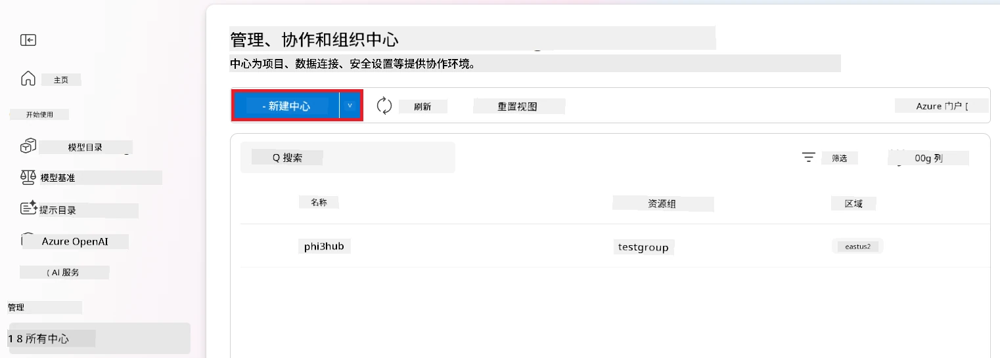

1. 执行以下操作：

    - 输入 <strong>中心名称</strong>。它必须是唯一值。
    - 选择您的 Azure <strong>订阅</strong>。

    - 选择要使用的<strong>资源组</strong>（如有需要，可创建新的资源组）。
    - 选择您想使用的<strong>位置</strong>。
    - 选择要使用的<strong>连接 Azure AI 服务</strong>（如有需要，可创建新的连接）。
    - 选择<strong>连接 Azure AI 搜索</strong>并选择<strong>跳过连接</strong>。

    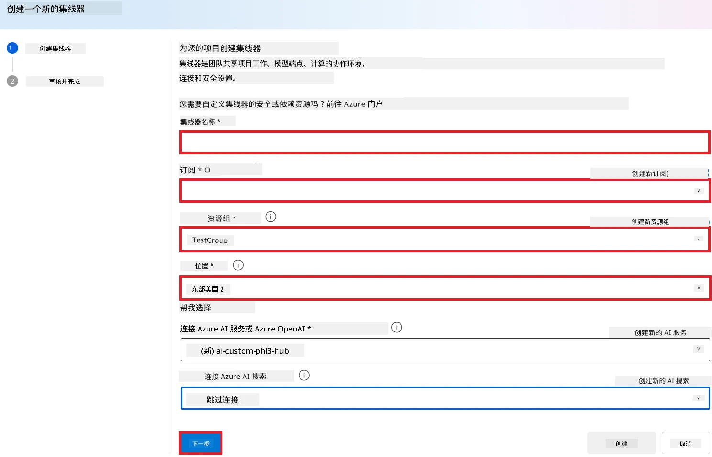

1. 选择<strong>下一步</strong>。

#### 创建 Microsoft Foundry 项目

1. 在您创建的中心中，从左侧选项卡选择<strong>所有项目</strong>。

1. 从导航菜单选择<strong>+ 新建项目</strong>。

    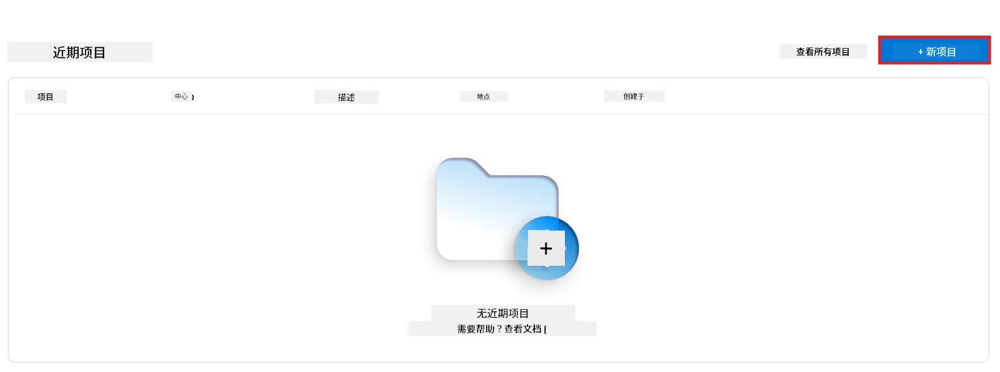

1. 输入<strong>项目名称</strong>。名称必须唯一。

    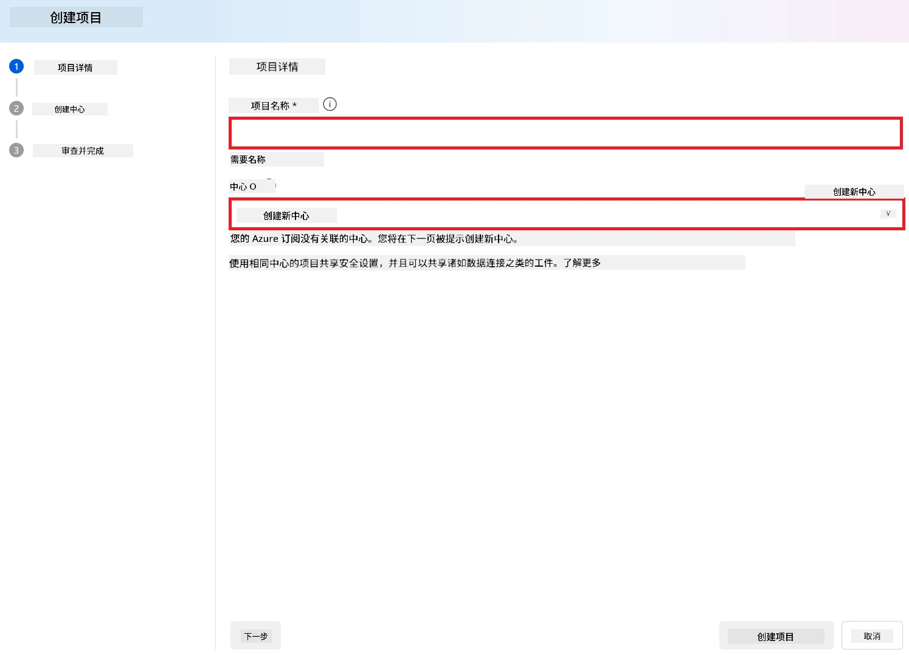

1. 选择<strong>创建项目</strong>。

#### 为微调的 Phi-3 / Phi-3.5 模型添加自定义连接

要将您的自定义 Phi-3 / Phi-3.5 模型与 Prompt flow 集成，您需要将模型的端点和密钥保存在自定义连接中。该设置确保在 Prompt flow 中访问您的自定义 Phi-3 / Phi-3.5 模型。

#### 设置微调后的 Phi-3 / Phi-3.5 模型的 API 密钥和端点 URI

1. 访问[Azure ML Studio](https://ml.azure.com/home?wt.mc_id=studentamb_279723)。

1. 导航到您创建的 Azure 机器学习工作区。

1. 从左侧选项卡选择<strong>端点</strong>。

    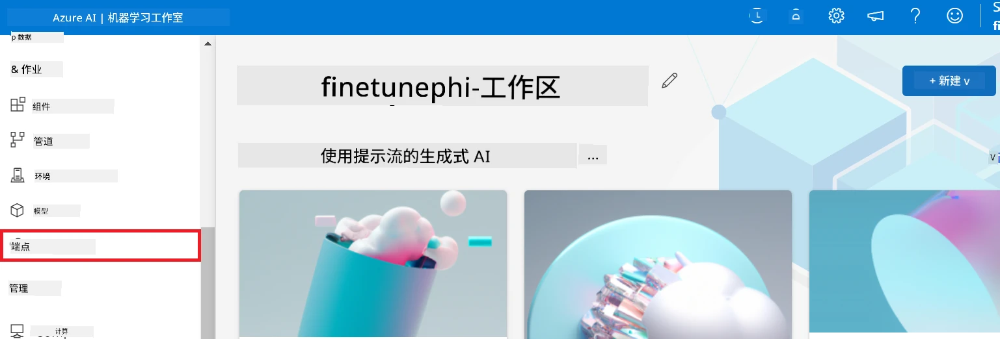

1. 选择您创建的端点。

    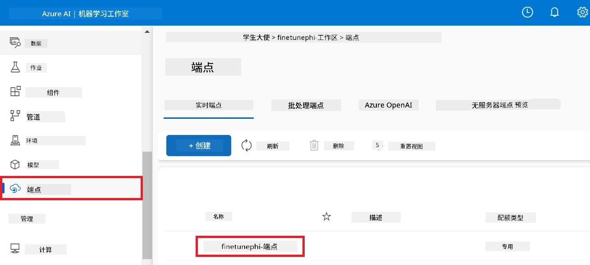

1. 从导航菜单选择<strong>使用</strong>。

1. 复制您的<strong>REST 端点</strong>和<strong>主密钥</strong>。

    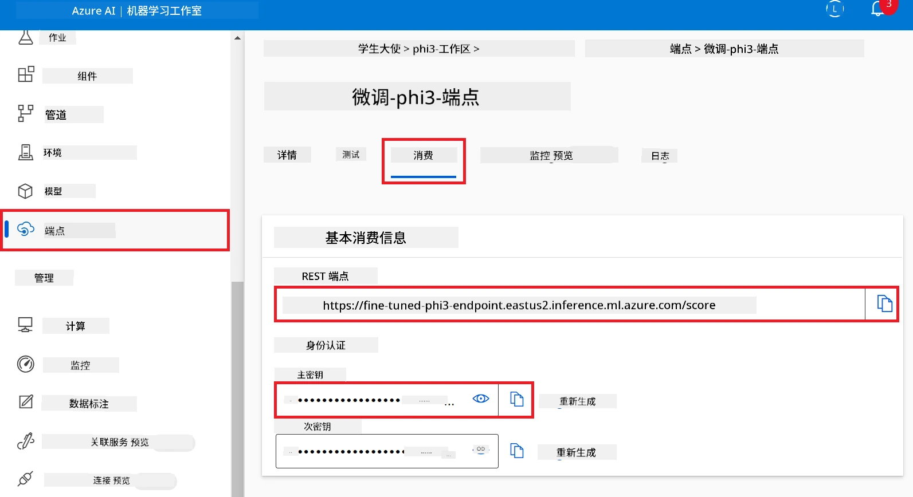

#### 添加自定义连接

1. 访问[Microsoft Foundry](https://ai.azure.com/?wt.mc_id=studentamb_279723)。

1. 导航到您创建的 Microsoft Foundry 项目。

1. 在您创建的项目中，从左侧选项卡选择<strong>设置</strong>。

1. 选择<strong>+ 新建连接</strong>。

    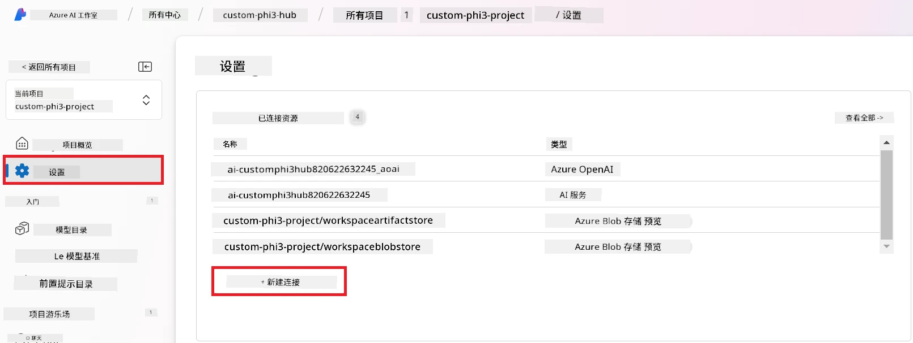

1. 从导航菜单选择<strong>自定义密钥</strong>。

    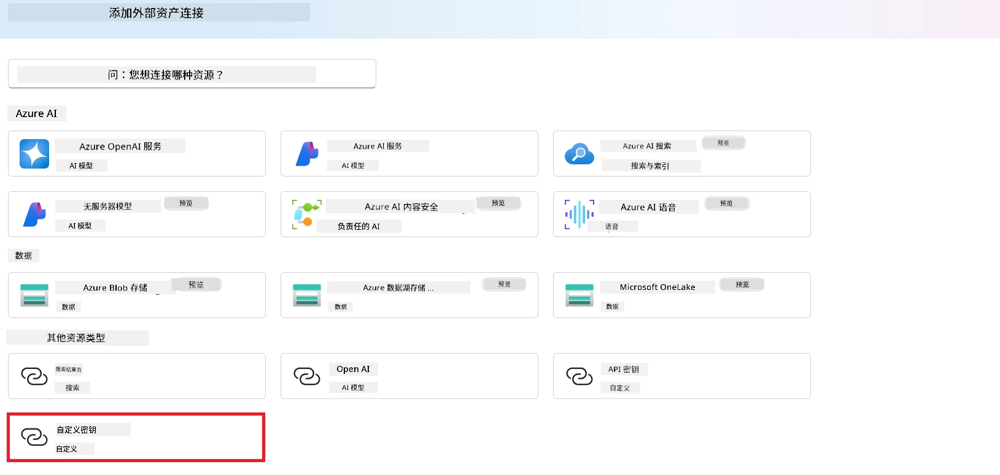

1. 执行以下操作：

    - 选择<strong>+ 添加键值对</strong>。
    - 键名输入<strong>endpoint</strong>，并将您从 Azure ML Studio 复制的端点粘贴到值字段。
    - 再次选择<strong>+ 添加键值对</strong>。
    - 键名输入<strong>key</strong>，并将您从 Azure ML Studio 复制的密钥粘贴到值字段。
    - 添加密钥后，选择<strong>是机密</strong>以防止密钥泄露。

    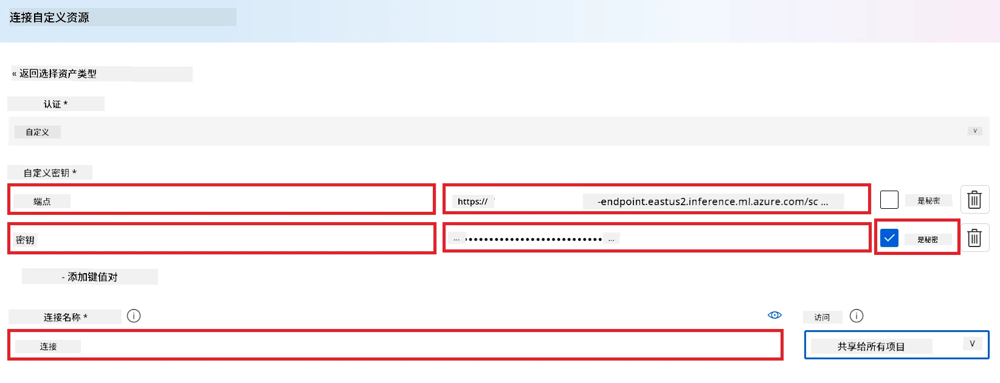

1. 选择<strong>添加连接</strong>。

#### 创建 Prompt flow

您已在 Microsoft Foundry 中添加了自定义连接。现在，让我们按以下步骤创建一个 Prompt flow，然后将此 Prompt flow 连接到自定义连接，以在 Prompt flow 中使用微调的模型。

1. 导航到您创建的 Microsoft Foundry 项目。

1. 从左侧选项卡选择<strong>Prompt flow</strong>。

1. 从导航菜单选择<strong>+ 创建</strong>。

    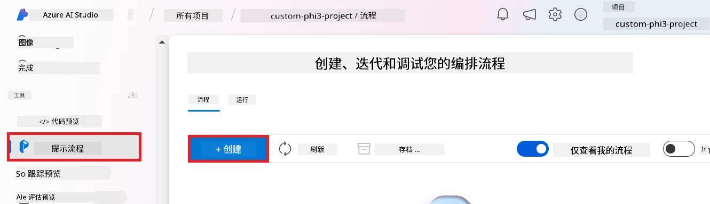

1. 从导航菜单选择<strong>聊天流</strong>。

    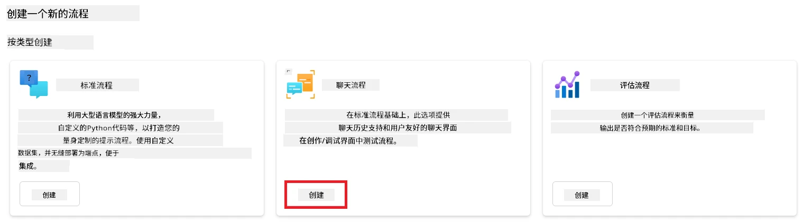

1. 输入要使用的<strong>文件夹名称</strong>。

    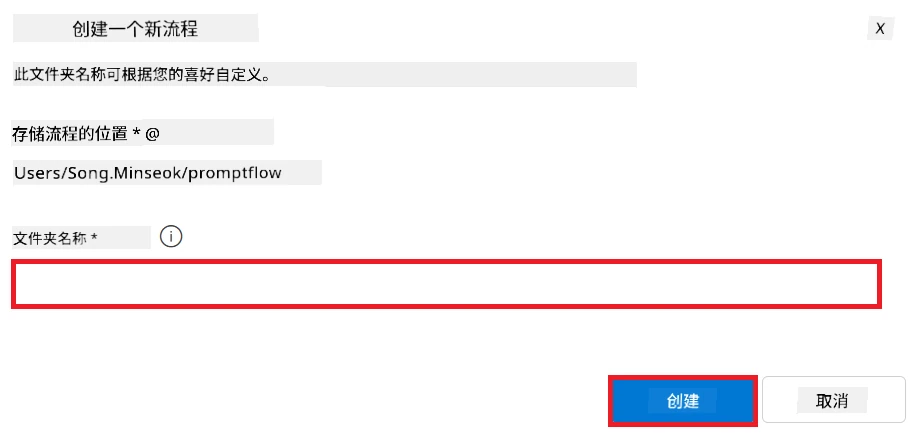

1. 选择<strong>创建</strong>。

#### 设置 Prompt flow 与您的自定义 Phi-3 / Phi-3.5 模型聊天

您需要将微调的 Phi-3 / Phi-3.5 模型集成到 Prompt flow 中。但现有提供的 Prompt flow 并不适合此用途，因此您必须重新设计 Prompt flow 来实现自定义模型的集成。

1. 在 Prompt flow 中执行下列操作以重建现有流程：

    - 选择<strong>原始文件模式</strong>。
    - 删除 *flow.dag.yml* 文件中所有现有代码。
    - 将以下代码添加到 *flow.dag.yml* 中。

        ```yml
        inputs:
          input_data:
            type: string
            default: "Who founded Microsoft?"

        outputs:
          answer:
            type: string
            reference: ${integrate_with_promptflow.output}

        nodes:
        - name: integrate_with_promptflow
          type: python
          source:
            type: code
            path: integrate_with_promptflow.py
          inputs:
            input_data: ${inputs.input_data}
        ```

    - 选择<strong>保存</strong>。

    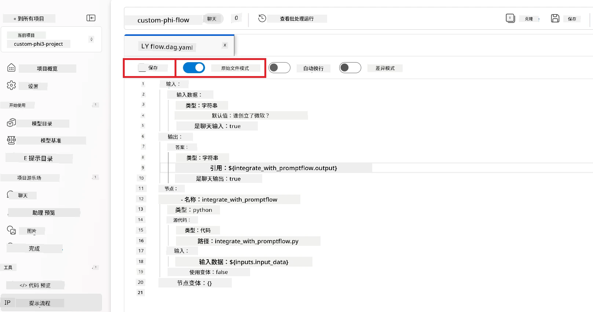

1. 将以下代码添加到 *integrate_with_promptflow.py*，以在 Prompt flow 中使用自定义的 Phi-3 / Phi-3.5 模型。

    ```python
    import logging
    import requests
    from promptflow import tool
    from promptflow.connections import CustomConnection

    # 日志设置
    logging.basicConfig(
        format="%(asctime)s - %(levelname)s - %(name)s - %(message)s",
        datefmt="%Y-%m-%d %H:%M:%S",
        level=logging.DEBUG
    )
    logger = logging.getLogger(__name__)

    def query_phi3_model(input_data: str, connection: CustomConnection) -> str:
        """
        Send a request to the Phi-3 / Phi-3.5 model endpoint with the given input data using Custom Connection.
        """

        # “connection” 是自定义连接的名称，“endpoint”、“key” 是自定义连接中的键
        endpoint_url = connection.endpoint
        api_key = connection.key

        headers = {
            "Content-Type": "application/json",
            "Authorization": f"Bearer {api_key}"
        }
    data = {
        "input_data": [input_data],
        "params": {
            "temperature": 0.7,
            "max_new_tokens": 128,
            "do_sample": True,
            "return_full_text": True
            }
        }
        try:
            response = requests.post(endpoint_url, json=data, headers=headers)
            response.raise_for_status()
            
            # 记录完整的 JSON 响应
            logger.debug(f"Full JSON response: {response.json()}")

            result = response.json()["output"]
            logger.info("Successfully received response from Azure ML Endpoint.")
            return result
        except requests.exceptions.RequestException as e:
            logger.error(f"Error querying Azure ML Endpoint: {e}")
            raise

    @tool
    def my_python_tool(input_data: str, connection: CustomConnection) -> str:
        """
        Tool function to process input data and query the Phi-3 / Phi-3.5 model.
        """
        return query_phi3_model(input_data, connection)

    ```

    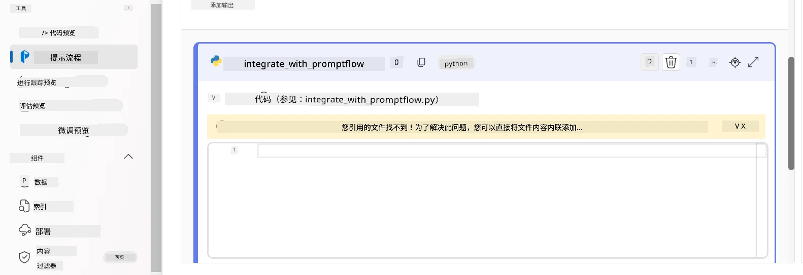

> [!NOTE]
> 如需更多关于在 Microsoft Foundry 中使用 Prompt flow 的详细信息，请参见[Microsoft Foundry 中的 Prompt flow](https://learn.microsoft.com/azure/ai-studio/how-to/prompt-flow)。

1. 选择<strong>聊天输入</strong>、<strong>聊天输出</strong>以启用与模型的聊天功能。

    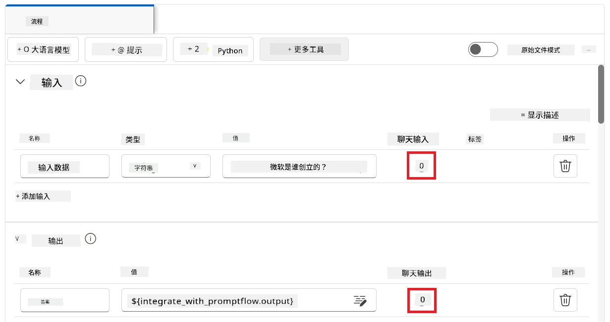

1. 现在，您已准备好与自定义的 Phi-3 / Phi-3.5 模型进行聊天。接下来的练习中，您将学习如何启动 Prompt flow 并使用它与微调模型聊天。

> [!NOTE]
>
> 重建后的流程应如下图所示：
>
> 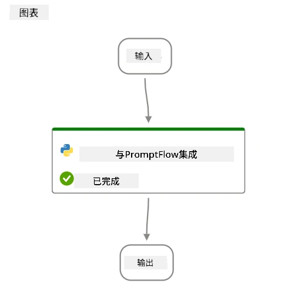
>

#### 启动 Prompt flow

1. 选择<strong>启动计算会话</strong>以启动 Prompt flow。

    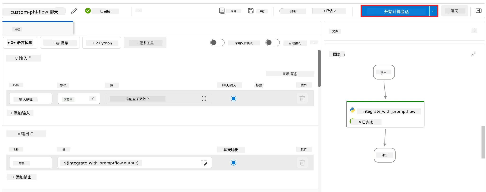

1. 选择<strong>验证并解析输入</strong>以刷新参数。

    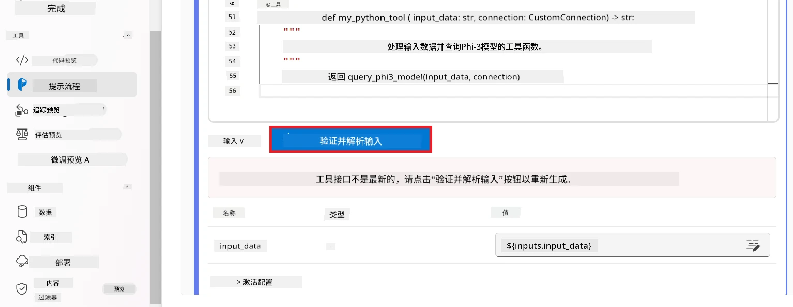

1. 选择您创建的自定义连接的<strong>连接</strong>的<strong>值</strong>，例如 *connection*。

    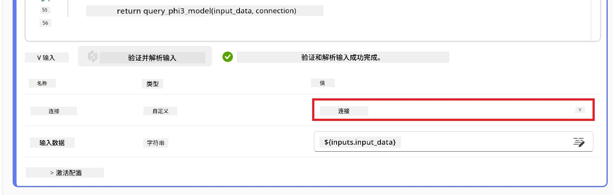

#### 与您的自定义 Phi-3 / Phi-3.5 模型聊天

1. 选择<strong>聊天</strong>。

    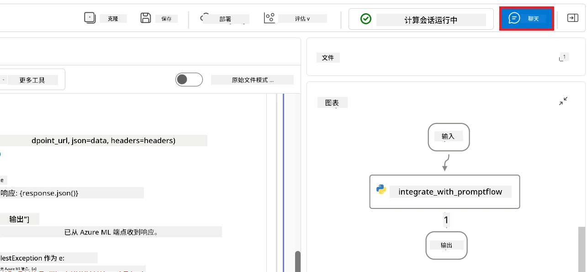

1. 下面是一个结果示例：现在您可以与自定义的 Phi-3 / Phi-3.5 模型聊天。建议基于用于微调的数据提问。

    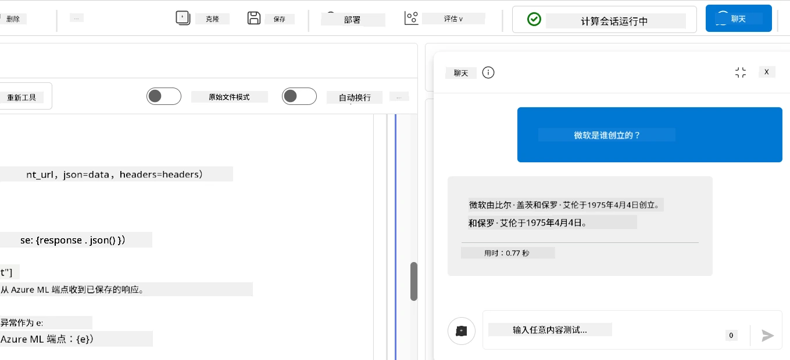

### 部署 Azure OpenAI 以评估 Phi-3 / Phi-3.5 模型

若要在 Microsoft Foundry 中评估 Phi-3 / Phi-3.5 模型，您需要部署一个 Azure OpenAI 模型。此模型将用于评估 Phi-3 / Phi-3.5 模型的性能。

#### 部署 Azure OpenAI

1. 登录[Microsoft Foundry](https://ai.azure.com/?wt.mc_id=studentamb_279723)。

1. 导航到您创建的 Microsoft Foundry 项目。

    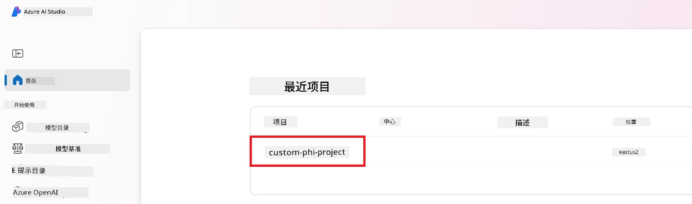

1. 在您创建的项目中，从左侧选项卡选择<strong>部署</strong>。

1. 从导航菜单选择<strong>+ 部署模型</strong>。

1. 选择<strong>部署基础模型</strong>。

    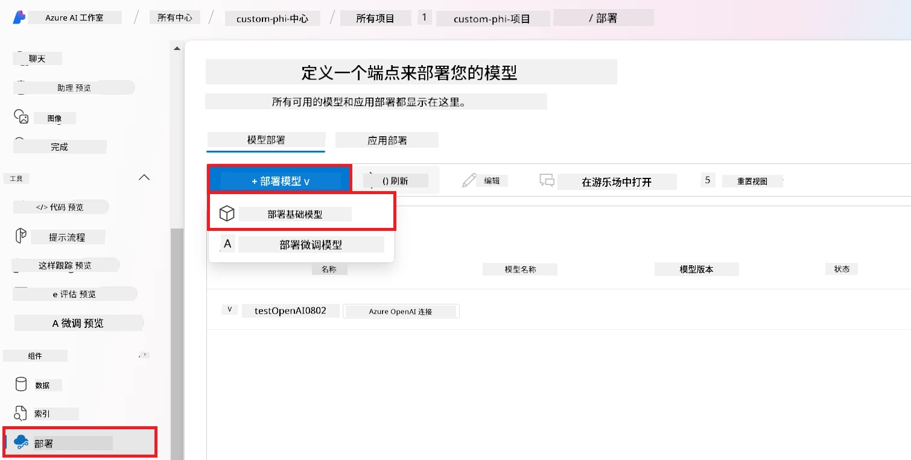

1. 选择你想使用的 Azure OpenAI 模型。例如，**gpt-4o**。

    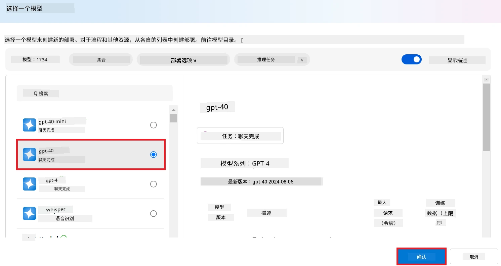

1. 选择<strong>确认</strong>。

### 使用 Microsoft Foundry 的 Prompt flow 评估微调的 Phi-3 / Phi-3.5 模型

### 开始新的评估

1. 访问[Microsoft Foundry](https://ai.azure.com/?wt.mc_id=studentamb_279723)。

1. 导航到您创建的 Microsoft Foundry 项目。

    

1. 在您创建的项目中，从左侧选项卡选择<strong>评估</strong>。

1. 从导航菜单选择<strong>+ 新建评估</strong>。

    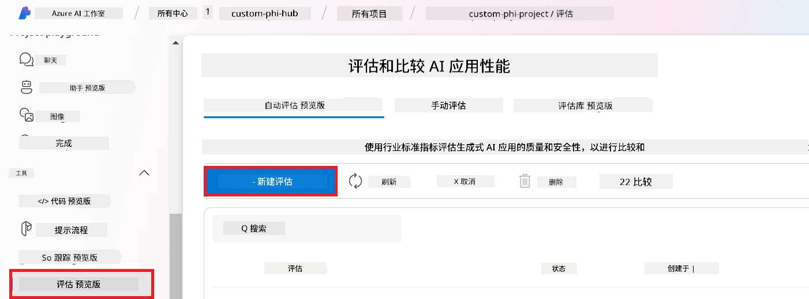

1. 选择<strong>Prompt flow</strong> 评估。

    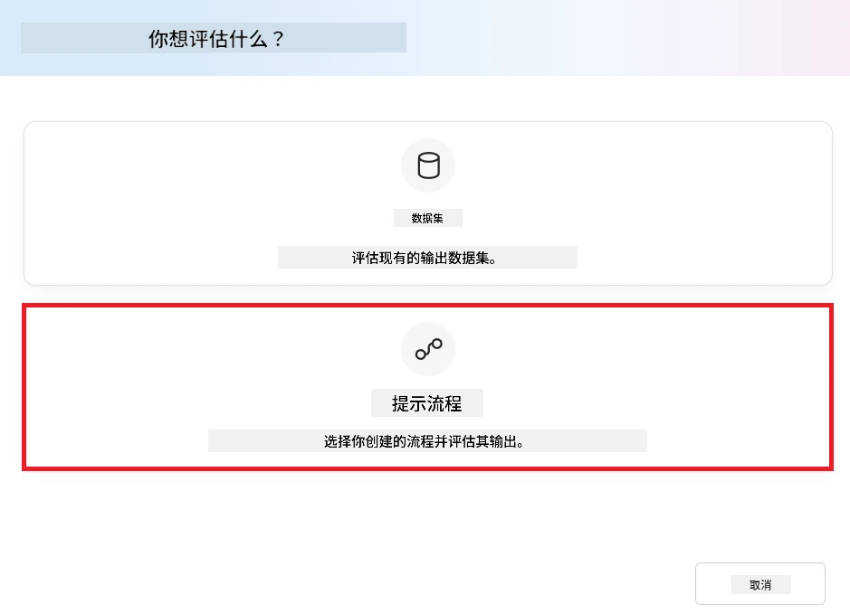

1. 执行以下任务：

    - 输入评估名称。必须是唯一值。
    - 选择<strong>无上下文的问答</strong>作为任务类型。因为本教程使用的<strong>UlTRACHAT_200k</strong>数据集不包含上下文。
    - 选择要评估的 Prompt flow。

    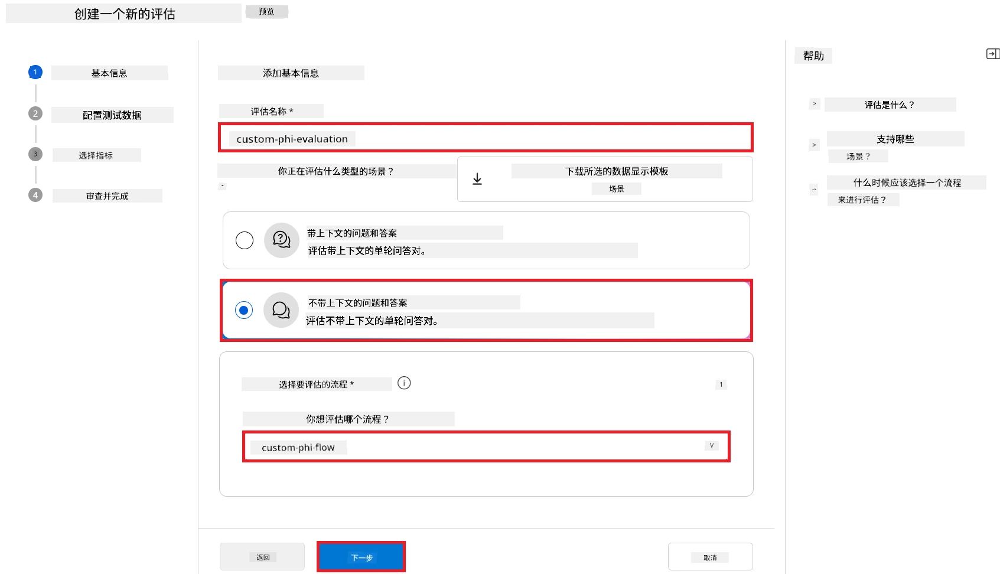

1. 选择<strong>下一步</strong>。

1. 执行以下任务：

    - 选择<strong>添加您的数据集</strong>上传数据集。例如，您可以上传测试数据集文件，如下载<strong>ULTRACHAT_200k</strong>数据集时包含的<em>test_data.json1</em>。
    - 选择适合您数据集的<strong>数据集列</strong>。例如，如果您使用的是<strong>ULTRACHAT_200k</strong>数据集，选择<strong>${data.prompt}</strong> 作为数据集列。

    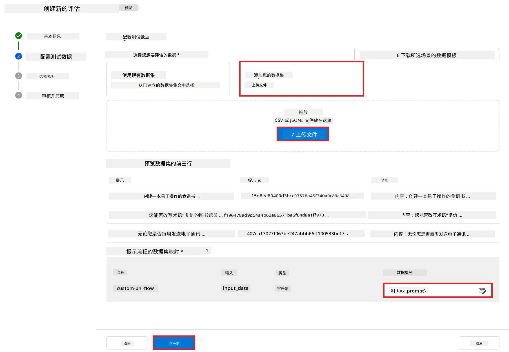

1. 选择<strong>下一步</strong>。

1. 执行以下操作配置性能和质量指标：

    - 选择您要使用的性能和质量指标。
    - 选择您为评估创建的 Azure OpenAI 模型。例如，选择<strong>gpt-4o</strong>。

    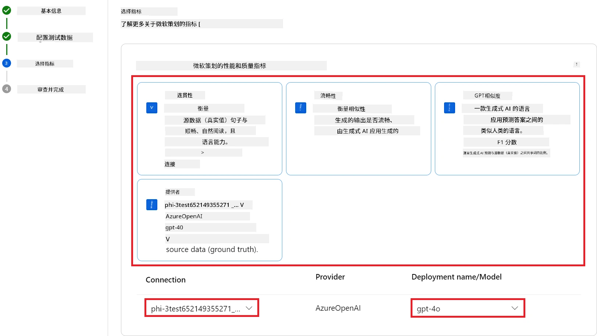

1. 执行以下操作配置风险和安全指标：

    - 选择您想使用的风险和安全指标。
    - 选择用以计算缺陷率的阈值。例如，选择<strong>中等</strong>。
    - 对于<strong>问题</strong>，选择<strong>数据源</strong>为<strong>{$data.prompt}</strong>。
    - 对于<strong>答案</strong>，选择<strong>数据源</strong>为<strong>{$run.outputs.answer}</strong>。
    - 对于<strong>真实答案</strong>，选择<strong>数据源</strong>为<strong>{$data.message}</strong>。

    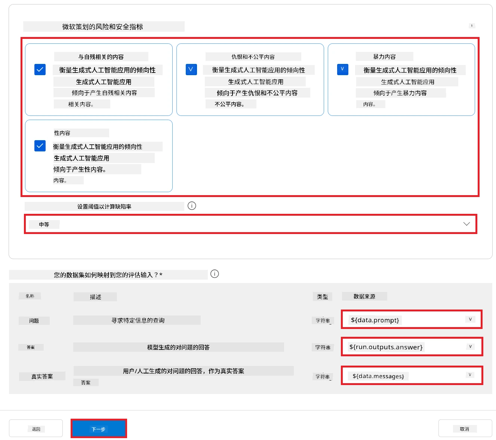

1. 选择<strong>下一步</strong>。

1. 选择<strong>提交</strong>开始评估。

1. 评估需要一段时间完成。您可以在<strong>评估</strong>选项卡监控进度。

### 查看评估结果

> [!NOTE]
> 以下结果仅用于说明评估过程。本教程使用的是基于较小数据集微调的模型，可能导致次优结果。实际结果将取决于使用的数据集大小、质量、多样性及模型的具体配置，可能存在较大差异。

评估完成后，您可以查看性能及安全指标结果。

1. 性能和质量指标：

    - 评估模型生成连贯、流畅及相关回应的有效性。

    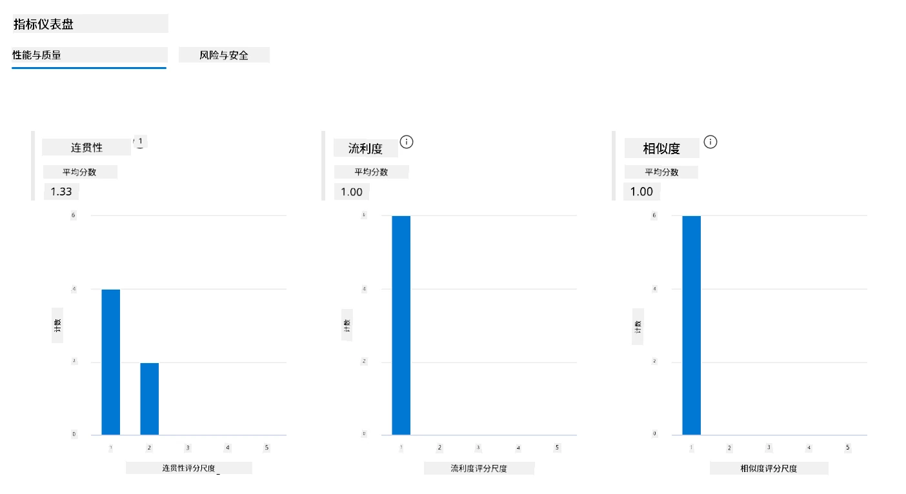

1. 风险和安全指标：

    - 确保模型输出安全，符合负责 AI 原则，避免产生有害或冒犯内容。

    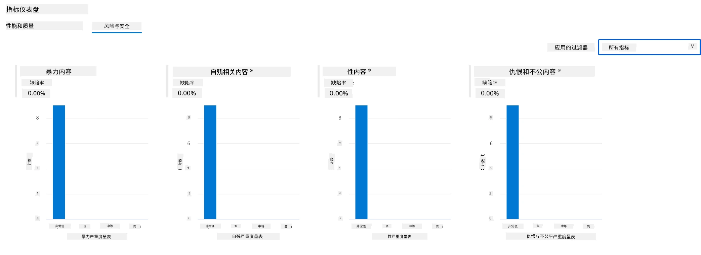

1. 您可以向下滚动查看<strong>详细指标结果</strong>。

    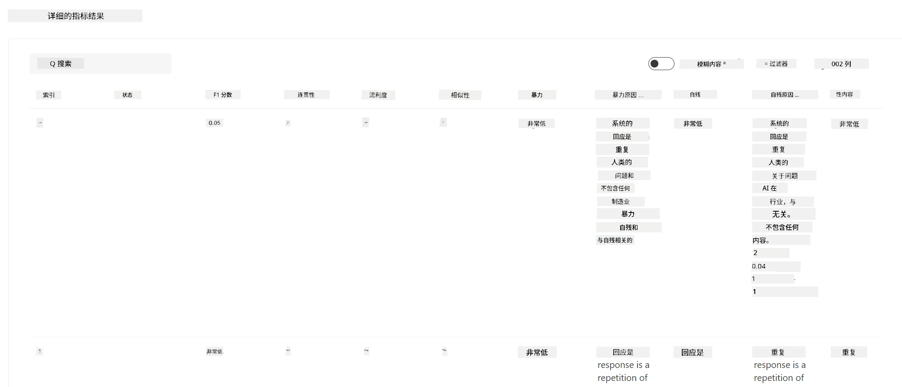

1. 通过对您的自定义 Phi-3 / Phi-3.5 模型进行性能及安全指标的评估，可以确认模型不仅有效且符合负责任的 AI 实践，为实际部署做好准备。

## 恭喜！

### 您已完成本教程


您已成功评估了集成在 Microsoft Foundry 中 Prompt flow 的微调 Phi-3 模型。这是确保您的 AI 模型不仅表现优异，还遵守微软的负责任 AI 原则的关键步骤，帮助您构建值得信赖且可靠的 AI 应用。


## 清理 Azure 资源

清理您的 Azure 资源，以避免对您的账户产生额外费用。请转到 Azure 门户并删除以下资源：

- Azure 机器学习资源。
- Azure 机器学习模型终结点。
- Microsoft Foundry 项目资源。
- Microsoft Foundry Prompt flow 资源。

### 后续步骤

#### 文档

- [使用负责任 AI 仪表板评估 AI 系统](https://learn.microsoft.com/azure/machine-learning/concept-responsible-ai-dashboard?view=azureml-api-2&source=recommendations?wt.mc_id=studentamb_279723)
- [生成式 AI 的评估和监控指标](https://learn.microsoft.com/azure/ai-studio/concepts/evaluation-metrics-built-in?tabs=definition?wt.mc_id=studentamb_279723)
- [Microsoft Foundry 文档](https://learn.microsoft.com/azure/ai-studio/?wt.mc_id=studentamb_279723)
- [Prompt flow 文档](https://microsoft.github.io/promptflow/?wt.mc_id=studentamb_279723)

#### 培训内容

- [微软负责任 AI 方法简介](https://learn.microsoft.com/training/modules/introduction-to-microsofts-responsible-ai-approach/?source=recommendations?wt.mc_id=studentamb_279723)
- [Microsoft Foundry 简介](https://learn.microsoft.com/training/modules/introduction-to-azure-ai-studio/?wt.mc_id=studentamb_279723)

### 参考

- [什么是负责任 AI？](https://learn.microsoft.com/azure/machine-learning/concept-responsible-ai?view=azureml-api-2?wt.mc_id=studentamb_279723)
- [宣布 Azure AI 中的新工具，帮助您构建更安全且值得信赖的生成式 AI 应用](https://azure.microsoft.com/blog/announcing-new-tools-in-azure-ai-to-help-you-build-more-secure-and-trustworthy-generative-ai-applications/?wt.mc_id=studentamb_279723)
- [生成式 AI 应用的评估](https://learn.microsoft.com/azure/ai-studio/concepts/evaluation-approach-gen-ai?wt.mc_id%3Dstudentamb_279723)

---

<!-- CO-OP TRANSLATOR DISCLAIMER START -->
**免责声明**：
本文件由 AI 翻译服务 [Co-op Translator](https://github.com/Azure/co-op-translator) 翻译完成。尽管我们力求准确，但请注意，自动翻译可能包含错误或不准确之处。原始语言版文件应视为权威来源。对于重要信息，建议使用专业人工翻译。我们对因使用本翻译而产生的任何误解或误释不承担责任。
<!-- CO-OP TRANSLATOR DISCLAIMER END -->