# 使用 Azure AI Foundry 中的 Prompt flow 微调和集成自定义 Phi-3 模型

此端到端（E2E）示例基于微软技术社区的指南“[使用 Azure AI Foundry 中的 Prompt Flow 微调和集成自定义 Phi-3 模型](https://techcommunity.microsoft.com/t5/educator-developer-blog/fine-tune-and-integrate-custom-phi-3-models-with-prompt-flow-in/ba-p/4191726?WT.mc_id=aiml-137032-kinfeylo)”。它介绍了在 Azure AI Foundry 中微调、部署和集成自定义 Phi-3 模型及其与 Prompt flow 的流程。
与涉及本地运行代码的 E2E 示例“[使用 Prompt Flow 微调和集成自定义 Phi-3 模型](./E2E_Phi-3-FineTuning_PromptFlow_Integration.md)”不同，本教程完全聚焦于在 Azure AI / ML Studio 内微调和集成您的模型。

## 概览

在此 E2E 示例中，您将学习如何微调 Phi-3 模型并将其与 Azure AI Foundry 中的 Prompt flow 集成。利用 Azure AI / ML Studio，您将建立一个部署和使用自定义 AI 模型的工作流程。该 E2E 示例分为三个场景：

**场景 1：设置 Azure 资源并准备微调**

**场景 2：微调 Phi-3 模型并在 Azure 机器学习 Studio 部署**

**场景 3：与 Prompt flow 集成并在 Azure AI Foundry 中与您的自定义模型聊天**

以下是此 E2E 示例的概览。


### 目录

1. **[场景 1：设置 Azure 资源并准备微调](../../../../../../md/02.Application/01.TextAndChat/Phi3)**
    - [创建 Azure 机器学习工作区](../../../../../../md/02.Application/01.TextAndChat/Phi3)
    - [请求 Azure 订阅中的 GPU 配额](../../../../../../md/02.Application/01.TextAndChat/Phi3)
    - [添加角色分配](../../../../../../md/02.Application/01.TextAndChat/Phi3)
    - [设置项目](../../../../../../md/02.Application/01.TextAndChat/Phi3)
    - [准备微调数据集](../../../../../../md/02.Application/01.TextAndChat/Phi3)

1. **[场景 2：微调 Phi-3 模型并在 Azure 机器学习 Studio 部署](../../../../../../md/02.Application/01.TextAndChat/Phi3)**
    - [微调 Phi-3 模型](../../../../../../md/02.Application/01.TextAndChat/Phi3)
    - [部署微调后的 Phi-3 模型](../../../../../../md/02.Application/01.TextAndChat/Phi3)

1. **[场景 3：与 Prompt flow 集成并在 Azure AI Foundry 中与您的自定义模型聊天](../../../../../../md/02.Application/01.TextAndChat/Phi3)**
    - [将自定义 Phi-3 模型与 Prompt flow 集成](../../../../../../md/02.Application/01.TextAndChat/Phi3)
    - [与您的自定义 Phi-3 模型聊天](../../../../../../md/02.Application/01.TextAndChat/Phi3)

## 场景 1：设置 Azure 资源并准备微调

### 创建 Azure 机器学习工作区

1. 在门户页面顶部的**搜索栏**中输入 *azure machine learning*，从出现的选项中选择 **Azure Machine Learning**。

    

2. 从导航菜单中选择 **+ Create**。

3. 从导航菜单中选择 **New workspace**。

    

4. 执行以下任务：

    - 选择您的 Azure **Subscription**。
    - 选择要使用的 **Resource group**（如有需要，则创建新的）。
    - 输入 **Workspace Name**，该名称必须唯一。
    - 选择您想要使用的 **Region**。
    - 选择要使用的 **Storage account**（如有需要，则创建新的）。
    - 选择要使用的 **Key vault**（如有需要，则创建新的）。
    - 选择要使用的 **Application insights**（如有需要，则创建新的）。
    - 选择要使用的 **Container registry**（如有需要，则创建新的）。

    

5. 选择 **Review + Create**。

6. 选择 **Create**。

### 请求 Azure 订阅中的 GPU 配额

在本教程中，您将学习如何使用 GPU 来微调和部署 Phi-3 模型。微调时，使用 *Standard_NC24ads_A100_v4* GPU，该类型 GPU 需要申请配额。部署时，使用 *Standard_NC6s_v3* GPU，这种 GPU 同样需要申请配额。

> [!NOTE]
>
> 仅按需付费（Pay-As-You-Go）订阅（即标准订阅类型）有资格申请 GPU 配额；福利订阅目前不支持。
>

1. 访问 [Azure ML Studio](https://ml.azure.com/home?wt.mc_id=studentamb_279723)。

1. 执行以下任务请求 *Standard NCADSA100v4 Family* 配额：

    - 从左侧标签选择 **Quota**。
    - 选择要使用的 **Virtual machine family**。例如选择包含 *Standard_NC24ads_A100_v4* GPU 的 **Standard NCADSA100v4 Family Cluster Dedicated vCPUs**。
    - 从导航菜单选择 **Request quota**。

        

    - 在请求配额页面中，输入您希望使用的 **New cores limit**。例如 24。
    - 在请求配额页面选择 **Submit** 来提交 GPU 配额请求。

1. 执行以下任务请求 *Standard NCSv3 Family* 配额：

    - 从左侧标签选择 **Quota**。
    - 选择要使用的 **Virtual machine family**。例如选择包含 *Standard_NC6s_v3* GPU 的 **Standard NCSv3 Family Cluster Dedicated vCPUs**。
    - 从导航菜单选择 **Request quota**。
    - 在请求配额页面中，输入您希望使用的 **New cores limit**。例如 24。
    - 在请求配额页面选择 **Submit** 来提交 GPU 配额请求。

### 添加角色分配

要微调和部署您的模型，您必须先创建一个用户分配的托管身份（User Assigned Managed Identity，UAI）并为其分配适当权限。此 UAI 将用于部署过程中身份验证。

#### 创建用户分配的托管身份（UAI）

1. 在门户页面顶部的**搜索栏**中输入 *managed identities*，从出现的选项中选择 **Managed Identities**。

    

1. 选择 **+ Create**。

    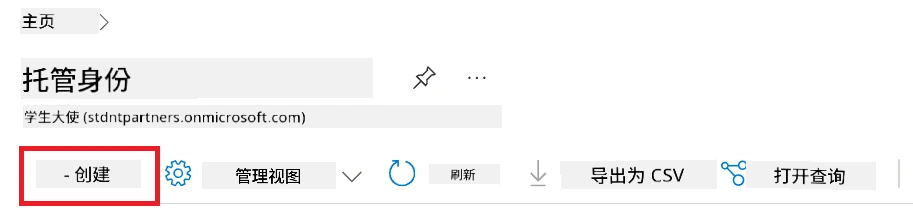

1. 执行以下任务：

    - 选择您的 Azure **Subscription**。
    - 选择要使用的 **Resource group**（如有需要，则创建新的）。
    - 选择您想使用的 **Region**。
    - 输入 **Name**，该名称必须唯一。

    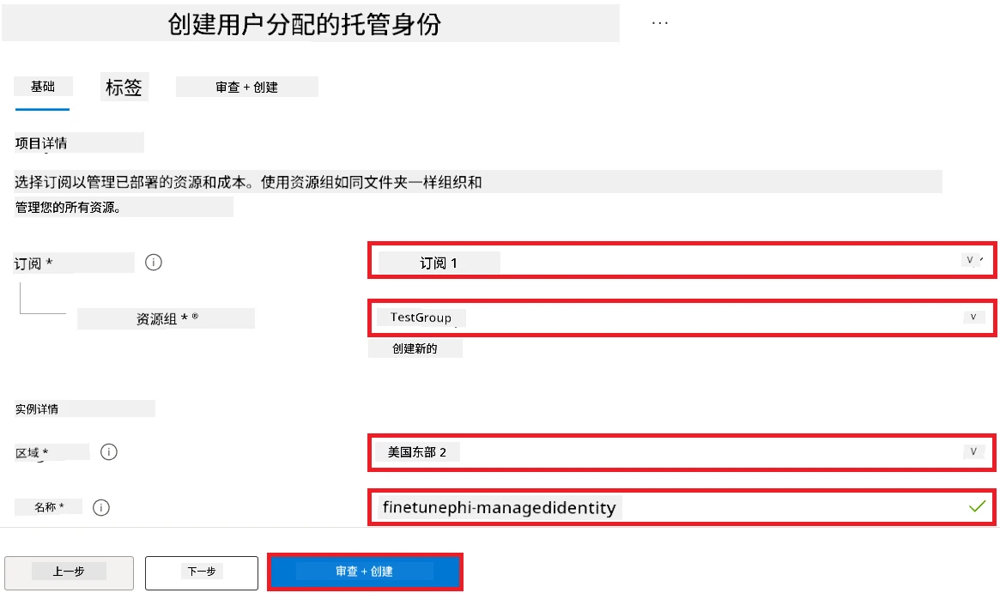

1. 选择 **Review + create**。

1. 选择 **+ Create**。

#### 为托管身份添加贡献者角色分配

1. 导航到您创建的托管身份资源。

1. 从左侧标签选择 **Azure role assignments**。

1. 从导航菜单中选择 **+Add role assignment**。

1. 在添加角色分配页面中执行以下任务：
    - 选择 **Scope** 为 **Resource group**。
    - 选择您的 Azure **Subscription**。
    - 选择要使用的 **Resource group**。
    - 选择 **Role** 为 **Contributor**。

    

2. 选择 **Save**。

#### 为托管身份添加存储 Blob 数据读取者角色分配

1. 在门户页面顶部的**搜索栏**中输入 *storage accounts*，从出现的选项中选择 **Storage accounts**。

    

1. 选择与您创建的 Azure 机器学习工作区相关联的存储账户。例如，*finetunephistorage*。

1. 执行以下任务以导航至添加角色分配页面：

    - 导航至您创建的 Azure 存储账户。
    - 从左侧标签选择 **Access Control (IAM)**。
    - 从导航菜单选择 **+ Add**。
    - 从导航菜单选择 **Add role assignment**。

    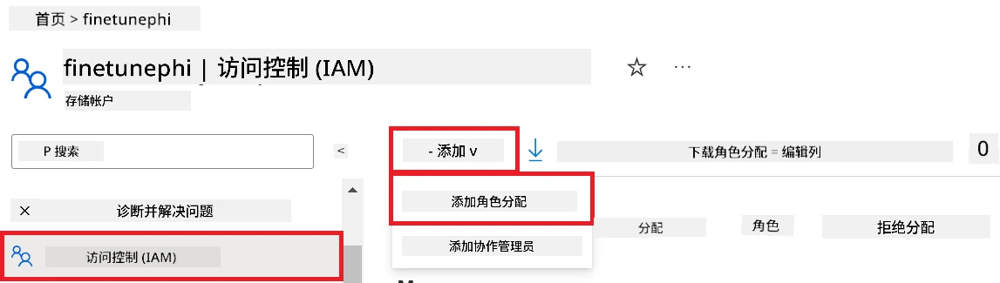

1. 在添加角色分配页面，执行以下任务：

    - 在角色页面的**搜索栏**中输入 *Storage Blob Data Reader*，并从选项中选择 **Storage Blob Data Reader**。
    - 在角色页面，选择 **Next**。
    - 在成员页面，选择 **Assign access to** 的 **Managed identity**。
    - 在成员页面，选择 **+ Select members**。
    - 在选择托管身份页面中，选择您的 Azure **Subscription**。
    - 在选择托管身份页面中，选择 **Managed identity** 为 **Manage Identity**。
    - 在选择托管身份页面中，选择您创建的托管身份。例如，*finetunephi-managedidentity*。
    - 在选择托管身份页面中，选择 **Select**。

    

1. 选择 **Review + assign**。

#### 为托管身份添加 AcrPull 角色分配

1. 在门户页面顶部的**搜索栏**中输入 *container registries*，从出现的选项中选择 **Container registries**。

    

1. 选择与 Azure 机器学习工作区相关联的容器注册表。例如，*finetunephicontainerregistry*。

1. 执行以下任务以导航至添加角色分配页面：

    - 从左侧标签选择 **Access Control (IAM)**。
    - 从导航菜单选择 **+ Add**。
    - 从导航菜单选择 **Add role assignment**。

1. 在添加角色分配页面中执行以下任务：

    - 在角色页面的**搜索栏**中输入 *AcrPull*，并从选项中选择 **AcrPull**。
    - 在角色页面中，选择 **Next**。
    - 在成员页面，选择 **Assign access to** 的 **Managed identity**。
    - 在成员页面，选择 **+ Select members**。
    - 在选择托管身份页面，选择您的 Azure **Subscription**。
    - 在选择托管身份页面，选择 **Managed identity** 为 **Manage Identity**。
    - 在选择托管身份页面，选择您创建的托管身份。例如，*finetunephi-managedidentity*。
    - 在选择托管身份页面，选择 **Select**。
    - 选择 **Review + assign**。

### 设置项目

为了下载微调所需的数据集，您需要设置本地环境。

在本练习中，您将：

- 创建一个用于工作的文件夹。
- 创建一个虚拟环境。
- 安装所需的软件包。
- 创建一个 *download_dataset.py* 文件以下载数据集。

#### 创建一个用于工作的文件夹

1. 打开终端窗口，输入以下命令，在默认路径下创建一个名为 *finetune-phi* 的文件夹。

    ```console
    mkdir finetune-phi
    ```

2. 在终端中输入以下命令以导航到您创建的 *finetune-phi* 文件夹。

    ```console
    cd finetune-phi
    ```

#### 创建虚拟环境

1. 在终端中输入以下命令创建一个名为 *.venv* 的虚拟环境。

    ```console
    python -m venv .venv
    ```

2. 在终端中输入以下命令以激活虚拟环境。

    ```console
    .venv\Scripts\activate.bat
    ```

> [!NOTE]
> 如果成功，您应该在命令提示符前看到 *(.venv)*。

#### 安装所需的包

1. 在终端中输入以下命令以安装所需的包。

    ```console
    pip install datasets==2.19.1
    ```

#### 创建 `download_dataset.py`

> [!NOTE]
> 完整的文件夹结构：
>
> ```text
> └── YourUserName
> .    └── finetune-phi
> .        └── download_dataset.py
> ```

1. 打开 **Visual Studio Code**。

1. 从菜单栏选择 **文件**。

1. 选择 **打开文件夹**。

1. 选择您创建的 *finetune-phi* 文件夹，路径位于 *C:\Users\yourUserName\finetune-phi*。

    

1. 在 Visual Studio Code 的左侧窗格中右键单击，选择 **新建文件**，创建一个名为 *download_dataset.py* 的新文件。

    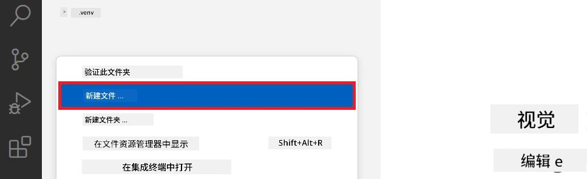

### 准备微调数据集

在本练习中，您将运行 *download_dataset.py* 文件，将 *ultrachat_200k* 数据集下载到本地环境。然后，您将使用该数据集在 Azure Machine Learning 中对 Phi-3 模型进行微调。

本练习中，您将：

- 向 *download_dataset.py* 文件添加代码以下载数据集。
- 运行 *download_dataset.py* 文件将数据集下载到本地环境。

#### 使用 *download_dataset.py* 下载您的数据集

1. 在 Visual Studio Code 中打开 *download_dataset.py* 文件。

1. 向 *download_dataset.py* 文件添加以下代码。

    ```python
    import json
    import os
    from datasets import load_dataset

    def load_and_split_dataset(dataset_name, config_name, split_ratio):
        """
        Load and split a dataset.
        """
        # 加载指定名称、配置和拆分比例的数据集
        dataset = load_dataset(dataset_name, config_name, split=split_ratio)
        print(f"Original dataset size: {len(dataset)}")
        
        # 将数据集拆分为训练集和测试集（80% 训练，20% 测试）
        split_dataset = dataset.train_test_split(test_size=0.2)
        print(f"Train dataset size: {len(split_dataset['train'])}")
        print(f"Test dataset size: {len(split_dataset['test'])}")
        
        return split_dataset

    def save_dataset_to_jsonl(dataset, filepath):
        """
        Save a dataset to a JSONL file.
        """
        # 如果目录不存在，则创建该目录
        os.makedirs(os.path.dirname(filepath), exist_ok=True)
        
        # 以写入模式打开文件
        with open(filepath, 'w', encoding='utf-8') as f:
            # 遍历数据集中的每条记录
            for record in dataset:
                # 将记录作为JSON对象导出并写入文件
                json.dump(record, f)
                # 写入换行符以分隔记录
                f.write('\n')
        
        print(f"Dataset saved to {filepath}")

    def main():
        """
        Main function to load, split, and save the dataset.
        """
        # 加载并拆分带有特定配置和拆分比例的ULTRACHAT_200k数据集
        dataset = load_and_split_dataset("HuggingFaceH4/ultrachat_200k", 'default', 'train_sft[:1%]')
        
        # 从拆分结果中提取训练集和测试集
        train_dataset = dataset['train']
        test_dataset = dataset['test']

        # 将训练集保存为JSONL文件
        save_dataset_to_jsonl(train_dataset, "data/train_data.jsonl")
        
        # 将测试集保存到另一个JSONL文件中
        save_dataset_to_jsonl(test_dataset, "data/test_data.jsonl")

    if __name__ == "__main__":
        main()

    ```

1. 在终端中输入以下命令运行脚本，将数据集下载到本地环境。

    ```console
    python download_dataset.py
    ```

1. 验证数据集是否成功保存到本地的 *finetune-phi/data* 目录。

> [!NOTE]
>
> #### 关于数据集大小和微调时间的说明
>
> 在本教程中，您仅使用数据集的 1%（`split='train[:1%]'`）。这样显著减少了数据量，加快了上传和微调过程的速度。您可以调整此百分比，以找到训练时间与模型性能之间的最佳平衡。使用较小的数据集子集可以缩短微调所需时间，使教程过程更易管理。

## 场景 2：微调 Phi-3 模型并在 Azure Machine Learning Studio 中部署

### 微调 Phi-3 模型

本练习中，您将在 Azure Machine Learning Studio 中微调 Phi-3 模型。

本练习中，您将：

- 创建用于微调的计算集群。
- 在 Azure Machine Learning Studio 中微调 Phi-3 模型。

#### 创建用于微调的计算集群

1. 访问 [Azure ML Studio](https://ml.azure.com/home?wt.mc_id=studentamb_279723)。

1. 从左侧选项卡选择 **计算**。

1. 从导航菜单选择 **计算集群**。

1. 选择 **+ 新建**。

    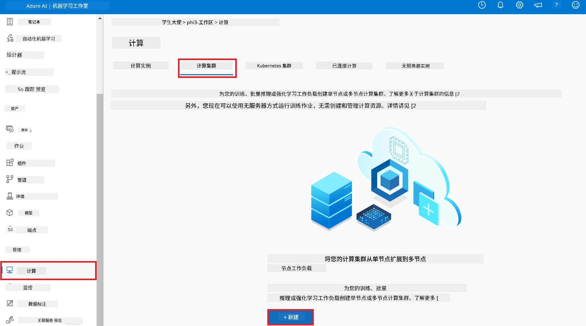

1. 执行以下操作：

    - 选择您想使用的 **区域**。
    - 将 **虚拟机层级** 选择为 **专用**。
    - 将 **虚拟机类型** 选择为 **GPU**。
    - 将 **虚拟机大小** 过滤器选择为 **从所有选项中选择**。
    - 选择 **虚拟机大小** 为 **Standard_NC24ads_A100_v4**。

    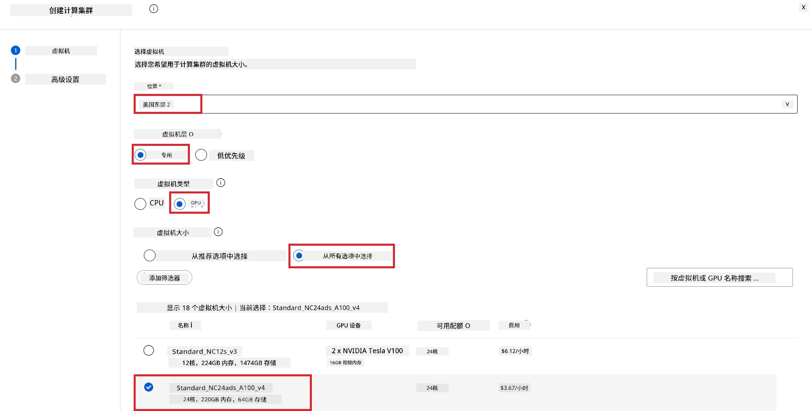

1. 选择 **下一步**。

1. 执行以下操作：

    - 输入 **计算名称**。必须是唯一值。
    - 设置 **最小节点数** 为 **0**。
    - 设置 **最大节点数** 为 **1**。
    - 设置 **空闲秒数后缩减规模** 为 **120**。

    

1. 选择 **创建**。

#### 微调 Phi-3 模型

1. 访问 [Azure ML Studio](https://ml.azure.com/home?wt.mc_id=studentamb_279723)。

1. 选择您创建的 Azure Machine Learning 工作区。

    

1. 执行以下操作：

    - 从左侧选项卡中选择 **模型目录**。
    - 在 **搜索栏** 中输入 *phi-3-mini-4k*，从出现的选项中选择 **Phi-3-mini-4k-instruct**。

    

1. 从导航菜单中选择 **微调**。

    

1. 执行以下操作：

    - 将 **选择任务类型** 设置为 **聊天完成**。
    - 选择 **+ 选择数据** 上传 **训练数据**。
    - 验证数据上传类型选择为 **提供不同的验证数据**。
    - 选择 **+ 选择数据** 上传 **验证数据**。

    

> [!TIP]
>
> 您可以选择 **高级设置** ，自定义如 **learning_rate** 和 **lr_scheduler_type** 等配置，以根据您的具体需求优化微调流程。

1. 选择 **完成**。

1. 在本练习中，您成功使用 Azure Machine Learning 微调了 Phi-3 模型。请注意，微调过程可能需要相当长的时间。运行微调作业后，需要等待其完成。您可以通过导航到 Azure Machine Learning 工作区左侧的作业选项卡来监控微调作业状态。在后续系列中，您将部署微调后的模型并将其与 Prompt flow 集成。

    

### 部署微调后的 Phi-3 模型

为了将微调后的 Phi-3 模型与 Prompt flow 集成，您需要部署该模型以使其实时推断可用。此流程包括注册模型、创建在线端点及部署模型。

本练习中，您将：

- 在 Azure Machine Learning 工作区注册微调模型。
- 创建在线端点。
- 部署已注册的微调 Phi-3 模型。

#### 注册微调后的模型

1. 访问 [Azure ML Studio](https://ml.azure.com/home?wt.mc_id=studentamb_279723)。

1. 选择您创建的 Azure Machine Learning 工作区。

    

1. 从左侧选项卡选择 **模型**。
1. 选择 **+ 注册**。
1. 选择 **从作业输出**。

    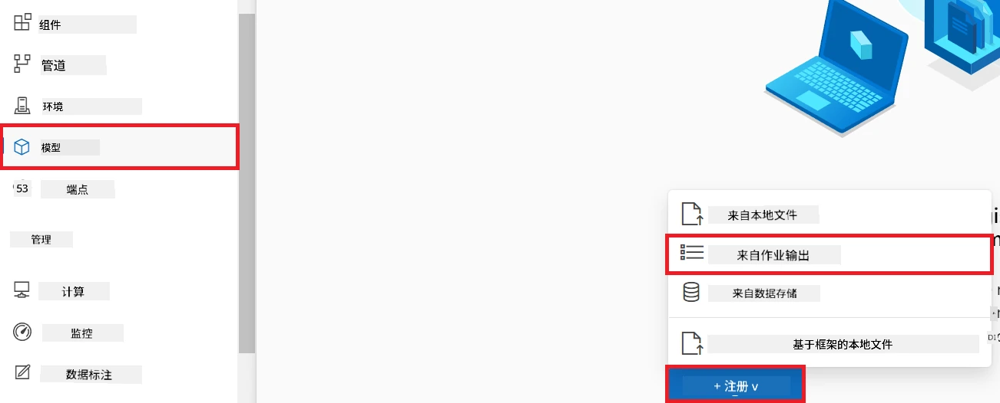

1. 选择您创建的作业。

    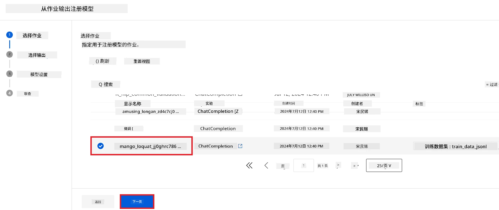

1. 选择 **下一步**。

1. 将 **模型类型** 设置为 **MLflow**。

1. 确认已选择 **作业输出**，该项应自动选中。

    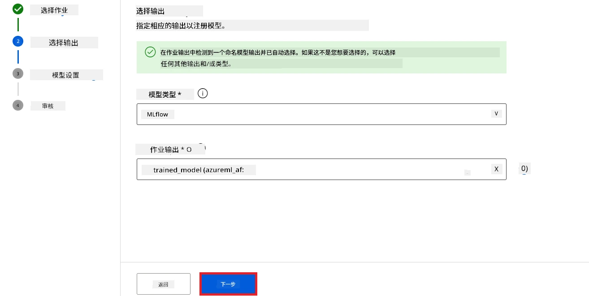

2. 选择 **下一步**。

3. 选择 **注册**。

    

4. 您可以通过左侧选项卡的 **模型** 菜单查看已注册的模型。

    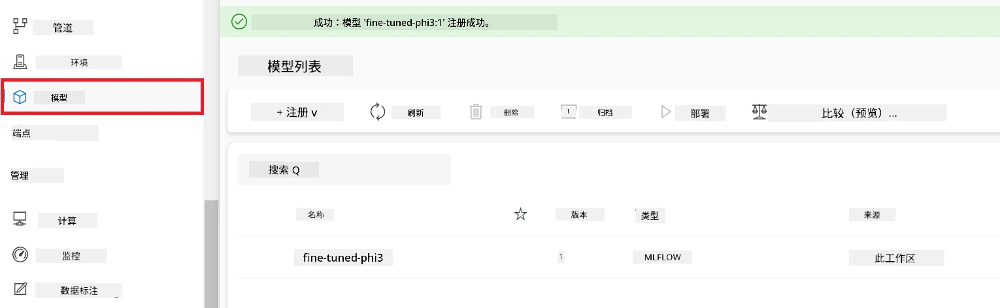

#### 部署微调后的模型

1. 进入您创建的 Azure Machine Learning 工作区。

1. 从左侧选项卡选择 **端点**。

1. 从导航菜单选择 **实时端点**。

    

1. 选择 **创建**。

1. 选择您已注册的模型。

    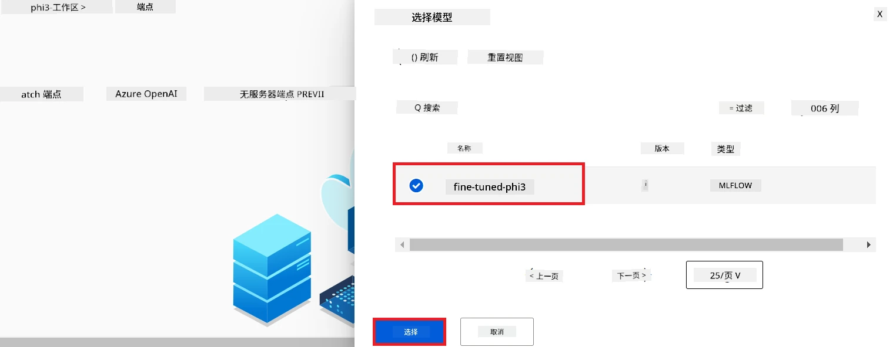

1. 选择 **选择**。

1. 执行以下操作：

    - 将 **虚拟机** 选择为 *Standard_NC6s_v3*。
    - 选择您想使用的 **实例数量**，例如 *1*。
    - 将 **端点** 选择为 **新建**，以创建一个端点。
    - 输入 **端点名称**，必须是唯一值。
    - 输入 **部署名称**，必须是唯一值。

    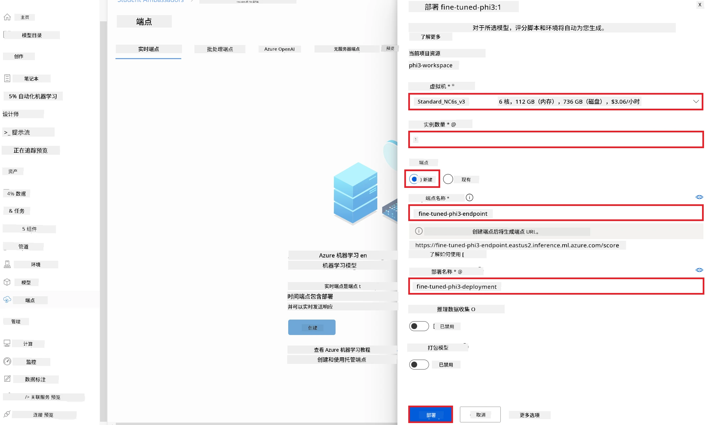

1. 选择 **部署**。

> [!WARNING]
> 为避免额外费用，请确保在 Azure Machine Learning 工作区中删除创建的端点。
>

#### 在 Azure Machine Learning 工作区检查部署状态

1. 进入您创建的 Azure Machine Learning 工作区。

1. 从左侧选项卡选择 **端点**。

1. 选择您创建的端点。

    

1. 在此页面，您可以在部署过程中管理端点。

> [!NOTE]
> 部署完成后，确保 **实时流量** 设置为 **100%**。如果不是，请选择 **更新流量** 以调整流量设置。注意当流量设置为 0% 时，您无法测试模型。
>
> 
>

## 场景 3：与 Prompt flow 集成并在 Azure AI Foundry 中与您的自定义模型聊天

### 将自定义 Phi-3 模型集成至 Prompt flow

成功部署微调模型后，您现在可以将其与 Prompt Flow 集成，以便在实时应用中使用您的模型，实现与自定义 Phi-3 模型的各种交互任务。

本练习中，您将：

- 创建 Azure AI Foundry 集线器。
- 创建 Azure AI Foundry 项目。
- 创建 Prompt flow。
- 为微调的 Phi-3 模型添加自定义连接。
- 配置 Prompt flow 与您的自定义 Phi-3 模型进行聊天。

> [!NOTE]
> 您也可以使用 Azure ML Studio 与 Promptflow 集成。相同的集成流程适用于 Azure ML Studio。

#### 创建 Azure AI Foundry 集线器

在创建项目之前，您需要先创建一个集线器。集线器类似于资源组，可帮助您在 Azure AI Foundry 中组织和管理多个项目。

1. 访问 [Azure AI Foundry](https://ai.azure.com/?WT.mc_id=aiml-137032-kinfeylo)。

1. 从左侧选项卡选择 **所有集线器**。

1. 从导航菜单中选择 **+ 新建集线器**。
    

1. 执行以下任务：

    - 输入 **中心名称**，必须是唯一值。
    - 选择您的 Azure **订阅**。
    - 选择要使用的 **资源组**（如有需要，可创建新的资源组）。
    - 选择您想使用的 **位置**。
    - 选择要使用的 **连接 Azure AI 服务**（如有需要，可创建新的服务）。
    - 选择 **连接 Azure AI 搜索** 并选择 **跳过连接**。

    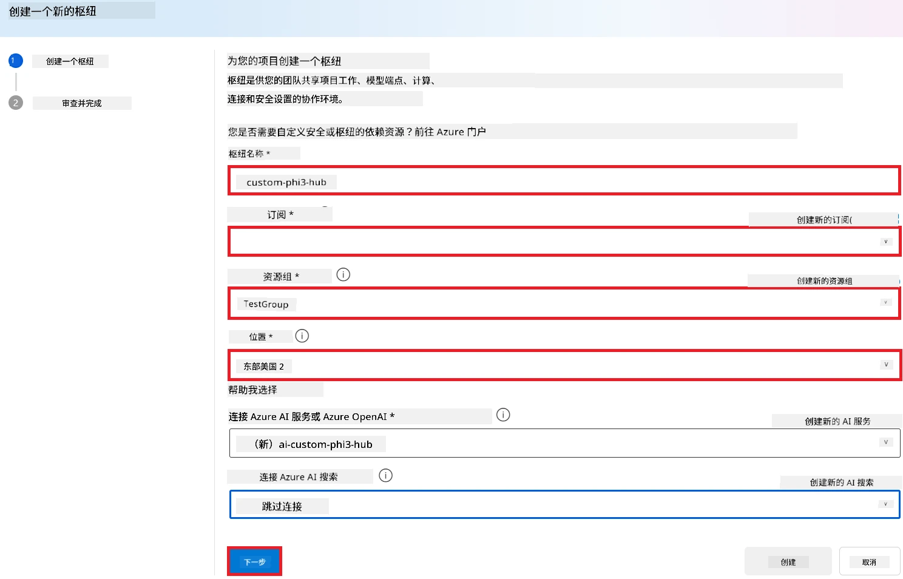

1. 选择 **下一步**。

#### 创建 Azure AI Foundry 项目

1. 在您创建的中心中，从左侧选项卡选择 **所有项目**。

1. 从导航菜单中选择 **+ 新建项目**。

    

1. 输入 **项目名称**，必须是唯一值。

    

1. 选择 **创建项目**。

#### 为微调后的 Phi-3 模型添加自定义连接

要将您的自定义 Phi-3 模型与 Prompt flow 集成，需要在自定义连接中保存模型的端点和密钥。此设置确保可以在 Prompt flow 中访问您的自定义 Phi-3 模型。

#### 设置微调后的 Phi-3 模型的 api 密钥和端点 URI

1. 访问 [Azure ML Studio](https://ml.azure.com/home?WT.mc_id=aiml-137032-kinfeylo)。

1. 导航到您创建的 Azure 机器学习工作区。

1. 从左侧选项卡中选择 **端点**。

    

1. 选择您创建的端点。

    

1. 从导航菜单选择 **使用**。

1. 复制您的 **REST 端点** 和 **主密钥**。

    

#### 添加自定义连接

1. 访问 [Azure AI Foundry](https://ai.azure.com/?WT.mc_id=aiml-137032-kinfeylo)。

1. 导航到您创建的 Azure AI Foundry 项目。

1. 在您创建的项目中，从左侧选项卡选择 **设置**。

1. 选择 **+ 新建连接**。

    

1. 从导航菜单选择 **自定义密钥**。

    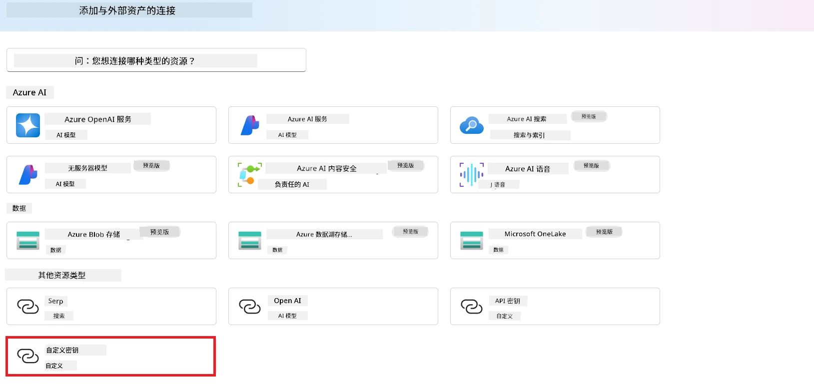

1. 执行以下任务：

    - 选择 **+ 添加键值对**。
    - 键名称输入 **endpoint**，并粘贴您从 Azure ML Studio 复制的端点到值字段。
    - 再次选择 **+ 添加键值对**。
    - 键名称输入 **key**，并粘贴您从 Azure ML Studio 复制的密钥到值字段。
    - 添加密钥后，选择 **是密钥** 防止密钥被泄露。

    

1. 选择 **添加连接**。

#### 创建 Prompt flow

您已在 Azure AI Foundry 中添加了自定义连接。现在，让我们使用以下步骤创建一个 Prompt flow。然后，您将把此 Prompt flow 连接到自定义连接，以便能在 Prompt flow 中使用微调模型。

1. 导航到您创建的 Azure AI Foundry 项目。

1. 从左侧选项卡选择 **Prompt flow**。

1. 从导航菜单选择 **+ 创建**。

    

1. 从导航菜单选择 **聊天流**。

    

1. 输入要使用的 **文件夹名称**。

    

2. 选择 **创建**。

#### 设置 Prompt flow 以与您的自定义 Phi-3 模型聊天

您需要将微调后的 Phi-3 模型集成到 Prompt flow 中。但是，现有提供的 Prompt flow 并非为此目的设计。因此，您必须重新设计 Prompt flow 以实现自定义模型的集成。

1. 在 Prompt flow 中执行以下任务以重建现有流程：

    - 选择 **原始文件模式**。
    - 删除 *flow.dag.yml* 文件中的所有现有代码。
    - 将以下代码添加到 *flow.dag.yml* 文件中。

        ```yml
        inputs:
          input_data:
            type: string
            default: "Who founded Microsoft?"

        outputs:
          answer:
            type: string
            reference: ${integrate_with_promptflow.output}

        nodes:
        - name: integrate_with_promptflow
          type: python
          source:
            type: code
            path: integrate_with_promptflow.py
          inputs:
            input_data: ${inputs.input_data}
        ```

    - 选择 **保存**。

    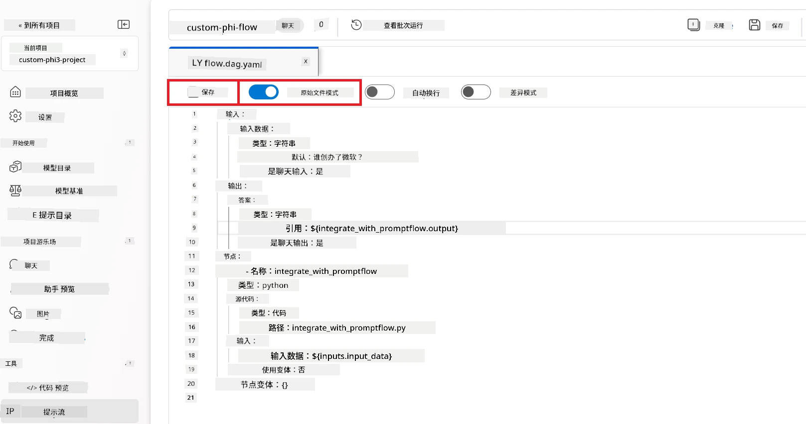

1. 将以下代码添加到 *integrate_with_promptflow.py* 文件中，以在 Prompt flow 中使用自定义 Phi-3 模型。

    ```python
    import logging
    import requests
    from promptflow import tool
    from promptflow.connections import CustomConnection

    # 日志设置
    logging.basicConfig(
        format="%(asctime)s - %(levelname)s - %(name)s - %(message)s",
        datefmt="%Y-%m-%d %H:%M:%S",
        level=logging.DEBUG
    )
    logger = logging.getLogger(__name__)

    def query_phi3_model(input_data: str, connection: CustomConnection) -> str:
        """
        Send a request to the Phi-3 model endpoint with the given input data using Custom Connection.
        """

        # "connection" 是自定义连接的名称，"endpoint" 和 "key" 是自定义连接中的键
        endpoint_url = connection.endpoint
        api_key = connection.key

        headers = {
            "Content-Type": "application/json",
            "Authorization": f"Bearer {api_key}"
        }
        data = {
            "input_data": {
                "input_string": [
                    {"role": "user", "content": input_data}
                ],
                "parameters": {
                    "temperature": 0.7,
                    "max_new_tokens": 128
                }
            }
        }
        try:
            response = requests.post(endpoint_url, json=data, headers=headers)
            response.raise_for_status()
            
            # 记录完整的 JSON 响应
            logger.debug(f"Full JSON response: {response.json()}")

            result = response.json()["output"]
            logger.info("Successfully received response from Azure ML Endpoint.")
            return result
        except requests.exceptions.RequestException as e:
            logger.error(f"Error querying Azure ML Endpoint: {e}")
            raise

    @tool
    def my_python_tool(input_data: str, connection: CustomConnection) -> str:
        """
        Tool function to process input data and query the Phi-3 model.
        """
        return query_phi3_model(input_data, connection)

    ```

    

> [!NOTE]
> 有关在 Azure AI Foundry 中使用 Prompt flow 的更详细信息，请参阅[Azure AI Foundry 中的 Prompt flow](https://learn.microsoft.com/azure/ai-studio/how-to/prompt-flow)。

1. 选择 **聊天输入**、**聊天输出** 以启用与模型的聊天。

    

1. 现在，您已准备好与自定义 Phi-3 模型聊天。在下一个练习中，您将学习如何启动 Prompt flow 并使用它与微调 Phi-3 模型进行聊天。

> [!NOTE]
>
> 重建的流程应如下图所示：
>
> 
>

### 与您的自定义 Phi-3 模型聊天

现在您已微调并将自定义 Phi-3 模型与 Prompt flow 集成，准备开始与其互动。本练习将引导您完成使用 Prompt flow 设置和启动与模型聊天的过程。通过遵循这些步骤，您将能够充分利用微调 Phi-3 模型的各种任务和对话功能。

- 使用 Prompt flow 与您的自定义 Phi-3 模型聊天。

#### 启动 Prompt flow

1. 选择 **启动计算会话** 以启动 Prompt flow。

    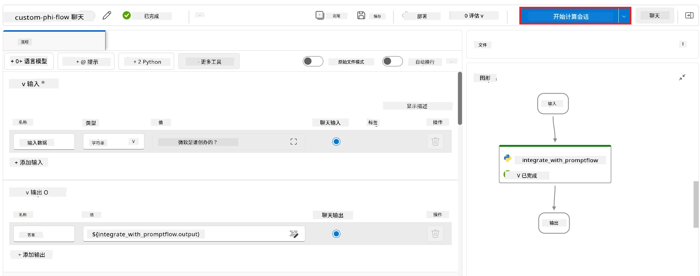

1. 选择 **验证并解析输入** 以更新参数。

    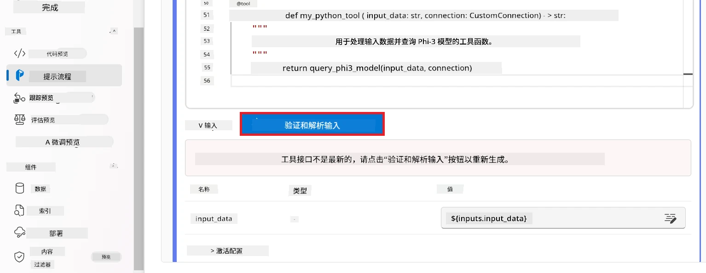

1. 选择您创建的自定义连接的 **连接** 的 **值**。例如，*connection*。

    

#### 与您的自定义模型聊天

1. 选择 **聊天**。

    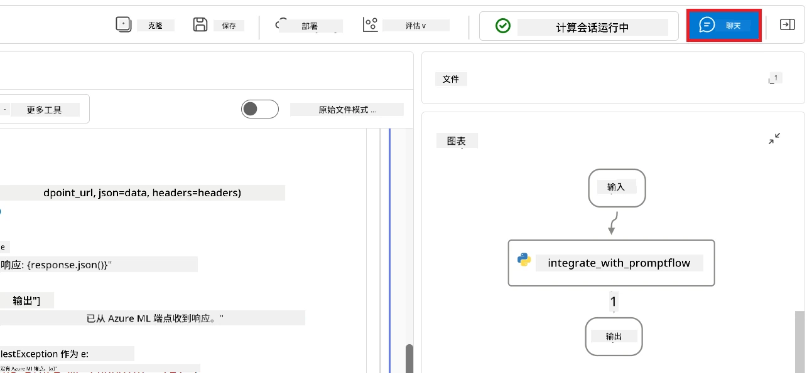

1. 以下是结果示例：现在您可以与您的自定义 Phi-3 模型聊天。建议基于微调所使用的数据进行提问。

    

---

<!-- CO-OP TRANSLATOR DISCLAIMER START -->
**免责声明**：
本文件由人工智能翻译服务[Co-op Translator](https://github.com/Azure/co-op-translator)翻译。尽管我们力求准确，但请注意，自动翻译可能包含错误或不准确之处。请将原文的母语版本视为权威来源。对于关键信息，建议采用专业人工翻译。我们不对因使用本翻译而产生的任何误解或误释承担责任。
<!-- CO-OP TRANSLATOR DISCLAIMER END -->