# 在 Microsoft Foundry 中使用 Prompt flow 微调和集成自定义 Phi-3 模型

此端到端（E2E）示例基于微软技术社区的指南"[在 Microsoft Foundry 中使用 Prompt Flow 微调和集成自定义 Phi-3 模型](https://techcommunity.microsoft.com/t5/educator-developer-blog/fine-tune-and-integrate-custom-phi-3-models-with-prompt-flow-in/ba-p/4191726?WT.mc_id=aiml-137032-kinfeylo)"。它介绍了微调、部署以及将自定义 Phi-3 模型与 Microsoft Foundry 中的 Prompt flow 集成的流程。  
与涉及本地运行代码的 E2E 示例"[Fine-Tune and Integrate Custom Phi-3 Models with Prompt Flow](./E2E_Phi-3-FineTuning_PromptFlow_Integration.md)"不同，本教程完全专注于在 Azure AI/ML Studio 内微调和集成您的模型。

## 概述

在该 E2E 示例中，您将学习如何微调 Phi-3 模型，并将其与 Microsoft Foundry 中的 Prompt flow 集成。通过利用 Azure AI / ML Studio，您将建立一个用于部署和使用自定义 AI 模型的工作流。该 E2E 示例分为三个场景：

**场景 1：设置 Azure 资源并准备微调**

**场景 2：微调 Phi-3 模型并在 Azure 机器学习工作室中部署**

**场景 3：与 Prompt flow 集成并在 Microsoft Foundry 中与自定义模型聊天**

以下是该 E2E 示例的概览。

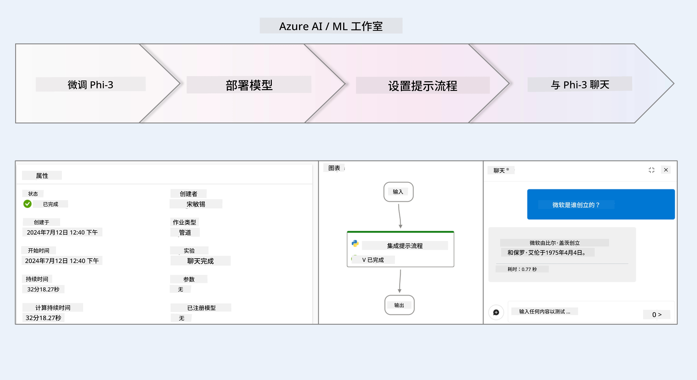

### 目录

1. **[场景 1：设置 Azure 资源并准备微调](../../../../../../md/02.Application/01.TextAndChat/Phi3)**  
    - [创建 Azure 机器学习工作区](../../../../../../md/02.Application/01.TextAndChat/Phi3)  
    - [在 Azure 订阅中请求 GPU 配额](../../../../../../md/02.Application/01.TextAndChat/Phi3)  
    - [添加角色分配](../../../../../../md/02.Application/01.TextAndChat/Phi3)  
    - [设置项目](../../../../../../md/02.Application/01.TextAndChat/Phi3)  
    - [准备微调数据集](../../../../../../md/02.Application/01.TextAndChat/Phi3)  

1. **[场景 2：微调 Phi-3 模型并在 Azure 机器学习工作室中部署](../../../../../../md/02.Application/01.TextAndChat/Phi3)**  
    - [微调 Phi-3 模型](../../../../../../md/02.Application/01.TextAndChat/Phi3)  
    - [部署微调的 Phi-3 模型](../../../../../../md/02.Application/01.TextAndChat/Phi3)  

1. **[场景 3：与 Prompt flow 集成并在 Microsoft Foundry 中与自定义模型聊天](../../../../../../md/02.Application/01.TextAndChat/Phi3)**  
    - [将自定义 Phi-3 模型与 Prompt flow 集成](../../../../../../md/02.Application/01.TextAndChat/Phi3)  
    - [与您的自定义 Phi-3 模型聊天](../../../../../../md/02.Application/01.TextAndChat/Phi3)  

## 场景 1：设置 Azure 资源并准备微调

### 创建 Azure 机器学习工作区

1. 在门户页面顶部的**搜索栏**中输入 *azure machine learning*，然后从出现的选项中选择**Azure Machine Learning**。

    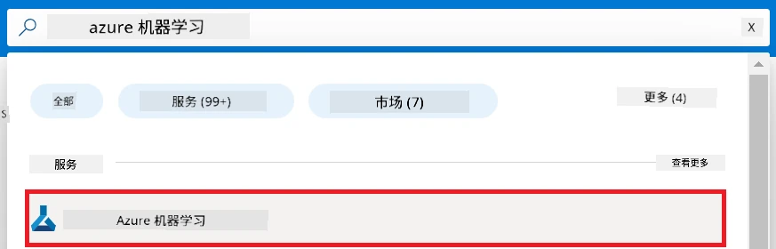

2. 从导航菜单中选择 **+ Create**。

3. 从导航菜单中选择 **New workspace**。

    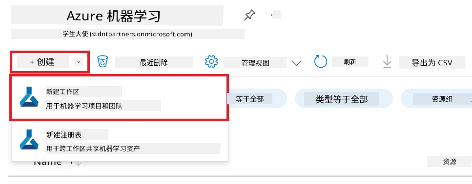

4. 执行以下任务：

    - 选择您的 Azure **订阅**。  
    - 选择要使用的**资源组**（如有需要可创建新组）。  
    - 输入 **工作区名称**。必须是唯一值。  
    - 选择您想使用的 **区域**。  
    - 选择要使用的**存储帐户**（如有需要可创建新帐户）。  
    - 选择要使用的**密钥库**（如有需要可创建新密钥库）。  
    - 选择要使用的**应用程序洞察**（如有需要可创建新的）。  
    - 选择要使用的**容器注册表**（如有需要可创建新的）。

    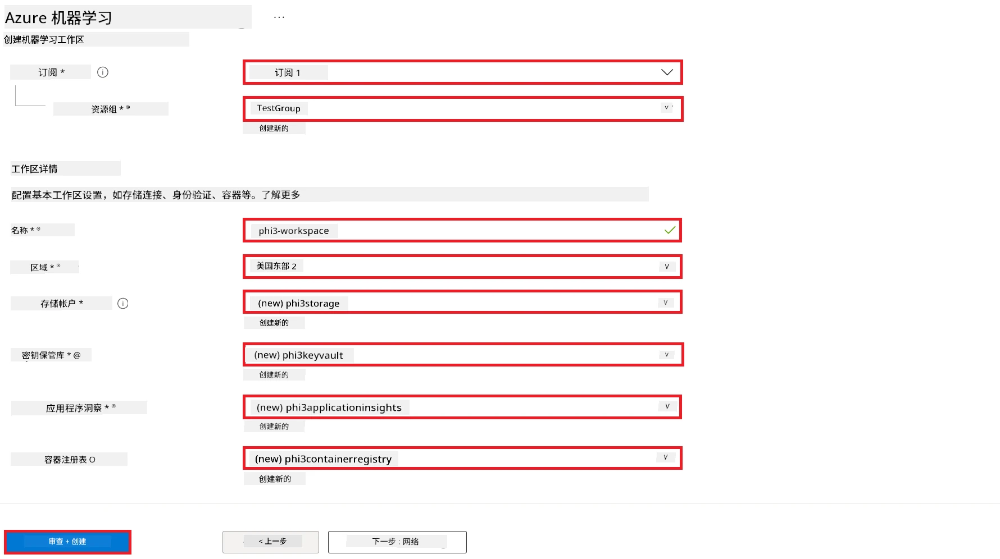

5. 选择 **Review + Create**。

6. 选择 **Create**。

### 在 Azure 订阅中请求 GPU 配额

在本教程中，您将学习如何使用 GPU 微调和部署 Phi-3 模型。微调时，您将使用 *Standard_NC24ads_A100_v4* GPU，该型号需要请求配额。部署时，您将使用 *Standard_NC6s_v3* GPU，也需请求配额。

> [!NOTE]
> 
> 只有按用量付费订阅（标准订阅类型）才有资格分配 GPU；优惠订阅当前不支持。

1. 访问 [Azure ML Studio](https://ml.azure.com/home?wt.mc_id=studentamb_279723)。

1. 执行以下操作以请求 *Standard NCADSA100v4 Family* 配额：

    - 从左侧标签选择 **Quota**。  
    - 选择要使用的 **虚拟机系列**。例如，选择 **Standard NCADSA100v4 Family Cluster Dedicated vCPUs**，其中包含 *Standard_NC24ads_A100_v4* GPU。  
    - 从导航菜单中选择 **Request quota**。

        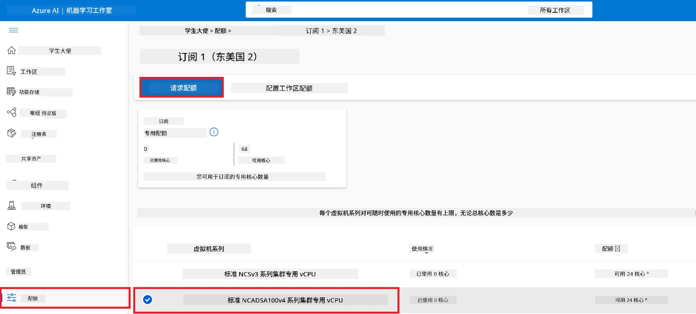

    - 在“请求配额”页面中，输入您想使用的 **新核心数限制**，例如 24。  
    - 在“请求配额”页面中，选择 **Submit** 以请求 GPU 配额。

1. 执行以下操作以请求 *Standard NCSv3 Family* 配额：

    - 从左侧标签选择 **Quota**。  
    - 选择要使用的 **虚拟机系列**。例如，选择 **Standard NCSv3 Family Cluster Dedicated vCPUs**，其中包含 *Standard_NC6s_v3* GPU。  
    - 从导航菜单中选择 **Request quota**。  
    - 在“请求配额”页面中，输入您想使用的 **新核心数限制**，例如 24。  
    - 在“请求配额”页面中，选择 **Submit** 以请求 GPU 配额。

### 添加角色分配

要微调和部署您的模型，必须首先创建一个用户分配托管标识（User Assigned Managed Identity, UAI）并赋予其相应权限。此 UAI 将在部署过程中用于身份验证。

#### 创建用户分配托管标识 (UAI)

1. 在门户页面顶部的**搜索栏**中输入 *managed identities*，然后从出现的选项中选择**Managed Identities**。

    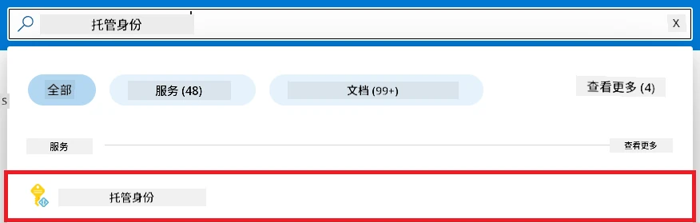

1. 选择 **+ Create**。

    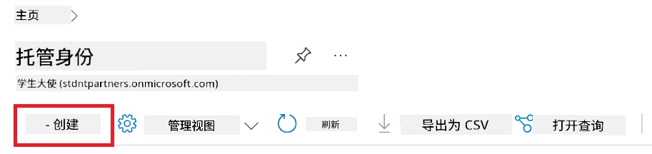

1. 执行以下任务：

    - 选择您的 Azure **订阅**。  
    - 选择要使用的**资源组**（如有需要可创建新组）。  
    - 选择您想使用的 **区域**。  
    - 输入**名称**，必须是唯一值。

    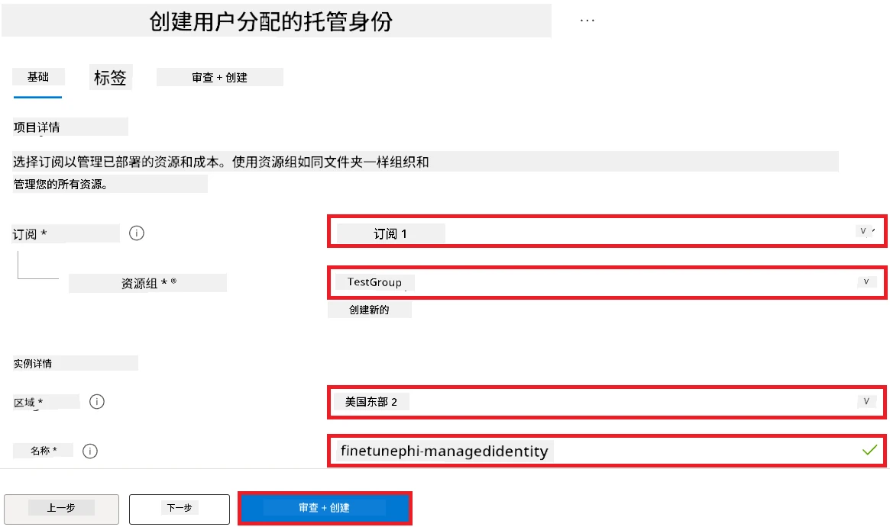

1. 选择 **Review + create**。

1. 选择 **+ Create**。

#### 为托管标识添加 Contributor 角色分配

1. 打开您创建的托管标识资源。

1. 从左侧标签选择 **Azure role assignments**。

1. 从导航菜单中选择 **+Add role assignment**。

1. 在添加角色分配页面中，执行以下操作：

    - 将**作用范围**（Scope）选择为**资源组**。  
    - 选择您的 Azure **订阅**。  
    - 选择要使用的**资源组**。  
    - 将**角色**选择为**Contributor**。

    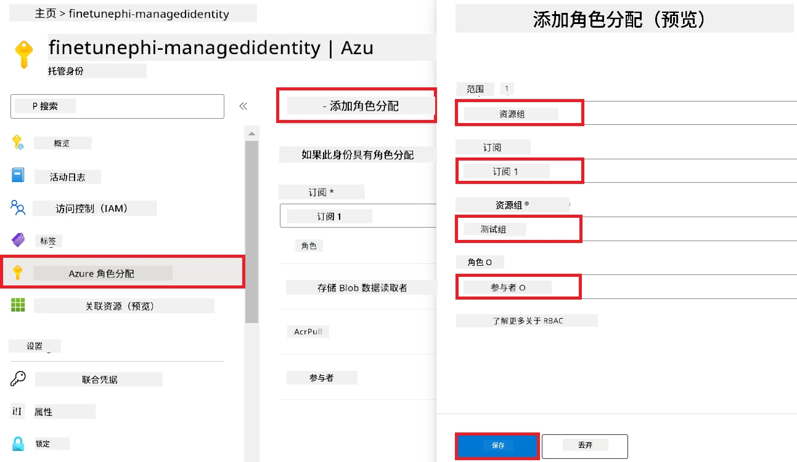

2. 选择 **Save**。

#### 为托管标识添加 Storage Blob Data Reader 角色分配

1. 在门户页面顶部的**搜索栏**中输入 *storage accounts*，然后从出现的选项中选择**Storage accounts**。

    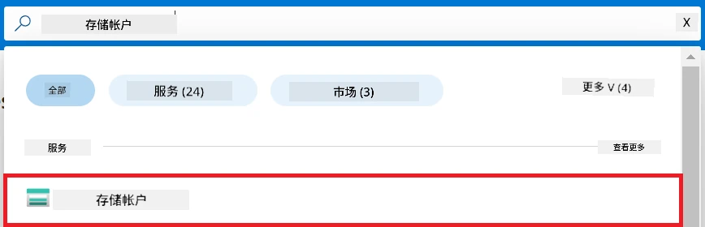

1. 选择与您创建的 Azure 机器学习工作区关联的存储帐户。例如，*finetunephistorage*。

1. 执行以下操作以导航到添加角色分配页面：

    - 导航到您创建的 Azure 存储帐户。  
    - 从左侧标签选择 **Access Control (IAM)**。  
    - 从导航菜单中选择 **+ Add**。  
    - 选择 **Add role assignment**。

    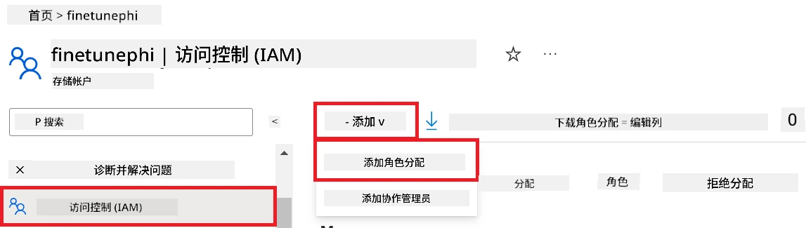

1. 在添加角色分配页面，执行以下操作：

    - 在角色页面的**搜索栏**中输入 *Storage Blob Data Reader*，并从选项中选择 **Storage Blob Data Reader**。  
    - 选择 **Next**。  
    - 在成员页面，选择 **Assign access to** 为 **Managed identity**。  
    - 选择 **+ Select members**。  
    - 选择您的 Azure **订阅**。  
    - 选择要赋权的**托管标识**。  
    - 选择您创建的托管标识。例如，*finetunephi-managedidentity*。  
    - 选择 **Select**。

    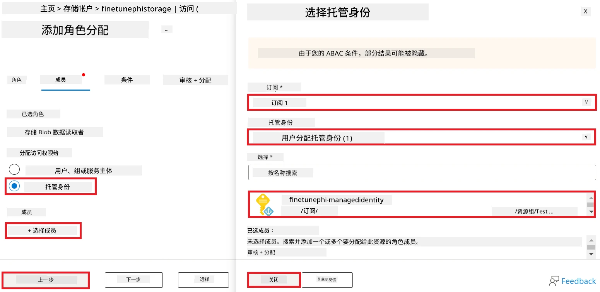

1. 选择 **Review + assign**。

#### 为托管标识添加 AcrPull 角色分配

1. 在门户页面顶部的**搜索栏**中输入 *container registries*，然后从出现的选项中选择**Container registries**。

    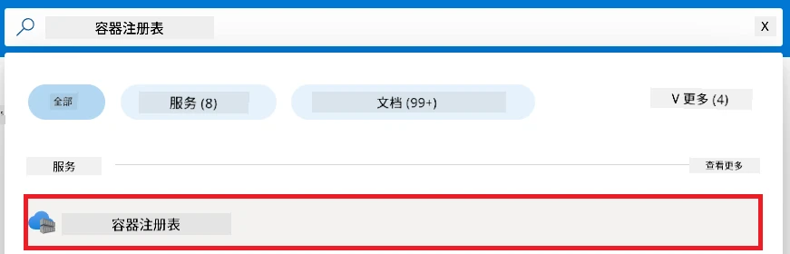

1. 选择与 Azure 机器学习工作区关联的容器注册表。例如，*finetunephicontainerregistry*。

1. 执行以下操作以导航到添加角色分配页面：

    - 从左侧标签选择 **Access Control (IAM)**。  
    - 从导航菜单中选择 **+ Add**。  
    - 选择 **Add role assignment**。

1. 在添加角色分配页面，执行以下操作：

    - 在角色页面的**搜索栏**中输入 *AcrPull*，并选择 **AcrPull**。  
    - 选择 **Next**。  
    - 在成员页面，选择 **Assign access to** 为 **Managed identity**。  
    - 选择 **+ Select members**。  
    - 选择您的 Azure **订阅**。  
    - 选择要赋权的**托管标识**。  
    - 选择您创建的托管标识。例如，*finetunephi-managedidentity*。  
    - 选择 **Select**。  
    - 选择 **Review + assign**。

### 设置项目

为了下载微调所需的数据集，您将设置本地环境。

在此练习中，您将：

- 创建一个用于工作的文件夹。  
- 创建虚拟环境。  
- 安装所需的软件包。  
- 创建一个 *download_dataset.py* 文件以下载数据集。

#### 创建用于工作的文件夹

1. 打开终端窗口，输入以下命令以在默认路径下创建名为 *finetune-phi* 的文件夹。

    ```console
    mkdir finetune-phi
    ```


2. 在终端中输入以下命令以导航到您创建的 *finetune-phi* 文件夹。

    ```console
    cd finetune-phi
    ```


#### 创建虚拟环境

1. 在终端中输入以下命令以创建名为 *.venv* 的虚拟环境。
    ```console
    python -m venv .venv
    ```

2. 在终端中键入以下命令以激活虚拟环境。

    ```console
    .venv\Scripts\activate.bat
    ```

> [!NOTE]
> 如果成功，您应该在命令提示符前看到 *(.venv)*。

#### 安装所需的包

1. 在终端中键入以下命令以安装所需包。

    ```console
    pip install datasets==2.19.1
    ```

#### 创建 `donload_dataset.py`

> [!NOTE]
> 完整的文件夹结构：
>
> ```text
> └── YourUserName
> .    └── finetune-phi
> .        └── download_dataset.py
> ```

1. 打开 **Visual Studio Code**。

1. 从菜单栏中选择 **文件**。

1. 选择 **打开文件夹**。

1. 选择您创建的 *finetune-phi* 文件夹，该文件夹位于 *C:\Users\yourUserName\finetune-phi*。

    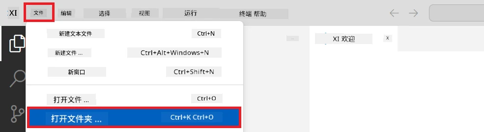

1. 在 Visual Studio Code 左侧窗格中右键点击并选择 **新建文件**，创建一个名为 *download_dataset.py* 的新文件。

    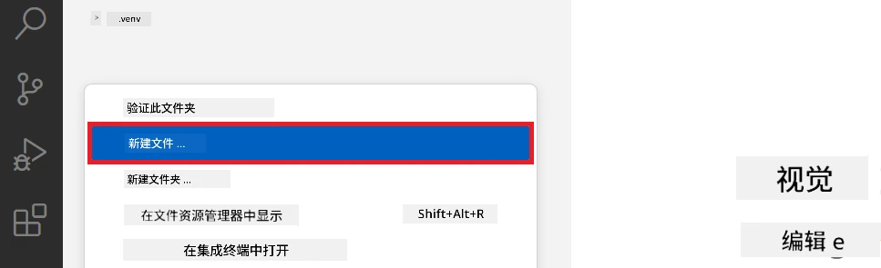

### 准备微调的数据集

在此练习中，您将运行 *download_dataset.py* 文件，将 *ultrachat_200k* 数据集下载到本地环境。然后，您将使用该数据集在 Azure 机器学习中微调 Phi-3 模型。

在此练习中，您将：

- 向 *download_dataset.py* 文件添加代码以下载数据集。
- 运行 *download_dataset.py* 文件将数据集下载到本地环境。

#### 使用 *download_dataset.py* 下载数据集

1. 在 Visual Studio Code 中打开 *download_dataset.py* 文件。

1. 将以下代码添加到 *download_dataset.py* 文件中。

    ```python
    import json
    import os
    from datasets import load_dataset

    def load_and_split_dataset(dataset_name, config_name, split_ratio):
        """
        Load and split a dataset.
        """
        # 加载具有指定名称、配置和拆分比例的数据集
        dataset = load_dataset(dataset_name, config_name, split=split_ratio)
        print(f"Original dataset size: {len(dataset)}")
        
        # 将数据集拆分为训练集和测试集（80%训练，20%测试）
        split_dataset = dataset.train_test_split(test_size=0.2)
        print(f"Train dataset size: {len(split_dataset['train'])}")
        print(f"Test dataset size: {len(split_dataset['test'])}")
        
        return split_dataset

    def save_dataset_to_jsonl(dataset, filepath):
        """
        Save a dataset to a JSONL file.
        """
        # 如果目录不存在则创建目录
        os.makedirs(os.path.dirname(filepath), exist_ok=True)
        
        # 以写模式打开文件
        with open(filepath, 'w', encoding='utf-8') as f:
            # 遍历数据集中的每条记录
            for record in dataset:
                # 将记录以JSON对象格式导出并写入文件
                json.dump(record, f)
                # 写入换行符以分隔记录
                f.write('\n')
        
        print(f"Dataset saved to {filepath}")

    def main():
        """
        Main function to load, split, and save the dataset.
        """
        # 加载并拆分ULTRACHAT_200k数据集，使用特定的配置和拆分比例
        dataset = load_and_split_dataset("HuggingFaceH4/ultrachat_200k", 'default', 'train_sft[:1%]')
        
        # 从拆分中提取训练集和测试集
        train_dataset = dataset['train']
        test_dataset = dataset['test']

        # 将训练集保存到JSONL文件
        save_dataset_to_jsonl(train_dataset, "data/train_data.jsonl")
        
        # 将测试集保存到单独的JSONL文件
        save_dataset_to_jsonl(test_dataset, "data/test_data.jsonl")

    if __name__ == "__main__":
        main()

    ```

1. 在终端中键入以下命令以运行脚本并将数据集下载到本地环境。

    ```console
    python download_dataset.py
    ```

1. 确认数据集已成功保存到本地 *finetune-phi/data* 目录。

> [!NOTE]
>
> #### 关于数据集大小和微调时间的说明
>
> 在本教程中，您只使用了数据集的 1%（`split='train[:1%]'`）。这显著减少了数据量，加速了上传和微调过程。您可以调整该百分比，以在训练时间和模型性能之间找到合适的平衡。使用较小的数据子集减少微调所需时间，使教程过程更易管理。

## 场景 2：微调 Phi-3 模型并在 Azure 机器学习 Studio 部署

### 微调 Phi-3 模型

在此练习中，您将在 Azure 机器学习 Studio 中微调 Phi-3 模型。

在此练习中，您将：

- 创建用于微调的计算集群。
- 在 Azure 机器学习 Studio 中微调 Phi-3 模型。

#### 创建用于微调的计算集群

1. 访问 [Azure ML Studio](https://ml.azure.com/home?wt.mc_id=studentamb_279723)。

1. 从左侧标签中选择 **计算**。

1. 从导航菜单中选择 **计算集群**。

1. 选择 **+ 新建**。

    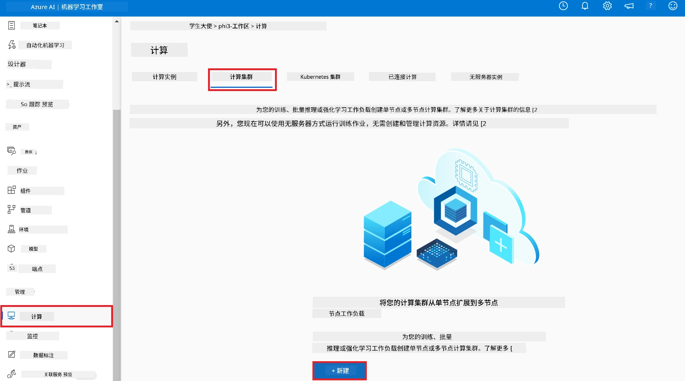

1. 执行以下操作：

    - 选择您想使用的 **区域**。
    - 将 **虚拟机层级** 设置为 **专用**。
    - 将 **虚拟机类型** 设置为 **GPU**。
    - 将 **虚拟机大小** 筛选器设置为 **从所有选项中选择**。
    - 选择 **虚拟机大小** 为 **Standard_NC24ads_A100_v4**。

    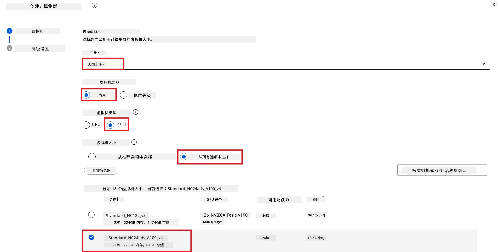

1. 选择 **下一步**。

1. 执行以下操作：

    - 输入 **计算名称**，必须唯一。
    - 将 **最小节点数** 设置为 **0**。
    - 将 **最大节点数** 设置为 **1**。
    - 将 **闲置多少秒后缩减规模** 设置为 **120**。

    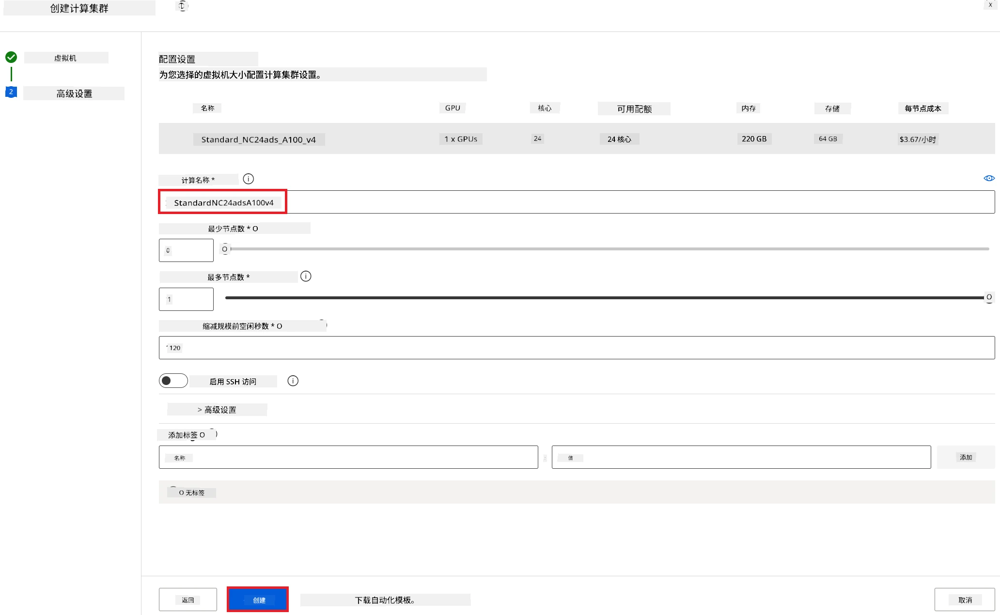

1. 选择 **创建**。

#### 微调 Phi-3 模型

1. 访问 [Azure ML Studio](https://ml.azure.com/home?wt.mc_id=studentamb_279723)。

1. 选择您创建的 Azure 机器学习工作区。

    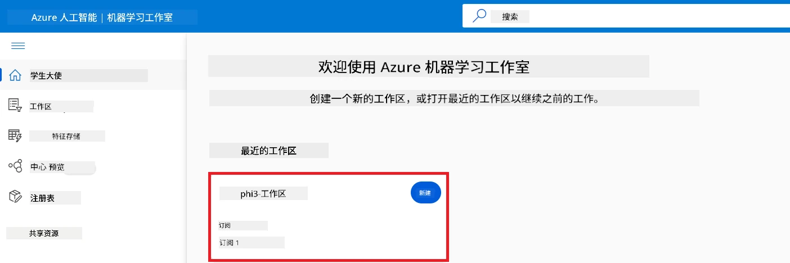

1. 执行以下操作：

    - 从左侧标签选择 **模型目录**。
    - 在 **搜索栏** 中键入 *phi-3-mini-4k*，然后从出现的选项中选择 **Phi-3-mini-4k-instruct**。

    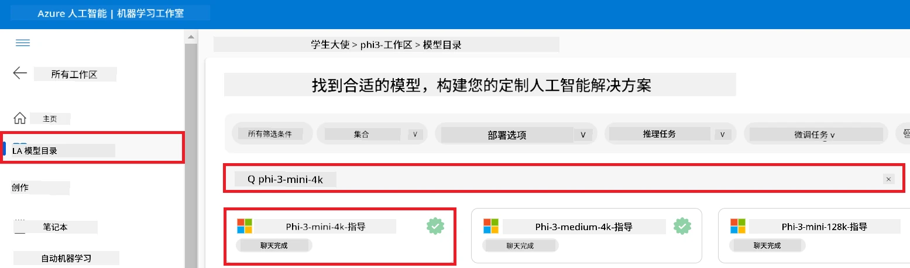

1. 从导航菜单中选择 **微调**。

    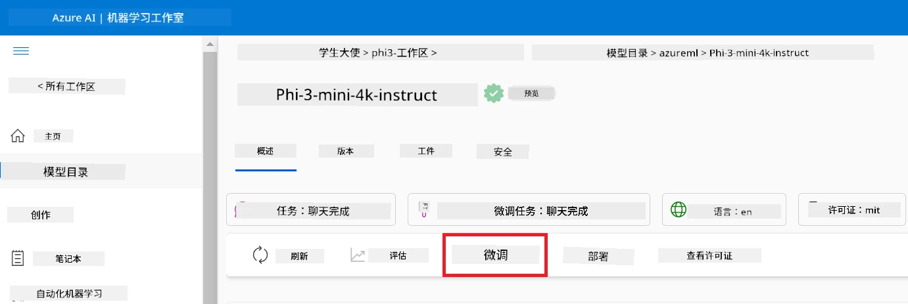

1. 执行以下操作：

    - 将 **选择任务类型** 设为 **聊天完成**。
    - 选择 **+ 选择数据** 上传 **训练数据**。
    - 选择验证数据上传类型为 **提供不同的验证数据**。
    - 选择 **+ 选择数据** 上传 **验证数据**。

    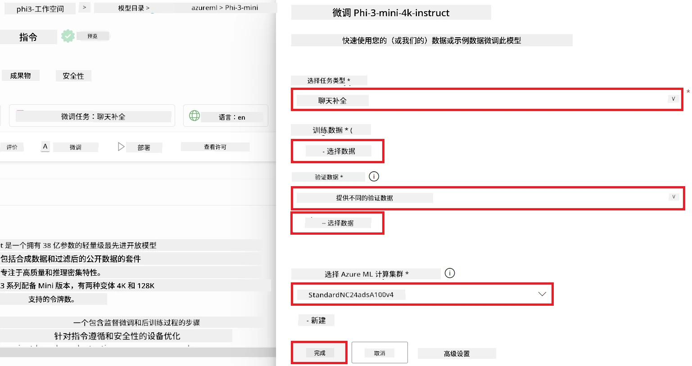

> [!TIP]
>
> 您可以选择 **高级设置** 来自定义配置，例如 **learning_rate** 和 **lr_scheduler_type**，以根据您的特定需求优化微调过程。

1. 选择 **完成**。

1. 在本练习中，您已成功使用 Azure 机器学习微调了 Phi-3 模型。请注意，微调过程可能需要相当长的时间。启动微调作业后，您需要等待其完成。可以通过导航到 Azure 机器学习工作区左侧的作业标签页来监控微调作业状态。在后续系列中，您将部署微调后的模型并将其与 Prompt Flow 集成。

    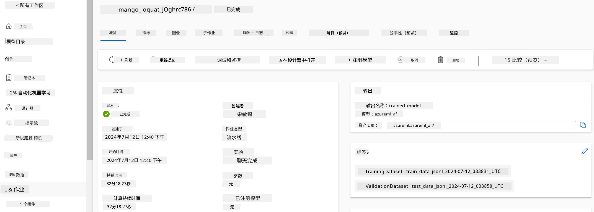

### 部署微调后的 Phi-3 模型

为了将微调后的 Phi-3 模型集成到 Prompt Flow 中，您需要部署模型，使其可用于实时推理。此过程包括注册模型、创建在线端点和部署模型。

在此练习中，您将：

- 在 Azure 机器学习工作区注册微调模型。
- 创建在线端点。
- 部署已注册的微调 Phi-3 模型。

#### 注册微调模型

1. 访问 [Azure ML Studio](https://ml.azure.com/home?wt.mc_id=studentamb_279723)。

1. 选择您创建的 Azure 机器学习工作区。

    

1. 从左侧标签选择 **模型**。
1. 选择 **+ 注册**。
1. 选择 **从作业输出注册**。

    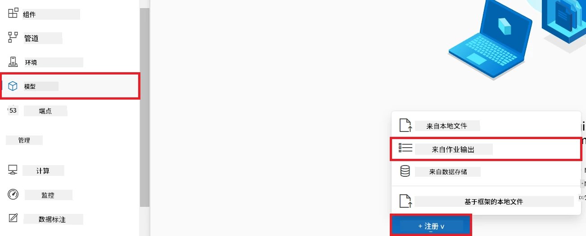

1. 选择您创建的作业。

    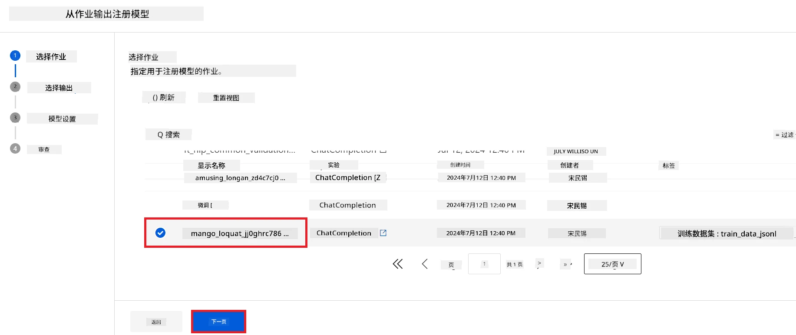

1. 选择 **下一步**。

1. 将 **模型类型** 设置为 **MLflow**。

1. 确保 **作业输出** 已选中；应已自动选中。

    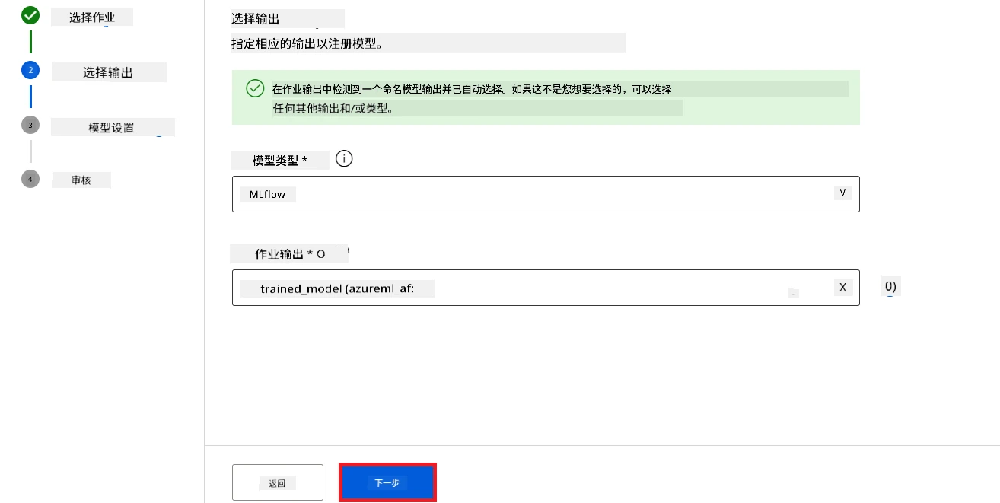

2. 选择 **下一步**。

3. 选择 **注册**。

    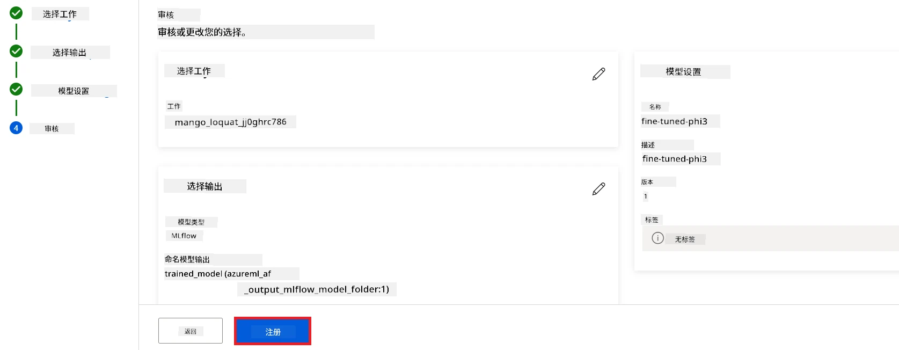

4. 您可以通过导航到左侧标签的 **模型** 菜单查看已注册的模型。

    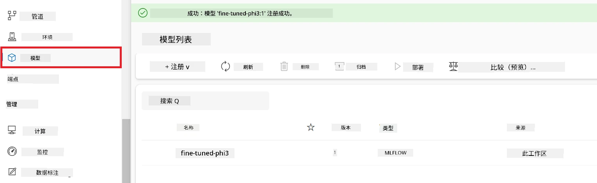

#### 部署微调模型

1. 导航到您创建的 Azure 机器学习工作区。

1. 从左侧标签选择 **端点**。

1. 从导航菜单选择 **实时端点**。

    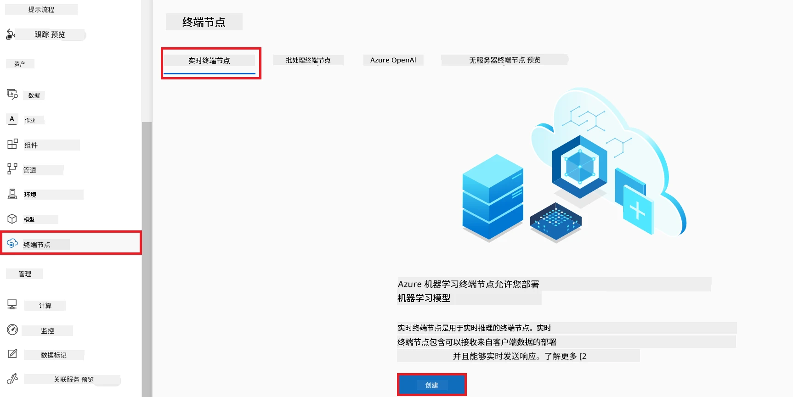

1. 选择 **创建**。

1. 选择您注册的模型。

    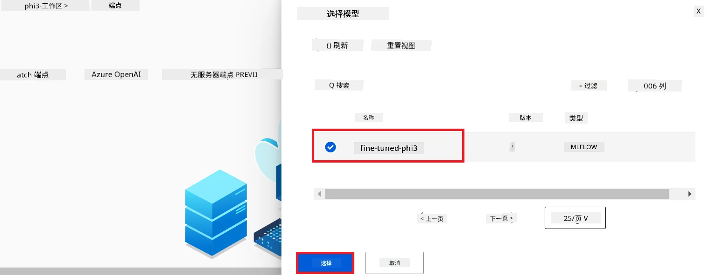

1. 选择 **选择**。

1. 执行以下操作：

    - 将 **虚拟机** 设置为 *Standard_NC6s_v3*。
    - 选择您想使用的 **实例数**，例如 *1*。
    - 将 **端点** 设置为 **新建** 以创建端点。
    - 输入 **端点名称**，必须唯一。
    - 输入 **部署名称**，必须唯一。

    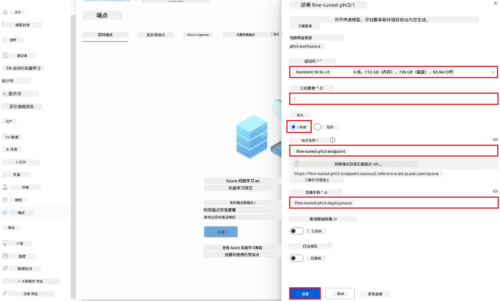

1. 选择 **部署**。

> [!WARNING]
> 为避免账户产生额外费用，请确保删除 Azure 机器学习工作区中创建的端点。
>

#### 在 Azure 机器学习工作区检查部署状态

1. 导航到您创建的 Azure 机器学习工作区。

1. 选择左侧标签中的 **端点**。

1. 选择您创建的端点。

    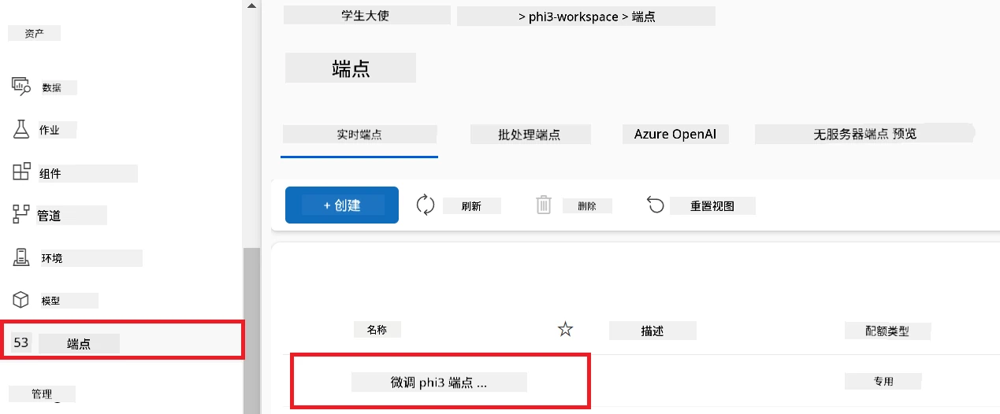

1. 在该页面，您可以在部署过程中管理端点。

> [!NOTE]
> 部署完成后，请确保 **实时流量** 设置为 **100%**。如果不是，请选择 **更新流量** 调整流量设置。流量设置为 0% 时，无法测试模型。
>
> 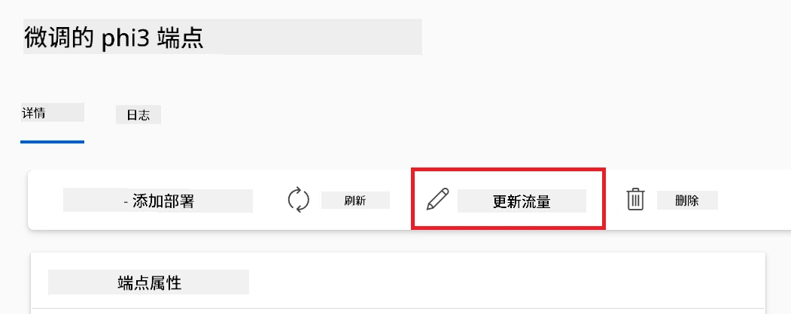
>

## 场景 3：与 Prompt Flow 集成并在 Microsoft Foundry 中使用自定义模型聊天

### 将自定义 Phi-3 模型与 Prompt Flow 集成

成功部署微调模型后，您现在可以将其集成到 Prompt Flow 中，以便在实时应用中使用您的模型，从而实现各种交互式任务。

在此练习中，您将：

- 创建 Microsoft Foundry Hub。
- 创建 Microsoft Foundry 项目。
- 创建 Prompt Flow。
- 为微调后的 Phi-3 模型添加自定义连接。
- 设置 Prompt Flow 与您的自定义 Phi-3 模型聊天。

> [!NOTE]
> 您也可以通过 Azure ML Studio 集成 Promptflow。相同的集成流程适用于 Azure ML Studio。

#### 创建 Microsoft Foundry Hub

在创建项目之前，您需要先创建一个 Hub。Hub 类似于资源组，允许您在 Microsoft Foundry 内组织和管理多个项目。
1. 访问 [Microsoft Foundry](https://ai.azure.com/?WT.mc_id=aiml-137032-kinfeylo)。

1. 从左侧标签中选择 **All hubs**。

1. 从导航菜单中选择 **+ New hub**。

    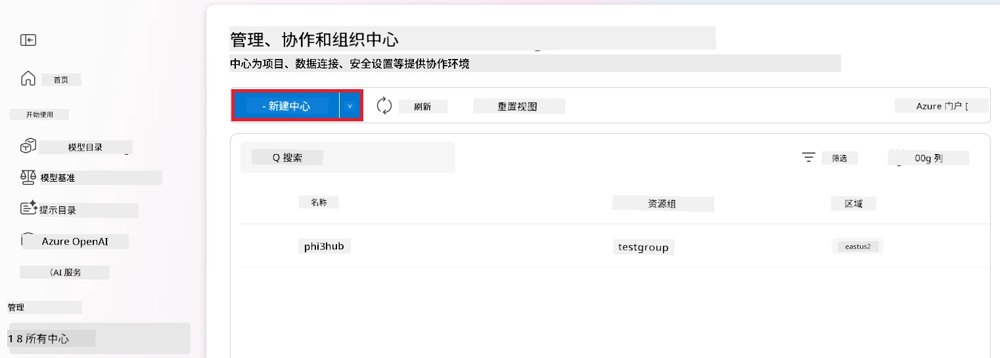

1. 执行以下任务：

    - 输入 **Hub name**。它必须是唯一值。
    - 选择你的 Azure **Subscription**。
    - 选择要使用的 **Resource group**（如有需要，创建新的）。
    - 选择你想使用的 **Location**。
    - 选择要使用的 **Connect Azure AI Services**（如有需要，创建新的）。
    - 选择 **Connect Azure AI Search** 为 **Skip connecting**。

    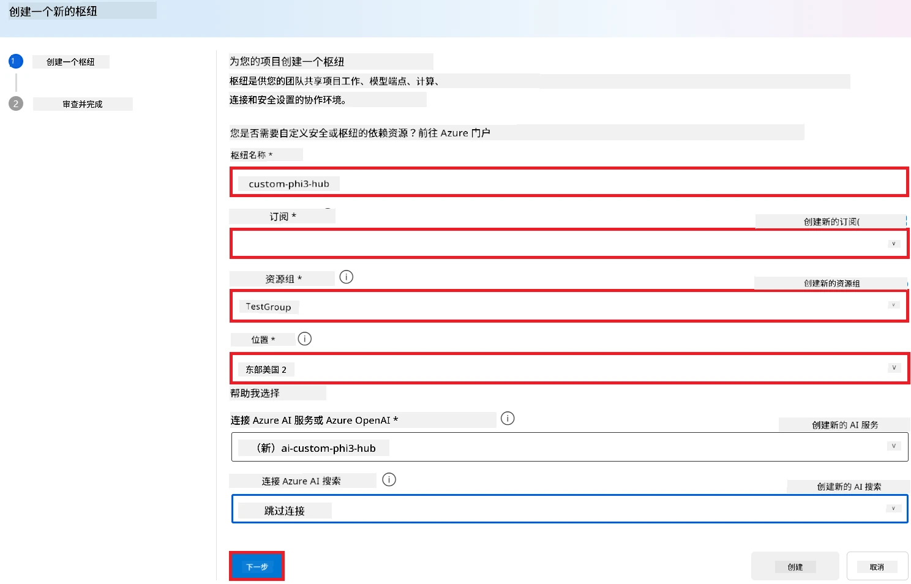

1. 选择 **Next**。

#### 创建 Microsoft Foundry 项目

1. 在你创建的 Hub 中，从左侧标签选择 **All projects**。

1. 从导航菜单选择 **+ New project**。

    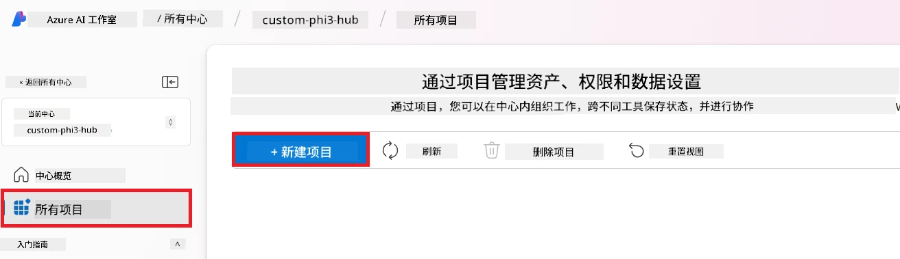

1. 输入 **Project name**。它必须是唯一值。

    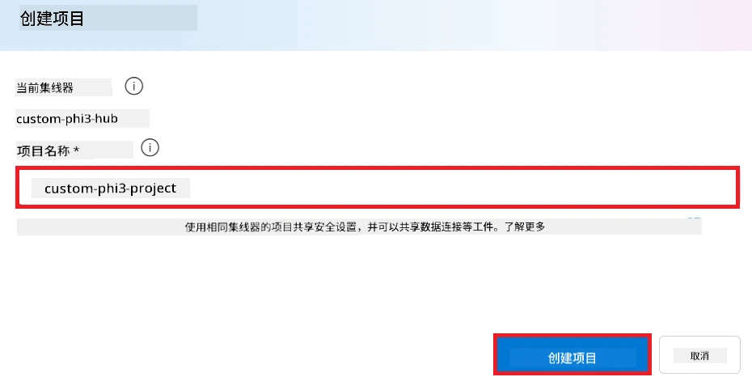

1. 选择 **Create a project**。

#### 为微调的 Phi-3 模型添加自定义连接

要将你的自定义 Phi-3 模型与 Prompt flow 集成，你需要在自定义连接中保存模型的端点和密钥。此设置确保你可以在 Prompt flow 中访问自定义 Phi-3 模型。

#### 设置微调的 Phi-3 模型的 api 密钥和端点 uri

1. 访问 [Azure ML Studio](https://ml.azure.com/home?WT.mc_id=aiml-137032-kinfeylo)。

1. 导航到你创建的 Azure 机器学习工作区。

1. 从左侧标签选择 **Endpoints**。

    

1. 选择你创建的端点。

    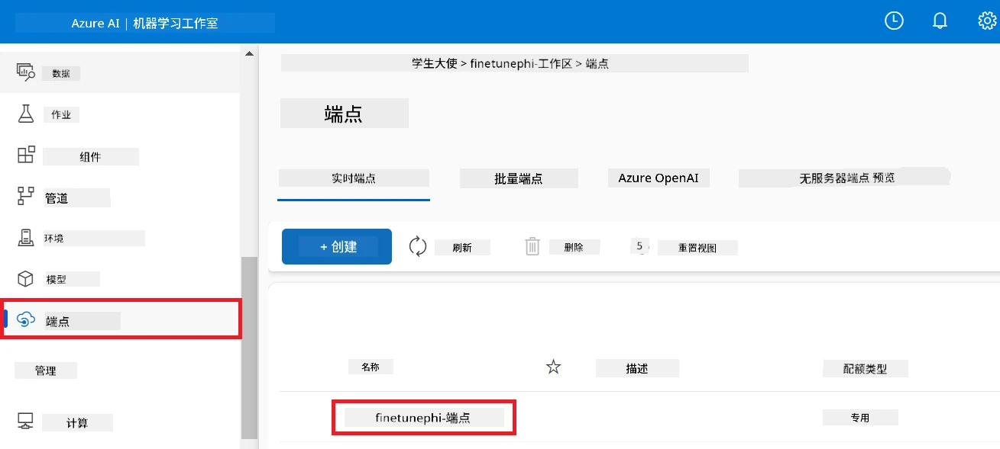

1. 从导航菜单选择 **Consume**。

1. 复制你的 **REST endpoint** 和 **Primary key**。

    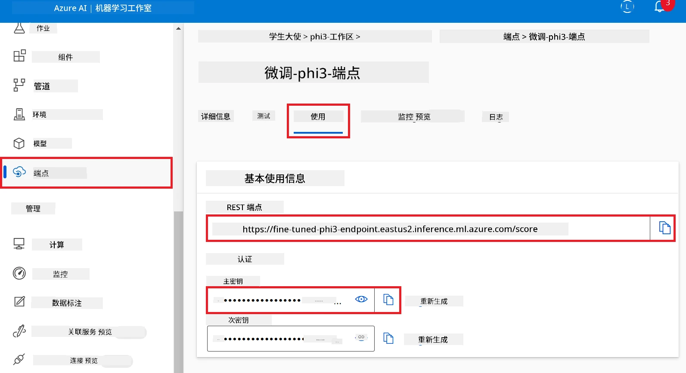

#### 添加自定义连接

1. 访问 [Microsoft Foundry](https://ai.azure.com/?WT.mc_id=aiml-137032-kinfeylo)。

1. 导航到你创建的 Microsoft Foundry 项目。

1. 在你创建的项目中，从左侧标签选择 **Settings**。

1. 选择 **+ New connection**。

    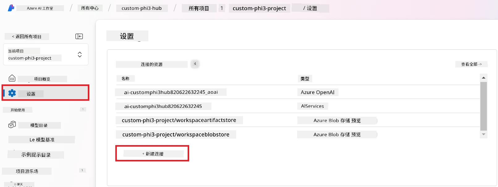

1. 从导航菜单选择 **Custom keys**。

    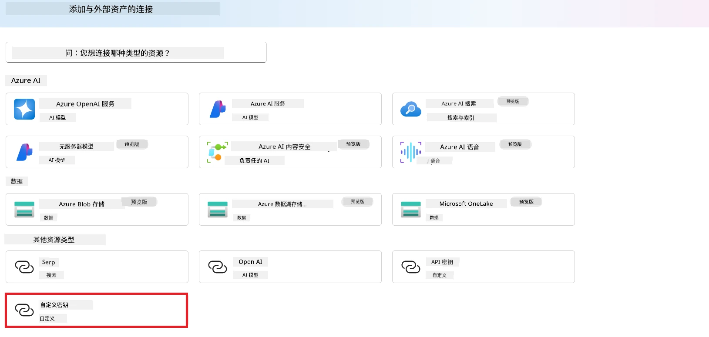

1. 执行以下操作：

    - 选择 **+ Add key value pairs**。
    - 对于键名，输入 **endpoint**，并将你从 Azure ML Studio 复制的端点粘贴到值字段。
    - 再次选择 **+ Add key value pairs**。
    - 对于键名，输入 **key**，并将你从 Azure ML Studio 复制的密钥粘贴到值字段。
    - 添加密钥后，选择 **is secret** 以防止密钥被公开。

    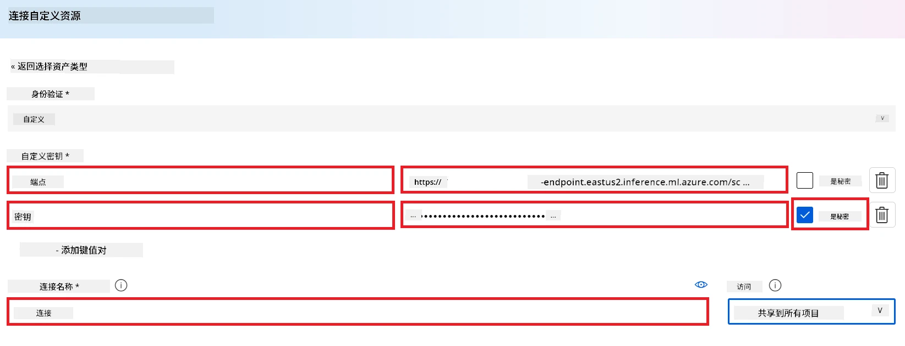

1. 选择 **Add connection**。

#### 创建 Prompt flow

你已在 Microsoft Foundry 中添加了自定义连接。现在，让我们按照以下步骤创建一个 Prompt flow。然后，你将连接此 Prompt flow 到自定义连接，以便在 Prompt flow 中使用微调模型。

1. 导航到你创建的 Microsoft Foundry 项目。

1. 从左侧标签选择 **Prompt flow**。

1. 从导航菜单选择 **+ Create**。

    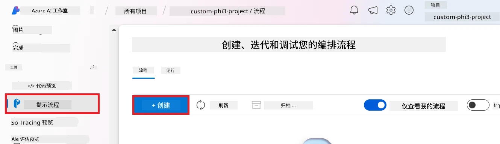

1. 从导航菜单选择 **Chat flow**。

    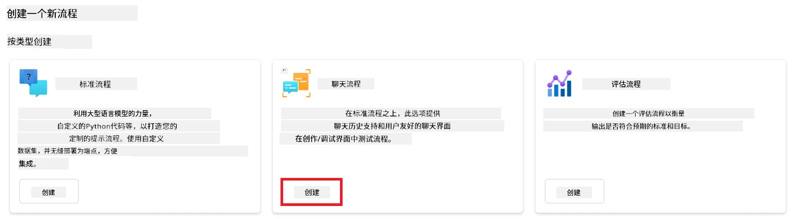

1. 输入要使用的 **Folder name**。

    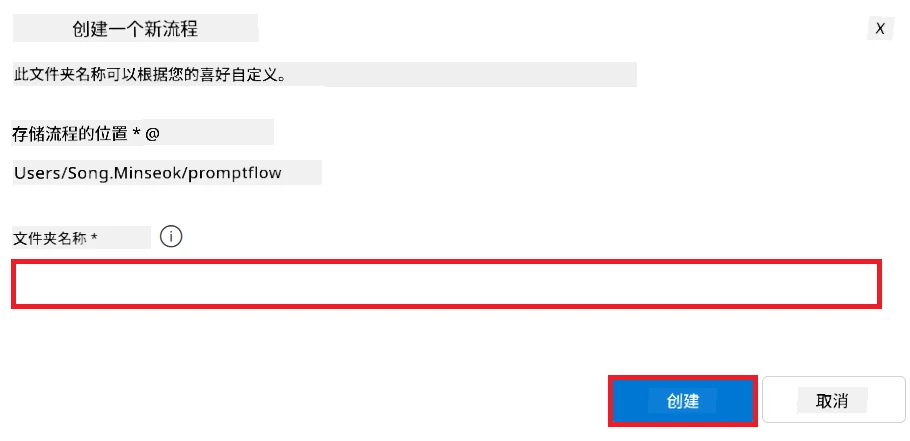

2. 选择 **Create**。

#### 设置 Prompt flow 以与你的自定义 Phi-3 模型聊天

你需要将微调的 Phi-3 模型集成到 Prompt flow 中。但现有的 Prompt flow 并非为此设计，因此你必须重新设计 Prompt flow，才能集成自定义模型。

1. 在 Prompt flow 中执行以下操作以重建现有流程：

    - 选择 **Raw file mode**。
    - 删除 *flow.dag.yml* 文件中的所有现有代码。
    - 将以下代码添加到 *flow.dag.yml* 文件中。

        ```yml
        inputs:
          input_data:
            type: string
            default: "Who founded Microsoft?"

        outputs:
          answer:
            type: string
            reference: ${integrate_with_promptflow.output}

        nodes:
        - name: integrate_with_promptflow
          type: python
          source:
            type: code
            path: integrate_with_promptflow.py
          inputs:
            input_data: ${inputs.input_data}
        ```

    - 选择 **Save**。

    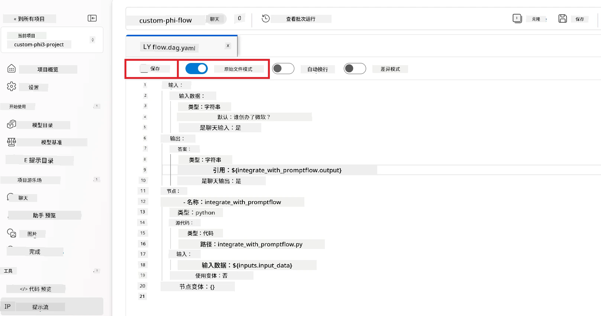

1. 将以下代码添加到 *integrate_with_promptflow.py* 文件中，以便在 Prompt flow 中使用自定义 Phi-3 模型。

    ```python
    import logging
    import requests
    from promptflow import tool
    from promptflow.connections import CustomConnection

    # 日志设置
    logging.basicConfig(
        format="%(asctime)s - %(levelname)s - %(name)s - %(message)s",
        datefmt="%Y-%m-%d %H:%M:%S",
        level=logging.DEBUG
    )
    logger = logging.getLogger(__name__)

    def query_phi3_model(input_data: str, connection: CustomConnection) -> str:
        """
        Send a request to the Phi-3 model endpoint with the given input data using Custom Connection.
        """

        # “connection” 是自定义连接的名称，“endpoint”、“key” 是自定义连接中的键
        endpoint_url = connection.endpoint
        api_key = connection.key

        headers = {
            "Content-Type": "application/json",
            "Authorization": f"Bearer {api_key}"
        }
        data = {
            "input_data": {
                "input_string": [
                    {"role": "user", "content": input_data}
                ],
                "parameters": {
                    "temperature": 0.7,
                    "max_new_tokens": 128
                }
            }
        }
        try:
            response = requests.post(endpoint_url, json=data, headers=headers)
            response.raise_for_status()
            
            # 记录完整的 JSON 响应
            logger.debug(f"Full JSON response: {response.json()}")

            result = response.json()["output"]
            logger.info("Successfully received response from Azure ML Endpoint.")
            return result
        except requests.exceptions.RequestException as e:
            logger.error(f"Error querying Azure ML Endpoint: {e}")
            raise

    @tool
    def my_python_tool(input_data: str, connection: CustomConnection) -> str:
        """
        Tool function to process input data and query the Phi-3 model.
        """
        return query_phi3_model(input_data, connection)

    ```

    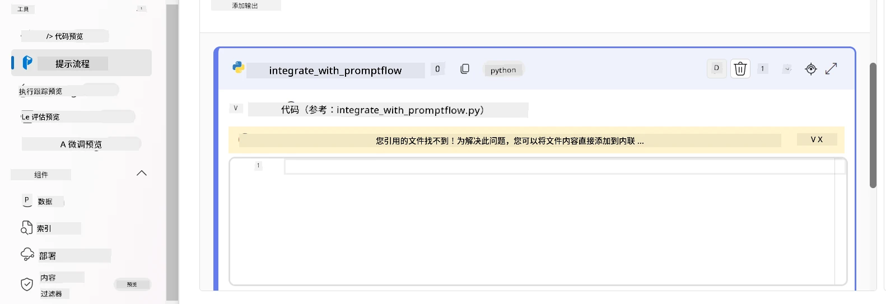

> [!NOTE]
> 想了解更多关于在 Microsoft Foundry 中使用 Prompt flow 的详细信息，你可以参考 [Prompt flow in Microsoft Foundry](https://learn.microsoft.com/azure/ai-studio/how-to/prompt-flow)。

1. 选择 **Chat input**、**Chat output**，以启用与你的模型的聊天功能。

    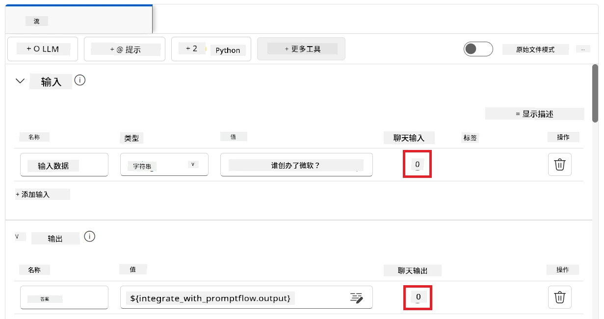

1. 现在你准备好与你的自定义 Phi-3 模型进行聊天。在接下来的练习中，你将学习如何启动 Prompt flow 并使用它与你的微调 Phi-3 模型聊天。

> [!NOTE]
>
> 重建的流程应如下面图片所示：
>
> 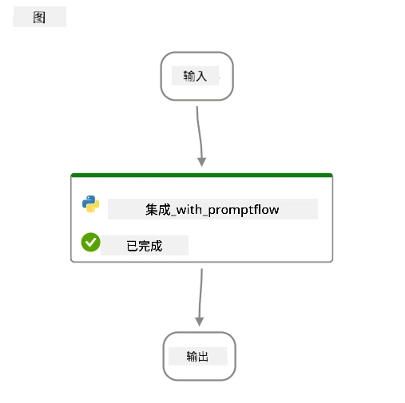
>

### 与你的自定义 Phi-3 模型聊天

现在你已经微调并将自定义 Phi-3 模型集成到 Prompt flow 中，你可以开始与它互动。这个练习将指导你通过设置和启动与你的模型聊天的过程。按照这些步骤，你将能够充分利用微调 Phi-3 模型的各种任务和对话功能。

- 使用 Prompt flow 与你的自定义 Phi-3 模型聊天。

#### 启动 Prompt flow

1. 选择 **Start compute sessions** 启动 Prompt flow。

    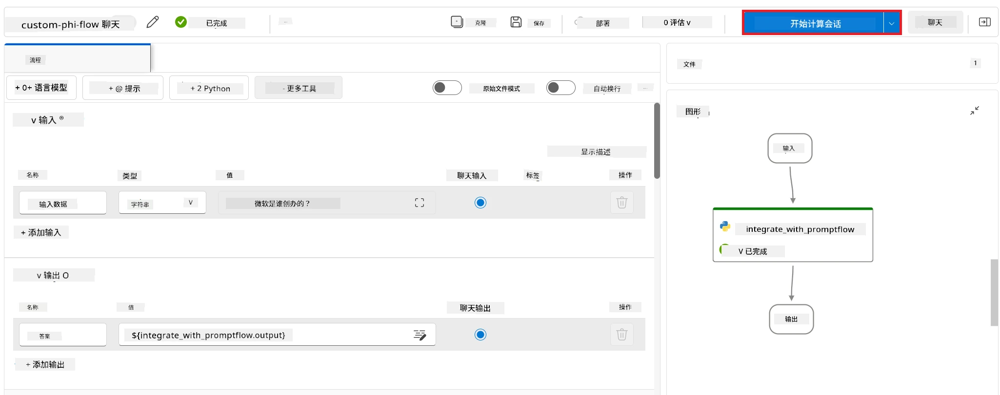

1. 选择 **Validate and parse input** 以更新参数。

    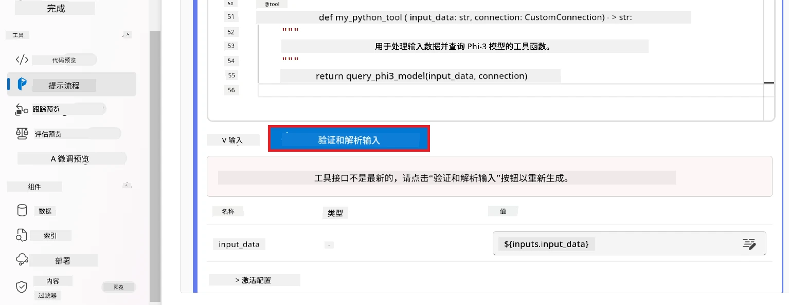

1. 选择 **connection** 的 **Value**，连接到你创建的自定义连接。例如，*connection*。

    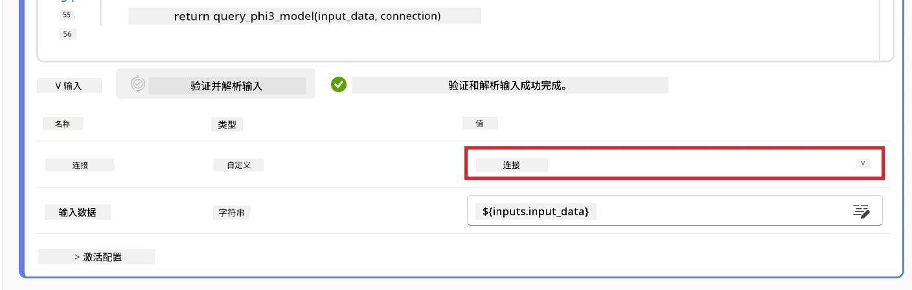

#### 与你的自定义模型聊天

1. 选择 **Chat**。

    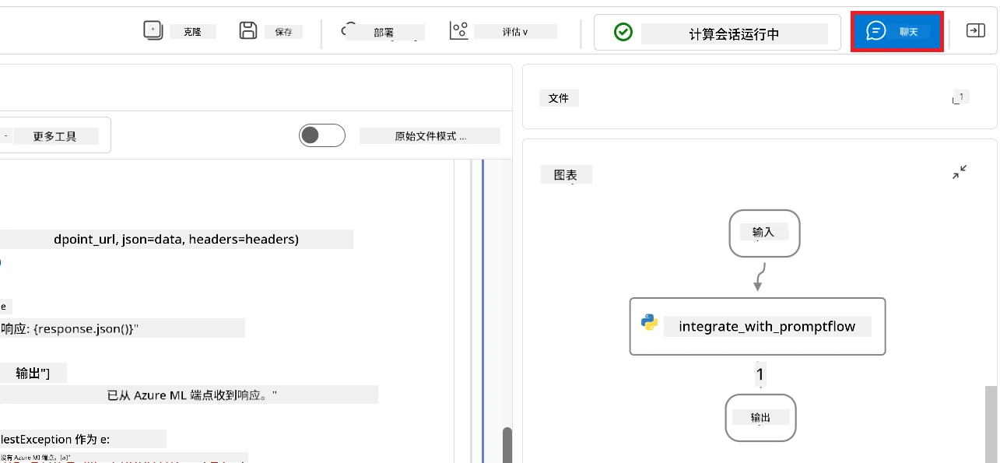

1. 以下是结果示例：现在你可以与你的自定义 Phi-3 模型聊天。建议基于用于微调的数据提问。

    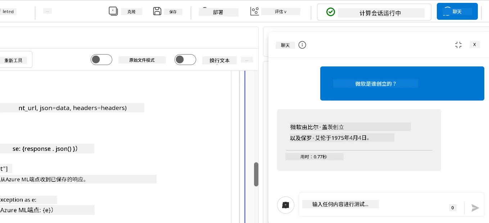

---

<!-- CO-OP TRANSLATOR DISCLAIMER START -->
**免责声明**：
本文件由AI翻译服务[Co-op Translator](https://github.com/Azure/co-op-translator)翻译。尽管我们力求准确，但请注意，自动翻译可能包含错误或不准确之处。原始文档的母语版本应被视为权威来源。对于重要信息，建议采用专业人工翻译。对于因使用此翻译而产生的任何误解或误译，我们概不负责。
<!-- CO-OP TRANSLATOR DISCLAIMER END -->