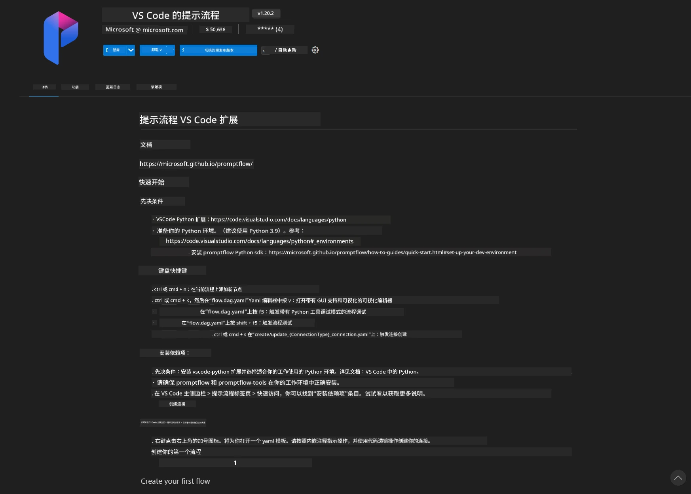
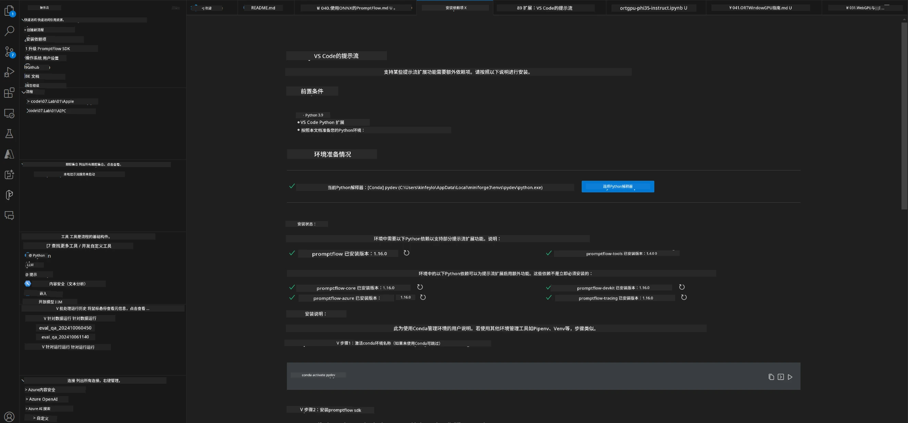
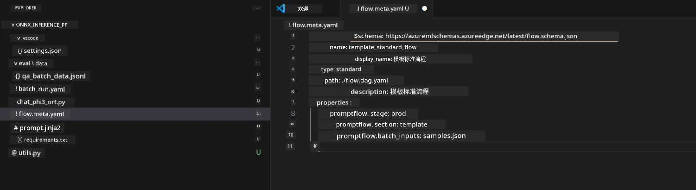
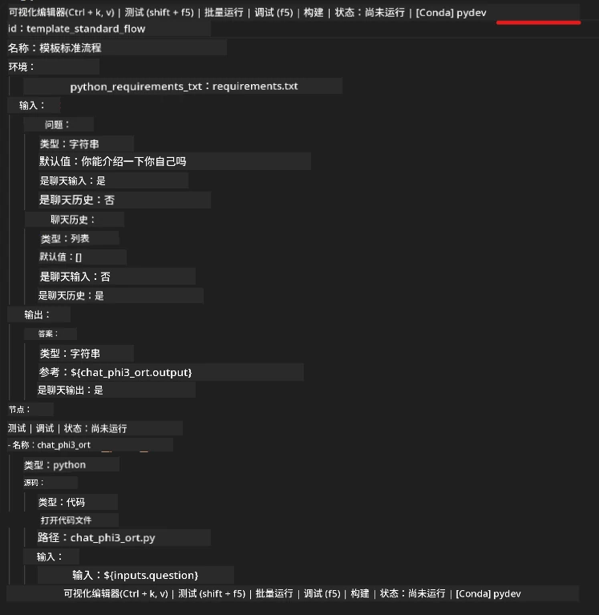
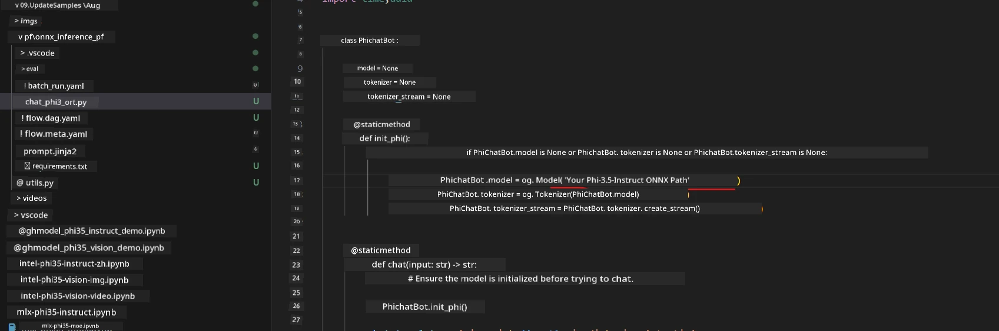
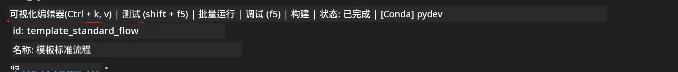
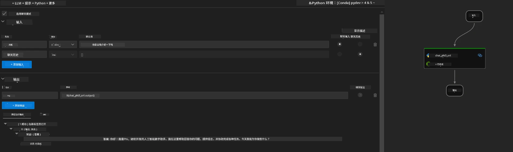
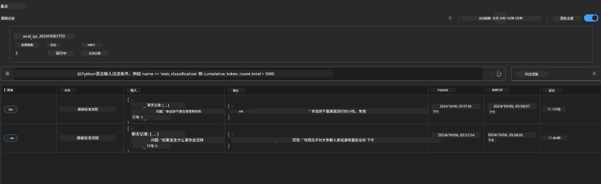

# 使用 Windows GPU 创建基于 Phi-3.5-Instruct ONNX 的 Prompt flow 解决方案

下面的文档示例展示了如何使用 PromptFlow 配合 ONNX（开放神经网络交换）开发基于 Phi-3 模型的 AI 应用。

PromptFlow 是一套旨在简化基于大型语言模型（LLM）的 AI 应用从构思、原型设计到测试和评估的端到端开发周期的开发工具集。

通过将 PromptFlow 与 ONNX 集成，开发人员可以：

- 优化模型性能：利用 ONNX 实现高效的模型推理和部署。
- 简化开发：使用 PromptFlow 管理工作流程并自动化重复任务。
- 增强协作：通过提供统一的开发环境促进团队成员间的更好协作。

**Prompt flow** 是一套开发工具，旨在简化基于 LLM 的 AI 应用从构思、原型设计、测试、评估到生产部署和监控的端到端开发周期。它使 Prompt 工程变得更加简单，并能帮助您构建具备生产质量的 LLM 应用。

Prompt flow 可连接 OpenAI、Azure OpenAI 服务及可定制模型（Huggingface、本地 LLM/SLM）。我们希望将 Phi-3.5 的量化 ONNX 模型部署到本地应用中。Prompt flow 能帮我们更好地规划业务并完成基于 Phi-3.5 的本地解决方案。在此示例中，我们将结合 ONNX Runtime GenAI 库完成基于 Windows GPU 的 Prompt flow 解决方案。

## <strong>安装</strong>

### **适用于 Windows GPU 的 ONNX Runtime GenAI**

请阅读本指南以设置适用于 Windows GPU 的 ONNX Runtime GenAI  [点击这里](./ORTWindowGPUGuideline.md)

### **在 VSCode 中设置 Prompt flow**

1. 安装 Prompt flow VS Code 扩展



2. 安装完 Prompt flow VS Code 扩展后，点击该扩展，选择 **Installation dependencies** 按照指南在你的环境中安装 Prompt flow SDK



3. 下载 [示例代码](../../../../../../code/09.UpdateSamples/Aug/pf/onnx_inference_pf) 并使用 VS Code 打开该示例



4. 打开 **flow.dag.yaml** 选择你的 Python 环境



   打开 **chat_phi3_ort.py** 修改你的 Phi-3.5-instruct ONNX 模型路径



5. 运行你的 prompt flow 进行测试

打开 **flow.dag.yaml** 点击可视化编辑器



点击后，运行它进行测试



1. 你也可以在终端批量运行以查看更多结果


```bash

pf run create --file batch_run.yaml --stream --name 'Your eval qa name'    

```

你可以在默认浏览器中查看结果




---

<!-- CO-OP TRANSLATOR DISCLAIMER START -->
**免责声明**：
本文件由 AI 翻译服务 [Co-op Translator](https://github.com/Azure/co-op-translator) 翻译完成。尽管我们力求准确，但请注意，自动翻译可能包含错误或不准确之处。原始语言版文件应视为权威来源。对于重要信息，建议使用专业人工翻译。我们对因使用本翻译而产生的任何误解或误释不承担责任。
<!-- CO-OP TRANSLATOR DISCLAIMER END -->