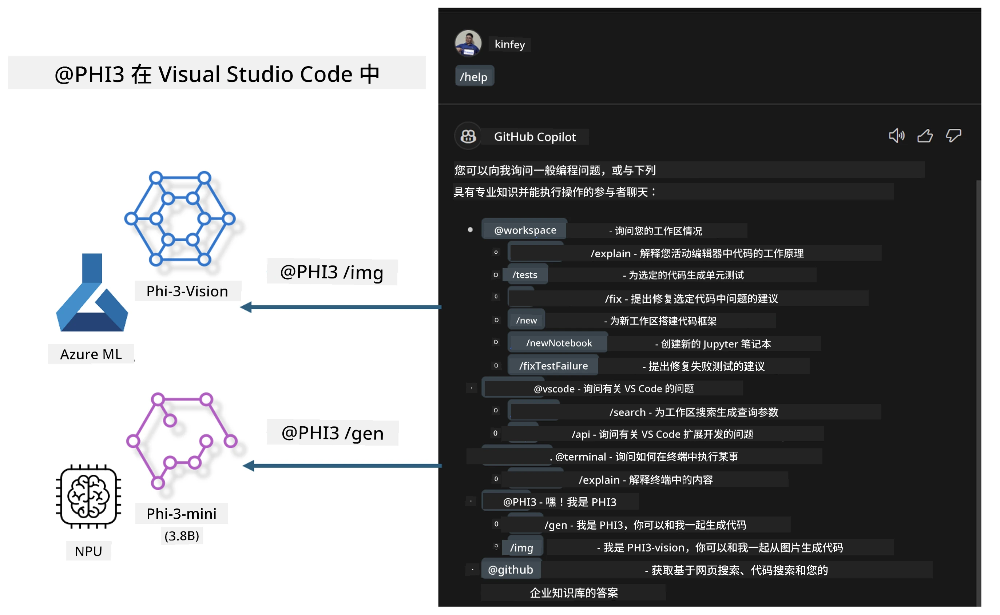

# **使用微软 Phi-3 系列构建您自己的 Visual Studio Code GitHub Copilot Chat**

您使用过 GitHub Copilot Chat 中的 workspace agent 吗？您想为自己的团队构建专属的代码代理吗？本动手实验希望结合开源模型构建企业级代码业务代理。

## **基础**

### **为何选择微软 Phi-3**

Phi-3 是一个系列产品，包括基于不同训练参数的 phi-3-mini、phi-3-small 和 phi-3-medium，适用于文本生成、对话完成和代码生成。还有基于视觉的 phi-3-vision。它适合企业或不同团队创建离线生成式 AI 解决方案。

推荐阅读此链接 [https://github.com/microsoft/PhiCookBook/blob/main/md/01.Introduction/01/01.PhiFamily.md](https://github.com/microsoft/PhiCookBook/blob/main/md/01.Introduction/01/01.PhiFamily.md)

### **微软 GitHub Copilot Chat**

GitHub Copilot Chat 扩展为您提供了一个聊天界面，使您能够与 GitHub Copilot 交互，并直接在 VS Code 内获取编码相关问题的答案，无需浏览文档或在线论坛搜索。

Copilot Chat 可能使用语法高亮、缩进和其他格式化功能以增强生成响应的清晰度。根据用户的问题类型，结果可能包含 Copilot 用于生成响应的上下文链接（如源代码文件或文档），或访问 VS Code 功能的按钮。

- Copilot Chat 集成在您的开发流程中，随时为您提供帮助：

- 在编辑器或终端中直接开始内联聊天，为编程时提供帮助

- 使用聊天视图让 AI 助手一直在侧边随时协助您

- 启动快速聊天，快速提问并继续当前工作

您可以在各种场景下使用 GitHub Copilot Chat，例如：

- 解答如何最好地解决编程问题

- 解释他人代码并提出改进建议

- 提出代码修复方案

- 生成单元测试用例

- 生成代码文档

推荐阅读此链接 [https://code.visualstudio.com/docs/copilot/copilot-chat](https://code.visualstudio.com/docs/copilot/copilot-chat?WT.mc_id=aiml-137032-kinfeylo)

###  **微软 GitHub Copilot Chat @workspace**

在 Copilot Chat 中引用 **@workspace**，可以让您针对整个代码库提问。根据问题，Copilot 会智能检索相关文件和符号，并在回答中以链接和代码示例形式引用。

为了回答您的问题，**@workspace** 会搜索开发者在 VS Code 中浏览代码库时使用的相同资源：

- 工作区中的所有文件，除了被 .gitignore 文件忽略的文件

- 带有嵌套文件夹和文件名的目录结构

- 如果工作区是 GitHub 仓库并经过代码搜索索引，则使用 GitHub 的代码搜索索引

- 工作区内的符号和定义

- 当前选中文本或活动编辑器中可见的文本

注意：如果您打开了被忽略的文件或者选中了其中的文本，则会绕过 .gitignore 的忽略规则。

推荐阅读此链接 [[https://code.visualstudio.com/docs/copilot/copilot-chat](https://code.visualstudio.com/docs/copilot/workspace-context?WT.mc_id=aiml-137032-kinfeylo)]

## **了解更多实验内容**

GitHub Copilot 大大提升了企业的编程效率，每个企业也希望定制 GitHub Copilot 相关功能。许多企业基于自身业务场景和开源模型定制了类似 GitHub Copilot 的扩展。对企业而言，自定义扩展更易于控制，但这也会影响用户体验。毕竟 GitHub Copilot 在处理通用场景和专业度上功能更强。如果能保持体验一致，个性化定制自有扩展会更好。GitHub Copilot Chat 为企业提供了扩展聊天体验的相关 API。维护一致的体验且拥有定制功能，是更佳的用户体验。

本实验主要使用 Phi-3 模型结合本地 NPU 与 Azure 混合构建 GitHub Copilot Chat 中的自定义 Agent ***@PHI3***，帮助企业开发者完成代码生成***(@PHI3 /gen)*** 及基于图像生成代码 ***(@PHI3 /img)***。

### ***注意：*** 

本实验目前在 Intel CPU 和 Apple Silicon 的 AIPC 上实现，后续将继续更新高通版 NPU。

## **实验**

| 名称 | 描述 | AIPC | Apple |
| ------------ | ----------- | -------- |-------- |
| Lab0 - 安装(✅) | 配置并安装相关环境与工具 | [前往](./HOL/AIPC/01.Installations.md) |[前往](./HOL/Apple/01.Installations.md) |
| Lab1 - 使用 Phi-3-mini 运行 Prompt flow (✅) | 结合 AIPC / Apple Silicon，使用本地 NPU 通过 Phi-3-mini 创建代码生成 | [前往](./HOL/AIPC/02.PromptflowWithNPU.md) |  [前往](./HOL/Apple/02.PromptflowWithMLX.md) |
| Lab2 - 在 Azure 机器学习服务上部署 Phi-3-vision(✅) | 通过部署 Azure 机器学习服务的模型目录 - Phi-3-vision 图像生成代码 | [前往](./HOL/AIPC/03.DeployPhi3VisionOnAzure.md) |[前往](./HOL/Apple/03.DeployPhi3VisionOnAzure.md) |
| Lab3 - 在 GitHub Copilot Chat 中创建 @phi-3 agent(✅)  | 在 GitHub Copilot Chat 中创建定制 Phi-3 代理，完成代码生成、图像生成代码、RAG 等 | [前往](./HOL/AIPC/04.CreatePhi3AgentInVSCode.md) | [前往](./HOL/Apple/04.CreatePhi3AgentInVSCode.md) |
| 示例代码 (✅)  | 下载示例代码 | [前往](../../../../../../../code/07.Lab/01/AIPC) | [前往](../../../../../../../code/07.Lab/01/Apple) |

## **资源**

1. Phi-3 Cookbook [https://github.com/microsoft/Phi-3CookBook](https://github.com/microsoft/Phi-3CookBook)

2. 了解更多关于 GitHub Copilot [https://learn.microsoft.com/training/paths/copilot/](https://learn.microsoft.com/training/paths/copilot/?WT.mc_id=aiml-137032-kinfeylo)

3. 了解更多关于 GitHub Copilot Chat [https://learn.microsoft.com/training/paths/accelerate-app-development-using-github-copilot/](https://learn.microsoft.com/training/paths/accelerate-app-development-using-github-copilot/?WT.mc_id=aiml-137032-kinfeylo)

4. 了解更多关于 GitHub Copilot Chat API [https://code.visualstudio.com/api/extension-guides/chat](https://code.visualstudio.com/api/extension-guides/chat?WT.mc_id=aiml-137032-kinfeylo)

5. 了解更多关于微软 Foundry [https://learn.microsoft.com/training/paths/create-custom-copilots-ai-studio/](https://learn.microsoft.com/training/paths/create-custom-copilots-ai-studio/?WT.mc_id=aiml-137032-kinfeylo)

6. 了解更多关于微软 Foundry 的模型目录 [https://learn.microsoft.com/azure/ai-studio/how-to/model-catalog-overview](https://learn.microsoft.com/azure/ai-studio/how-to/model-catalog-overview)

---

<!-- CO-OP TRANSLATOR DISCLAIMER START -->
**免责声明**：
本文件由人工智能翻译服务 [Co-op Translator](https://github.com/Azure/co-op-translator) 翻译。尽管我们力求准确，但请注意自动翻译可能存在错误或不准确之处。原始语言版本的文件应被视为权威来源。对于重要信息，建议聘请专业人工翻译。我们对因使用此翻译而产生的任何误解或错误解读概不负责。
<!-- CO-OP TRANSLATOR DISCLAIMER END -->