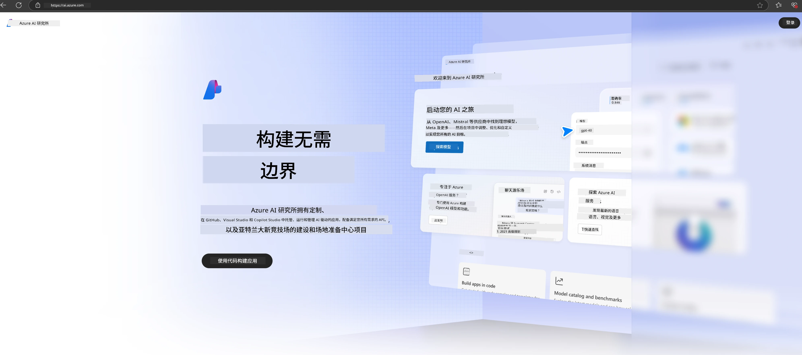

# **在 Microsoft Foundry 中使用 Phi-3**

随着生成式 AI 的发展，我们希望使用统一的平台来管理不同的大型语言模型（LLM）和小型语言模型（SLM）、企业数据集成、微调/RAG 操作，以及集成 LLM 和 SLM 后对不同企业业务的评估等，从而更好地实现生成式 AI 智能应用。[Microsoft Foundry](https://ai.azure.com) 是一个企业级生成式 AI 应用平台。

通过 Microsoft Foundry，您可以评估大型语言模型（LLM）的响应，并使用提示流协调提示应用组件以获得更好的性能。该平台促进了从概念验证向成熟生产的可扩展转换，并支持持续监控和优化，实现长期成功。

我们可以通过简单的步骤快速在 Microsoft Foundry 上部署 Phi-3 模型，然后使用 Microsoft Foundry 完成与 Phi-3 相关的 Playground/Chat、微调、评估等相关工作。

## **1. 准备工作**

如果您已经在机器上安装了 [Azure Developer CLI](https://learn.microsoft.com/azure/developer/azure-developer-cli/overview?WT.mc_id=aiml-138114-kinfeylo)，使用此模板只需在新目录中运行此命令即可。

## 手动创建

创建 Microsoft Foundry 项目和 hub 是组织和管理 AI 工作的好方法。以下是入门的逐步指南：

### 在 Microsoft Foundry 中创建项目

1. **访问 Microsoft Foundry**：登录 Microsoft Foundry 门户。
2. **创建项目**：
   - 如果您已在某个项目内，请选择页面左上角的“Microsoft Foundry”返回主页。
   - 选择“+ 创建项目”。
   - 输入项目名称。
   - 如果已有 hub，默认会选中该 hub。如果您有多个 hub 的访问权限，可以从下拉列表中选择其他 hub。如果您想创建新 hub，选择“创建新 hub”并填写名称。
   - 选择“创建”。

### 在 Microsoft Foundry 中创建 Hub

1. **访问 Microsoft Foundry**：使用您的 Azure 账户登录。
2. **创建 Hub**：
   - 从左侧菜单选择“管理中心”。
   - 选择“所有资源”，点击“+ 新建项目”旁的下箭头，选择“+ 新建 Hub”。
   - 在“创建新 Hub”对话框中输入 hub 名称（例如 contoso-hub），并根据需要修改其他字段。
   - 选择“下一步”，审查信息，然后选择“创建”。

有关详细说明，请参阅官方 [Microsoft 文档](https://learn.microsoft.com/azure/ai-studio/how-to/create-projects)。

创建成功后，您可以通过 [ai.azure.com](https://ai.azure.com/) 访问您创建的 Studio。

一个 AI Foundry 里可以有多个项目，请先在 AI Foundry 中创建项目做准备。

创建 Microsoft Foundry [快速入门](https://learn.microsoft.com/azure/ai-studio/quickstarts/get-started-code)

## **2. 在 Microsoft Foundry 部署 Phi 模型**

点击项目的 Explore 选项进入模型目录，选择 Phi-3。

选择 Phi-3-mini-4k-instruct。

点击“部署”以部署 Phi-3-mini-4k-instruct 模型。

> [!NOTE]
>
> 部署时可以选择计算能力。

## **3. 在 Microsoft Foundry Playground 聊天 Phi**

进入部署页面，选择 Playground，与 Microsoft Foundry 的 Phi-3 进行聊天。

## **4. 从 Microsoft Foundry 部署模型**

要从 Azure 模型目录部署模型，您可以按照以下步骤操作：

- 登录 Microsoft Foundry。
- 从 Microsoft Foundry 模型目录中选择想要部署的模型。
- 在模型的详情页，选择“部署”，然后选择带有 Azure AI 内容安全的无服务器 API。
- 选择您要部署模型的项目。要使用无服务器 API，您的工作区必须位于 East US 2 或 Sweden Central 区域。您可以自定义部署名称。
- 在部署向导中，查看定价和条款，了解定价和使用条款。
- 选择“部署”。等待部署完成并跳转到部署页面。
- 选择“在 Playground 中打开”以开始与模型交互。
- 您可以返回部署页面，选择该部署，查看终结点的目标 URL 和密钥，用于调用部署并生成结果。
- 您始终可以通过导航到“构建”标签页，在组件部分选择“部署”，找到终结点详情、URL 和访问密钥。

> [!NOTE]
> 请注意，您的账户必须在资源组上拥有 Azure AI 开发者角色权限，才能执行这些步骤。

## **5. 在 Microsoft Foundry 使用 Phi API**

您可以通过 Postman 访问 https://{Your project name}.region.inference.ml.azure.com/swagger.json，结合密钥了解提供的接口。

您可以非常方便地获取请求参数和响应参数。

---

<!-- CO-OP TRANSLATOR DISCLAIMER START -->
**免责声明**：
本文档由人工智能翻译服务[Co-op Translator](https://github.com/Azure/co-op-translator)翻译而成。虽然我们力求准确，但请注意，自动翻译可能存在错误或不准确之处。原始语言的文档应被视为权威来源。对于重要信息，建议采用专业人工翻译。因使用本翻译导致的任何误解或误释，我们不承担任何责任。
<!-- CO-OP TRANSLATOR DISCLAIMER END -->