# 使用 Microsoft Foundry 微调 Phi-3

让我们探讨如何使用 Microsoft Foundry 微调微软的 Phi-3 Mini 语言模型。微调允许你将 Phi-3 Mini 适应特定任务，使其更加强大且具有上下文感知能力。

## 注意事项

- **能力：** 哪些模型可以微调？基础模型可以被微调实现哪些功能？
- **费用：** 微调的定价模式是什么？
- **定制性：** 我能以何种程度修改基础模型——有哪些方式？
- **便利性：** 微调到底是怎样进行的——我需要编写自定义代码吗？需要自带计算资源吗？
- **安全性：** 已知微调模型存在安全风险——是否有防护措施来避免意外伤害？

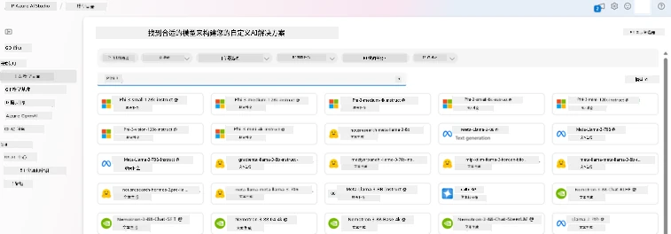

## 微调准备工作

### 前提条件

> [!NOTE]
> 对于 Phi-3 系列模型，按需付费模式的微调服务只在 **East US 2** 区域创建的中心可用。

- 一个 Azure 订阅。如果没有 Azure 订阅，请创建一个[付费 Azure 账户](https://azure.microsoft.com/pricing/purchase-options/pay-as-you-go)开始使用。

- 一个[AI Foundry 项目](https://ai.azure.com?WT.mc_id=aiml-138114-kinfeylo)。
- Microsoft Foundry 中的操作访问采用 Azure 角色权限控制 (Azure RBAC)。要执行本文中的步骤，你的用户账户必须被赋予资源组的 __Azure AI Developer 角色__。

### 订阅提供程序注册

确认订阅已注册 `Microsoft.Network` 资源提供程序。

1. 登录到[Azure 门户](https://portal.azure.com)。
1. 从左侧菜单选择 **订阅**。
1. 选择你要使用的订阅。
1. 从左侧菜单选择 **AI 项目设置** > **资源提供程序**。
1. 确认列表中包含 **Microsoft.Network**，否则添加该提供程序。

### 数据准备

准备训练和验证数据进行模型微调。你的训练数据和验证数据集由输入和输出示例组成，描述你希望模型执行的方式。

确保所有训练示例符合推断时期望的格式。为了有效微调模型，应保证数据集平衡且多样化。

这包括保持数据平衡、涵盖各种场景，并定期调整训练数据以符合真实世界的预期，最终实现模型响应更准确和均衡。

不同模型类型要求训练数据格式不同。

### 聊天完成任务

你使用的训练和验证数据 **必须** 格式为 JSON 行格式（JSONL）文档。对于 `Phi-3-mini-128k-instruct`，微调数据集必须采用聊天完成 API 使用的对话格式。

### 示例文件格式

```json
    {"messages": [{"role": "system", "content": "You are an Xbox customer support agent whose primary goal is to help users with issues they are experiencing with their Xbox devices. You are friendly and concise. You only provide factual answers to queries, and do not provide answers that are not related to Xbox."}, {"role": "user", "content": "Is Xbox better than PlayStation?"}, {"role": "assistant", "content": "I apologize, but I cannot provide personal opinions. My primary job is to assist you with any issues related to your Xbox device. Do you have any Xbox-related issues that need addressing?"}]}
    {"messages": [{"role": "system", "content": "You are an Xbox customer support agent whose primary goal is to help users with issues they are experiencing with their Xbox devices. You are friendly and concise. You only provide factual answers to queries, and do not provide answers that are not related to Xbox."}, {"role": "user", "content": "Can I play PC games on my Xbox?"}, {"role": "assistant", "content": "While Xbox consoles don't natively support PC games, they can play an array of Xbox games, many of which are also available on PC. Can I assist you with finding games compatible with your Xbox device?"}]}
    {"messages": [{"role": "system", "content": "You are an Xbox customer support agent whose primary goal is to help users with issues they are experiencing with their Xbox devices. You are friendly and concise. You only provide factual answers to queries, and do not provide answers that are not related to Xbox."}, {"role": "user", "content": "I'm having trouble connecting my Xbox to the Wi-Fi."}, {"role": "assistant", "content": "No worries, let's go through the network settings on your Xbox. Can you please tell me what happens when you try to connect it to the Wi-Fi?"}]}
```
  
支持的文件类型是 JSON 行格式。文件上传到默认数据存储，并在项目中可用。

## 使用 Microsoft Foundry 微调 Phi-3

Microsoft Foundry 允许你通过微调过程，将大型语言模型定制到你的个人数据集上。微调提供了显著价值，使其能够针对特定任务和应用进行定制和优化。这将带来性能提升、成本效率、延迟降低和定制化输出。

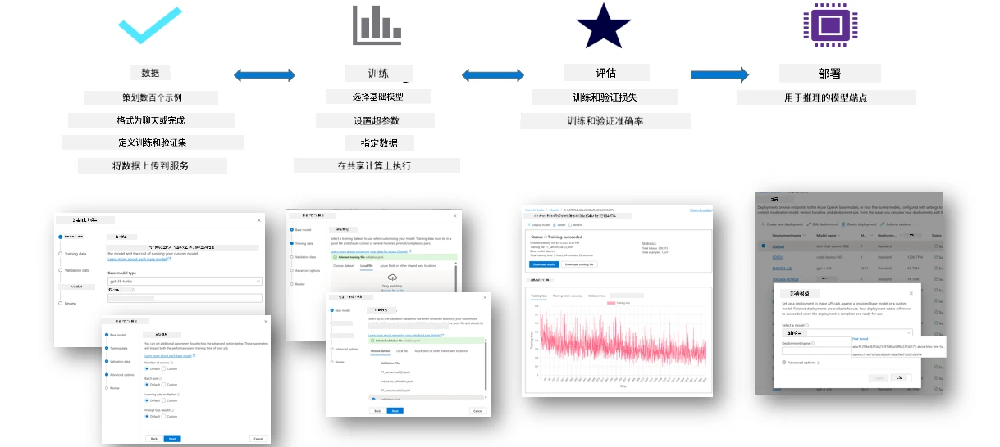

### 创建新项目

1. 登录至 [Microsoft Foundry](https://ai.azure.com)。

1. 点击 **+New project** 在 Microsoft Foundry 中创建新项目。

    

1. 执行以下操作：

    - 输入项目 **Hub 名称**。必须是唯一值。
    - 选择要使用的 **Hub**（必要时新建）。

    

1. 新建中心时完成以下操作：

    - 输入 **Hub 名称**。必须是唯一值。
    - 选择你的 Azure **订阅**。
    - 选择要使用的 **资源组**（必要时新建）。
    - 选择所需的 **位置**。
    - 选择要连接的 **Azure AI 服务**（必要时新建）。
    - 选择 **Connect Azure AI Search** 为 **跳过连接**。

    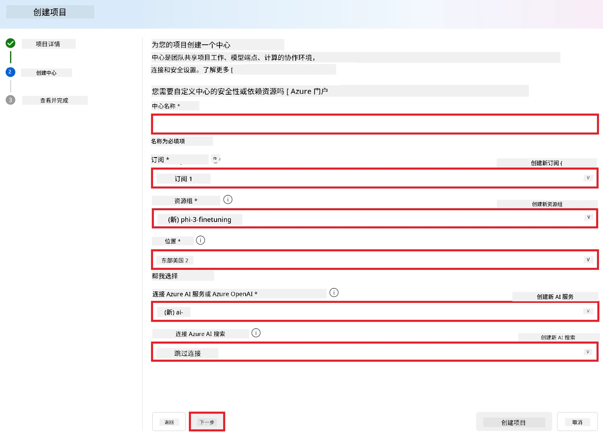

1. 点击 **下一步**。
1. 点击 **创建项目**。

### 数据准备

微调前，收集或创建与你任务相关的数据集，如聊天指令、问答对或其他相关文本数据。清理和预处理数据，删除噪声，处理缺失值，分词文本。

### 在 Microsoft Foundry 微调 Phi-3 模型

> [!NOTE]
> Phi-3 模型的微调当前只支持在 East US 2 区域的项目内进行。

1. 从左侧标签选择 **模型目录**。

1. 在 **搜索栏** 输入 *phi-3*，选择你想使用的 phi-3 模型。

    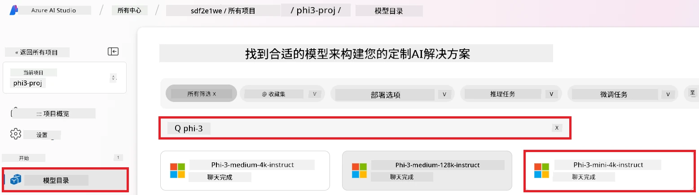

1. 点击 **微调**。

    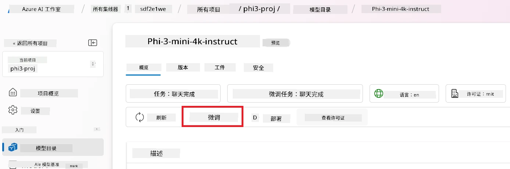

1. 输入 **微调模型名称**。

    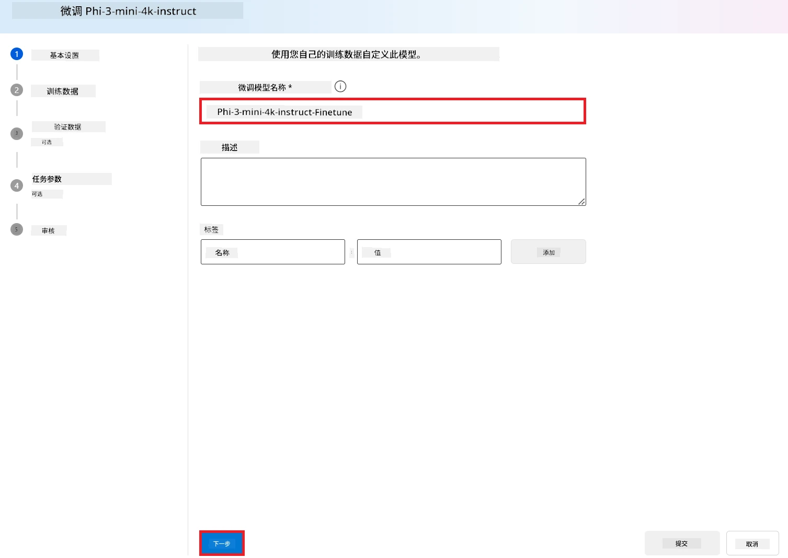

1. 点击 **下一步**。

1. 执行以下操作：

    - 选择 **任务类型** 为 **聊天完成**。
    - 选择你想使用的 **训练数据**。数据可通过 Microsoft Foundry 上传，或来自本地环境。

    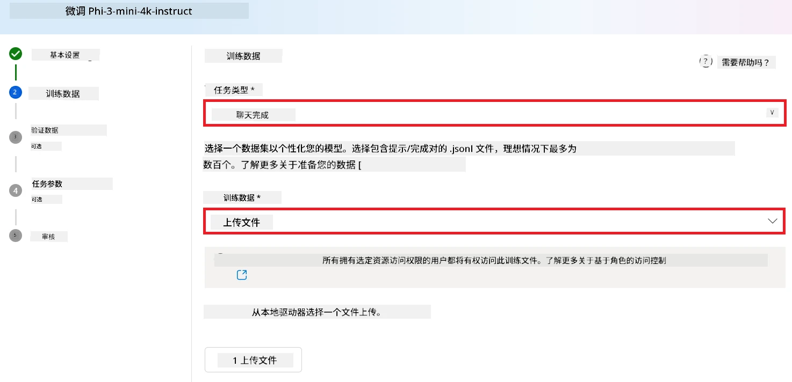

1. 点击 **下一步**。

1. 上传你想使用的 **验证数据**，或选择 **自动拆分训练数据**。

    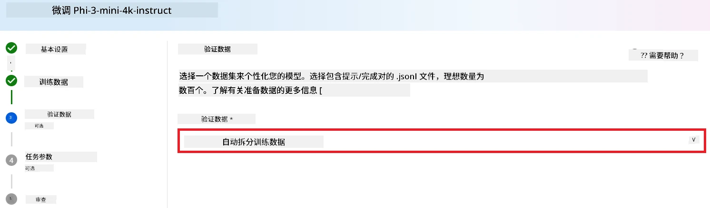

1. 点击 **下一步**。

1. 执行以下操作：

    - 选择所需的 **批量大小乘数**。
    - 选择所需的 **学习率**。
    - 选择所需的 **训练轮数**。

    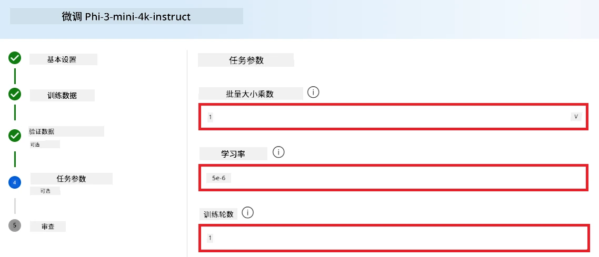

1. 点击 **提交** 启动微调流程。

    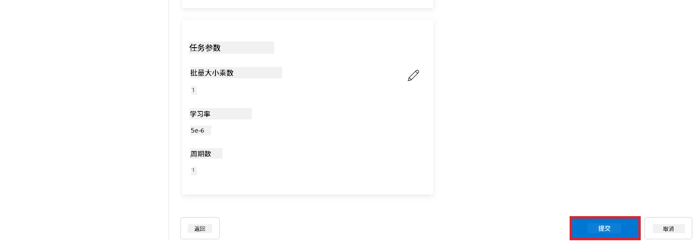

1. 微调完成后，状态显示为 **已完成**，如下图所示。你现在可以部署该模型，并在你自己的应用、操场(playground)或提示流(prompt flow)中使用。详情参见 [如何使用 Microsoft Foundry 部署 Phi-3 系列小型语言模型](https://learn.microsoft.com/azure/ai-studio/how-to/deploy-models-phi-3?tabs=phi-3-5&pivots=programming-language-python)。

    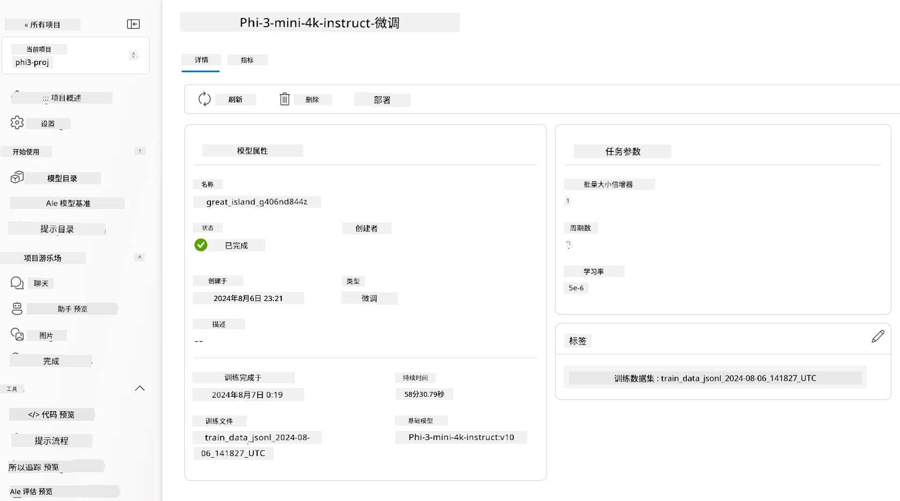

> [!NOTE]
> 详细的 Phi-3 微调信息请参阅 [在 Microsoft Foundry 中微调 Phi-3 模型](https://learn.microsoft.com/azure/ai-studio/how-to/fine-tune-phi-3?tabs=phi-3-mini)。

## 清理微调模型

你可以从 [Microsoft Foundry](https://ai.azure.com) 的微调模型列表或者模型详情页面删除微调模型。在微调页面选择待删除的模型，然后点击删除按钮删除。

> [!NOTE]
> 如果自定义模型有现有部署，则无法删除。需先删除模型部署，才能删除自定义模型。

## 费用和配额

### Phi-3 模型微调为服务的费用和配额注意事项

Microsoft 提供作为服务方式微调的 Phi 模型，并集成于 Microsoft Foundry 中使用。在[部署](https://learn.microsoft.com/azure/ai-studio/how-to/deploy-models-phi-3?tabs=phi-3-5&pivots=programming-language-python)或微调模型时，可在部署向导的“定价和条款”标签页查看定价信息。

## 内容过滤

以按需付费服务方式部署的模型受 Azure AI 内容安全保护。部署到实时端点时，你可以选择关闭此功能。启用 Azure AI 内容安全后，提示和完成内容都将通过一组分类模型，旨在检测并防止输出有害内容。内容过滤系统检测并对输入提示和输出完成中的特定潜在有害内容类别进行响应处理。了解更多 [Azure AI 内容安全](https://learn.microsoft.com/azure/ai-studio/concepts/content-filtering)。

**微调配置**

超参数：定义学习率、批量大小及训练轮数等超参数。

**损失函数**

选择适合任务的损失函数（例如交叉熵）。

**优化器**

选择优化器（例如 Adam）以进行训练中的梯度更新。

**微调流程**

- 加载预训练模型：加载 Phi-3 Mini 检查点。
- 添加自定义层：添加任务特定层（例如聊天指令的分类头）。

**训练模型**  
使用已准备的数据集微调模型，监控训练进展并根据需要调整超参数。

**评估和验证**

验证集：将数据拆分为训练集和验证集。

**性能评估**

使用准确率、F1 分数或困惑度等指标评估模型性能。

## 保存微调模型

**检查点**  
保存微调后的模型检查点以供未来使用。

## 部署

- 作为 Web 服务部署：在 Microsoft Foundry 中将微调模型部署为 Web 服务。
- 测试端点：向部署的端点发送测试查询，验证其功能。

## 迭代和改进

迭代：如果性能不理想，可通过调整超参数、增加数据或微调更多轮次继续迭代。

## 监控和优化

持续监控模型行为并进行必要的优化。

## 定制和扩展

自定义任务：Phi-3 Mini 可针对聊天指令以外的各种任务进行微调。探索更多用例！  
实验：尝试不同架构、层组合和技术以提升性能。

> [!NOTE]
> 微调是一个迭代过程。实验、学习并调整你的模型，以实现特定任务的最佳效果！

---

<!-- CO-OP TRANSLATOR DISCLAIMER START -->
**免责声明**：
本文件由 AI 翻译服务 [Co-op Translator](https://github.com/Azure/co-op-translator) 翻译。尽管我们力求准确，但请注意自动翻译可能包含错误或不准确之处。原始语言版本的文件应被视为权威来源。对于重要信息，建议使用专业人工翻译。对于因使用此翻译而产生的任何误解或误释，我们概不负责。
<!-- CO-OP TRANSLATOR DISCLAIMER END -->