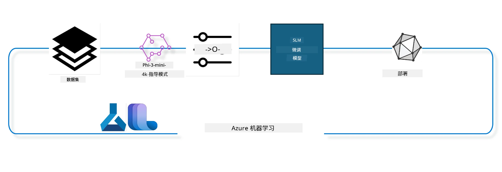

## 如何使用 Azure ML 系统注册表中的 chat-completion 组件进行模型微调

在此示例中，我们将使用 ultrachat_200k 数据集对 Phi-3-mini-4k-instruct 模型进行微调，以完成两个人之间的对话。



该示例将向您展示如何使用 Azure ML SDK 和 Python 进行微调，然后将微调后的模型部署到在线端点以实现实时推理。

### 训练数据

我们将使用 ultrachat_200k 数据集。该数据集是 UltraChat 数据集的严格筛选版本，用于训练 Zephyr-7B-β，这是一个最先进的 7b 聊天模型。

### 模型

我们将使用 Phi-3-mini-4k-instruct 模型演示用户如何微调用于 chat-completion 任务的模型。如果您是从特定模型卡打开此笔记本，请记得替换特定的模型名称。

### 任务

- 选择要微调的模型。
- 选择并探索训练数据。
- 配置微调作业。
- 运行微调作业。
- 回顾训练和评估指标。
- 注册微调后的模型。
- 部署微调后的模型以实现实时推理。
- 清理资源。

## 1. 设置先决条件

- 安装依赖项
- 连接到 AzureML 工作区。详细了解请参见设置 SDK 认证。下面替换 <WORKSPACE_NAME>、<RESOURCE_GROUP> 和 <SUBSCRIPTION_ID>。
- 连接到 azureml 系统注册表
- 设置可选的实验名称
- 检查或创建计算资源。

> [!NOTE]
> 需求是单个 GPU 节点可以拥有多个 GPU 卡。例如，Standard_NC24rs_v3 节点有 4 个 NVIDIA V100 GPU，而 Standard_NC12s_v3 有 2 个 NVIDIA V100 GPU。有关此信息，请参考文档。每个节点的 GPU 卡数由下方参数 gpus_per_node 设置。正确设置此值可确保利用节点内所有 GPU。推荐的 GPU 计算 SKU 可在此处和此处找到。

### Python 库

通过运行以下单元安装依赖项。如果在新环境运行，此步骤不可省略。

```bash
pip install azure-ai-ml
pip install azure-identity
pip install datasets==2.9.0
pip install mlflow
pip install azureml-mlflow
```

### 交互 Azure ML

1. 该 Python 脚本用于与 Azure 机器学习服务 (Azure ML) 交互。具体功能如下：

    - 导入 azure.ai.ml、azure.identity 和 azure.ai.ml.entities 包中的必要模块。还导入了 time 模块。

    - 尝试使用 DefaultAzureCredential() 进行身份验证，该方法提供简化的身份验证体验，方便快速开始在 Azure 云中开发应用。如果失败，则回退到 InteractiveBrowserCredential()，它提供交互式登录提示。

    - 然后尝试使用 from_config 方法创建 MLClient 实例，从默认配置文件(config.json)读取配置。如果失败，则通过手动提供 subscription_id、resource_group_name 和 workspace_name 创建 MLClient 实例。

    - 创建另一个 MLClient 实例，用于名为 "azureml" 的 Azure ML 注册表。该注册表存储模型、微调流程和环境。

    - 设置 experiment_name 为 "chat_completion_Phi-3-mini-4k-instruct"。

    - 通过将当前时间（自纪元以来的秒数，浮点数）转换为整数再转为字符串，生成唯一时间戳。该时间戳可用于创建唯一名称和版本。

    ```python
    # 从 Azure ML 和 Azure Identity 导入必要的模块
    from azure.ai.ml import MLClient
    from azure.identity import (
        DefaultAzureCredential,
        InteractiveBrowserCredential,
    )
    from azure.ai.ml.entities import AmlCompute
    import time  # 导入 time 模块
    
    # 尝试使用 DefaultAzureCredential 进行身份验证
    try:
        credential = DefaultAzureCredential()
        credential.get_token("https://management.azure.com/.default")
    except Exception as ex:  # 如果 DefaultAzureCredential 失败，则使用 InteractiveBrowserCredential
        credential = InteractiveBrowserCredential()
    
    # 尝试使用默认配置文件创建 MLClient 实例
    try:
        workspace_ml_client = MLClient.from_config(credential=credential)
    except:  # 如果失败，则通过手动提供详细信息创建 MLClient 实例
        workspace_ml_client = MLClient(
            credential,
            subscription_id="<SUBSCRIPTION_ID>",
            resource_group_name="<RESOURCE_GROUP>",
            workspace_name="<WORKSPACE_NAME>",
        )
    
    # 为名为 "azureml" 的 Azure ML 注册表创建另一个 MLClient 实例
    # 此注册表用于存储模型、微调管道和环境
    registry_ml_client = MLClient(credential, registry_name="azureml")
    
    # 设置实验名称
    experiment_name = "chat_completion_Phi-3-mini-4k-instruct"
    
    # 生成一个唯一的时间戳，可用于需要唯一性的名称和版本
    timestamp = str(int(time.time()))
    ```

## 2. 选择基础模型进行微调

1. Phi-3-mini-4k-instruct 是一个具有 38 亿参数的轻量级、最先进开源模型，基于 Phi-2 的数据集构建。此模型属于 Phi-3 系列，Mini 版本有两个变体 4K 和 128K，分别表示支持的上下文长度（以令牌计）。我们需要针对具体用途对模型进行微调。您可以在 AzureML Studio 的模型目录中浏览这些模型，按 chat-completion 任务筛选。此示例使用 Phi-3-mini-4k-instruct 模型。如果您打开的笔记本为不同模型，请相应替换模型名称和版本。

> [!NOTE]
> 模型的 model id 属性将在微调作业中作为输入传递。在 AzureML Studio 模型目录的模型详情页中，此值也显示为资产 ID 字段。

2. 该 Python 脚本用于与 Azure 机器学习服务交互。具体功能如下：

    - 设置 model_name 为 "Phi-3-mini-4k-instruct"。

    - 使用 registry_ml_client 对象的 models 属性的 get 方法，从 Azure ML 注册表获取指定名称模型的最新版本。get 方法带有两个参数：模型名称和标签，表明应检索最新版本。

    - 向控制台打印将用于微调的模型名称、版本和 id。字符串的 format 方法用于插入模型名称、版本和 id。这些属性从 foundation_model 对象中访问。

    ```python
    # 设置模型名称
    model_name = "Phi-3-mini-4k-instruct"
    
    # 从 Azure ML 注册表获取模型的最新版本
    foundation_model = registry_ml_client.models.get(model_name, label="latest")
    
    # 打印模型名称、版本和 ID
    # 这些信息对于跟踪和调试很有用
    print(
        "\n\nUsing model name: {0}, version: {1}, id: {2} for fine tuning".format(
            foundation_model.name, foundation_model.version, foundation_model.id
        )
    )
    ```

## 3. 创建用于作业的计算资源

微调作业只能使用 GPU 计算。计算大小取决于模型大小，通常很难准确识别适合作业的计算资源。本单元指导用户选择正确的计算资源。

> [!NOTE]
> 下面列出的计算资源使用的是最优化配置。任何修改配置可能导致 CUDA 内存不足错误。在这种情况下，尝试升级到更大计算规模。

> [!NOTE]
> 选择下面的 compute_cluster_size 时，请确保计算资源在您的资源组中可用。如果某个计算不可用，您可以申请访问计算资源。

### 检查模型是否支持微调

1. 该 Python 脚本与 Azure 机器学习模型交互。具体功能如下：

    - 导入 ast 模块，提供处理 Python 抽象语法树的功能。

    - 检查 foundation_model 对象（表示 Azure ML 中的模型）是否存在名为 finetune_compute_allow_list 的标签。Azure ML 中的标签是可以用作过滤和排序模型的键值对。

    - 如果存在 finetune_compute_allow_list 标签，使用 ast.literal_eval 安全地将标签的字符串值解析为 Python 列表。将此列表赋给 computes_allow_list 变量。然后打印提示消息，表明应从此列表创建计算资源。

    - 如果不存在此标签，则将 computes_allow_list 设置为 None，并打印提示信息，说明模型标签中不包含 finetune_compute_allow_list。

    - 总的来说，此脚本检查模型元数据中的特定标签，若存在则将其值转换成列表，并向用户提供相应反馈。

    ```python
    # 导入 ast 模块，该模块提供处理 Python 抽象语法树的函数
    import ast
    
    # 检查模型的标签中是否存在 'finetune_compute_allow_list' 标签
    if "finetune_compute_allow_list" in foundation_model.tags:
        # 如果标签存在，使用 ast.literal_eval 安全地将标签的值（字符串）解析为 Python 列表
        computes_allow_list = ast.literal_eval(
            foundation_model.tags["finetune_compute_allow_list"]
        )  # 将字符串转换为 Python 列表
        # 打印一条消息，指示应从列表中创建计算
        print(f"Please create a compute from the above list - {computes_allow_list}")
    else:
        # 如果标签不存在，则将 computes_allow_list 设置为 None
        computes_allow_list = None
        # 打印一条消息，指示 'finetune_compute_allow_list' 标签不是模型标签的一部分
        print("`finetune_compute_allow_list` is not part of model tags")
    ```

### 检查计算实例

1. 该 Python 脚本与 Azure 机器学习服务交互，执行对计算实例的多项检查。具体功能如下：

    - 尝试从 Azure ML 工作区中获取名称为 compute_cluster 的计算实例。如果该计算实例的配置状态为 "failed"，则抛出 ValueError。

    - 检查 computes_allow_list 是否不为 None。如果不为 None，将列表中的所有计算大小转换成小写，并检查当前计算实例的大小是否在允许列表中。如果不在，则抛出 ValueError。

    - 如果 computes_allow_list 为 None，则检查计算实例大小是否在不支持的 GPU VM 大小列表中，如果是则抛出 ValueError。

    - 获取工作区中所有可用计算大小的列表。遍历该列表，对每个计算大小检查其名称是否与当前计算实例大小匹配。若匹配，获取该计算大小的 GPU 数量，并将 gpu_count_found 设为 True。

    - 如果找到 GPU 数量，打印计算实例的 GPU 数量。否则抛出 ValueError。

    - 总结而言，脚本检查 Azure ML 工作区中计算实例的配置状态、大小是否符合要求，以及是否具备 GPU。

    ```python
    # 打印异常信息
    print(e)
    # 如果工作区中不存在计算大小，则引发 ValueError
    raise ValueError(
        f"WARNING! Compute size {compute_cluster_size} not available in workspace"
    )
    
    # 从 Azure ML 工作区检索计算实例
    compute = workspace_ml_client.compute.get(compute_cluster)
    # 检查计算实例的配置状态是否为“failed”
    if compute.provisioning_state.lower() == "failed":
        # 如果配置状态为“failed”，则引发 ValueError
        raise ValueError(
            f"Provisioning failed, Compute '{compute_cluster}' is in failed state. "
            f"please try creating a different compute"
        )
    
    # 检查 computes_allow_list 是否不为 None
    if computes_allow_list is not None:
        # 将 computes_allow_list 中的所有计算大小转换为小写
        computes_allow_list_lower_case = [x.lower() for x in computes_allow_list]
        # 检查计算实例的大小是否在 computes_allow_list_lower_case 中
        if compute.size.lower() not in computes_allow_list_lower_case:
            # 如果计算实例的大小不在 computes_allow_list_lower_case 中，则引发 ValueError
            raise ValueError(
                f"VM size {compute.size} is not in the allow-listed computes for finetuning"
            )
    else:
        # 定义不支持的 GPU 虚拟机大小列表
        unsupported_gpu_vm_list = [
            "standard_nc6",
            "standard_nc12",
            "standard_nc24",
            "standard_nc24r",
        ]
        # 检查计算实例的大小是否在 unsupported_gpu_vm_list 中
        if compute.size.lower() in unsupported_gpu_vm_list:
            # 如果计算实例的大小在 unsupported_gpu_vm_list 中，则引发 ValueError
            raise ValueError(
                f"VM size {compute.size} is currently not supported for finetuning"
            )
    
    # 初始化一个标志，用于检查是否已找到计算实例中的 GPU 数量
    gpu_count_found = False
    # 检索工作区中所有可用计算大小的列表
    workspace_compute_sku_list = workspace_ml_client.compute.list_sizes()
    available_sku_sizes = []
    # 遍历可用计算大小的列表
    for compute_sku in workspace_compute_sku_list:
        available_sku_sizes.append(compute_sku.name)
        # 检查计算大小的名称是否与计算实例的大小匹配
        if compute_sku.name.lower() == compute.size.lower():
            # 如果匹配，检索该计算大小的 GPU 数量并将 gpu_count_found 设置为 True
            gpus_per_node = compute_sku.gpus
            gpu_count_found = True
    # 如果 gpu_count_found 为 True，打印计算实例中的 GPU 数量
    if gpu_count_found:
        print(f"Number of GPU's in compute {compute.size}: {gpus_per_node}")
    else:
        # 如果 gpu_count_found 为 False，则引发 ValueError
        raise ValueError(
            f"Number of GPU's in compute {compute.size} not found. Available skus are: {available_sku_sizes}."
            f"This should not happen. Please check the selected compute cluster: {compute_cluster} and try again."
        )
    ```

## 4. 选择用于微调模型的数据集

1. 我们使用 ultrachat_200k 数据集。该数据集包含四个拆分，适合监督微调 (sft)。
生成排名 (gen)。每个拆分的示例数量如下：

    ```bash
    train_sft test_sft  train_gen  test_gen
    207865  23110  256032  28304
    ```

1. 接下来的几个单元展示微调的基础数据准备工作：

### 可视化部分数据行

希望示例快速运行，因此保存 train_sft 和 test_sft 文件，其中包含已经削减行的 5%。这意味着微调后的模型准确率较低，因此不宜用于实际生产环境。
download-dataset.py 用于下载 ultrachat_200k 数据集并将其转换为适用于微调流水线组件的格式。由于数据集较大，这里仅提示部分数据集。

1. 运行以下脚本仅下载 5% 的数据。通过更改 dataset_split_pc 参数可调整百分比。

> [!NOTE]
> 某些语言模型使用不同的语言代码，因此数据集中的列名应与之匹配。

1. 以下是数据的示例格式  
chat-completion 数据集以 parquet 格式存储，每条目使用以下模式：

    - 这是一个 JSON（JavaScript 对象表示法）文档，广泛用于数据交换。它不是可执行代码，而是一种存储和传输数据的方式。结构如下：

    - "prompt"：包含字符串，代表向 AI 助手提出的任务或问题。

    - "messages"：包含对象数组。每个对象代表用户与 AI 助手间的对话消息。每条消息有两个键：

    - "content"：字符串，消息的内容。
    - "role"：字符串，发送消息的实体角色，可能是 "user"（用户）或 "assistant"（助手）。

    - "prompt_id"：字符串，代表提示的唯一标识符。

1. 在该 JSON 文档中，表示一段对话，用户请求 AI 助手为反乌托邦故事创造一位主角。助手回复后，用户请求更多细节。助手同意提供更多细节。整段对话关联一个特定的提示 id。

    ```python
    {
        // The task or question posed to an AI assistant
        "prompt": "Create a fully-developed protagonist who is challenged to survive within a dystopian society under the rule of a tyrant. ...",
        
        // An array of objects, each representing a message in a conversation between a user and an AI assistant
        "messages":[
            {
                // The content of the user's message
                "content": "Create a fully-developed protagonist who is challenged to survive within a dystopian society under the rule of a tyrant. ...",
                // The role of the entity that sent the message
                "role": "user"
            },
            {
                // The content of the assistant's message
                "content": "Name: Ava\n\n Ava was just 16 years old when the world as she knew it came crashing down. The government had collapsed, leaving behind a chaotic and lawless society. ...",
                // The role of the entity that sent the message
                "role": "assistant"
            },
            {
                // The content of the user's message
                "content": "Wow, Ava's story is so intense and inspiring! Can you provide me with more details.  ...",
                // The role of the entity that sent the message
                "role": "user"
            }, 
            {
                // The content of the assistant's message
                "content": "Certainly! ....",
                // The role of the entity that sent the message
                "role": "assistant"
            }
        ],
        
        // A unique identifier for the prompt
        "prompt_id": "d938b65dfe31f05f80eb8572964c6673eddbd68eff3db6bd234d7f1e3b86c2af"
    }
    ```

### 下载数据

1. 该 Python 脚本用于使用名为 download-dataset.py 的辅助脚本下载数据集。具体功能如下：

    - 导入 os 模块，提供操作系统依赖的功能。

    - 使用 os.system 函数在 shell 中运行 download-dataset.py 脚本，带有指定命令行参数。参数指定下载数据集 HuggingFaceH4/ultrachat_200k，下载目录为 ultrachat_200k_dataset，拆分比例为 5。os.system 返回命令执行状态，存储在 exit_status 变量中。

    - 检查 exit_status 是否不等于 0。在类 Unix 操作系统中，状态 0 表示成功，其它数字表示错误。如果不为 0，抛出异常，提示下载数据集时出错。

    - 总结而言，该脚本通过辅助脚本执行数据集下载命令，若失败则抛出异常。
    
    ```python
    # 导入 os 模块，该模块提供使用操作系统相关功能的方法
    import os
    
    # 使用 os.system 函数在 shell 中运行 download-dataset.py 脚本，并传递特定的命令行参数
    # 参数指定要下载的数据集（HuggingFaceH4/ultrachat_200k）、下载目录（ultrachat_200k_dataset）及数据集拆分百分比（5）
    # os.system 函数返回执行命令的退出状态；该状态存储在 exit_status 变量中
    exit_status = os.system(
        "python ./download-dataset.py --dataset HuggingFaceH4/ultrachat_200k --download_dir ultrachat_200k_dataset --dataset_split_pc 5"
    )
    
    # 检查 exit_status 是否不等于 0
    # 在类 Unix 操作系统中，0 的退出状态通常表示命令成功，其他数字表示错误
    # 如果 exit_status 不为 0，则抛出异常并显示下载数据集时发生错误的消息
    if exit_status != 0:
        raise Exception("Error downloading dataset")
    ```

### 加载数据到 DataFrame
1. 这个Python脚本正在将一个JSON Lines文件加载到pandas DataFrame中，并显示前5行。以下是它的工作解析：

    - 它导入了pandas库，这是一种强大的数据操作和分析库。

    - 它将pandas显示选项中的最大列宽设置为0。这意味着打印DataFrame时，每列的完整文本都将显示，而不会被截断。

    - 它使用pd.read_json函数将ultrachat_200k_dataset目录下的train_sft.jsonl文件加载到DataFrame中。参数lines=True表示该文件采用JSON Lines格式，每一行都是一个独立的JSON对象。

    - 它使用head方法显示DataFrame的前5行。如果DataFrame少于5行，则显示全部。

    - 总结来说，该脚本将JSON Lines文件加载到DataFrame中，并显示含完整列文本的前5行。
    
    ```python
    # 导入pandas库，它是一个强大的数据操作和分析库
    import pandas as pd
    
    # 设置pandas显示选项的最大列宽为0
    # 这意味着打印DataFrame时，每列的完整文本将被显示而不会被截断
    pd.set_option("display.max_colwidth", 0)
    
    # 使用pd.read_json函数将ultrachat_200k_dataset目录下的train_sft.jsonl文件加载到DataFrame中
    # lines=True参数表示文件是JSON Lines格式，每行是一个独立的JSON对象
    df = pd.read_json("./ultrachat_200k_dataset/train_sft.jsonl", lines=True)
    
    # 使用head方法显示DataFrame的前5行
    # 如果DataFrame少于5行，则显示全部数据行
    df.head()
    ```

## 5. 使用模型和数据作为输入提交微调作业

创建使用chat-completion管道组件的作业。了解关于微调支持的所有参数。

### 定义微调参数

1. 微调参数可以分为两类 - 训练参数、优化参数

1. 训练参数定义训练相关的方面，例如 -

    - 使用的优化器、调度器
    - 用来优化微调的指标
    - 训练步数、批量大小等
    - 优化参数帮助优化GPU内存和有效利用计算资源。

1. 以下是属于此类的部分参数。优化参数因模型而异，并与模型一起打包以处理这些差异。

    - 启用deepspeed和LoRA
    - 启用混合精度训练
    - 启用多节点训练

> [!NOTE]
> 监督微调可能导致丧失对齐或灾难性遗忘。建议检查此问题，并在微调后运行对齐阶段。

### 微调参数

1. 这个Python脚本设置了用于微调机器学习模型的参数。以下是它的工作解析：

    - 它设置了默认的训练参数，如训练周期数、训练和评估的批量大小、学习率及学习率调度器类型。

    - 它设置了默认的优化参数，如是否应用Layer-wise Relevance Propagation (LoRa)和DeepSpeed，以及DeepSpeed阶段。

    - 它将训练参数和优化参数合并成一个名为finetune_parameters的字典。

    - 它检查foundation_model是否有模型特定的默认参数。如果有，则打印警告信息，并用这些模型特定的默认参数更新finetune_parameters字典。使用ast.literal_eval函数将模型特定默认参数从字符串转换为Python字典。

    - 它打印用于此次运行的最终微调参数集合。

    - 总结来说，该脚本设置并显示用于微调机器学习模型的参数，支持用模型特定参数覆盖默认参数。

    ```python
    # 设置默认的训练参数，例如训练轮数、训练和评估的批量大小、学习率和学习率调度器类型
    training_parameters = dict(
        num_train_epochs=3,
        per_device_train_batch_size=1,
        per_device_eval_batch_size=1,
        learning_rate=5e-6,
        lr_scheduler_type="cosine",
    )
    
    # 设置默认的优化参数，例如是否应用分层相关传播（LoRa）和DeepSpeed，以及DeepSpeed阶段
    optimization_parameters = dict(
        apply_lora="true",
        apply_deepspeed="true",
        deepspeed_stage=2,
    )
    
    # 将训练和优化参数合并为一个名为finetune_parameters的字典
    finetune_parameters = {**training_parameters, **optimization_parameters}
    
    # 检查foundation_model是否有任何特定模型的默认参数
    # 如果有，打印警告信息并使用这些特定模型的默认值更新finetune_parameters字典
    # ast.literal_eval函数用于将特定模型的默认值从字符串转换为Python字典
    if "model_specific_defaults" in foundation_model.tags:
        print("Warning! Model specific defaults exist. The defaults could be overridden.")
        finetune_parameters.update(
            ast.literal_eval(  # 将字符串转换为Python字典
                foundation_model.tags["model_specific_defaults"]
            )
        )
    
    # 打印将在运行中使用的最终微调参数集
    print(
        f"The following finetune parameters are going to be set for the run: {finetune_parameters}"
    )
    ```

### 训练管道

1. 这个Python脚本定义了一个函数，用于生成机器学习训练管道的显示名称，然后调用该函数生成并打印该显示名称。以下是它的工作解析：

1. 定义了get_pipeline_display_name函数。该函数基于与训练管道相关的多个参数生成显示名称。

1. 在函数内，计算总批量大小，方法是将每设备批量大小、梯度累积步数、每节点GPU数和用于微调的节点数相乘。

1. 它检索其他参数，如学习率调度器类型、是否启用了DeepSpeed、DeepSpeed阶段、是否启用LoRa、模型检查点保留数限制和最大序列长度。

1. 构造一个包含所有这些参数的字符串，参数之间用连字符分隔。如果启用了DeepSpeed或LoRa，字符串包括“ds”加DeepSpeed阶段，或“lora”，否则分别包含“nods”或“nolora”。

1. 函数返回该字符串，作为训练管道的显示名称。

1. 函数定义后被调用生成显示名称，并打印该名称。

1. 总结来说，该脚本根据各参数生成机器学习训练管道的显示名称，并打印该名称。

    ```python
    # 定义一个函数来生成训练流水线的显示名称
    def get_pipeline_display_name():
        # 通过将每设备批量大小、梯度累积步数、每节点GPU数量和用于微调的节点数量相乘，计算总批量大小
        batch_size = (
            int(finetune_parameters.get("per_device_train_batch_size", 1))
            * int(finetune_parameters.get("gradient_accumulation_steps", 1))
            * int(gpus_per_node)
            * int(finetune_parameters.get("num_nodes_finetune", 1))
        )
        # 获取学习率调度器类型
        scheduler = finetune_parameters.get("lr_scheduler_type", "linear")
        # 获取是否应用DeepSpeed
        deepspeed = finetune_parameters.get("apply_deepspeed", "false")
        # 获取DeepSpeed阶段
        ds_stage = finetune_parameters.get("deepspeed_stage", "2")
        # 如果应用了DeepSpeed，在显示名称中包含“ds”加上DeepSpeed阶段；如果没有，则包含“nods”
        if deepspeed == "true":
            ds_string = f"ds{ds_stage}"
        else:
            ds_string = "nods"
        # 获取是否应用了逐层相关传播（LoRa）
        lora = finetune_parameters.get("apply_lora", "false")
        # 如果应用了LoRa，在显示名称中包含“lora”；如果没有，则包含“nolora”
        if lora == "true":
            lora_string = "lora"
        else:
            lora_string = "nolora"
        # 获取保留的模型检查点数量限制
        save_limit = finetune_parameters.get("save_total_limit", -1)
        # 获取最大序列长度
        seq_len = finetune_parameters.get("max_seq_length", -1)
        # 通过连接所有这些参数，以连字符分隔，构建显示名称
        return (
            model_name
            + "-"
            + "ultrachat"
            + "-"
            + f"bs{batch_size}"
            + "-"
            + f"{scheduler}"
            + "-"
            + ds_string
            + "-"
            + lora_string
            + f"-save_limit{save_limit}"
            + f"-seqlen{seq_len}"
        )
    
    # 调用函数生成显示名称
    pipeline_display_name = get_pipeline_display_name()
    # 打印显示名称
    print(f"Display name used for the run: {pipeline_display_name}")
    ```

### 配置管道

这个Python脚本使用Azure机器学习SDK定义并配置机器学习管道。以下是它的工作解析：

1. 它导入了Azure AI ML SDK中的必要模块。

1. 它从注册表中获取名为"chat_completion_pipeline"的管道组件。

1. 它使用`@pipeline`装饰器和函数`create_pipeline`定义了一个管道作业。管道名称设置为`pipeline_display_name`。

1. 在`create_pipeline`函数中，初始化获取的管道组件，并传入多个参数，包括模型路径、各阶段的计算集群、训练和测试的数据集拆分、微调使用的GPU数量及其它微调参数。

1. 它将微调作业的输出映射到管道作业的输出，以便微调后的模型能被轻松注册，这对于将模型部署到在线或批量端点是必须的。

1. 通过调用`create_pipeline`函数，创建管道实例。

1. 设置管道的`force_rerun`为`True`，表示不使用之前作业的缓存结果。

1. 设置管道的`continue_on_step_failure`为`False`，意味着如果任何步骤失败，管道会停止。

1. 总结来说，该脚本定义并配置了一个使用Azure机器学习SDK的聊天完成任务机器学习管道。

    ```python
    # 从 Azure AI ML SDK 导入必要的模块
    from azure.ai.ml.dsl import pipeline
    from azure.ai.ml import Input
    
    # 从注册表中获取名为 "chat_completion_pipeline" 的管道组件
    pipeline_component_func = registry_ml_client.components.get(
        name="chat_completion_pipeline", label="latest"
    )
    
    # 使用 @pipeline 装饰器和 create_pipeline 函数定义管道作业
    # 管道的名称被设置为 pipeline_display_name
    @pipeline(name=pipeline_display_name)
    def create_pipeline():
        # 使用各种参数初始化获取到的管道组件
        # 包括模型路径、不同阶段的计算集群、训练和测试的数据集拆分、用于微调的 GPU 数量及其他微调参数
        chat_completion_pipeline = pipeline_component_func(
            mlflow_model_path=foundation_model.id,
            compute_model_import=compute_cluster,
            compute_preprocess=compute_cluster,
            compute_finetune=compute_cluster,
            compute_model_evaluation=compute_cluster,
            # 将数据集拆分映射到参数
            train_file_path=Input(
                type="uri_file", path="./ultrachat_200k_dataset/train_sft.jsonl"
            ),
            test_file_path=Input(
                type="uri_file", path="./ultrachat_200k_dataset/test_sft.jsonl"
            ),
            # 训练设置
            number_of_gpu_to_use_finetuning=gpus_per_node,  # 设置为计算集群中可用的 GPU 数量
            **finetune_parameters
        )
        return {
            # 将微调作业的输出映射到管道作业的输出
            # 这样做是为了方便注册微调后的模型
            # 注册模型是将模型部署到在线或批处理端点所必需的
            "trained_model": chat_completion_pipeline.outputs.mlflow_model_folder
        }
    
    # 通过调用 create_pipeline 函数创建管道实例
    pipeline_object = create_pipeline()
    
    # 不使用之前作业的缓存结果
    pipeline_object.settings.force_rerun = True
    
    # 设置步骤失败时不继续执行
    # 这意味着如果任何步骤失败，管道将停止运行
    pipeline_object.settings.continue_on_step_failure = False
    ```

### 提交作业

1. 这个Python脚本将机器学习管道作业提交到Azure机器学习工作区，并等待作业完成。以下是它的工作解析：

    - 它调用workspace_ml_client中的jobs对象的create_or_update方法来提交管道作业。指定要运行的管道为pipeline_object，作业运行所属的实验为experiment_name。

    - 然后它调用workspace_ml_client中的jobs对象的stream方法，等待管道作业完成。等待的作业由pipeline_job对象的name属性指定。

    - 总结来说，该脚本提交机器学习管道作业到Azure机器学习工作区，并等待作业完成。

    ```python
    # 将管道作业提交到 Azure 机器学习工作区
    # 要运行的管道由 pipeline_object 指定
    # 作业运行所用的实验由 experiment_name 指定
    pipeline_job = workspace_ml_client.jobs.create_or_update(
        pipeline_object, experiment_name=experiment_name
    )
    
    # 等待管道作业完成
    # 要等待的作业由 pipeline_job 对象的 name 属性指定
    workspace_ml_client.jobs.stream(pipeline_job.name)
    ```

## 6. 在工作区注册微调后的模型

我们将从微调作业的输出注册模型。这将跟踪微调模型与微调作业之间的血统关系。微调作业还跟踪底层模型、数据和训练代码的血统。

### 注册机器学习模型

1. 这个Python脚本在Azure机器学习管道中注册训练好的机器学习模型。以下是它的工作解析：

    - 它导入了Azure AI ML SDK中的必要模块。

    - 它通过调用workspace_ml_client中jobs对象的get方法并访问outputs属性，检查pipeline作业中是否有trained_model输出。

    - 它构造有训练模型的路径，格式化字符串使用管道作业的名称和输出名称("trained_model")。

    - 它定义微调模型的名称，将原模型名称后追加"-ultrachat-200k"，并将所有斜杠替换为连字符。

    - 它准备注册模型，通过创建Model对象，传入模型路径、模型类型（MLflow模型）、模型名称和版本、以及模型描述等参数。

    - 它调用workspace_ml_client中models对象的create_or_update方法，传入Model对象，完成模型注册。

    - 它打印已注册的模型。

1. 总结来说，该脚本注册了在Azure机器学习管道中训练的机器学习模型。
    
    ```python
    # 从 Azure AI ML SDK 导入必要的模块
    from azure.ai.ml.entities import Model
    from azure.ai.ml.constants import AssetTypes
    
    # 检查管道作业中是否有 `trained_model` 输出
    print("pipeline job outputs: ", workspace_ml_client.jobs.get(pipeline_job.name).outputs)
    
    # 通过格式化字符串构建指向训练模型的路径，使用管道作业名称和输出名称（"trained_model"）
    model_path_from_job = "azureml://jobs/{0}/outputs/{1}".format(
        pipeline_job.name, "trained_model"
    )
    
    # 为微调模型定义名称，通过在原始模型名称后附加“-ultrachat-200k”并将斜杠替换为连字符
    finetuned_model_name = model_name + "-ultrachat-200k"
    finetuned_model_name = finetuned_model_name.replace("/", "-")
    
    print("path to register model: ", model_path_from_job)
    
    # 通过创建带有各种参数的 Model 对象准备注册模型
    # 这些参数包括模型路径、模型类型（MLflow 模型）、模型名称和版本，以及模型描述
    prepare_to_register_model = Model(
        path=model_path_from_job,
        type=AssetTypes.MLFLOW_MODEL,
        name=finetuned_model_name,
        version=timestamp,  # 使用时间戳作为版本以避免版本冲突
        description=model_name + " fine tuned model for ultrachat 200k chat-completion",
    )
    
    print("prepare to register model: \n", prepare_to_register_model)
    
    # 通过调用 workspace_ml_client 中 models 对象的 create_or_update 方法，并传入 Model 对象来注册模型
    registered_model = workspace_ml_client.models.create_or_update(
        prepare_to_register_model
    )
    
    # 打印已注册的模型
    print("registered model: \n", registered_model)
    ```

## 7. 将微调模型部署到在线端点

在线端点提供一个持久的REST API，可用于需要调用模型的应用集成。

### 管理端点

1. 这个Python脚本在Azure机器学习中为注册模型创建托管的在线端点。以下是它的工作解析：

    - 它导入了Azure AI ML SDK中的必要模块。

    - 它定义唯一的在线端点名称，通过在字符串"ultrachat-completion-"后追加时间戳实现。

    - 它准备创建在线端点，通过创建一个ManagedOnlineEndpoint对象，传入端点名称、描述及认证模式("key")等参数。

    - 它调用workspace_ml_client的begin_create_or_update方法，传入ManagedOnlineEndpoint对象创建端点，并通过调用wait方法等待创建完成。

1. 总结来说，该脚本在Azure机器学习中为注册模型创建了托管的在线端点。

    ```python
    # 从 Azure AI ML SDK 导入必要的模块
    from azure.ai.ml.entities import (
        ManagedOnlineEndpoint,
        ManagedOnlineDeployment,
        ProbeSettings,
        OnlineRequestSettings,
    )
    
    # 通过在字符串 "ultrachat-completion-" 后附加时间戳来定义在线端点的唯一名称
    online_endpoint_name = "ultrachat-completion-" + timestamp
    
    # 通过创建一个包含各种参数的 ManagedOnlineEndpoint 对象，准备创建在线端点
    # 这些参数包括端点的名称、端点的描述和认证模式（"key"）
    endpoint = ManagedOnlineEndpoint(
        name=online_endpoint_name,
        description="Online endpoint for "
        + registered_model.name
        + ", fine tuned model for ultrachat-200k-chat-completion",
        auth_mode="key",
    )
    
    # 通过调用 workspace_ml_client 的 begin_create_or_update 方法并传入 ManagedOnlineEndpoint 对象来创建在线端点
    # 然后通过调用 wait 方法等待创建操作完成
    workspace_ml_client.begin_create_or_update(endpoint).wait()
    ```

> [!NOTE]
> 部署支持的SKU列表可在此查看 - [Managed online endpoints SKU list](https://learn.microsoft.com/azure/machine-learning/reference-managed-online-endpoints-vm-sku-list)

### 部署机器学习模型

1. 这个Python脚本将注册的机器学习模型部署到Azure机器学习托管的在线端点。以下是它的工作解析：

    - 它导入了ast模块，该模块提供处理Python抽象语法树的函数。

    - 它将部署实例类型设为"Standard_NC6s_v3"。

    - 它检查foundation_model中是否有inference_compute_allow_list标签。如果存在，将标签值从字符串转为Python列表，并赋值给inference_computes_allow_list，否则设为None。

    - 它检查指定的实例类型是否在允许列表中。如果不在，则打印提示，要求用户从允许列表中选择实例类型。

    - 它准备创建部署，通过创建ManagedOnlineDeployment对象，传入部署名称、端点名称、模型ID、实例类型和数量、存活探针设置和请求设置等参数。

    - 它调用workspace_ml_client的begin_create_or_update方法，传入ManagedOnlineDeployment对象执行部署，并通过wait方法等待完成。

    - 它将端点的流量设置为将100%流量分配给名为"demo"的部署。

    - 它调用workspace_ml_client的begin_create_or_update方法更新端点，并调用result方法等待更新完成。

1. 总结来说，该脚本将注册的机器学习模型部署到Azure机器学习的托管在线端点。

    ```python
    # 导入 ast 模块，该模块提供处理 Python 抽象语法树的函数
    import ast
    
    # 设置部署的实例类型
    instance_type = "Standard_NC6s_v3"
    
    # 检查基础模型中是否存在 `inference_compute_allow_list` 标签
    if "inference_compute_allow_list" in foundation_model.tags:
        # 如果存在，则将标签值从字符串转换为 Python 列表，并赋值给 `inference_computes_allow_list`
        inference_computes_allow_list = ast.literal_eval(
            foundation_model.tags["inference_compute_allow_list"]
        )
        print(f"Please create a compute from the above list - {computes_allow_list}")
    else:
        # 如果不存在，则将 `inference_computes_allow_list` 设置为 `None`
        inference_computes_allow_list = None
        print("`inference_compute_allow_list` is not part of model tags")
    
    # 检查指定的实例类型是否在允许列表中
    if (
        inference_computes_allow_list is not None
        and instance_type not in inference_computes_allow_list
    ):
        print(
            f"`instance_type` is not in the allow listed compute. Please select a value from {inference_computes_allow_list}"
        )
    
    # 通过创建一个带有各种参数的 `ManagedOnlineDeployment` 对象来准备创建部署
    demo_deployment = ManagedOnlineDeployment(
        name="demo",
        endpoint_name=online_endpoint_name,
        model=registered_model.id,
        instance_type=instance_type,
        instance_count=1,
        liveness_probe=ProbeSettings(initial_delay=600),
        request_settings=OnlineRequestSettings(request_timeout_ms=90000),
    )
    
    # 通过调用 `workspace_ml_client` 的 `begin_create_or_update` 方法并传入 `ManagedOnlineDeployment` 对象来创建部署
    # 然后通过调用 `wait` 方法等待创建操作完成
    workspace_ml_client.online_deployments.begin_create_or_update(demo_deployment).wait()
    
    # 设置终端节点的流量，将 100% 的流量导向 "demo" 部署
    endpoint.traffic = {"demo": 100}
    
    # 通过调用 `workspace_ml_client` 的 `begin_create_or_update` 方法并传入 `endpoint` 对象来更新终端节点
    # 然后通过调用 `result` 方法等待更新操作完成
    workspace_ml_client.begin_create_or_update(endpoint).result()
    ```

## 8. 使用样本数据测试端点

我们将从测试数据集中获取一些样本数据，并提交到在线端点进行推断。随后显示预测标签与真实标签。

### 读取结果

1. 这个Python脚本将一个JSON Lines文件读取到pandas DataFrame中，随机抽取样本，并重置索引。以下是它的工作解析：

    - 它读取文件./ultrachat_200k_dataset/test_gen.jsonl到pandas DataFrame。由于文件采用JSON Lines格式，每行是一个独立JSON对象，使用了read_json函数的lines=True参数。

    - 它随机抽取1行样本。使用sample函数，参数n=1指定抽取1条随机行。

    - 它重置DataFrame的索引。使用reset_index函数，参数drop=True删除原索引，替换为默认整数索引。

    - 它使用head函数显示前2行。但由于采样后DataFrame只有1行，因此仅显示该行。

1. 总结来说，该脚本将JSON Lines文件读取到pandas DataFrame，随机抽取1行样本，重置索引，并显示第一行。
    
    ```python
    # 导入pandas库
    import pandas as pd
    
    # 将JSON Lines文件'./ultrachat_200k_dataset/test_gen.jsonl'读取到pandas DataFrame中
    # 'lines=True'参数表示文件是JSON Lines格式，每行是一个独立的JSON对象
    test_df = pd.read_json("./ultrachat_200k_dataset/test_gen.jsonl", lines=True)
    
    # 从DataFrame中随机抽取1行样本
    # 'n=1'参数指定要选择的随机行数
    test_df = test_df.sample(n=1)
    
    # 重置DataFrame的索引
    # 'drop=True'参数表示丢弃原有索引，替换为默认整数值的新索引
    # 'inplace=True'参数表示将在原地修改DataFrame（不创建新对象）
    test_df.reset_index(drop=True, inplace=True)
    
    # 显示DataFrame的前2行
    # 但是，由于抽样后DataFrame仅包含一行，因此只会显示这一行
    test_df.head(2)
    ```

### 创建JSON对象
1. 这个Python脚本正在创建一个具有特定参数的JSON对象并将其保存到文件中。以下是其功能的分解：

    - 它导入了json模块，该模块提供了处理JSON数据的函数。

    - 它创建了一个字典parameters，包含表示机器学习模型参数的键和值。键为"temperature"、"top_p"、"do_sample"和"max_new_tokens"，对应的值分别为0.6、0.9、True和200。

    - 它创建了另一个字典test_json，包含两个键："input_data"和"params"。"input_data"的值是另一个字典，键有"input_string"和"parameters"。"input_string"的值是包含test_df DataFrame中第一条消息的列表。"parameters"的值是之前创建的parameters字典。 "params"的值是一个空字典。

    - 它打开一个名为sample_score.json的文件
    
    ```python
    # 导入 json 模块，该模块提供处理 JSON 数据的函数
    import json
    
    # 创建一个名为 `parameters` 的字典，包含表示机器学习模型参数的键和值
    # 键分别是 "temperature"、"top_p"、"do_sample" 和 "max_new_tokens"，对应的值分别是 0.6、0.9、True 和 200
    parameters = {
        "temperature": 0.6,
        "top_p": 0.9,
        "do_sample": True,
        "max_new_tokens": 200,
    }
    
    # 创建另一个字典 `test_json`，包含两个键：“input_data”和“params”
    # “input_data”的值是另一个字典，包含键 "input_string" 和 "parameters"
    # "input_string" 的值是一个列表，包含 `test_df` 数据帧的第一条消息
    # "parameters" 的值是之前创建的 `parameters` 字典
    # "params" 的值是一个空字典
    test_json = {
        "input_data": {
            "input_string": [test_df["messages"][0]],
            "parameters": parameters,
        },
        "params": {},
    }
    
    # 以写模式打开位于 `./ultrachat_200k_dataset` 目录下名为 `sample_score.json` 的文件
    with open("./ultrachat_200k_dataset/sample_score.json", "w") as f:
        # 使用 `json.dump` 函数将 `test_json` 字典以 JSON 格式写入文件
        json.dump(test_json, f)
    ```

### 调用端点

1. 这个Python脚本正在调用Azure机器学习中的在线端点来对一个JSON文件进行评分。以下是其功能的分解：

    - 它调用workspace_ml_client对象的online_endpoints属性的invoke方法。该方法用于向在线端点发送请求并获取响应。

    - 它通过endpoint_name和deployment_name参数指定端点名称和部署名称。在此例中，端点名称存储在online_endpoint_name变量中，部署名称为"demo"。

    - 它通过request_file参数指定要评分的JSON文件路径。在此例中，文件为./ultrachat_200k_dataset/sample_score.json。

    - 它将端点的响应存储在response变量中。

    - 它打印原始响应。

1. 总之，此脚本调用了Azure机器学习中的在线端点对JSON文件进行评分并打印响应。

    ```python
    # 调用 Azure 机器学习中的在线端点对 `sample_score.json` 文件进行评分
    # 使用 `workspace_ml_client` 对象的 `online_endpoints` 属性的 `invoke` 方法向在线端点发送请求并获取响应
    # `endpoint_name` 参数指定端点的名称，存储在 `online_endpoint_name` 变量中
    # `deployment_name` 参数指定部署的名称，值为 "demo"
    # `request_file` 参数指定要评分的 JSON 文件路径，即 `./ultrachat_200k_dataset/sample_score.json`
    response = workspace_ml_client.online_endpoints.invoke(
        endpoint_name=online_endpoint_name,
        deployment_name="demo",
        request_file="./ultrachat_200k_dataset/sample_score.json",
    )
    
    # 打印来自端点的原始响应
    print("raw response: \n", response, "\n")
    ```

## 9. 删除在线端点

1. 别忘了删除在线端点，否则将继续为端点使用的计算资源计费。以下这行Python代码用于删除Azure机器学习中的一个在线端点。以下是其功能的分解：

    - 它调用workspace_ml_client对象的online_endpoints属性的begin_delete方法。该方法用于开始删除一个在线端点。

    - 它通过name参数指定要删除的端点名称。在此例中，端点名称存储在online_endpoint_name变量中。

    - 它调用wait方法等待删除操作完成。这是一个阻塞操作，意味着脚本会暂停执行，直到删除完成。

    - 总之，这行代码启动了Azure机器学习中在线端点的删除操作，并等待该操作完成。

    ```python
    # 删除 Azure 机器学习中的在线端点
    # 使用 `workspace_ml_client` 对象的 `online_endpoints` 属性的 `begin_delete` 方法开始删除在线端点
    # `name` 参数指定要删除的端点名称，该名称存储在 `online_endpoint_name` 变量中
    # 调用 `wait` 方法等待删除操作完成。这是一个阻塞操作，意味着在删除完成之前脚本不会继续执行
    workspace_ml_client.online_endpoints.begin_delete(name=online_endpoint_name).wait()
    ```

---

<!-- CO-OP TRANSLATOR DISCLAIMER START -->
**免责声明**：  
本文件由 AI 翻译服务 [Co-op Translator](https://github.com/Azure/co-op-translator) 翻译。虽然我们力求准确，但请注意自动翻译可能包含错误或不准确之处。请以原始语言的原始文件作为权威来源。对于重要信息，建议采用专业人工翻译。因使用本翻译而产生的任何误解或误读，我们不承担任何责任。
<!-- CO-OP TRANSLATOR DISCLAIMER END -->