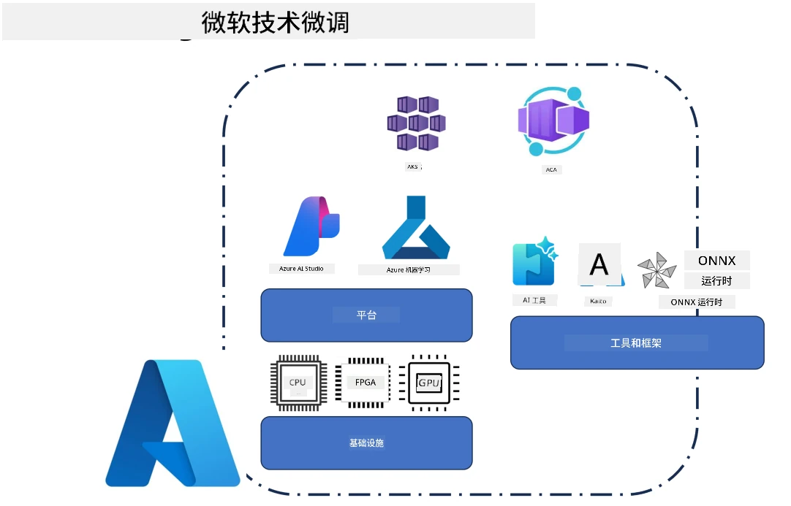
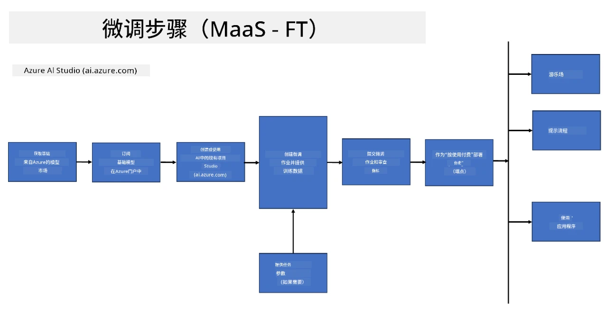
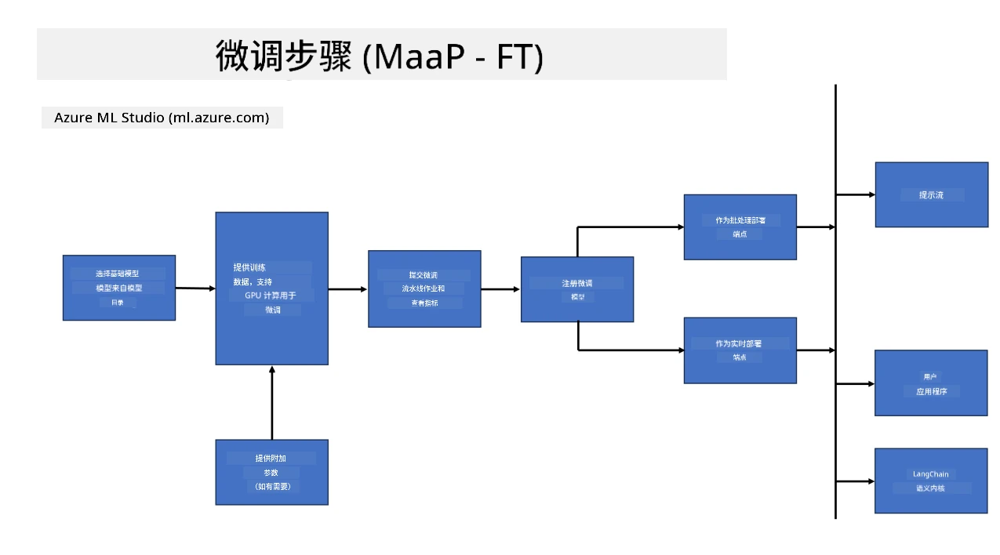
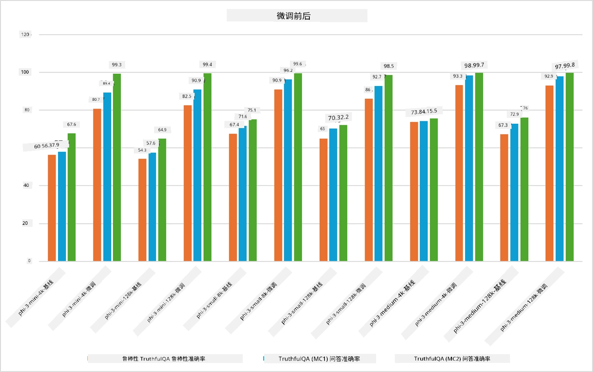

## 微调场景

本节概述了 Microsoft Foundry 和 Azure 环境中的微调场景，包括部署模型、基础架构层和常用的优化技术。

**平台**  
包括托管服务，如 Microsoft Foundry（前称 Microsoft Foundry）和 Azure 机器学习，提供模型管理、编排、实验跟踪和部署工作流。

**基础架构**  
微调需要可扩展的计算资源。在 Azure 环境中，这通常包括基于 GPU 的虚拟机和用于轻量级工作负载的 CPU 资源，以及用于数据集和检查点的可扩展存储。

**工具与框架**  
微调工作流通常依赖于 Hugging Face Transformers、DeepSpeed 和 PEFT（参数高效微调）等框架和优化库。

使用 Microsoft 技术的微调过程涵盖平台服务、计算基础架构和训练框架。通过了解这些组件如何协同工作，开发者可以高效地将基础模型适应到特定任务和生产场景中。

## 模型即服务

使用托管微调进行模型微调，无需创建和管理计算资源。

Phi-3、Phi-3.5 和 Phi-4 模型系列现已支持无服务器微调，开发者可快速轻松地为云端和边缘场景定制模型，无需安排计算资源。

## 模型即平台

用户自行管理计算资源以微调其模型。

[微调示例](https://github.com/Azure/azureml-examples/blob/main/sdk/python/foundation-models/system/finetune/chat-completion/chat-completion.ipynb)

## 微调技术对比

|场景|LoRA|QLoRA|PEFT|DeepSpeed|ZeRO|DoRA|
|---|---|---|---|---|---|---|
|将预训练大语言模型适应特定任务或领域|是|是|是|是|是|是|
|针对文本分类、命名实体识别和机器翻译等 NLP 任务的微调|是|是|是|是|是|是|
|针对问答任务的微调|是|是|是|是|是|是|
|用于生成类人聊天回复的微调|是|是|是|是|是|是|
|用于创作音乐、艺术或其他创意形式的微调|是|是|是|是|是|是|
|降低计算和资金成本|是|是|是|是|是|是|
|降低内存使用|是|是|是|是|是|是|
|使用更少参数实现高效微调|是|是|是|否|否|是|
|一种内存高效的数据并行形式，可访问所有 GPU 设备的总 GPU 内存|否|否|否|是|是|否|

> [!NOTE]
> LoRA、QLoRA、PEFT 和 DoRA 是参数高效的微调方法，而 DeepSpeed 和 ZeRO 则专注于分布式训练和内存优化。

## 微调性能示例

---

<!-- CO-OP TRANSLATOR DISCLAIMER START -->
**免责声明**：  
本文件由人工智能翻译服务 [Co-op Translator](https://github.com/Azure/co-op-translator) 翻译。尽管我们力求准确，但请注意自动翻译可能存在错误或不准确之处。原始语言版本的文件应被视为权威来源。对于重要信息，建议采用专业人工翻译。我们不对因使用此翻译而产生的任何误解或误释承担责任。
<!-- CO-OP TRANSLATOR DISCLAIMER END -->