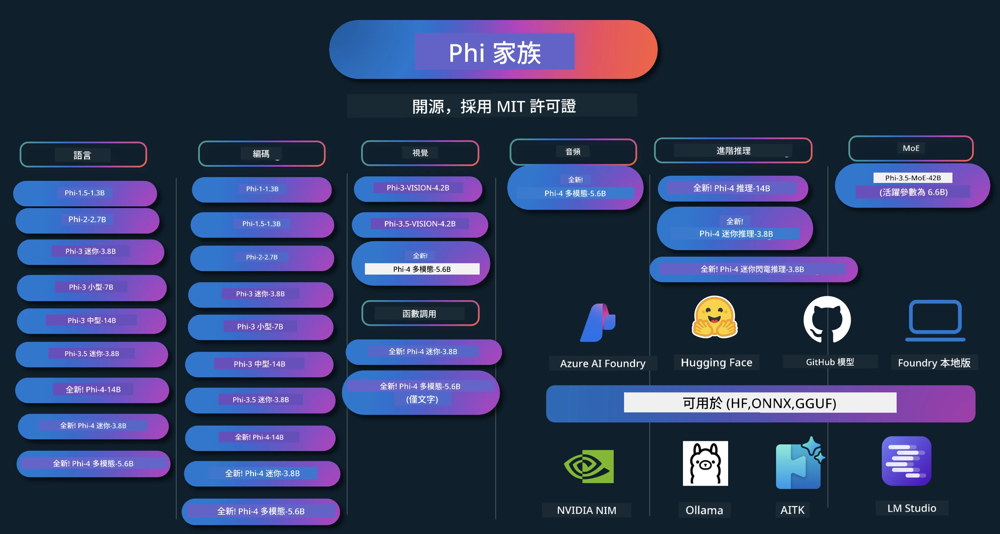

# Phi Cookbook：Microsoft Phi 模型的實作範例

[](https://codespaces.new/microsoft/phicookbook)
[](https://vscode.dev/redirect?url=vscode://ms-vscode-remote.remote-containers/cloneInVolume?url=https://github.com/microsoft/phicookbook)

[](https://GitHub.com/microsoft/phicookbook/graphs/contributors/?WT.mc_id=aiml-137032-kinfeylo)
[](https://GitHub.com/microsoft/phicookbook/issues/?WT.mc_id=aiml-137032-kinfeylo)
[](https://GitHub.com/microsoft/phicookbook/pulls/?WT.mc_id=aiml-137032-kinfeylo)
[](http://makeapullrequest.com?WT.mc_id=aiml-137032-kinfeylo)

[](https://GitHub.com/microsoft/phicookbook/watchers/?WT.mc_id=aiml-137032-kinfeylo)
[](https://GitHub.com/microsoft/phicookbook/network/?WT.mc_id=aiml-137032-kinfeylo)
[](https://GitHub.com/microsoft/phicookbook/stargazers/?WT.mc_id=aiml-137032-kinfeylo)

[](https://discord.com/invite/ByRwuEEgH4)

Phi 是由 Microsoft 開發的一系列開源 AI 模型。

Phi 目前是最強大且具成本效益的小型語言模型（SLM），在多語言、推理、文字／聊天生成、編碼、影像、音訊及其他場景中擁有非常優良的基準測試表現。

您可以將 Phi 部署到雲端或邊緣裝置，也可以輕鬆使用有限的運算能力來構建生成式 AI 應用。

請按照以下步驟開始使用這些資源：
1. **分叉此倉庫**：點擊 [](https://GitHub.com/microsoft/phicookbook/network/?WT.mc_id=aiml-137032-kinfeylo)
2. **克隆此倉庫**：`git clone https://github.com/microsoft/PhiCookBook.git`
3. [**加入 Microsoft AI Discord 社區，與專家及其他開發者交流**](https://discord.com/invite/ByRwuEEgH4?WT.mc_id=aiml-137032-kinfeylo)



### 🌐 多語言支援

#### 透過 GitHub Action 支援（自動且持續更新）

<!-- CO-OP TRANSLATOR LANGUAGES TABLE START -->
[阿拉伯語](../ar/README.md) | [孟加拉語](../bn/README.md) | [保加利亞語](../bg/README.md) | [緬甸語 (Myanmar)](../my/README.md) | [中文（簡體）](../zh-CN/README.md) | [中文（繁體，香港）](./README.md) | [中文（繁體，澳門）](../zh-MO/README.md) | [中文（繁體，台灣）](../zh-TW/README.md) | [克羅地亞語](../hr/README.md) | [捷克語](../cs/README.md) | [丹麥語](../da/README.md) | [荷蘭語](../nl/README.md) | [愛沙尼亞語](../et/README.md) | [芬蘭語](../fi/README.md) | [法語](../fr/README.md) | [德語](../de/README.md) | [希臘語](../el/README.md) | [希伯來語](../he/README.md) | [印地語](../hi/README.md) | [匈牙利語](../hu/README.md) | [印尼語](../id/README.md) | [義大利語](../it/README.md) | [日語](../ja/README.md) | [坎納達語](../kn/README.md) | [韓語](../ko/README.md) | [立陶宛語](../lt/README.md) | [馬來語](../ms/README.md) | [馬拉雅拉姆語](../ml/README.md) | [馬拉地語](../mr/README.md) | [尼泊爾語](../ne/README.md) | [奈及利亞派金語](../pcm/README.md) | [挪威語](../no/README.md) | [波斯語 (Farsi)](../fa/README.md) | [波蘭語](../pl/README.md) | [葡萄牙語（巴西）](../pt-BR/README.md) | [葡萄牙語（葡萄牙）](../pt-PT/README.md) | [旁遮普語 (Gurmukhi)](../pa/README.md) | [羅馬尼亞語](../ro/README.md) | [俄語](../ru/README.md) | [塞爾維亞語（西里爾字母）](../sr/README.md) | [斯洛伐克語](../sk/README.md) | [斯洛維尼亞語](../sl/README.md) | [西班牙語](../es/README.md) | [斯瓦希里語](../sw/README.md) | [瑞典語](../sv/README.md) | [他加祿語 (菲律賓語)](../tl/README.md) | [泰米爾語](../ta/README.md) | [泰盧固語](../te/README.md) | [泰語](../th/README.md) | [土耳其語](../tr/README.md) | [烏克蘭語](../uk/README.md) | [烏爾都語](../ur/README.md) | [越南語](../vi/README.md)

> **偏好在本地克隆？**
>
> 此倉庫包含 50 多種語言翻譯，顯著增加下載大小。若要不下載翻譯內容，請使用稀疏簽出：
>
> **Bash / macOS / Linux：**
> ```bash
> git clone --filter=blob:none --sparse https://github.com/microsoft/PhiCookBook.git
> cd PhiCookBook
> git sparse-checkout set --no-cone '/*' '!translations' '!translated_images'
> ```
>
> **CMD（Windows）：**
> ```cmd
> git clone --filter=blob:none --sparse https://github.com/microsoft/PhiCookBook.git
> cd PhiCookBook
> git sparse-checkout set --no-cone "/*" "!translations" "!translated_images"
> ```
>
> 這樣你將獲得完成課程所需的所有內容，下載速度也會快得多。
<!-- CO-OP TRANSLATOR LANGUAGES TABLE END -->

## 目錄

- 介紹
  - [歡迎加入 Phi 家族](./md/01.Introduction/01/01.PhiFamily.md)
  - [設定您的環境](./md/01.Introduction/01/01.EnvironmentSetup.md)
  - [理解關鍵技術](./md/01.Introduction/01/01.Understandingtech.md)
  - [Phi 模型的 AI 安全性](./md/01.Introduction/01/01.AISafety.md)
  - [Phi 硬體支援](./md/01.Introduction/01/01.Hardwaresupport.md)
  - [Phi 模型與各平台可用性](./md/01.Introduction/01/01.Edgeandcloud.md)
  - [使用 Guidance-ai 與 Phi](./md/01.Introduction/01/01.Guidance.md)
  - [GitHub Marketplace 模型](https://github.com/marketplace/models)
  - [Azure AI 模型目錄](https://ai.azure.com)

- 在不同環境推理 Phi
    -  [Hugging face](./md/01.Introduction/02/01.HF.md)
    -  [GitHub 模型](./md/01.Introduction/02/02.GitHubModel.md)
    -  [Azure AI Foundry 模型目錄](./md/01.Introduction/02/03.AzureAIFoundry.md)
    -  [Ollama](./md/01.Introduction/02/04.Ollama.md)
    -  [AI Toolkit VSCode (AITK)](./md/01.Introduction/02/05.AITK.md)
    -  [NVIDIA NIM](./md/01.Introduction/02/06.NVIDIA.md)
    -  [Foundry Local](./md/01.Introduction/02/07.FoundryLocal.md)

- Phi 家族推理
    - [iOS 上的 Phi 推理](./md/01.Introduction/03/iOS_Inference.md)
    - [Android 上的 Phi 推理](./md/01.Introduction/03/Android_Inference.md)
    - [Jetson 上的 Phi 推理](./md/01.Introduction/03/Jetson_Inference.md)
    - [AI PC 上的 Phi 推理](./md/01.Introduction/03/AIPC_Inference.md)
    - [使用 Apple MLX 框架的 Phi 推理](./md/01.Introduction/03/MLX_Inference.md)
    - [本地伺服器上的 Phi 推理](./md/01.Introduction/03/Local_Server_Inference.md)
    - [使用 AI Toolkit 在遠端伺服器推理 Phi](./md/01.Introduction/03/Remote_Interence.md)
    - [使用 Rust 進行 Phi 推理](./md/01.Introduction/03/Rust_Inference.md)
    - [本地 Vision Phi 推理](./md/01.Introduction/03/Vision_Inference.md)
    - [使用 Kaito AKS 及 Azure Containers 進行 Phi 推理（官方支援）](./md/01.Introduction/03/Kaito_Inference.md)
-  [Phi 家族量化](./md/01.Introduction/04/QuantifyingPhi.md)
    - [使用 llama.cpp 量化 Phi-3.5 / 4](./md/01.Introduction/04/UsingLlamacppQuantifyingPhi.md)
    - [使用 onnxruntime 生成式 AI 擴充套件量化 Phi-3.5 / 4](./md/01.Introduction/04/UsingORTGenAIQuantifyingPhi.md)
    - [使用 Intel OpenVINO 量化 Phi-3.5 / 4](./md/01.Introduction/04/UsingIntelOpenVINOQuantifyingPhi.md)
    - [使用 Apple MLX 框架量化 Phi-3.5 / 4](./md/01.Introduction/04/UsingAppleMLXQuantifyingPhi.md)

-  Phi 評估
    - [負責任 AI](./md/01.Introduction/05/ResponsibleAI.md)
    - [使用 Azure AI Foundry 進行評估](./md/01.Introduction/05/AIFoundry.md)
    - [使用 Promptflow 進行評估](./md/01.Introduction/05/Promptflow.md)
 
- RAG 與 Azure AI 搜索
    - [如何使用 Phi-4-mini 及 Phi-4-multimodal(RAG) 結合 Azure AI 搜索](https://github.com/microsoft/PhiCookBook/blob/main/code/06.E2E/E2E_Phi-4-RAG-Azure-AI-Search.ipynb)

- Phi 應用開發範例
  - 文字與聊天應用
    - Phi-4 範例 🆕
      - [📓] [使用 Phi-4-mini ONNX 模型聊天](./md/02.Application/01.TextAndChat/Phi4/ChatWithPhi4ONNX/README.md)
      - [使用 Phi-4 本地 ONNX 模型的 .NET 聊天](../../md/04.HOL/dotnet/src/LabsPhi4-Chat-01OnnxRuntime)
      - [使用 Phi-4 ONNX 的 .NET 控制台聊天應用（透過語義核心）](../../md/04.HOL/dotnet/src/LabsPhi4-Chat-02SK)
    - Phi-3 / 3.5 範例
      - [使用 Phi3、ONNX Runtime Web 及 WebGPU 在瀏覽器中本地聊天機器人](https://github.com/microsoft/onnxruntime-inference-examples/tree/main/js/chat)
      - [OpenVino 聊天](./md/02.Application/01.TextAndChat/Phi3/E2E_OpenVino_Chat.md)
      - [多模型 - 交互式 Phi-3-mini 與 OpenAI Whisper](./md/02.Application/01.TextAndChat/Phi3/E2E_Phi-3-mini_with_whisper.md)
      - [MLFlow - 建立包裝器並使用 Phi-3 搭配 MLFlow](./md//02.Application/01.TextAndChat/Phi3/E2E_Phi-3-MLflow.md)
      - [模型優化 - 如何使用 Olive 優化 Phi-3-mini 模型於 ONNX Runtime Web](https://github.com/microsoft/Olive/tree/main/examples/phi3)
      - [WinUI3 應用程式搭配 Phi-3 mini-4k-instruct-onnx](https://github.com/microsoft/Phi3-Chat-WinUI3-Sample/)
      -[WinUI3 多模型 AI 驅動筆記應用程式範例](https://github.com/microsoft/ai-powered-notes-winui3-sample)
      - [微調並整合自訂 Phi-3 模型與 Prompt flow](./md/02.Application/01.TextAndChat/Phi3/E2E_Phi-3-FineTuning_PromptFlow_Integration.md)
      - [在 Azure AI Foundry 中微調並整合自訂 Phi-3 模型與 Prompt flow](./md/02.Application/01.TextAndChat/Phi3/E2E_Phi-3-FineTuning_PromptFlow_Integration_AIFoundry.md)
      - [評估在 Azure AI Foundry 中微調過的 Phi-3 / Phi-3.5 模型，聚焦微軟負責任的 AI 原則](./md/02.Application/01.TextAndChat/Phi3/E2E_Phi-3-Evaluation_AIFoundry.md)
      - [📓] [Phi-3.5-mini-instruct 語言預測範例（中文／英文）](./md/02.Application/01.TextAndChat/Phi3/phi3-instruct-demo.ipynb)
      - [Phi-3.5-Instruct WebGPU RAG 聊天機械人](./md/02.Application/01.TextAndChat/Phi3/WebGPUWithPhi35Readme.md)
      - [使用 Windows GPU 搭配 Phi-3.5-Instruct ONNX 建立 Prompt flow 解決方案](./md/02.Application/01.TextAndChat/Phi3/UsingPromptFlowWithONNX.md)
      - [使用 Microsoft Phi-3.5 tflite 建立 Android 應用程式](./md/02.Application/01.TextAndChat/Phi3/UsingPhi35TFLiteCreateAndroidApp.md)
      - [Q&A .NET 範例，使用本地 ONNX Phi-3 模型及 Microsoft.ML.OnnxRuntime](../../md/04.HOL/dotnet/src/LabsPhi301)
      - [以 Semantic Kernel 與 Phi-3 建立的控制台聊天 .NET 應用程式](../../md/04.HOL/dotnet/src/LabsPhi302)

  - Azure AI 推理 SDK 程式碼範例 
    - Phi-4 範例 🆕
      - [📓] [使用 Phi-4-multimodal 產生專案程式碼](./md/02.Application/02.Code/Phi4/GenProjectCode/README.md)
    - Phi-3 / 3.5 範例
      - [使用 Microsoft Phi-3 家族建置您自己的 Visual Studio Code GitHub Copilot Chat](./md/02.Application/02.Code/Phi3/VSCodeExt/README.md)
      - [使用 GitHub 模型和 Phi-3.5 創建您自己的 Visual Studio Code 聊天輔助代理](/md/02.Application/02.Code/Phi3/CreateVSCodeChatAgentWithGitHubModels.md)

  - 進階推理範例
    - Phi-4 範例 🆕
      - [📓] [Phi-4-mini推理或 Phi-4推理範例](./md/02.Application/03.AdvancedReasoning/Phi4/AdvancedResoningPhi4mini/README.md)
      - [📓] [使用 Microsoft Olive 微調 Phi-4-mini推理](./md/02.Application/03.AdvancedReasoning/Phi4/AdvancedResoningPhi4mini/olive_ft_phi_4_reasoning_with_medicaldata.ipynb)
      - [📓] [使用 Apple MLX 微調 Phi-4-mini推理](./md/02.Application/03.AdvancedReasoning/Phi4/AdvancedResoningPhi4mini/mlx_ft_phi_4_reasoning_with_medicaldata.ipynb)
      - [📓] [使用 GitHub 模型的 Phi-4-mini推理](./md/02.Application/02.Code/Phi4r/github_models_inference.ipynb)
      - [📓] [使用 Azure AI Foundry 模型的 Phi-4-mini推理](./md/02.Application/02.Code/Phi4r/azure_models_inference.ipynb)
  - 展示
      - [在 Hugging Face Spaces 上託管的 Phi-4-mini 展示](https://huggingface.co/spaces/microsoft/phi-4-mini?WT.mc_id=aiml-137032-kinfeylo)
      - [在 Hugginge Face Spaces 上託管的 Phi-4-multimodal 展示](https://huggingface.co/spaces/microsoft/phi-4-multimodal?WT.mc_id=aiml-137032-kinfeylo)
  - 視覺範例
    - Phi-4 範例 🆕
      - [📓] [使用 Phi-4-multimodal 讀取影像和產生程式碼](./md/02.Application/04.Vision/Phi4/CreateFrontend/README.md) 
    - Phi-3 / 3.5 範例
      -  [📓][Phi-3-vision-影像文字轉文字](./md/02.Application/04.Vision/Phi3/E2E_Phi-3-vision-image-text-to-text-online-endpoint.ipynb)
      - [Phi-3-vision-ONNX](https://onnxruntime.ai/docs/genai/tutorials/phi3-v.html)
      - [📓][Phi-3-vision CLIP 嵌入](./md/02.Application/04.Vision/Phi3/E2E_Phi-3-vision-image-text-to-text-online-endpoint.ipynb)
      - [DEMO: Phi-3 回收](https://github.com/jennifermarsman/PhiRecycling/)
      - [Phi-3-vision - 視覺語言助理 - 搭配 Phi3-Vision 和 OpenVINO](https://docs.openvino.ai/nightly/notebooks/phi-3-vision-with-output.html)
      - [Phi-3 視覺 Nvidia NIM](./md/02.Application/04.Vision/Phi3/E2E_Nvidia_NIM_Vision.md)
      - [Phi-3 視覺 OpenVino](./md/02.Application/04.Vision/Phi3/E2E_OpenVino_Phi3Vision.md)
      - [📓][Phi-3.5 視覺多幀或多影像範例](./md/02.Application/04.Vision/Phi3/phi3-vision-demo.ipynb)
      - [Phi-3 視覺本地 ONNX 模型使用 Microsoft.ML.OnnxRuntime .NET](../../md/04.HOL/dotnet/src/LabsPhi303)
      - [基於選單的 Phi-3 視覺本地 ONNX 模型使用 Microsoft.ML.OnnxRuntime .NET](../../md/04.HOL/dotnet/src/LabsPhi304)

  - 數學範例
    -  Phi-4-Mini-Flash-Reasoning-Instruct 範例 🆕 [數學示範使用 Phi-4-Mini-Flash-Reasoning-Instruct](./md/02.Application/09.Math/MathDemo.ipynb)

  - 音訊範例
    - Phi-4 範例 🆕
      - [📓] [使用 Phi-4-multimodal 擷取音訊抄本](./md/02.Application/05.Audio/Phi4/Transciption/README.md)
      - [📓] [Phi-4-multimodal 音訊範例](./md/02.Application/05.Audio/Phi4/Siri/demo.ipynb)
      - [📓] [Phi-4-multimodal 語音翻譯範例](./md/02.Application/05.Audio/Phi4/Translate/demo.ipynb)
      - [.NET 控制台應用程式使用 Phi-4-multimodal 分析音訊檔並產生抄本](../../md/04.HOL/dotnet/src/LabsPhi4-MultiModal-02Audio)

  - MOE 範例
    - Phi-3 / 3.5 範例
      - [📓] [Phi-3.5 專家組合模型 (MoEs) 社群媒體範例](./md/02.Application/06.MoE/Phi3/phi3_moe_demo.ipynb)
      - [📓] [使用 NVIDIA NIM Phi-3 MOE、Azure AI Search 和 LlamaIndex 建立檢索增強生成 (RAG) 管線](./md/02.Application/06.MoE/Phi3/azure-ai-search-nvidia-rag.ipynb)
      - 
  - 函數呼叫範例
    - Phi-4 範例 🆕
      -  [📓] [使用 Phi-4-mini 的函數呼叫](./md/02.Application/07.FunctionCalling/Phi4/FunctionCallingBasic/README.md)
      -  [📓] [使用函數呼叫創建多代理與 Phi-4-mini](./md/02.Application/07.FunctionCalling/Phi4/Multiagents/Phi_4_mini_multiagent.ipynb)
      -  [📓] [與 Ollama 使用函數呼叫](./md/02.Application/07.FunctionCalling/Phi4/Ollama/ollama_functioncalling.ipynb)
      -  [📓] [使用函數呼叫與 ONNX](./md/02.Application/07.FunctionCalling/Phi4/ONNX/onnx_parallel_functioncalling.ipynb)
  - 多模態混合範例
    - Phi-4 範例 🆕
      -  [📓] [作為科技記者使用 Phi-4-multimodal](./md/02.Application/08.Multimodel/Phi4/TechJournalist/phi_4_mm_audio_text_publish_news.ipynb)
      - [.NET 控制台應用程式使用 Phi-4-multimodal 分析影像](../../md/04.HOL/dotnet/src/LabsPhi4-MultiModal-01Images)

- Phi 微調範例
  - [微調情境](./md/03.FineTuning/FineTuning_Scenarios.md)
  - [微調 vs RAG](./md/03.FineTuning/FineTuning_vs_RAG.md)
  - [微調讓 Phi-3 成為產業專家](./md/03.FineTuning/LetPhi3gotoIndustriy.md)
  - [使用 VS Code AI 工具包微調 Phi-3](./md/03.FineTuning/Finetuning_VSCodeaitoolkit.md)
  - [使用 Azure 機器學習服務微調 Phi-3](./md/03.FineTuning/Introduce_AzureML.md)
  - [使用 Lora 微調 Phi-3](./md/03.FineTuning/FineTuning_Lora.md)
  - [使用 QLora 微調 Phi-3](./md/03.FineTuning/FineTuning_Qlora.md)
  - [使用 Azure AI Foundry 微調 Phi-3](./md/03.FineTuning/FineTuning_AIFoundry.md)
  - [使用 Azure ML CLI/SDK 微調 Phi-3](./md/03.FineTuning/FineTuning_MLSDK.md)
  - [使用 Microsoft Olive 微調](./md/03.FineTuning/FineTuning_MicrosoftOlive.md)
  - [使用 Microsoft Olive 實作實驗室](./md/03.FineTuning/olive-lab/readme.md)
  - [使用 Weights and Bias 微調 Phi-3-vision](./md/03.FineTuning/FineTuning_Phi-3-visionWandB.md)
  - [使用 Apple MLX 框架微調 Phi-3](./md/03.FineTuning/FineTuning_MLX.md)
  - [微調 Phi-3-vision（官方支援）](./md/03.FineTuning/FineTuning_Vision.md)
  - [使用 Kaito AKS、Azure 容器微調 Phi-3（官方支援）](./md/03.FineTuning/FineTuning_Kaito.md)
  - [微調 Phi-3 與 3.5 Vision](https://github.com/2U1/Phi3-Vision-Finetune)

- 實作實驗室
  - [探索前沿模型：LLM、SLM、本地開發及更多](https://github.com/microsoft/aitour-exploring-cutting-edge-models)
  - [釋放 NLP 潛力：使用 Microsoft Olive 進行微調](https://github.com/azure/Ignite_FineTuning_workshop)
- 學術研究論文與發表
  - [Textbooks Are All You Need II: phi-1.5 技術報告](https://arxiv.org/abs/2309.05463)
  - [Phi-3 技術報告：在你手機本地運行的高效能語言模型](https://arxiv.org/abs/2404.14219)
  - [Phi-4 技術報告](https://arxiv.org/abs/2412.08905)
  - [Phi-4-Mini 技術報告：透過 LoRA 混合實現緊湊且強大的多模態語言模型](https://arxiv.org/abs/2503.01743)
  - [優化車載功能調用的小型語言模型](https://arxiv.org/abs/2501.02342)
  - [(WhyPHI) PHI-3 多項選擇題微調：方法論、結果與挑戰](https://arxiv.org/abs/2501.01588)
  - [Phi-4 推理技術報告](https://www.microsoft.com/en-us/research/wp-content/uploads/2025/04/phi_4_reasoning.pdf)
  - [Phi-4-mini 推理技術報告](https://huggingface.co/microsoft/Phi-4-mini-reasoning/blob/main/Phi-4-Mini-Reasoning.pdf)

## 使用 Phi 模型

### Azure AI Foundry 上的 Phi

你可以學習如何使用 Microsoft Phi 以及如何在不同硬件設備中構建端到端解決方案。要親自體驗 Phi，請從試玩模型並使用 [Azure AI Foundry Azure AI Model Catalog](https://aka.ms/phi3-azure-ai) 根據你的場景自訂 Phi 開始。你可以在 Getting Started with [Azure AI Foundry](/md/02.QuickStart/AzureAIFoundry_QuickStart.md) 獲得更多資訊。

**試玩場**
每個模型都有專屬的試玩場來測試模型，請訪問 [Azure AI Playground](https://aka.ms/try-phi3)。

### GitHub 模型上的 Phi

你可以學習如何使用 Microsoft Phi 以及如何在不同硬件設備中構建端到端解決方案。要親自體驗 Phi，請從試玩模型並使用 [GitHub Model Catalog](https://github.com/marketplace/models?WT.mc_id=aiml-137032-kinfeylo) 根據你的場景自訂 Phi 開始。你可以在 Getting Started with [GitHub Model Catalog](/md/02.QuickStart/GitHubModel_QuickStart.md) 獲得更多資訊。

**試玩場**
每個模型都有專用的 [試玩場來測試模型](/md/02.QuickStart/GitHubModel_QuickStart.md)。

### Hugging Face 上的 Phi

你也可以在 [Hugging Face](https://huggingface.co/microsoft) 找到該模型。

**試玩場**
[Hugging Chat 試玩場](https://huggingface.co/chat/models/microsoft/Phi-3-mini-4k-instruct)

## 🎒 其他課程

我們團隊還提供其他課程！敬請查閱：

<!-- CO-OP TRANSLATOR OTHER COURSES START -->
### LangChain
[](https://aka.ms/langchain4j-for-beginners)
[](https://aka.ms/langchainjs-for-beginners?WT.mc_id=m365-94501-dwahlin)
[](https://github.com/microsoft/langchain-for-beginners?WT.mc_id=m365-94501-dwahlin)
---

### Azure / Edge / MCP / Agents
[](https://github.com/microsoft/AZD-for-beginners?WT.mc_id=academic-105485-koreyst)
[](https://github.com/microsoft/edgeai-for-beginners?WT.mc_id=academic-105485-koreyst)
[](https://github.com/microsoft/mcp-for-beginners?WT.mc_id=academic-105485-koreyst)
[](https://github.com/microsoft/ai-agents-for-beginners?WT.mc_id=academic-105485-koreyst)

---
 
### 生成式 AI 系列
[](https://github.com/microsoft/generative-ai-for-beginners?WT.mc_id=academic-105485-koreyst)
[-9333EA?style=for-the-badge&labelColor=E5E7EB&color=9333EA)](https://github.com/microsoft/Generative-AI-for-beginners-dotnet?WT.mc_id=academic-105485-koreyst)
[-C084FC?style=for-the-badge&labelColor=E5E7EB&color=C084FC)](https://github.com/microsoft/generative-ai-for-beginners-java?WT.mc_id=academic-105485-koreyst)
[-E879F9?style=for-the-badge&labelColor=E5E7EB&color=E879F9)](https://github.com/microsoft/generative-ai-with-javascript?WT.mc_id=academic-105485-koreyst)

---
 
### 核心學習
[](https://aka.ms/ml-beginners?WT.mc_id=academic-105485-koreyst)
[](https://aka.ms/datascience-beginners?WT.mc_id=academic-105485-koreyst)
[](https://aka.ms/ai-beginners?WT.mc_id=academic-105485-koreyst)
[](https://github.com/microsoft/Security-101?WT.mc_id=academic-96948-sayoung)
[](https://aka.ms/webdev-beginners?WT.mc_id=academic-105485-koreyst)
[](https://aka.ms/iot-beginners?WT.mc_id=academic-105485-koreyst)
[](https://github.com/microsoft/xr-development-for-beginners?WT.mc_id=academic-105485-koreyst)

---
 
### Copilot 系列
[](https://aka.ms/GitHubCopilotAI?WT.mc_id=academic-105485-koreyst)
[](https://github.com/microsoft/mastering-github-copilot-for-dotnet-csharp-developers?WT.mc_id=academic-105485-koreyst)
[](https://github.com/microsoft/CopilotAdventures?WT.mc_id=academic-105485-koreyst)
<!-- CO-OP TRANSLATOR OTHER COURSES END -->

## 負責任的 AI

Microsoft 承諾協助我們的客戶負責任地使用我們的 AI 產品，分享我們的學習成果，並透過透明化說明與影響評估等工具建立基於信任的夥伴關係。許多相關資源可在 [https://aka.ms/RAI](https://aka.ms/RAI) 找到。  
Microsoft 的負責任 AI 方法基於公平性、可靠與安全、隱私與安全性、包容性、透明度以及問責制的 AI 原則。

大規模自然語言、圖像與語音模型（如本範例中使用的模型）可能會出現不公平、不可靠或冒犯性的行為，進而造成傷害。請參閱 [Azure OpenAI 服務透明化說明](https://learn.microsoft.com/legal/cognitive-services/openai/transparency-note?tabs=text) 了解相關風險與限制。

建議透過在架構中加入安全系統來減輕這些風險，該系統可以偵測並防止有害行為。[Azure AI 內容安全](https://learn.microsoft.com/azure/ai-services/content-safety/overview) 提供獨立的防護層，能偵測應用程式與服務中使用者生成及 AI 生成的有害內容。Azure AI 內容安全包括文本和圖像 API，可協助偵測有害內容。在 Azure AI Foundry 中，內容安全服務讓你可以檢視、探索並試用檢測不同模態有害內容的範例程式碼。以下的 [快速入門文件](https://learn.microsoft.com/azure/ai-services/content-safety/quickstart-text?tabs=visual-studio%2Clinux&pivots=programming-language-rest) 指導你如何向該服務發出請求。
另一個需要考慮的方面是整體應用程式的效能。對於多模態及多模型應用程式，我們將效能視為系統能如您及您的使用者所期待地運作，包括不產生有害輸出。評估整體應用程式的效能非常重要，您可以使用[效能與品質以及風險與安全評估器](https://learn.microsoft.com/azure/ai-studio/concepts/evaluation-metrics-built-in)。您也可以使用[自訂評估器](https://learn.microsoft.com/azure/ai-studio/how-to/develop/evaluate-sdk#custom-evaluators)來建立及評估。

您可以在開發環境中使用[Azure AI 評估 SDK](https://microsoft.github.io/promptflow/index.html)來評估您的 AI 應用程式。給定測試資料集或目標，您的生成式 AI 產出將以內建評估器或您選擇的自訂評估器進行量化測量。若要開始使用 azure ai 評估 sdk 評估您的系統，您可以參考[快速入門指南](https://learn.microsoft.com/azure/ai-studio/how-to/develop/flow-evaluate-sdk)。執行評估後，您可以在[Azure AI Foundry 中視覺化結果](https://learn.microsoft.com/azure/ai-studio/how-to/evaluate-flow-results)。

## 商標

此專案可能包含專案、產品或服務的商標或標誌。經授權使用 Microsoft 商標或標誌時，必須遵守並遵循[Microsoft 商標及品牌指南](https://www.microsoft.com/legal/intellectualproperty/trademarks/usage/general)。  
在本專案的修改版本中使用 Microsoft 商標或標誌，不得造成混淆或暗示 Microsoft 贊助。任何第三方商標或標誌的使用，都須遵守該第三方的政策。

## 尋求協助

如果在構建 AI 應用程式過程中遇到困難或有任何疑問，歡迎加入：

[](https://aka.ms/foundry/discord)

如果您在構建過程中有產品回饋或錯誤，請造訪：

[](https://aka.ms/foundry/forum)

---

<!-- CO-OP TRANSLATOR DISCLAIMER START -->
**免責聲明**：  
本文件乃使用 AI 翻譯服務 [Co-op Translator](https://github.com/Azure/co-op-translator) 進行翻譯。雖然我們力求準確，但請注意，自動翻譯可能包含錯誤或不準確之處。原始母語文件應被視為權威資料來源。對於重要資訊，建議採用專業人工翻譯。我們不對因使用本翻譯所引起的任何誤解或誤讀承擔責任。
<!-- CO-OP TRANSLATOR DISCLAIMER END -->