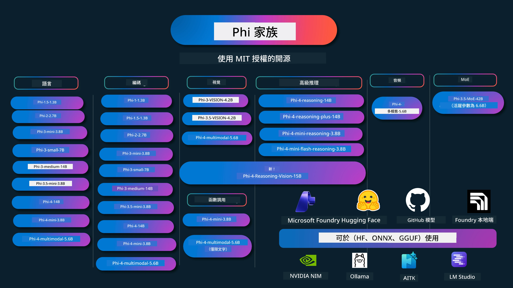

# Phi 菜譜：使用微軟 Phi 模型的實作範例

[](https://codespaces.new/microsoft/phicookbook)
[](https://vscode.dev/redirect?url=vscode://ms-vscode-remote.remote-containers/cloneInVolume?url=https://github.com/microsoft/phicookbook)

[](https://GitHub.com/microsoft/phicookbook/graphs/contributors/?WT.mc_id=aiml-137032-kinfeylo)
[](https://GitHub.com/microsoft/phicookbook/issues/?WT.mc_id=aiml-137032-kinfeylo)
[](https://GitHub.com/microsoft/phicookbook/pulls/?WT.mc_id=aiml-137032-kinfeylo)
[](http://makeapullrequest.com?WT.mc_id=aiml-137032-kinfeylo)

[](https://GitHub.com/microsoft/phicookbook/watchers/?WT.mc_id=aiml-137032-kinfeylo)
[](https://GitHub.com/microsoft/phicookbook/network/?WT.mc_id=aiml-137032-kinfeylo)
[](https://GitHub.com/microsoft/phicookbook/stargazers/?WT.mc_id=aiml-137032-kinfeylo)

[](https://discord.com/invite/ByRwuEEgH4)

Phi 是由微軟開發的一系列開源 AI 模型。

Phi 目前是最強大且具成本效益的小型語言模型（SLM），在多語言、推理、文本／聊天生成、程式碼、影像、音訊及其他場景中表現卓越。

您可以將 Phi 部署到雲端或邊緣裝置，並且能夠輕鬆以有限的運算能力構建生成式 AI 應用程式。

按照以下步驟開始使用這些資源：
1. **Fork 倉庫**：點擊 [](https://GitHub.com/microsoft/phicookbook/network/?WT.mc_id=aiml-137032-kinfeylo)
2. <strong>複製倉庫</strong>：`git clone https://github.com/microsoft/PhiCookBook.git`
3. [**加入 Microsoft AI Discord 社群，與專家和其他開發者交流**](https://discord.com/invite/ByRwuEEgH4?WT.mc_id=aiml-137032-kinfeylo)



### 🌐 多語言支援

#### 透過 GitHub Action 支援（自動且持續更新）

<!-- CO-OP TRANSLATOR LANGUAGES TABLE START -->
[阿拉伯語](../ar/README.md) | [孟加拉語](../bn/README.md) | [保加利亞語](../bg/README.md) | [緬甸語](../my/README.md) | [中文（簡體）](../zh-CN/README.md) | [中文（繁體，香港）](./README.md) | [中文（繁體，澳門）](../zh-MO/README.md) | [中文（繁體，台灣）](../zh-TW/README.md) | [克羅埃西亞語](../hr/README.md) | [捷克語](../cs/README.md) | [丹麥語](../da/README.md) | [荷蘭語](../nl/README.md) | [愛沙尼亞語](../et/README.md) | [芬蘭語](../fi/README.md) | [法語](../fr/README.md) | [德語](../de/README.md) | [希臘語](../el/README.md) | [希伯來語](../he/README.md) | [印地語](../hi/README.md) | [匈牙利語](../hu/README.md) | [印尼語](../id/README.md) | [義大利語](../it/README.md) | [日語](../ja/README.md) | [卡納達語](../kn/README.md) | [高棉語](../km/README.md) | [韓語](../ko/README.md) | [立陶宛語](../lt/README.md) | [馬來語](../ms/README.md) | [馬拉雅拉姆語](../ml/README.md) | [馬拉地語](../mr/README.md) | [尼泊爾語](../ne/README.md) | [奈及利亞皮欽語](../pcm/README.md) | [挪威語](../no/README.md) | [波斯語（法爾西語）](../fa/README.md) | [波蘭語](../pl/README.md) | [葡萄牙語（巴西）](../pt-BR/README.md) | [葡萄牙語（葡萄牙）](../pt-PT/README.md) | [旁遮普語（古爾穆奇文）](../pa/README.md) | [羅馬尼亞語](../ro/README.md) | [俄語](../ru/README.md) | [塞爾維亞語（西里爾字母）](../sr/README.md) | [斯洛伐克語](../sk/README.md) | [斯洛維尼亞語](../sl/README.md) | [西班牙語](../es/README.md) | [史瓦希里語](../sw/README.md) | [瑞典語](../sv/README.md) | [他加祿語（菲律賓語）](../tl/README.md) | [泰米爾語](../ta/README.md) | [泰盧固語](../te/README.md) | [泰語](../th/README.md) | [土耳其語](../tr/README.md) | [烏克蘭語](../uk/README.md) | [烏爾都語](../ur/README.md) | [越南語](../vi/README.md)

> **偏好本地複製？**
>
> 此倉庫包含超過 50 種語言翻譯，導致下載大小大幅增加。若想克隆時不包含翻譯，請使用稀疏檢出（sparse checkout）：
>
> **Bash / macOS / Linux：**
> ```bash
> git clone --filter=blob:none --sparse https://github.com/microsoft/PhiCookBook.git
> cd PhiCookBook
> git sparse-checkout set --no-cone '/*' '!translations' '!translated_images'
> ```
>
> **CMD (Windows)：**
> ```cmd
> git clone --filter=blob:none --sparse https://github.com/microsoft/PhiCookBook.git
> cd PhiCookBook
> git sparse-checkout set --no-cone "/*" "!translations" "!translated_images"
> ```
>
> 這樣能讓你以更快的速度下載所需全部資源，完成課程。
<!-- CO-OP TRANSLATOR LANGUAGES TABLE END -->

## 目錄

- 簡介
  - [歡迎加入 Phi 家族](./md/01.Introduction/01/01.PhiFamily.md)
  - [環境設定](./md/01.Introduction/01/01.EnvironmentSetup.md)
  - [關鍵技術認識](./md/01.Introduction/01/01.Understandingtech.md)
  - [Phi 模型的 AI 安全](./md/01.Introduction/01/01.AISafety.md)
  - [Phi 硬體支援](./md/01.Introduction/01/01.Hardwaresupport.md)
  - [Phi 模型及跨平台可用性](./md/01.Introduction/01/01.Edgeandcloud.md)
  - [使用 Guidance-ai 與 Phi](./md/01.Introduction/01/01.Guidance.md)
  - [GitHub 市集模型](https://github.com/marketplace/models)
  - [Azure AI 模型目錄](https://ai.azure.com)

- 不同環境下的 Phi 推論
    -  [Hugging Face](./md/01.Introduction/02/01.HF.md)
    -  [GitHub 模型](./md/01.Introduction/02/02.GitHubModel.md)
    -  [Microsoft Foundry 模型目錄](./md/01.Introduction/02/03.AzureAIFoundry.md)
    -  [Ollama](./md/01.Introduction/02/04.Ollama.md)
    -  [AI 工具包 VSCode (AITK)](./md/01.Introduction/02/05.AITK.md)
    -  [NVIDIA NIM](./md/01.Introduction/02/06.NVIDIA.md)
    -  [Foundry Local](./md/01.Introduction/02/07.FoundryLocal.md)

- Phi Family 推論
    - [iOS 上的 Phi 推論](./md/01.Introduction/03/iOS_Inference.md)
    - [Android 上的 Phi 推論](./md/01.Introduction/03/Android_Inference.md)
    - [Jetson 上的 Phi 推論](./md/01.Introduction/03/Jetson_Inference.md)
    - [AI PC 上的 Phi 推論](./md/01.Introduction/03/AIPC_Inference.md)
    - [使用 Apple MLX 框架的 Phi 推論](./md/01.Introduction/03/MLX_Inference.md)
    - [本地伺服器上的 Phi 推論](./md/01.Introduction/03/Local_Server_Inference.md)
    - [使用 AI 工具包在遠端伺服器進行 Phi 推論](./md/01.Introduction/03/Remote_Interence.md)
    - [使用 Rust 的 Phi 推論](./md/01.Introduction/03/Rust_Inference.md)
    - [本地的 Phi--視覺推論](./md/01.Introduction/03/Vision_Inference.md)
    - [使用 Kaito AKS，Azure 容器（官方支援）的 Phi 推論](./md/01.Introduction/03/Kaito_Inference.md)
-  [Phi Family 量化](./md/01.Introduction/04/QuantifyingPhi.md)
    - [使用 llama.cpp 量化 Phi-3.5 / 4](./md/01.Introduction/04/UsingLlamacppQuantifyingPhi.md)
    - [使用 onnxruntime 生成式 AI 擴充量化 Phi-3.5 / 4](./md/01.Introduction/04/UsingORTGenAIQuantifyingPhi.md)
    - [使用 Intel OpenVINO 量化 Phi-3.5 / 4](./md/01.Introduction/04/UsingIntelOpenVINOQuantifyingPhi.md)
    - [使用 Apple MLX 框架量化 Phi-3.5 / 4](./md/01.Introduction/04/UsingAppleMLXQuantifyingPhi.md)

- Phi 評估
    - [負責任的 AI](./md/01.Introduction/05/ResponsibleAI.md)
    - [Microsoft Foundry 評估](./md/01.Introduction/05/AIFoundry.md)
    - [使用 Promptflow 進行評估](./md/01.Introduction/05/Promptflow.md)
 
- 與 Azure AI 搜尋的 RAG
    - [如何使用 Phi-4-mini 和 Phi-4-multimodal (RAG) 搭配 Azure AI 搜尋](https://github.com/microsoft/PhiCookBook/blob/main/code/06.E2E/E2E_Phi-4-RAG-Azure-AI-Search.ipynb)
    - [零雲端本地混合 RAG，使用 SQLite FTS5 與 phi-4-mini](https://github.com/microsoft/PhiCookBook/blob/main/code/06.E2E/E2E_Phi-4-mini_Local_Hybrid_RAG_SQLite_FTS5.ipynb)

- Phi 應用程式開發範例
  - 文本與聊天應用
    - Phi-4 範例
      - [📓] [與 Phi-4-mini ONNX 模型聊天](./md/02.Application/01.TextAndChat/Phi4/ChatWithPhi4ONNX/README.md)
      - [使用本地 Phi-4 ONNX 模型聊天（.NET）](../../md/04.HOL/dotnet/src/LabsPhi4-Chat-01OnnxRuntime)
      - [使用 Sementic Kernel 的 Phi-4 ONNX .NET 控制台應用](../../md/04.HOL/dotnet/src/LabsPhi4-Chat-02SK)

    - Phi-3 / 3.5 範例
      - [使用 Phi3、ONNX Runtime Web 與 WebGPU 於瀏覽器本地聊天機械人](https://github.com/microsoft/onnxruntime-inference-examples/tree/main/js/chat)
      - [OpenVino 聊天](./md/02.Application/01.TextAndChat/Phi3/E2E_OpenVino_Chat.md)
      - [多模型 - 互動式 Phi-3-mini 與 OpenAI Whisper](./md/02.Application/01.TextAndChat/Phi3/E2E_Phi-3-mini_with_whisper.md)
      - [MLFlow - 建立包裝器並使用 Phi-3 與 MLFlow](./md//02.Application/01.TextAndChat/Phi3/E2E_Phi-3-MLflow.md)
      - [模型優化 - 如何使用 Olive 優化 ONNX Runtime Web 的 Phi-3-min 模型](https://github.com/microsoft/Olive/tree/main/examples/phi3)
      - [WinUI3 應用程式示範，使用 Phi-3 mini-4k-instruct-onnx](https://github.com/microsoft/Phi3-Chat-WinUI3-Sample/)
      -[WinUI3 多模型 AI 助力筆記應用示範](https://github.com/microsoft/ai-powered-notes-winui3-sample)
      - [微調及集成自訂 Phi-3 模型與 Prompt flow](./md/02.Application/01.TextAndChat/Phi3/E2E_Phi-3-FineTuning_PromptFlow_Integration.md)
      - [在 Microsoft Foundry 使用 Prompt flow 微調及集成自訂 Phi-3 模型](./md/02.Application/01.TextAndChat/Phi3/E2E_Phi-3-FineTuning_PromptFlow_Integration_AIFoundry.md)
      - [於 Microsoft Foundry 評估已微調的 Phi-3 / Phi-3.5 模型，聚焦於微軟責任 AI 原則](./md/02.Application/01.TextAndChat/Phi3/E2E_Phi-3-Evaluation_AIFoundry.md)
      - [📓] [Phi-3.5-mini-instruct 語言預測範例（中文/英文）](./md/02.Application/01.TextAndChat/Phi3/phi3-instruct-demo.ipynb)
      - [Phi-3.5-Instruct WebGPU RAG 聊天機械人](./md/02.Application/01.TextAndChat/Phi3/WebGPUWithPhi35Readme.md)
      - [使用 Windows GPU 建立 Prompt flow 解決方案，搭配 Phi-3.5-Instruct ONNX](./md/02.Application/01.TextAndChat/Phi3/UsingPromptFlowWithONNX.md)
      - [使用微軟 Phi-3.5 tflite 建立 Android 應用程式](./md/02.Application/01.TextAndChat/Phi3/UsingPhi35TFLiteCreateAndroidApp.md)
      - [使用 Microsoft.ML.OnnxRuntime 利用本地 ONNX Phi-3 模型的問答 .NET 範例](../../md/04.HOL/dotnet/src/LabsPhi301)
      - [結合 Semantic Kernel 與 Phi-3 的控制臺聊天 .NET 應用程式](../../md/04.HOL/dotnet/src/LabsPhi302)

  - Azure AI 推理 SDK 程式碼範例 
    - Phi-4 範例 
      - [📓] [使用 Phi-4-multimodal 生成專案程式碼](./md/02.Application/02.Code/Phi4/GenProjectCode/README.md)
    - Phi-3 / 3.5 範例
      - [使用 Microsoft Phi-3 系列打造您自己的 Visual Studio Code GitHub Copilot 聊天助理](./md/02.Application/02.Code/Phi3/VSCodeExt/README.md)
      - [利用 GitHub 模型及 Phi-3.5 建立您自己的 Visual Studio Code 聊天助理代理人](/md/02.Application/02.Code/Phi3/CreateVSCodeChatAgentWithGitHubModels.md)

  - 進階推理範例
    - Phi-4 範例 
      - [📓] [Phi-4-mini-reasoning 或 Phi-4-reasoning 範例](./md/02.Application/03.AdvancedReasoning/Phi4/AdvancedResoningPhi4mini/README.md)
      - [📓] [使用 Microsoft Olive 微調 Phi-4-mini-reasoning](./md/02.Application/03.AdvancedReasoning/Phi4/AdvancedResoningPhi4mini/olive_ft_phi_4_reasoning_with_medicaldata.ipynb)
      - [📓] [使用 Apple MLX 微調 Phi-4-mini-reasoning](./md/02.Application/03.AdvancedReasoning/Phi4/AdvancedResoningPhi4mini/mlx_ft_phi_4_reasoning_with_medicaldata.ipynb)
      - [📓] [使用 GitHub 模型的 Phi-4-mini-reasoning](./md/02.Application/02.Code/Phi4r/github_models_inference.ipynb)
      - [📓] [使用 Microsoft Foundry 模型的 Phi-4-mini-reasoning](./md/02.Application/02.Code/Phi4r/azure_models_inference.ipynb)
  - 示範
      - [Phi-4-mini 示範，托管於 Hugging Face Spaces](https://huggingface.co/spaces/microsoft/phi-4-mini?WT.mc_id=aiml-137032-kinfeylo)
      - [Phi-4-multimodal 示範，托管於 Hugging Face Spaces](https://huggingface.co/spaces/microsoft/phi-4-multimodal?WT.mc_id=aiml-137032-kinfeylo)
  - 視覺範例
    - Phi-4 範例 
      - [📓] [使用 Phi-4-multimodal 讀取圖片並生成程式碼](./md/02.Application/04.Vision/Phi4/CreateFrontend/README.md) 
    - Phi-3 / 3.5 範例
      -  [📓][Phi-3-vision-圖片文字到文字](./md/02.Application/04.Vision/Phi3/E2E_Phi-3-vision-image-text-to-text-online-endpoint.ipynb)
      - [Phi-3-vision-ONNX](https://onnxruntime.ai/docs/genai/tutorials/phi3-v.html)
      - [📓][Phi-3-vision CLIP 嵌入](./md/02.Application/04.Vision/Phi3/E2E_Phi-3-vision-image-text-to-text-online-endpoint.ipynb)
      - [展示：Phi-3 回收](https://github.com/jennifermarsman/PhiRecycling/)
      - [Phi-3-vision - 視覺語言助理 - 使用 Phi3-Vision 與 OpenVINO](https://docs.openvino.ai/nightly/notebooks/phi-3-vision-with-output.html)
      - [Phi-3 Vision Nvidia NIM](./md/02.Application/04.Vision/Phi3/E2E_Nvidia_NIM_Vision.md)
      - [Phi-3 Vision OpenVino](./md/02.Application/04.Vision/Phi3/E2E_OpenVino_Phi3Vision.md)
      - [📓][Phi-3.5 Vision 多幀或多圖像範例](./md/02.Application/04.Vision/Phi3/phi3-vision-demo.ipynb)
      - [使用 Microsoft.ML.OnnxRuntime .NET 的本地 Phi-3 Vision ONNX 模型](../../md/04.HOL/dotnet/src/LabsPhi303)
      - [基於選單的本地 Phi-3 Vision ONNX 模型，使用 Microsoft.ML.OnnxRuntime .NET](../../md/04.HOL/dotnet/src/LabsPhi304)

  - 推理-視覺範例
    - Phi-4-Reasoning-Vision-15B 
      - [📓] [使用 Phi-4-Reasoning-Vision-15B 偵測闖紅燈行人](./md/02.Application/10.ReasoningVision/Phi_4_reasoning_vision_15b_Jaywalking.ipynb)
      - [📓] [使用 Phi-4-Reasoning-Vision-15B 解數學題](./md/02.Application/10.ReasoningVision/Phi_4_reasoning_vision_15b_Math.ipynb)
      - [📓] [使用 Phi-4-Reasoning-Vision-15B 偵測 UI](./md/02.Application/10.ReasoningVision/Phi_4_reasoning_vision_15b_ui.ipynb)

  - 數學範例
    -  Phi-4-Mini-Flash-Reasoning-Instruct 範例  [使用 Phi-4-Mini-Flash-Reasoning-Instruct 的數學示範](./md/02.Application/09.Math/MathDemo.ipynb)

  - 音訊範例
    - Phi-4 範例 
      - [📓] [使用 Phi-4-multimodal 擷取音訊逐字稿](./md/02.Application/05.Audio/Phi4/Transciption/README.md)
      - [📓] [Phi-4-multimodal 音訊示範](./md/02.Application/05.Audio/Phi4/Siri/demo.ipynb)
      - [📓] [Phi-4-multimodal 語音翻譯示範](./md/02.Application/05.Audio/Phi4/Translate/demo.ipynb)
      - [.NET 控制臺應用程式使用 Phi-4-multimodal 分析音訊檔並生成逐字稿](../../md/04.HOL/dotnet/src/LabsPhi4-MultiModal-02Audio)

  - MOE 範例
    - Phi-3 / 3.5 範例
      - [📓] [Phi-3.5 專家混合模型 (MoEs) 社群媒體示範](./md/02.Application/06.MoE/Phi3/phi3_moe_demo.ipynb)
      - [📓] [結合 NVIDIA NIM Phi-3 MOE、Azure AI 搜尋與 LlamaIndex 建立檢索增強生成 (RAG) 管線](./md/02.Application/06.MoE/Phi3/azure-ai-search-nvidia-rag.ipynb)
      - 
  - 函數呼叫範例
    - Phi-4 範例 🆕
      -  [📓] [使用 Phi-4-mini 的函數呼叫範例](./md/02.Application/07.FunctionCalling/Phi4/FunctionCallingBasic/README.md)
      -  [📓] [使用函數呼叫構建多代理人，搭配 Phi-4-mini](./md/02.Application/07.FunctionCalling/Phi4/Multiagents/Phi_4_mini_multiagent.ipynb)
      -  [📓] [在 Ollama 中使用函數呼叫](./md/02.Application/07.FunctionCalling/Phi4/Ollama/ollama_functioncalling.ipynb)
      -  [📓] [在 ONNX 中使用函數呼叫](./md/02.Application/07.FunctionCalling/Phi4/ONNX/onnx_parallel_functioncalling.ipynb)
  - 多模態混合範例
    - Phi-4 範例 🆕
      -  [📓] [將 Phi-4-multimodal 用作科技記者](./md/02.Application/08.Multimodel/Phi4/TechJournalist/phi_4_mm_audio_text_publish_news.ipynb)
      - [.NET 控制臺應用程式使用 Phi-4-multimodal 分析影像](../../md/04.HOL/dotnet/src/LabsPhi4-MultiModal-01Images)

- Phi 微調範例
  - [微調情境](./md/03.FineTuning/FineTuning_Scenarios.md)
  - [微調與 RAG 比較](./md/03.FineTuning/FineTuning_vs_RAG.md)
  - [微調 Phi-3 讓其成為行業專家](./md/03.FineTuning/LetPhi3gotoIndustriy.md)
  - [使用 AI 工具組在 VS Code 微調 Phi-3](./md/03.FineTuning/Finetuning_VSCodeaitoolkit.md)
  - [使用 Azure 機器學習服務微調 Phi-3](./md/03.FineTuning/Introduce_AzureML.md)
  - [使用 Lora 微調 Phi-3](./md/03.FineTuning/FineTuning_Lora.md)
  - [使用 QLora 微調 Phi-3](./md/03.FineTuning/FineTuning_Qlora.md)
  - [使用 Microsoft Foundry 微調 Phi-3](./md/03.FineTuning/FineTuning_AIFoundry.md)
  - [使用 Azure ML CLI/SDK 微調 Phi-3](./md/03.FineTuning/FineTuning_MLSDK.md)
  - [使用 Microsoft Olive 微調](./md/03.FineTuning/FineTuning_MicrosoftOlive.md)
  - [Microsoft Olive 實作實驗室微調示範](./md/03.FineTuning/olive-lab/readme.md)
  - [使用 Weights and Bias 微調 Phi-3-vision](./md/03.FineTuning/FineTuning_Phi-3-visionWandB.md)

  - [使用 Apple MLX Framework 微調 Phi-3](./md/03.FineTuning/FineTuning_MLX.md)
  - [微調 Phi-3-vision（官方支援）](./md/03.FineTuning/FineTuning_Vision.md)
  - [使用 Kaito AKS、Azure Containers 微調 Phi-3（官方支援）](./md/03.FineTuning/FineTuning_Kaito.md)
  - [微調 Phi-3 和 3.5 Vision](https://github.com/2U1/Phi3-Vision-Finetune)

- 實作實驗室
  - [探索前沿模型：大型語言模型(LLMs)、小型語言模型(SLMs)、本地開發等](https://github.com/microsoft/aitour-exploring-cutting-edge-models)
  - [解鎖自然語言處理潛力：使用 Microsoft Olive 微調](https://github.com/azure/Ignite_FineTuning_workshop)

- 學術研究論文與出版品
  - [Textbooks Are All You Need II：phi-1.5 技術報告](https://arxiv.org/abs/2309.05463)
  - [Phi-3 技術報告：高性能的本地手機語言模型](https://arxiv.org/abs/2404.14219)
  - [Phi-4 技術報告](https://arxiv.org/abs/2412.08905)
  - [Phi-4-Mini 技術報告：透過混合 LoRAs 實現的緊湊強大多模態語言模型](https://arxiv.org/abs/2503.01743)
  - [優化車載功能呼叫的小型語言模型](https://arxiv.org/abs/2501.02342)
  - [(WhyPHI) 微調 PHI-3 用於多選題問答：方法、結果與挑戰](https://arxiv.org/abs/2501.01588)
  - [Phi-4 推理技術報告](https://www.microsoft.com/en-us/research/wp-content/uploads/2025/04/phi_4_reasoning.pdf)
  - [Phi-4-mini 推理技術報告](https://huggingface.co/microsoft/Phi-4-mini-reasoning/blob/main/Phi-4-Mini-Reasoning.pdf)

## 使用 Phi 模型

### 在 Microsoft Foundry 上使用 Phi

你可以學習如何使用 Microsoft Phi 以及如何在不同硬件設備上構建端到端解決方案。若想親自體驗 Phi，請先試用模型並根據你的場景自訂 Phi，使用 [Microsoft Foundry Azure AI Model Catalog](https://aka.ms/phi3-azure-ai) ，也可以在 [Microsoft Foundry 入門指南](/md/02.QuickStart/AzureAIFoundry_QuickStart.md) 學習更多。

<strong>遊樂場</strong>
每個模型都有專屬的遊樂場來測試模型，[Azure AI 遊樂場](https://aka.ms/try-phi3)。

### 在 GitHub 模型庫上使用 Phi

你可以學習如何使用 Microsoft Phi 以及如何在不同硬件設備上構建端到端解決方案。若想親自體驗 Phi，請先試用模型並根據你的場景自訂 Phi，使用 [GitHub 模型庫](https://github.com/marketplace/models?WT.mc_id=aiml-137032-kinfeylo) ，也可以在 [GitHub 模型庫入門指南](/md/02.QuickStart/GitHubModel_QuickStart.md) 學習更多。

<strong>遊樂場</strong>
每個模型都有專屬的[遊樂場來測試模型](/md/02.QuickStart/GitHubModel_QuickStart.md)。

### 在 Hugging Face 上使用 Phi

你也可以在 [Hugging Face](https://huggingface.co/microsoft) 找到模型。

<strong>遊樂場</strong>
 [Hugging Chat 遊樂場](https://huggingface.co/chat/models/microsoft/Phi-3-mini-4k-instruct)

 ## 🎒 其他課程

我們團隊還製作了其他課程！歡迎查看：

<!-- CO-OP TRANSLATOR OTHER COURSES START -->
### LangChain
[](https://aka.ms/langchain4j-for-beginners)
[](https://aka.ms/langchainjs-for-beginners?WT.mc_id=m365-94501-dwahlin)
[](https://github.com/microsoft/langchain-for-beginners?WT.mc_id=m365-94501-dwahlin)
---

### Azure / Edge / MCP / Agents
[](https://github.com/microsoft/AZD-for-beginners?WT.mc_id=academic-105485-koreyst)
[](https://github.com/microsoft/edgeai-for-beginners?WT.mc_id=academic-105485-koreyst)
[](https://github.com/microsoft/mcp-for-beginners?WT.mc_id=academic-105485-koreyst)
[](https://github.com/microsoft/ai-agents-for-beginners?WT.mc_id=academic-105485-koreyst)

---
 
### 生成式 AI 系列
[](https://github.com/microsoft/generative-ai-for-beginners?WT.mc_id=academic-105485-koreyst)
[-9333EA?style=for-the-badge&labelColor=E5E7EB&color=9333EA)](https://github.com/microsoft/Generative-AI-for-beginners-dotnet?WT.mc_id=academic-105485-koreyst)
[-C084FC?style=for-the-badge&labelColor=E5E7EB&color=C084FC)](https://github.com/microsoft/generative-ai-for-beginners-java?WT.mc_id=academic-105485-koreyst)
[-E879F9?style=for-the-badge&labelColor=E5E7EB&color=E879F9)](https://github.com/microsoft/generative-ai-with-javascript?WT.mc_id=academic-105485-koreyst)

---
 
### 核心學習
[](https://aka.ms/ml-beginners?WT.mc_id=academic-105485-koreyst)
[](https://aka.ms/datascience-beginners?WT.mc_id=academic-105485-koreyst)
[](https://aka.ms/ai-beginners?WT.mc_id=academic-105485-koreyst)
[](https://github.com/microsoft/Security-101?WT.mc_id=academic-96948-sayoung)
[](https://aka.ms/webdev-beginners?WT.mc_id=academic-105485-koreyst)
[](https://aka.ms/iot-beginners?WT.mc_id=academic-105485-koreyst)
[](https://github.com/microsoft/xr-development-for-beginners?WT.mc_id=academic-105485-koreyst)

---
 
### Copilot 系列
[](https://aka.ms/GitHubCopilotAI?WT.mc_id=academic-105485-koreyst)
[](https://github.com/microsoft/mastering-github-copilot-for-dotnet-csharp-developers?WT.mc_id=academic-105485-koreyst)
[](https://github.com/microsoft/CopilotAdventures?WT.mc_id=academic-105485-koreyst)
<!-- CO-OP TRANSLATOR OTHER COURSES END -->

## 負責任的 AI

Microsoft 致力於幫助客戶負責任地使用我們的 AI 產品，分享我們的經驗，並通過透明度說明和影響評估等工具建立基於信任的合作關係。許多相關資源可於 [https://aka.ms/RAI](https://aka.ms/RAI) 獲得。
Microsoft 對負責任 AI 的方法建立於我們的 AI 原則：公平性、可靠性與安全性、隱私與安全性、包容性、透明度和問責制。

大型自然語言、影像和語音模型——如本範例中使用的模型——可能存在不公平、不可靠或冒犯性的行為，並可能帶來傷害。請查閱 [Azure OpenAI 服務透明度說明](https://learn.microsoft.com/legal/cognitive-services/openai/transparency-note?tabs=text) 以瞭解風險與限制。


減輕這些風險的建議方法是在您的架構中包含一個安全系統，能夠檢測並防止有害行為。 [Azure AI Content Safety](https://learn.microsoft.com/azure/ai-services/content-safety/overview) 提供獨立的保護層，能夠檢測應用程式和服務中的用戶生成及 AI 生成的有害內容。Azure AI Content Safety 包含文字和圖片 API，讓您能夠檢測有害材料。在 Microsoft Foundry 中，Content Safety 服務允許您查看、探索並試用不同模態下檢測有害內容的範例代碼。以下的 [快速入門文件](https://learn.microsoft.com/azure/ai-services/content-safety/quickstart-text?tabs=visual-studio%2Clinux&pivots=programming-language-rest) 指導您如何向該服務發出請求。

另一個需要考慮的方面是整體應用程式效能。對於多模態和多模型應用程式，我們認為效能是指系統如您和您的使用者所期望地執行，包括不產生有害輸出。評估整體應用程式效能時，使用 [效能和品質以及風險和安全評估器](https://learn.microsoft.com/azure/ai-studio/concepts/evaluation-metrics-built-in) 非常重要。您也可以使用 [自訂評估器](https://learn.microsoft.com/azure/ai-studio/how-to/develop/evaluate-sdk#custom-evaluators) 來建立和評估。

您可以使用 [Azure AI 評估 SDK](https://microsoft.github.io/promptflow/index.html) 在開發環境中評估您的 AI 應用程式。無論是給定測試資料集或目標，您的生成型 AI 應用程式生成結果都會以內建評估器或您選擇的自訂評估器進行量化測量。想要開始使用 Azure AI 評估 SDK 來評估您的系統，您可以參考 [快速入門指南](https://learn.microsoft.com/azure/ai-studio/how-to/develop/flow-evaluate-sdk)。執行完一次評估後，您可以在 [Microsoft Foundry 中視覺化結果](https://learn.microsoft.com/azure/ai-studio/how-to/evaluate-flow-results)。

## 商標

本專案可能包含專案、產品或服務的商標或標誌。微軟商標或標誌的授權使用須遵守且依據 [Microsoft 的商標與品牌指南](https://www.microsoft.com/legal/intellectualproperty/trademarks/usage/general)。
在此專案的修改版本中使用微軟商標或標誌時，必須避免造成混淆或暗示微軟贊助。任何第三方商標或標誌的使用均須遵循該第三方的政策。

## 尋求協助

如果您遇到困難或有關建構 AI 應用程式的問題，請加入：

[](https://aka.ms/foundry/discord)

若您在建構過程中有產品反饋或遇到錯誤，請造訪：

[](https://aka.ms/foundry/forum)

---

<!-- CO-OP TRANSLATOR DISCLAIMER START -->
**免責聲明**：
本文件由 AI 翻譯服務 [Co-op Translator](https://github.com/Azure/co-op-translator) 翻譯而成。雖然我們致力於確保準確性，但請注意，機器自動翻譯可能包含錯誤或不準確之處。原始文件的母語版本應被視為權威來源。對於重要資訊，建議進行專業人工翻譯。我們不對因使用本翻譯而產生的任何誤解或誤釋承擔責任。
<!-- CO-OP TRANSLATOR DISCLAIMER END -->