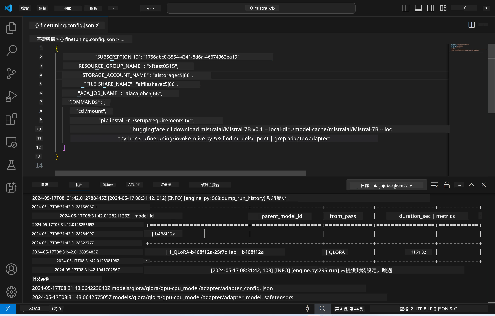
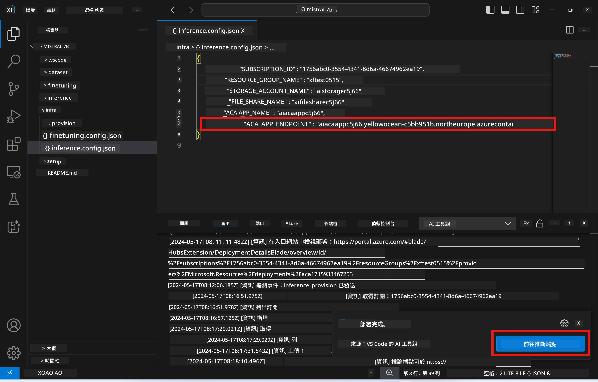

# 使用微調模型進行遠端推理

在遠端環境完成 adapters 訓練後，可以使用簡單的 Gradio 應用程式與模型互動。



### 配置 Azure 資源
你需要透過命令面板執行 `AI Toolkit: Provision Azure Container Apps for inference` 來設定遠端推理的 Azure 資源。設定過程中，系統會要求你選擇 Azure 訂閱和資源群組。  

   
預設情況下，推理所使用的訂閱和資源群組應與微調時相同。推理會使用相同的 Azure Container App 環境，並存取在微調階段產生並儲存在 Azure Files 的模型和模型 adapter。

## 使用 AI Toolkit 

### 部署推理  
如果你想修改推理程式碼或重新載入推理模型，請執行 `AI Toolkit: Deploy for inference` 指令。此操作會將你最新的程式碼同步到 ACA 並重新啟動副本。  


部署成功後，模型即可透過此端點進行評估。

### 存取推理 API

你可以點擊 VSCode 通知中顯示的「*Go to Inference Endpoint*」按鈕來存取推理 API。或者，也可以在 `./infra/inference.config.json` 的 `ACA_APP_ENDPOINT` 欄位及輸出面板中找到 Web API 端點。



> **Note:** 推理端點可能需要幾分鐘時間才能完全啟動。

## 範本中包含的推理元件
 
| 資料夾 | 內容 |
| ------ |--------- |
| `infra` | 包含遠端操作所需的所有設定檔。 |
| `infra/provision/inference.parameters.json` | 儲存 bicep 模板的參數，用於配置推理的 Azure 資源。 |
| `infra/provision/inference.bicep` | 用於配置推理 Azure 資源的模板。 |
| `infra/inference.config.json` | 由 `AI Toolkit: Provision Azure Container Apps for inference` 指令產生的設定檔，作為其他遠端命令面板的輸入。 |

### 使用 AI Toolkit 配置 Azure 資源配置
設定 [AI Toolkit](https://marketplace.visualstudio.com/items?itemName=ms-windows-ai-studio.windows-ai-studio)

執行 `Provision Azure Container Apps for inference` 指令。

你可以在 `./infra/provision/inference.parameters.json` 檔案中找到配置參數。詳細說明如下：
| 參數 | 說明 |
| --------- |------------ |
| `defaultCommands` | 用於啟動 Web API 的指令。 |
| `maximumInstanceCount` | 設定 GPU 實例的最大容量。 |
| `location` | Azure 資源配置的位置，預設與所選資源群組位置相同。 |
| `storageAccountName`, `fileShareName`, `acaEnvironmentName`, `acaEnvironmentStorageName`, `acaAppName`,  `acaLogAnalyticsName` | 用於命名 Azure 資源的參數。預設會與微調時使用的資源名稱相同。你可以輸入新的未使用資源名稱來建立自訂資源，或輸入已存在的 Azure 資源名稱以使用該資源。詳情請參考 [使用現有 Azure 資源](../../../../../md/01.Introduction/03) 一節。 |

### 使用現有 Azure 資源

預設情況下，推理配置會使用微調時相同的 Azure Container App 環境、儲存帳戶、Azure File Share 及 Azure Log Analytics。推理 API 則會建立獨立的 Azure Container App。

如果你在微調階段已自訂 Azure 資源，或想使用自己現有的 Azure 資源進行推理，請在 `./infra/inference.parameters.json` 檔案中指定它們的名稱，然後從命令面板執行 `AI Toolkit: Provision Azure Container Apps for inference` 指令。此操作會更新指定的資源並建立缺少的資源。

例如，若你已有現有的 Azure container 環境，你的 `./infra/finetuning.parameters.json` 應該長這樣：

```json
{
    "$schema": "https://schema.management.azure.com/schemas/2019-04-01/deploymentParameters.json#",
    "contentVersion": "1.0.0.0",
    "parameters": {
      ...
      "acaEnvironmentName": {
        "value": "<your-aca-env-name>"
      },
      "acaEnvironmentStorageName": {
        "value": null
      },
      ...
    }
  }
```

### 手動配置  
如果你想手動配置 Azure 資源，可以使用 `./infra/provision` 資料夾中提供的 bicep 檔案。如果你已經完成所有 Azure 資源的設定且未使用 AI Toolkit 命令面板，只需將資源名稱填入 `inference.config.json` 檔案即可。

例如：

```json
{
  "SUBSCRIPTION_ID": "<your-subscription-id>",
  "RESOURCE_GROUP_NAME": "<your-resource-group-name>",
  "STORAGE_ACCOUNT_NAME": "<your-storage-account-name>",
  "FILE_SHARE_NAME": "<your-file-share-name>",
  "ACA_APP_NAME": "<your-aca-name>",
  "ACA_APP_ENDPOINT": "<your-aca-endpoint>"
}
```

**免責聲明**：  
本文件由 AI 翻譯服務 [Co-op Translator](https://github.com/Azure/co-op-translator) 進行翻譯。雖然我們致力於確保準確性，但請注意自動翻譯可能包含錯誤或不準確之處。原始文件的母語版本應被視為權威來源。對於重要資訊，建議採用專業人工翻譯。我們不對因使用本翻譯而引起的任何誤解或誤釋承擔責任。