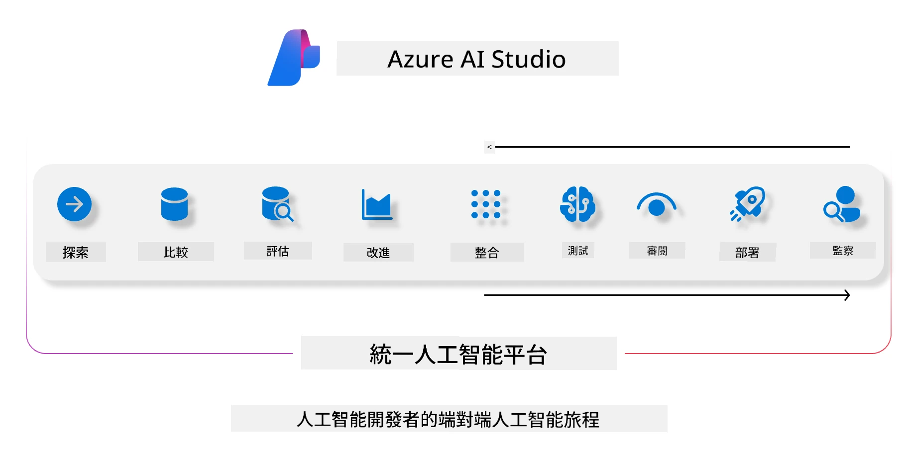

# **使用 Azure AI Foundry 進行評估**

如何使用 [Azure AI Foundry](https://ai.azure.com?WT.mc_id=aiml-138114-kinfeylo) 評估你的生成式 AI 應用程式。無論你是在評估單輪還是多輪對話，Azure AI Foundry 都提供了評估模型效能和安全性的工具。

## 如何使用 Azure AI Foundry 評估生成式 AI 應用程式
更多詳細說明請參考 [Azure AI Foundry 文件](https://learn.microsoft.com/azure/ai-studio/how-to/evaluate-generative-ai-app?WT.mc_id=aiml-138114-kinfeylo)

以下是開始的步驟：

## 在 Azure AI Foundry 中評估生成式 AI 模型

**先決條件**

- 一份 CSV 或 JSON 格式的測試資料集。
- 已部署的生成式 AI 模型（例如 Phi-3、GPT 3.5、GPT 4 或 Davinci 模型）。
- 一個帶有計算實例的執行環境，用於執行評估。

## 內建評估指標

Azure AI Foundry 支援評估單輪及複雜的多輪對話。
針對 Retrieval Augmented Generation (RAG) 場景，即模型基於特定資料進行生成，你可以使用內建的評估指標來衡量效能。
此外，也能評估一般的單輪問答場景（非 RAG）。

## 建立評估執行

在 Azure AI Foundry 的介面中，前往 Evaluate 頁面或 Prompt Flow 頁面。
依照評估建立精靈設定評估執行，並可選擇為評估命名。
選擇符合你應用目標的場景。
挑選一個或多個評估指標來評估模型輸出。

## 自訂評估流程（選用）

若需要更高彈性，可以建立自訂的評估流程，根據你的具體需求調整評估過程。

## 查看結果

執行評估後，可在 Azure AI Foundry 中記錄、查看並分析詳細的評估指標，深入了解你的應用能力與限制。

**Note** Azure AI Foundry 目前處於公開預覽階段，建議用於實驗和開發用途。生產環境請考慮其他方案。更多細節及逐步指引，請參考官方 [AI Foundry 文件](https://learn.microsoft.com/azure/ai-studio/?WT.mc_id=aiml-138114-kinfeylo)。

**免責聲明**：  
本文件乃使用 AI 翻譯服務 [Co-op Translator](https://github.com/Azure/co-op-translator) 進行翻譯。雖然我們致力於確保準確性，但請注意自動翻譯可能包含錯誤或不準確之處。原始文件的母語版本應被視為權威來源。對於重要資訊，建議採用專業人工翻譯。我們不對因使用本翻譯而引起的任何誤解或誤釋承擔責任。