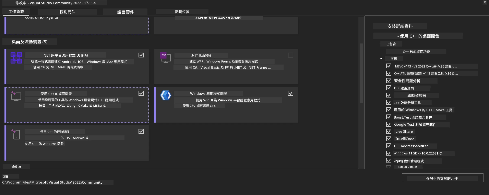
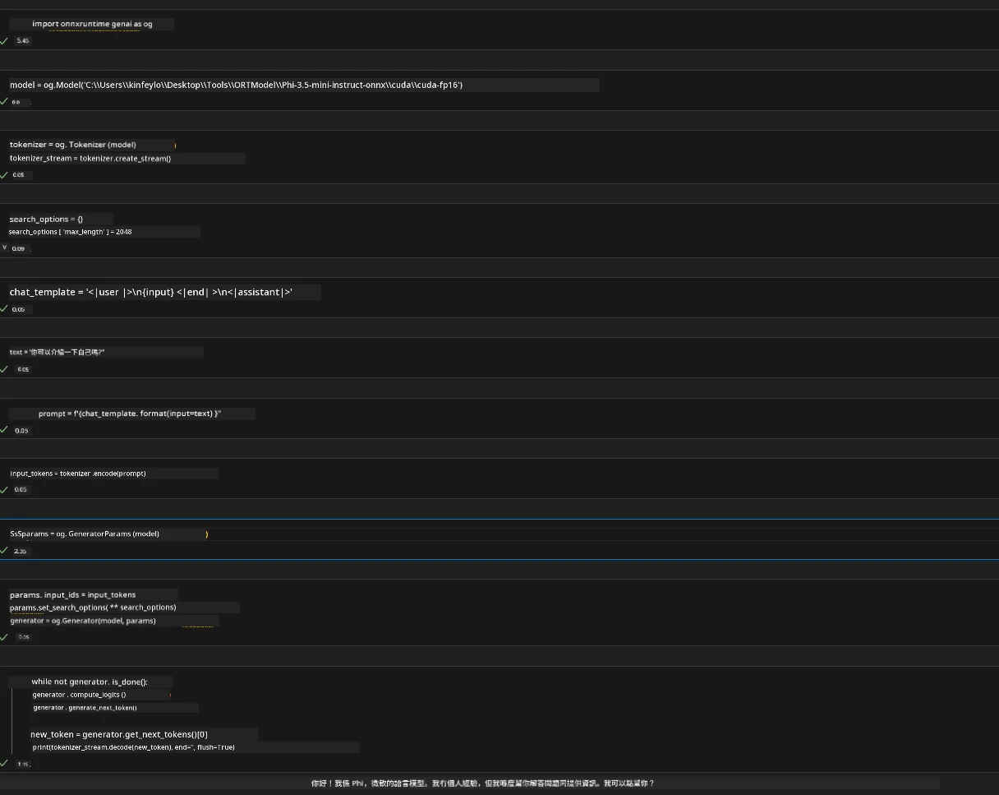
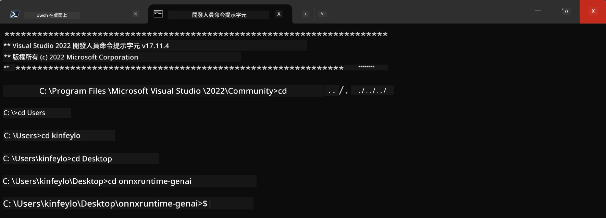

# **OnnxRuntime GenAI Windows GPU 指南**

本指南提供在 Windows 上使用帶 GPU 的 ONNX Runtime (ORT) 的設置和使用步驟。旨在幫助您利用 GPU 加速您的模型，提升性能和效率。

本文件提供以下指引：

- 環境設置：如何安裝 CUDA、cuDNN 和 ONNX Runtime 等必要依賴。
- 配置：如何配置環境和 ONNX Runtime，有效使用 GPU 資源。
- 優化技巧：如何微調 GPU 設置以達到最佳性能的建議。

### **1. Python 3.10.x /3.11.8**

   <strong><em>注意</em></strong> 建議使用 [miniforge](https://github.com/conda-forge/miniforge/releases/latest/download/Miniforge3-Windows-x86_64.exe) 作為您的 Python 環境

   ```bash

   conda create -n pydev python==3.11.8

   conda activate pydev

   ```

   <strong><em>提醒</em></strong> 若您已安裝任何關於 python 的 ONNX 庫，請先將它們卸載

### **2. 使用 winget 安裝 CMake**


   ```bash

   winget install -e --id Kitware.CMake

   ```

### **3. 安裝 Visual Studio 2022 - 使用 C++ 進行桌面開發**

   <strong><em>注意</em></strong> 如果您不打算編譯，可跳過此步驟




### **4. 安裝 NVIDIA 驅動程式**

1. **NVIDIA GPU 驅動程式**  [https://www.nvidia.com/en-us/drivers/](https://www.nvidia.com/en-us/drivers/)

2. **NVIDIA CUDA 12.4** [https://developer.nvidia.com/cuda-12-4-0-download-archive](https://developer.nvidia.com/cuda-12-4-0-download-archive)

3. **NVIDIA CUDNN 9.4**  [https://developer.nvidia.com/cudnn-downloads](https://developer.nvidia.com/cudnn-downloads)

<strong><em>提醒</em></strong> 請使用安裝流程的預設設定

### **5. 設定 NVIDIA 環境**

將 NVIDIA CUDNN 9.4 的 lib、bin、include 複製至 NVIDIA CUDA 12.4 的 lib、bin、include

- 將 *'C:\Program Files\NVIDIA\CUDNN\v9.4\bin\12.6'* 的檔案複製到 *'C:\Program Files\NVIDIA GPU Computing Toolkit\CUDA\v12.4\bin'* 

- 將 *'C:\Program Files\NVIDIA\CUDNN\v9.4\include\12.6'* 的檔案複製到 *'C:\Program Files\NVIDIA GPU Computing Toolkit\CUDA\v12.4\include'*

- 將 *'C:\Program Files\NVIDIA\CUDNN\v9.4\lib\12.6'* 的檔案複製到 *'C:\Program Files\NVIDIA GPU Computing Toolkit\CUDA\v12.4\lib\x64'*


### **6. 下載 Phi-3.5-mini-instruct-onnx**


   ```bash

   winget install -e --id Git.Git

   winget install -e --id GitHub.GitLFS

   git lfs install

   git clone https://huggingface.co/microsoft/Phi-3.5-mini-instruct-onnx

   ```

### **7. 執行 InferencePhi35Instruct.ipynb**

   開啟 [Notebook](../../../../code/09.UpdateSamples/Aug/ortgpu-phi35-instruct.ipynb) 並執行





### **8. 編譯 ORT GenAI GPU**


   <strong><em>注意</em></strong> 
   
   1. 請先卸載所有關於 onnx、onnxruntime 和 onnxruntime-genai 的套件

   
   ```bash

   pip list 
   
   ```

   接著卸載所有 onnxruntime 相關庫，例如


   ```bash

   pip uninstall onnxruntime

   pip uninstall onnxruntime-genai

   pip uninstall onnxruntume-genai-cuda
   
   ```

   2. 檢查 Visual Studio 擴充支援 

   檢查 C:\Program Files\NVIDIA GPU Computing Toolkit\CUDA\v12.4\extras，確定存在 C:\Program Files\NVIDIA GPU Computing Toolkit\CUDA\v12.4\extras\visual_studio_integration
   
   若不存在，請到其他 CUDA 工具包驅動資料夾中尋找並複製 visual_studio_integration 資料夾及內容到 C:\Program Files\NVIDIA GPU Computing Toolkit\CUDA\v12.4\extras\visual_studio_integration


   - 如果您不打算編譯，可跳過此步驟


   ```bash

   git clone https://github.com/microsoft/onnxruntime-genai

   ```

   - 下載 [https://github.com/microsoft/onnxruntime/releases/download/v1.19.2/onnxruntime-win-x64-gpu-1.19.2.zip](https://github.com/microsoft/onnxruntime/releases/download/v1.19.2/onnxruntime-win-x64-gpu-1.19.2.zip)

   - 解壓 onnxruntime-win-x64-gpu-1.19.2.zip，並將資料夾重命名為 **ort**，將 ort 資料夾複製到 onnxruntime-genai 內

   - 使用 Windows Terminal，開啟 VS 2022 的開發者命令提示字元，並進入 onnxruntime-genai 



   - 使用您的 python 環境來編譯

   
   ```bash

   cd onnxruntime-genai

   python build.py --use_cuda  --cuda_home "C:\Program Files\NVIDIA GPU Computing Toolkit\CUDA\v12.4" --config Release
 

   cd build/Windows/Release/Wheel

   pip install .whl

   ```

---

<!-- CO-OP TRANSLATOR DISCLAIMER START -->
**免責聲明**：
本文件由 AI 翻譯服務 [Co-op Translator](https://github.com/Azure/co-op-translator) 翻譯而成。雖然我們致力於確保準確性，但請注意，機器自動翻譯可能包含錯誤或不準確之處。原始文件的母語版本應被視為權威來源。對於重要資訊，建議進行專業人工翻譯。我們不對因使用本翻譯而產生的任何誤解或誤釋承擔責任。
<!-- CO-OP TRANSLATOR DISCLAIMER END -->