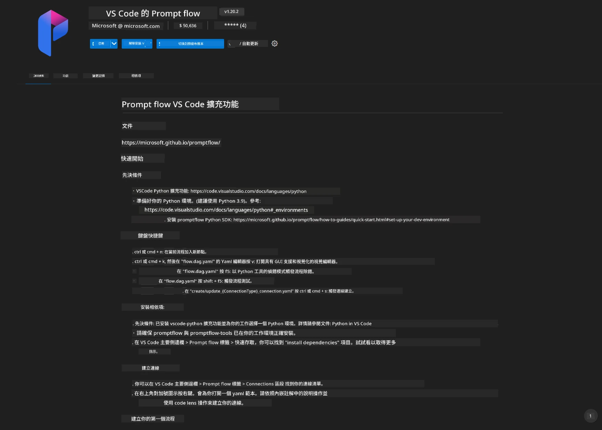
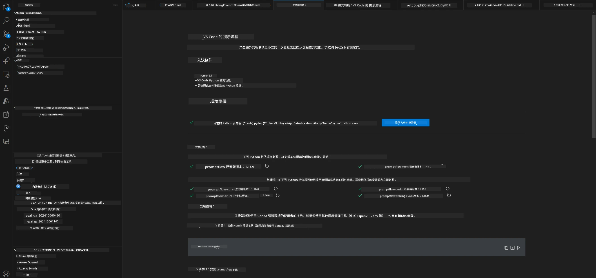
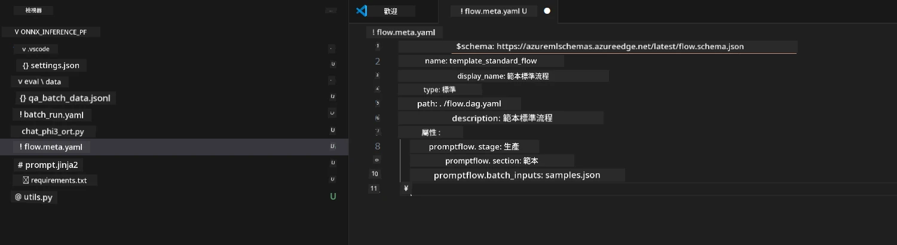
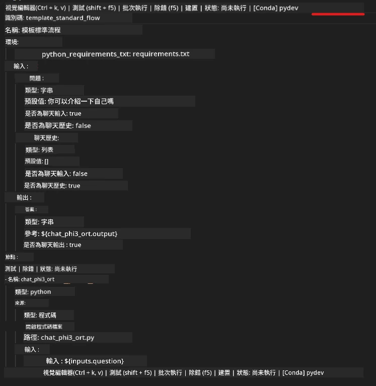
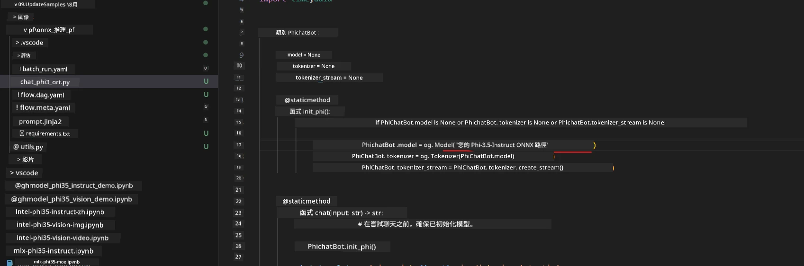
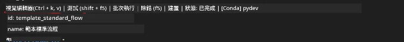
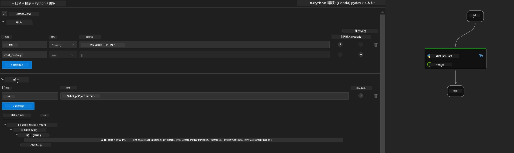
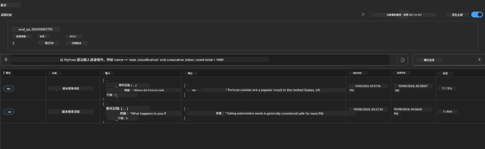

# 使用 Windows GPU 與 Phi-3.5-Instruct ONNX 建立 Prompt flow 解決方案

以下文件為如何使用 PromptFlow 與 ONNX（開放神經網絡交換）基於 Phi-3 模型開發 AI 應用程序的示例。

PromptFlow 是一套開發工具，旨在簡化基於大型語言模型（LLM）AI 應用程序的端到端開發週期，從構思、原型設計到測試和評估。

通過將 PromptFlow 與 ONNX 集成，開發人員可以：

- 優化模型性能：利用 ONNX 進行高效的模型推理和部署。
- 簡化開發：使用 PromptFlow 管理工作流程並自動化重複任務。
- 增強協作：通過提供統一的開發環境促進團隊成員之間的更好協作。

**Prompt flow** 是一套開發工具，旨在簡化基於 LLM 的 AI 應用程序的端到端開發週期，涵蓋構思、原型設計、測試、評估到生產部署和監控。它讓提示工程變得更簡單，並使您能夠建立具備生產品質的 LLM 應用程序。

Prompt flow 可以連接至 OpenAI、Azure OpenAI 服務及可自訂模型（Huggingface、在地 LLM/SLM）。我們希望將 Phi-3.5 的量化 ONNX 模型部署到本地應用。Prompt flow 可以幫助我們更好規劃業務，並基於 Phi-3.5 完成本地解決方案。本例中，我們將結合 ONNX Runtime GenAI 函式庫完成基於 Windows GPU 的 Prompt flow 解決方案。

## <strong>安裝</strong>

### **Windows GPU 的 ONNX Runtime GenAI**

閱讀此指南以設定 Windows GPU 的 ONNX Runtime GenAI  [點此](./ORTWindowGPUGuideline.md)

### **在 VSCode 中設定 Prompt flow**

1. 安裝 Prompt flow VS Code 擴充套件



2. 安裝 Prompt flow VS Code 擴充套件後，點擊擴充套件，並選擇 <strong>安裝依賴項</strong>，依照此指南在您的環境中安裝 Prompt flow SDK



3. 下載 [範例程式碼](../../../../../../code/09.UpdateSamples/Aug/pf/onnx_inference_pf)，並使用 VS Code 開啟此範例



4. 開啟 **flow.dag.yaml**，選擇您的 Python 環境



   開啟 **chat_phi3_ort.py**，修改您的 Phi-3.5-instruct ONNX 模型位置



5. 執行您的 prompt flow 進行測試

開啟 **flow.dag.yaml** 點擊視覺化編輯器



點擊後，執行它來測試



1. 您可以在終端機中批次執行以檢視更多結果


```bash

pf run create --file batch_run.yaml --stream --name 'Your eval qa name'    

```

您可以在預設瀏覽器中查看結果




---

<!-- CO-OP TRANSLATOR DISCLAIMER START -->
**免責聲明**：
本文件由 AI 翻譯服務 [Co-op Translator](https://github.com/Azure/co-op-translator) 翻譯而成。雖然我們致力於確保準確性，但請注意，機器自動翻譯可能包含錯誤或不準確之處。原始文件的母語版本應被視為權威來源。對於重要資訊，建議進行專業人工翻譯。我們不對因使用本翻譯而產生的任何誤解或誤釋承擔責任。
<!-- CO-OP TRANSLATOR DISCLAIMER END -->