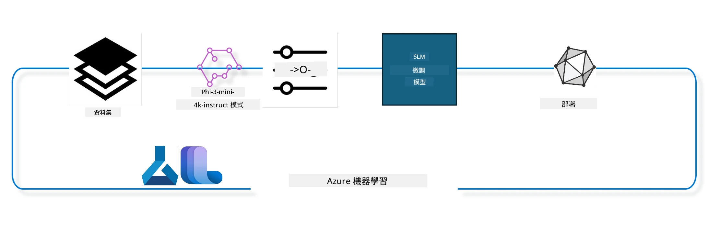

## 如何使用 Azure ML 系統目錄中的 chat-completion 組件進行模型微調

在本例中，我們將對 Phi-3-mini-4k-instruct 模型進行微調，以完成使用 ultrachat_200k 資料集的兩人對話任務。



本範例將展示如何使用 Azure ML SDK 和 Python 進行微調，然後將微調後的模型部署到線上端點以進行即時推理。

### 訓練資料

我們將使用 ultrachat_200k 資料集。這是 UltraChat 資料集經過嚴格篩選的版本，並用於訓練 Zephyr-7B-β，一款最先進的 7b 聊天模型。

### 模型

我們將使用 Phi-3-mini-4k-instruct 模型，示範如何對聊天完成任務進行微調。如果您是從特定模型卡打開此筆記本，請記得更換具體的模型名稱。

### 任務

- 選擇要微調的模型。
- 選擇並探索訓練資料。
- 配置微調任務。
- 執行微調任務。
- 檢視訓練與評估指標。
- 註冊微調後的模型。
- 部署微調後的模型進行即時推理。
- 清理資源。

## 1. 設定先決條件

- 安裝依賴套件
- 連線至 AzureML 工作區。詳細請參見設定 SDK 驗證。請將下方的 <WORKSPACE_NAME>、<RESOURCE_GROUP> 和 <SUBSCRIPTION_ID> 替換為您的值。
- 連線至 azureml 系統目錄
- 設定可選實驗名稱
- 檢查或建立計算資源。

> [!NOTE]
> 需求為單一 GPU 節點且可具有多個 GPU 卡。例如，一個 Standard_NC24rs_v3 節點含有 4 張 NVIDIA V100 GPU，而 Standard_NC12s_v3 則有 2 張 NVIDIA V100 GPU。請參考文件以獲取此資訊。每節點 GPU 卡數設定於下方參數 gpus_per_node。正確設置此值可確保節點上的所有 GPU 被充分利用。推薦的 GPU 計算資源 SKU 可參考此處及此處。

### Python 函式庫

透過執行以下程式碼區塊安裝依賴套件。如果您是在新環境中執行，此步驟不可省略。

```bash
pip install azure-ai-ml
pip install azure-identity
pip install datasets==2.9.0
pip install mlflow
pip install azureml-mlflow
```

### 與 Azure ML 互動

1. 該 Python 腳本用於與 Azure 機器學習 (Azure ML) 服務互動。以下為其執行步驟說明：

    - 引入 azure.ai.ml、azure.identity 和 azure.ai.ml.entities 套件所需模組，另外也匯入 time 模組。

    - 嘗試以 DefaultAzureCredential() 進行身份驗證，這提供簡化的認證流程以快速開始開發於 Azure 雲端執行的應用程式。若失敗，則回落至 InteractiveBrowserCredential()，該方法會啟動互動式登入提示。

    - 接著嘗試以 from_config 方法建立 MLClient 實例，從預設配置檔（config.json）讀取設定。若失敗，則手動提供 subscription_id、resource_group_name 和 workspace_name 建立 MLClient 實例。

    - 創建另一個 MLClient 實例，此次用於命名為 "azureml" 的 Azure ML 登錄。該登錄存放模型、微調管線及環境等資源。

    - 將實驗名稱設為 "chat_completion_Phi-3-mini-4k-instruct"。

    - 產生唯一時間戳，方法是將目前時間（自 Epoch 起的秒數，浮點數）轉為整數再轉為字串。此時間戳可用於建立唯一名稱與版本。

    ```python
    # 從 Azure ML 和 Azure Identity 匯入必要模組
    from azure.ai.ml import MLClient
    from azure.identity import (
        DefaultAzureCredential,
        InteractiveBrowserCredential,
    )
    from azure.ai.ml.entities import AmlCompute
    import time  # 匯入時間模組
    
    # 嘗試使用 DefaultAzureCredential 進行驗證
    try:
        credential = DefaultAzureCredential()
        credential.get_token("https://management.azure.com/.default")
    except Exception as ex:  # 如果 DefaultAzureCredential 失敗，使用 InteractiveBrowserCredential
        credential = InteractiveBrowserCredential()
    
    # 嘗試使用預設設定檔建立 MLClient 實例
    try:
        workspace_ml_client = MLClient.from_config(credential=credential)
    except:  # 如果失敗，手動提供詳細資料建立 MLClient 實例
        workspace_ml_client = MLClient(
            credential,
            subscription_id="<SUBSCRIPTION_ID>",
            resource_group_name="<RESOURCE_GROUP>",
            workspace_name="<WORKSPACE_NAME>",
        )
    
    # 為名為 "azureml" 的 Azure ML 註冊表建立另一個 MLClient 實例
    # 此註冊表用於儲存模型、微調管線和環境
    registry_ml_client = MLClient(credential, registry_name="azureml")
    
    # 設定實驗名稱
    experiment_name = "chat_completion_Phi-3-mini-4k-instruct"
    
    # 產生可用於需要唯一名稱和版本的唯一時間戳記
    timestamp = str(int(time.time()))
    ```

## 2. 選擇基礎模型進行微調

1. Phi-3-mini-4k-instruct 是擁有 3.8 億參數的輕量級、最先進開源模型，建立於用於 Phi-2 的資料集之上。該模型屬於 Phi-3 模型家族，Mini 版本分為可以支援 4K 及 128K（token 數）的上下文長度兩種型號。我們需針對特定任務微調模型才能使用。您可於 AzureML Studio 之模型目錄中瀏覽這些模型，並透過聊天完成任務篩選。本示例使用了 Phi-3-mini-4k-instruct 模型。如您打開此筆記本時選用不同模型，請相應替換模型名稱與版本。

> [!NOTE]
> 模型的 id 屬性會作為微調任務的輸入。此屬性也可於 AzureML Studio 模型目錄中查看模型詳細資料頁的資產 ID 欄位。

2. 此 Python 腳本用於與 Azure 機器學習 (Azure ML) 服務互動。執行步驟如下：

    - 設定 model_name 為 "Phi-3-mini-4k-instruct"。

    - 使用 registry_ml_client 的 models 屬性中 get 方法，從 Azure ML 登錄中取得該名稱模型的最新版本。get 方法接受兩個引數：模型名稱及標籤，標示取最新版本。

    - 印出訊息至控制臺，顯示將用於微調的模型名稱、版本與 id。透過字串的 format 方法將名稱、版本及 id 插入訊息。模型的名稱、版本及 id 由 foundation_model 物件的屬性取得。

    ```python
    # 設定模型名稱
    model_name = "Phi-3-mini-4k-instruct"
    
    # 從 Azure ML 註冊表取得模型的最新版本
    foundation_model = registry_ml_client.models.get(model_name, label="latest")
    
    # 列印模型名稱、版本及ID
    # 此資訊對追蹤及除錯非常有用
    print(
        "\n\nUsing model name: {0}, version: {1}, id: {2} for fine tuning".format(
            foundation_model.name, foundation_model.version, foundation_model.id
        )
    )
    ```

## 3. 建立用於工作的計算資源

微調任務僅支援 GPU 計算。計算資源大小取決於模型大小，多數情況下選擇適合的計算資源頗具挑戰。本區塊示範引導使用者選擇正確的計算資源。

> [!NOTE]
> 下方列出的計算資源皆以最佳化配置運作，配置的更動可能導致 Cuda 記憶體不足錯誤。如遇此情況，請嘗試升級至較大型的計算資源。

> [!NOTE]
> 選擇 compute_cluster_size 時，請確定該計算資源在您的資源群組中可用。若特定計算資源不可用，您可提出申請以取得訪問權限。

### 檢查模型微調支援的計算清單

1. 此 Python 腳本用於與 Azure 機器學習 (Azure ML) 模型互動。執行流程如下：

    - 引入 ast 模組，該模組提供處理 Python 抽象語法樹的函數。

    - 檢查 foundation_model（Azure ML 中模型物件）是否含有名為 finetune_compute_allow_list 的標籤。Azure ML 的標籤是用以篩選和排序模型的鍵值對。

    - 若含該標籤，使用 ast.literal_eval 安全地將標籤值（字串）解析為 Python list。該列表指定允許的計算清單，並分配給 computes_allow_list 變數。隨後印出訊息指示應從該清單中建立計算資源。

    - 若該標籤不存在，設置 computes_allow_list 為 None，並印出訊息指該標籤不在模型標籤中。

    - 總結，此腳本會檢查模型元資料中的特定標籤，並視情況將標籤值轉為清單，提供相應回饋。

    ```python
    # 匯入 ast 模組，該模組提供處理 Python 抽象語法樹的函數
    import ast
    
    # 檢查模型標籤中是否存在 'finetune_compute_allow_list' 標籤
    if "finetune_compute_allow_list" in foundation_model.tags:
        # 如果標籤存在，使用 ast.literal_eval 安全地將標籤值（字串）解析為 Python 列表
        computes_allow_list = ast.literal_eval(
            foundation_model.tags["finetune_compute_allow_list"]
        )  # 將字串轉換為 Python 列表
        # 印出訊息，指示應從列表中建立運算
        print(f"Please create a compute from the above list - {computes_allow_list}")
    else:
        # 如果標籤不存在，將 computes_allow_list 設為 None
        computes_allow_list = None
        # 印出訊息，指示 'finetune_compute_allow_list' 標籤不在模型標籤中
        print("`finetune_compute_allow_list` is not part of model tags")
    ```

### 檢查計算實例

1. 此 Python 腳本用於與 Azure 機器學習 (Azure ML) 服務互動，並對計算實例進行多項檢查。執行步驟如下：

    - 嘗試從 Azure ML 工作區取得名為 compute_cluster 的計算實例。若該實例的配置狀態為 "failed"，則引發 ValueError。

    - 若 computes_allow_list 不為 None，則將清單中的計算大小全部轉為小寫字母，並檢查目前計算實例大小是否包含於清單。若不在清單中，則引發 ValueError。

    - 若 computes_allow_list 為 None，則檢查該計算實例大小是否屬於不支援的 GPU VM 尺寸清單之一。若是，則引發 ValueError。

    - 取得工作區中所有可用計算大小列表。逐一檢查列表中計算大小名稱是否與目前計算實例大小相符。若符合，則檢索該計算大小的 GPU 數量並標記找到了 GPU 計數。

    - 若找到 GPU 計數，印出計算實例 GPU 數量。若未找到，則引發 ValueError。

    - 總結，該腳本在 Azure ML 工作區中針對特定計算實例執行多項檢查，包括配置狀態、大小是否允許以及該大小的 GPU 數量。

    ```python
    # 輸出異常訊息
    print(e)
    # 如果計算規模在工作區中不可用，則引發 ValueError
    raise ValueError(
        f"WARNING! Compute size {compute_cluster_size} not available in workspace"
    )
    
    # 從 Azure ML 工作區檢索計算實例
    compute = workspace_ml_client.compute.get(compute_cluster)
    # 檢查計算實例的配置狀態是否為「失敗」
    if compute.provisioning_state.lower() == "failed":
        # 如果配置狀態為「失敗」，則引發 ValueError
        raise ValueError(
            f"Provisioning failed, Compute '{compute_cluster}' is in failed state. "
            f"please try creating a different compute"
        )
    
    # 檢查 computes_allow_list 是否不為 None
    if computes_allow_list is not None:
        # 將 computes_allow_list 中的所有計算規模轉為小寫
        computes_allow_list_lower_case = [x.lower() for x in computes_allow_list]
        # 檢查計算實例的規模是否在 computes_allow_list_lower_case 中
        if compute.size.lower() not in computes_allow_list_lower_case:
            # 如果計算實例的規模不在 computes_allow_list_lower_case 中，則引發 ValueError
            raise ValueError(
                f"VM size {compute.size} is not in the allow-listed computes for finetuning"
            )
    else:
        # 定義不支援的 GPU VM 規模列表
        unsupported_gpu_vm_list = [
            "standard_nc6",
            "standard_nc12",
            "standard_nc24",
            "standard_nc24r",
        ]
        # 檢查計算實例的規模是否在 unsupported_gpu_vm_list 中
        if compute.size.lower() in unsupported_gpu_vm_list:
            # 如果計算實例的規模在 unsupported_gpu_vm_list 中，則引發 ValueError
            raise ValueError(
                f"VM size {compute.size} is currently not supported for finetuning"
            )
    
    # 初始化標誌以檢查是否找到計算實例中的 GPU 數量
    gpu_count_found = False
    # 檢索工作區中所有可用計算規模的列表
    workspace_compute_sku_list = workspace_ml_client.compute.list_sizes()
    available_sku_sizes = []
    # 遍歷可用計算規模的列表
    for compute_sku in workspace_compute_sku_list:
        available_sku_sizes.append(compute_sku.name)
        # 檢查計算規模的名稱是否與計算實例的規模匹配
        if compute_sku.name.lower() == compute.size.lower():
            # 如果匹配，檢索該計算規模的 GPU 數量並將 gpu_count_found 設置為 True
            gpus_per_node = compute_sku.gpus
            gpu_count_found = True
    # 如果 gpu_count_found 為 True，則輸出計算實例中的 GPU 數量
    if gpu_count_found:
        print(f"Number of GPU's in compute {compute.size}: {gpus_per_node}")
    else:
        # 如果 gpu_count_found 為 False，則引發 ValueError
        raise ValueError(
            f"Number of GPU's in compute {compute.size} not found. Available skus are: {available_sku_sizes}."
            f"This should not happen. Please check the selected compute cluster: {compute_cluster} and try again."
        )
    ```

## 4. 選擇用於模型微調的資料集

1. 我們使用 ultrachat_200k 資料集。資料集分為四個切分，適用於監督式微調（Supervised fine-tuning，sft）、生成排名（generation ranking，gen）。各切分包含範例數如下：

    ```bash
    train_sft test_sft  train_gen  test_gen
    207865  23110  256032  28304
    ```

1. 接下來數個區塊示範微調的基本資料準備：

### 視覺化部分數據行

為讓測試快速執行，將 train_sft、test_sft 檔案各保存 5% 的經篩選行數。這意味微調模型的準確率會較低，因此不適用於實際商業應用。
download-dataset.py 用於下載 ultrachat_200k 資料集，並將資料集轉換為微調管線組件可使用的格式。由於資料集龐大，這裡我們只使用部分資料。

1. 執行下方腳本僅下載 5% 的資料，須增加可改動 dataset_split_pc 參數為目標百分比。

> [!NOTE]
> 某些語言模型使用不同語言代碼，因此資料集的欄位名稱亦應反映相同代碼。

1. 以下示範資料格式範例
聊天完成資料集以 parquet 格式存放，每筆資料符合以下結構：

    - 這是一個 JSON（JavaScript 物件標記）文件，是一種常用的資料交換格式，非執行碼，而是儲存與傳輸資料的方式。其結構說明如下：

    - "prompt": 此鍵對應字串值，代表指派給 AI 助手的任務或問題。

    - "messages": 此鍵對應陣列物件。每個物件代表用戶與 AI 助手間的一則會話訊息。每則訊息物件包含兩個鍵：

    - "content": 對應訊息內容的字串值。
    - "role": 對應發送該訊息實體的角色字串，可能為 "user" 或 "assistant"。
    - "prompt_id": 對應提示的唯一識別碼字串。

1. 在此特定 JSON 文件中，記錄一段對話：用戶要求 AI 助手創建反烏托邦故事的主角，助手回應，接著用戶要求更多細節，而助手同意提供更多細節。整個對話與特定 prompt_id 關聯。

    ```python
    {
        // The task or question posed to an AI assistant
        "prompt": "Create a fully-developed protagonist who is challenged to survive within a dystopian society under the rule of a tyrant. ...",
        
        // An array of objects, each representing a message in a conversation between a user and an AI assistant
        "messages":[
            {
                // The content of the user's message
                "content": "Create a fully-developed protagonist who is challenged to survive within a dystopian society under the rule of a tyrant. ...",
                // The role of the entity that sent the message
                "role": "user"
            },
            {
                // The content of the assistant's message
                "content": "Name: Ava\n\n Ava was just 16 years old when the world as she knew it came crashing down. The government had collapsed, leaving behind a chaotic and lawless society. ...",
                // The role of the entity that sent the message
                "role": "assistant"
            },
            {
                // The content of the user's message
                "content": "Wow, Ava's story is so intense and inspiring! Can you provide me with more details.  ...",
                // The role of the entity that sent the message
                "role": "user"
            }, 
            {
                // The content of the assistant's message
                "content": "Certainly! ....",
                // The role of the entity that sent the message
                "role": "assistant"
            }
        ],
        
        // A unique identifier for the prompt
        "prompt_id": "d938b65dfe31f05f80eb8572964c6673eddbd68eff3db6bd234d7f1e3b86c2af"
    }
    ```

### 下載資料

1. 此 Python 腳本用於利用輔助腳本 download-dataset.py 下載資料集。執行邏輯說明：

    - 引入 os 模組，提供跨平台作業系統功能。

    - 使用 os.system 在 shell 執行 download-dataset.py 腳本並傳入參數。參數指定下載資料集為 HuggingFaceH4/ultrachat_200k，資料下載目錄為 ultrachat_200k_dataset，以及資料切分百分比為 5。執行結果的退出狀態儲存在 exit_status 變數中。

    - 檢查 exit_status 是否不為 0。於類 Unix 系統，退出狀態 0 表示指令成功執行，非零代表錯誤。若非 0，則引發 Exception，提示下載資料集時發生錯誤。

    - 總結，此腳本透過輔助指令下載資料集，下載失敗時會拋出異常。

    ```python
    # 引入 os 模組，提供使用與作業系統相關功能的方法
    import os
    
    # 使用 os.system 函數在 shell 中運行 download-dataset.py 腳本並帶入特定的命令列參數
    # 參數指定要下載的資料集（HuggingFaceH4/ultrachat_200k）、下載的目錄（ultrachat_200k_dataset）及資料集拆分的百分比（5）
    # os.system 函數回傳執行命令的退出狀態；此狀態會儲存在 exit_status 變數中
    exit_status = os.system(
        "python ./download-dataset.py --dataset HuggingFaceH4/ultrachat_200k --download_dir ultrachat_200k_dataset --dataset_split_pc 5"
    )
    
    # 檢查 exit_status 是否不等於 0
    # 在類 Unix 作業系統中，退出狀態 0 通常表示命令成功執行，其他數字則表示錯誤
    # 若 exit_status 不等於 0，則拋出 Exception，並附上指出下載資料集出錯的訊息
    if exit_status != 0:
        raise Exception("Error downloading dataset")
    ```

### 將資料載入 DataFrame

1. 此 Python 腳本將 JSON Lines 格式檔案載入 pandas DataFrame，並顯示前 5 筆資料。執行過程如下：

    - 引入 pandas 函式庫，該函式庫為強大的資料操作與分析工具。

    - 將 pandas 顯示選項中的最大欄寬設為 0，表示列印時所有欄位文字將完整顯示，不作截斷。
- 它使用 pd.read_json 函數從 ultrachat_200k_dataset 目錄載入 train_sft.jsonl 檔案到 DataFrame。lines=True 參數表示該檔案是 JSON Lines 格式，每一行是一個獨立的 JSON 物件。

- 它使用 head 方法顯示 DataFrame 的前 5 行。如果 DataFrame 少於 5 行，則顯示所有行。

- 總結來說，這個腳本是將 JSON Lines 檔案載入到 DataFrame 並顯示前 5 行帶完整欄位文字。

    ```python
    # 導入 pandas 函式庫，這是一個強大的數據處理和分析函式庫
    import pandas as pd
    
    # 設定 pandas 顯示選項中的最大欄寬為 0
    # 這表示在列印 DataFrame 時，每一欄的完整文字都會顯示，無截斷
    pd.set_option("display.max_colwidth", 0)
    
    # 使用 pd.read_json 函數從 ultrachat_200k_dataset 目錄載入 train_sft.jsonl 檔案到 DataFrame
    # lines=True 參數表示該檔案是 JSON Lines 格式，每一行都是獨立的 JSON 物件
    df = pd.read_json("./ultrachat_200k_dataset/train_sft.jsonl", lines=True)
    
    # 使用 head 方法顯示 DataFrame 的前 5 列
    # 如果 DataFrame 少於 5 列，則會顯示全部列
    df.head()
    ```

## 5. 使用模型和數據作為輸入提交微調作業

建立一個使用 chat-completion pipeline 組件的作業。了解更多關於支援微調的所有參數。

### 定義微調參數

1. 微調參數可以分為兩大類 - 訓練參數與優化參數

1. 訓練參數定義了訓練的方方面面，例如 -

    - 要使用的優化器、排程器
    - 用來優化微調的指標
    - 訓練步數與批量大小等等
    - 優化參數則協助優化 GPU 記憶體與有效利用運算資源。

1. 以下是屬於此類別的一些參數。優化參數因模型而異，且隨模型一併打包以處理這些變化。

    - 啟用 deepspeed 與 LoRA
    - 啟用混合精度訓練
    - 啟用多節點訓練

> [!NOTE]
> 監督式微調可能會導致對齊喪失或災難性遺忘。我們建議檢查此問題並在微調後執行對齊階段。

### 微調參數

1. 此 Python 腳本設定微調機器學習模型的參數。以下是它的解析：

    - 設定預設訓練參數，如訓練輪數、訓練與評估的批次大小、學習率以及學習率排程器類型。

    - 設定預設優化參數，如是否應用 LoRa 和 DeepSpeed，以及 DeepSpeed 階段。

    - 將訓練參數與優化參數合併成一個名為 finetune_parameters 的字典。

    - 若 foundation_model 有任何模型特定的預設參數，則印出警告訊息並用這些模型特定的預設參數更新 finetune_parameters 字典。ast.literal_eval 函數用來將模型特定預設參數從字串轉換為 Python 字典。

    - 印出將用於執行的最終微調參數集。

    - 總結來說，這個腳本是設定並顯示用來微調機器學習模型的參數，且可用模型特定參數覆寫預設值。

    ```python
    # 設定預設的訓練參數，例如訓練輪數、訓練和評估的批次大小、學習率及學習率調度器類型
    training_parameters = dict(
        num_train_epochs=3,
        per_device_train_batch_size=1,
        per_device_eval_batch_size=1,
        learning_rate=5e-6,
        lr_scheduler_type="cosine",
    )
    
    # 設定預設的優化參數，例如是否應用分層相關傳播（LoRa）及 DeepSpeed，及 DeepSpeed 階段
    optimization_parameters = dict(
        apply_lora="true",
        apply_deepspeed="true",
        deepspeed_stage=2,
    )
    
    # 將訓練及優化參數合併成一個名為 finetune_parameters 的字典
    finetune_parameters = {**training_parameters, **optimization_parameters}
    
    # 檢查 foundation_model 是否有任何模型特定的預設參數
    # 如果有，打印警告訊息並用這些模型特定的預設值更新 finetune_parameters 字典
    # ast.literal_eval 函數用於將模型特定預設值由字串轉換成 Python 字典
    if "model_specific_defaults" in foundation_model.tags:
        print("Warning! Model specific defaults exist. The defaults could be overridden.")
        finetune_parameters.update(
            ast.literal_eval(  # 將字串轉換為 Python 字典
                foundation_model.tags["model_specific_defaults"]
            )
        )
    
    # 打印最終將用於運行的微調參數集
    print(
        f"The following finetune parameters are going to be set for the run: {finetune_parameters}"
    )
    ```

### 訓練管線

1. 這個 Python 腳本定義了一個函數用來產生機器學習訓練管線的顯示名稱，然後呼叫此函數產生並印出顯示名稱。以下是它的解析：

1. 定義 get_pipeline_display_name 函數。該函數根據訓練管線相關的多項參數生成一個顯示名稱。

1. 函數內部計算總批次大小，方法是將每設備批次大小、梯度累積步數、每節點 GPU 數量及微調節點數相乘。

1. 取得其他參數，例如學習率排程器類型、是否應用 DeepSpeed、DeepSpeed 階段、是否應用 LoRa、要保留的模型檢查點數量限制，以及最大序列長度。

1. 建立一個字串包含所有這些參數，用連字號分隔。若有使用 DeepSpeed 或 LoRa，字串中包含 "ds" 加上 DeepSpeed 階段，或 "lora"，否則分別為 "nods" 或 "nolora"。

1. 函數回傳這個字串，作為訓練管線的顯示名稱。

1. 定義函數後呼叫它產生顯示名稱，然後印出。

1. 總結來說，這個腳本根據多項參數產生機器學習訓練管線的顯示名稱，並印出該名稱。

    ```python
    # 定義一個函數以生成訓練流程的顯示名稱
    def get_pipeline_display_name():
        # 通過將每設備批量大小、梯度累積步數、每節點GPU數量及用於微調的節點數相乘，計算總批量大小
        batch_size = (
            int(finetune_parameters.get("per_device_train_batch_size", 1))
            * int(finetune_parameters.get("gradient_accumulation_steps", 1))
            * int(gpus_per_node)
            * int(finetune_parameters.get("num_nodes_finetune", 1))
        )
        # 獲取學習率調度器類型
        scheduler = finetune_parameters.get("lr_scheduler_type", "linear")
        # 獲取是否應用了DeepSpeed
        deepspeed = finetune_parameters.get("apply_deepspeed", "false")
        # 獲取DeepSpeed階段
        ds_stage = finetune_parameters.get("deepspeed_stage", "2")
        # 如果應用了DeepSpeed，在顯示名稱中加入"ds"後接DeepSpeed階段；若未應用，則加入"nods"
        if deepspeed == "true":
            ds_string = f"ds{ds_stage}"
        else:
            ds_string = "nods"
        # 獲取是否應用了層級相關性傳播(LoRa)
        lora = finetune_parameters.get("apply_lora", "false")
        # 如果應用了LoRa，在顯示名稱中加入"lora"；若未應用，則加入"nolora"
        if lora == "true":
            lora_string = "lora"
        else:
            lora_string = "nolora"
        # 獲取要保留的模型檢查點數量限制
        save_limit = finetune_parameters.get("save_total_limit", -1)
        # 獲取最大序列長度
        seq_len = finetune_parameters.get("max_seq_length", -1)
        # 通過連接所有這些參數並以連字符分隔，構建顯示名稱
        return (
            model_name
            + "-"
            + "ultrachat"
            + "-"
            + f"bs{batch_size}"
            + "-"
            + f"{scheduler}"
            + "-"
            + ds_string
            + "-"
            + lora_string
            + f"-save_limit{save_limit}"
            + f"-seqlen{seq_len}"
        )
    
    # 調用函數生成顯示名稱
    pipeline_display_name = get_pipeline_display_name()
    # 打印顯示名稱
    print(f"Display name used for the run: {pipeline_display_name}")
    ```

### 設定管線

這個 Python 腳本使用 Azure Machine Learning SDK 定義並設定機器學習管線。以下是它的解析：

1. 從 Azure AI ML SDK 載入必要模組。

1. 從註冊表中取得名為 "chat_completion_pipeline" 的管線組件。

1. 使用 `@pipeline` 裝飾器和函數 `create_pipeline` 定義一個管線作業。該管線名稱設定為 `pipeline_display_name`。

1. 在 `create_pipeline` 函數內，使用多項參數初始化取得的管線組件，包括模型路徑、不同階段的計算叢集、訓練與測試的資料集切分、用於微調的 GPU 數量及其他微調參數。

1. 將微調作業的輸出映射到管線作業的輸出。如此一來可以方便註冊微調後的模型，此為部署至線上或批次端點所需。

1. 呼叫 `create_pipeline` 函數建立管線實例。

1. 將管線的 `force_rerun` 設定為 `True`，表示不使用前一作業的快取結果。

1. 將管線的 `continue_on_step_failure` 設定為 `False`，表示如果任一步驟失敗則停止管線。

1. 總結來說，這個腳本使用 Azure Machine Learning SDK 定義並設定一個聊天完成任務的機器學習管線。

    ```python
    # 從 Azure AI ML SDK 匯入必要的模組
    from azure.ai.ml.dsl import pipeline
    from azure.ai.ml import Input
    
    # 從登錄中心取得名為 "chat_completion_pipeline" 的流程元件
    pipeline_component_func = registry_ml_client.components.get(
        name="chat_completion_pipeline", label="latest"
    )
    
    # 使用 @pipeline 裝飾器及 create_pipeline 函數定義流程作業
    # 流程的名稱被設定為 pipeline_display_name
    @pipeline(name=pipeline_display_name)
    def create_pipeline():
        # 使用各種參數初始化取得的流程元件
        # 包括模型路徑、不同階段的計算叢集、用於訓練和測試的數據集拆分、用於微調的 GPU 數量，以及其他微調參數
        chat_completion_pipeline = pipeline_component_func(
            mlflow_model_path=foundation_model.id,
            compute_model_import=compute_cluster,
            compute_preprocess=compute_cluster,
            compute_finetune=compute_cluster,
            compute_model_evaluation=compute_cluster,
            # 對參數映射數據集拆分
            train_file_path=Input(
                type="uri_file", path="./ultrachat_200k_dataset/train_sft.jsonl"
            ),
            test_file_path=Input(
                type="uri_file", path="./ultrachat_200k_dataset/test_sft.jsonl"
            ),
            # 訓練設定
            number_of_gpu_to_use_finetuning=gpus_per_node,  # 設定為計算叢集可用的 GPU 數量
            **finetune_parameters
        )
        return {
            # 將微調作業的輸出映射到流程作業的輸出
            # 如此便於我們輕鬆註冊微調後的模型
            # 註冊模型是將模型部署到線上或批次端點所需
            "trained_model": chat_completion_pipeline.outputs.mlflow_model_folder
        }
    
    # 透過呼叫 create_pipeline 函數建立流程實例
    pipeline_object = create_pipeline()
    
    # 不使用先前作業的快取結果
    pipeline_object.settings.force_rerun = True
    
    # 設定在步驟失敗時不繼續進行
    # 這表示若有任何步驟失敗，流程將會停止
    pipeline_object.settings.continue_on_step_failure = False
    ```

### 提交作業

1. 這個 Python 腳本將一個機器學習管線作業提交到 Azure Machine Learning 工作區並等待作業完成。以下是它的解析：

    - 呼叫 workspace_ml_client.jobs 物件的 create_or_update 方法提交管線作業。要執行的管線透過 pipeline_object 指定，作業所屬的實驗由 experiment_name 指定。

    - 然後呼叫 workspace_ml_client.jobs 物件的 stream 方法等待管線作業完成。待等待的作業由 pipeline_job 物件的 name 屬性指定。

    - 總結來說，這個腳本是提交機器學習管線作業到 Azure Machine Learning 工作區，並等待作業完成。

    ```python
    # 將管道作業提交到 Azure 機器學習工作區
    # 要運行的管道由 pipeline_object 指定
    # 作業運行所屬的實驗由 experiment_name 指定
    pipeline_job = workspace_ml_client.jobs.create_or_update(
        pipeline_object, experiment_name=experiment_name
    )
    
    # 等待管道作業完成
    # 等待的作業由 pipeline_job 物件的 name 屬性指定
    workspace_ml_client.jobs.stream(pipeline_job.name)
    ```

## 6. 在工作區註冊微調後的模型

我們將從微調作業輸出中註冊模型。這會追蹤微調模型與微調作業之間的血統。微調作業進一步追蹤基礎模型、資料和訓練程式碼的血統。

### 註冊 ML 模型

1. 此 Python 腳本註冊一個在 Azure Machine Learning 管線中訓練出來的機器學習模型。以下是它的解析：

    - 從 Azure AI ML SDK 載入必要模組。

    - 利用 workspace_ml_client.jobs 物件的 get 方法並訪問其 outputs 屬性，檢查微調後模型輸出 trained_model 是否可用。

    - 建立訓練模型路徑，字串格式化管線作業名稱和輸出名稱 ("trained_model")。

    - 為微調後模型定義名稱，透過在原模型名稱尾端加入 "-ultrachat-200k" 並將斜線換成連字號。

    - 準備註冊模型，建立一個 Model 物件並包含多個參數，如模型路徑、模型類型(MLflow)、模型名稱及版本和說明。

    - 呼叫 workspace_ml_client.models 物件的 create_or_update 方法用 Model 物件註冊模型。

    - 印出已註冊模型。

1. 總結來說，這個腳本是註冊一個在 Azure Machine Learning 管線中訓練出的機器學習模型。

    ```python
    # 從 Azure AI ML SDK 匯入必要的模塊
    from azure.ai.ml.entities import Model
    from azure.ai.ml.constants import AssetTypes
    
    # 檢查來自管線任務的 `trained_model` 輸出是否可用
    print("pipeline job outputs: ", workspace_ml_client.jobs.get(pipeline_job.name).outputs)
    
    # 通過格式化字串，使用管線任務名稱和輸出名稱（「trained_model」）構造已訓練模型的路徑
    model_path_from_job = "azureml://jobs/{0}/outputs/{1}".format(
        pipeline_job.name, "trained_model"
    )
    
    # 定義微調模型的名稱，方法是將 "-ultrachat-200k" 附加到原始模型名稱並將所有斜線替換為連字號
    finetuned_model_name = model_name + "-ultrachat-200k"
    finetuned_model_name = finetuned_model_name.replace("/", "-")
    
    print("path to register model: ", model_path_from_job)
    
    # 通過創建帶有多個參數的 Model 物件來準備註冊模型
    # 這些參數包括模型的路徑、模型類型（MLflow 模型）、模型名稱和版本，以及模型描述
    prepare_to_register_model = Model(
        path=model_path_from_job,
        type=AssetTypes.MLFLOW_MODEL,
        name=finetuned_model_name,
        version=timestamp,  # 使用時間戳作為版本以避免版本衝突
        description=model_name + " fine tuned model for ultrachat 200k chat-completion",
    )
    
    print("prepare to register model: \n", prepare_to_register_model)
    
    # 通過在 workspace_ml_client 的 models 物件上調用 create_or_update 方法並以 Model 物件作為參數來註冊模型
    registered_model = workspace_ml_client.models.create_or_update(
        prepare_to_register_model
    )
    
    # 輸出已註冊的模型
    print("registered model: \n", registered_model)
    ```

## 7. 將微調模型部署到線上端點

線上端點提供持久 REST API，可用於與需使用模型的應用程式整合。

### 管理端點

1. 這個 Python 腳本在 Azure Machine Learning 中為註冊模型建立一個受管理的線上端點。以下是它的解析：

    - 從 Azure AI ML SDK 載入必要模組。

    - 定義線上端點唯一名稱，方法是在字串 "ultrachat-completion-" 後加入時間戳。

    - 建立 ManagedOnlineEndpoint 物件準備建立線上端點，包含端點名稱、說明及驗證模式 ("key")。

    - 呼叫 workspace_ml_client 的 begin_create_or_update 方法並傳入 ManagedOnlineEndpoint 物件來建立端點，接著呼叫 wait 方法等待建立完成。

1. 總結來說，這個腳本在 Azure Machine Learning 中為註冊模型建立一個受管理的線上端點。

    ```python
    # 從 Azure AI ML SDK 導入必要的模組
    from azure.ai.ml.entities import (
        ManagedOnlineEndpoint,
        ManagedOnlineDeployment,
        ProbeSettings,
        OnlineRequestSettings,
    )
    
    # 通過在字串 "ultrachat-completion-" 後附加時間戳，定義一個獨特的線上端點名稱
    online_endpoint_name = "ultrachat-completion-" + timestamp
    
    # 準備創建線上端點，通過創建一個帶有多個參數的 ManagedOnlineEndpoint 物件
    # 這些參數包括端點名稱、端點描述，以及驗證模式 ("key")
    endpoint = ManagedOnlineEndpoint(
        name=online_endpoint_name,
        description="Online endpoint for "
        + registered_model.name
        + ", fine tuned model for ultrachat-200k-chat-completion",
        auth_mode="key",
    )
    
    # 通過調用 workspace_ml_client 的 begin_create_or_update 方法並傳入 ManagedOnlineEndpoint 物件，來創建線上端點
    # 然後通過調用 wait 方法等待創建操作完成
    workspace_ml_client.begin_create_or_update(endpoint).wait()
    ```

> [!NOTE]
> 可在此查詢支援用於部署的 SKU 清單 - [Managed online endpoints SKU list](https://learn.microsoft.com/azure/machine-learning/reference-managed-online-endpoints-vm-sku-list)

### 部署 ML 模型

1. 這個 Python 腳本將已註冊的機器學習模型部署到 Azure Machine Learning 的受管理線上端點。以下是它的解析：

    - 匯入 ast 模組，提供處理 Python 抽象語法樹的函式。

    - 設定部署的實例類型為 "Standard_NC6s_v3"。

    - 檢查基礎模型是否含有 inference_compute_allow_list 標籤。若有，將標籤值從字串轉換為 Python 列表並賦值給 inference_computes_allow_list；若無，設為 None。

    - 檢查指定的實例類型是否在允許清單中。若不在，則印出訊息請使用者從允許清單中選擇實例類型。

    - 建立 ManagedOnlineDeployment 物件，包含部署名稱、端點名稱、模型 ID、實例類型與數量、健康檢查設定及要求設定。

    - 呼叫 workspace_ml_client 的 begin_create_or_update 方法並傳入 ManagedOnlineDeployment 物件建立部署，接著呼叫 wait 等待完成。

    - 設定端點流量，使 100% 流量導向名稱為 "demo" 的部署。

    - 呼叫 workspace_ml_client 的 begin_create_or_update 方法更新端點物件，並透過 result 方法等待更新完成。

1. 總結來說，這個腳本將註冊模型部署到 Azure Machine Learning 中的受管理線上端點。

    ```python
    # 匯入 ast 模組，該模組提供處理 Python 抽象語法樹的函數
    import ast
    
    # 設定部署的實例類型
    instance_type = "Standard_NC6s_v3"
    
    # 檢查 foundation model 是否存在 `inference_compute_allow_list` 標籤
    if "inference_compute_allow_list" in foundation_model.tags:
        # 如果存在，將標籤值從字串轉換為 Python 清單並指派給 `inference_computes_allow_list`
        inference_computes_allow_list = ast.literal_eval(
            foundation_model.tags["inference_compute_allow_list"]
        )
        print(f"Please create a compute from the above list - {computes_allow_list}")
    else:
        # 如果不存在，將 `inference_computes_allow_list` 設為 `None`
        inference_computes_allow_list = None
        print("`inference_compute_allow_list` is not part of model tags")
    
    # 檢查指定的實例類型是否在允許清單中
    if (
        inference_computes_allow_list is not None
        and instance_type not in inference_computes_allow_list
    ):
        print(
            f"`instance_type` is not in the allow listed compute. Please select a value from {inference_computes_allow_list}"
        )
    
    # 準備建立部署，透過建立一個帶有多個參數的 `ManagedOnlineDeployment` 物件
    demo_deployment = ManagedOnlineDeployment(
        name="demo",
        endpoint_name=online_endpoint_name,
        model=registered_model.id,
        instance_type=instance_type,
        instance_count=1,
        liveness_probe=ProbeSettings(initial_delay=600),
        request_settings=OnlineRequestSettings(request_timeout_ms=90000),
    )
    
    # 透過呼叫 `workspace_ml_client` 的 `begin_create_or_update` 方法並以 `ManagedOnlineDeployment` 物件作為參數來建立部署
    # 然後呼叫 `wait` 方法等待建立操作完成
    workspace_ml_client.online_deployments.begin_create_or_update(demo_deployment).wait()
    
    # 設定端點流量，把 100% 的流量導向 "demo" 部署
    endpoint.traffic = {"demo": 100}
    
    # 透過呼叫 `workspace_ml_client` 的 `begin_create_or_update` 方法並以 `endpoint` 物件作為參數來更新端點
    # 然後呼叫 `result` 方法等待更新操作完成
    workspace_ml_client.begin_create_or_update(endpoint).result()
    ```

## 8. 使用範例資料測試端點

我們將從測試資料集擷取部分範例資料並提交到線上端點進行推論，並顯示預測標籤與實際標籤。

### 讀取結果

1. 這個 Python 腳本將 JSON Lines 檔案讀入 pandas DataFrame，隨機抽取範本並重設索引。以下是它的解析：

    - 讀取 ./ultrachat_200k_dataset/test_gen.jsonl 檔案到 pandas DataFrame。使用 read_json 函數並傳入 lines=True 參數，因為該檔案為 JSON Lines 格式，每行為一獨立 JSON 物件。

    - 從 DataFrame 中隨機取 1 行樣本。使用 sample 函數並以 n=1 指定抽樣數量。

    - 重設 DataFrame 索引。使用 reset_index 函數並以 drop=True 參數丟棄原索引，改為預設整數索引。

    - 使用 head 函數顯示 DataFrame 前兩行，但因採樣後只有 1 行，故只會顯示那一行。

1. 總結來說，此腳本將 JSON Lines 檔案讀入 pandas DataFrame，隨機抽取 1 行樣本，重設索引並顯示此行。

    ```python
    # 匯入 pandas 函式庫
    import pandas as pd
    
    # 將 JSON Lines 檔案 './ultrachat_200k_dataset/test_gen.jsonl' 讀取到 pandas DataFrame
    # 參數 'lines=True' 表示檔案是 JSON Lines 格式，每一行都是獨立的 JSON 物件
    test_df = pd.read_json("./ultrachat_200k_dataset/test_gen.jsonl", lines=True)
    
    # 從 DataFrame 中隨機抽取 1 行樣本
    # 參數 'n=1' 指定要選取的隨機行數
    test_df = test_df.sample(n=1)
    
    # 重設 DataFrame 的索引
    # 參數 'drop=True' 表示要丟棄原始索引並以預設整數值的新索引取代
    # 參數 'inplace=True' 表示要原地修改 DataFrame（不建立新物件）
    test_df.reset_index(drop=True, inplace=True)
    
    # 顯示 DataFrame 的前 2 行
    # 但由於取樣後 DataFrame 只有一行，這將只會顯示該一行
    test_df.head(2)
    ```

### 建立 JSON 物件

1. 這個 Python 腳本建立一個帶有特定參數的 JSON 物件並保存到檔案。以下是它的解析：

    - 匯入 json 模組，提供處理 JSON 資料的函式。
- 它建立了一個名為 parameters 的字典，鍵和值分別代表機器學習模型的參數。鍵有 "temperature"、"top_p"、"do_sample" 和 "max_new_tokens"，對應的值分別為 0.6、0.9、True 和 200。

- 它建立了另一個字典 test_json，裡面有兩個鍵："input_data" 和 "params"。"input_data" 的值是另一個字典，包含鍵 "input_string" 和 "parameters"。"input_string" 的值是一個列表，裡面包含 test_df DataFrame 的第一則訊息。"parameters" 的值則是先前建立的 parameters 字典。"params" 的值是一個空字典。

- 它打開了一個名為 sample_score.json 的檔案

    ```python
    # 匯入 json 模組，該模組提供處理 JSON 數據的函數
    import json
    
    # 建立一個字典 `parameters`，其鍵和值代表機器學習模型的參數
    # 鍵分別是 "temperature"、"top_p"、"do_sample" 和 "max_new_tokens"，對應的值分別是 0.6、0.9、True 和 200
    parameters = {
        "temperature": 0.6,
        "top_p": 0.9,
        "do_sample": True,
        "max_new_tokens": 200,
    }
    
    # 建立另一個字典 `test_json`，含有兩個鍵："input_data" 和 "params"
    # "input_data" 的值是另一個字典，包含鍵 "input_string" 和 "parameters"
    # "input_string" 的值是一個清單，包含 `test_df` 數據框中第一個訊息
    # "parameters" 的值是先前建立的 `parameters` 字典
    # "params" 的值是一個空字典
    test_json = {
        "input_data": {
            "input_string": [test_df["messages"][0]],
            "parameters": parameters,
        },
        "params": {},
    }
    
    # 以寫入模式打開位於 `./ultrachat_200k_dataset` 目錄下名為 `sample_score.json` 的檔案
    with open("./ultrachat_200k_dataset/sample_score.json", "w") as f:
        # 使用 `json.dump` 函數將 `test_json` 字典以 JSON 格式寫入檔案
        json.dump(test_json, f)
    ```

### 呼叫端點

1. 這段 Python 腳本正在呼叫 Azure Machine Learning 中的一個線上端點來對 JSON 檔案進行評分。以下是它的執行步驟說明：

    - 它呼叫 workspace_ml_client 物件的 online_endpoints 屬性的 invoke 方法。此方法用於發送請求到線上端點，並獲得回應。

    - 它使用 endpoint_name 和 deployment_name 參數指定端點的名稱和部署名稱。本案例中，端點名稱儲存在 online_endpoint_name 變數中，部署名稱為 "demo"。

    - 它使用 request_file 參數指定要評分的 JSON 檔案路徑。本例中為 ./ultrachat_200k_dataset/sample_score.json。

    - 它將端點的回應存放在 response 變數中。

    - 它列印出原始回應。

1. 總結來說，此腳本在 Azure Machine Learning 呼叫線上端點來評分 JSON 檔案，並印出回應結果。

    ```python
    # 調用 Azure 機器學習中的線上端點以評分 `sample_score.json` 檔案
    # 使用 `workspace_ml_client` 物件的 `online_endpoints` 屬性的 `invoke` 方法，向線上端點發送請求並獲取回應
    # `endpoint_name` 參數指定端點名稱，此名稱儲存在 `online_endpoint_name` 變數中
    # `deployment_name` 參數指定部署名稱，該名稱為 "demo"
    # `request_file` 參數指定要評分的 JSON 檔案路徑，即 `./ultrachat_200k_dataset/sample_score.json`
    response = workspace_ml_client.online_endpoints.invoke(
        endpoint_name=online_endpoint_name,
        deployment_name="demo",
        request_file="./ultrachat_200k_dataset/sample_score.json",
    )
    
    # 輸出端點的原始回應內容
    print("raw response: \n", response, "\n")
    ```

## 9. 刪除線上端點

1. 千萬別忘了刪除線上端點，否則端點所使用的計算資源仍會產生費用。這行 Python 程式碼正在刪除 Azure Machine Learning 中的線上端點。以下是它的動作細節：

    - 它呼叫 workspace_ml_client 物件的 online_endpoints 屬性的 begin_delete 方法。此方法用於啟動線上端點的刪除程序。

    - 使用 name 參數指定要刪除的端點名稱。本案例中端點名稱儲存在 online_endpoint_name 變數。

    - 呼叫 wait 方法，等待刪除操作完成。這是同步阻塞操作，會阻止腳本繼續執行直到刪除結束。

    - 總結來說，這行程式碼啟動刪除 Azure Machine Learning 線上端點，並等待操作完成。

    ```python
    # 刪除 Azure 機器學習中的線上端點
    # 使用 `workspace_ml_client` 物件的 `online_endpoints` 屬性中的 `begin_delete` 方法來開始刪除線上端點
    # `name` 參數指定要刪除的端點名稱，該名稱儲存在 `online_endpoint_name` 變數中
    # 呼叫 `wait` 方法以等待刪除操作完成。這是一個阻塞操作，意味著它會阻止腳本繼續執行直到刪除完成
    workspace_ml_client.online_endpoints.begin_delete(name=online_endpoint_name).wait()
    ```

---

<!-- CO-OP TRANSLATOR DISCLAIMER START -->
**免責聲明**：  
本文件使用 AI 翻譯服務 [Co-op Translator](https://github.com/Azure/co-op-translator) 進行翻譯。儘管我們致力於確保準確性，但請注意自動翻譯可能包含錯誤或不準確之處。原文件的母語版本應被視為權威來源。對於重要資訊，建議採用專業人工翻譯。本公司概不對因使用本翻譯版本而引起的任何誤解或誤譯負責。
<!-- CO-OP TRANSLATOR DISCLAIMER END -->