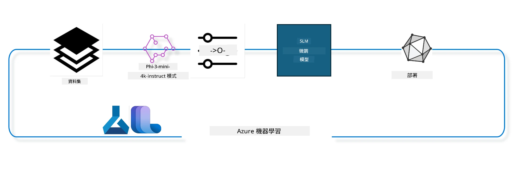

## 如何使用來自 Azure ML 系統註冊表的 chat-completion 元件進行模型微調

在此範例中，我們將使用 ultrachat_200k 資料集對 Phi-3-mini-4k-instruct 模型進行微調，以完成兩人對話的任務。



此範例將示範如何使用 Azure ML SDK 及 Python 進行微調，然後將微調後的模型部署到線上端點進行即時推論。

### 訓練資料

我們將使用 ultrachat_200k 資料集。這是 UltraChat 資料集經過嚴格篩選的版本，曾用於訓練 Zephyr-7B-β，該模型是最先進的 7b 聊天模型。

### 模型

我們將使用 Phi-3-mini-4k-instruct 模型，示範如何進行 chat-completion 任務的微調。如果您是從特定模型卡開啟此筆記本，記得更換為該特定模型名稱。

### 任務

- 選擇要微調的模型。
- 選擇並探索訓練資料。
- 設定微調工作。
- 執行微調工作。
- 檢視訓練及評估指標。
- 註冊微調後的模型。
- 部署微調後的模型以進行即時推論。
- 清理資源。

## 1. 設定前置條件

- 安裝相依套件
- 連接到 AzureML 工作區。詳細內容請參考設定 SDK 認證。請在下方替換 <WORKSPACE_NAME>、<RESOURCE_GROUP> 和 <SUBSCRIPTION_ID>。
- 連接到 azureml 系統註冊表
- 設定可選的實驗名稱
- 檢查或建立運算資源。

> [!NOTE]
> 要求為單一 GPU 節點並可擁有多張 GPU 卡。例如，Standard_NC24rs_v3 的一個節點擁有 4 張 NVIDIA V100 GPUs，而 Standard_NC12s_v3 節點則有 2 張 NVIDIA V100 GPUs。相關資訊請參考官方文件。每個節點的 GPU 張數設定在下方參數 gpus_per_node。正確設定此值可確保節點內所有 GPU 得以利用。推薦的 GPU 運算 SKU 可於此處與此處查閱。

### Python 函式庫

藉由執行以下程式碼區塊安裝相依套件。若在新環境執行，這不是可選步驟。

```bash
pip install azure-ai-ml
pip install azure-identity
pip install datasets==2.9.0
pip install mlflow
pip install azureml-mlflow
```

### 與 Azure ML 互動

1. 此 Python 腳本用於與 Azure Machine Learning (Azure ML) 服務互動。內容說明如下：

    - 匯入 azure.ai.ml、azure.identity 與 azure.ai.ml.entities 套件中的必要模組，並匯入 time 模組。

    - 嘗試以 DefaultAzureCredential() 進行驗證，這可簡化在 Azure 雲端執行應用程式的身份驗證流程。若失敗，則改使用 InteractiveBrowserCredential() 提供互動式登入提示。

    - 接著嘗試以 from_config 方法建立 MLClient 實例，該方法會從預設設定檔 (config.json) 中讀取配置。若失敗，則手動提供 subscription_id、resource_group_name 和 workspace_name 建立 MLClient 實例。

    - 建立另一個 MLClient 實例，目標為名稱為 "azureml" 的 Azure ML 註冊表，此註冊表用於儲存模型、微調管線及環境。

    - 將 experiment_name 設為 "chat_completion_Phi-3-mini-4k-instruct"。

    - 取得一組獨特的時間戳記，方法是將當前時間（自 Unix 紀元以來的秒數，浮點數形式）轉成整數，然後轉為字串。此時間戳記可用於產生獨特的名稱和版本。

    ```python
    # 從 Azure ML 和 Azure Identity 匯入必要模組
    from azure.ai.ml import MLClient
    from azure.identity import (
        DefaultAzureCredential,
        InteractiveBrowserCredential,
    )
    from azure.ai.ml.entities import AmlCompute
    import time  # 匯入時間模組
    
    # 嘗試使用 DefaultAzureCredential 進行驗證
    try:
        credential = DefaultAzureCredential()
        credential.get_token("https://management.azure.com/.default")
    except Exception as ex:  # 如果 DefaultAzureCredential 失敗，使用 InteractiveBrowserCredential
        credential = InteractiveBrowserCredential()
    
    # 嘗試使用預設設定檔建立 MLClient 實例
    try:
        workspace_ml_client = MLClient.from_config(credential=credential)
    except:  # 如果失敗，手動提供詳細資料建立 MLClient 實例
        workspace_ml_client = MLClient(
            credential,
            subscription_id="<SUBSCRIPTION_ID>",
            resource_group_name="<RESOURCE_GROUP>",
            workspace_name="<WORKSPACE_NAME>",
        )
    
    # 為名為 "azureml" 的 Azure ML 註冊表建立另一個 MLClient 實例
    # 此註冊表存放模型、微調流程及環境
    registry_ml_client = MLClient(credential, registry_name="azureml")
    
    # 設定實驗名稱
    experiment_name = "chat_completion_Phi-3-mini-4k-instruct"
    
    # 產生一個獨特的時間戳，可用於需要唯一名稱和版本的情況
    timestamp = str(int(time.time()))
    ```

## 2. 選擇要微調的基礎模型

1. Phi-3-mini-4k-instruct 是一款參數量為 3.8B 的輕量級最先進開放模型，基於 Phi-2 所用的資料集建構。該模型屬於 Phi-3 系列，其中 Mini 版本分別有 4K 與 128K 兩種變體，分別代表其可支援的上下文長度（以 token 為單位）。我們需針對特定用途微調此模型，才可使用。您可在 AzureML Studio 的模型目錄中瀏覽這些模型，並以 chat-completion 任務篩選。此範例使用 Phi-3-mini-4k-instruct 模型，如您開啟的筆記本屬於其它模型，請相應替換模型名稱與版本。

> [!NOTE]
> 此模型的 model id 屬性會作為微調工作的輸入。此資訊也顯示於 AzureML Studio 模型目錄中的資產 ID 欄位。

2. 以下 Python 程式與 Azure Machine Learning 服務互動，內容說明如下：

    - 將 model_name 設為 "Phi-3-mini-4k-instruct"。

    - 使用 registry_ml_client 物件的 models 屬性之 get 方法，從 Azure ML 註冊表取得該名稱模型的最新版本。get 方法帶入兩個參數：模型名稱與標籤，標示取得最新版本。

    - 顯示訊息於控制台，說明將用於微調的模型名稱、版本及 id。透過字串的 format 方法將 foundation_model 物件的 name、version 與 id 屬性插入訊息。

    ```python
    # 設定模型名稱
    model_name = "Phi-3-mini-4k-instruct"
    
    # 從 Azure ML 註冊表取得模型的最新版本
    foundation_model = registry_ml_client.models.get(model_name, label="latest")
    
    # 輸出模型名稱、版本及ID
    # 這些資訊對追蹤和除錯非常有用
    print(
        "\n\nUsing model name: {0}, version: {1}, id: {2} for fine tuning".format(
            foundation_model.name, foundation_model.version, foundation_model.id
        )
    )
    ```

## 3. 建立用於工作的運算資源

微調工作僅能使用 GPU 運算資源。運算資源的大小取決於模型規模，選擇適合的運算資源時常有挑戰。在此程式區塊，我們將引導使用者挑選合適的運算資源。

> [!NOTE]
> 下列列出的運算資源均使用最優化組態。若任意更動配置，可能導致 Cuda 記憶體不足錯誤。若發生此狀況，建議升級為較大規模的運算資源。

> [!NOTE]
> 選擇 compute_cluster_size 時，請確保該運算資源可於您的資源群組中取得。若無，您可提出申請以取得相關資源權限。

### 檢查模型是否支援微調

1. 以下 Python 程式與 Azure Machine Learning 模型互動，說明如下：

    - 匯入 ast 模組，該模組提供用於處理 Python 抽象語法樹的函式。

    - 檢查 foundation_model 物件（代表 Azure ML 中的模型）是否含有名為 finetune_compute_allow_list 的標籤。Azure ML 中的標籤是用於篩選與排序模型的鍵值對。

    - 若存在 finetune_compute_allow_list 標籤，則使用 ast.literal_eval 安全地解析該字串標籤值，轉換為 Python 列表，並指定給 computes_allow_list。接著列印訊息，提示使用者應從此清單建立運算資源。

    - 若該標籤不存在，將 computes_allow_list 設為 None，並列印訊息說明 finetune_compute_allow_list 標籤並非模型的標籤之一。

    - 總結來說，此程式碼檢查模型的特定標籤，若存在，將標籤值轉為清單格式，並提供相應回饋。

    ```python
    # 匯入 ast 模組，提供處理 Python 抽象語法樹的函數
    import ast
    
    # 檢查模型標籤中是否存在 'finetune_compute_allow_list' 標籤
    if "finetune_compute_allow_list" in foundation_model.tags:
        # 若標籤存在，使用 ast.literal_eval 安全地將標籤值（字串）解析為 Python 列表
        computes_allow_list = ast.literal_eval(
            foundation_model.tags["finetune_compute_allow_list"]
        )  # 將字串轉換成 Python 列表
        # 輸出訊息，指示應該從列表建立 compute
        print(f"Please create a compute from the above list - {computes_allow_list}")
    else:
        # 若標籤不存在，將 computes_allow_list 設為 None
        computes_allow_list = None
        # 輸出訊息，指示 'finetune_compute_allow_list' 標籤不在模型標籤中
        print("`finetune_compute_allow_list` is not part of model tags")
    ```

### 檢查運算資源實例

1. 該 Python 程式與 Azure Machine Learning 服務互動，並針對運算資源實例進行多項檢查，說明如下：

    - 嘗試從 Azure ML 工作區取得名稱為 compute_cluster 的運算資源實例。若該實例的資源狀態為 "failed"，則拋出 ValueError。

    - 若 computes_allow_list 非 None，則將清單中所有運算資源大小轉為小寫字串，並檢查當前運算資源尺寸是否在該清單中，若不在則拋出 ValueError。

    - 若 computes_allow_list 是 None，則檢查當前運算資源尺寸是否在不支援的 GPU 虛擬機大小列表裡，若在則拋出 ValueError。

    - 取得工作區中所有可用的運算資源大小。依序檢視各大小名稱，若與當前運算資源尺寸相符，即抓取該規格的 GPU 張數，並將 gpu_count_found 標記為 True。

    - 若 gpu_count_found 為 True，印出該運算資源所擁有的 GPU 數量。若為 False，則拋出 ValueError。

    - 總結來說，此程式對 Azure ML 運算資源進行多項檢查，包括其設定狀態、尺寸是否允許及 GPU 數量。

    ```python
    # 列印異常訊息
    print(e)
    # 如果計算資源大小在工作區中不可用，則引發 ValueError
    raise ValueError(
        f"WARNING! Compute size {compute_cluster_size} not available in workspace"
    )
    
    # 從 Azure ML 工作區中擷取計算實例
    compute = workspace_ml_client.compute.get(compute_cluster)
    # 檢查計算實例的佈建狀態是否為「失敗」
    if compute.provisioning_state.lower() == "failed":
        # 如果佈建狀態為「失敗」，則引發 ValueError
        raise ValueError(
            f"Provisioning failed, Compute '{compute_cluster}' is in failed state. "
            f"please try creating a different compute"
        )
    
    # 檢查 computes_allow_list 是否不為 None
    if computes_allow_list is not None:
        # 將 computes_allow_list 中所有的計算資源大小轉換為小寫
        computes_allow_list_lower_case = [x.lower() for x in computes_allow_list]
        # 檢查計算實例的大小是否在 computes_allow_list_lower_case 中
        if compute.size.lower() not in computes_allow_list_lower_case:
            # 如果計算實例的大小不在 computes_allow_list_lower_case 中，則引發 ValueError
            raise ValueError(
                f"VM size {compute.size} is not in the allow-listed computes for finetuning"
            )
    else:
        # 定義不支援的 GPU VM 大小清單
        unsupported_gpu_vm_list = [
            "standard_nc6",
            "standard_nc12",
            "standard_nc24",
            "standard_nc24r",
        ]
        # 檢查計算實例的大小是否在 unsupported_gpu_vm_list 中
        if compute.size.lower() in unsupported_gpu_vm_list:
            # 如果計算實例的大小在 unsupported_gpu_vm_list 中，則引發 ValueError
            raise ValueError(
                f"VM size {compute.size} is currently not supported for finetuning"
            )
    
    # 初始化一個旗標，用以檢查是否找到計算實例中的 GPU 數目
    gpu_count_found = False
    # 取得工作區內所有可用計算資源大小的清單
    workspace_compute_sku_list = workspace_ml_client.compute.list_sizes()
    available_sku_sizes = []
    # 對可用計算資源大小清單進行迭代
    for compute_sku in workspace_compute_sku_list:
        available_sku_sizes.append(compute_sku.name)
        # 檢查計算資源大小的名稱是否與計算實例的大小相符
        if compute_sku.name.lower() == compute.size.lower():
            # 若符合，則擷取該計算資源大小的 GPU 數目，並將 gpu_count_found 設為 True
            gpus_per_node = compute_sku.gpus
            gpu_count_found = True
    # 如果 gpu_count_found 為 True，則列印計算實例中的 GPU 數目
    if gpu_count_found:
        print(f"Number of GPU's in compute {compute.size}: {gpus_per_node}")
    else:
        # 如果 gpu_count_found 為 False，則引發 ValueError
        raise ValueError(
            f"Number of GPU's in compute {compute.size} not found. Available skus are: {available_sku_sizes}."
            f"This should not happen. Please check the selected compute cluster: {compute_cluster} and try again."
        )
    ```

## 4. 選擇用於模型微調的資料集

1. 我們使用 ultrachat_200k 資料集。資料集有四個拆分，適用於監督式微調 (sft) 與生成排序 (gen)。每個拆分包含的範例數量如下：

    ```bash
    train_sft test_sft  train_gen  test_gen
    207865  23110  256032  28304
    ```

1. 接下來幾個程式區塊示範基本的資料準備過程：

### 視覺化部分資料列

為使測試快速執行，我們保存了包含已裁剪列中 5% 的 train_sft 和 test_sft 檔案。這表示微調後的模型精確度較低，不適合用於實務環境。
使用 download-dataset.py 腳本下載 ultrachat_200k 資料集並轉換成微調管線元件可消費的格式。由於資料集較大，這裡僅有部分資料。

1. 執行下列程式碼僅下載資料的 5%。可透過修改 dataset_split_pc 參數來調整下載比例。

> [!NOTE]
> 部分語言模型使用不同語言代碼，因此資料集的欄位名稱應與之對應。

1. 以下為資料範例格式說明
chat-completion 資料集以 parquet 格式儲存，每筆資料依照下述結構：

    - 這是一份 JSON（JavaScript 物件表示法）文件，一種廣泛用於資料交換的格式。它不是可執行程式碼，而是資料存儲與傳輸方式。說明如下：

    - "prompt": 代表向 AI 助理提出的任務或問題之字串。

    - "messages": 包含一陣列物件，每個物件皆為使用者與 AI 助理間的對話訊息。每訊息物件含兩個鍵：

    - "content": 訊息內容的字串。
    - "role": 發送訊息的角色，為 "user" 或 "assistant"。

    - "prompt_id": 代表該提示的唯一識別碼字串。

1. 此 JSON 文件範例呈現一段對話，使用者請 AI 協助創作反烏托邦小說主角，助理回應後，使用者要求更多細節，助理同意提供。整段對話與特定 prompt id 關聯。

    ```python
    {
        // The task or question posed to an AI assistant
        "prompt": "Create a fully-developed protagonist who is challenged to survive within a dystopian society under the rule of a tyrant. ...",
        
        // An array of objects, each representing a message in a conversation between a user and an AI assistant
        "messages":[
            {
                // The content of the user's message
                "content": "Create a fully-developed protagonist who is challenged to survive within a dystopian society under the rule of a tyrant. ...",
                // The role of the entity that sent the message
                "role": "user"
            },
            {
                // The content of the assistant's message
                "content": "Name: Ava\n\n Ava was just 16 years old when the world as she knew it came crashing down. The government had collapsed, leaving behind a chaotic and lawless society. ...",
                // The role of the entity that sent the message
                "role": "assistant"
            },
            {
                // The content of the user's message
                "content": "Wow, Ava's story is so intense and inspiring! Can you provide me with more details.  ...",
                // The role of the entity that sent the message
                "role": "user"
            }, 
            {
                // The content of the assistant's message
                "content": "Certainly! ....",
                // The role of the entity that sent the message
                "role": "assistant"
            }
        ],
        
        // A unique identifier for the prompt
        "prompt_id": "d938b65dfe31f05f80eb8572964c6673eddbd68eff3db6bd234d7f1e3b86c2af"
    }
    ```

### 下載資料

1. 這段 Python 程式用於執行下載資料集的輔助腳本 download-dataset.py，說明如下：

    - 匯入 os 模組，提供跨平台使用作業系統功能。

    - 使用 os.system 函式呼叫 shell 執行 download-dataset.py 腳本，帶入下載資料集名稱 (HuggingFaceH4/ultrachat_200k)、下載目錄 (ultrachat_200k_dataset) 和資料拆分百分比 (5)。os.system 回傳執行狀態碼，存入 exit_status。

    - 若 exit_status 非 0（通常 0 代表命令成功執行，非零表示錯誤），則拋出 Exception，提示下載資料集中出錯。

    - 總結而言，該段程式碼負責透過輔助腳本下載資料集，若下載失敗則報錯。

    ```python
    # 引入 os 模組，提供使用作業系統相關功能的方法
    import os
    
    # 使用 os.system 函數在 shell 中執行 download-dataset.py 腳本並帶入特定命令列參數
    # 參數指定要下載的資料集（HuggingFaceH4/ultrachat_200k）、下載目錄（ultrachat_200k_dataset），及資料集分割百分比（5）
    # os.system 函數回傳執行命令的退出狀態；此狀態被儲存在 exit_status 變數中
    exit_status = os.system(
        "python ./download-dataset.py --dataset HuggingFaceH4/ultrachat_200k --download_dir ultrachat_200k_dataset --dataset_split_pc 5"
    )
    
    # 檢查 exit_status 是否不等於 0
    # 在類 Unix 作業系統中，退出狀態 0 通常代表命令執行成功，其他數字代表錯誤
    # 若 exit_status 不等於 0，拋出 Exception 並顯示下載資料集時發生錯誤的訊息
    if exit_status != 0:
        raise Exception("Error downloading dataset")
    ```

### 將資料載入資料框架 (DataFrame)
1. 此 Python 腳本將 JSON Lines 檔案載入 pandas DataFrame 並顯示前 5 行。以下是其工作原理概述：

    - 它匯入 pandas 函式庫，這是一個強大的資料操作和分析函式庫。

    - 它將 pandas 顯示選項中的最大欄寬設定為 0。這表示在列印 DataFrame 時，每個欄位的完整文字將會顯示，不會被截斷。

    - 它使用 pd.read_json 函數從 ultrachat_200k_dataset 目錄載入 train_sft.jsonl 檔案到 DataFrame 中。參數 lines=True 表示該檔案為 JSON Lines 格式，每一行都是一個獨立的 JSON 物件。

    - 它使用 head 方法顯示 DataFrame 的前 5 行。如果 DataFrame 少於 5 行，則顯示全部。

    - 總結來說，此腳本是將 JSON Lines 檔案載入 DataFrame，並顯示前 5 行包含完整欄位文字。
    
    ```python
    # 引入 pandas 函式庫，這是一個強大的資料處理及分析函式庫
    import pandas as pd
    
    # 設定 pandas 顯示選項中的最大欄寬為 0
    # 這表示在列印 DataFrame 時，每個欄位的完整文字將會被顯示而不會被截斷
    pd.set_option("display.max_colwidth", 0)
    
    # 使用 pd.read_json 函式將 ultrachat_200k_dataset 目錄下的 train_sft.jsonl 檔案讀取成一個 DataFrame
    # lines=True 參數表示該檔案是 JSON Lines 格式，每一行都是一個獨立的 JSON 物件
    df = pd.read_json("./ultrachat_200k_dataset/train_sft.jsonl", lines=True)
    
    # 使用 head 方法顯示 DataFrame 的前 5 行
    # 如果 DataFrame 少於 5 行，將會顯示所有資料行
    df.head()
    ```

## 5. 使用模型和資料作為輸入提交微調任務

建立使用 chat-completion 管道元件的工作。進一步了解所有支持微調的參數。

### 定義微調參數

1. 微調參數可分為兩類 - 訓練參數及優化參數

1. 訓練參數定義訓練相關方面，例如 -

    - 使用的優化器與排程器
    - 用於微調優化的指標
    - 訓練步數及批次大小等
    - 優化參數協助優化 GPU 記憶體並有效利用運算資源。

1. 以下是屬於此類別的部分參數。優化參數因模型而異，且會隨模型一同封裝以處理這些差異。

    - 啟用 deepspeed 與 LoRA
    - 啟用混合精度訓練
    - 啟用多節點訓練

> [!NOTE]
> 監督式微調可能導致對齊丟失或災難性遺忘。我們建議檢查此問題並在微調後執行對齊階段。

### 微調參數

1. 此 Python 腳本正設定機器學習模型微調參數。以下是工作原理：

    - 設定預設訓練參數，例如訓練訓練週期數、訓練與評估批次大小、學習率及學習率排程器種類。

    - 設定預設優化參數，例如是否應用 Layer-wise Relevance Propagation (LoRa) 和 DeepSpeed，以及 DeepSpeed 階段。

    - 將訓練參數及優化參數合併成單一字典 finetune_parameters。

    - 檢查 foundation_model 是否具有任何模型特定預設參數。若有，則印出警告訊息，並使用 ast.literal_eval 函數將模型特定預設參數從字串轉為 Python 字典，並更新 finetune_parameters。

    - 印出將用於執行的最終微調參數集。

    - 總結來說，此腳本設定並顯示機器學習模型的微調參數，並可用模型特定參數覆蓋預設值。

    ```python
    # 設定預設訓練參數，例如訓練的世代數、訓練及評估的批次大小、學習率及學習率調度器類型
    training_parameters = dict(
        num_train_epochs=3,
        per_device_train_batch_size=1,
        per_device_eval_batch_size=1,
        learning_rate=5e-6,
        lr_scheduler_type="cosine",
    )
    
    # 設定預設優化參數，例如是否應用層級相關性傳遞（LoRa）及DeepSpeed，及DeepSpeed階段
    optimization_parameters = dict(
        apply_lora="true",
        apply_deepspeed="true",
        deepspeed_stage=2,
    )
    
    # 將訓練及優化參數合併成一個名為finetune_parameters的字典
    finetune_parameters = {**training_parameters, **optimization_parameters}
    
    # 檢查foundation_model是否有任何模型特定的預設參數
    # 如果有，打印警告訊息並用這些模型特定的預設值更新finetune_parameters字典
    # ast.literal_eval函數用於將模型特定的預設值從字串轉換為Python字典
    if "model_specific_defaults" in foundation_model.tags:
        print("Warning! Model specific defaults exist. The defaults could be overridden.")
        finetune_parameters.update(
            ast.literal_eval(  # 將字串轉換為python字典
                foundation_model.tags["model_specific_defaults"]
            )
        )
    
    # 打印將用於此次運行的最終微調參數集
    print(
        f"The following finetune parameters are going to be set for the run: {finetune_parameters}"
    )
    ```

### 訓練管道

1. 此 Python 腳本定義一個函數以生成機器學習訓練管道的顯示名稱，並呼叫該函數以生成及列印顯示名稱。其工作原理如下：

1. 定義了 get_pipeline_display_name 函數。該函數根據與訓練管道相關的多個參數產生顯示名稱。

1. 函數內計算總批次大小，方法為每設備批次大小乘以梯度累積步數，再乘以每節點 GPU 數量，最後乘以微調使用的節點數。

1. 取得其他多個參數，如學習率排程器類型、是否啟用 DeepSpeed、DeepSpeed 階段、是否啟用 Layer-wise Relevance Propagation (LoRa)、保留的模型檢查點數量上限，以及最大序列長度。

1. 建構一個字串，包含所有這些參數並以破折號分隔。若啟用 DeepSpeed 或 LoRa，字串包含分別為 "ds" 加上 DeepSpeed 階段，或 "lora"；未啟用則分別是 "nods" 或 "nolora"。

1. 函數回傳此字串，作為訓練管道的顯示名稱。

1. 定義函數後，呼叫該函數生成顯示名稱，並列印輸出。

1. 總結來說，此腳本根據多個參數產生機器學習訓練管道的顯示名稱，並將其列印出來。

    ```python
    # 定義一個函數來生成訓練流程的顯示名稱
    def get_pipeline_display_name():
        # 通過將每個設備的批次大小、梯度累積步數、每個節點的 GPU 數量以及用於微調的節點數相乘來計算總批次大小
        batch_size = (
            int(finetune_parameters.get("per_device_train_batch_size", 1))
            * int(finetune_parameters.get("gradient_accumulation_steps", 1))
            * int(gpus_per_node)
            * int(finetune_parameters.get("num_nodes_finetune", 1))
        )
        # 獲取學習率調度器類型
        scheduler = finetune_parameters.get("lr_scheduler_type", "linear")
        # 獲取是否應用 DeepSpeed
        deepspeed = finetune_parameters.get("apply_deepspeed", "false")
        # 獲取 DeepSpeed 階段
        ds_stage = finetune_parameters.get("deepspeed_stage", "2")
        # 如果應用 DeepSpeed，在顯示名稱中包含「ds」加上 DeepSpeed 階段；如果沒有，則包含「nods」
        if deepspeed == "true":
            ds_string = f"ds{ds_stage}"
        else:
            ds_string = "nods"
        # 獲取是否應用層次相關性傳播 (LoRa)
        lora = finetune_parameters.get("apply_lora", "false")
        # 如果應用 LoRa，在顯示名稱中包含「lora」；如果沒有，則包含「nolora」
        if lora == "true":
            lora_string = "lora"
        else:
            lora_string = "nolora"
        # 獲取保留模型檢查點數量的限制
        save_limit = finetune_parameters.get("save_total_limit", -1)
        # 獲取最大序列長度
        seq_len = finetune_parameters.get("max_seq_length", -1)
        # 通過將所有這些參數用連字符連接起來來構建顯示名稱
        return (
            model_name
            + "-"
            + "ultrachat"
            + "-"
            + f"bs{batch_size}"
            + "-"
            + f"{scheduler}"
            + "-"
            + ds_string
            + "-"
            + lora_string
            + f"-save_limit{save_limit}"
            + f"-seqlen{seq_len}"
        )
    
    # 調用函數生成顯示名稱
    pipeline_display_name = get_pipeline_display_name()
    # 輸出顯示名稱
    print(f"Display name used for the run: {pipeline_display_name}")
    ```

### 配置管道

此 Python 腳本使用 Azure Machine Learning SDK 定義並配置機器學習管道。以下是工作原理：

1. 從 Azure AI ML SDK 匯入必要模組。

1. 從註冊表中取得名為 "chat_completion_pipeline" 的管道元件。

1. 使用 `@pipeline` 裝飾器和函數 `create_pipeline` 定義管道工作，並將管道名稱設定為 `pipeline_display_name`。

1. 在 `create_pipeline` 函數內，以多個參數初始化取得的管道元件，包含模型路徑、不同階段使用的計算叢集、訓練及測試的資料集分割、微調時使用的 GPU 數量，以及其他微調參數。

1. 將微調工作輸出映射為管道工作的輸出，方便註冊微調後模型，這是部署模型到線上或批次端點所需的。

1. 呼叫 `create_pipeline` 函數建立管道實例。

1. 將管道的 `force_rerun` 設定為 `True`，表示不使用過去工作的快取結果。

1. 將管道的 `continue_on_step_failure` 設定為 `False`，表示任一步驟失敗時即停止管道。

1. 總結來說，此腳本利用 Azure Machine Learning SDK 定義並配置用於聊天補全任務的機器學習管道。

    ```python
    # 從 Azure AI ML SDK 匯入必要模組
    from azure.ai.ml.dsl import pipeline
    from azure.ai.ml import Input
    
    # 從註冊中心獲取名為 "chat_completion_pipeline" 的管道組件
    pipeline_component_func = registry_ml_client.components.get(
        name="chat_completion_pipeline", label="latest"
    )
    
    # 使用 @pipeline 裝飾器和函數 create_pipeline 定義管道任務
    # 管道的名稱設置為 pipeline_display_name
    @pipeline(name=pipeline_display_name)
    def create_pipeline():
        # 使用各種參數初始化獲取的管道組件
        # 包含模型路徑、不同階段的計算叢集、訓練和測試的數據集切割、用於微調的 GPU 數量以及其他微調參數
        chat_completion_pipeline = pipeline_component_func(
            mlflow_model_path=foundation_model.id,
            compute_model_import=compute_cluster,
            compute_preprocess=compute_cluster,
            compute_finetune=compute_cluster,
            compute_model_evaluation=compute_cluster,
            # 將數據集切割映射到參數
            train_file_path=Input(
                type="uri_file", path="./ultrachat_200k_dataset/train_sft.jsonl"
            ),
            test_file_path=Input(
                type="uri_file", path="./ultrachat_200k_dataset/test_sft.jsonl"
            ),
            # 訓練設定
            number_of_gpu_to_use_finetuning=gpus_per_node,  # 設置為計算資源中可用的 GPU 數量
            **finetune_parameters
        )
        return {
            # 將微調作業的輸出映射到管道任務的輸出
            # 這樣做是為了方便註冊微調後的模型
            # 註冊模型是將模型部署到線上或批次端點所必須的
            "trained_model": chat_completion_pipeline.outputs.mlflow_model_folder
        }
    
    # 透過呼叫 create_pipeline 函數創建管道實例
    pipeline_object = create_pipeline()
    
    # 不使用之前作業的快取結果
    pipeline_object.settings.force_rerun = True
    
    # 設置在步驟失敗時不繼續執行
    # 這表示如果任何步驟失敗管道將停止執行
    pipeline_object.settings.continue_on_step_failure = False
    ```

### 提交工作

1. 此 Python 腳本向 Azure Machine Learning 工作區提交機器學習管道工作，並等待工作完成。其工作原理：

    - 使用 workspace_ml_client 的 jobs 物件的 create_or_update 方法提交管道工作。運行的管道由 pipeline_object 指定，實驗名稱由 experiment_name 指定。

    - 透過 workspace_ml_client 的 jobs 物件的 stream 方法等待管道工作完成。待完成的工作由 pipeline_job 物件的 name 屬性指定。

    - 總結，此腳本向 Azure Machine Learning 工作區提交管道工作，並等待其完成。

    ```python
    # 將資料流程作業提交到 Azure Machine Learning 工作區
    # 要執行的資料流程由 pipeline_object 指定
    # 執行作業的實驗由 experiment_name 指定
    pipeline_job = workspace_ml_client.jobs.create_or_update(
        pipeline_object, experiment_name=experiment_name
    )
    
    # 等待資料流程作業完成
    # 要等待的作業由 pipeline_job 物件的 name 屬性指定
    workspace_ml_client.jobs.stream(pipeline_job.name)
    ```

## 6. 在工作區註冊微調模型

我們將從微調工作的輸出註冊模型。這會追蹤微調模型與微調工作的關聯。微調工作進一步追蹤基礎模型、資料及訓練程式碼之來源關係。

### 註冊機器學習模型

1. 此 Python 腳本註冊在 Azure Machine Learning 管道中訓練的機器學習模型。工作原理如下：

    - 從 Azure AI ML SDK 匯入必要模組。

    - 透過 workspace_ml_client 的 jobs 物件的 get 方法，並存取其 outputs 屬性，檢查管道工作是否有 trained_model 輸出。

    - 建構路徑，格式化字串使用管道工作名稱及輸出名稱 "trained_model"。

    - 定義微調模型名稱，將原始模型名稱加上 "-ultrachat-200k" 後綴，並將斜線替換為破折號。

    - 預備註冊模型，建立 Model 物件，包含模型路徑、模型類型（MLflow 模型）、模型名稱與版本，以及模型描述。

    - 呼叫 workspace_ml_client 的 models 物件的 create_or_update 方法，並傳入 Model 物件，完成模型註冊。

    - 印出已註冊模型資訊。

1. 總結，此腳本註冊在 Azure Machine Learning 管道中訓練的機器學習模型。
    
    ```python
    # 從 Azure AI ML SDK 匯入必要的模組
    from azure.ai.ml.entities import Model
    from azure.ai.ml.constants import AssetTypes
    
    # 檢查 pipeline job 是否有輸出 `trained_model`
    print("pipeline job outputs: ", workspace_ml_client.jobs.get(pipeline_job.name).outputs)
    
    # 透過格式化字串，使用 pipeline job 名稱及輸出名稱（"trained_model"）來構造訓練模型的路徑
    model_path_from_job = "azureml://jobs/{0}/outputs/{1}".format(
        pipeline_job.name, "trained_model"
    )
    
    # 透過在原始模型名稱後新增 "-ultrachat-200k" 並將所有斜線替換成連字號，定義微調模型名稱
    finetuned_model_name = model_name + "-ultrachat-200k"
    finetuned_model_name = finetuned_model_name.replace("/", "-")
    
    print("path to register model: ", model_path_from_job)
    
    # 準備註冊模型，建立一個帶有多種參數的 Model 物件
    # 這些參數包括模型路徑、模型類型（MLflow 模型）、模型名稱與版本，以及模型說明
    prepare_to_register_model = Model(
        path=model_path_from_job,
        type=AssetTypes.MLFLOW_MODEL,
        name=finetuned_model_name,
        version=timestamp,  # 使用時間戳記作為版本以避免版本衝突
        description=model_name + " fine tuned model for ultrachat 200k chat-completion",
    )
    
    print("prepare to register model: \n", prepare_to_register_model)
    
    # 透過 workspace_ml_client 中的 models 物件呼叫 create_or_update 方法，並以 Model 物件為參數註冊模型
    registered_model = workspace_ml_client.models.create_or_update(
        prepare_to_register_model
    )
    
    # 列印已註冊的模型
    print("registered model: \n", registered_model)
    ```

## 7. 將微調模型部署至線上端點

線上端點提供持久 REST API，可用於與需使用模型的應用程式整合。

### 管理端點

1. 此 Python 腳本在 Azure Machine Learning 中為註冊模型建立管理型線上端點。其工作原理：

    - 從 Azure AI ML SDK 匯入必要模組。

    - 透過加上時間戳記形成唯一名稱，如 "ultrachat-completion-" 後接時間戳。

    - 預備建立端點，建立 ManagedOnlineEndpoint 物件，包含端點名稱、說明，以及驗證模式（"key"）。

    - 呼叫 workspace_ml_client 的 begin_create_or_update 方法，並傳入 ManagedOnlineEndpoint 物件，建立線上端點，並透過 wait 方法等待完成。

1. 總結，此腳本在 Azure Machine Learning 中為註冊模型建立管理型線上端點。

    ```python
    # 從 Azure AI ML SDK 匯入必要的模組
    from azure.ai.ml.entities import (
        ManagedOnlineEndpoint,
        ManagedOnlineDeployment,
        ProbeSettings,
        OnlineRequestSettings,
    )
    
    # 通過在字串 "ultrachat-completion-" 後加上時間戳來定義線上端點的唯一名稱
    online_endpoint_name = "ultrachat-completion-" + timestamp
    
    # 準備建立線上端點，通過建立一個帶有多個參數的 ManagedOnlineEndpoint 物件
    # 這些參數包括端點名稱、端點描述以及認證模式 ("key")
    endpoint = ManagedOnlineEndpoint(
        name=online_endpoint_name,
        description="Online endpoint for "
        + registered_model.name
        + ", fine tuned model for ultrachat-200k-chat-completion",
        auth_mode="key",
    )
    
    # 通過調用 workspace_ml_client 的 begin_create_or_update 方法並以 ManagedOnlineEndpoint 物件作為參數來建立線上端點
    # 然後通過調用 wait 方法等待建立操作完成
    workspace_ml_client.begin_create_or_update(endpoint).wait()
    ```

> [!NOTE]
> 您可以在此找到支持部署的 SKU 清單 - [Managed online endpoints SKU list](https://learn.microsoft.com/azure/machine-learning/reference-managed-online-endpoints-vm-sku-list)

### 部署機器學習模型

1. 此 Python 腳本將已註冊的機器學習模型部署至 Azure Machine Learning 的管理型線上端點。工作原理如下：

    - 匯入 ast 模組，提供處理 Python 抽象語法樹的功能。

    - 將部署實例類型設定為 "Standard_NC6s_v3"。

    - 檢查 foundation_model 中是否存在 inference_compute_allow_list 標籤。若有，將標籤值由字串轉為 Python 清單並賦值給 inference_computes_allow_list，否則設定為 None。

    - 檢查指定的實例類型是否在允許清單中，若否，印出訊息提示使用者從允許清單中選擇實例類型。

    - 預備建立部署，建立 ManagedOnlineDeployment 物件，包含部署名稱、端點名稱、模型 ID、實例類型與數量、活躍度探針設定及請求設定。

    - 呼叫 workspace_ml_client 的 begin_create_or_update 方法，並傳入 ManagedOnlineDeployment 物件，建立部署，並透過 wait 方法等待完成。

    - 將端點流量設定為將 100% 流量導向名為 "demo" 的部署。

    - 呼叫 workspace_ml_client 的 begin_create_or_update 方法更新端點，並透過 result 方法等待更新完成。

1. 總結，此腳本將已註冊的機器學習模型部署至 Azure Machine Learning 的管理型線上端點。

    ```python
    # 匯入 ast 模組，該模組提供處理 Python 抽象語法樹的函數
    import ast
    
    # 設置部署的實例類型
    instance_type = "Standard_NC6s_v3"
    
    # 檢查基礎模型中是否存在 `inference_compute_allow_list` 標籤
    if "inference_compute_allow_list" in foundation_model.tags:
        # 如果存在，將標籤值從字串轉換為 Python 列表，並將其分配給 `inference_computes_allow_list`
        inference_computes_allow_list = ast.literal_eval(
            foundation_model.tags["inference_compute_allow_list"]
        )
        print(f"Please create a compute from the above list - {computes_allow_list}")
    else:
        # 如果不存在，將 `inference_computes_allow_list` 設置為 `None`
        inference_computes_allow_list = None
        print("`inference_compute_allow_list` is not part of model tags")
    
    # 檢查指定的實例類型是否在允許列表中
    if (
        inference_computes_allow_list is not None
        and instance_type not in inference_computes_allow_list
    ):
        print(
            f"`instance_type` is not in the allow listed compute. Please select a value from {inference_computes_allow_list}"
        )
    
    # 通過創建 `ManagedOnlineDeployment` 對象並設置各種參數來準備創建部署
    demo_deployment = ManagedOnlineDeployment(
        name="demo",
        endpoint_name=online_endpoint_name,
        model=registered_model.id,
        instance_type=instance_type,
        instance_count=1,
        liveness_probe=ProbeSettings(initial_delay=600),
        request_settings=OnlineRequestSettings(request_timeout_ms=90000),
    )
    
    # 通過調用 `workspace_ml_client` 的 `begin_create_or_update` 方法，並傳入 `ManagedOnlineDeployment` 對象來創建部署
    # 然後通過調用 `wait` 方法等待創建操作完成
    workspace_ml_client.online_deployments.begin_create_or_update(demo_deployment).wait()
    
    # 將端點的流量設置為將 100% 流量導向 "demo" 部署
    endpoint.traffic = {"demo": 100}
    
    # 通過調用 `workspace_ml_client` 的 `begin_create_or_update` 方法並傳入 `endpoint` 對象來更新端點
    # 然後通過調用 `result` 方法等待更新操作完成
    workspace_ml_client.begin_create_or_update(endpoint).result()
    ```

## 8. 使用範例資料測試端點

我們將從測試資料集中擷取一些範例資料，並提交至線上端點進行推理。接著顯示推論標籤與真實標籤。

### 讀取結果

1. 此 Python 腳本將 JSON Lines 檔案讀入 pandas DataFrame，抽取隨機樣本並重設索引。其工作原理：

    - 使用 read_json 函數載入 ./ultrachat_200k_dataset/test_gen.jsonl 檔案到 pandas DataFrame。因檔案為 JSON Lines 格式，每行為獨立 JSON 物件，故使用 lines=True 參數。

    - 隨機抽取 1 筆資料。sample 函數帶入 n=1 表示抽取 1 筆隨機資料。

    - 利用 reset_index 函數重設索引，並以 drop=True 參數丟棄原索引，改用預設整數索引。

    - 使用 head 函數並帶入參數 2 顯示 DataFrame 前 2 行，但由於抽樣後只有 1 行，實際只會顯示該 1 行。

1. 總結，此腳本將 JSON Lines 檔案讀入 pandas DataFrame，抽取 1 筆隨機樣本，重設索引，並顯示該資料列。
    
    ```python
    # 匯入 pandas 函式庫
    import pandas as pd
    
    # 將 JSON Lines 檔案 './ultrachat_200k_dataset/test_gen.jsonl' 讀取為 pandas 的 DataFrame
    # 'lines=True' 參數表示該檔案為 JSON Lines 格式，每行是一個獨立的 JSON 物件
    test_df = pd.read_json("./ultrachat_200k_dataset/test_gen.jsonl", lines=True)
    
    # 從 DataFrame 中隨機抽取 1 行
    # 'n=1' 參數指定要選取的隨機行數
    test_df = test_df.sample(n=1)
    
    # 重設 DataFrame 的索引
    # 'drop=True' 參數表示丟棄原本的索引，並用預設整數索引取代
    # 'inplace=True' 參數表示直接在原本的 DataFrame 上進行修改（不建立新物件）
    test_df.reset_index(drop=True, inplace=True)
    
    # 顯示 DataFrame 的前 2 行
    # 但因為抽樣後 DataFrame 只有一行，所以只會顯示該行
    test_df.head(2)
    ```

### 建立 JSON 物件
1. 這個 Python 腳本是建立一個帶有特定參數的 JSON 物件並將其儲存到檔案中。以下是它的操作細節：

    - 它匯入了 json 模組，提供處理 JSON 資料的函式。

    - 它建立了一個名為 parameters 的字典，包含代表機器學習模型參數的鍵和值。鍵為 "temperature"、"top_p"、"do_sample" 和 "max_new_tokens"，對應值分別是 0.6、0.9、True 和 200。

    - 它又建立了另一個字典 test_json，有兩個鍵："input_data" 和 "params"。"input_data" 的值是另一個字典，包含鍵 "input_string" 和 "parameters"。"input_string" 的值是一個列表，裡面包含 test_df DataFrame 的第一條訊息。"parameters" 的值是先前建立的 parameters 字典。"params" 的值是一個空字典。

    - 它開啟一個名為 sample_score.json 的檔案
    
    ```python
    # 匯入 json 模組，該模組提供處理 JSON 數據的函數
    import json
    
    # 建立一個字典 `parameters`，其鍵值對代表機器學習模型的參數
    # 鍵分別為 "temperature"、"top_p"、"do_sample" 和 "max_new_tokens"，對應的值分別是 0.6、0.9、True 和 200
    parameters = {
        "temperature": 0.6,
        "top_p": 0.9,
        "do_sample": True,
        "max_new_tokens": 200,
    }
    
    # 建立另一個字典 `test_json`，包含兩個鍵："input_data" 和 "params"
    # "input_data" 的值是另一個字典，鍵為 "input_string" 和 "parameters"
    # "input_string" 的值是一個包含來自 `test_df` DataFrame 的首條訊息的列表
    # "parameters" 的值是先前建立的 `parameters` 字典
    # "params" 的值是一個空字典
    test_json = {
        "input_data": {
            "input_string": [test_df["messages"][0]],
            "parameters": parameters,
        },
        "params": {},
    }
    
    # 以寫入模式打開位於 `./ultrachat_200k_dataset` 目錄下名為 `sample_score.json` 的文件
    with open("./ultrachat_200k_dataset/sample_score.json", "w") as f:
        # 使用 `json.dump` 函數將 `test_json` 字典以 JSON 格式寫入文件
        json.dump(test_json, f)
    ```

### 呼叫端點

1. 這個 Python 腳本用於呼叫 Azure 機器學習上的線上端點，以對 JSON 檔案進行評分。以下是其操作說明：

    - 它調用了 workspace_ml_client 物件的 online_endpoints 屬性中的 invoke 方法。此方法用來向線上端點發送請求並獲取回應。

    - 它透過 endpoint_name 和 deployment_name 參數指定端點名稱和部署名稱。此例中，端點名稱存放在 online_endpoint_name 變數，部署名稱為 "demo"。

    - 它以 request_file 參數指定要評分的 JSON 檔案路徑，這裡為 ./ultrachat_200k_dataset/sample_score.json。

    - 它將從端點獲得的回應存到 response 變數中。

    - 它列印出原始回應。

1. 總結來說，這段程式碼是在呼叫 Azure 機器學習的線上端點針對 JSON 檔案進行評分，並印出回應結果。

    ```python
    # 調用 Azure 機器學習中的線上端點，以評分 `sample_score.json` 檔案
    # 使用 `workspace_ml_client` 物件的 `online_endpoints` 屬性的 `invoke` 方法，向線上端點發送請求並獲取回應
    # `endpoint_name` 參數指定端點的名稱，該名稱存儲在 `online_endpoint_name` 變數中
    # `deployment_name` 參數指定部署的名稱，該名稱為 "demo"
    # `request_file` 參數指定要評分的 JSON 檔案路徑，為 `./ultrachat_200k_dataset/sample_score.json`
    response = workspace_ml_client.online_endpoints.invoke(
        endpoint_name=online_endpoint_name,
        deployment_name="demo",
        request_file="./ultrachat_200k_dataset/sample_score.json",
    )
    
    # 輸出端點回傳的原始回應
    print("raw response: \n", response, "\n")
    ```

## 9. 刪除線上端點

1. 不要忘記刪除線上端點，否則端點使用的計算資源會持續計費。這行 Python 代碼用於刪除 Azure 機器學習的線上端點。以下是細節說明：

    - 它調用了 workspace_ml_client 物件 online_endpoints 屬性中的 begin_delete 方法，此方法用於啟動線上端點的刪除程序。

    - 它透過 name 參數指定要刪除的端點名稱，這裡名稱存放於 online_endpoint_name 變數。

    - 它調用了 wait 方法以等待刪除操作完成。這是一個阻塞操作，執行期間會暫停腳本直到刪除結束。

    - 總而言之，此行程式碼啟動 Azure 機器學習線上端點的刪除程序，並等待該操作完成。

    ```python
    # 刪除 Azure 機器學習中的線上端點
    # 使用 `workspace_ml_client` 物件的 `online_endpoints` 屬性的 `begin_delete` 方法來開始刪除線上端點
    # `name` 參數指定要刪除的端點名稱，該名稱儲存在 `online_endpoint_name` 變數中
    # 呼叫 `wait` 方法以等待刪除操作完成。這是一個阻塞操作，意味著在刪除完成之前，腳本將無法繼續執行
    workspace_ml_client.online_endpoints.begin_delete(name=online_endpoint_name).wait()
    ```

---

<!-- CO-OP TRANSLATOR DISCLAIMER START -->
**免責聲明**：  
本文件經由 AI 翻譯服務 [Co-op Translator](https://github.com/Azure/co-op-translator) 翻譯而成。雖然我們致力於確保準確性，但請注意自動翻譯可能包含錯誤或不準確之處。原始文件之母語版本應視為權威來源。對於重要資訊，建議採用專業人工翻譯。我們對因使用本翻譯而引致的任何誤解或誤釋概不負責。
<!-- CO-OP TRANSLATOR DISCLAIMER END -->