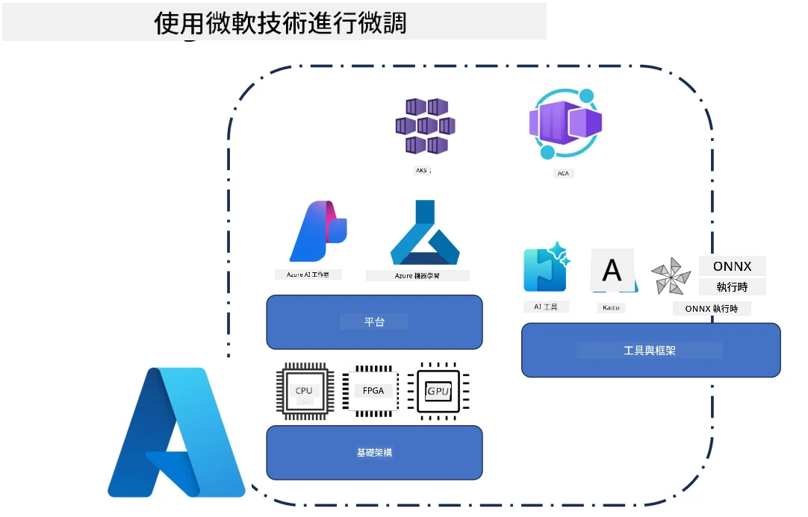
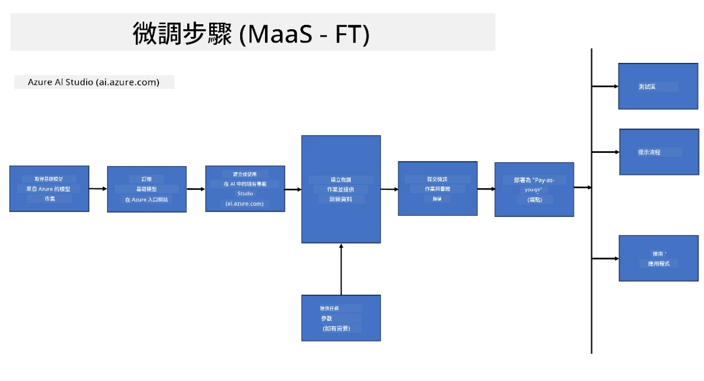
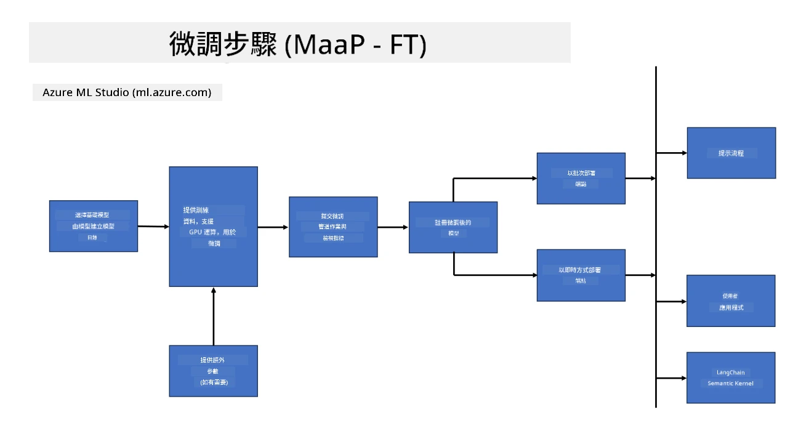
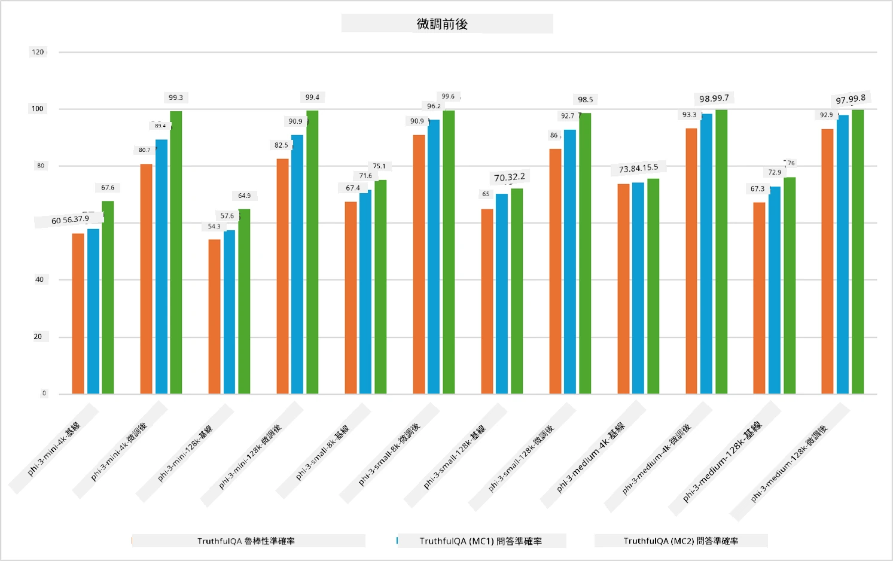

## 微調場景

本節介紹 Microsoft Foundry 及 Azure 環境中的微調場景概述，包括部署模型、基礎架構層及常用的優化技術。

**平台**  
包括如 Microsoft Foundry（前稱 Azure AI Foundry）及 Azure Machine Learning 等託管服務，提供模型管理、編排、實驗追蹤及部署工作流。

**基礎架構**  
微調需要可擴展的計算資源。在 Azure 環境中，通常包括基於 GPU 的虛擬機及用於輕量工作負載的 CPU 資源，還有用於數據集和檢查點的可擴展存儲。

**工具與框架**  
微調工作流程通常依賴如 Hugging Face Transformers、DeepSpeed 及 PEFT（參數高效微調）等框架與優化庫。

利用 Microsoft 技術的微調過程涵蓋平台服務、計算基礎架構與訓練框架。透過了解這些組件如何協同運作，開發者能有效地將基礎模型調整至特定任務和生產場景。

## 模型即服務

透過已託管的微調功能進行模型微調，無需自行建立及管理計算資源。

伺服器無需管理的微調現已支援 Phi-3、Phi-3.5 及 Phi-4 模型系列，讓開發者能快速且輕鬆地為雲端和邊緣場景自訂模型，無需安排計算資源。

## 模型即平台

用戶自行管理計算資源以微調其模型。

[微調示例](https://github.com/Azure/azureml-examples/blob/main/sdk/python/foundation-models/system/finetune/chat-completion/chat-completion.ipynb)

## 微調技術比較

|場景|LoRA|QLoRA|PEFT|DeepSpeed|ZeRO|DoRA|
|---|---|---|---|---|---|---|
|將預訓練大型語言模型 (LLM) 適應至特定任務或領域|是|是|是|是|是|是|
|微調自然語言處理任務，如文本分類、命名實體識別及機器翻譯|是|是|是|是|是|是|
|微調問答任務|是|是|是|是|是|是|
|微調以產生類似人類回應的聊天機器人|是|是|是|是|是|是|
|微調產生音樂、藝術或其他形式創作|是|是|是|是|是|是|
|降低計算與財務成本|是|是|是|是|是|是|
|降低記憶體使用量|是|是|是|是|是|是|
|使用更少參數實現高效微調|是|是|是|否|否|是|
|節省記憶體的數據並行形式，可存取所有 GPU 裝置的總體 GPU 記憶體|否|否|否|是|是|否|

> [!NOTE]
> LoRA、QLoRA、PEFT 和 DoRA 是參數高效微調方法，而 DeepSpeed 與 ZeRO 則專注於分散式訓練與記憶體優化。

## 微調效能範例

---

<!-- CO-OP TRANSLATOR DISCLAIMER START -->
**免責聲明**：  
本文件由 AI 翻譯服務 [Co-op Translator](https://github.com/Azure/co-op-translator) 進行翻譯。雖然我們致力於確保準確性，但請注意自動翻譯可能包含錯誤或不準確之處。原始文件的母語版本應視為權威來源。對於重要資訊，建議尋求專業人工翻譯。我們不對因使用此翻譯而產生的任何誤解或誤譯承擔責任。
<!-- CO-OP TRANSLATOR DISCLAIMER END -->