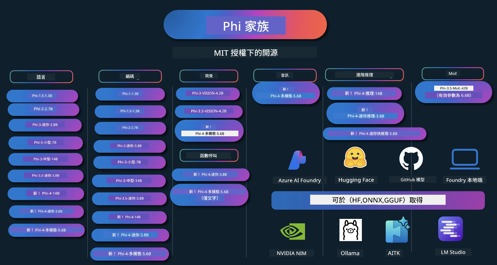

# Phi Cookbook：與 Microsoft Phi 模型的實作範例

[](https://codespaces.new/microsoft/phicookbook)
[](https://vscode.dev/redirect?url=vscode://ms-vscode-remote.remote-containers/cloneInVolume?url=https://github.com/microsoft/phicookbook)

[](https://GitHub.com/microsoft/phicookbook/graphs/contributors/?WT.mc_id=aiml-137032-kinfeylo)
[](https://GitHub.com/microsoft/phicookbook/issues/?WT.mc_id=aiml-137032-kinfeylo)
[](https://GitHub.com/microsoft/phicookbook/pulls/?WT.mc_id=aiml-137032-kinfeylo)
[](http://makeapullrequest.com?WT.mc_id=aiml-137032-kinfeylo)

[](https://GitHub.com/microsoft/phicookbook/watchers/?WT.mc_id=aiml-137032-kinfeylo)
[](https://GitHub.com/microsoft/phicookbook/network/?WT.mc_id=aiml-137032-kinfeylo)
[](https://GitHub.com/microsoft/phicookbook/stargazers/?WT.mc_id=aiml-137032-kinfeylo)

[](https://discord.com/invite/ByRwuEEgH4)

Phi 是由 Microsoft 開發的一系列開源人工智能模型。

Phi 目前是功能最強大且具成本效益的小型語言模型（SLM），在多語言、推理、文本/聊天生成、編碼、影像、音訊及其他場景中都擁有非常優秀的基準測試表現。

您可以將 Phi 部署到雲端或邊緣設備，並可輕鬆使用有限的計算資源建構生成式 AI 應用程式。

按照以下步驟開始使用這些資源：
1. **分支本儲存庫**：點擊 [](https://GitHub.com/microsoft/phicookbook/network/?WT.mc_id=aiml-137032-kinfeylo)
2. **複製儲存庫**：   `git clone https://github.com/microsoft/PhiCookBook.git`
3. [**加入 Microsoft AI Discord 社群並結識專家與其他開發者**](https://discord.com/invite/ByRwuEEgH4?WT.mc_id=aiml-137032-kinfeylo)



### 🌐 多語言支援

#### 透過 GitHub Action 支援（自動化且持續更新）

<!-- CO-OP TRANSLATOR LANGUAGES TABLE START -->
[阿拉伯文](../ar/README.md) | [孟加拉文](../bn/README.md) | [保加利亞文](../bg/README.md) | [緬甸語（緬甸）](../my/README.md) | [中文（簡體）](../zh-CN/README.md) | [中文（繁體，香港）](../zh-HK/README.md) | [中文（繁體，澳門）](./README.md) | [中文（繁體，臺灣）](../zh-TW/README.md) | [克羅地亞文](../hr/README.md) | [捷克文](../cs/README.md) | [丹麥文](../da/README.md) | [荷蘭文](../nl/README.md) | [愛沙尼亞文](../et/README.md) | [芬蘭文](../fi/README.md) | [法文](../fr/README.md) | [德文](../de/README.md) | [希臘文](../el/README.md) | [希伯來文](../he/README.md) | [印地語](../hi/README.md) | [匈牙利文](../hu/README.md) | [印尼語](../id/README.md) | [義大利文](../it/README.md) | [日文](../ja/README.md) | [坎納達語](../kn/README.md) | [韓文](../ko/README.md) | [立陶宛文](../lt/README.md) | [馬來語](../ms/README.md) | [馬拉雅拉姆語](../ml/README.md) | [馬拉地語](../mr/README.md) | [尼泊爾語](../ne/README.md) | [奈及利亞皮欽語](../pcm/README.md) | [挪威文](../no/README.md) | [波斯語（法爾西語）](../fa/README.md) | [波蘭文](../pl/README.md) | [葡萄牙文（巴西）](../pt-BR/README.md) | [葡萄牙文（葡萄牙）](../pt-PT/README.md) | [旁遮普語（古爾穆克希）](../pa/README.md) | [羅馬尼亞文](../ro/README.md) | [俄文](../ru/README.md) | [塞爾維亞文（西里爾字母）](../sr/README.md) | [斯洛伐克文](../sk/README.md) | [斯洛文尼亞文](../sl/README.md) | [西班牙文](../es/README.md) | [斯瓦希里語](../sw/README.md) | [瑞典文](../sv/README.md) | [他加祿語（菲律賓語）](../tl/README.md) | [泰米爾語](../ta/README.md) | [泰盧固語](../te/README.md) | [泰語](../th/README.md) | [土耳其語](../tr/README.md) | [烏克蘭語](../uk/README.md) | [烏爾都語](../ur/README.md) | [越南語](../vi/README.md)

> **喜歡本機端複製？**
>
> 本儲存庫包含超過 50 種語言的翻譯，會大幅增加下載大小。若要複製時不包含翻譯，請使用稀疏檢出：
>
> **Bash / macOS / Linux:**
> ```bash
> git clone --filter=blob:none --sparse https://github.com/microsoft/PhiCookBook.git
> cd PhiCookBook
> git sparse-checkout set --no-cone '/*' '!translations' '!translated_images'
> ```
>
> **CMD（Windows）:**
> ```cmd
> git clone --filter=blob:none --sparse https://github.com/microsoft/PhiCookBook.git
> cd PhiCookBook
> git sparse-checkout set --no-cone "/*" "!translations" "!translated_images"
> ```
>
> 此方式提供您完成課程所需的所有內容，且下載速度更快。
<!-- CO-OP TRANSLATOR LANGUAGES TABLE END -->

## 目錄

- 介紹
  - [歡迎加入 Phi Family](./md/01.Introduction/01/01.PhiFamily.md)
  - [設定您的環境](./md/01.Introduction/01/01.EnvironmentSetup.md)
  - [理解關鍵技術](./md/01.Introduction/01/01.Understandingtech.md)
  - [Phi 模型的 AI 安全性](./md/01.Introduction/01/01.AISafety.md)
  - [Phi 硬體支援](./md/01.Introduction/01/01.Hardwaresupport.md)
  - [Phi 模型與跨平台可用性](./md/01.Introduction/01/01.Edgeandcloud.md)
  - [使用 Guidance-ai 與 Phi](./md/01.Introduction/01/01.Guidance.md)
  - [GitHub 市場模型](https://github.com/marketplace/models)
  - [Azure AI 模型目錄](https://ai.azure.com)

- 在不同環境使用 Phi 進行推論
    -  [Hugging face](./md/01.Introduction/02/01.HF.md)
    -  [GitHub 模型](./md/01.Introduction/02/02.GitHubModel.md)
    -  [Azure AI Foundry 模型目錄](./md/01.Introduction/02/03.AzureAIFoundry.md)
    -  [Ollama](./md/01.Introduction/02/04.Ollama.md)
    -  [AI Toolkit VSCode (AITK)](./md/01.Introduction/02/05.AITK.md)
    -  [NVIDIA NIM](./md/01.Introduction/02/06.NVIDIA.md)
    -  [Foundry Local](./md/01.Introduction/02/07.FoundryLocal.md)

- Phi 系列推論
    - [iOS 上之 Phi 推論](./md/01.Introduction/03/iOS_Inference.md)
    - [Android 上之 Phi 推論](./md/01.Introduction/03/Android_Inference.md)
    - [Jetson 上之 Phi 推論](./md/01.Introduction/03/Jetson_Inference.md)
    - [AI PC 上之 Phi 推論](./md/01.Introduction/03/AIPC_Inference.md)
    - [使用 Apple MLX Framework 進行 Phi 推論](./md/01.Introduction/03/MLX_Inference.md)
    - [本地伺服器的 Phi 推論](./md/01.Introduction/03/Local_Server_Inference.md)
    - [使用 AI Toolkit 在遠端伺服器做 Phi 推論](./md/01.Introduction/03/Remote_Interence.md)
    - [使用 Rust 進行 Phi 推論](./md/01.Introduction/03/Rust_Inference.md)
    - [本地端 Phi—視覺推論](./md/01.Introduction/03/Vision_Inference.md)
    - [與 Kaito AKS 及 Azure Containers（官方支援）搭配的 Phi 推論](./md/01.Introduction/03/Kaito_Inference.md)
-  [Phi 系列量化](./md/01.Introduction/04/QuantifyingPhi.md)
    - [使用 llama.cpp 對 Phi-3.5 / 4 進行量化](./md/01.Introduction/04/UsingLlamacppQuantifyingPhi.md)
    - [使用 onnxruntime 的生成式 AI 擴充套件對 Phi-3.5 / 4 進行量化](./md/01.Introduction/04/UsingORTGenAIQuantifyingPhi.md)
    - [使用 Intel OpenVINO 對 Phi-3.5 / 4 進行量化](./md/01.Introduction/04/UsingIntelOpenVINOQuantifyingPhi.md)
    - [使用 Apple MLX Framework 對 Phi-3.5 / 4 進行量化](./md/01.Introduction/04/UsingAppleMLXQuantifyingPhi.md)

-  Phi 評估
    - [責任 AI](./md/01.Introduction/05/ResponsibleAI.md)
    - [Azure AI Foundry 評估](./md/01.Introduction/05/AIFoundry.md)
    - [使用 Promptflow 進行評估](./md/01.Introduction/05/Promptflow.md)
 
- 與 Azure AI Search 的 RAG
    - [如何用 Phi-4-mini 和 Phi-4-multimodal（RAG）搭配 Azure AI Search](https://github.com/microsoft/PhiCookBook/blob/main/code/06.E2E/E2E_Phi-4-RAG-Azure-AI-Search.ipynb)

- Phi 應用程式開發範例
  - 文字與聊天應用程式
    - Phi-4 範例 🆕
      - [📓] [與 Phi-4-mini ONNX 模型聊天](./md/02.Application/01.TextAndChat/Phi4/ChatWithPhi4ONNX/README.md)
      - [使用 Phi-4 本地 ONNX 模型聊天 (.NET)](../../md/04.HOL/dotnet/src/LabsPhi4-Chat-01OnnxRuntime)
      - [使用 Sementic Kernel 和 Phi-4 ONNX 的 .NET 控制台聊天應用](../../md/04.HOL/dotnet/src/LabsPhi4-Chat-02SK)
    - Phi-3 / 3.5 範例
      - [在瀏覽器中使用 Phi3、ONNX Runtime Web 和 WebGPU 本地聊天機器人](https://github.com/microsoft/onnxruntime-inference-examples/tree/main/js/chat)
      - [OpenVino Chat](./md/02.Application/01.TextAndChat/Phi3/E2E_OpenVino_Chat.md)
      - [多模型 - 互動式 Phi-3-mini 與 OpenAI Whisper](./md/02.Application/01.TextAndChat/Phi3/E2E_Phi-3-mini_with_whisper.md)
      - [MLFlow - 建立封裝並搭配 MLFlow 使用 Phi-3](./md//02.Application/01.TextAndChat/Phi3/E2E_Phi-3-MLflow.md)
      - [模型優化 - 如何使用 Olive 優化 Phi-3-mini 模型以用於 ONNX Runtime Web](https://github.com/microsoft/Olive/tree/main/examples/phi3)
      - [WinUI3 應用程式搭配 Phi-3 mini-4k-instruct-onnx](https://github.com/microsoft/Phi3-Chat-WinUI3-Sample/)
      -[WinUI3 多模型 AI 驅動筆記應用程式範例](https://github.com/microsoft/ai-powered-notes-winui3-sample)
      - [Fine-tune 並整合自訂 Phi-3 模型與 Prompt flow](./md/02.Application/01.TextAndChat/Phi3/E2E_Phi-3-FineTuning_PromptFlow_Integration.md)
      - [在 Azure AI Foundry 中透過 Prompt flow 調整及整合自訂 Phi-3 模型](./md/02.Application/01.TextAndChat/Phi3/E2E_Phi-3-FineTuning_PromptFlow_Integration_AIFoundry.md)
      - [評估 Azure AI Foundry 中微調完成的 Phi-3 / Phi-3.5 模型，聚焦於微軟的負責任 AI 原則](./md/02.Application/01.TextAndChat/Phi3/E2E_Phi-3-Evaluation_AIFoundry.md)
      - [📓] [Phi-3.5-mini-instruct 語言預測範例（中/英文）](./md/02.Application/01.TextAndChat/Phi3/phi3-instruct-demo.ipynb)
      - [Phi-3.5-Instruct WebGPU RAG 聊天機器人](./md/02.Application/01.TextAndChat/Phi3/WebGPUWithPhi35Readme.md)
      - [使用 Windows GPU 以 Phi-3.5-Instruct ONNX 建立 Prompt flow 解決方案](./md/02.Application/01.TextAndChat/Phi3/UsingPromptFlowWithONNX.md)
      - [使用微軟 Phi-3.5 tflite 建立 Android 應用程式](./md/02.Application/01.TextAndChat/Phi3/UsingPhi35TFLiteCreateAndroidApp.md)
      - [Q&A .NET 範例，使用 Microsoft.ML.OnnxRuntime 與本地 ONNX Phi-3 模型](../../md/04.HOL/dotnet/src/LabsPhi301)
      - [結合 Semantic Kernel 與 Phi-3 的 .NET 主控台聊天應用程式](../../md/04.HOL/dotnet/src/LabsPhi302)

  - Azure AI 推論 SDK 程式碼範例 
    - Phi-4 範例 🆕
      - [📓] [使用 Phi-4-multimodal 生成專案程式碼](./md/02.Application/02.Code/Phi4/GenProjectCode/README.md)
    - Phi-3 / 3.5 範例
      - [使用微軟 Phi-3 系列建立你自己的 Visual Studio Code GitHub Copilot Chat](./md/02.Application/02.Code/Phi3/VSCodeExt/README.md)
      - [搭配 Phi-3.5 及 GitHub 模型打造你自己的 Visual Studio Code Chat Copilot 代理人](/md/02.Application/02.Code/Phi3/CreateVSCodeChatAgentWithGitHubModels.md)

  - 進階推理範例
    - Phi-4 範例 🆕
      - [📓] [Phi-4-mini-reasoning 或 Phi-4-reasoning 範例](./md/02.Application/03.AdvancedReasoning/Phi4/AdvancedResoningPhi4mini/README.md)
      - [📓] [使用微軟 Olive 微調 Phi-4-mini-reasoning](./md/02.Application/03.AdvancedReasoning/Phi4/AdvancedResoningPhi4mini/olive_ft_phi_4_reasoning_with_medicaldata.ipynb)
      - [📓] [搭配 Apple MLX 微調 Phi-4-mini-reasoning](./md/02.Application/03.AdvancedReasoning/Phi4/AdvancedResoningPhi4mini/mlx_ft_phi_4_reasoning_with_medicaldata.ipynb)
      - [📓] [搭配 GitHub 模型的 Phi-4-mini-reasoning](./md/02.Application/02.Code/Phi4r/github_models_inference.ipynb)
      - [📓] [搭配 Azure AI Foundry 模型的 Phi-4-mini-reasoning](./md/02.Application/02.Code/Phi4r/azure_models_inference.ipynb)
  - 示範
      - [Phi-4-mini 示範託管於 Hugging Face Spaces](https://huggingface.co/spaces/microsoft/phi-4-mini?WT.mc_id=aiml-137032-kinfeylo)
      - [Phi-4-multimodal 示範託管於 Hugginge Face Spaces](https://huggingface.co/spaces/microsoft/phi-4-multimodal?WT.mc_id=aiml-137032-kinfeylo)
  - 視覺範例
    - Phi-4 範例 🆕
      - [📓] [使用 Phi-4-multimodal 讀取影像並生成程式碼](./md/02.Application/04.Vision/Phi4/CreateFrontend/README.md) 
    - Phi-3 / 3.5 範例
      -  [📓][Phi-3 影像視覺文字轉文字](./md/02.Application/04.Vision/Phi3/E2E_Phi-3-vision-image-text-to-text-online-endpoint.ipynb)
      - [Phi-3 視覺 ONNX](https://onnxruntime.ai/docs/genai/tutorials/phi3-v.html)
      - [📓][Phi-3 影像視覺 CLIP Embedding](./md/02.Application/04.Vision/Phi3/E2E_Phi-3-vision-image-text-to-text-online-endpoint.ipynb)
      - [示範：Phi-3 回收](https://github.com/jennifermarsman/PhiRecycling/)
      - [Phi-3 影像視覺 - 視覺語言助手，搭配 Phi3-Vision 與 OpenVINO](https://docs.openvino.ai/nightly/notebooks/phi-3-vision-with-output.html)
      - [Phi-3 視覺 Nvidia NIM](./md/02.Application/04.Vision/Phi3/E2E_Nvidia_NIM_Vision.md)
      - [Phi-3 視覺 OpenVino](./md/02.Application/04.Vision/Phi3/E2E_OpenVino_Phi3Vision.md)
      - [📓][Phi-3.5 視覺多幀或多影像範例](./md/02.Application/04.Vision/Phi3/phi3-vision-demo.ipynb)
      - [Phi-3 視覺本地 ONNX 模型，使用 Microsoft.ML.OnnxRuntime .NET](../../md/04.HOL/dotnet/src/LabsPhi303)
      - [選單式 Phi-3 視覺本地 ONNX 模型，使用 Microsoft.ML.OnnxRuntime .NET](../../md/04.HOL/dotnet/src/LabsPhi304)

  - 數學範例
    - Phi-4-Mini-Flash-Reasoning-Instruct 範例 🆕 [使用 Phi-4-Mini-Flash-Reasoning-Instruct 的數學示範](./md/02.Application/09.Math/MathDemo.ipynb)

  - 音訊範例
    - Phi-4 範例 🆕
      - [📓] [利用 Phi-4-multimodal 提取音訊文字稿](./md/02.Application/05.Audio/Phi4/Transciption/README.md)
      - [📓] [Phi-4-multimodal 音訊範例](./md/02.Application/05.Audio/Phi4/Siri/demo.ipynb)
      - [📓] [Phi-4-multimodal 語音翻譯範例](./md/02.Application/05.Audio/Phi4/Translate/demo.ipynb)
      - [.NET 主控台應用程式，使用 Phi-4-multimodal 音訊分析檔案並生成文字稿](../../md/04.HOL/dotnet/src/LabsPhi4-MultiModal-02Audio)

  - MoE 範例
    - Phi-3 / 3.5 範例
      - [📓] [Phi-3.5 專家混合模型 (MoEs) 社群媒體範例](./md/02.Application/06.MoE/Phi3/phi3_moe_demo.ipynb)
      - [📓] [建構結合 NVIDIA NIM Phi-3 MOE、Azure AI Search 及 LlamaIndex 的檢索增強生成（RAG）管線](./md/02.Application/06.MoE/Phi3/azure-ai-search-nvidia-rag.ipynb)
      - 
  - 功能呼叫範例
    - Phi-4 範例 🆕
      -  [📓] [使用 Phi-4-mini 進行功能呼叫](./md/02.Application/07.FunctionCalling/Phi4/FunctionCallingBasic/README.md)
      -  [📓] [用 Phi-4-mini 功能呼叫建立多代理人](./md/02.Application/07.FunctionCalling/Phi4/Multiagents/Phi_4_mini_multiagent.ipynb)
      -  [📓] [與 Ollama 一起使用功能呼叫](./md/02.Application/07.FunctionCalling/Phi4/Ollama/ollama_functioncalling.ipynb)
      -  [📓] [搭配 ONNX 進行功能呼叫](./md/02.Application/07.FunctionCalling/Phi4/ONNX/onnx_parallel_functioncalling.ipynb)
  - 多模態混合範例
    - Phi-4 範例 🆕
      -  [📓] [使用 Phi-4-multimodal 擔任科技新聞記者](./md/02.Application/08.Multimodel/Phi4/TechJournalist/phi_4_mm_audio_text_publish_news.ipynb)
      - [.NET 主控台應用程式，利用 Phi-4-multimodal 分析圖片](../../md/04.HOL/dotnet/src/LabsPhi4-MultiModal-01Images)

- 微調 Phi 範例
  - [微調情境](./md/03.FineTuning/FineTuning_Scenarios.md)
  - [微調與 RAG 比較](./md/03.FineTuning/FineTuning_vs_RAG.md)
  - [微調讓 Phi-3 成為產業專家](./md/03.FineTuning/LetPhi3gotoIndustriy.md)
  - [使用 AI Toolkit for VS Code 微調 Phi-3](./md/03.FineTuning/Finetuning_VSCodeaitoolkit.md)
  - [使用 Azure Machine Learning Service 微調 Phi-3](./md/03.FineTuning/Introduce_AzureML.md)
  - [使用 Lora 微調 Phi-3](./md/03.FineTuning/FineTuning_Lora.md)
  - [使用 QLora 微調 Phi-3](./md/03.FineTuning/FineTuning_Qlora.md)
  - [使用 Azure AI Foundry 微調 Phi-3](./md/03.FineTuning/FineTuning_AIFoundry.md)
  - [使用 Azure ML CLI/SDK 微調 Phi-3](./md/03.FineTuning/FineTuning_MLSDK.md)
  - [使用 Microsoft Olive 微調](./md/03.FineTuning/FineTuning_MicrosoftOlive.md)
  - [使用 Microsoft Olive 實作實驗室微調](./md/03.FineTuning/olive-lab/readme.md)
  - [使用 Weights and Bias 微調 Phi-3-vision](./md/03.FineTuning/FineTuning_Phi-3-visionWandB.md)
  - [使用 Apple MLX Framework 微調 Phi-3](./md/03.FineTuning/FineTuning_MLX.md)
  - [Phi-3-vision 微調（官方支援）](./md/03.FineTuning/FineTuning_Vision.md)
  - [搭配 Kaito AKS 及 Azure 容器微調 Phi-3（官方支援）](./md/03.FineTuning/FineTuning_Kaito.md)
  - [微調 Phi-3 與 3.5 視覺](https://github.com/2U1/Phi3-Vision-Finetune)

- 實作實驗室
  - [探索前沿模型：大型語言模型、專門語言模型、本地開發及更多](https://github.com/microsoft/aitour-exploring-cutting-edge-models)
  - [釋放自然語言處理潛力：使用 Microsoft Olive 進行微調](https://github.com/azure/Ignite_FineTuning_workshop)
- 學術研究論文與出版物
  - [Textbooks Are All You Need II: phi-1.5 技術報告](https://arxiv.org/abs/2309.05463)
  - [Phi-3 技術報告：在您手機上本地運行的高能力語言模型](https://arxiv.org/abs/2404.14219)
  - [Phi-4 技術報告](https://arxiv.org/abs/2412.08905)
  - [Phi-4-Mini 技術報告：透過 LoRA 混合的緊湊而強大的多模態語言模型](https://arxiv.org/abs/2503.01743)
  - [為車載功能調用優化小型語言模型](https://arxiv.org/abs/2501.02342)
  - [(WhyPHI) 針對多項選擇題調整 PHI-3：方法論、結果與挑戰](https://arxiv.org/abs/2501.01588)
  - [Phi-4-推理技術報告](https://www.microsoft.com/en-us/research/wp-content/uploads/2025/04/phi_4_reasoning.pdf)
  - [Phi-4-mini-推理技術報告](https://huggingface.co/microsoft/Phi-4-mini-reasoning/blob/main/Phi-4-Mini-Reasoning.pdf)

## 使用 Phi 模型

### Phi 在 Azure AI Foundry 上

您可以學習如何使用 Microsoft Phi 及如何在不同硬體設備上構建端對端解決方案。要親身體驗 Phi，請從使用模型並為您的情境自訂 Phi 開始，使用 [Azure AI Foundry Azure AI 模型目錄](https://aka.ms/phi3-azure-ai)，您也可以參考 [Azure AI Foundry 快速入門](/md/02.QuickStart/AzureAIFoundry_QuickStart.md) 獲取更多資訊。

**遊樂場**
每個模型都有專用的遊樂場供測試模型 [Azure AI 遊樂場](https://aka.ms/try-phi3)。

### Phi 在 GitHub 模型庫上

您可以學習如何使用 Microsoft Phi 及如何在不同硬體設備上構建端對端解決方案。要親身體驗 Phi，請從使用模型並為您的情境自訂 Phi 開始，使用 [GitHub 模型目錄](https://github.com/marketplace/models?WT.mc_id=aiml-137032-kinfeylo)，您也可以參考 [GitHub 模型目錄 快速入門](/md/02.QuickStart/GitHubModel_QuickStart.md) 獲取更多資訊。

**遊樂場**
每個模型都有專用的[遊樂場供測試模型](/md/02.QuickStart/GitHubModel_QuickStart.md)。

### Phi 在 Hugging Face 上

您也可以在 [Hugging Face](https://huggingface.co/microsoft) 找到該模型。

**遊樂場**
[Hugging Chat 遊樂場](https://huggingface.co/chat/models/microsoft/Phi-3-mini-4k-instruct)

## 🎒 其他課程

我們的團隊製作了其他課程！快來看看：

<!-- CO-OP TRANSLATOR OTHER COURSES START -->
### LangChain
[](https://aka.ms/langchain4j-for-beginners)
[](https://aka.ms/langchainjs-for-beginners?WT.mc_id=m365-94501-dwahlin)
[](https://github.com/microsoft/langchain-for-beginners?WT.mc_id=m365-94501-dwahlin)
---

### Azure / Edge / MCP / Agents
[](https://github.com/microsoft/AZD-for-beginners?WT.mc_id=academic-105485-koreyst)
[](https://github.com/microsoft/edgeai-for-beginners?WT.mc_id=academic-105485-koreyst)
[](https://github.com/microsoft/mcp-for-beginners?WT.mc_id=academic-105485-koreyst)
[](https://github.com/microsoft/ai-agents-for-beginners?WT.mc_id=academic-105485-koreyst)

---

### 生成式 AI 系列
[](https://github.com/microsoft/generative-ai-for-beginners?WT.mc_id=academic-105485-koreyst)
[-9333EA?style=for-the-badge&labelColor=E5E7EB&color=9333EA)](https://github.com/microsoft/Generative-AI-for-beginners-dotnet?WT.mc_id=academic-105485-koreyst)
[-C084FC?style=for-the-badge&labelColor=E5E7EB&color=C084FC)](https://github.com/microsoft/generative-ai-for-beginners-java?WT.mc_id=academic-105485-koreyst)
[-E879F9?style=for-the-badge&labelColor=E5E7EB&color=E879F9)](https://github.com/microsoft/generative-ai-with-javascript?WT.mc_id=academic-105485-koreyst)

---

### 核心學習
[](https://aka.ms/ml-beginners?WT.mc_id=academic-105485-koreyst)
[](https://aka.ms/datascience-beginners?WT.mc_id=academic-105485-koreyst)
[](https://aka.ms/ai-beginners?WT.mc_id=academic-105485-koreyst)
[](https://github.com/microsoft/Security-101?WT.mc_id=academic-96948-sayoung)
[](https://aka.ms/webdev-beginners?WT.mc_id=academic-105485-koreyst)
[](https://aka.ms/iot-beginners?WT.mc_id=academic-105485-koreyst)
[](https://github.com/microsoft/xr-development-for-beginners?WT.mc_id=academic-105485-koreyst)

---

### Copilot 系列
[](https://aka.ms/GitHubCopilotAI?WT.mc_id=academic-105485-koreyst)
[](https://github.com/microsoft/mastering-github-copilot-for-dotnet-csharp-developers?WT.mc_id=academic-105485-koreyst)
[](https://github.com/microsoft/CopilotAdventures?WT.mc_id=academic-105485-koreyst)
<!-- CO-OP TRANSLATOR OTHER COURSES END -->

## 負責任的 AI 

微軟致力協助客戶負責任地使用我們的 AI 產品，分享我們的學習成果，並透過如透明度說明與影響評估等工具建立基於信任的夥伴關係。許多這些資源可在 [https://aka.ms/RAI](https://aka.ms/RAI) 找到。  
微軟負責任 AI 的方針根植於我們的 AI 原則，包括公平性、可靠性與安全性、隱私與安全、包容性、透明度與問責制。

大規模的自然語言、影像與語音模型——如本範例中使用的模型——可能會出現不公平、不可靠或冒犯性的行為，從而造成傷害。請參閱 [Azure OpenAI 服務透明度說明](https://learn.microsoft.com/legal/cognitive-services/openai/transparency-note?tabs=text)，以了解相關風險與限制。

降低這些風險的建議方法是，在您的系統架構中包含一個安全系統，能夠偵測並防止有害行為。[Azure AI 內容安全](https://learn.microsoft.com/azure/ai-services/content-safety/overview) 提供獨立的保護層，能在應用和服務中偵測用戶生成與 AI 生成的有害內容。Azure AI 內容安全包含文字和影像 API，可讓您偵測有害素材。在 Azure AI Foundry 中，內容安全服務可讓您查看、探索並試用跨多種模式偵測有害內容的範例程式碼。以下[快速入門文件](https://learn.microsoft.com/azure/ai-services/content-safety/quickstart-text?tabs=visual-studio%2Clinux&pivots=programming-language-rest) 將引導您完成對服務的請求。
另一個需要考慮的方面是整體應用程式的效能。對於多模態和多模型的應用程式，我們將效能定義為系統的表現符合你和使用者的期望，包括不產生有害的輸出。評估整體應用程式效能時，使用[效能與品質以及風險與安全評估器](https://learn.microsoft.com/azure/ai-studio/concepts/evaluation-metrics-built-in)非常重要。你也可以使用[自訂評估器](https://learn.microsoft.com/azure/ai-studio/how-to/develop/evaluate-sdk#custom-evaluators)來建立和評估。

你可以在開發環境中使用[Azure AI 評估 SDK](https://microsoft.github.io/promptflow/index.html)來評估你的 AI 應用程式。給定測試資料集或目標，生成式 AI 的產出可用內建評估器或你所選擇的自訂評估器進行定量測量。要開始使用 Azure AI 評估 SDK 評估你的系統，可以參考[快速入門指南](https://learn.microsoft.com/azure/ai-studio/how-to/develop/flow-evaluate-sdk)。執行評估執行後，你可以在[Azure AI Foundry 中視覺化結果](https://learn.microsoft.com/azure/ai-studio/how-to/evaluate-flow-results)。

## 商標

本專案可能包含專案、產品或服務的商標或標誌。Microsoft 商標或標誌的授權使用須遵循並符合[Microsoft 商標與品牌指南](https://www.microsoft.com/legal/intellectualproperty/trademarks/usage/general)。
在本專案的修改版本中使用 Microsoft 商標或標誌時，必須避免造成混淆或暗示 Microsoft 參與贊助。任何第三方商標或標誌的使用均須遵守該第三方的相關政策。

## 尋求協助

如果你在建構 AI 應用程式時遇到困難或有任何疑問，請加入：

[](https://aka.ms/foundry/discord)

如果你在建構過程中有產品回饋或錯誤，請造訪：

[](https://aka.ms/foundry/forum)

---

<!-- CO-OP TRANSLATOR DISCLAIMER START -->
**免責聲明**：  
本文件是使用 AI 翻譯服務 [Co-op Translator](https://github.com/Azure/co-op-translator) 翻譯而成。雖然我們致力於準確性，但請注意自動翻譯可能包含錯誤或不準確之處。原始文件的母語版本應被視為權威來源。對於重要資訊，建議採用專業人工翻譯。我們對因使用此翻譯所引起的任何誤解或誤譯概不負責。
<!-- CO-OP TRANSLATOR DISCLAIMER END -->