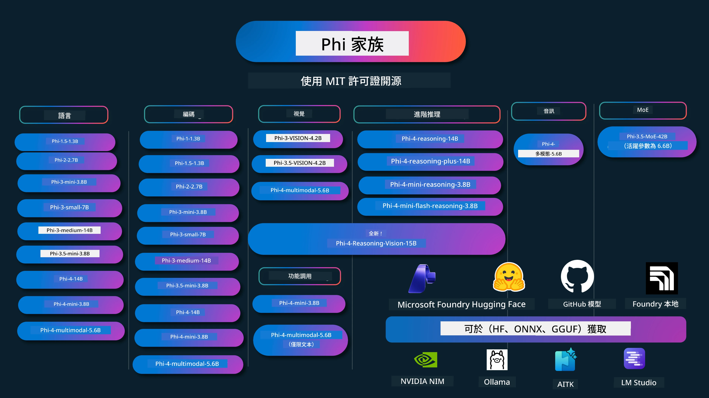

# Phi 食譜：Microsoft Phi 模型的實作範例

[](https://codespaces.new/microsoft/phicookbook)
[](https://vscode.dev/redirect?url=vscode://ms-vscode-remote.remote-containers/cloneInVolume?url=https://github.com/microsoft/phicookbook)

[](https://GitHub.com/microsoft/phicookbook/graphs/contributors/?WT.mc_id=aiml-137032-kinfeylo)
[](https://GitHub.com/microsoft/phicookbook/issues/?WT.mc_id=aiml-137032-kinfeylo)
[](https://GitHub.com/microsoft/phicookbook/pulls/?WT.mc_id=aiml-137032-kinfeylo)
[](http://makeapullrequest.com?WT.mc_id=aiml-137032-kinfeylo)

[](https://GitHub.com/microsoft/phicookbook/watchers/?WT.mc_id=aiml-137032-kinfeylo)
[](https://GitHub.com/microsoft/phicookbook/network/?WT.mc_id=aiml-137032-kinfeylo)
[](https://GitHub.com/microsoft/phicookbook/stargazers/?WT.mc_id=aiml-137032-kinfeylo)

[](https://discord.com/invite/ByRwuEEgH4)

Phi 是 Microsoft 開發的一系列開源 AI 模型。

Phi 目前是最強大且具成本效益的小型語言模型（SLM），在多語言、推理、文本/聊天生成、編碼、圖像、音頻及其他場景中都擁有很好的基準表現。

您可以將 Phi 部署到雲端或邊緣裝置，並能輕鬆建立計算能力有限下的生成式 AI 應用程式。

按照以下步驟開始使用這些資源：
1. <strong>派生儲存庫</strong>：點擊 [](https://GitHub.com/microsoft/phicookbook/network/?WT.mc_id=aiml-137032-kinfeylo)
2. <strong>複製儲存庫</strong>：`git clone https://github.com/microsoft/PhiCookBook.git`
3. [**加入 Microsoft AI Discord 社群，認識專家與其他開發者**](https://discord.com/invite/ByRwuEEgH4?WT.mc_id=aiml-137032-kinfeylo)



### 🌐 多語言支援

#### 透過 GitHub Action 支援（自動化且持續更新）

<!-- CO-OP TRANSLATOR LANGUAGES TABLE START -->
[Arabic](../ar/README.md) | [Bengali](../bn/README.md) | [Bulgarian](../bg/README.md) | [Burmese (Myanmar)](../my/README.md) | [Chinese (Simplified)](../zh-CN/README.md) | [Chinese (Traditional, Hong Kong)](../zh-HK/README.md) | [Chinese (Traditional, Macau)](./README.md) | [Chinese (Traditional, Taiwan)](../zh-TW/README.md) | [Croatian](../hr/README.md) | [Czech](../cs/README.md) | [Danish](../da/README.md) | [Dutch](../nl/README.md) | [Estonian](../et/README.md) | [Finnish](../fi/README.md) | [French](../fr/README.md) | [German](../de/README.md) | [Greek](../el/README.md) | [Hebrew](../he/README.md) | [Hindi](../hi/README.md) | [Hungarian](../hu/README.md) | [Indonesian](../id/README.md) | [Italian](../it/README.md) | [Japanese](../ja/README.md) | [Kannada](../kn/README.md) | [Khmer](../km/README.md) | [Korean](../ko/README.md) | [Lithuanian](../lt/README.md) | [Malay](../ms/README.md) | [Malayalam](../ml/README.md) | [Marathi](../mr/README.md) | [Nepali](../ne/README.md) | [Nigerian Pidgin](../pcm/README.md) | [Norwegian](../no/README.md) | [Persian (Farsi)](../fa/README.md) | [Polish](../pl/README.md) | [Portuguese (Brazil)](../pt-BR/README.md) | [Portuguese (Portugal)](../pt-PT/README.md) | [Punjabi (Gurmukhi)](../pa/README.md) | [Romanian](../ro/README.md) | [Russian](../ru/README.md) | [Serbian (Cyrillic)](../sr/README.md) | [Slovak](../sk/README.md) | [Slovenian](../sl/README.md) | [Spanish](../es/README.md) | [Swahili](../sw/README.md) | [Swedish](../sv/README.md) | [Tagalog (Filipino)](../tl/README.md) | [Tamil](../ta/README.md) | [Telugu](../te/README.md) | [Thai](../th/README.md) | [Turkish](../tr/README.md) | [Ukrainian](../uk/README.md) | [Urdu](../ur/README.md) | [Vietnamese](../vi/README.md)

> **偏好本地複製？**
>
> 本儲存庫包含 50 多種語言的翻譯，會大幅增加下載大小。若想複製但不包含翻譯，請使用稀疏檢出：
>
> **Bash / macOS / Linux:**
> ```bash
> git clone --filter=blob:none --sparse https://github.com/microsoft/PhiCookBook.git
> cd PhiCookBook
> git sparse-checkout set --no-cone '/*' '!translations' '!translated_images'
> ```
>
> **CMD（Windows）：**
> ```cmd
> git clone --filter=blob:none --sparse https://github.com/microsoft/PhiCookBook.git
> cd PhiCookBook
> git sparse-checkout set --no-cone "/*" "!translations" "!translated_images"
> ```
>
> 這會讓您以更快的速度下載完成課程所需的一切。
<!-- CO-OP TRANSLATOR LANGUAGES TABLE END -->

## 目錄

- 介紹
  - [歡迎加入 Phi 家族](./md/01.Introduction/01/01.PhiFamily.md)
  - [設定您的環境](./md/01.Introduction/01/01.EnvironmentSetup.md)
  - [理解關鍵技術](./md/01.Introduction/01/01.Understandingtech.md)
  - [Phi 模型的 AI 安全性](./md/01.Introduction/01/01.AISafety.md)
  - [Phi 硬體支援](./md/01.Introduction/01/01.Hardwaresupport.md)
  - [Phi 模型與跨平台可用性](./md/01.Introduction/01/01.Edgeandcloud.md)
  - [使用 Guidance-ai 與 Phi](./md/01.Introduction/01/01.Guidance.md)
  - [GitHub 市集模型](https://github.com/marketplace/models)
  - [Azure AI 模型目錄](https://ai.azure.com)

- 在不同環境中推理 Phi
    -  [Hugging face](./md/01.Introduction/02/01.HF.md)
    -  [GitHub 模型](./md/01.Introduction/02/02.GitHubModel.md)
    -  [Microsoft Foundry 模型目錄](./md/01.Introduction/02/03.AzureAIFoundry.md)
    -  [Ollama](./md/01.Introduction/02/04.Ollama.md)
    -  [AI 工具包 VSCode (AITK)](./md/01.Introduction/02/05.AITK.md)
    -  [NVIDIA NIM](./md/01.Introduction/02/06.NVIDIA.md)
    -  [Foundry Local](./md/01.Introduction/02/07.FoundryLocal.md)

- Phi 家族推理
    - [iOS 推理 Phi](./md/01.Introduction/03/iOS_Inference.md)
    - [Android 推理 Phi](./md/01.Introduction/03/Android_Inference.md)
    - [Jetson 推理 Phi](./md/01.Introduction/03/Jetson_Inference.md)
    - [AI PC 推理 Phi](./md/01.Introduction/03/AIPC_Inference.md)
    - [使用 Apple MLX 框架推理 Phi](./md/01.Introduction/03/MLX_Inference.md)
    - [本地伺服器推理 Phi](./md/01.Introduction/03/Local_Server_Inference.md)
    - [使用 AI 工具包在遠端伺服器推理 Phi](./md/01.Introduction/03/Remote_Interence.md)
    - [使用 Rust 推理 Phi](./md/01.Introduction/03/Rust_Inference.md)
    - [本地推理 Phi--影像](./md/01.Introduction/03/Vision_Inference.md)
    - [使用 Kaito AKS、Azure 容器推理 Phi（官方支援）](./md/01.Introduction/03/Kaito_Inference.md)
-  [Phi 家族量化](./md/01.Introduction/04/QuantifyingPhi.md)
    - [使用 llama.cpp 量化 Phi-3.5 / 4](./md/01.Introduction/04/UsingLlamacppQuantifyingPhi.md)
    - [使用 onnxruntime 生成式 AI 擴充套件量化 Phi-3.5 / 4](./md/01.Introduction/04/UsingORTGenAIQuantifyingPhi.md)
    - [使用 Intel OpenVINO 量化 Phi-3.5 / 4](./md/01.Introduction/04/UsingIntelOpenVINOQuantifyingPhi.md)
    - [使用 Apple MLX 框架量化 Phi-3.5 / 4](./md/01.Introduction/04/UsingAppleMLXQuantifyingPhi.md)

-  Phi 評估
    - [負責任的 AI](./md/01.Introduction/05/ResponsibleAI.md)
    - [Microsoft Foundry 評估](./md/01.Introduction/05/AIFoundry.md)
    - [使用 Promptflow 進行評估](./md/01.Introduction/05/Promptflow.md)
 
- 與 Azure AI 搜尋的 RAG
    - [如何使用 Phi-4-mini 與 Phi-4-multimodal (RAG) 搭配 Azure AI 搜尋](https://github.com/microsoft/PhiCookBook/blob/main/code/06.E2E/E2E_Phi-4-RAG-Azure-AI-Search.ipynb)
    - [零雲端本地混合 RAG，使用 SQLite FTS5 與 phi-4-mini](https://github.com/microsoft/PhiCookBook/blob/main/code/06.E2E/E2E_Phi-4-mini_Local_Hybrid_RAG_SQLite_FTS5.ipynb)

- Phi 應用開發範例
  - 文字與聊天應用程式
    - Phi-4 範例 
      - [📓] [與 Phi-4-mini ONNX 模型聊天](./md/02.Application/01.TextAndChat/Phi4/ChatWithPhi4ONNX/README.md)
      - [使用 Phi-4 本地 ONNX 模型聊天 .NET](../../md/04.HOL/dotnet/src/LabsPhi4-Chat-01OnnxRuntime)
      - [使用 Sementic Kernel 的 Phi-4 ONNX .NET 控制台應用程式聊天](../../md/04.HOL/dotnet/src/LabsPhi4-Chat-02SK)

    - Phi-3 / 3.5 範例
      - [在瀏覽器中使用 Phi3、ONNX Runtime Web 和 WebGPU 的本地聊天機械人](https://github.com/microsoft/onnxruntime-inference-examples/tree/main/js/chat)
      - [OpenVino 聊天](./md/02.Application/01.TextAndChat/Phi3/E2E_OpenVino_Chat.md)
      - [多模型 - 互動式 Phi-3-mini 與 OpenAI Whisper](./md/02.Application/01.TextAndChat/Phi3/E2E_Phi-3-mini_with_whisper.md)
      - [MLFlow - 建立封裝並使用 Phi-3 與 MLFlow](./md//02.Application/01.TextAndChat/Phi3/E2E_Phi-3-MLflow.md)
      - [模型優化 - 如何使用 Olive 優化 Phi-3-min 模型以用於 ONNX Runtime Web](https://github.com/microsoft/Olive/tree/main/examples/phi3)
      - [用 Phi-3 mini-4k-instruct-onnx 製作的 WinUI3 應用程式](https://github.com/microsoft/Phi3-Chat-WinUI3-Sample/)
      -[WinUI3 多模型 AI 助力筆記應用範例](https://github.com/microsoft/ai-powered-notes-winui3-sample)
      - [微調及整合定制 Phi-3 模型與 Prompt flow](./md/02.Application/01.TextAndChat/Phi3/E2E_Phi-3-FineTuning_PromptFlow_Integration.md)
      - [在 Microsoft Foundry 使用 Prompt flow 微調及整合定制 Phi-3 模型](./md/02.Application/01.TextAndChat/Phi3/E2E_Phi-3-FineTuning_PromptFlow_Integration_AIFoundry.md)
      - [在 Microsoft Foundry 評估微調後的 Phi-3 / Phi-3.5 模型，重點為 Microsoft 的負責任 AI 原則](./md/02.Application/01.TextAndChat/Phi3/E2E_Phi-3-Evaluation_AIFoundry.md)
      - [📓] [Phi-3.5-mini-instruct 語言預測範例（中文/英文）](./md/02.Application/01.TextAndChat/Phi3/phi3-instruct-demo.ipynb)
      - [Phi-3.5-Instruct WebGPU RAG 聊天機械人](./md/02.Application/01.TextAndChat/Phi3/WebGPUWithPhi35Readme.md)
      - [使用 Windows GPU 建構帶有 Phi-3.5-Instruct ONNX 的 Prompt flow 解決方案](./md/02.Application/01.TextAndChat/Phi3/UsingPromptFlowWithONNX.md)
      - [使用 Microsoft Phi-3.5 tflite 建立 Android 應用](./md/02.Application/01.TextAndChat/Phi3/UsingPhi35TFLiteCreateAndroidApp.md)
      - [利用本地 ONNX Phi-3 模型的 .NET 問答範例，使用 Microsoft.ML.OnnxRuntime](../../md/04.HOL/dotnet/src/LabsPhi301)
      - [用 Semantic Kernel 與 Phi-3 製作的 .NET 控制台聊天應用](../../md/04.HOL/dotnet/src/LabsPhi302)

  - Azure AI 推論 SDK 程式碼範例 
    - Phi-4 範例 
      - [📓] [使用 Phi-4-multimodal 產生專案程式碼](./md/02.Application/02.Code/Phi4/GenProjectCode/README.md)
    - Phi-3 / 3.5 範例
      - [用 Microsoft Phi-3 系列建立自己的 Visual Studio Code GitHub Copilot 聊天](./md/02.Application/02.Code/Phi3/VSCodeExt/README.md)
      - [用 GitHub 模型與 Phi-3.5 創建你自己的 Visual Studio Code 聊天 Copilot 代理](/md/02.Application/02.Code/Phi3/CreateVSCodeChatAgentWithGitHubModels.md)

  - 進階推理範例
    - Phi-4 範例 
      - [📓] [Phi-4-mini 推理或 Phi-4 推理範例](./md/02.Application/03.AdvancedReasoning/Phi4/AdvancedResoningPhi4mini/README.md)
      - [📓] [用 Microsoft Olive 微調 Phi-4-mini 推理](./md/02.Application/03.AdvancedReasoning/Phi4/AdvancedResoningPhi4mini/olive_ft_phi_4_reasoning_with_medicaldata.ipynb)
      - [📓] [用 Apple MLX 微調 Phi-4-mini 推理](./md/02.Application/03.AdvancedReasoning/Phi4/AdvancedResoningPhi4mini/mlx_ft_phi_4_reasoning_with_medicaldata.ipynb)
      - [📓] [用 GitHub 模型推理 Phi-4-mini](./md/02.Application/02.Code/Phi4r/github_models_inference.ipynb)
      - [📓] [用 Microsoft Foundry 模型推理 Phi-4-mini](./md/02.Application/02.Code/Phi4r/azure_models_inference.ipynb)
  - 示範
      - [Phi-4-mini 示範托管於 Hugging Face Spaces](https://huggingface.co/spaces/microsoft/phi-4-mini?WT.mc_id=aiml-137032-kinfeylo)
      - [Phi-4-multimodal 示範托管於 Hugginge Face Spaces](https://huggingface.co/spaces/microsoft/phi-4-multimodal?WT.mc_id=aiml-137032-kinfeylo)
  - 視覺範例
    - Phi-4 範例 
      - [📓] [使用 Phi-4-multimodal 閱讀圖像與生成程式碼](./md/02.Application/04.Vision/Phi4/CreateFrontend/README.md) 
    - Phi-3 / 3.5 範例
      -  [📓][Phi-3-vision-圖像文本轉文字](./md/02.Application/04.Vision/Phi3/E2E_Phi-3-vision-image-text-to-text-online-endpoint.ipynb)
      - [Phi-3-vision-ONNX](https://onnxruntime.ai/docs/genai/tutorials/phi3-v.html)
      - [📓][Phi-3-vision CLIP 嵌入](./md/02.Application/04.Vision/Phi3/E2E_Phi-3-vision-image-text-to-text-online-endpoint.ipynb)
      - [示範：Phi-3 回收](https://github.com/jennifermarsman/PhiRecycling/)
      - [Phi-3-vision - 視覺語言助手 - 使用 Phi3-Vision 與 OpenVINO](https://docs.openvino.ai/nightly/notebooks/phi-3-vision-with-output.html)
      - [Phi-3 視覺 Nvidia NIM](./md/02.Application/04.Vision/Phi3/E2E_Nvidia_NIM_Vision.md)
      - [Phi-3 視覺 OpenVino](./md/02.Application/04.Vision/Phi3/E2E_OpenVino_Phi3Vision.md)
      - [📓][Phi-3.5 視覺多幀或多圖像範例](./md/02.Application/04.Vision/Phi3/phi3-vision-demo.ipynb)
      - [Phi-3 視覺本地 ONNX 模型，使用 Microsoft.ML.OnnxRuntime .NET](../../md/04.HOL/dotnet/src/LabsPhi303)
      - [基於選單的 Phi-3 視覺本地 ONNX 模型，使用 Microsoft.ML.OnnxRuntime .NET](../../md/04.HOL/dotnet/src/LabsPhi304)

  - 推理-視覺範例
    - Phi-4-Reasoning-Vision-15B 
      - [📓] [使用 Phi-4-Reasoning-Vision-15B 偵測闖紅燈](./md/02.Application/10.ReasoningVision/Phi_4_reasoning_vision_15b_Jaywalking.ipynb)
      - [📓] [使用 Phi-4-Reasoning-Vision-15B 進行數學運算](./md/02.Application/10.ReasoningVision/Phi_4_reasoning_vision_15b_Math.ipynb)
      - [📓] [使用 Phi-4-Reasoning-Vision-15B 偵測使用者介面](./md/02.Application/10.ReasoningVision/Phi_4_reasoning_vision_15b_ui.ipynb)

  - 數學範例
    -  Phi-4-Mini-Flash-Reasoning-Instruct 範例  [Phi-4-Mini-Flash-Reasoning-Instruct 的數學示範](./md/02.Application/09.Math/MathDemo.ipynb)

  - 音訊範例
    - Phi-4 範例 
      - [📓] [使用 Phi-4-multimodal 提取音訊文字記錄](./md/02.Application/05.Audio/Phi4/Transciption/README.md)
      - [📓] [Phi-4-multimodal 音訊範例](./md/02.Application/05.Audio/Phi4/Siri/demo.ipynb)
      - [📓] [Phi-4-multimodal 語音翻譯範例](./md/02.Application/05.Audio/Phi4/Translate/demo.ipynb)
      - [.NET 控制台應用程序使用 Phi-4-multimodal 音訊分析音訊檔並生成文字記錄](../../md/04.HOL/dotnet/src/LabsPhi4-MultiModal-02Audio)

  - MOE 範例
    - Phi-3 / 3.5 範例
      - [📓] [Phi-3.5 混合專家模型 (MoEs) 社交媒體範例](./md/02.Application/06.MoE/Phi3/phi3_moe_demo.ipynb)
      - [📓] [建立一個使用 NVIDIA NIM Phi-3 MOE、Azure AI 搜尋與 LlamaIndex 的檢索增強生成 (RAG) 管線](./md/02.Application/06.MoE/Phi3/azure-ai-search-nvidia-rag.ipynb)
      - 
  - 函數調用範例
    - Phi-4 範例 🆕
      -  [📓] [使用 Phi-4-mini 進行函數調用](./md/02.Application/07.FunctionCalling/Phi4/FunctionCallingBasic/README.md)
      -  [📓] [使用函數調用與 Phi-4-mini 創建多代理](./md/02.Application/07.FunctionCalling/Phi4/Multiagents/Phi_4_mini_multiagent.ipynb)
      -  [📓] [使用函數調用與 Ollama](./md/02.Application/07.FunctionCalling/Phi4/Ollama/ollama_functioncalling.ipynb)
      -  [📓] [使用函數調用與 ONNX](./md/02.Application/07.FunctionCalling/Phi4/ONNX/onnx_parallel_functioncalling.ipynb)
  - 多模態混合範例
    - Phi-4 範例 🆕
      -  [📓] [使用 Phi-4-multimodal 作為科技記者](./md/02.Application/08.Multimodel/Phi4/TechJournalist/phi_4_mm_audio_text_publish_news.ipynb)
      - [.NET 控制台應用程式使用 Phi-4-multimodal 分析圖像](../../md/04.HOL/dotnet/src/LabsPhi4-MultiModal-01Images)

- Phi 微調範例
  - [微調情境](./md/03.FineTuning/FineTuning_Scenarios.md)
  - [微調與 RAG 的比較](./md/03.FineTuning/FineTuning_vs_RAG.md)
  - [微調讓 Phi-3 成為業界專家](./md/03.FineTuning/LetPhi3gotoIndustriy.md)
  - [利用 AI 工具組於 VS Code 微調 Phi-3](./md/03.FineTuning/Finetuning_VSCodeaitoolkit.md)
  - [利用 Azure 機器學習服務微調 Phi-3](./md/03.FineTuning/Introduce_AzureML.md)
  - [使用 Lora 微調 Phi-3](./md/03.FineTuning/FineTuning_Lora.md)
  - [使用 QLora 微調 Phi-3](./md/03.FineTuning/FineTuning_Qlora.md)
  - [利用 Microsoft Foundry 微調 Phi-3](./md/03.FineTuning/FineTuning_AIFoundry.md)
  - [使用 Azure ML CLI/SDK 微調 Phi-3](./md/03.FineTuning/FineTuning_MLSDK.md)
  - [使用 Microsoft Olive 微調](./md/03.FineTuning/FineTuning_MicrosoftOlive.md)
  - [Microsoft Olive 微調實作實驗室](./md/03.FineTuning/olive-lab/readme.md)
  - [使用 Weights and Bias 微調 Phi-3-vision](./md/03.FineTuning/FineTuning_Phi-3-visionWandB.md)

  - [使用 Apple MLX 框架微調 Phi-3](./md/03.FineTuning/FineTuning_MLX.md)
  - [微調 Phi-3-vision（官方支援）](./md/03.FineTuning/FineTuning_Vision.md)
  - [使用 Kaito AKS 與 Azure 容器微調 Phi-3（官方支援）](./md/03.FineTuning/FineTuning_Kaito.md)
  - [微調 Phi-3 與 3.5 Vision](https://github.com/2U1/Phi3-Vision-Finetune)

- 實作實驗室
  - [探索尖端模型：LLM、SLM、本地開發及更多](https://github.com/microsoft/aitour-exploring-cutting-edge-models)
  - [解鎖 NLP 潛能：使用 Microsoft Olive 微調](https://github.com/azure/Ignite_FineTuning_workshop)

- 學術研究論文與出版物
  - [教材即萬能 II：phi-1.5 技術報告](https://arxiv.org/abs/2309.05463)
  - [Phi-3 技術報告：一款功能強大的本機手機語言模型](https://arxiv.org/abs/2404.14219)
  - [Phi-4 技術報告](https://arxiv.org/abs/2412.08905)
  - [Phi-4-Mini 技術報告：透過混合 LoRA 的緊湊而強大的多模態語言模型](https://arxiv.org/abs/2503.01743)
  - [優化用於車載功能呼叫的小型語言模型](https://arxiv.org/abs/2501.02342)
  - [(WhyPHI) 微調 PHI-3 用於多項選擇題答題：方法、結果與挑戰](https://arxiv.org/abs/2501.01588)
  - [Phi-4 推理技術報告](https://www.microsoft.com/en-us/research/wp-content/uploads/2025/04/phi_4_reasoning.pdf)
  - [Phi-4-mini 推理技術報告](https://huggingface.co/microsoft/Phi-4-mini-reasoning/blob/main/Phi-4-Mini-Reasoning.pdf)

## 使用 Phi 模型

### 在 Microsoft Foundry 上使用 Phi

你可以學習如何使用 Microsoft Phi 以及如何在你的各類硬體設備上建立端到端解決方案。要親身體驗 Phi，先從試用模型並根據你的場景自訂 Phi 入手，使用 [Microsoft Foundry Azure AI 模型目錄](https://aka.ms/phi3-azure-ai)，更多資訊請參閱快速入門的 [Microsoft Foundry](/md/02.QuickStart/AzureAIFoundry_QuickStart.md)

<strong>遊樂場</strong>
每個模型都有專屬的遊樂場可供測試模型，[Azure AI 遊樂場](https://aka.ms/try-phi3)。

### GitHub 上的 Phi 模型

你可以學習如何使用 Microsoft Phi 以及如何在你的各類硬體設備上建立端到端解決方案。要親身體驗 Phi，先從試用模型並根據你的場景自訂 Phi 入手，使用 [GitHub 模型目錄](https://github.com/marketplace/models?WT.mc_id=aiml-137032-kinfeylo)，更多資訊請參閱[GitHub 模型目錄快速入門](/md/02.QuickStart/GitHubModel_QuickStart.md)

<strong>遊樂場</strong>
每個模型都有專屬的[遊樂場用於測試模型](/md/02.QuickStart/GitHubModel_QuickStart.md)。

### Hugging Face 上的 Phi

你亦可在 [Hugging Face](https://huggingface.co/microsoft) 上找到模型

<strong>遊樂場</strong>
 [Hugging Chat 遊樂場](https://huggingface.co/chat/models/microsoft/Phi-3-mini-4k-instruct)

 ## 🎒 其他課程

我們的團隊還提供其他課程！歡迎查看：

<!-- CO-OP TRANSLATOR OTHER COURSES START -->
### LangChain
[](https://aka.ms/langchain4j-for-beginners)
[](https://aka.ms/langchainjs-for-beginners?WT.mc_id=m365-94501-dwahlin)
[](https://github.com/microsoft/langchain-for-beginners?WT.mc_id=m365-94501-dwahlin)
---

### Azure / Edge / MCP / Agents
[](https://github.com/microsoft/AZD-for-beginners?WT.mc_id=academic-105485-koreyst)
[](https://github.com/microsoft/edgeai-for-beginners?WT.mc_id=academic-105485-koreyst)
[](https://github.com/microsoft/mcp-for-beginners?WT.mc_id=academic-105485-koreyst)
[](https://github.com/microsoft/ai-agents-for-beginners?WT.mc_id=academic-105485-koreyst)

---
 
### 生成式 AI 系列
[](https://github.com/microsoft/generative-ai-for-beginners?WT.mc_id=academic-105485-koreyst)
[-9333EA?style=for-the-badge&labelColor=E5E7EB&color=9333EA)](https://github.com/microsoft/Generative-AI-for-beginners-dotnet?WT.mc_id=academic-105485-koreyst)
[-C084FC?style=for-the-badge&labelColor=E5E7EB&color=C084FC)](https://github.com/microsoft/generative-ai-for-beginners-java?WT.mc_id=academic-105485-koreyst)
[-E879F9?style=for-the-badge&labelColor=E5E7EB&color=E879F9)](https://github.com/microsoft/generative-ai-with-javascript?WT.mc_id=academic-105485-koreyst)

---
 
### 核心學習
[](https://aka.ms/ml-beginners?WT.mc_id=academic-105485-koreyst)
[](https://aka.ms/datascience-beginners?WT.mc_id=academic-105485-koreyst)
[](https://aka.ms/ai-beginners?WT.mc_id=academic-105485-koreyst)
[](https://github.com/microsoft/Security-101?WT.mc_id=academic-96948-sayoung)
[](https://aka.ms/webdev-beginners?WT.mc_id=academic-105485-koreyst)
[](https://aka.ms/iot-beginners?WT.mc_id=academic-105485-koreyst)
[](https://github.com/microsoft/xr-development-for-beginners?WT.mc_id=academic-105485-koreyst)

---
 
### Copilot 系列
[](https://aka.ms/GitHubCopilotAI?WT.mc_id=academic-105485-koreyst)
[](https://github.com/microsoft/mastering-github-copilot-for-dotnet-csharp-developers?WT.mc_id=academic-105485-koreyst)
[](https://github.com/microsoft/CopilotAdventures?WT.mc_id=academic-105485-koreyst)
<!-- CO-OP TRANSLATOR OTHER COURSES END -->

## 負責任的 AI

微軟致力協助客戶負責任地使用我們的 AI 產品，透過透明度說明與影響評估等工具分享我們的學習，並建立基於信任的合作夥伴關係。許多相關資源可在 [https://aka.ms/RAI](https://aka.ms/RAI) 找到。
微軟的負責任 AI 方法根植於我們的 AI 原則：公平、可靠與安全、隱私與安全性、包容性、透明度與問責制。

大型的自然語言、影像與語音模型 — 如本範例中使用的 — 可能會出現不公平、不可靠或冒犯性的行為，進而造成傷害。請參閱 [Azure OpenAI 服務透明度說明](https://learn.microsoft.com/legal/cognitive-services/openai/transparency-note?tabs=text) 以了解風險與限制。


減輕這些風險的建議方法是在您的架構中包含一個安全系統，能夠檢測並防止有害行為。[Azure AI 內容安全](https://learn.microsoft.com/azure/ai-services/content-safety/overview) 提供獨立的保護層，能夠檢測應用程式和服務中的用戶生成及 AI 生成的有害內容。Azure AI 內容安全包括文本和圖像 API，允許您檢測有害資料。在 Microsoft Foundry 中，內容安全服務允許您檢視、探索並嘗試用於檢測不同模態有害內容的範例程式碼。以下[入門文件](https://learn.microsoft.com/azure/ai-services/content-safety/quickstart-text?tabs=visual-studio%2Clinux&pivots=programming-language-rest) 導引您如何對該服務發出請求。

另一個需要考量的方面是整體應用程式的效能。在多模態和多模型的應用程式中，我們認為效能是系統能如您與使用者預期地運作，包括不產生有害輸出。評估您的整體應用程式效能很重要，您可使用[效能與品質以及風險與安全評估機制](https://learn.microsoft.com/azure/ai-studio/concepts/evaluation-metrics-built-in)。您亦有能力建立並使用[自訂評估機制](https://learn.microsoft.com/azure/ai-studio/how-to/develop/evaluate-sdk#custom-evaluators) 進行評估。

您可以在開發環境中使用[Azure AI 評估 SDK](https://microsoft.github.io/promptflow/index.html)來評估您的 AI 應用。針對測試資料集或目標，您的生成式 AI 應用程式的產出可透過內建或您選擇的自訂評估者進行量化測量。若要開始使用 azure ai 評估 sdk 評估您的系統，可以參考[快速入門指南](https://learn.microsoft.com/azure/ai-studio/how-to/develop/flow-evaluate-sdk)。完成評估執行後，您可在[Microsoft Foundry 中視覺化結果](https://learn.microsoft.com/azure/ai-studio/how-to/evaluate-flow-results)。

## 商標

本專案可能包含專案、產品或服務的商標或標誌。授權使用 Microsoft 商標或標誌，必須遵守並跟隨[Microsoft 商標與品牌指南](https://www.microsoft.com/legal/intellectualproperty/trademarks/usage/general)。
在此專案修改版本中使用 Microsoft 商標或標誌，必須不得導致混淆或暗示 Microsoft 贊助。任何第三方商標或標誌的使用均須遵守該第三方的政策。

## 尋求協助

若您遇到問題或對建立 AI 應用有任何問題，歡迎加入：

[](https://aka.ms/foundry/discord)

若您在建立過程中有產品反饋或錯誤，請造訪：

[](https://aka.ms/foundry/forum)

---

<!-- CO-OP TRANSLATOR DISCLAIMER START -->
**免責聲明**：
本文件使用 AI 翻譯服務 [Co-op Translator](https://github.com/Azure/co-op-translator) 進行翻譯。雖然我們力求準確，但請注意，自動翻譯可能包含錯誤或不準確之處。原始文件的母語版本應被視為權威來源。對於重要資訊，建議尋求專業人工翻譯。我們不對因使用本翻譯而引起的任何誤解或曲解承擔責任。
<!-- CO-OP TRANSLATOR DISCLAIMER END -->