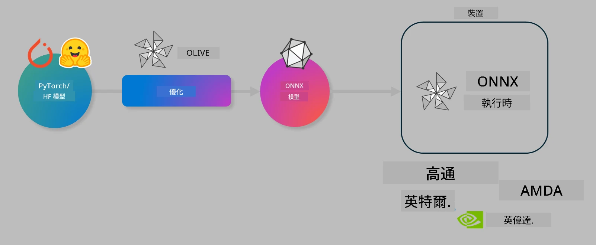

# 實驗室：優化 AI 模型以進行裝置端推論

## 介紹

> [!IMPORTANT]  
> 本實驗室需要配備 **Nvidia A10 或 A100 GPU**，並安裝相應的驅動程式及 CUDA 工具包（版本 12 以上）。

> [!NOTE]  
> 這是一個 **35 分鐘** 的實驗室，將帶您動手體驗使用 OLIVE 進行裝置端推論模型優化的核心概念。

## 學習目標

完成本實驗室後，您將能夠使用 OLIVE：

- 使用 AWQ 量化方法對 AI 模型進行量化。
- 針對特定任務微調 AI 模型。
- 生成 LoRA 適配器（微調模型），以便在 ONNX Runtime 上高效進行裝置端推論。

### 什麼是 Olive

Olive（*O*NNX *live*）是一套模型優化工具包，搭配 CLI，讓您能夠為 ONNX runtime +++https://onnxruntime.ai+++ 發佈具備品質與效能的模型。



Olive 的輸入通常是 PyTorch 或 Hugging Face 模型，輸出則是可在執行 ONNX runtime 的裝置（部署目標）上執行的優化 ONNX 模型。Olive 會針對部署目標的 AI 加速器（NPU、GPU、CPU）進行優化，這些硬體由 Qualcomm、AMD、Nvidia 或 Intel 等廠商提供。

Olive 執行一個 *workflow*，即一連串有序的模型優化任務，稱為 *passes*，例如：模型壓縮、圖形捕捉、量化、圖形優化。每個 pass 都有一組可調整的參數，以達成最佳指標（如準確度和延遲），這些指標由相應的評估器評估。Olive 採用搜尋策略，利用搜尋演算法逐一或同時自動調整各個 pass。

#### Olive 的優點

- **減少手動嘗試錯誤的挫折與時間**，無需自行實驗各種圖形優化、壓縮和量化技術。定義您的品質與效能限制，讓 Olive 自動為您尋找最佳模型。
- **內建 40 多種模型優化元件**，涵蓋量化、壓縮、圖形優化和微調的尖端技術。
- **易用的 CLI**，支援常見模型優化任務，例如 olive quantize、olive auto-opt、olive finetune。
- 內建模型封裝與部署功能。
- 支援生成 **多 LoRA 服務** 的模型。
- 使用 YAML/JSON 建構工作流程，協調模型優化與部署任務。
- 整合 **Hugging Face** 與 **Azure AI**。
- 內建 **快取** 機制，幫助 **節省成本**。

## 實驗室指引

> [!NOTE]  
> 請確保您已依照實驗室 1 的指示，完成 Azure AI Hub 與專案的設定，並配置好 A100 計算資源。

### 步驟 0：連接至您的 Azure AI 計算資源

您將使用 **VS Code** 的遠端功能連接至 Azure AI 計算資源。

1. 開啟您的 **VS Code** 桌面應用程式。  
2. 使用 **Shift+Ctrl+P** 開啟 **命令面板**。  
3. 在命令面板中搜尋 **AzureML - remote: Connect to compute instance in New Window**。  
4. 按照畫面指示連接計算資源，過程中需選擇您的 Azure 訂閱、資源群組、專案及您在實驗室 1 中設定的計算名稱。  
5. 連接成功後，您會在 Visual Code 左下角看到 `><Azure ML: Compute Name`。

### 步驟 1：克隆此儲存庫

在 VS Code 中，您可以使用 **Ctrl+J** 開啟新終端機，並克隆此儲存庫：

終端機中應顯示提示：

```
azureuser@computername:~/cloudfiles/code$ 
```  
克隆解決方案

```bash
cd ~/localfiles
git clone https://github.com/microsoft/phi-3cookbook.git
```

### 步驟 2：在 VS Code 中開啟資料夾

在終端機執行以下指令，將在新視窗中開啟相關資料夾：

```bash
code phi-3cookbook/code/04.Finetuning/Olive-lab
```

或者，您也可以透過選單 **檔案** > **開啟資料夾** 來開啟。

### 步驟 3：安裝相依套件

在 VS Code 中的 Azure AI 計算資源終端機（提示：**Ctrl+J**）執行以下指令安裝相依套件：

```bash
conda create -n olive-ai python=3.11 -y
conda activate olive-ai
pip install -r requirements.txt
az extension remove -n azure-cli-ml
az extension add -n ml
```

> [!NOTE]  
> 安裝所有相依套件約需 5 分鐘。

本實驗室將下載並上傳模型至 Azure AI 模型目錄。為了存取模型目錄，您需要登入 Azure：

```bash
az login
```

> [!NOTE]  
> 登入時系統會要求您選擇訂閱，請務必選擇本實驗室提供的訂閱。

### 步驟 4：執行 Olive 指令

在 VS Code 中的 Azure AI 計算資源終端機（提示：**Ctrl+J**）確保已啟動 `olive-ai` conda 環境：

```bash
conda activate olive-ai
```

接著，在命令列執行以下 Olive 指令。

1. **檢視資料：** 本範例將微調 Phi-3.5-Mini 模型，使其專精於回答旅遊相關問題。以下程式碼會顯示資料集的前幾筆記錄，資料格式為 JSON lines：

    ```bash
    head data/data_sample_travel.jsonl
    ```

2. **量化模型：** 在訓練模型前，先使用以下指令進行量化，採用稱為 Active Aware Quantization (AWQ) +++https://arxiv.org/abs/2306.00978+++ 的技術。AWQ 會根據推論時產生的激活值來量化模型權重，考慮激活值的實際資料分布，較傳統權重量化方法能更好地保留模型準確度。

    ```bash
    olive quantize \
       --model_name_or_path microsoft/Phi-3.5-mini-instruct \
       --trust_remote_code \
       --algorithm awq \
       --output_path models/phi/awq \
       --log_level 1
    ```

    AWQ 量化約需 **8 分鐘**，可將模型大小從約 7.5GB 減少至約 2.5GB。

    本實驗室示範如何從 Hugging Face 輸入模型（例如：`microsoft/Phi-3.5-mini-instruct`），但 Olive 也支援從 Azure AI 目錄輸入模型，只需將 `model_name_or_path` 參數更新為 Azure AI 資產 ID（例如：`azureml://registries/azureml/models/Phi-3.5-mini-instruct/versions/4`）。

3. **訓練模型：** 接著，使用 `olive finetune` 指令微調量化後的模型。先量化再微調能取得較佳準確度，因為微調過程會補償部分量化造成的損失。

    ```bash
    olive finetune \
        --method lora \
        --model_name_or_path models/phi/awq \
        --data_files "data/data_sample_travel.jsonl" \
        --data_name "json" \
        --text_template "<|user|>\n{prompt}<|end|>\n<|assistant|>\n{response}<|end|>" \
        --max_steps 100 \
        --output_path ./models/phi/ft \
        --log_level 1
    ```

    微調（100 步）約需 **6 分鐘**。

4. **優化模型：** 模型訓練完成後，使用 Olive 的 `auto-opt` 指令優化模型，該指令會捕捉 ONNX 圖形並自動執行多項優化，提升 CPU 上的模型效能，包含模型壓縮與融合。您也可以透過更新 `--device` 和 `--provider` 參數，針對 NPU 或 GPU 進行優化，但本實驗室以 CPU 為例。

    ```bash
    olive auto-opt \
       --model_name_or_path models/phi/ft/model \
       --adapter_path models/phi/ft/adapter \
       --device cpu \
       --provider CPUExecutionProvider \
       --use_ort_genai \
       --output_path models/phi/onnx-ao \
       --log_level 1
    ```

    優化約需 **5 分鐘**。

### 步驟 5：模型推論快速測試

為測試模型推論，在資料夾中建立名為 **app.py** 的 Python 檔案，並貼上以下程式碼：

```python
import onnxruntime_genai as og
import numpy as np

print("loading model and adapters...", end="", flush=True)
model = og.Model("models/phi/onnx-ao/model")
adapters = og.Adapters(model)
adapters.load("models/phi/onnx-ao/model/adapter_weights.onnx_adapter", "travel")
print("DONE!")

tokenizer = og.Tokenizer(model)
tokenizer_stream = tokenizer.create_stream()

params = og.GeneratorParams(model)
params.set_search_options(max_length=100, past_present_share_buffer=False)
user_input = "what is the best thing to see in chicago"
params.input_ids = tokenizer.encode(f"<|user|>\n{user_input}<|end|>\n<|assistant|>\n")

generator = og.Generator(model, params)

generator.set_active_adapter(adapters, "travel")

print(f"{user_input}")

while not generator.is_done():
    generator.compute_logits()
    generator.generate_next_token()

    new_token = generator.get_next_tokens()[0]
    print(tokenizer_stream.decode(new_token), end='', flush=True)

print("\n")
```

使用以下指令執行程式：

```bash
python app.py
```

### 步驟 6：將模型上傳至 Azure AI

將模型上傳至 Azure AI 模型庫，可讓開發團隊成員共享模型，並管理模型版本。執行以下指令上傳模型：

> [!NOTE]  
> 請將 `{}` 佔位符替換為您的資源群組名稱與 Azure AI 專案名稱。

若要查詢您的資源群組 `"resourceGroup"` 與 Azure AI 專案名稱，請執行：

```
az ml workspace show
```

或前往 +++ai.azure.com+++，選擇 **管理中心** > **專案** > **總覽**。

將 `{}` 佔位符替換為您的資源群組名稱與 Azure AI 專案名稱。

```bash
az ml model create \
    --name ft-for-travel \
    --version 1 \
    --path ./models/phi/onnx-ao \
    --resource-group {RESOURCE_GROUP_NAME} \
    --workspace-name {PROJECT_NAME}
```

您可在 https://ml.azure.com/model/list 查看已上傳的模型並進行部署。

**免責聲明**：  
本文件係使用 AI 翻譯服務 [Co-op Translator](https://github.com/Azure/co-op-translator) 進行翻譯。雖然我們致力於確保準確性，但請注意，自動翻譯可能包含錯誤或不準確之處。原始文件的母語版本應視為權威來源。對於重要資訊，建議採用專業人工翻譯。我們不對因使用本翻譯而產生的任何誤解或誤釋負責。