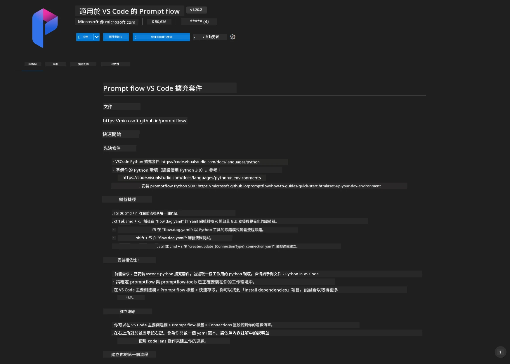
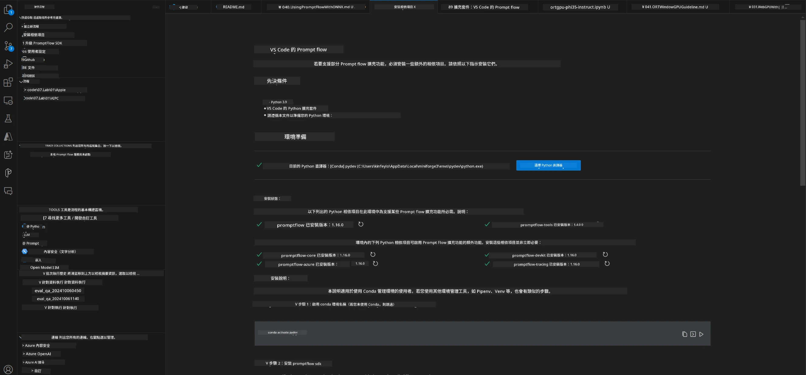
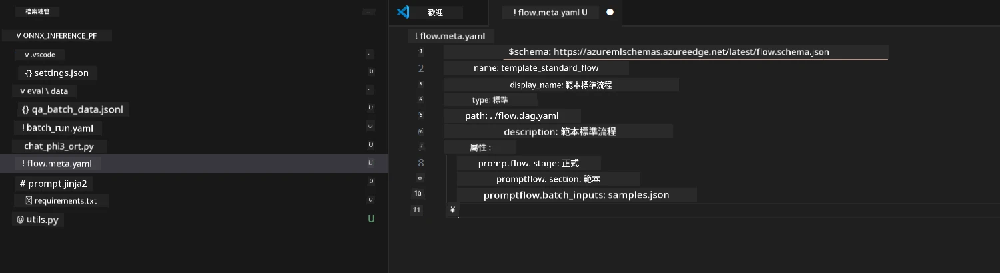
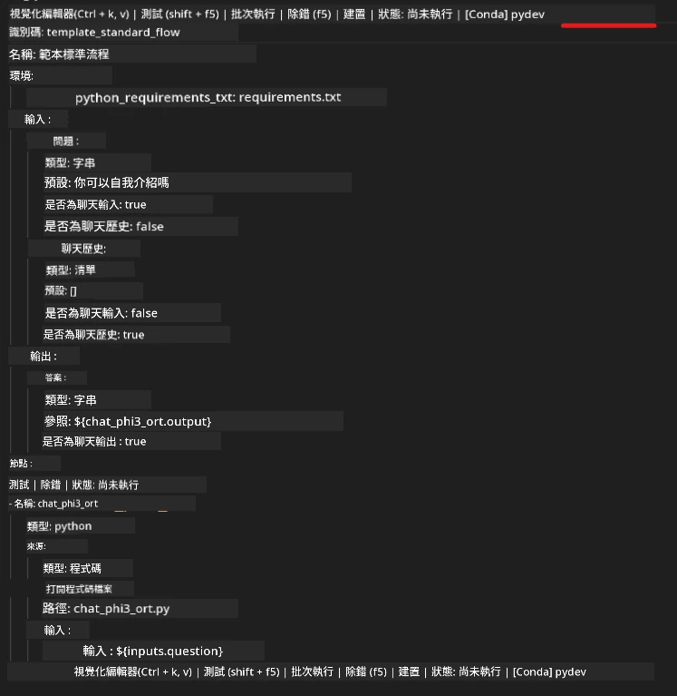
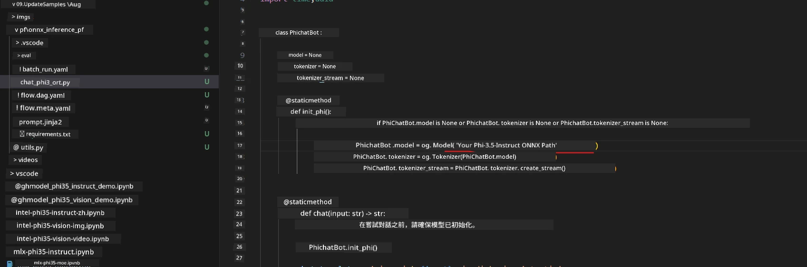
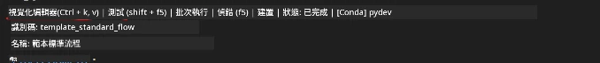
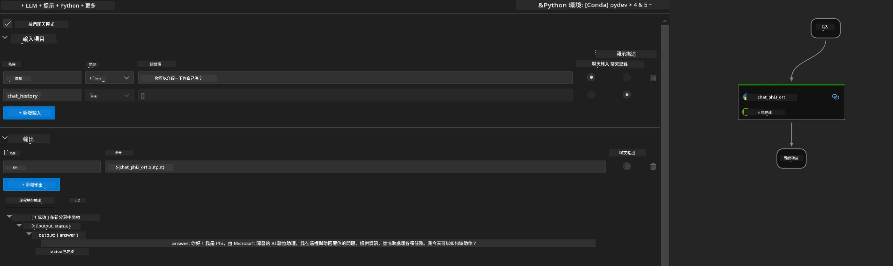
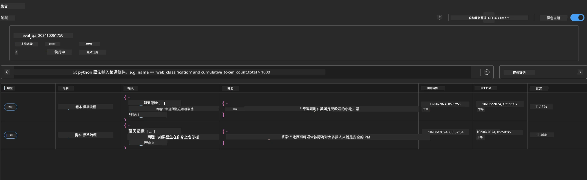

# 使用 Windows GPU 建立 Phi-3.5-Instruct ONNX 的 Prompt flow 解決方案

以下文件示範如何使用 PromptFlow 搭配 ONNX (Open Neural Network Exchange) 來開發基於 Phi-3 模型的 AI 應用。

PromptFlow 是一套開發工具，旨在簡化基於大語言模型 (LLM) 的 AI 應用從構思、原型設計到測試和評估的端到端開發週期。

透過整合 PromptFlow 與 ONNX，開發人員可以：

- 優化模型性能：利用 ONNX 進行高效的模型推理與部署。
- 簡化開發：使用 PromptFlow 管理工作流程並自動化重複性任務。
- 增進協作：提供統一開發環境，促進團隊成員間更好的協作。

**Prompt flow** 是一套開發工具，設計用於簡化基於 LLM 的 AI 應用的端到端開發週期，涵蓋構思、原型、測試、評估到生產部署及監控。它使提示工程變得更加容易，並使你能夠建立具有生產品質的 LLM 應用。

Prompt flow 可連接到 OpenAI、Azure OpenAI 服務以及可客製化模型（Huggingface、本地 LLM/SLM）。我們希望將 Phi-3.5 的量化 ONNX 模型部署到本地應用。Prompt flow 能幫助我們更好地規劃業務並完成基於 Phi-3.5 的本地解決方案。在此示例中，我們將結合 ONNX Runtime GenAI 庫完成基於 Windows GPU 的 Prompt flow 解決方案。

## <strong>安裝</strong>

### **適用於 Windows GPU 的 ONNX Runtime GenAI**

閱讀此指引以設置 Windows GPU 版的 ONNX Runtime GenAI  [點擊此處](./ORTWindowGPUGuideline.md)

### **在 VSCode 中設置 Prompt flow**

1. 安裝 Prompt flow VS Code 擴充功能



2. 安裝 Prompt flow VS Code 擴充功能後，點擊該擴充功能，選擇 <strong>安裝依賴項</strong>，並按照指引在您的環境中安裝 Prompt flow SDK



3. 下載 [範例代碼](../../../../../../code/09.UpdateSamples/Aug/pf/onnx_inference_pf) 並使用 VS Code 打開此範例



4. 打開 **flow.dag.yaml**，選擇您的 Python 環境



   打開 **chat_phi3_ort.py** 修改您的 Phi-3.5-instruct ONNX 模型路徑



5. 執行您的 prompt flow 進行測試

打開 **flow.dag.yaml** 點擊視覺化編輯器



點擊後執行並測試



1. 你可以在終端執行批次以查看更多結果


```bash

pf run create --file batch_run.yaml --stream --name 'Your eval qa name'    

```

你可以在預設瀏覽器中查看結果




---

<!-- CO-OP TRANSLATOR DISCLAIMER START -->
**免責聲明**：
本文件使用 AI 翻譯服務 [Co-op Translator](https://github.com/Azure/co-op-translator) 進行翻譯。雖然我們力求準確，但請注意，自動翻譯可能包含錯誤或不準確之處。原始文件的母語版本應被視為權威來源。對於重要資訊，建議尋求專業人工翻譯。我們不對因使用本翻譯而引起的任何誤解或曲解承擔責任。
<!-- CO-OP TRANSLATOR DISCLAIMER END -->