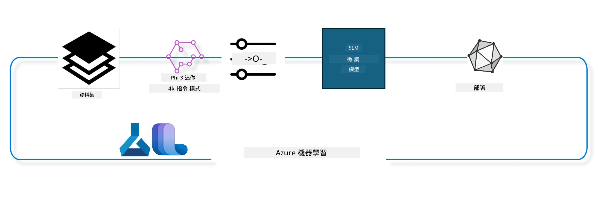

## 如何使用 Azure ML 系統註冊表中的 chat-completion 元件來微調模型

在此範例中，我們將使用 ultrachat_200k 資料集對 Phi-3-mini-4k-instruct 模型進行微調，以完成兩人之間的對話。



範例將示範如何使用 Azure ML SDK 和 Python 進行微調，然後將微調後的模型部署到線上端點以進行即時推論。

### 訓練資料

我們將使用 ultrachat_200k 資料集。這是 UltraChat 資料集的高度篩選版本，曾用於訓練 Zephyr-7B-β，一個先進的 7b 聊天模型。

### 模型

我們將使用 Phi-3-mini-4k-instruct 模型來示範使用者如何為 chat-completion 任務微調模型。如果是從特定模型卡開啟此筆記本，請記得替換特定模型名稱。

### 任務

- 選擇要微調的模型。
- 選擇並探索訓練資料。
- 配置微調工作。
- 執行微調工作。
- 檢視訓練與評估指標。
- 註冊經過微調的模型。
- 部署經過微調的模型進行即時推論。
- 清理資源。

## 1. 設定前置條件

- 安裝相依套件
- 連接 AzureML 工作區。詳細資訊見設定 SDK 認證。下方請替換 <WORKSPACE_NAME>、<RESOURCE_GROUP> 和 <SUBSCRIPTION_ID>。
- 連接到 azureml 系統註冊表
- 設定選擇性實驗名稱
- 檢查或建立計算資源。

> [!NOTE]
> 需求為單一 GPU 節點可包含多張 GPU 卡。例如，Standard_NC24rs_v3 節點中含有 4 張 NVIDIA V100 GPU，而 Standard_NC12s_v3 則有 2 張 NVIDIA V100 GPU。相關資訊請參考文件。每節點 GPU 卡數量設定在下方參數 gpus_per_node。正確設定此參數將確保節點內所有 GPU 可被有效利用。推薦的 GPU 計算 SKU 可在此處與此處找到。

### Python 函式庫

執行下方程式碼區塊以安裝相依套件。如執行環境為全新環境，這步驟非選擇性。

```bash
pip install azure-ai-ml
pip install azure-identity
pip install datasets==2.9.0
pip install mlflow
pip install azureml-mlflow
```

### 與 Azure ML 的互動

1. 此 Python 腳本用來與 Azure 機器學習（Azure ML）服務互動。以下為其功能拆解：

    - 從 azure.ai.ml、azure.identity 與 azure.ai.ml.entities 套件匯入必要模組，並匯入 time 模組。

    - 嘗試使用 DefaultAzureCredential() 進行驗證，提供簡化的驗證流程以快速開發執行於 Azure 雲端的應用程式。如失敗，則備用採用 InteractiveBrowserCredential()，提供互動式登入提示。

    - 試著使用 from_config 方法建立 MLClient 實例，此方法會從預設設定檔（config.json）讀取設定。若失敗，則手動以 subscription_id、resource_group_name 與 workspace_name 建立 MLClient。

    - 建立另一個 MLClient 實例，針對名為 "azureml" 的 Azure ML 註冊表。此註冊表用於儲存模型、微調管線與環境。

    - 將實驗名稱設定為 "chat_completion_Phi-3-mini-4k-instruct"。

    - 生成唯一時間戳記，方法是將當前時間（自 Epoch 起的秒數浮點數）轉成整數再轉成字串。此時間戳記用於建立唯一名稱與版本。

    ```python
    # 從 Azure ML 和 Azure Identity 匯入必要的模組
    from azure.ai.ml import MLClient
    from azure.identity import (
        DefaultAzureCredential,
        InteractiveBrowserCredential,
    )
    from azure.ai.ml.entities import AmlCompute
    import time  # 匯入時間模組
    
    # 嘗試使用 DefaultAzureCredential 進行驗證
    try:
        credential = DefaultAzureCredential()
        credential.get_token("https://management.azure.com/.default")
    except Exception as ex:  # 如果 DefaultAzureCredential 失敗，則使用 InteractiveBrowserCredential
        credential = InteractiveBrowserCredential()
    
    # 嘗試使用預設設定檔建立 MLClient 實例
    try:
        workspace_ml_client = MLClient.from_config(credential=credential)
    except:  # 如果失敗，則手動提供詳細資訊來建立 MLClient 實例
        workspace_ml_client = MLClient(
            credential,
            subscription_id="<SUBSCRIPTION_ID>",
            resource_group_name="<RESOURCE_GROUP>",
            workspace_name="<WORKSPACE_NAME>",
        )
    
    # 為名為 "azureml" 的 Azure ML 註冊表建立另一個 MLClient 實例
    # 此註冊表是存放模型、微調管線和環境的地方
    registry_ml_client = MLClient(credential, registry_name="azureml")
    
    # 設定實驗名稱
    experiment_name = "chat_completion_Phi-3-mini-4k-instruct"
    
    # 產生一個可用於需要唯一名稱和版本的唯一時間戳記
    timestamp = str(int(time.time()))
    ```

## 2. 選擇基礎模型進行微調

1. Phi-3-mini-4k-instruct 是一個擁有 38 億參數的輕量級先進開源模型，建立於用於 Phi-2 的資料集上。此模型屬於 Phi-3 模型家族，其中 Mini 版本有 4K 和 128K 兩種上下文長度（以代幣計）。我們需針對特定目的微調模型，方可使用。您可在 AzureML Studio 的模型目錄中瀏覽這些模型，並以 chat-completion 任務作為篩選條件。在本範例中，使用 Phi-3-mini-4k-instruct 模型。若您是針對其他模型開啟此筆記本，請相應替換模型名稱與版本。

> [!NOTE]
> 此模型之模型 id 屬性將作為輸入傳入微調作業。此屬性同時可於 AzureML Studio 模型目錄的模型詳細頁面中 Asset ID 欄位找到。

2. 此 Python 腳本與 Azure 機器學習（Azure ML）服務互動。功能拆解如下：

    - 將 model_name 設為 "Phi-3-mini-4k-instruct"。

    - 使用 registry_ml_client 物件的 models 屬性的 get 方法，從 Azure ML 註冊表取得指定名稱模型的最新版本。get 方法帶入兩個參數：模型名稱及選擇最新版本的標籤。

    - 在主控臺輸出訊息，顯示將用於微調的模型名稱、版本與 id。使用字串的 format 方法將名稱、版本與 id 塞入訊息文字。model 的名稱、版本與 id 以 foundation_model 物件屬性取得。

    ```python
    # 設定模型名稱
    model_name = "Phi-3-mini-4k-instruct"
    
    # 從 Azure ML 註冊表獲取模型的最新版本
    foundation_model = registry_ml_client.models.get(model_name, label="latest")
    
    # 輸出模型名稱、版本及編號
    # 此資訊有助於追蹤及除錯
    print(
        "\n\nUsing model name: {0}, version: {1}, id: {2} for fine tuning".format(
            foundation_model.name, foundation_model.version, foundation_model.id
        )
    )
    ```

## 3. 建立用於工作之計算資源

微調作業僅支援 GPU 計算資源。計算資源大小依模型規模而定，且在多數情況下較難判斷適合的計算資源規格。本區塊將指引使用者選擇合適的計算資源。

> [!NOTE]
> 下方列出的計算資源以最優化配置運作。任何配置更動可能導致 CUDA 記憶體不足錯誤。若發生此狀況，建議升級為更大規格的計算資源。

> [!NOTE]
> 選擇 compute_cluster_size 時，請確保計算資源在您的資源群組中可用。若特定計算資源不可用，您可提出申請以取得存取權。

### 檢查模型是否支援微調

1. 此 Python 腳本與 Azure 機器學習（Azure ML）模型互動。功能拆解如下：

    - 匯入 ast 模組，ast 提供處理 Python 抽象語法樹的函式。

    - 判斷 foundation_model 物件（代表 Azure ML 中的一個模型）是否具有名為 finetune_compute_allow_list 的標籤。Azure ML 中每個標籤是您的自訂鍵值對，可用於模型過濾與排序。

    - 若存在 finetune_compute_allow_list 標籤，使用 ast.literal_eval 函式安全解析該標籤值（字串）為 Python 列表，並將結果指定給 computes_allow_list 變數。接著輸出訊息表示應從清單中建立計算資源。

    - 若無 finetune_compute_allow_list 標籤，將 computes_allow_list 設為 None，並輸出該標籤非模型標籤組成部分的訊息。

    - 總結，此腳本檢查模型元資料中是否有特定標籤，若存在則將標籤值轉為列表，並向使用者回饋資訊。

    ```python
    # 匯入 ast 模組，提供用於處理 Python 抽象語法樹的函數
    import ast
    
    # 檢查模型的標籤中是否存在 'finetune_compute_allow_list' 標籤
    if "finetune_compute_allow_list" in foundation_model.tags:
        # 如果標籤存在，使用 ast.literal_eval 安全地將標籤的值（字串）解析為 Python 清單
        computes_allow_list = ast.literal_eval(
            foundation_model.tags["finetune_compute_allow_list"]
        )  # 將字串轉換為 Python 清單
        # 印出訊息，指出應從清單建立 compute
        print(f"Please create a compute from the above list - {computes_allow_list}")
    else:
        # 如果標籤不存在，將 computes_allow_list 設為 None
        computes_allow_list = None
        # 印出訊息，指出 'finetune_compute_allow_list' 標籤不在模型的標籤中
        print("`finetune_compute_allow_list` is not part of model tags")
    ```

### 檢查計算資源實例

1. 此 Python 腳本與 Azure 機器學習（Azure ML）服務互動，並對計算資源實例執行多項檢查。功能拆解如下：

    - 嘗試從 Azure ML 工作區取得名稱為 compute_cluster 變數存值的計算資源實例。若該計算實例預配狀態為 "failed"，則引發 ValueError。

    - 判斷 computes_allow_list 是否為 None。若非 None，將清單中所有計算規格名稱轉成小寫，並檢查目前計算實例大小是否在清單中。若不在，則引發 ValueError。

    - 若 computes_allow_list 為 None，則檢查計算實例大小是否包含在不支援 GPU VM 規格清單中。如存在，則引發 ValueError。

    - 取得工作區中所有可用計算規格清單。逐一檢查，尋找名稱匹配目前實例大小的計算資源，並擷取該計算資源的 GPU 張數，設變數 gpu_count_found = True。

    - 若 gpu_count_found 為 True，印出計算實例中 GPU 數量。若為 False，則引發 ValueError。

    - 總結，此腳本對 Azure ML 工作區中計算實例進行多項驗證，包括預配狀態、大小是否允許及 GPU 數量判斷。

    ```python
    # 列印例外訊息
    print(e)
    # 若工作區中沒有該計算大小，則引發 ValueError
    raise ValueError(
        f"WARNING! Compute size {compute_cluster_size} not available in workspace"
    )
    
    # 從 Azure ML 工作區擷取計算實例
    compute = workspace_ml_client.compute.get(compute_cluster)
    # 檢查計算實例的配置狀態是否為「失敗」
    if compute.provisioning_state.lower() == "failed":
        # 若配置狀態為「失敗」，則引發 ValueError
        raise ValueError(
            f"Provisioning failed, Compute '{compute_cluster}' is in failed state. "
            f"please try creating a different compute"
        )
    
    # 檢查 computes_allow_list 是否不為 None
    if computes_allow_list is not None:
        # 將 computes_allow_list 中所有計算大小轉換為小寫
        computes_allow_list_lower_case = [x.lower() for x in computes_allow_list]
        # 檢查計算實例的大小是否在 computes_allow_list_lower_case 中
        if compute.size.lower() not in computes_allow_list_lower_case:
            # 若計算實例的大小不在 computes_allow_list_lower_case 中，則引發 ValueError
            raise ValueError(
                f"VM size {compute.size} is not in the allow-listed computes for finetuning"
            )
    else:
        # 定義不支援的 GPU 虛擬機大小清單
        unsupported_gpu_vm_list = [
            "standard_nc6",
            "standard_nc12",
            "standard_nc24",
            "standard_nc24r",
        ]
        # 檢查計算實例的大小是否在 unsupported_gpu_vm_list 中
        if compute.size.lower() in unsupported_gpu_vm_list:
            # 若計算實例的大小在 unsupported_gpu_vm_list 中，則引發 ValueError
            raise ValueError(
                f"VM size {compute.size} is currently not supported for finetuning"
            )
    
    # 初始化標誌以檢查是否找到計算實例中的 GPU 數量
    gpu_count_found = False
    # 擷取工作區中所有可用計算大小的清單
    workspace_compute_sku_list = workspace_ml_client.compute.list_sizes()
    available_sku_sizes = []
    # 遍歷可用計算大小的清單
    for compute_sku in workspace_compute_sku_list:
        available_sku_sizes.append(compute_sku.name)
        # 檢查計算大小的名稱是否與計算實例的大小匹配
        if compute_sku.name.lower() == compute.size.lower():
            # 若匹配，擷取該計算大小的 GPU 數量並將 gpu_count_found 設為 True
            gpus_per_node = compute_sku.gpus
            gpu_count_found = True
    # 若 gpu_count_found 為 True，則列印計算實例中的 GPU 數量
    if gpu_count_found:
        print(f"Number of GPU's in compute {compute.size}: {gpus_per_node}")
    else:
        # 若 gpu_count_found 為 False，則引發 ValueError
        raise ValueError(
            f"Number of GPU's in compute {compute.size} not found. Available skus are: {available_sku_sizes}."
            f"This should not happen. Please check the selected compute cluster: {compute_cluster} and try again."
        )
    ```

## 4. 選擇用於模型微調的資料集

1. 我們使用 ultrachat_200k 資料集。資料集分為四個拆分，適用於監督微調（sft）與生成排序（gen）。各拆分範例數如下：

    ```bash
    train_sft test_sft  train_gen  test_gen
    207865  23110  256032  28304
    ```

1. 接下來幾個區塊示範微調的基礎資料處理：

### 視覺化部分資料列

為使範例執行快速，僅保存 train_sft、test_sft 檔案，含已裁剪資料的 5%。因此微調模型準確率較低，不適合用於實務應用。
download-dataset.py 用於下載 ultrachat_200k 資料集，並轉換為微調管線元件可消化的格式。由於資料集龐大，此處僅含部分資料。

1. 下方腳本只下載 5% 資料。您可透過修改 dataset_split_pc 參數為需求百分比以調整下載數量。

> [!NOTE]
> 某些語言模型有不同的語言代碼，因此資料集的欄位名稱應與之相符。

1. 以下為資料範例格式
chat-completion 資料集保存為 parquet 格式，每筆資料具有下述結構：

    - 為 JSON（JavaScript 物件表示法）文件，為流行的資料交換格式。該格式非可執行程式碼，而是用於儲存與傳輸資料。其結構說明如下：

    - "prompt": 欄位包含文字字串，表示交給 AI 助理的任務或問題。

    - "messages": 欄位包含物件陣列，每個物件為用戶與 AI 助理間一則對話訊息。訊息物件有兩個欄位：

    - "content": 欄位為文字字串，代表訊息內容。
    - "role": 欄位為文字字串，指定訊息發送者身份，可能是 "user" 或 "assistant"。
    - "prompt_id": 欄位為文字字串，代表該提示的唯一識別碼。

1. 此特定 JSON 文件中，對話場景為用戶請 AI 助理創建一個反烏托邦故事的主角，助理回應，隨後用戶請求更多細節，助理同意提供更多資訊。整段對話關聯特定 prompt id。

    ```python
    {
        // The task or question posed to an AI assistant
        "prompt": "Create a fully-developed protagonist who is challenged to survive within a dystopian society under the rule of a tyrant. ...",
        
        // An array of objects, each representing a message in a conversation between a user and an AI assistant
        "messages":[
            {
                // The content of the user's message
                "content": "Create a fully-developed protagonist who is challenged to survive within a dystopian society under the rule of a tyrant. ...",
                // The role of the entity that sent the message
                "role": "user"
            },
            {
                // The content of the assistant's message
                "content": "Name: Ava\n\n Ava was just 16 years old when the world as she knew it came crashing down. The government had collapsed, leaving behind a chaotic and lawless society. ...",
                // The role of the entity that sent the message
                "role": "assistant"
            },
            {
                // The content of the user's message
                "content": "Wow, Ava's story is so intense and inspiring! Can you provide me with more details.  ...",
                // The role of the entity that sent the message
                "role": "user"
            }, 
            {
                // The content of the assistant's message
                "content": "Certainly! ....",
                // The role of the entity that sent the message
                "role": "assistant"
            }
        ],
        
        // A unique identifier for the prompt
        "prompt_id": "d938b65dfe31f05f80eb8572964c6673eddbd68eff3db6bd234d7f1e3b86c2af"
    }
    ```

### 下載資料

1. 此 Python 腳本用於透過輔助腳本 download-dataset.py 下載資料集。功能拆解如下：

    - 匯入 os 模組，提供跨平台作業系統功能。

    - 使用 os.system 函式在 shell 執行 download-dataset.py，附帶特定命令列參數。參數指定欲下載資料集為 HuggingFaceH4/ultrachat_200k，下載目錄為 ultrachat_200k_dataset，資料拆分比例為 5%。os.system 回傳所執行命令的退出狀態，存入 exit_status 變數。

    - 判斷 exit_status 是否不為 0。在類 Unix 系統中，退出狀態 0 代表該命令成功執行，非 0 表示出錯。若非 0，則拋出 Exception，訊息提示下載資料集時出錯。

    - 總結，此腳本執行輔助命令下載資料集，若失敗則拋出異常。

    ```python
    # 匯入 os 模組，提供使用作業系統相依功能嘅方法
    import os
    
    # 使用 os.system 函數喺 shell 中執行 download-dataset.py 腳本，並帶有指定嘅命令行參數
    # 參數指定要下載嘅數據集（HuggingFaceH4/ultrachat_200k）、下載目錄（ultrachat_200k_dataset）同數據集拆分嘅百分比（5）
    # os.system 函數返回執行命令嘅退出狀態；呢個狀態存喺 exit_status 變量
    exit_status = os.system(
        "python ./download-dataset.py --dataset HuggingFaceH4/ultrachat_200k --download_dir ultrachat_200k_dataset --dataset_split_pc 5"
    )
    
    # 檢查 exit_status 是否唔係 0
    # 喺類 Unix 操作系統中，退出狀態為 0 通常表示命令成功，而其他數字表示有錯誤
    # 如果 exit_status 唔係 0，就拋出一個異常，訊息指示下載數據集時出錯
    if exit_status != 0:
        raise Exception("Error downloading dataset")
    ```

### 載入資料至 DataFrame


1. 此 Python 腳本將 JSON Lines 文件載入 pandas DataFrame 並顯示前 5 行。以下是它的功能解析：

    - 它匯入了 pandas 函式庫，這是一個強大的資料操作和分析函式庫。

    - 它將 pandas 顯示選項中的最大欄寬設定為 0。這表示在列印 DataFrame 時，每個欄位的全文字都會顯示，不會被截斷。

    - 它使用 pd.read_json 函數從 ultrachat_200k_dataset 目錄載入 train_sft.jsonl 文件至 DataFrame。lines=True 參數表明該文件為 JSON Lines 格式，即每行都是一個獨立的 JSON 物件。

    - 它使用 head 方法顯示 DataFrame 的前 5 行。如果 DataFrame 少於 5 行，則會顯示全部行。

    - 總結來說，該腳本將 JSON Lines 文件載入到 DataFrame 並以完整欄位文字顯示前 5 行。
    
    ```python
    # 引入 pandas 库，這是一個強大的數據操作和分析庫
    import pandas as pd
    
    # 將 pandas 顯示選項的最大欄寬設置為 0
    # 這表示在打印 DataFrame 時，每個欄的完整文字將會顯示，無需截斷
    pd.set_option("display.max_colwidth", 0)
    
    # 使用 pd.read_json 函數從 ultrachat_200k_dataset 目錄中載入 train_sft.jsonl 檔案到 DataFrame
    # lines=True 參數表示該檔案是 JSON Lines 格式，每行都是一個獨立的 JSON 物件
    df = pd.read_json("./ultrachat_200k_dataset/train_sft.jsonl", lines=True)
    
    # 使用 head 方法顯示 DataFrame 的前 5 行
    # 如果 DataFrame 少於 5 行，則會顯示全部行數
    df.head()
    ```

## 5. 使用模型和數據作為輸入提交微調作業

建立使用 chat-completion 管道元件的作業。了解所有支援微調參數的更多資訊。

### 定義微調參數

1. 微調參數可分為兩類 - 訓練參數、優化參數

1. 訓練參數定義了訓練的各種方面，如 -

    - 使用的優化器、排程器
    - 用於優化微調的度量指標
    - 訓練步數、批次大小等等
    - 優化參數協助優化 GPU 記憶體，並有效使用計算資源。

1. 以下列出此類別的一些參數。優化參數會因不同模型而異，且隨模型包裝以處理這些差異。

    - 啟用 deepspeed 與 LoRA
    - 啟用混合精度訓練
    - 啟用多節點訓練

> [!NOTE]
> 監督式微調可能導致對齊喪失或災難性遺忘。建議檢查此問題，並在微調後執行對齊階段。

### 微調參數

1. 此 Python 腳本設定機器學習模型微調參數。以下是它的功能解析：

    - 設定預設的訓練參數，如訓練週期數、訓練及評估批次大小、學習率、學習率排程器類型。

    - 設定預設的優化參數，如是否啟用 Layer-wise Relevance Propagation (LoRa) 和 DeepSpeed，及 DeepSpeed 階段。

    - 將訓練和優化參數合併為一個名為 finetune_parameters 的字典。

    - 檢查 foundation_model 是否具有任何特定模型的默認參數。若有，將印出警告訊息，並以 ast.literal_eval 函數將特定模型默認參數從字串轉為 Python 字典，更新 finetune_parameters。

    - 印出將用於執行的最終微調參數集合。

    - 總結來說，此腳本設定並顯示機器學習模型微調參數，並能以特定模型參數覆寫預設值。

    ```python
    # 設定預設的訓練參數，例如訓練迭代次數、訓練和評估的批次大小、學習率及學習率調度器類型
    training_parameters = dict(
        num_train_epochs=3,
        per_device_train_batch_size=1,
        per_device_eval_batch_size=1,
        learning_rate=5e-6,
        lr_scheduler_type="cosine",
    )
    
    # 設定預設的優化參數，例如是否應用層級相關性傳播（LoRa）和 DeepSpeed，及 DeepSpeed 階段
    optimization_parameters = dict(
        apply_lora="true",
        apply_deepspeed="true",
        deepspeed_stage=2,
    )
    
    # 將訓練參數和優化參數結合成一個名為 finetune_parameters 的字典
    finetune_parameters = {**training_parameters, **optimization_parameters}
    
    # 檢查 foundation_model 是否有任何特定模型的預設參數
    # 如果有，則列印警告訊息並使用這些模型特定的預設參數更新 finetune_parameters 字典
    # 使用 ast.literal_eval 函數將模型特定預設參數從字串轉換為 Python 字典
    if "model_specific_defaults" in foundation_model.tags:
        print("Warning! Model specific defaults exist. The defaults could be overridden.")
        finetune_parameters.update(
            ast.literal_eval(  # 將字串轉換成 Python 字典
                foundation_model.tags["model_specific_defaults"]
            )
        )
    
    # 列印用於執行的最終微調參數組合
    print(
        f"The following finetune parameters are going to be set for the run: {finetune_parameters}"
    )
    ```

### 訓練管線

1. 此 Python 腳本定義一個函數，用來產生機器學習訓練管線的顯示名稱，並呼叫該函數產生並列印顯示名稱。以下是功能解析：

1. 定義 get_pipeline_display_name 函數。該函數基於訓練管線相關的各項參數產生顯示名稱。

1. 函數內計算總批次大小，乘以每裝置批次大小、梯度累積步數、每節點 GPU 數量以及微調用的節點數。

1. 取得其他參數如學習率排程器類型、是否使用 DeepSpeed、DeepSpeed 階段、是否使用 LoRa、保留的模型檢查點數量上限及最大序列長度。

1. 建構包含上述所有參數並以連字號分隔的字串。如果啟用 DeepSpeed 或 LoRa，字串會包含 "ds" 後接階段號碼，或是 "lora"。否則，分別為 "nods" 和 "nolora"。

1. 函數回傳此字串作為訓練管線的顯示名稱。

1. 定義後，呼叫該函數生成顯示名稱並列印。

1. 總結來說，此腳本依據多項參數產生機器學習訓練管線的顯示名稱，並將其列印出來。

    ```python
    # 定義一個函數以生成訓練流程的顯示名稱
    def get_pipeline_display_name():
        # 通過乘以每設備批次大小、梯度累積步數、每節點 GPU 數量及用於微調的節點數量來計算總批次大小
        batch_size = (
            int(finetune_parameters.get("per_device_train_batch_size", 1))
            * int(finetune_parameters.get("gradient_accumulation_steps", 1))
            * int(gpus_per_node)
            * int(finetune_parameters.get("num_nodes_finetune", 1))
        )
        # 獲取學習率調度器類型
        scheduler = finetune_parameters.get("lr_scheduler_type", "linear")
        # 獲取是否應用 DeepSpeed
        deepspeed = finetune_parameters.get("apply_deepspeed", "false")
        # 獲取 DeepSpeed 階段
        ds_stage = finetune_parameters.get("deepspeed_stage", "2")
        # 如果應用 DeepSpeed，在顯示名稱中包含 "ds" 並跟隨 DeepSpeed 階段；否則包含 "nods"
        if deepspeed == "true":
            ds_string = f"ds{ds_stage}"
        else:
            ds_string = "nods"
        # 獲取是否應用層級相關性傳播（LoRa）
        lora = finetune_parameters.get("apply_lora", "false")
        # 如果應用 LoRa，在顯示名稱中包含 "lora"；否則包含 "nolora"
        if lora == "true":
            lora_string = "lora"
        else:
            lora_string = "nolora"
        # 獲取要保留的模型檢查點數量限制
        save_limit = finetune_parameters.get("save_total_limit", -1)
        # 獲取最大序列長度
        seq_len = finetune_parameters.get("max_seq_length", -1)
        # 通過連接所有這些參數並用連字號分隔來構造顯示名稱
        return (
            model_name
            + "-"
            + "ultrachat"
            + "-"
            + f"bs{batch_size}"
            + "-"
            + f"{scheduler}"
            + "-"
            + ds_string
            + "-"
            + lora_string
            + f"-save_limit{save_limit}"
            + f"-seqlen{seq_len}"
        )
    
    # 調用函數生成顯示名稱
    pipeline_display_name = get_pipeline_display_name()
    # 列印顯示名稱
    print(f"Display name used for the run: {pipeline_display_name}")
    ```

### 配置管線

此 Python 腳本使用 Azure Machine Learning SDK 定義及配置機器學習管線。以下是功能解析：

1. 從 Azure AI ML SDK 匯入必要模組。

1. 從註冊中心獲取名為 "chat_completion_pipeline" 的管線元件。

1. 使用 `@pipeline` 裝飾器及 `create_pipeline` 函數定義管線作業。管線名稱設為 `pipeline_display_name`。

1. 在 `create_pipeline` 函數內，初始化先前獲取的管線元件，帶入多種參數，包括模型路徑、不同階段的計算叢集、用於訓練和測試的資料切分、微調時使用的 GPU 數量及其他微調參數。

1. 將微調作業的輸出映射為管線作業的輸出。此舉便於輕鬆註冊微調後的模型，這是部署至即時或批次端點所需。

1. 呼叫 `create_pipeline` 函數建立管線實例。

1. 設置管線的 `force_rerun` 為 `True`，表示不使用之前作業的快取結果。

1. 設置管線的 `continue_on_step_failure` 為 `False`，表示若任何步驟失敗，管線即停止。

1. 總結來說，此腳本使用 Azure Machine Learning SDK 定義並配置用於聊天完成功能的機器學習管線。

    ```python
    # 從 Azure AI ML SDK 匯入必要的模組
    from azure.ai.ml.dsl import pipeline
    from azure.ai.ml import Input
    
    # 從登記處擷取名為 "chat_completion_pipeline" 的管道元件
    pipeline_component_func = registry_ml_client.components.get(
        name="chat_completion_pipeline", label="latest"
    )
    
    # 使用 @pipeline 裝飾器和 create_pipeline 函數定義管道作業
    # 管道的名稱設為 pipeline_display_name
    @pipeline(name=pipeline_display_name)
    def create_pipeline():
        # 使用各種參數初始化擷取的管道元件
        # 這些參數包括模型路徑、不同階段的運算集群、訓練和測試的數據集拆分、用於微調的 GPU 數量及其他微調參數
        chat_completion_pipeline = pipeline_component_func(
            mlflow_model_path=foundation_model.id,
            compute_model_import=compute_cluster,
            compute_preprocess=compute_cluster,
            compute_finetune=compute_cluster,
            compute_model_evaluation=compute_cluster,
            # 將數據集拆分映射到參數
            train_file_path=Input(
                type="uri_file", path="./ultrachat_200k_dataset/train_sft.jsonl"
            ),
            test_file_path=Input(
                type="uri_file", path="./ultrachat_200k_dataset/test_sft.jsonl"
            ),
            # 訓練設定
            number_of_gpu_to_use_finetuning=gpus_per_node,  # 設為運算中可用 GPU 的數量
            **finetune_parameters
        )
        return {
            # 將微調作業的輸出映射到管道作業的輸出
            # 這樣做是為了能夠輕鬆註冊微調後的模型
            # 註冊模型是部署模型到線上或批次端點所必需的
            "trained_model": chat_completion_pipeline.outputs.mlflow_model_folder
        }
    
    # 呼叫 create_pipeline 函數建立管道實例
    pipeline_object = create_pipeline()
    
    # 不使用先前作業的快取結果
    pipeline_object.settings.force_rerun = True
    
    # 將發生錯誤時繼續執行設為 False
    # 這表示若任何步驟失敗，管道將停止執行
    pipeline_object.settings.continue_on_step_failure = False
    ```

### 提交作業

1. 此 Python 腳本向 Azure Machine Learning 工作區提交一個機器學習管線作業，並等待該作業完成。以下是功能解析：

    - 它呼叫 workspace_ml_client 中 jobs 物件的 create_or_update 方法提交管線作業。要執行的管線由 pipeline_object 指定，作業所屬的實驗名稱由 experiment_name 指定。

    - 接著呼叫 workspace_ml_client 中 jobs 物件的 stream 方法，等待管線作業完成。等待的作業由 pipeline_job 物件的 name 屬性指定。

    - 總結來說，此腳本將一個機器學習管線作業提交到 Azure Machine Learning 工作區，並等待其完成。

    ```python
    # 提交流水線作業至 Azure 機器學習工作區
    # 要運行的流水線由 pipeline_object 指定
    # 作業運行所屬的實驗由 experiment_name 指定
    pipeline_job = workspace_ml_client.jobs.create_or_update(
        pipeline_object, experiment_name=experiment_name
    )
    
    # 等待流水線作業完成
    # 要等待的作業由 pipeline_job 物件的 name 屬性指定
    workspace_ml_client.jobs.stream(pipeline_job.name)
    ```

## 6. 將微調模型註冊至工作區

我們將從微調作業的輸出中註冊模型。此舉將追蹤微調模型與微調作業之間的系譜。微調作業亦持續追蹤基礎模型、數據及訓練代碼的系譜。

### 註冊 ML 模型

1. 此 Python 腳本註冊一個在 Azure Machine Learning 管線中訓練的機器學習模型。以下是功能解析：

    - 匯入 Azure AI ML SDK 的必要模組。

    - 透過呼叫 workspace_ml_client jobs 物件的 get 方法並訪問 outputs 屬性，檢查管線作業是否產生 trained_model 輸出。

    - 構造訓練後模型的路徑，格式為管線作業名稱和輸出名稱 ("trained_model")。

    - 定義微調模型名稱，將原始模型名稱尾接 "-ultrachat-200k" 並將任何斜線替換成連字號。

    - 準備註冊模型，創建 Model 物件，包含模型路徑、模型類型 (MLflow 模型)、模型名稱與版本，以及模型說明。

    - 透過調用 workspace_ml_client models 物件的 create_or_update 方法並傳入 Model 物件，完成模型註冊。

    - 列印註冊後的模型資訊。

1. 總結來說，此腳本註冊了一個在 Azure Machine Learning 管線中訓練的機器學習模型。
    
    ```python
    # 從 Azure AI ML SDK 匯入必要的模組
    from azure.ai.ml.entities import Model
    from azure.ai.ml.constants import AssetTypes
    
    # 檢查管道作業中是否有 `trained_model` 輸出可用
    print("pipeline job outputs: ", workspace_ml_client.jobs.get(pipeline_job.name).outputs)
    
    # 通過格式化包含管道作業名稱和輸出名稱（"trained_model"）的字串來構建訓練模型的路徑
    model_path_from_job = "azureml://jobs/{0}/outputs/{1}".format(
        pipeline_job.name, "trained_model"
    )
    
    # 定義微調模型的名稱，方法是將 "-ultrachat-200k" 附加到原始模型名稱，並將所有斜線替換為連字號
    finetuned_model_name = model_name + "-ultrachat-200k"
    finetuned_model_name = finetuned_model_name.replace("/", "-")
    
    print("path to register model: ", model_path_from_job)
    
    # 通過創建一個帶有各種參數的 Model 物件來準備註冊模型
    # 這些參數包括模型路徑、模型類型（MLflow 模型）、模型名稱和版本以及模型描述
    prepare_to_register_model = Model(
        path=model_path_from_job,
        type=AssetTypes.MLFLOW_MODEL,
        name=finetuned_model_name,
        version=timestamp,  # 使用時間戳作為版本以避免版本衝突
        description=model_name + " fine tuned model for ultrachat 200k chat-completion",
    )
    
    print("prepare to register model: \n", prepare_to_register_model)
    
    # 通過呼叫 workspace_ml_client 中 models 物件的 create_or_update 方法並以 Model 物件作為參數來註冊模型
    registered_model = workspace_ml_client.models.create_or_update(
        prepare_to_register_model
    )
    
    # 印出已註冊的模型
    print("registered model: \n", registered_model)
    ```

## 7. 將微調模型部署到線上端點

線上端點提供一個持久的 REST API，可用於需要使用模型之應用程式整合。

### 管理端點

1. 此 Python 腳本在 Azure Machine Learning 為註冊模型建立一個受管線上的端點。以下是功能解析：

    - 匯入 Azure AI ML SDK 的必要模組。

    - 定義一個唯一的線上端點名稱，透過將時間戳接於字串 "ultrachat-completion-" 後。

    - 創建 ManagedOnlineEndpoint 物件準備建立端點，包含端點名稱、描述以及認證模式 ("key")。

    - 呼叫 workspace_ml_client 的 begin_create_or_update 方法並傳入 ManagedOnlineEndpoint 物件創建線上端點，並透過 wait 方法等待建立操作完成。

1. 總結來說，此腳本建立了一個 Azure Machine Learning 中的受管線上端點以供已註冊模型使用。

    ```python
    # 從 Azure AI ML SDK 匯入必要的模組
    from azure.ai.ml.entities import (
        ManagedOnlineEndpoint,
        ManagedOnlineDeployment,
        ProbeSettings,
        OnlineRequestSettings,
    )
    
    # 通過在字串 "ultrachat-completion-" 後附加時間戳來定義線上端點的唯一名稱
    online_endpoint_name = "ultrachat-completion-" + timestamp
    
    # 準備建立線上端點，透過建立一個包含多個參數的 ManagedOnlineEndpoint 物件
    # 這些參數包括端點名稱、端點描述及驗證模式（"key"）
    endpoint = ManagedOnlineEndpoint(
        name=online_endpoint_name,
        description="Online endpoint for "
        + registered_model.name
        + ", fine tuned model for ultrachat-200k-chat-completion",
        auth_mode="key",
    )
    
    # 透過呼叫 workspace_ml_client 的 begin_create_or_update 方法並以 ManagedOnlineEndpoint 物件作為參數來建立線上端點
    # 然後呼叫 wait 方法等待建立操作完成
    workspace_ml_client.begin_create_or_update(endpoint).wait()
    ```

> [!NOTE]
> 您可以在此查看支援部署的 SKU 清單 - [Managed online endpoints SKU list](https://learn.microsoft.com/azure/machine-learning/reference-managed-online-endpoints-vm-sku-list)

### 部署 ML 模型

1. 此 Python 腳本將一個已註冊的機器學習模型部署到 Azure Machine Learning 中的一個受管線上端點。以下是功能解析：

    - 匯入 ast 模組，該模組提供處理 Python 抽象語法樹的功能。

    - 將部署的實例類型設為 "Standard_NC6s_v3"。

    - 檢查 foundation model 中是否存在 inference_compute_allow_list 標籤。若存在，將標籤字串轉為 Python 清單並指派給 inference_computes_allow_list；若不存在，設為 None。

    - 檢查指定的實例類型是否在允許清單中。若不在，印出訊息請使用者從允許清單中選擇實例類型。

    - 準備建立部署，創建 ManagedOnlineDeployment 物件，包含部署名稱、端點名稱、模型 ID、實例類型與數量、活性檢查配置以及請求設置。

    - 呼叫 workspace_ml_client 的 begin_create_or_update 方法並傳入 ManagedOnlineDeployment 物件建立部署，並透過 wait 方法等待建立完成。

    - 將端點流量分配為 100% 指向名為 "demo" 的部署。

    - 呼叫 workspace_ml_client 的 begin_create_or_update 方法並傳入更新後的端點物件，並透過 result 方法等待更新操作完成。

1. 總結來說，此腳本將已註冊的機器學習模型部署至 Azure Machine Learning 的受管線上端點。

    ```python
    # 匯入 ast 模組，該模組提供處理 Python 抽象語法樹的函數
    import ast
    
    # 設定部署的實例類型
    instance_type = "Standard_NC6s_v3"
    
    # 檢查基礎模型中是否存在 `inference_compute_allow_list` 標籤
    if "inference_compute_allow_list" in foundation_model.tags:
        # 如果存在，將標籤值從字串轉換為 Python 列表，並指派給 `inference_computes_allow_list`
        inference_computes_allow_list = ast.literal_eval(
            foundation_model.tags["inference_compute_allow_list"]
        )
        print(f"Please create a compute from the above list - {computes_allow_list}")
    else:
        # 如果不存在，將 `inference_computes_allow_list` 設定為 `None`
        inference_computes_allow_list = None
        print("`inference_compute_allow_list` is not part of model tags")
    
    # 檢查指定的實例類型是否在允許清單中
    if (
        inference_computes_allow_list is not None
        and instance_type not in inference_computes_allow_list
    ):
        print(
            f"`instance_type` is not in the allow listed compute. Please select a value from {inference_computes_allow_list}"
        )
    
    # 準備建立部署，透過建立一個帶有多個參數的 `ManagedOnlineDeployment` 物件
    demo_deployment = ManagedOnlineDeployment(
        name="demo",
        endpoint_name=online_endpoint_name,
        model=registered_model.id,
        instance_type=instance_type,
        instance_count=1,
        liveness_probe=ProbeSettings(initial_delay=600),
        request_settings=OnlineRequestSettings(request_timeout_ms=90000),
    )
    
    # 呼叫 `workspace_ml_client` 的 `begin_create_or_update` 方法並傳入 `ManagedOnlineDeployment` 物件來建立部署
    # 然後呼叫 `wait` 方法，等待建立操作完成
    workspace_ml_client.online_deployments.begin_create_or_update(demo_deployment).wait()
    
    # 設定端點的流量，將 100% 流量導向 "demo" 部署
    endpoint.traffic = {"demo": 100}
    
    # 呼叫 `workspace_ml_client` 的 `begin_create_or_update` 方法並傳入 `endpoint` 物件來更新端點
    # 然後呼叫 `result` 方法，等待更新操作完成
    workspace_ml_client.begin_create_or_update(endpoint).result()
    ```

## 8. 使用範例資料測試端點

我們將從測試資料集中擷取一些範例資料並提交至線上端點進行推論。接著我們將展示分數標籤與真實標籤的對比。

### 讀取結果

1. 此 Python 腳本將 JSON Lines 文件讀入 pandas DataFrame，隨機採樣並重設索引。以下是功能解析：

    - 讀取檔案 ./ultrachat_200k_dataset/test_gen.jsonl 至 pandas DataFrame。因該文件為 JSON Lines 格式，每行為獨立 JSON 物件，故使用 read_json 函數時帶入 lines=True。

    - 從 DataFrame 中隨機取樣 1 行。使用 sample 函數，n=1 指定所取樣本的行數。

    - 重設 DataFrame 的索引。使用 reset_index 函數，带入 drop=True 以刪除原索引並用預設整數索引替代。

    - 使用 head 函數顯示前 2 行，但由於經隨機採樣後 DataFrame 僅有一行，所以只會顯示該行。

1. 總結來說，此腳本將 JSON Lines 文件讀入 pandas DataFrame，隨機抽取 1 行，重設索引，並顯示該行。
    
    ```python
    # 載入 pandas 函式庫
    import pandas as pd
    
    # 將 JSON Lines 檔案 './ultrachat_200k_dataset/test_gen.jsonl' 讀取到 pandas DataFrame
    # 'lines=True' 參數表示檔案是 JSON Lines 格式，每一行都是一個獨立的 JSON 物件
    test_df = pd.read_json("./ultrachat_200k_dataset/test_gen.jsonl", lines=True)
    
    # 從 DataFrame 中隨機抽取一行
    # 'n=1' 參數指定要選取的隨機行數為 1
    test_df = test_df.sample(n=1)
    
    # 重設 DataFrame 的索引
    # 'drop=True' 參數表示要丟棄原本索引，並以預設的整數值索引取代
    # 'inplace=True' 參數表示在原地修改 DataFrame（不建立新的物件）
    test_df.reset_index(drop=True, inplace=True)
    
    # 顯示 DataFrame 前兩行
    # 但因為取樣後 DataFrame 只有一行，所以只會顯示該一行
    test_df.head(2)
    ```

### 建立 JSON 物件
1. 這個 Python 腳本正在建立一個具有特定參數的 JSON 物件並將其保存到文件中。下面是它的工作流程：

    - 匯入 json 模組，該模組提供處理 JSON 資料的函數。

    - 建立一個名為 parameters 的字典，其中的鍵和值代表機器學習模型的參數。鍵包括 "temperature"、"top_p"、"do_sample" 和 "max_new_tokens"，對應的值分別是 0.6、0.9、True 及 200。

    - 建立另一個字典 test_json，包含兩個鍵：「input_data」和「params」。「input_data」的值為另一個字典，該字典包括鍵 "input_string" 和 "parameters"。"input_string" 的值是一個列表，包含 test_df DataFrame 中的第一條訊息；"parameters" 的值是之前建立的 parameters 字典。鍵 "params" 的值則是一個空字典。

    - 打開名為 sample_score.json 的文件

    ```python
    # 匯入 json 模組，該模組提供處理 JSON 資料的函式
    import json
    
    # 建立一個字典 `parameters`，其鍵和值代表機器學習模型的參數
    # 這些鍵分別為 "temperature"、"top_p"、"do_sample" 和 "max_new_tokens"，其對應的值分別是 0.6、0.9、True 和 200
    parameters = {
        "temperature": 0.6,
        "top_p": 0.9,
        "do_sample": True,
        "max_new_tokens": 200,
    }
    
    # 建立另一個字典 `test_json`，包含兩個鍵："input_data" 和 "params"
    # "input_data" 的值為另一個字典，包含鍵 "input_string" 和 "parameters"
    # "input_string" 的值是一個列表，包含 `test_df` 資料框的第一則訊息
    # "parameters" 的值是先前建立的 `parameters` 字典
    # "params" 的值為一個空字典
    test_json = {
        "input_data": {
            "input_string": [test_df["messages"][0]],
            "parameters": parameters,
        },
        "params": {},
    }
    
    # 以寫入模式開啟位於 `./ultrachat_200k_dataset` 目錄下名為 `sample_score.json` 的檔案
    with open("./ultrachat_200k_dataset/sample_score.json", "w") as f:
        # 使用 `json.dump` 函式將 `test_json` 字典以 JSON 格式寫入檔案
        json.dump(test_json, f)
    ```

### 調用端點

1. 這個 Python 腳本正在調用 Azure Machine Learning 中的線上端點來對 JSON 文件進行評分。下面是它的工作流程：

    - 調用 workspace_ml_client 對象的 online_endpoints 屬性中的 invoke 方法。此方法用於向線上端點發送請求並獲取回應。

    - 使用 endpoint_name 和 deployment_name 參數指定端點的名稱和部署名稱。在這裡，端點名稱存儲在 online_endpoint_name 變數中，部署名稱為 "demo"。

    - 使用 request_file 參數指定要評分的 JSON 文件路徑，此例中文件為 ./ultrachat_200k_dataset/sample_score.json。

    - 將端點的回應儲存在 response 變數中。

    - 輸出原始回應。

1. 總結來說，這個腳本調用了 Azure Machine Learning 的線上端點來對 JSON 文件進行評分，並印出回應結果。

    ```python
    # 調用 Azure 機器學習中的線上端點來評分 `sample_score.json` 檔案
    # 使用 `workspace_ml_client` 物件的 `online_endpoints` 屬性中的 `invoke` 方法向線上端點發送請求並獲取回應
    # `endpoint_name` 參數指定端點的名稱，該名稱存儲於 `online_endpoint_name` 變數中
    # `deployment_name` 參數指定部署的名稱，為 "demo"
    # `request_file` 參數指定要評分的 JSON 檔案路徑，為 `./ultrachat_200k_dataset/sample_score.json`
    response = workspace_ml_client.online_endpoints.invoke(
        endpoint_name=online_endpoint_name,
        deployment_name="demo",
        request_file="./ultrachat_200k_dataset/sample_score.json",
    )
    
    # 輸出來自端點的原始回應
    print("raw response: \n", response, "\n")
    ```

## 9. 刪除線上端點

1. 別忘了刪除線上端點，否則計算資源仍將持續計費。這行 Python 代碼正在刪除 Azure Machine Learning 中的線上端點。它的工作流程如下：

    - 調用 workspace_ml_client 對象的 online_endpoints 屬性中的 begin_delete 方法。此方法啟動線上端點的刪除程序。

    - 使用 name 參數指定要刪除的端點名稱，該名稱存儲在 online_endpoint_name 變數中。

    - 調用 wait 方法等待刪除操作完成。這是阻塞操作，直到刪除完成前腳本會暫停執行。

    - 總結而言，這行代碼啟動了 Azure Machine Learning 線上端點的刪除，並等待該操作結束。

    ```python
    # 刪除 Azure 機器學習中的線上端點
    # 使用 `workspace_ml_client` 物件的 `online_endpoints` 屬性的 `begin_delete` 方法來開始刪除線上端點
    # `name` 參數指定要刪除的端點名稱，該名稱儲存在 `online_endpoint_name` 變數中
    # 呼叫 `wait` 方法以等待刪除操作完成。這是一個阻塞操作，意味著在刪除完成之前，腳本不會繼續執行
    workspace_ml_client.online_endpoints.begin_delete(name=online_endpoint_name).wait()
    ```

---

<!-- CO-OP TRANSLATOR DISCLAIMER START -->
**免責聲明**：
本文件使用人工智能翻譯服務 [Co-op Translator](https://github.com/Azure/co-op-translator) 進行翻譯。雖然我們力求準確，但請注意，自動翻譯可能包含錯誤或不准確之處。原始文件的母語版本應視為權威來源。對於重要資訊，建議採用專業人工翻譯。我們對因使用此翻譯而引致的任何誤解或誤釋不承擔任何責任。
<!-- CO-OP TRANSLATOR DISCLAIMER END -->