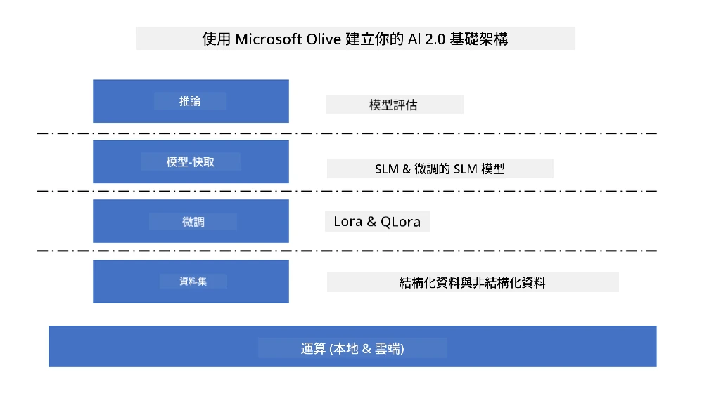
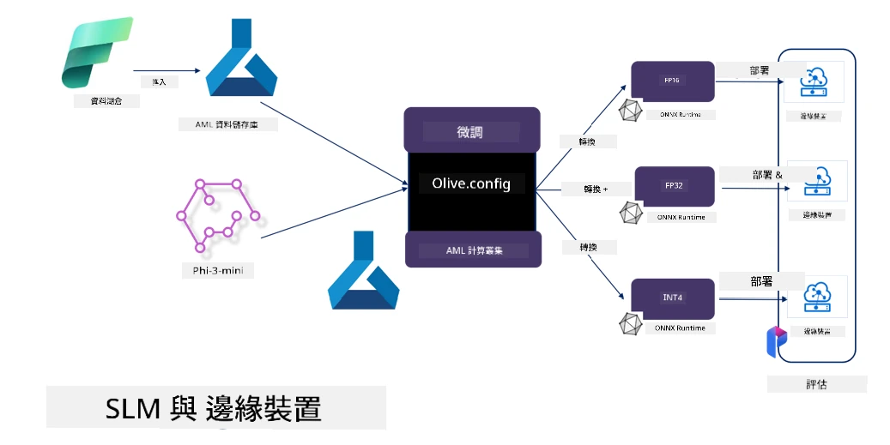

# **使用 Microsoft Olive 微調 Phi-3**

[Olive](https://github.com/microsoft/OLive?WT.mc_id=aiml-138114-kinfeylo) 是一款簡單易用且具硬體感知能力的模型優化工具，整合了業界領先的模型壓縮、優化與編譯技術。

它旨在簡化機器學習模型的優化流程，確保模型能夠在特定硬體架構上達到最高效的運行效果。

無論您是在雲端應用還是邊緣設備上工作，Olive 都能讓您輕鬆且有效地優化模型。

## 主要特點：
- Olive 聚合並自動化針對目標硬體的優化技術。
- 沒有單一優化技術能適用於所有場景，Olive 支援擴展性，讓業界專家能夠插入他們的優化創新。

## 減少工程工作量：
- 開發者通常需要學習並使用多種硬體廠商專屬的工具鏈，來準備和優化訓練好的模型以供部署。
- Olive 透過自動化目標硬體的優化技術，簡化了這個過程。

## 即用型端到端優化解決方案：

透過組合與調整整合技術，Olive 提供統一的端到端優化方案。
在優化模型時會考慮準確度與延遲等限制條件。

## 使用 Microsoft Olive 進行微調

Microsoft Olive 是一款非常容易使用的開源模型優化工具，涵蓋生成式人工智慧領域的微調與推理。只需簡單配置，結合開源小型語言模型及相關運行環境（AzureML / 本地 GPU、CPU、DirectML），即可透過自動優化完成模型的微調或推理，並找到最佳模型部署於雲端或邊緣設備。幫助企業在本地與雲端打造專屬的行業垂直模型。



## 使用 Microsoft Olive 微調 Phi-3



## Phi-3 Olive 範例程式碼與示例
在此範例中，您將使用 Olive 來：

- 微調 LoRA 適配器，將短語分類為悲傷、喜悅、恐懼、驚訝。
- 將適配器權重合併到基礎模型中。
- 將模型優化並量化為 int4。

[範例程式碼](../../code/03.Finetuning/olive-ort-example/README.md)

### 安裝 Microsoft Olive

Microsoft Olive 安裝非常簡單，且支援 CPU、GPU、DirectML 及 Azure ML。

```bash
pip install olive-ai
```

如果您想在 CPU 上執行 ONNX 模型，可以使用

```bash
pip install olive-ai[cpu]
```

如果您想在 GPU 上執行 ONNX 模型，可以使用

```python
pip install olive-ai[gpu]
```

如果您想使用 Azure ML，請使用

```python
pip install git+https://github.com/microsoft/Olive#egg=olive-ai[azureml]
```

**注意**
作業系統需求：Ubuntu 20.04 / 22.04

### **Microsoft Olive 的 Config.json**

安裝完成後，您可以透過 Config 檔案配置不同模型的專屬設定，包括資料、計算、訓練、部署與模型生成。

**1. 資料**

Microsoft Olive 支援本地資料與雲端資料的訓練，並可在設定中配置。

*本地資料設定*

您可以簡單設定需要用於微調的資料集，通常為 json 格式，並依據資料範本進行調整。此部分需根據模型需求調整（例如，適配 Microsoft Phi-3-mini 所需格式。若使用其他模型，請參考其他模型所需的微調格式進行處理）

```json

    "data_configs": [
        {
            "name": "dataset_default_train",
            "type": "HuggingfaceContainer",
            "load_dataset_config": {
                "params": {
                    "data_name": "json", 
                    "data_files":"dataset/dataset-classification.json",
                    "split": "train"
                }
            },
            "pre_process_data_config": {
                "params": {
                    "dataset_type": "corpus",
                    "text_cols": [
                            "phrase",
                            "tone"
                    ],
                    "text_template": "### Text: {phrase}\n### The tone is:\n{tone}",
                    "corpus_strategy": "join",
                    "source_max_len": 2048,
                    "pad_to_max_len": false,
                    "use_attention_mask": false
                }
            }
        }
    ],
```

**雲端資料來源設定**

透過連結 Azure AI Studio/Azure Machine Learning Service 的資料存放庫，您可以選擇透過 Microsoft Fabric 與 Azure Data 導入不同的資料來源，作為微調資料的支援。

```json

    "data_configs": [
        {
            "name": "dataset_default_train",
            "type": "HuggingfaceContainer",
            "load_dataset_config": {
                "params": {
                    "data_name": "json", 
                    "data_files": {
                        "type": "azureml_datastore",
                        "config": {
                            "azureml_client": {
                                "subscription_id": "Your Azure Subscrition ID",
                                "resource_group": "Your Azure Resource Group",
                                "workspace_name": "Your Azure ML Workspaces name"
                            },
                            "datastore_name": "workspaceblobstore",
                            "relative_path": "Your train_data.json Azure ML Location"
                        }
                    },
                    "split": "train"
                }
            },
            "pre_process_data_config": {
                "params": {
                    "dataset_type": "corpus",
                    "text_cols": [
                            "Question",
                            "Best Answer"
                    ],
                    "text_template": "<|user|>\n{Question}<|end|>\n<|assistant|>\n{Best Answer}\n<|end|>",
                    "corpus_strategy": "join",
                    "source_max_len": 2048,
                    "pad_to_max_len": false,
                    "use_attention_mask": false
                }
            }
        }
    ],
    
```

**2. 計算配置**

若需使用本地資源，可直接使用本地資料資源。若需使用 Azure AI Studio / Azure Machine Learning Service 的資源，則需配置相關 Azure 參數、計算資源名稱等。

```json

    "systems": {
        "aml": {
            "type": "AzureML",
            "config": {
                "accelerators": ["gpu"],
                "hf_token": true,
                "aml_compute": "Your Azure AI Studio / Azure Machine Learning Service Compute Name",
                "aml_docker_config": {
                    "base_image": "Your Azure AI Studio / Azure Machine Learning Service docker",
                    "conda_file_path": "conda.yaml"
                }
            }
        },
        "azure_arc": {
            "type": "AzureML",
            "config": {
                "accelerators": ["gpu"],
                "aml_compute": "Your Azure AI Studio / Azure Machine Learning Service Compute Name",
                "aml_docker_config": {
                    "base_image": "Your Azure AI Studio / Azure Machine Learning Service docker",
                    "conda_file_path": "conda.yaml"
                }
            }
        }
    },
```

***注意***

因為是在 Azure AI Studio/Azure Machine Learning Service 的容器中執行，需配置所需環境，這部分在 conda.yaml 環境中設定。

```yaml

name: project_environment
channels:
  - defaults
dependencies:
  - python=3.8.13
  - pip=22.3.1
  - pip:
      - einops
      - accelerate
      - azure-keyvault-secrets
      - azure-identity
      - bitsandbytes
      - datasets
      - huggingface_hub
      - peft
      - scipy
      - sentencepiece
      - torch>=2.2.0
      - transformers
      - git+https://github.com/microsoft/Olive@jiapli/mlflow_loading_fix#egg=olive-ai[gpu]
      - --extra-index-url https://aiinfra.pkgs.visualstudio.com/PublicPackages/_packaging/ORT-Nightly/pypi/simple/ 
      - ort-nightly-gpu==1.18.0.dev20240307004
      - --extra-index-url https://aiinfra.pkgs.visualstudio.com/PublicPackages/_packaging/onnxruntime-genai/pypi/simple/
      - onnxruntime-genai-cuda

    

```

**3. 選擇您的 SLM**

您可以直接使用 Hugging Face 上的模型，或結合 Azure AI Studio / Azure Machine Learning 的模型目錄來選擇使用的模型。以下程式碼範例以 Microsoft Phi-3-mini 為例。

若您有本地模型，可使用此方法

```json

    "input_model":{
        "type": "PyTorchModel",
        "config": {
            "hf_config": {
                "model_name": "model-cache/microsoft/phi-3-mini",
                "task": "text-generation",
                "model_loading_args": {
                    "trust_remote_code": true
                }
            }
        }
    },
```

若想使用 Azure AI Studio / Azure Machine Learning Service 的模型，可使用此方法

```json

    "input_model":{
        "type": "PyTorchModel",
        "config": {
            "model_path": {
                "type": "azureml_registry_model",
                "config": {
                    "name": "microsoft/Phi-3-mini-4k-instruct",
                    "registry_name": "azureml-msr",
                    "version": "11"
                }
            },
             "model_file_format": "PyTorch.MLflow",
             "hf_config": {
                "model_name": "microsoft/Phi-3-mini-4k-instruct",
                "task": "text-generation",
                "from_pretrained_args": {
                    "trust_remote_code": true
                }
            }
        }
    },
```

**注意：**
我們需要與 Azure AI Studio / Azure Machine Learning Service 整合，因此設定模型時請參考版本號與相關命名。

Azure 上的所有模型需設定為 PyTorch.MLflow。

您需要有 Hugging Face 帳號，並將金鑰綁定至 Azure AI Studio / Azure Machine Learning 的 Key 值。

**4. 演算法**

Microsoft Olive 對 Lora 與 QLora 微調演算法封裝完善，您只需配置相關參數。此處以 QLora 為例。

```json
        "lora": {
            "type": "LoRA",
            "config": {
                "target_modules": [
                    "o_proj",
                    "qkv_proj"
                ],
                "double_quant": true,
                "lora_r": 64,
                "lora_alpha": 64,
                "lora_dropout": 0.1,
                "train_data_config": "dataset_default_train",
                "eval_dataset_size": 0.3,
                "training_args": {
                    "seed": 0,
                    "data_seed": 42,
                    "per_device_train_batch_size": 1,
                    "per_device_eval_batch_size": 1,
                    "gradient_accumulation_steps": 4,
                    "gradient_checkpointing": false,
                    "learning_rate": 0.0001,
                    "num_train_epochs": 3,
                    "max_steps": 10,
                    "logging_steps": 10,
                    "evaluation_strategy": "steps",
                    "eval_steps": 187,
                    "group_by_length": true,
                    "adam_beta2": 0.999,
                    "max_grad_norm": 0.3
                }
            }
        },
```

若想進行量化轉換，Microsoft Olive 主分支已支援 onnxruntime-genai 方法，您可依需求設定：

1. 將適配器權重合併至基礎模型
2. 使用 ModelBuilder 將模型轉換為所需精度的 onnx 模型

例如轉換為量化的 INT4

```json

        "merge_adapter_weights": {
            "type": "MergeAdapterWeights"
        },
        "builder": {
            "type": "ModelBuilder",
            "config": {
                "precision": "int4"
            }
        }
```

**注意**  
- 若使用 QLoRA，目前尚不支援 ONNXRuntime-genai 的量化轉換。

- 此外，您可依需求設定上述步驟，無需完全配置所有步驟。根據需求，您也可以直接使用演算法步驟而不進行微調。最後需配置相關引擎。

```json

    "engine": {
        "log_severity_level": 0,
        "host": "aml",
        "target": "aml",
        "search_strategy": false,
        "execution_providers": ["CUDAExecutionProvider"],
        "cache_dir": "../model-cache/models/phi3-finetuned/cache",
        "output_dir" : "../model-cache/models/phi3-finetuned"
    }
```

**5. 完成微調**

在 olive-config.json 所在目錄下，於命令列執行

```bash
olive run --config olive-config.json  
```

**免責聲明**：  
本文件係使用 AI 翻譯服務 [Co-op Translator](https://github.com/Azure/co-op-translator) 進行翻譯。雖然我們致力於確保準確性，但請注意，自動翻譯可能包含錯誤或不準確之處。原始文件的母語版本應視為權威來源。對於重要資訊，建議採用專業人工翻譯。我們不對因使用本翻譯而產生的任何誤解或誤釋負責。