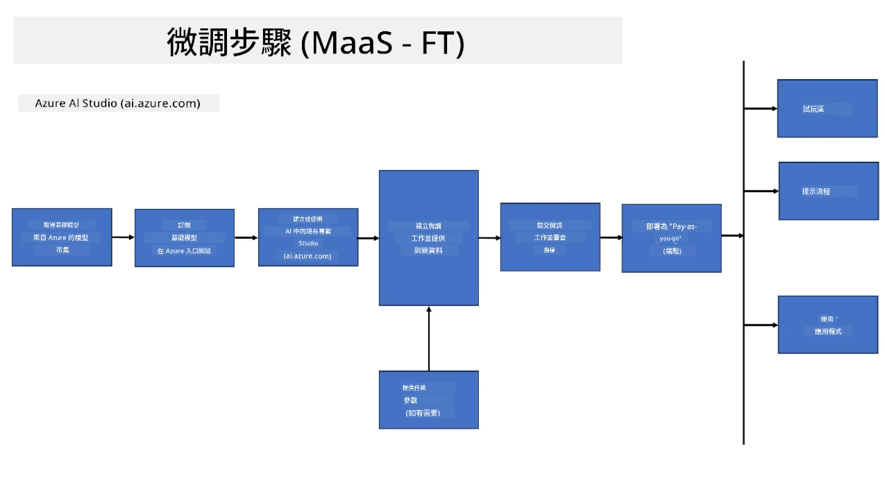
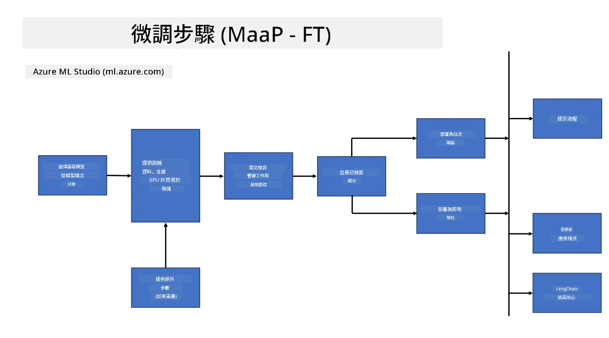
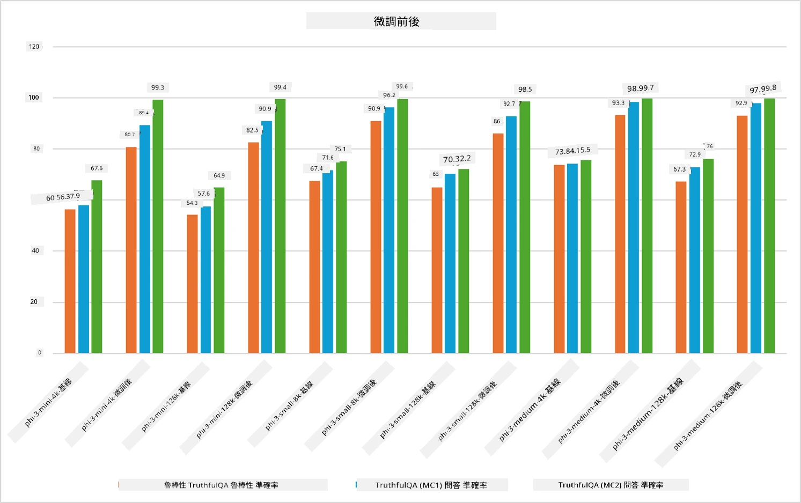

## 微調情境

**平台** 包含多種技術，如 Azure AI Foundry、Azure Machine Learning、AI 工具、Kaito 以及 ONNX Runtime。

**基礎設施** 包含 CPU 和 FPGA，這些是微調過程中不可或缺的部分。讓我來展示這些技術的圖示。

**工具與框架** 包含 ONNX Runtime。讓我來展示這些技術的圖示。  
[插入 ONNX Runtime 的圖示]

使用 Microsoft 技術進行微調涉及多種元件和工具。透過理解並善用這些技術，我們能有效地微調應用程式，打造更優秀的解決方案。

## 模型即服務

使用託管微調功能來微調模型，無需自行建立和管理運算資源。

Phi-3-mini 和 Phi-3-medium 模型支援無伺服器微調，讓開發者能快速且輕鬆地為雲端和邊緣場景自訂模型，無需安排運算資源。我們也宣布 Phi-3-small 現已透過 Models-as-a-Service 提供，讓開發者能迅速開始 AI 開發，無需管理底層基礎設施。

## 模型即平台

使用者自行管理運算資源，以微調他們的模型。

[Fine Tuning Sample](https://github.com/Azure/azureml-examples/blob/main/sdk/python/foundation-models/system/finetune/chat-completion/chat-completion.ipynb)

## 微調情境

| | | | | | | |
|-|-|-|-|-|-|-|
|情境|LoRA|QLoRA|PEFT|DeepSpeed|ZeRO|DORA|
|將預訓練大型語言模型調整至特定任務或領域|是|是|是|是|是|是|
|針對 NLP 任務如文本分類、命名實體識別及機器翻譯進行微調|是|是|是|是|是|是|
|針對問答任務進行微調|是|是|是|是|是|是|
|針對聊天機器人生成類人回應進行微調|是|是|是|是|是|是|
|針對音樂、藝術或其他創意形式進行微調|是|是|是|是|是|是|
|降低計算與財務成本|是|是|否|是|是|否|
|降低記憶體使用量|否|是|否|是|是|是|
|使用較少參數以達成高效微調|否|是|是|否|否|是|
|記憶體高效的資料平行方式，可使用所有 GPU 裝置的總合 GPU 記憶體|否|否|否|是|是|是|

## 微調效能範例

**免責聲明**：  
本文件係使用 AI 翻譯服務 [Co-op Translator](https://github.com/Azure/co-op-translator) 進行翻譯。雖然我們致力於確保準確性，但請注意，自動翻譯可能包含錯誤或不準確之處。原始文件的母語版本應視為權威來源。對於重要資訊，建議採用專業人工翻譯。我們不對因使用本翻譯而產生的任何誤解或誤釋負責。