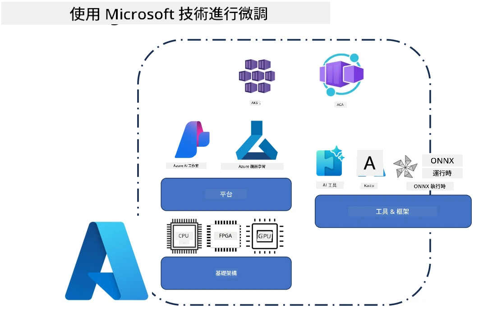
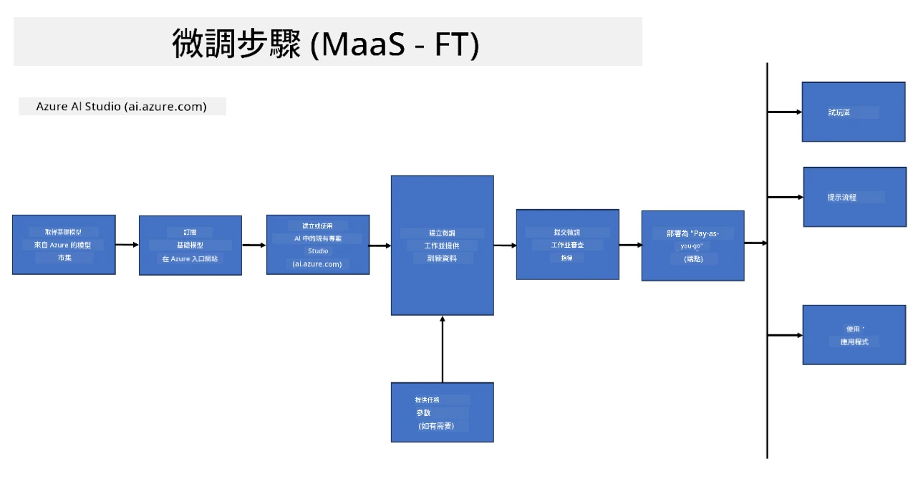
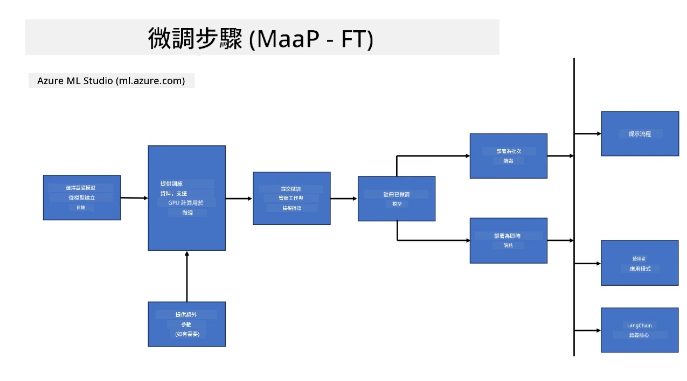
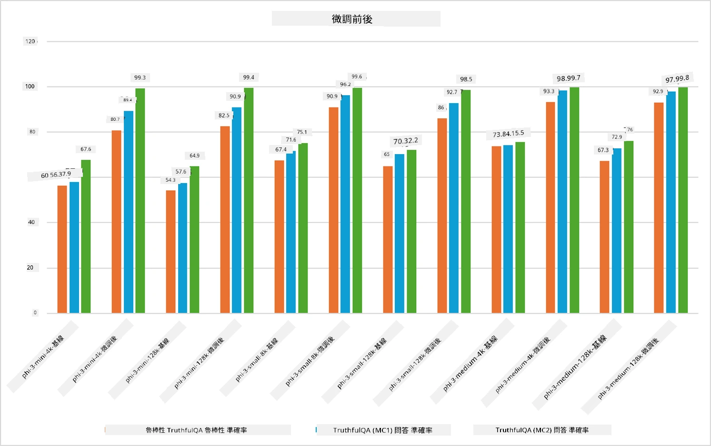

## 微調場景

本節提供 Microsoft Foundry 和 Azure 環境中微調場景的概述，包括部署模型、基礎設施層及常用的優化技術。

**平台**  
包括受管服務，如 Microsoft Foundry（前稱 Azure AI Foundry）和 Azure 機器學習，為模型管理、調度、實驗追蹤和部署工作流程提供支持。

**基礎設施**  
微調需要可擴展的計算資源。在 Azure 環境中，通常包括基於 GPU 的虛擬機和用於輕量級工作負載的 CPU 資源，以及用於數據集和檢查點的可擴展存儲。

**工具與框架**  
微調工作流程通常依賴框架和優化庫，如 Hugging Face Transformers、DeepSpeed 和 PEFT（參數高效微調）。

使用 Microsoft 技術進行微調的過程涵蓋平台服務、計算基礎設施和訓練框架。了解這些組件如何協同工作，開發者可高效地將基礎模型調整至特定任務及生產場景。

## 模型即服務

透過託管的微調方式進行模型微調，無需自行創建和管理計算資源。

目前 Phi-3、Phi-3.5 和 Phi-4 模型系列已支持無服務器微調，讓開發者能快速輕鬆地為雲端及邊緣場景定制模型，無須安排計算資源。

## 模型即平台

用戶管理自己的計算資源，以微調自己的模型。

[微調範例](https://github.com/Azure/azureml-examples/blob/main/sdk/python/foundation-models/system/finetune/chat-completion/chat-completion.ipynb)

## 微調技術比較

|場景|LoRA|QLoRA|PEFT|DeepSpeed|ZeRO|DoRA|
|---|---|---|---|---|---|---|
|將預訓練大型語言模型調整到特定任務或領域|是|是|是|是|是|是|
|用於文本分類、命名實體識別、機器翻譯等 NLP 任務的微調|是|是|是|是|是|是|
|用於問答任務的微調|是|是|是|是|是|是|
|用於生成類人回應的聊天機器人微調|是|是|是|是|是|是|
|用於生成音樂、藝術或其他創意形式的微調|是|是|是|是|是|是|
|降低計算及成本|是|是|是|是|是|是|
|降低記憶體使用量|是|是|是|是|是|是|
|使用較少參數以達高效微調|是|是|是|否|否|是|
|記憶體高效的數據並行形式，能使用所有 GPU 設備的聚合 GPU 記憶體|否|否|否|是|是|否|

> [!NOTE]
> LoRA、QLoRA、PEFT 和 DoRA 是參數高效的微調方法，而 DeepSpeed 和 ZeRO 主要聚焦於分散式訓練及記憶體優化。

## 微調效能範例

---

<!-- CO-OP TRANSLATOR DISCLAIMER START -->
**免責聲明**：  
本文件經由人工智能翻譯服務 [Co-op Translator](https://github.com/Azure/co-op-translator) 進行翻譯。雖然我們力求準確，但請注意，自動翻譯可能包含錯誤或不準確之處。文件的原始語言版本應被視為權威來源。對於關鍵資訊，建議聘請專業人工翻譯。我們不對因使用本翻譯而產生的任何誤解或誤譯負責。
<!-- CO-OP TRANSLATOR DISCLAIMER END -->