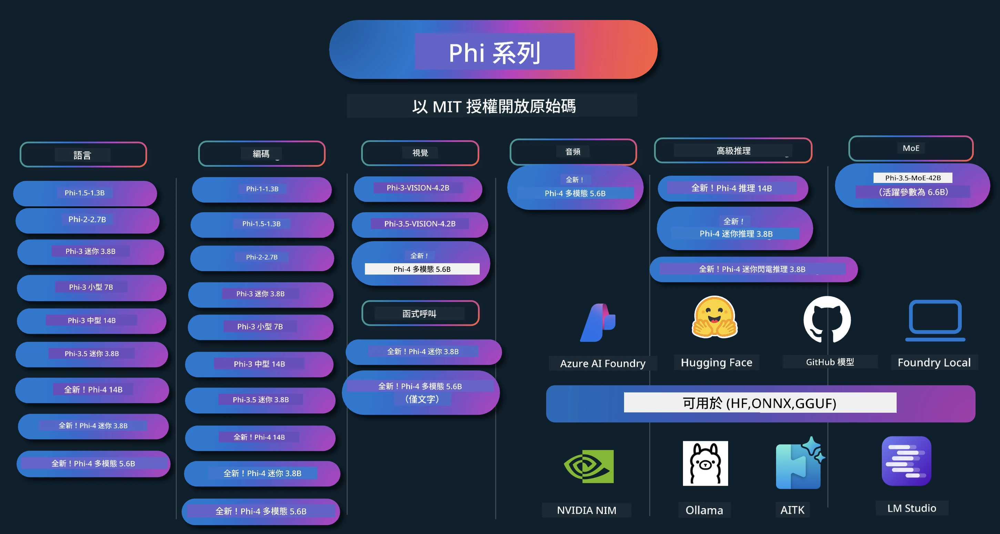

# Phi Cookbook：使用微軟 Phi 模型的實作範例

[](https://codespaces.new/microsoft/phicookbook)
[](https://vscode.dev/redirect?url=vscode://ms-vscode-remote.remote-containers/cloneInVolume?url=https://github.com/microsoft/phicookbook)

[](https://GitHub.com/microsoft/phicookbook/graphs/contributors/?WT.mc_id=aiml-137032-kinfeylo)
[](https://GitHub.com/microsoft/phicookbook/issues/?WT.mc_id=aiml-137032-kinfeylo)
[](https://GitHub.com/microsoft/phicookbook/pulls/?WT.mc_id=aiml-137032-kinfeylo)
[](http://makeapullrequest.com?WT.mc_id=aiml-137032-kinfeylo)

[](https://GitHub.com/microsoft/phicookbook/watchers/?WT.mc_id=aiml-137032-kinfeylo)
[](https://GitHub.com/microsoft/phicookbook/network/?WT.mc_id=aiml-137032-kinfeylo)
[](https://GitHub.com/microsoft/phicookbook/stargazers/?WT.mc_id=aiml-137032-kinfeylo)

[](https://discord.com/invite/ByRwuEEgH4)

Phi 是微軟開發的一系列開源 AI 模型。

Phi 目前是最強大且具成本效益的小型語言模型（SLM），在多語言、推理、文字/聊天生成、程式碼、影像、音訊等多種場景中表現優異。

您可以將 Phi 部署到雲端或邊緣裝置，並能輕鬆利用有限的運算資源建構生成式 AI 應用程式。

請按照以下步驟開始使用這些資源：
1. **Fork 此倉庫**：點擊 [](https://GitHub.com/microsoft/phicookbook/network/?WT.mc_id=aiml-137032-kinfeylo)
2. **Clone 此倉庫**：`git clone https://github.com/microsoft/PhiCookBook.git`
3. [**加入 Microsoft AI Discord 社群，與專家和其他開發者交流**](https://discord.com/invite/ByRwuEEgH4?WT.mc_id=aiml-137032-kinfeylo)



### 🌐 多語言支援

#### 透過 GitHub Action 支援（自動且持續更新）

<!-- CO-OP TRANSLATOR LANGUAGES TABLE START -->
[阿拉伯文](../ar/README.md) | [孟加拉文](../bn/README.md) | [保加利亞文](../bg/README.md) | [緬甸文（Myanmar）](../my/README.md) | [中文（簡體）](../zh-CN/README.md) | [中文（繁體，香港）](../zh-HK/README.md) | [中文（繁體，澳門）](../zh-MO/README.md) | [中文（繁體，台灣）](./README.md) | [克羅埃西亞文](../hr/README.md) | [捷克文](../cs/README.md) | [丹麥文](../da/README.md) | [荷蘭文](../nl/README.md) | [愛沙尼亞文](../et/README.md) | [芬蘭文](../fi/README.md) | [法文](../fr/README.md) | [德文](../de/README.md) | [希臘文](../el/README.md) | [希伯來文](../he/README.md) | [印地文](../hi/README.md) | [匈牙利文](../hu/README.md) | [印尼文](../id/README.md) | [義大利文](../it/README.md) | [日文](../ja/README.md) | [坎納達文](../kn/README.md) | [韓文](../ko/README.md) | [立陶宛文](../lt/README.md) | [馬來文](../ms/README.md) | [馬拉雅拉姆文](../ml/README.md) | [馬拉地文](../mr/README.md) | [尼泊爾文](../ne/README.md) | [奈及利亞皮欽語](../pcm/README.md) | [挪威文](../no/README.md) | [波斯文（法爾西語）](../fa/README.md) | [波蘭文](../pl/README.md) | [葡萄牙文（巴西）](../pt-BR/README.md) | [葡萄牙文（葡萄牙）](../pt-PT/README.md) | [旁遮普文（Gurmukhi）](../pa/README.md) | [羅馬尼亞文](../ro/README.md) | [俄文](../ru/README.md) | [塞爾維亞文（西里爾字母）](../sr/README.md) | [斯洛伐克文](../sk/README.md) | [斯洛維尼亞文](../sl/README.md) | [西班牙文](../es/README.md) | [斯瓦希里文](../sw/README.md) | [瑞典文](../sv/README.md) | [塔加洛語（菲律賓語）](../tl/README.md) | [泰米爾文](../ta/README.md) | [泰盧固文](../te/README.md) | [泰文](../th/README.md) | [土耳其文](../tr/README.md) | [烏克蘭文](../uk/README.md) | [烏爾都文](../ur/README.md) | [越南文](../vi/README.md)

> **偏好本機 clone？**
>
> 此倉庫包含 50 多種語言的翻譯，會大幅增加下載大小。如要不包含翻譯進行 clone，請使用 sparse checkout：
>
> **Bash / macOS / Linux：**
> ```bash
> git clone --filter=blob:none --sparse https://github.com/microsoft/PhiCookBook.git
> cd PhiCookBook
> git sparse-checkout set --no-cone '/*' '!translations' '!translated_images'
> ```
>
> **CMD（Windows）：**
> ```cmd
> git clone --filter=blob:none --sparse https://github.com/microsoft/PhiCookBook.git
> cd PhiCookBook
> git sparse-checkout set --no-cone "/*" "!translations" "!translated_images"
> ```
>
> 這讓您只需更快下載所需的完整課程內容。
<!-- CO-OP TRANSLATOR LANGUAGES TABLE END -->

## 目錄

- 介紹
  - [歡迎加入 Phi 家族](./md/01.Introduction/01/01.PhiFamily.md)
  - [設定您的開發環境](./md/01.Introduction/01/01.EnvironmentSetup.md)
  - [理解關鍵技術](./md/01.Introduction/01/01.Understandingtech.md)
  - [Phi 模型的 AI 安全](./md/01.Introduction/01/01.AISafety.md)
  - [Phi 硬體支援](./md/01.Introduction/01/01.Hardwaresupport.md)
  - [Phi 模型與跨平台可用性](./md/01.Introduction/01/01.Edgeandcloud.md)
  - [使用 Guidance-ai 與 Phi](./md/01.Introduction/01/01.Guidance.md)
  - [GitHub Marketplace 模型](https://github.com/marketplace/models)
  - [Azure AI 模型目錄](https://ai.azure.com)

- 不同環境推理 Phi
    -  [Hugging face](./md/01.Introduction/02/01.HF.md)
    -  [GitHub 模型](./md/01.Introduction/02/02.GitHubModel.md)
    -  [Microsoft Foundry 模型目錄](./md/01.Introduction/02/03.AzureAIFoundry.md)
    -  [Ollama](./md/01.Introduction/02/04.Ollama.md)
    -  [AI Toolkit VSCode (AITK)](./md/01.Introduction/02/05.AITK.md)
    -  [NVIDIA NIM](./md/01.Introduction/02/06.NVIDIA.md)
    -  [Foundry Local](./md/01.Introduction/02/07.FoundryLocal.md)

- Phi 家族推理
    - [iOS 上推理 Phi](./md/01.Introduction/03/iOS_Inference.md)
    - [Android 上推理 Phi](./md/01.Introduction/03/Android_Inference.md)
    - [Jetson 上推理 Phi](./md/01.Introduction/03/Jetson_Inference.md)
    - [AI PC 上推理 Phi](./md/01.Introduction/03/AIPC_Inference.md)
    - [使用 Apple MLX 框架推理 Phi](./md/01.Introduction/03/MLX_Inference.md)
    - [本地伺服器推理 Phi](./md/01.Introduction/03/Local_Server_Inference.md)
    - [透過 AI Toolkit 在遠端伺服器推理 Phi](./md/01.Introduction/03/Remote_Interence.md)
    - [使用 Rust 推理 Phi](./md/01.Introduction/03/Rust_Inference.md)
    - [本地推理 Phi--視覺](./md/01.Introduction/03/Vision_Inference.md)
    - [使用 Kaito AKS、Azure Containers（官方支援）推理 Phi](./md/01.Introduction/03/Kaito_Inference.md)

-  [Phi 家族量化](./md/01.Introduction/04/QuantifyingPhi.md)
    - [使用 llama.cpp 量化 Phi-3.5 / 4](./md/01.Introduction/04/UsingLlamacppQuantifyingPhi.md)
    - [使用 onnxruntime 的生成式 AI 擴充功能量化 Phi-3.5 / 4](./md/01.Introduction/04/UsingORTGenAIQuantifyingPhi.md)
    - [使用 Intel OpenVINO 量化 Phi-3.5 / 4](./md/01.Introduction/04/UsingIntelOpenVINOQuantifyingPhi.md)
    - [使用 Apple MLX 框架量化 Phi-3.5 / 4](./md/01.Introduction/04/UsingAppleMLXQuantifyingPhi.md)

-  Phi 評估
    - [負責任的 AI](./md/01.Introduction/05/ResponsibleAI.md)
    - [Microsoft Foundry 評估](./md/01.Introduction/05/AIFoundry.md)
    - [使用 Promptflow 評估](./md/01.Introduction/05/Promptflow.md)
 
- 透過 Azure AI Search 的 RAG
    - [如何使用 Phi-4-mini 與 Phi-4-multimodal（RAG）配合 Azure AI Search](https://github.com/microsoft/PhiCookBook/blob/main/code/06.E2E/E2E_Phi-4-RAG-Azure-AI-Search.ipynb)

- Phi 應用程式開發範例
  - 文字與聊天應用
    - Phi-4 範例 🆕
      - [📓] [與 Phi-4-mini ONNX 模型聊天](./md/02.Application/01.TextAndChat/Phi4/ChatWithPhi4ONNX/README.md)
      - [使用 Phi-4 本地 ONNX 模型的聊天 .NET](../../md/04.HOL/dotnet/src/LabsPhi4-Chat-01OnnxRuntime)
      - [使用 Sementic Kernel 的 Phi-4 ONNX .NET 控制台聊天應用程式](../../md/04.HOL/dotnet/src/LabsPhi4-Chat-02SK)
    - Phi-3 / 3.5 範例
      - [在瀏覽器使用 Phi3、ONNX Runtime Web 和 WebGPU 的本地聊天機器人](https://github.com/microsoft/onnxruntime-inference-examples/tree/main/js/chat)
      - [OpenVino 聊天](./md/02.Application/01.TextAndChat/Phi3/E2E_OpenVino_Chat.md)
      - [多模型 - 互動式 Phi-3-mini 與 OpenAI Whisper](./md/02.Application/01.TextAndChat/Phi3/E2E_Phi-3-mini_with_whisper.md)
      - [MLFlow - 建立包裝器並使用 Phi-3 於 MLFlow](./md//02.Application/01.TextAndChat/Phi3/E2E_Phi-3-MLflow.md)
      - [模型優化 - 如何使用 Olive 為 ONNX Runtime Web 優化 Phi-3-mini 模型](https://github.com/microsoft/Olive/tree/main/examples/phi3)
      - [WinUI3 應用程式搭配 Phi-3 mini-4k-instruct-onnx](https://github.com/microsoft/Phi3-Chat-WinUI3-Sample/)
      - [WinUI3 多模型 AI 動力筆記應用程式示例](https://github.com/microsoft/ai-powered-notes-winui3-sample)
      - [使用 Prompt flow 微調並整合自訂 Phi-3 模型](./md/02.Application/01.TextAndChat/Phi3/E2E_Phi-3-FineTuning_PromptFlow_Integration.md)
      - [在 Microsoft Foundry 中使用 Prompt flow 微調並整合自訂 Phi-3 模型](./md/02.Application/01.TextAndChat/Phi3/E2E_Phi-3-FineTuning_PromptFlow_Integration_AIFoundry.md)
      - [評估在 Microsoft Foundry 中根據 Microsoft 負責任 AI 原則微調的 Phi-3 / Phi-3.5 模型](./md/02.Application/01.TextAndChat/Phi3/E2E_Phi-3-Evaluation_AIFoundry.md)
      - [📓] [Phi-3.5-mini-instruct 語言預測示範（中文/英文）](./md/02.Application/01.TextAndChat/Phi3/phi3-instruct-demo.ipynb)
      - [Phi-3.5-Instruct WebGPU RAG 聊天機器人](./md/02.Application/01.TextAndChat/Phi3/WebGPUWithPhi35Readme.md)
      - [使用 Windows GPU 搭配 Phi-3.5-Instruct ONNX 建立 Prompt flow 解決方案](./md/02.Application/01.TextAndChat/Phi3/UsingPromptFlowWithONNX.md)
      - [使用 Microsoft Phi-3.5 tflite 建立 Android 應用程式](./md/02.Application/01.TextAndChat/Phi3/UsingPhi35TFLiteCreateAndroidApp.md)
      - [使用本地 ONNX Phi-3 模型的 Q&A .NET 範例，透過 Microsoft.ML.OnnxRuntime](../../md/04.HOL/dotnet/src/LabsPhi301)
      - [搭配 Semantic Kernel 與 Phi-3 的 .NET 控制台聊天應用程式](../../md/04.HOL/dotnet/src/LabsPhi302)

  - Azure AI 推論 SDK 程式碼範例 
    - Phi-4 範例 🆕
      - [📓] [使用 Phi-4-multimodal 產生專案程式碼](./md/02.Application/02.Code/Phi4/GenProjectCode/README.md)
    - Phi-3 / 3.5 範例
      - [使用 Microsoft Phi-3 系列建立您自己的 Visual Studio Code GitHub Copilot Chat](./md/02.Application/02.Code/Phi3/VSCodeExt/README.md)
      - [用 GitHub 模型和 Phi-3.5 建立您自己的 Visual Studio Code Chat Copilot 代理程式](/md/02.Application/02.Code/Phi3/CreateVSCodeChatAgentWithGitHubModels.md)

  - 進階推理範例
    - Phi-4 範例 🆕
      - [📓] [Phi-4-mini-reasoning 或 Phi-4-reasoning 範例](./md/02.Application/03.AdvancedReasoning/Phi4/AdvancedResoningPhi4mini/README.md)
      - [📓] [使用 Microsoft Olive 微調 Phi-4-mini-reasoning](./md/02.Application/03.AdvancedReasoning/Phi4/AdvancedResoningPhi4mini/olive_ft_phi_4_reasoning_with_medicaldata.ipynb)
      - [📓] [使用 Apple MLX 微調 Phi-4-mini-reasoning](./md/02.Application/03.AdvancedReasoning/Phi4/AdvancedResoningPhi4mini/mlx_ft_phi_4_reasoning_with_medicaldata.ipynb)
      - [📓] [使用 GitHub 模型推理 Phi-4-mini-reasoning](./md/02.Application/02.Code/Phi4r/github_models_inference.ipynb)
      - [📓] [使用 Microsoft Foundry 模型推理 Phi-4-mini-reasoning](./md/02.Application/02.Code/Phi4r/azure_models_inference.ipynb)
  - 演示
      - [Hugging Face Spaces 上託管的 Phi-4-mini 演示](https://huggingface.co/spaces/microsoft/phi-4-mini?WT.mc_id=aiml-137032-kinfeylo)
      - [Hugging Face Spaces 上託管的 Phi-4-multimodal 演示](https://huggingface.co/spaces/microsoft/phi-4-multimodal?WT.mc_id=aiml-137032-kinfeylo)
  - 視覺範例
    - Phi-4 範例 🆕
      - [📓] [使用 Phi-4-multimodal 讀取影像並生成程式碼](./md/02.Application/04.Vision/Phi4/CreateFrontend/README.md) 
    - Phi-3 / 3.5 範例
      -  [📓][Phi-3-vision-影像文字到文字](./md/02.Application/04.Vision/Phi3/E2E_Phi-3-vision-image-text-to-text-online-endpoint.ipynb)
      - [Phi-3-vision-ONNX](https://onnxruntime.ai/docs/genai/tutorials/phi3-v.html)
      - [📓][Phi-3-vision CLIP 嵌入](./md/02.Application/04.Vision/Phi3/E2E_Phi-3-vision-image-text-to-text-online-endpoint.ipynb)
      - [演示：Phi-3 回收](https://github.com/jennifermarsman/PhiRecycling/)
      - [Phi-3-vision - 視覺語言助手 - 使用 Phi3-Vision 和 OpenVINO](https://docs.openvino.ai/nightly/notebooks/phi-3-vision-with-output.html)
      - [Phi-3 Vision Nvidia NIM](./md/02.Application/04.Vision/Phi3/E2E_Nvidia_NIM_Vision.md)
      - [Phi-3 Vision OpenVino](./md/02.Application/04.Vision/Phi3/E2E_OpenVino_Phi3Vision.md)
      - [📓][Phi-3.5 Vision 多幀或多影像範例](./md/02.Application/04.Vision/Phi3/phi3-vision-demo.ipynb)
      - [使用 Microsoft.ML.OnnxRuntime .NET 執行的 Phi-3 Vision 本地 ONNX 模型](../../md/04.HOL/dotnet/src/LabsPhi303)
      - [使用選單式 Phi-3 Vision 本地 ONNX 模型搭配 Microsoft.ML.OnnxRuntime .NET](../../md/04.HOL/dotnet/src/LabsPhi304)

  - 數學範例
    -  Phi-4-Mini-Flash-Reasoning-Instruct 範例 🆕 [Phi-4-Mini-Flash-Reasoning-Instruct 數學演示](./md/02.Application/09.Math/MathDemo.ipynb)

  - 音訊範例
    - Phi-4 範例 🆕
      - [📓] [使用 Phi-4-multimodal 擷取音訊文字稿](./md/02.Application/05.Audio/Phi4/Transciption/README.md)
      - [📓] [Phi-4-multimodal 音訊範例](./md/02.Application/05.Audio/Phi4/Siri/demo.ipynb)
      - [📓] [Phi-4-multimodal 語音翻譯範例](./md/02.Application/05.Audio/Phi4/Translate/demo.ipynb)
      - [使用 Phi-4-multimodal 的 .NET 控制台應用程式，分析音訊檔並生成文字稿](../../md/04.HOL/dotnet/src/LabsPhi4-MultiModal-02Audio)

  - MoE 範例
    - Phi-3 / 3.5 範例
      - [📓] [Phi-3.5 專家混合模型 (MoEs) 社群媒體範例](./md/02.Application/06.MoE/Phi3/phi3_moe_demo.ipynb)
      - [📓] [使用 NVIDIA NIM Phi-3 MOE，Azure AI 搜索，及 LlamaIndex 建構檢索增強生成 (RAG) 流程](./md/02.Application/06.MoE/Phi3/azure-ai-search-nvidia-rag.ipynb)
      - 
  - 函數呼叫範例
    - Phi-4 範例 🆕
      -  [📓] [使用 Phi-4-mini 的函數呼叫](./md/02.Application/07.FunctionCalling/Phi4/FunctionCallingBasic/README.md)
      -  [📓] [使用函數呼叫建立多代理程式，搭配 Phi-4-mini](./md/02.Application/07.FunctionCalling/Phi4/Multiagents/Phi_4_mini_multiagent.ipynb)
      -  [📓] [使用函數呼叫搭配 Ollama](./md/02.Application/07.FunctionCalling/Phi4/Ollama/ollama_functioncalling.ipynb)
      -  [📓] [使用函數呼叫搭配 ONNX](./md/02.Application/07.FunctionCalling/Phi4/ONNX/onnx_parallel_functioncalling.ipynb)
  - 多模態混合範例
    - Phi-4 範例 🆕
      -  [📓] [使用 Phi-4-multimodal 擔任科技記者](./md/02.Application/08.Multimodel/Phi4/TechJournalist/phi_4_mm_audio_text_publish_news.ipynb)
      - [使用 Phi-4-multimodal 的 .NET 控制台應用程式分析影像](../../md/04.HOL/dotnet/src/LabsPhi4-MultiModal-01Images)

- Phi 微調範例
  - [微調場景說明](./md/03.FineTuning/FineTuning_Scenarios.md)
  - [微調與 RAG 比較](./md/03.FineTuning/FineTuning_vs_RAG.md)
  - [微調讓 Phi-3 成為產業專家](./md/03.FineTuning/LetPhi3gotoIndustriy.md)
  - [使用 AI Toolkit for VS Code 微調 Phi-3](./md/03.FineTuning/Finetuning_VSCodeaitoolkit.md)
  - [使用 Azure 機器學習服務微調 Phi-3](./md/03.FineTuning/Introduce_AzureML.md)
  - [使用 Lora 微調 Phi-3](./md/03.FineTuning/FineTuning_Lora.md)
  - [使用 QLora 微調 Phi-3](./md/03.FineTuning/FineTuning_Qlora.md)
  - [使用 Microsoft Foundry 微調 Phi-3](./md/03.FineTuning/FineTuning_AIFoundry.md)
  - [使用 Azure ML CLI/SDK 微調 Phi-3](./md/03.FineTuning/FineTuning_MLSDK.md)
  - [使用 Microsoft Olive 微調](./md/03.FineTuning/FineTuning_MicrosoftOlive.md)
  - [Microsoft Olive 實作實驗室的微調](./md/03.FineTuning/olive-lab/readme.md)
  - [使用 Weights and Bias 微調 Phi-3-vision](./md/03.FineTuning/FineTuning_Phi-3-visionWandB.md)
  - [使用 Apple MLX 框架微調 Phi-3](./md/03.FineTuning/FineTuning_MLX.md)
  - [Phi-3-vision 微調（官方支援）](./md/03.FineTuning/FineTuning_Vision.md)
  - [使用 Kaito AKS Azure 容器官方支援微調 Phi-3](./md/03.FineTuning/FineTuning_Kaito.md)
  - [Phi-3 及 3.5 Vision 微調](https://github.com/2U1/Phi3-Vision-Finetune)

- 實作實驗室
  - [探索前沿模型：大型語言模型、特化語言模型、本地開發及更多](https://github.com/microsoft/aitour-exploring-cutting-edge-models)
  - [釋放 NLP 潛能：使用 Microsoft Olive 進行微調](https://github.com/azure/Ignite_FineTuning_workshop)
- 學術研究論文與出版品
  - [Textbooks Are All You Need II: phi-1.5 技術報告](https://arxiv.org/abs/2309.05463)
  - [Phi-3 技術報告：在您的手機上高效能的語言模型](https://arxiv.org/abs/2404.14219)
  - [Phi-4 技術報告](https://arxiv.org/abs/2412.08905)
  - [Phi-4-Mini 技術報告：透過 Mixture-of-LoRAs 打造精簡而強大的多模態語言模型](https://arxiv.org/abs/2503.01743)
  - [優化車載功能呼叫的小型語言模型](https://arxiv.org/abs/2501.02342)
  - [(WhyPHI) 針對多選題微調 PHI-3：方法論、結果與挑戰](https://arxiv.org/abs/2501.01588)
  - [Phi-4 推理技術報告](https://www.microsoft.com/en-us/research/wp-content/uploads/2025/04/phi_4_reasoning.pdf)
  - [Phi-4-mini 推理技術報告](https://huggingface.co/microsoft/Phi-4-mini-reasoning/blob/main/Phi-4-Mini-Reasoning.pdf)

## 使用 Phi 模型

### Phi 在 Microsoft Foundry

您可以學習如何使用 Microsoft Phi 以及如何在不同硬體設備中建立端到端解決方案。若想親自體驗 Phi，請先透過 [Microsoft Foundry Azure AI Model Catalog](https://aka.ms/phi3-azure-ai) 來試用模型並為您的情境量身定制 Phi，您也可以參考入門教學 [Getting Started with Microsoft Foundry](/md/02.QuickStart/AzureAIFoundry_QuickStart.md)

**遊樂場**
每個模型皆有專屬的遊樂場供您測試模型 [Azure AI Playground](https://aka.ms/try-phi3)。

### Phi 在 GitHub 模型

您可以學習如何使用 Microsoft Phi 以及如何在不同硬體設備中建立端到端解決方案。若想親自體驗 Phi，請先透過 [GitHub Model Catalog](https://github.com/marketplace/models?WT.mc_id=aiml-137032-kinfeylo) 來試用模型並為您的情境客製化 Phi，您也可以參考入門教學 [Getting Started with GitHub Model Catalog](/md/02.QuickStart/GitHubModel_QuickStart.md)

**遊樂場**
每個模型皆有專屬的[遊樂場供您測試模型](/md/02.QuickStart/GitHubModel_QuickStart.md)。

### Phi 在 Hugging Face

您也可以在 [Hugging Face](https://huggingface.co/microsoft) 找到模型

**遊樂場**  
[Hugging Chat 遊樂場](https://huggingface.co/chat/models/microsoft/Phi-3-mini-4k-instruct)

## 🎒 其他課程

我們團隊還製作了其他課程！歡迎參考：

<!-- CO-OP TRANSLATOR OTHER COURSES START -->
### LangChain
[](https://aka.ms/langchain4j-for-beginners)
[](https://aka.ms/langchainjs-for-beginners?WT.mc_id=m365-94501-dwahlin)
[](https://github.com/microsoft/langchain-for-beginners?WT.mc_id=m365-94501-dwahlin)
---

### Azure / Edge / MCP / Agents
[](https://github.com/microsoft/AZD-for-beginners?WT.mc_id=academic-105485-koreyst)
[](https://github.com/microsoft/edgeai-for-beginners?WT.mc_id=academic-105485-koreyst)
[](https://github.com/microsoft/mcp-for-beginners?WT.mc_id=academic-105485-koreyst)
[](https://github.com/microsoft/ai-agents-for-beginners?WT.mc_id=academic-105485-koreyst)

---

### 生成式 AI 系列
[](https://github.com/microsoft/generative-ai-for-beginners?WT.mc_id=academic-105485-koreyst)
[-9333EA?style=for-the-badge&labelColor=E5E7EB&color=9333EA)](https://github.com/microsoft/Generative-AI-for-beginners-dotnet?WT.mc_id=academic-105485-koreyst)
[-C084FC?style=for-the-badge&labelColor=E5E7EB&color=C084FC)](https://github.com/microsoft/generative-ai-for-beginners-java?WT.mc_id=academic-105485-koreyst)
[-E879F9?style=for-the-badge&labelColor=E5E7EB&color=E879F9)](https://github.com/microsoft/generative-ai-with-javascript?WT.mc_id=academic-105485-koreyst)

---

### 核心學習
[](https://aka.ms/ml-beginners?WT.mc_id=academic-105485-koreyst)
[](https://aka.ms/datascience-beginners?WT.mc_id=academic-105485-koreyst)
[](https://aka.ms/ai-beginners?WT.mc_id=academic-105485-koreyst)
[](https://github.com/microsoft/Security-101?WT.mc_id=academic-96948-sayoung)
[](https://aka.ms/webdev-beginners?WT.mc_id=academic-105485-koreyst)
[](https://aka.ms/iot-beginners?WT.mc_id=academic-105485-koreyst)
[](https://github.com/microsoft/xr-development-for-beginners?WT.mc_id=academic-105485-koreyst)

---

### Copilot 系列
[](https://aka.ms/GitHubCopilotAI?WT.mc_id=academic-105485-koreyst)
[](https://github.com/microsoft/mastering-github-copilot-for-dotnet-csharp-developers?WT.mc_id=academic-105485-koreyst)
[](https://github.com/microsoft/CopilotAdventures?WT.mc_id=academic-105485-koreyst)
<!-- CO-OP TRANSLATOR OTHER COURSES END -->

## 負責任的 AI

Microsoft 致力於協助客戶負責任地使用我們的 AI 產品，分享我們的學習，並透過如透明度說明與影響評估等工具建立基於信任的合作夥伴關係。您可以在 [https://aka.ms/RAI](https://aka.ms/RAI) 找到許多這些資源。  
Microsoft 的負責任 AI 方法基於我們的 AI 原則：公平、可靠與安全、隱私與安全性、包容性、透明性與問責制。

大型的自然語言、影像與語音模型——如本範例中使用的模型——可能會出現不公平、不可靠或冒犯性的行為，進而造成傷害。請參考 [Azure OpenAI 服務透明度說明](https://learn.microsoft.com/legal/cognitive-services/openai/transparency-note?tabs=text) 以瞭解風險與限制。

建議的降低風險方法是在您的架構中納入能偵測並阻止有害行為的安全系統。[Azure AI 內容安全](https://learn.microsoft.com/azure/ai-services/content-safety/overview) 提供獨立的保護層，能偵測應用程式和服務中使用者生成及 AI 生成的有害內容。Azure AI 內容安全包含文字與影像的 API，可協助您偵測有害內容。在 Microsoft Foundry 內，內容安全服務讓您查看、探索並嘗試跨不同媒介偵測有害內容的範例程式碼。接下來的 [快速入門文件](https://learn.microsoft.com/azure/ai-services/content-safety/quickstart-text?tabs=visual-studio%2Clinux&pivots=programming-language-rest) 將引導您如何對該服務進行請求。
另一個需要考慮的方面是整體應用程式的效能。對於多模態和多模型的應用程式，我們將效能視為系統能如你和你的用戶所期望的那樣運作，包括不產生有害輸出。評估整體應用程式的效能時，使用[效能與品質以及風險與安全評估工具](https://learn.microsoft.com/azure/ai-studio/concepts/evaluation-metrics-built-in)是很重要的。你也可以使用[自訂評估工具](https://learn.microsoft.com/azure/ai-studio/how-to/develop/evaluate-sdk#custom-evaluators)來建立並進行評估。

你可以在開發環境中使用[Azure AI 評估 SDK](https://microsoft.github.io/promptflow/index.html)來評估你的 AI 應用程式。根據測試資料集或目標，你的生成式 AI 應用程式的產出會使用內建評估工具或你選擇的自訂評估工具進行定量測量。若要開始使用 azure ai 評估 sdk 來評估你的系統，你可以參考[快速入門指南](https://learn.microsoft.com/azure/ai-studio/how-to/develop/flow-evaluate-sdk)。執行評估程序後，你可以在[Microsoft Foundry 中可視化結果](https://learn.microsoft.com/azure/ai-studio/how-to/evaluate-flow-results)。

## 商標

此專案可能包含項目、產品或服務的商標或標誌。微軟商標或標誌的授權使用須遵守並依據[微軟商標與品牌指引](https://www.microsoft.com/legal/intellectualproperty/trademarks/usage/general)。
在修改版本的此專案中使用微軟商標或標誌，不得造成混淆或暗示微軟的贊助。任何第三方商標或標誌的使用皆須遵守該第三方的政策。

## 尋求協助

如果你遇到困難或有任何關於構建 AI 應用程式的問題，歡迎加入：

[](https://aka.ms/foundry/discord)

若你在構建過程中有產品反饋或發現錯誤，請造訪：

[](https://aka.ms/foundry/forum)

---

<!-- CO-OP TRANSLATOR DISCLAIMER START -->
**免責聲明**：
本文件透過 AI 翻譯服務 [Co-op Translator](https://github.com/Azure/co-op-translator) 進行翻譯。雖然我們盡力確保準確性，但請注意自動翻譯可能包含錯誤或不準確之處。原始文件的母語版本應視為權威來源。對於重要資訊，建議使用專業人工翻譯。我們不對因使用本翻譯而產生的任何誤解或誤譯負責。
<!-- CO-OP TRANSLATOR DISCLAIMER END -->