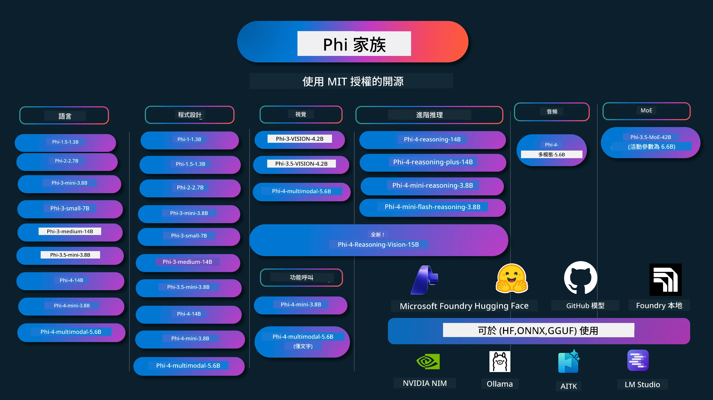

# Phi 食譜：Microsoft Phi 模型的實作範例

[](https://codespaces.new/microsoft/phicookbook)
[](https://vscode.dev/redirect?url=vscode://ms-vscode-remote.remote-containers/cloneInVolume?url=https://github.com/microsoft/phicookbook)

[](https://GitHub.com/microsoft/phicookbook/graphs/contributors/?WT.mc_id=aiml-137032-kinfeylo)
[](https://GitHub.com/microsoft/phicookbook/issues/?WT.mc_id=aiml-137032-kinfeylo)
[](https://GitHub.com/microsoft/phicookbook/pulls/?WT.mc_id=aiml-137032-kinfeylo)
[](http://makeapullrequest.com?WT.mc_id=aiml-137032-kinfeylo)

[](https://GitHub.com/microsoft/phicookbook/watchers/?WT.mc_id=aiml-137032-kinfeylo)
[](https://GitHub.com/microsoft/phicookbook/network/?WT.mc_id=aiml-137032-kinfeylo)
[](https://GitHub.com/microsoft/phicookbook/stargazers/?WT.mc_id=aiml-137032-kinfeylo)

[](https://discord.com/invite/ByRwuEEgH4)

Phi 是 Microsoft 開發的一系列開源 AI 模型。

Phi 目前是功能最強大且具成本效益的小型語言模型（SLM），在多語言、推理、文字/聊天生成、程式編碼、影像、音訊等多種場景中表現優異。

您可以將 Phi 部署到雲端或邊緣裝置，並能輕鬆利用有限的計算資源打造生成式 AI 應用。

按照以下步驟開始使用這些資源：
1. **Fork 此存放庫**：點選 [](https://GitHub.com/microsoft/phicookbook/network/?WT.mc_id=aiml-137032-kinfeylo)
2. **Clone 此存放庫**：`git clone https://github.com/microsoft/PhiCookBook.git`
3. [**加入 Microsoft AI Discord 社群，與專家及開發者交流**](https://discord.com/invite/ByRwuEEgH4?WT.mc_id=aiml-137032-kinfeylo)



### 🌐 多語言支援

#### 透過 GitHub Action 支援（自動且隨時更新）

<!-- CO-OP TRANSLATOR LANGUAGES TABLE START -->
[阿拉伯語](../ar/README.md) | [孟加拉語](../bn/README.md) | [保加利亞語](../bg/README.md) | [緬甸語 (Myanmar)](../my/README.md) | [中文 (簡體)](../zh-CN/README.md) | [中文 (繁體，香港)](../zh-HK/README.md) | [中文 (繁體，澳門)](../zh-MO/README.md) | [中文 (繁體，台灣)](./README.md) | [克羅埃西亞語](../hr/README.md) | [捷克語](../cs/README.md) | [丹麥語](../da/README.md) | [荷蘭語](../nl/README.md) | [愛沙尼亞語](../et/README.md) | [芬蘭語](../fi/README.md) | [法語](../fr/README.md) | [德語](../de/README.md) | [希臘語](../el/README.md) | [希伯來語](../he/README.md) | [印地語](../hi/README.md) | [匈牙利語](../hu/README.md) | [印尼語](../id/README.md) | [義大利語](../it/README.md) | [日語](../ja/README.md) | [卡納達語](../kn/README.md) | [高棉語](../km/README.md) | [韓語](../ko/README.md) | [立陶宛語](../lt/README.md) | [馬來語](../ms/README.md) | [馬拉雅拉姆語](../ml/README.md) | [馬拉地語](../mr/README.md) | [尼泊爾語](../ne/README.md) | [奈及利亞洋拉語](../pcm/README.md) | [挪威語](../no/README.md) | [波斯語 (法爾西語)](../fa/README.md) | [波蘭語](../pl/README.md) | [葡萄牙語 (巴西)](../pt-BR/README.md) | [葡萄牙語 (葡萄牙)](../pt-PT/README.md) | [旁遮普語 (古魯穆奇體)](../pa/README.md) | [羅馬尼亞語](../ro/README.md) | [俄語](../ru/README.md) | [塞爾維亞語 (西里爾字母)](../sr/README.md) | [斯洛伐克語](../sk/README.md) | [斯洛文尼亞語](../sl/README.md) | [西班牙語](../es/README.md) | [斯瓦希里語](../sw/README.md) | [瑞典語](../sv/README.md) | [他加祿語 (菲律賓語)](../tl/README.md) | [泰米爾語](../ta/README.md) | [泰盧固語](../te/README.md) | [泰語](../th/README.md) | [土耳其語](../tr/README.md) | [烏克蘭語](../uk/README.md) | [烏爾都語](../ur/README.md) | [越南語](../vi/README.md)

> **偏好本地 Clone 嗎？**
>
> 本存放庫包含 50 多種語言翻譯，會大幅增加下載大小。如需不帶翻譯版本，請使用稀疏檢出：
>
> **Bash / macOS / Linux：**
> ```bash
> git clone --filter=blob:none --sparse https://github.com/microsoft/PhiCookBook.git
> cd PhiCookBook
> git sparse-checkout set --no-cone '/*' '!translations' '!translated_images'
> ```
>
> **CMD（Windows）：**
> ```cmd
> git clone --filter=blob:none --sparse https://github.com/microsoft/PhiCookBook.git
> cd PhiCookBook
> git sparse-checkout set --no-cone "/*" "!translations" "!translated_images"
> ```
>
> 這會讓您在更快的下載速度下取得完成課程所需的全部內容。
<!-- CO-OP TRANSLATOR LANGUAGES TABLE END -->

## 目錄

- 簡介
  - [歡迎加入 Phi 家族](./md/01.Introduction/01/01.PhiFamily.md)
  - [環境設定](./md/01.Introduction/01/01.EnvironmentSetup.md)
  - [理解關鍵技術](./md/01.Introduction/01/01.Understandingtech.md)
  - [Phi 模型的 AI 安全性](./md/01.Introduction/01/01.AISafety.md)
  - [Phi 硬體支援](./md/01.Introduction/01/01.Hardwaresupport.md)
  - [Phi 模型及跨平台可用性](./md/01.Introduction/01/01.Edgeandcloud.md)
  - [使用 Guidance-ai 與 Phi](./md/01.Introduction/01/01.Guidance.md)
  - [GitHub 市集模型](https://github.com/marketplace/models)
  - [Azure AI 模型目錄](https://ai.azure.com)

- 在不同環境中推論 Phi
    -  [Hugging Face](./md/01.Introduction/02/01.HF.md)
    -  [GitHub 模型](./md/01.Introduction/02/02.GitHubModel.md)
    -  [Microsoft Foundry 模型目錄](./md/01.Introduction/02/03.AzureAIFoundry.md)
    -  [Ollama](./md/01.Introduction/02/04.Ollama.md)
    -  [AI Toolkit VSCode (AITK)](./md/01.Introduction/02/05.AITK.md)
    -  [NVIDIA NIM](./md/01.Introduction/02/06.NVIDIA.md)
    -  [Foundry Local](./md/01.Introduction/02/07.FoundryLocal.md)

- Phi 家族推論
    - [iOS 推論 Phi](./md/01.Introduction/03/iOS_Inference.md)
    - [Android 推論 Phi](./md/01.Introduction/03/Android_Inference.md)
    - [Jetson 推論 Phi](./md/01.Introduction/03/Jetson_Inference.md)
    - [AI PC 推論 Phi](./md/01.Introduction/03/AIPC_Inference.md)
    - [使用 Apple MLX Framework 推論 Phi](./md/01.Introduction/03/MLX_Inference.md)
    - [本地伺服器推論 Phi](./md/01.Introduction/03/Local_Server_Inference.md)
    - [使用 AI Toolkit 在遠端伺服器推論 Phi](./md/01.Introduction/03/Remote_Interence.md)
    - [使用 Rust 推論 Phi](./md/01.Introduction/03/Rust_Inference.md)
    - [本地推論 Phi 視覺](./md/01.Introduction/03/Vision_Inference.md)
    - [使用 Kaito AKS、Azure Containers（官方支援）推論 Phi](./md/01.Introduction/03/Kaito_Inference.md)
-  [Phi 家族量化](./md/01.Introduction/04/QuantifyingPhi.md)
    - [使用 llama.cpp 量化 Phi-3.5 / 4](./md/01.Introduction/04/UsingLlamacppQuantifyingPhi.md)
    - [使用 onnxruntime 的生成式 AI 擴充功能量化 Phi-3.5 / 4](./md/01.Introduction/04/UsingORTGenAIQuantifyingPhi.md)
    - [使用 Intel OpenVINO 量化 Phi-3.5 / 4](./md/01.Introduction/04/UsingIntelOpenVINOQuantifyingPhi.md)
    - [使用 Apple MLX Framework 量化 Phi-3.5 / 4](./md/01.Introduction/04/UsingAppleMLXQuantifyingPhi.md)

-  Phi 評估
    - [負責任的 AI](./md/01.Introduction/05/ResponsibleAI.md)
    - [Microsoft Foundry 評估](./md/01.Introduction/05/AIFoundry.md)
    - [使用 Promptflow 進行評估](./md/01.Introduction/05/Promptflow.md)
 
- 使用 RAG 與 Azure AI 搜尋
    - [如何使用 Phi-4-mini 及 Phi-4-multimodal (RAG) 與 Azure AI 搜尋](https://github.com/microsoft/PhiCookBook/blob/main/code/06.E2E/E2E_Phi-4-RAG-Azure-AI-Search.ipynb)
    - [零雲端本地混合 RAG 搭配 SQLite FTS5 和 phi-4-mini](https://github.com/microsoft/PhiCookBook/blob/main/code/06.E2E/E2E_Phi-4-mini_Local_Hybrid_RAG_SQLite_FTS5.ipynb)

- Phi 應用開發範例
  - 文字與聊天應用
    - Phi-4 範例
      - [📓] [與 Phi-4-mini ONNX 模型聊天](./md/02.Application/01.TextAndChat/Phi4/ChatWithPhi4ONNX/README.md)
      - [使用 Phi-4 本地 ONNX 模型聊天室 .NET](../../md/04.HOL/dotnet/src/LabsPhi4-Chat-01OnnxRuntime)
      - [使用 Sementic Kernel 的 Phi-4 ONNX 聊天 .NET 控制台應用](../../md/04.HOL/dotnet/src/LabsPhi4-Chat-02SK)

    - Phi-3 / 3.5 範例
      - [使用 Phi3、ONNX Runtime Web 和 WebGPU 在瀏覽器中本地聊天機器人](https://github.com/microsoft/onnxruntime-inference-examples/tree/main/js/chat)
      - [OpenVino 聊天](./md/02.Application/01.TextAndChat/Phi3/E2E_OpenVino_Chat.md)
      - [多模型 - 互動式 Phi-3-mini 與 OpenAI Whisper](./md/02.Application/01.TextAndChat/Phi3/E2E_Phi-3-mini_with_whisper.md)
      - [MLFlow - 建構 Wrapper 並使用 Phi-3 搭配 MLFlow](./md//02.Application/01.TextAndChat/Phi3/E2E_Phi-3-MLflow.md)
      - [模型優化 - 如何使用 Olive 對 ONNX Runtime Web 優化 Phi-3-min 模型](https://github.com/microsoft/Olive/tree/main/examples/phi3)
      - [帶有 Phi-3 mini-4k-instruct-onnx 的 WinUI3 應用程式](https://github.com/microsoft/Phi3-Chat-WinUI3-Sample/)
      -[WinUI3 多模型 AI 助力筆記應用範例](https://github.com/microsoft/ai-powered-notes-winui3-sample)
      - [使用 Prompt flow 微調並整合自訂 Phi-3 模型](./md/02.Application/01.TextAndChat/Phi3/E2E_Phi-3-FineTuning_PromptFlow_Integration.md)
      - [在 Microsoft Foundry 中使用 Prompt flow 微調並整合自訂 Phi-3 模型](./md/02.Application/01.TextAndChat/Phi3/E2E_Phi-3-FineTuning_PromptFlow_Integration_AIFoundry.md)
      - [在 Microsoft Foundry 中評估微調後的 Phi-3 / Phi-3.5 模型，專注於微軟責任 AI 原則](./md/02.Application/01.TextAndChat/Phi3/E2E_Phi-3-Evaluation_AIFoundry.md)
      - [📓] [Phi-3.5-mini-instruct 語言預測範例（中文/英文）](./md/02.Application/01.TextAndChat/Phi3/phi3-instruct-demo.ipynb)
      - [Phi-3.5-Instruct WebGPU RAG 聊天機器人](./md/02.Application/01.TextAndChat/Phi3/WebGPUWithPhi35Readme.md)
      - [使用 Windows GPU 建立 Phi-3.5-Instruct ONNX 的 Prompt flow 解決方案](./md/02.Application/01.TextAndChat/Phi3/UsingPromptFlowWithONNX.md)
      - [使用微軟 Phi-3.5 tflite 建立 Android 應用程式](./md/02.Application/01.TextAndChat/Phi3/UsingPhi35TFLiteCreateAndroidApp.md)
      - [使用 Microsoft.ML.OnnxRuntime 以本地 ONNX Phi-3 模型的 .NET Q&A 範例](../../md/04.HOL/dotnet/src/LabsPhi301)
      - [帶有語義核心和 Phi-3 的控制台聊天 .NET 應用程式](../../md/04.HOL/dotnet/src/LabsPhi302)

  - Azure AI 推論 SDK 代碼範例
    - Phi-4 範例
      - [📓] [使用 Phi-4-multimodal 生成專案代碼](./md/02.Application/02.Code/Phi4/GenProjectCode/README.md)
    - Phi-3 / 3.5 範例
      - [使用微軟 Phi-3 系列建立您自己的 Visual Studio Code GitHub Copilot 聊天](./md/02.Application/02.Code/Phi3/VSCodeExt/README.md)
      - [使用 GitHub 模型與 Phi-3.5 創建您自己的 Visual Studio Code 聊天 Copilot 代理](/md/02.Application/02.Code/Phi3/CreateVSCodeChatAgentWithGitHubModels.md)

  - 進階推理範例
    - Phi-4 範例
      - [📓] [Phi-4-mini-推理或 Phi-4-推理範例](./md/02.Application/03.AdvancedReasoning/Phi4/AdvancedResoningPhi4mini/README.md)
      - [📓] [使用 Microsoft Olive 微調 Phi-4-mini-推理](./md/02.Application/03.AdvancedReasoning/Phi4/AdvancedResoningPhi4mini/olive_ft_phi_4_reasoning_with_medicaldata.ipynb)
      - [📓] [使用 Apple MLX 微調 Phi-4-mini-推理](./md/02.Application/03.AdvancedReasoning/Phi4/AdvancedResoningPhi4mini/mlx_ft_phi_4_reasoning_with_medicaldata.ipynb)
      - [📓] [使用 GitHub 模型的 Phi-4-mini-推理](./md/02.Application/02.Code/Phi4r/github_models_inference.ipynb)
      - [📓] [使用 Microsoft Foundry 模型的 Phi-4-mini-推理](./md/02.Application/02.Code/Phi4r/azure_models_inference.ipynb)
  - 範例演示
      - [Hugging Face Spaces 上的 Phi-4-mini 演示](https://huggingface.co/spaces/microsoft/phi-4-mini?WT.mc_id=aiml-137032-kinfeylo)
      - [Hugging Face Spaces 上的 Phi-4-multimodal 演示](https://huggingface.co/spaces/microsoft/phi-4-multimodal?WT.mc_id=aiml-137032-kinfeylo)
  - 視覺範例
    - Phi-4 範例
      - [📓] [使用 Phi-4-multimodal 讀取圖片並生成代碼](./md/02.Application/04.Vision/Phi4/CreateFrontend/README.md)
    - Phi-3 / 3.5 範例
      -  [📓][Phi-3-vision-影像文字轉文字](./md/02.Application/04.Vision/Phi3/E2E_Phi-3-vision-image-text-to-text-online-endpoint.ipynb)
      - [Phi-3-vision-ONNX](https://onnxruntime.ai/docs/genai/tutorials/phi3-v.html)
      - [📓][Phi-3-vision CLIP 嵌入](./md/02.Application/04.Vision/Phi3/E2E_Phi-3-vision-image-text-to-text-online-endpoint.ipynb)
      - [DEMO: Phi-3 回收](https://github.com/jennifermarsman/PhiRecycling/)
      - [Phi-3-vision - 視覺語言助理 - 包含 Phi3-Vision 及 OpenVINO](https://docs.openvino.ai/nightly/notebooks/phi-3-vision-with-output.html)
      - [Phi-3 Vision Nvidia NIM](./md/02.Application/04.Vision/Phi3/E2E_Nvidia_NIM_Vision.md)
      - [Phi-3 Vision OpenVino](./md/02.Application/04.Vision/Phi3/E2E_OpenVino_Phi3Vision.md)
      - [📓][Phi-3.5 Vision 多幀或多影像範例](./md/02.Application/04.Vision/Phi3/phi3-vision-demo.ipynb)
      - [使用 Microsoft.ML.OnnxRuntime .NET 的 Phi-3 Vision 本地 ONNX 模型](../../md/04.HOL/dotnet/src/LabsPhi303)
      - [使用 Microsoft.ML.OnnxRuntime .NET 的選單式 Phi-3 Vision 本地 ONNX 模型](../../md/04.HOL/dotnet/src/LabsPhi304)

  - 推理-視覺範例
    - Phi-4-Reasoning-Vision-15B
      - [📓] [使用 Phi-4-Reasoning-Vision-15B 偵測闖紅燈行人](./md/02.Application/10.ReasoningVision/Phi_4_reasoning_vision_15b_Jaywalking.ipynb)
      - [📓] [使用 Phi-4-Reasoning-Vision-15B 進行數學運算](./md/02.Application/10.ReasoningVision/Phi_4_reasoning_vision_15b_Math.ipynb)
      - [📓] [使用 Phi-4-Reasoning-Vision-15B 偵測 UI](./md/02.Application/10.ReasoningVision/Phi_4_reasoning_vision_15b_ui.ipynb)

  - 數學範例
    - Phi-4-Mini-Flash-Reasoning-Instruct 範例  [使用 Phi-4-Mini-Flash-Reasoning-Instruct 的數學演示](./md/02.Application/09.Math/MathDemo.ipynb)

  - 音訊範例
    - Phi-4 範例
      - [📓] [使用 Phi-4-multimodal 擷取音訊文字記錄](./md/02.Application/05.Audio/Phi4/Transciption/README.md)
      - [📓] [Phi-4-multimodal 音訊範例](./md/02.Application/05.Audio/Phi4/Siri/demo.ipynb)
      - [📓] [Phi-4-multimodal 語音翻譯範例](./md/02.Application/05.Audio/Phi4/Translate/demo.ipynb)
      - [使用 Phi-4-multimodal 的 .NET 控制台應用程式分析音訊檔並生成文字記錄](../../md/04.HOL/dotnet/src/LabsPhi4-MultiModal-02Audio)

  - MoE 範例
    - Phi-3 / 3.5 範例
      - [📓] [Phi-3.5 專家混合模型 (MoEs) 社群媒體範例](./md/02.Application/06.MoE/Phi3/phi3_moe_demo.ipynb)
      - [📓] [使用 NVIDIA NIM Phi-3 MOE、Azure AI 搜尋及 LlamaIndex 建立檢索增強生成 (RAG) 管線](./md/02.Application/06.MoE/Phi3/azure-ai-search-nvidia-rag.ipynb)
      - 
  - 函式呼叫範例
    - Phi-4 範例 🆕
      -  [📓] [在 Phi-4-mini 中使用函式呼叫](./md/02.Application/07.FunctionCalling/Phi4/FunctionCallingBasic/README.md)
      -  [📓] [使用函式呼叫建構 Phi-4-mini 的多重代理](./md/02.Application/07.FunctionCalling/Phi4/Multiagents/Phi_4_mini_multiagent.ipynb)
      -  [📓] [與 Ollama 使用函式呼叫](./md/02.Application/07.FunctionCalling/Phi4/Ollama/ollama_functioncalling.ipynb)
      -  [📓] [與 ONNX 使用函式呼叫](./md/02.Application/07.FunctionCalling/Phi4/ONNX/onnx_parallel_functioncalling.ipynb)
  - 多模態混和範例
    - Phi-4 範例 🆕
      -  [📓] [將 Phi-4-multimodal 用作科技記者](./md/02.Application/08.Multimodel/Phi4/TechJournalist/phi_4_mm_audio_text_publish_news.ipynb)
      - [使用 Phi-4-multimodal 的 .NET 控制台應用程式來分析影像](../../md/04.HOL/dotnet/src/LabsPhi4-MultiModal-01Images)

- Phi 微調範例
  - [微調場景](./md/03.FineTuning/FineTuning_Scenarios.md)
  - [微調與 RAG](./md/03.FineTuning/FineTuning_vs_RAG.md)
  - [微調讓 Phi-3 成為產業專家](./md/03.FineTuning/LetPhi3gotoIndustriy.md)
  - [使用 AI Toolkit for VS Code 微調 Phi-3](./md/03.FineTuning/Finetuning_VSCodeaitoolkit.md)
  - [使用 Azure 機器學習服務微調 Phi-3](./md/03.FineTuning/Introduce_AzureML.md)
  - [使用 Lora 微調 Phi-3](./md/03.FineTuning/FineTuning_Lora.md)
  - [使用 QLora 微調 Phi-3](./md/03.FineTuning/FineTuning_Qlora.md)
  - [使用 Microsoft Foundry 微調 Phi-3](./md/03.FineTuning/FineTuning_AIFoundry.md)
  - [使用 Azure ML CLI/SDK 微調 Phi-3](./md/03.FineTuning/FineTuning_MLSDK.md)
  - [使用 Microsoft Olive 微調](./md/03.FineTuning/FineTuning_MicrosoftOlive.md)
  - [Microsoft Olive 實作實驗室微調](./md/03.FineTuning/olive-lab/readme.md)
  - [使用 Weights and Bias 微調 Phi-3-vision](./md/03.FineTuning/FineTuning_Phi-3-visionWandB.md)

  - [使用 Apple MLX 框架微調 Phi-3](./md/03.FineTuning/FineTuning_MLX.md)
  - [微調 Phi-3-vision（官方支援）](./md/03.FineTuning/FineTuning_Vision.md)
  - [使用 Kaito AKS 及 Azure 容器微調 Phi-3（官方支援）](./md/03.FineTuning/FineTuning_Kaito.md)
  - [微調 Phi-3 與 3.5 Vision](https://github.com/2U1/Phi3-Vision-Finetune)

- 動手實作實驗室
  - [探索前沿模型：大型語言模型、專業語言模型、本地開發等](https://github.com/microsoft/aitour-exploring-cutting-edge-models)
  - [釋放 NLP 潛力：使用 Microsoft Olive 進行微調](https://github.com/azure/Ignite_FineTuning_workshop)

- 學術研究論文與出版品
  - [Textbooks Are All You Need II：phi-1.5 技術報告](https://arxiv.org/abs/2309.05463)
  - [Phi-3 技術報告：高性能語言模型在您的手機上本地運行](https://arxiv.org/abs/2404.14219)
  - [Phi-4 技術報告](https://arxiv.org/abs/2412.08905)
  - [Phi-4-Mini 技術報告：通過 LoRA 混合實現緊湊而強大的多模態語言模型](https://arxiv.org/abs/2503.01743)
  - [優化小型語言模型用於車載功能呼叫](https://arxiv.org/abs/2501.02342)
  - [(WhyPHI) 微調 PHI-3 用於多選題問答：方法學、結果與挑戰](https://arxiv.org/abs/2501.01588)
  - [Phi-4 推理技術報告](https://www.microsoft.com/en-us/research/wp-content/uploads/2025/04/phi_4_reasoning.pdf)
  - [Phi-4-mini 推理技術報告](https://huggingface.co/microsoft/Phi-4-mini-reasoning/blob/main/Phi-4-Mini-Reasoning.pdf)

## 使用 Phi 模型

### Microsoft Foundry 上的 Phi

您可以學習如何使用 Microsoft Phi 以及如何在不同硬體裝置上構建端對端解決方案。若要親自體驗 Phi，請先從試玩模型並為您的場景自定義 Phi 開始，透過 [Microsoft Foundry Azure AI Model Catalog](https://aka.ms/phi3-azure-ai)。您也可以參考 Getting Started with [Microsoft Foundry](/md/02.QuickStart/AzureAIFoundry_QuickStart.md) 了解更多資訊。

<strong>遊樂場</strong>
每個模型都有專屬遊樂場可供測試模型，[Azure AI Playground](https://aka.ms/try-phi3)。

### GitHub 上的 Phi 模型

您可以學習如何使用 Microsoft Phi 以及如何在不同硬體裝置上構建端對端解決方案。若要親自體驗 Phi，請先試玩模型並為您的場景自定義 Phi，透過 [GitHub Model Catalog](https://github.com/marketplace/models?WT.mc_id=aiml-137032-kinfeylo)。您可透過 Getting Started with [GitHub Model Catalog](/md/02.QuickStart/GitHubModel_QuickStart.md) 瞭解更多。

<strong>遊樂場</strong>
每個模型都有專屬的[遊樂場來測試模型](/md/02.QuickStart/GitHubModel_QuickStart.md)。

### Hugging Face 上的 Phi

您也可以在 [Hugging Face](https://huggingface.co/microsoft) 找到該模型

<strong>遊樂場</strong>
 [Hugging Chat 遊樂場](https://huggingface.co/chat/models/microsoft/Phi-3-mini-4k-instruct)

 ## 🎒 其他課程

我們團隊還製作了其他課程！請參考：

<!-- CO-OP TRANSLATOR OTHER COURSES START -->
### LangChain
[](https://aka.ms/langchain4j-for-beginners)
[](https://aka.ms/langchainjs-for-beginners?WT.mc_id=m365-94501-dwahlin)
[](https://github.com/microsoft/langchain-for-beginners?WT.mc_id=m365-94501-dwahlin)
---

### Azure / Edge / MCP / Agents
[](https://github.com/microsoft/AZD-for-beginners?WT.mc_id=academic-105485-koreyst)
[](https://github.com/microsoft/edgeai-for-beginners?WT.mc_id=academic-105485-koreyst)
[](https://github.com/microsoft/mcp-for-beginners?WT.mc_id=academic-105485-koreyst)
[](https://github.com/microsoft/ai-agents-for-beginners?WT.mc_id=academic-105485-koreyst)

---
 
### 生成式 AI 系列
[](https://github.com/microsoft/generative-ai-for-beginners?WT.mc_id=academic-105485-koreyst)
[-9333EA?style=for-the-badge&labelColor=E5E7EB&color=9333EA)](https://github.com/microsoft/Generative-AI-for-beginners-dotnet?WT.mc_id=academic-105485-koreyst)
[-C084FC?style=for-the-badge&labelColor=E5E7EB&color=C084FC)](https://github.com/microsoft/generative-ai-for-beginners-java?WT.mc_id=academic-105485-koreyst)
[-E879F9?style=for-the-badge&labelColor=E5E7EB&color=E879F9)](https://github.com/microsoft/generative-ai-with-javascript?WT.mc_id=academic-105485-koreyst)

---
 
### 核心學習
[](https://aka.ms/ml-beginners?WT.mc_id=academic-105485-koreyst)
[](https://aka.ms/datascience-beginners?WT.mc_id=academic-105485-koreyst)
[](https://aka.ms/ai-beginners?WT.mc_id=academic-105485-koreyst)
[](https://github.com/microsoft/Security-101?WT.mc_id=academic-96948-sayoung)
[](https://aka.ms/webdev-beginners?WT.mc_id=academic-105485-koreyst)
[](https://aka.ms/iot-beginners?WT.mc_id=academic-105485-koreyst)
[](https://github.com/microsoft/xr-development-for-beginners?WT.mc_id=academic-105485-koreyst)

---
 
### Copilot 系列
[](https://aka.ms/GitHubCopilotAI?WT.mc_id=academic-105485-koreyst)
[](https://github.com/microsoft/mastering-github-copilot-for-dotnet-csharp-developers?WT.mc_id=academic-105485-koreyst)
[](https://github.com/microsoft/CopilotAdventures?WT.mc_id=academic-105485-koreyst)
<!-- CO-OP TRANSLATOR OTHER COURSES END -->

## 負責任的 AI

微軟致力於幫助我們的客戶負責任地使用 AI 產品，分享我們的學習經驗，並透過像是透明度說明和影響評估等工具建立以信任為基礎的夥伴關係。許多這些資源可在 [https://aka.ms/RAI](https://aka.ms/RAI) 找到。
微軟在負責任 AI 的方法基於我們的 AI 原則：公平、可靠與安全、隱私與安全性、包容性、透明度與問責制。

大型自然語言、圖像與語音模型——如本範例中使用的——可能會表現出不公平、不可靠或冒犯性的行為，進而造成損害。請查閱 [Azure OpenAI 服務透明度說明](https://learn.microsoft.com/legal/cognitive-services/openai/transparency-note?tabs=text)，以了解風險與限制。


減輕這些風險的建議方法是在您的架構中包含一個安全系統，該系統能夠檢測和防止有害行為。[Azure AI 內容安全](https://learn.microsoft.com/azure/ai-services/content-safety/overview) 提供獨立的保護層，能夠在應用程式和服務中檢測有害的用戶生成和 AI 生成的內容。Azure AI 內容安全包括文字和圖像 API，允許您檢測有害的材料。在 Microsoft Foundry 中，內容安全服務允許您查看、探索並嘗試不同模態中檢測有害內容的範例程式碼。以下的[快速入門文件](https://learn.microsoft.com/azure/ai-services/content-safety/quickstart-text?tabs=visual-studio%2Clinux&pivots=programming-language-rest)將引導您如何向服務發出請求。

另一個需要考慮的方面是整體應用程式的效能。對於多模態和多模型的應用程式，我們認為效能是指系統能如您和使用者所期望地運作，包括不產生有害輸出。評估您整體應用程式的效能，請使用[效能與品質以及風險與安全評估器](https://learn.microsoft.com/azure/ai-studio/concepts/evaluation-metrics-built-in)。您也可以使用[自訂評估器](https://learn.microsoft.com/azure/ai-studio/how-to/develop/evaluate-sdk#custom-evaluators)建立並執行評估。

您可以使用[Azure AI 評估 SDK](https://microsoft.github.io/promptflow/index.html)，在開發環境中評估您的 AI 應用程式。給定測試資料集或目標，您可使用內建評估器或您所選擇的自訂評估器來定量衡量生成式 AI 應用程式的產出。若要開始使用 Azure AI 評估 SDK 評估您的系統，可以參考[快速入門指南](https://learn.microsoft.com/azure/ai-studio/how-to/develop/flow-evaluate-sdk)。執行評估運行後，您可在[Microsoft Foundry 中視覺化結果](https://learn.microsoft.com/azure/ai-studio/how-to/evaluate-flow-results)。

## 商標

本專案可能包含專案、產品或服務的商標或標誌。授權使用 Microsoft 商標或標誌必須遵循且受限於[Microsoft 的商標與品牌指南](https://www.microsoft.com/legal/intellectualproperty/trademarks/usage/general)。
在修改版本中使用 Microsoft 商標或標誌時，必須避免造成混淆或暗示 Microsoft 的贊助。任何第三方商標或標誌的使用，皆需遵守該第三方的政策。

## 尋求協助

如果您遇到困難或對構建 AI 應用程式有任何疑問，請加入：

[](https://aka.ms/foundry/discord)

如果您在開發過程中有產品反饋或錯誤，請造訪：

[](https://aka.ms/foundry/forum)

---

<!-- CO-OP TRANSLATOR DISCLAIMER START -->
**免責聲明**：
此文件已使用 AI 翻譯服務 [Co-op Translator](https://github.com/Azure/co-op-translator) 進行翻譯。雖然我們努力追求準確性，但請注意自動翻譯可能包含錯誤或不準確之處。原始文件的母語版本應視為權威來源。對於關鍵資訊，建議採用專業人工翻譯。我們不對因使用此翻譯所產生的任何誤解或誤譯承擔責任。
<!-- CO-OP TRANSLATOR DISCLAIMER END -->