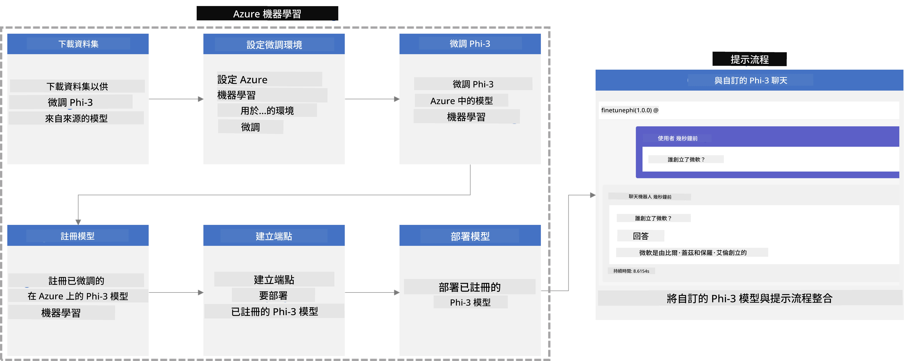
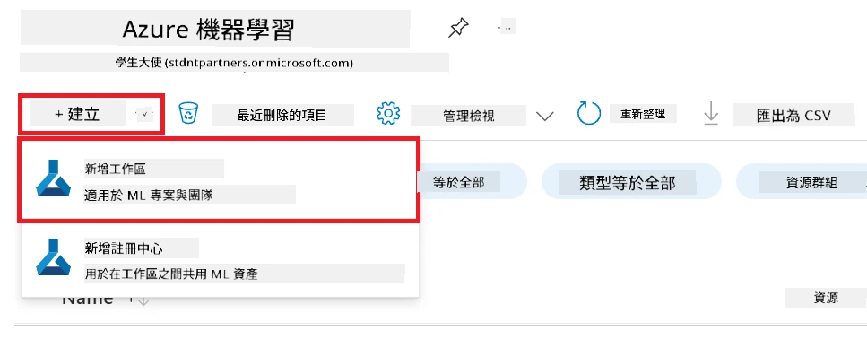
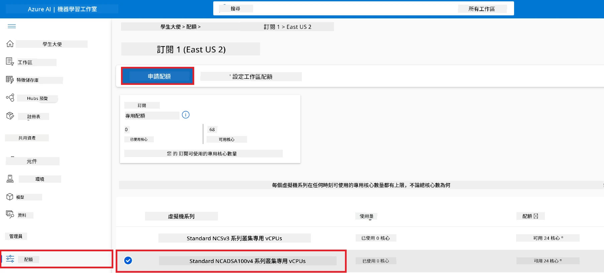
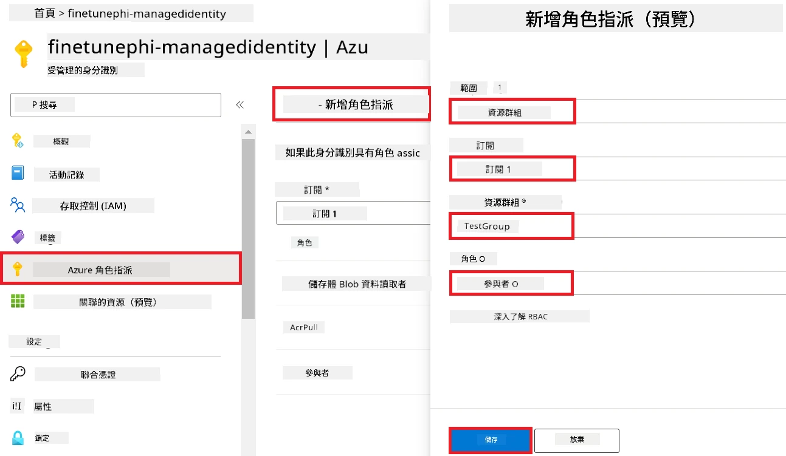
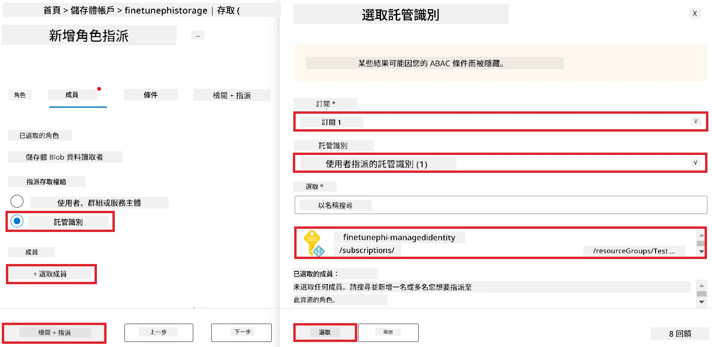
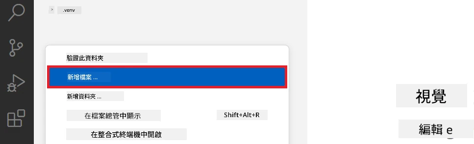
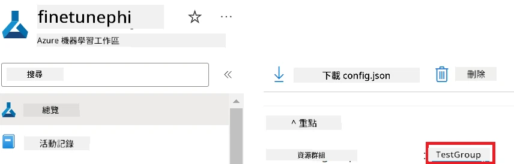
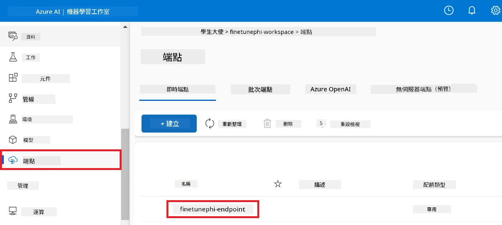
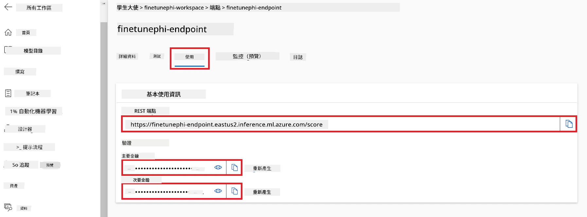
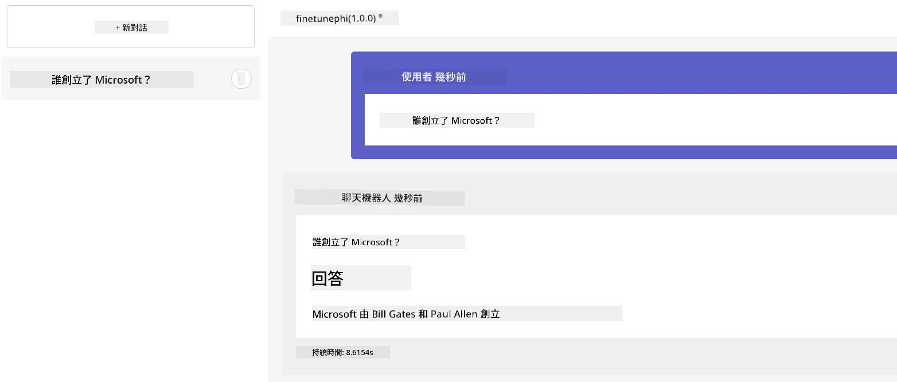

# 使用 Prompt flow 微調並整合自訂 Phi-3 模型

本端對端 (E2E) 範例基於 Microsoft Tech Community 的指南「[使用 Prompt Flow 微調並整合自訂 Phi-3 模型：逐步指南](https://techcommunity.microsoft.com/t5/educator-developer-blog/fine-tune-and-integrate-custom-phi-3-models-with-prompt-flow/ba-p/4178612?WT.mc_id=aiml-137032-kinfeylo)」，介紹微調、部署及使用 Prompt flow 整合自訂 Phi-3 模型的流程。

## 概觀

在這個 E2E 範例中，您將學習如何微調 Phi-3 模型並與 Prompt flow 整合。藉由利用 Azure Machine Learning 與 Prompt flow，建立一個部署並使用自訂 AI 模型的工作流程。此範例分為三個情境：

**情境 1：設定 Azure 資源並為微調做好準備**

**情境 2：微調 Phi-3 模型並於 Azure Machine Learning Studio 部署**

**情境 3：與 Prompt flow 整合並與自訂模型對話**

以下是這個 E2E 範例的概覽。



### 目錄

1. **[情境 1：設定 Azure 資源並為微調做好準備](../../../../../../md/02.Application/01.TextAndChat/Phi3)**
    - [建立 Azure Machine Learning 工作區](../../../../../../md/02.Application/01.TextAndChat/Phi3)
    - [在 Azure 訂閱中申請 GPU 配額](../../../../../../md/02.Application/01.TextAndChat/Phi3)
    - [新增角色指派](../../../../../../md/02.Application/01.TextAndChat/Phi3)
    - [設定專案](../../../../../../md/02.Application/01.TextAndChat/Phi3)
    - [準備微調的資料集](../../../../../../md/02.Application/01.TextAndChat/Phi3)

1. **[情境 2：微調 Phi-3 模型並於 Azure Machine Learning Studio 部署](../../../../../../md/02.Application/01.TextAndChat/Phi3)**
    - [設定 Azure CLI](../../../../../../md/02.Application/01.TextAndChat/Phi3)
    - [微調 Phi-3 模型](../../../../../../md/02.Application/01.TextAndChat/Phi3)
    - [部署微調後的模型](../../../../../../md/02.Application/01.TextAndChat/Phi3)

1. **[情境 3：與 Prompt flow 整合並與自訂模型對話](../../../../../../md/02.Application/01.TextAndChat/Phi3)**
    - [與 Prompt flow 整合自訂 Phi-3 模型](../../../../../../md/02.Application/01.TextAndChat/Phi3)
    - [與自訂模型對話](../../../../../../md/02.Application/01.TextAndChat/Phi3)

## 情境 1：設定 Azure 資源並為微調做好準備

### 建立 Azure Machine Learning 工作區

1. 在入口網站頁面頂端的**搜尋列**輸入 *azure machine learning*，並從出現的選項中選擇 **Azure Machine Learning**。

    

1. 從導覽選單中選擇 **+ 建立**。

1. 從導覽選單中選擇 **新工作區**。

    

1. 執行以下操作：

    - 選擇您的 Azure **訂閱**。
    - 選擇要使用的 **資源群組**（如需，可建立新的）。
    - 輸入 **工作區名稱**，此名稱必須唯一。
    - 選擇您想使用的 **區域**。
    - 選擇要使用的 **儲存帳戶**（如需，可建立新的）。
    - 選擇要使用的 **金鑰保管庫**（如需，可建立新的）。
    - 選擇要使用的 **應用程式洞察**（如需，可建立新的）。
    - 選擇要使用的 **容器註冊表**（如需，可建立新的）。

    

1. 選擇 **審查 + 建立**。

1. 選擇 **建立**。

### 在 Azure 訂閱中申請 GPU 配額

在本 E2E 範例中，您將使用 *Standard_NC24ads_A100_v4 GPU* 進行微調，需申請配額；以及使用 *Standard_E4s_v3* CPU 進行部署，此無需申請配額。

> [!NOTE]
>
> 只有 Pay-As-You-Go (標準訂閱類型) 訂閱有資格分配 GPU，福利訂閱目前不支援。
>
> 對於使用福利訂閱（如 Visual Studio Enterprise 訂閱）或想快速測試微調與部署流程的使用者，本教學也提供使用 CPU 與最小資料集進行微調的指引。但重要的是，使用 GPU 且搭配較大資料集，微調效果會明顯更佳。

1. 造訪 [Azure ML Studio](https://ml.azure.com/home?wt.mc_id=studentamb_279723)。

1. 執行以下操作以申請 *Standard NCADSA100v4 Family* 配額：

    - 從左側標籤選擇 **配額**。
    - 選擇要使用的 **虛擬機器系列**，例如選擇含有 *Standard_NC24ads_A100_v4* GPU 的 **Standard NCADSA100v4 Family Cluster Dedicated vCPUs**。
    - 從導覽選單選擇 **申請配額**。

        

    - 在申請配額頁面，輸入您想使用的 **新核心限制**，例如 24。
    - 在申請配額頁面，選擇 **提交** 申請 GPU 配額。

> [!NOTE]
> 您可參考 [Azure 虛擬機器的大小](https://learn.microsoft.com/azure/virtual-machines/sizes/overview?tabs=breakdownseries%2Cgeneralsizelist%2Ccomputesizelist%2Cmemorysizelist%2Cstoragesizelist%2Cgpusizelist%2Cfpgasizelist%2Chpcsizelist) 文件，選擇適合需求的 GPU 或 CPU。

### 新增角色指派

為了微調與部署模型，您必須先建立一個使用者指派的管理身份 (UAI)，並分配適當權限。此 UAI 將用於部署階段的身分驗證。

#### 建立使用者指派的管理身份 (UAI)

1. 在入口網站頁面頂端搜尋列輸入 *managed identities*，並從選項中選擇 **Managed Identities**。

    

1. 選擇 **+ 建立**。

    

1. 執行以下操作：

    - 選擇您的 Azure **訂閱**。
    - 選擇要使用的 **資源群組**（如需，可建立新的）。
    - 選擇您想使用的 **區域**。
    - 輸入 **名稱**，必須唯一。

1. 選擇 **審查 + 建立**。

1. 選擇 **+ 建立**。

#### 新增貢獻者角色指派到管理身份

1. 導覽至您建立的 Managed Identity 資源。

1. 從左側標籤選擇 **Azure 角色指派**。

1. 從導覽選單選擇 **+ 新增角色指派**。

1. 在新增角色指派頁面中，執行以下操作：
    - 將 **範圍**設定為 **資源群組**。
    - 選擇您的 Azure **訂閱**。
    - 選擇要使用的 **資源群組**。
    - 選擇 **角色**為 **貢獻者**。

    

1. 選擇 **儲存**。

#### 新增儲存體 Blob 資料讀取角色指派到管理身份

1. 在入口網站頁面頂端搜尋列輸入 *storage accounts*，並從選項中選擇 **Storage accounts**。

    

1. 選擇與您建立的 Azure Machine Learning 工作區相關聯的儲存帳戶。例如 *finetunephistorage*。

1. 執行以下操作以導覽至新增角色指派頁面：

    - 導覽至您建立的 Azure 儲存帳戶。
    - 從左側標籤選擇 **存取控制 (IAM)**。
    - 從導覽選單選擇 **+ 新增**。
    - 從導覽選單選擇 **新增角色指派**。

    

1. 在新增角色指派頁面中，執行以下操作：

    - 在角色頁面搜尋列中輸入 *Storage Blob Data Reader*，並從選項中選擇 **Storage Blob Data Reader**。
    - 點選 **下一步**。
    - 在成員頁面將 **指派存取權限給** 設為 **Managed identity**。
    - 點選 **+ 選擇成員**。
    - 在選擇管理身份頁面，選擇您的 Azure **訂閱**。
    - 選擇 **Managed identity**。
    - 選擇您建立的管理身份，例如 *finetunephi-managedidentity*。
    - 點選 **選擇**。

    

1. 點選 **審查 + 指派**。

#### 新增 AcrPull 角色指派到管理身份

1. 在入口網站頁面頂端搜尋列輸入 *container registries*，並從選項中選擇 **Container registries**。

    

1. 選擇與 Azure Machine Learning 工作區相關聯的容器註冊，例：*finetunephicontainerregistries*

1. 執行以下操作以導覽至新增角色指派頁面：

    - 選擇 **存取控制 (IAM)**，位於左側標籤。
    - 從導覽選單選擇 **+ 新增**。
    - 從導覽選單選擇 **新增角色指派**。

1. 在新增角色指派頁面中，執行以下操作：

    - 在角色頁面搜尋列中輸入 *AcrPull*，並從選項中選擇 **AcrPull**。
    - 點選 **下一步**。
    - 在成員頁面將 **指派存取權限給** 設為 **Managed identity**。
    - 點選 **+ 選擇成員**。
    - 在選擇管理身份頁面，選擇您的 Azure **訂閱**。
    - 選擇 **Managed identity**。
    - 選擇您建立的管理身份，例如 *finetunephi-managedidentity*。
    - 點選 **選擇**。
    - 點選 **審查 + 指派**。

### 設定專案

現在，您將建立一個資料夾進行開發，並設定虛擬環境，開發一個與使用者互動並使用來自 Azure Cosmos DB 的聊天記錄作為回應參考的程式。

#### 建立工作用資料夾

1. 開啟終端機視窗，輸入以下指令建立一個名為 *finetune-phi* 的資料夾於預設路徑。

    ```console
    mkdir finetune-phi
    ```

1. 在終端機中輸入以下指令，切換至您建立的 *finetune-phi* 資料夾。

    ```console
    cd finetune-phi
    ```

#### 建立虛擬環境

1. 在終端機中輸入以下指令，建立一個名為 *.venv* 的虛擬環境。

    ```console
    python -m venv .venv
    ```

1. 在終端機中輸入以下指令，啟動虛擬環境。

    ```console
    .venv\Scripts\activate.bat
    ```

> [!NOTE]
>
> 若成功啟動，應會在命令提示字元前看到 *(.venv)*。

#### 安裝必要套件

1. 於終端機中輸入以下指令，安裝所需套件。

    ```console
    pip install datasets==2.19.1
    pip install transformers==4.41.1
    pip install azure-ai-ml==1.16.0
    pip install torch==2.3.1
    pip install trl==0.9.4
    pip install promptflow==1.12.0
    ```

#### 建立專案檔案
在本練習中，您將建立我們專案的必要檔案。這些檔案包括用於下載資料集的腳本、設定 Azure 機器學習環境、微調 Phi-3 模型，以及部署微調後模型的腳本。您還將建立一個 *conda.yml* 檔案，用於設定微調環境。

在本練習中，您將：

- 建立一個 *download_dataset.py* 檔案以下載資料集。
- 建立一個 *setup_ml.py* 檔案以設定 Azure 機器學習環境。
- 在 *finetuning_dir* 資料夾中建立一個 *fine_tune.py* 檔案，用於使用資料集微調 Phi-3 模型。
- 建立一個 *conda.yml* 檔案以設定微調環境。
- 建立一個 *deploy_model.py* 檔案以部署微調後的模型。
- 建立一個 *integrate_with_promptflow.py* 檔案，以整合微調後的模型並使用 Prompt flow 執行模型。
- 建立一個 flow.dag.yml 檔案，以設定 Prompt flow 的工作流程結構。
- 建立一個 *config.py* 檔案以輸入 Azure 資訊。

> [!NOTE]
>
> 完整的資料夾結構：
>
> ```text
> └── YourUserName
> .    └── finetune-phi
> .        ├── finetuning_dir
> .        │      └── fine_tune.py
> .        ├── conda.yml
> .        ├── config.py
> .        ├── deploy_model.py
> .        ├── download_dataset.py
> .        ├── flow.dag.yml
> .        ├── integrate_with_promptflow.py
> .        └── setup_ml.py
> ```

1. 開啟 **Visual Studio Code**。

1. 從選單列選擇 **File**。

1. 選擇 **Open Folder**。

1. 選擇您建立的 *finetune-phi* 資料夾，位於 *C:\Users\yourUserName\finetune-phi*。

    

1. 在 Visual Studio Code 左側窗格中，右鍵點擊並選擇 **New File** 以建立名為 *download_dataset.py* 的新檔案。

1. 在 Visual Studio Code 左側窗格中，右鍵點擊並選擇 **New File** 以建立名為 *setup_ml.py* 的新檔案。

1. 在 Visual Studio Code 左側窗格中，右鍵點擊並選擇 **New File** 以建立名為 *deploy_model.py* 的新檔案。

    

1. 在 Visual Studio Code 左側窗格中，右鍵點擊並選擇 **New Folder** 以建立名為 *finetuning_dir* 的新資料夾。

1. 在 *finetuning_dir* 資料夾中，建立一個名為 *fine_tune.py* 的新檔案。

#### 建立並設定 *conda.yml* 檔案

1. 在 Visual Studio Code 左側窗格中，右鍵點擊並選擇 **New File** 以建立名為 *conda.yml* 的新檔案。

1. 將以下程式碼新增至 *conda.yml* 檔案以設定 Phi-3 模型的微調環境。

    ```yml
    name: phi-3-training-env
    channels:
      - defaults
      - conda-forge
    dependencies:
      - python=3.10
      - pip
      - numpy<2.0
      - pip:
          - torch==2.4.0
          - torchvision==0.19.0
          - trl==0.8.6
          - transformers==4.41
          - datasets==2.21.0
          - azureml-core==1.57.0
          - azure-storage-blob==12.19.0
          - azure-ai-ml==1.16
          - azure-identity==1.17.1
          - accelerate==0.33.0
          - mlflow==2.15.1
          - azureml-mlflow==1.57.0
    ```

#### 建立並設定 *config.py* 檔案

1. 在 Visual Studio Code 左側窗格中，右鍵點擊並選擇 **New File** 以建立名為 *config.py* 的新檔案。

1. 將以下程式碼新增至 *config.py* 檔案以填入您的 Azure 資訊。

    ```python
    # Azure 設定
    AZURE_SUBSCRIPTION_ID = "your_subscription_id"
    AZURE_RESOURCE_GROUP_NAME = "your_resource_group_name" # "TestGroup"

    # Azure 機器學習設定
    AZURE_ML_WORKSPACE_NAME = "your_workspace_name" # "finetunephi-workspace"

    # Azure 管理身分設定
    AZURE_MANAGED_IDENTITY_CLIENT_ID = "your_azure_managed_identity_client_id"
    AZURE_MANAGED_IDENTITY_NAME = "your_azure_managed_identity_name" # "finetunephi-mangedidentity"
    AZURE_MANAGED_IDENTITY_RESOURCE_ID = f"/subscriptions/{AZURE_SUBSCRIPTION_ID}/resourceGroups/{AZURE_RESOURCE_GROUP_NAME}/providers/Microsoft.ManagedIdentity/userAssignedIdentities/{AZURE_MANAGED_IDENTITY_NAME}"

    # 資料集檔案路徑
    TRAIN_DATA_PATH = "data/train_data.jsonl"
    TEST_DATA_PATH = "data/test_data.jsonl"

    # 微調模型設定
    AZURE_MODEL_NAME = "your_fine_tuned_model_name" # "finetune-phi-model"
    AZURE_ENDPOINT_NAME = "your_fine_tuned_model_endpoint_name" # "finetune-phi-endpoint"
    AZURE_DEPLOYMENT_NAME = "your_fine_tuned_model_deployment_name" # "finetune-phi-deployment"

    AZURE_ML_API_KEY = "your_fine_tuned_model_api_key"
    AZURE_ML_ENDPOINT = "your_fine_tuned_model_endpoint_uri" # "https://{your-endpoint-name}.{your-region}.inference.ml.azure.com/score"
    ```

#### 新增 Azure 環境變數

1. 執行以下操作以新增 Azure 訂閱 ID：

    - 在入口網站頁面頂部的 **搜尋列** 輸入 *subscriptions*，並從出現的選項中選擇 **Subscriptions**。
    - 選擇您目前正在使用的 Azure 訂閱。
    - 複製並貼上您的訂閱 ID 至 *config.py* 檔案。

    

1. 執行以下操作以新增 Azure 工作區名稱：

    - 導航至您建立的 Azure 機器學習資源。
    - 複製並貼上您的帳戶名稱至 *config.py* 檔案。

    

1. 執行以下操作以新增 Azure 資源群組名稱：

    - 導航至您建立的 Azure 機器學習資源。
    - 複製並貼上您的 Azure 資源群組名稱至 *config.py* 檔案。

    

2. 執行以下操作以新增 Azure 託管識別名稱

    - 導航至您建立的 託管識別 (Managed Identities) 資源。
    - 複製並貼上您的 Azure 託管識別名稱至 *config.py* 檔案。

    

### 準備微調用資料集

在本練習中，您將執行 *download_dataset.py* 檔案，以將 *ULTRACHAT_200k* 資料集下載至本地環境。接著，您會使用這些資料集在 Azure 機器學習中微調 Phi-3 模型。

#### 使用 *download_dataset.py* 下載資料集

1. 在 Visual Studio Code 中開啟 *download_dataset.py* 檔案。

1. 將以下程式碼新增至 *download_dataset.py*。

    ```python
    import json
    import os
    from datasets import load_dataset
    from config import (
        TRAIN_DATA_PATH,
        TEST_DATA_PATH)

    def load_and_split_dataset(dataset_name, config_name, split_ratio):
        """
        Load and split a dataset.
        """
        # 載入具有指定名稱、配置和拆分比例的資料集
        dataset = load_dataset(dataset_name, config_name, split=split_ratio)
        print(f"Original dataset size: {len(dataset)}")
        
        # 將資料集拆分為訓練集和測試集（80%訓練，20%測試）
        split_dataset = dataset.train_test_split(test_size=0.2)
        print(f"Train dataset size: {len(split_dataset['train'])}")
        print(f"Test dataset size: {len(split_dataset['test'])}")
        
        return split_dataset

    def save_dataset_to_jsonl(dataset, filepath):
        """
        Save a dataset to a JSONL file.
        """
        # 如果目錄不存在，則建立目錄
        os.makedirs(os.path.dirname(filepath), exist_ok=True)
        
        # 以寫入模式開啟檔案
        with open(filepath, 'w', encoding='utf-8') as f:
            # 遍歷資料集中的每一筆紀錄
            for record in dataset:
                # 將紀錄以 JSON 物件格式寫入檔案
                json.dump(record, f)
                # 寫入換行字元以分隔紀錄
                f.write('\n')
        
        print(f"Dataset saved to {filepath}")

    def main():
        """
        Main function to load, split, and save the dataset.
        """
        # 載入並拆分具有指定配置和拆分比例的 ULTRACHAT_200k 資料集
        dataset = load_and_split_dataset("HuggingFaceH4/ultrachat_200k", 'default', 'train_sft[:1%]')
        
        # 從拆分結果中擷取訓練和測試資料集
        train_dataset = dataset['train']
        test_dataset = dataset['test']

        # 將訓練資料集儲存為 JSONL 檔案
        save_dataset_to_jsonl(train_dataset, TRAIN_DATA_PATH)
        
        # 將測試資料集儲存為另一個 JSONL 檔案
        save_dataset_to_jsonl(test_dataset, TEST_DATA_PATH)

    if __name__ == "__main__":
        main()

    ```

> [!TIP]
>
> **使用最小資料集於 CPU 上微調的指引**
>
> 如果您想在 CPU 上執行微調，此方法適合擁有優惠訂閱（例如 Visual Studio Enterprise 訂閱）者，或是快速測試微調和部署流程。
>
> 將 `dataset = load_and_split_dataset("HuggingFaceH4/ultrachat_200k", 'default', 'train_sft[:1%]')` 替換為 `dataset = load_and_split_dataset("HuggingFaceH4/ultrachat_200k", 'default', 'train_sft[:10]')`
>

1. 在終端機中輸入以下指令以執行腳本並將資料集下載至本地環境。

    ```console
    python download_data.py
    ```

1. 驗證資料集是否已成功儲存至本地的 *finetune-phi/data* 目錄。

> [!NOTE]
>
> **資料集大小與微調時間**
>
> 在此端對端示範中，您僅使用 1% 的資料集（`train_sft[:1%]`）。這能顯著減少資料量，加快上傳及微調流程。您可以調整百分比以取得訓練時間與模型效能的平衡。使用小型資料集有助於縮短微調時間，使端對端示範更易管理。

## 情境 2：微調 Phi-3 模型並在 Azure 機器學習 Studio 部署

### 設定 Azure CLI

您需要設定 Azure CLI 以驗證您的環境。Azure CLI 允許您直接從命令列管理 Azure 資源，並為 Azure 機器學習提供存取這些資源所需的憑證。欲開始使用，請安裝 [Azure CLI](https://learn.microsoft.com/cli/azure/install-azure-cli)

1. 開啟終端機視窗，輸入以下指令登入您的 Azure 帳戶。

    ```console
    az login
    ```

1. 選擇您要使用的 Azure 帳戶。

1. 選擇您要使用的 Azure 訂閱。

    

> [!TIP]
>
> 若登入 Azure 遇到困難，可嘗試使用裝置代碼登入。開啟終端機視窗，輸入以下指令登入您的 Azure 帳戶：
>
> ```console
> az login --use-device-code
> ```
>

### 微調 Phi-3 模型

在本練習中，您將使用提供的資料集微調 Phi-3 模型。首先，您會在 *fine_tune.py* 檔案中定義微調流程。接著，您將設定 Azure 機器學習環境並透過執行 *setup_ml.py* 檔案啟動微調流程。此腳本可確保微調在 Azure 機器學習環境中進行。

執行 *setup_ml.py* 後，您將在 Azure 機器學習環境中執行微調流程。

#### 在 *fine_tune.py* 檔案中新增程式碼

1. 前往 *finetuning_dir* 資料夾，並在 Visual Studio Code 中開啟 *fine_tune.py* 檔案。

1. 將以下程式碼新增至 *fine_tune.py*。

    ```python
    import argparse
    import sys
    import logging
    import os
    from datasets import load_dataset
    import torch
    import mlflow
    from transformers import AutoModelForCausalLM, AutoTokenizer, TrainingArguments
    from trl import SFTTrainer

    # 為避免 MLflow 中的 INVALID_PARAMETER_VALUE 錯誤，請禁用 MLflow 整合
    os.environ["DISABLE_MLFLOW_INTEGRATION"] = "True"

    # 設定日誌記錄
    logging.basicConfig(
        format="%(asctime)s - %(levelname)s - %(name)s - %(message)s",
        datefmt="%Y-%m-%d %H:%M:%S",
        handlers=[logging.StreamHandler(sys.stdout)],
        level=logging.WARNING
    )
    logger = logging.getLogger(__name__)

    def initialize_model_and_tokenizer(model_name, model_kwargs):
        """
        Initialize the model and tokenizer with the given pretrained model name and arguments.
        """
        model = AutoModelForCausalLM.from_pretrained(model_name, **model_kwargs)
        tokenizer = AutoTokenizer.from_pretrained(model_name)
        tokenizer.model_max_length = 2048
        tokenizer.pad_token = tokenizer.unk_token
        tokenizer.pad_token_id = tokenizer.convert_tokens_to_ids(tokenizer.pad_token)
        tokenizer.padding_side = 'right'
        return model, tokenizer

    def apply_chat_template(example, tokenizer):
        """
        Apply a chat template to tokenize messages in the example.
        """
        messages = example["messages"]
        if messages[0]["role"] != "system":
            messages.insert(0, {"role": "system", "content": ""})
        example["text"] = tokenizer.apply_chat_template(
            messages, tokenize=False, add_generation_prompt=False
        )
        return example

    def load_and_preprocess_data(train_filepath, test_filepath, tokenizer):
        """
        Load and preprocess the dataset.
        """
        train_dataset = load_dataset('json', data_files=train_filepath, split='train')
        test_dataset = load_dataset('json', data_files=test_filepath, split='train')
        column_names = list(train_dataset.features)

        train_dataset = train_dataset.map(
            apply_chat_template,
            fn_kwargs={"tokenizer": tokenizer},
            num_proc=10,
            remove_columns=column_names,
            desc="Applying chat template to train dataset",
        )

        test_dataset = test_dataset.map(
            apply_chat_template,
            fn_kwargs={"tokenizer": tokenizer},
            num_proc=10,
            remove_columns=column_names,
            desc="Applying chat template to test dataset",
        )

        return train_dataset, test_dataset

    def train_and_evaluate_model(train_dataset, test_dataset, model, tokenizer, output_dir):
        """
        Train and evaluate the model.
        """
        training_args = TrainingArguments(
            bf16=True,
            do_eval=True,
            output_dir=output_dir,
            eval_strategy="epoch",
            learning_rate=5.0e-06,
            logging_steps=20,
            lr_scheduler_type="cosine",
            num_train_epochs=3,
            overwrite_output_dir=True,
            per_device_eval_batch_size=4,
            per_device_train_batch_size=4,
            remove_unused_columns=True,
            save_steps=500,
            seed=0,
            gradient_checkpointing=True,
            gradient_accumulation_steps=1,
            warmup_ratio=0.2,
        )

        trainer = SFTTrainer(
            model=model,
            args=training_args,
            train_dataset=train_dataset,
            eval_dataset=test_dataset,
            max_seq_length=2048,
            dataset_text_field="text",
            tokenizer=tokenizer,
            packing=True
        )

        train_result = trainer.train()
        trainer.log_metrics("train", train_result.metrics)

        mlflow.transformers.log_model(
            transformers_model={"model": trainer.model, "tokenizer": tokenizer},
            artifact_path=output_dir,
        )

        tokenizer.padding_side = 'left'
        eval_metrics = trainer.evaluate()
        eval_metrics["eval_samples"] = len(test_dataset)
        trainer.log_metrics("eval", eval_metrics)

    def main(train_file, eval_file, model_output_dir):
        """
        Main function to fine-tune the model.
        """
        model_kwargs = {
            "use_cache": False,
            "trust_remote_code": True,
            "torch_dtype": torch.bfloat16,
            "device_map": None,
            "attn_implementation": "eager"
        }

        # pretrained_model_name = "microsoft/Phi-3-mini-4k-instruct"
        pretrained_model_name = "microsoft/Phi-3.5-mini-instruct"

        with mlflow.start_run():
            model, tokenizer = initialize_model_and_tokenizer(pretrained_model_name, model_kwargs)
            train_dataset, test_dataset = load_and_preprocess_data(train_file, eval_file, tokenizer)
            train_and_evaluate_model(train_dataset, test_dataset, model, tokenizer, model_output_dir)

    if __name__ == "__main__":
        parser = argparse.ArgumentParser()
        parser.add_argument("--train-file", type=str, required=True, help="Path to the training data")
        parser.add_argument("--eval-file", type=str, required=True, help="Path to the evaluation data")
        parser.add_argument("--model_output_dir", type=str, required=True, help="Directory to save the fine-tuned model")
        args = parser.parse_args()
        main(args.train_file, args.eval_file, args.model_output_dir)

    ```

1. 儲存並關閉 *fine_tune.py* 檔案。

> [!TIP]
> **您可以微調 Phi-3.5 模型**
>
> 在 *fine_tune.py* 檔案中，您可以將 `pretrained_model_name` 從 `"microsoft/Phi-3-mini-4k-instruct"` 改為您想微調的任何模型名稱。舉例來說，如果改為 `"microsoft/Phi-3.5-mini-instruct"`，則會使用 Phi-3.5-mini-instruct 模型進行微調。欲找到並使用喜愛的模型名稱，請造訪 [Hugging Face](https://huggingface.co/)，搜尋您感興趣的模型，然後將其名稱複製並貼入腳本中的 `pretrained_model_name` 欄位。
>
> <image type="content" src="../../../../imgs/02/FineTuning-PromptFlow/finetunephi3.5.png" alt-text="微調 Phi-3.5。">
>

#### 在 *setup_ml.py* 檔案中新增程式碼

1. 在 Visual Studio Code 中開啟 *setup_ml.py* 檔案。

1. 將以下程式碼新增至 *setup_ml.py*。

    ```python
    import logging
    from azure.ai.ml import MLClient, command, Input
    from azure.ai.ml.entities import Environment, AmlCompute
    from azure.identity import AzureCliCredential
    from config import (
        AZURE_SUBSCRIPTION_ID,
        AZURE_RESOURCE_GROUP_NAME,
        AZURE_ML_WORKSPACE_NAME,
        TRAIN_DATA_PATH,
        TEST_DATA_PATH
    )

    # 常數

    # 取消註解以下行以使用 CPU 實例進行訓練
    # COMPUTE_INSTANCE_TYPE = "Standard_E16s_v3" # cpu
    # COMPUTE_NAME = "cpu-e16s-v3"
    # DOCKER_IMAGE_NAME = "mcr.microsoft.com/azureml/openmpi4.1.0-ubuntu20.04:latest"

    # 取消註解以下行以使用 GPU 實例進行訓練
    COMPUTE_INSTANCE_TYPE = "Standard_NC24ads_A100_v4"
    COMPUTE_NAME = "gpu-nc24s-a100-v4"
    DOCKER_IMAGE_NAME = "mcr.microsoft.com/azureml/curated/acft-hf-nlp-gpu:59"

    CONDA_FILE = "conda.yml"
    LOCATION = "eastus2" # 替換為您的運算叢集位置
    FINETUNING_DIR = "./finetuning_dir" # 微調腳本的路徑
    TRAINING_ENV_NAME = "phi-3-training-environment" # 訓練環境名稱
    MODEL_OUTPUT_DIR = "./model_output" # Azure ML 中模型輸出目錄的路徑

    # 記錄設置以追踪過程
    logger = logging.getLogger(__name__)
    logging.basicConfig(
        format="%(asctime)s - %(levelname)s - %(name)s - %(message)s",
        datefmt="%Y-%m-%d %H:%M:%S",
        level=logging.WARNING
    )

    def get_ml_client():
        """
        Initialize the ML Client using Azure CLI credentials.
        """
        credential = AzureCliCredential()
        return MLClient(credential, AZURE_SUBSCRIPTION_ID, AZURE_RESOURCE_GROUP_NAME, AZURE_ML_WORKSPACE_NAME)

    def create_or_get_environment(ml_client):
        """
        Create or update the training environment in Azure ML.
        """
        env = Environment(
            image=DOCKER_IMAGE_NAME,  # 環境用的 Docker 映像
            conda_file=CONDA_FILE,  # Conda 環境檔案
            name=TRAINING_ENV_NAME,  # 環境名稱
        )
        return ml_client.environments.create_or_update(env)

    def create_or_get_compute_cluster(ml_client, compute_name, COMPUTE_INSTANCE_TYPE, location):
        """
        Create or update the compute cluster in Azure ML.
        """
        try:
            compute_cluster = ml_client.compute.get(compute_name)
            logger.info(f"Compute cluster '{compute_name}' already exists. Reusing it for the current run.")
        except Exception:
            logger.info(f"Compute cluster '{compute_name}' does not exist. Creating a new one with size {COMPUTE_INSTANCE_TYPE}.")
            compute_cluster = AmlCompute(
                name=compute_name,
                size=COMPUTE_INSTANCE_TYPE,
                location=location,
                tier="Dedicated",  # 運算叢集等級
                min_instances=0,  # 最小實例數量
                max_instances=1  # 最大實例數量
            )
            ml_client.compute.begin_create_or_update(compute_cluster).wait()  # 等待叢集建立完成
        return compute_cluster

    def create_fine_tuning_job(env, compute_name):
        """
        Set up the fine-tuning job in Azure ML.
        """
        return command(
            code=FINETUNING_DIR,  # fine_tune.py 的路徑
            command=(
                "python fine_tune.py "
                "--train-file ${{inputs.train_file}} "
                "--eval-file ${{inputs.eval_file}} "
                "--model_output_dir ${{inputs.model_output}}"
            ),
            environment=env,  # 訓練環境
            compute=compute_name,  # 使用的運算叢集
            inputs={
                "train_file": Input(type="uri_file", path=TRAIN_DATA_PATH),  # 訓練數據檔案的路徑
                "eval_file": Input(type="uri_file", path=TEST_DATA_PATH),  # 評估數據檔案的路徑
                "model_output": MODEL_OUTPUT_DIR
            }
        )

    def main():
        """
        Main function to set up and run the fine-tuning job in Azure ML.
        """
        # 初始化 ML 用戶端
        ml_client = get_ml_client()

        # 建立環境
        env = create_or_get_environment(ml_client)
        
        # 建立或取得現有運算叢集
        create_or_get_compute_cluster(ml_client, COMPUTE_NAME, COMPUTE_INSTANCE_TYPE, LOCATION)

        # 建立並提交微調作業
        job = create_fine_tuning_job(env, COMPUTE_NAME)
        returned_job = ml_client.jobs.create_or_update(job)  # 提交作業
        ml_client.jobs.stream(returned_job.name)  # 串流作業日誌
        
        # 捕捉作業名稱
        job_name = returned_job.name
        print(f"Job name: {job_name}")

    if __name__ == "__main__":
        main()

    ```

1. 將 `COMPUTE_INSTANCE_TYPE`、`COMPUTE_NAME` 和 `LOCATION` 替換為您的具體資訊。

    ```python
   # 取消註解以下行以使用 GPU 實例進行訓練
    COMPUTE_INSTANCE_TYPE = "Standard_NC24ads_A100_v4"
    COMPUTE_NAME = "gpu-nc24s-a100-v4"
    ...
    LOCATION = "eastus2" # 替換為您的計算叢集位置
    ```

> [!TIP]
>
> **使用最小資料集於 CPU 上微調的指引**
>
> 若您想使用 CPU 執行微調，此方法適合擁有優惠訂閱（例如 Visual Studio Enterprise 訂閱）者，或是快速測試微調和部署流程。
>
> 1. 開啟 *setup_ml* 檔案。
> 1. 使用以下設定取代 `COMPUTE_INSTANCE_TYPE`、`COMPUTE_NAME` 及 `DOCKER_IMAGE_NAME`。若您無法使用 *Standard_E16s_v3*，可改用等效的 CPU 執行個體或申請新的額度。
> 1. 將 `LOCATION` 替換為您的具體資訊。
>
>    ```python
>    # Uncomment the following lines to use a CPU instance for training
>    COMPUTE_INSTANCE_TYPE = "Standard_E16s_v3" # cpu
>    COMPUTE_NAME = "cpu-e16s-v3"
>    DOCKER_IMAGE_NAME = "mcr.microsoft.com/azureml/openmpi4.1.0-ubuntu20.04:latest"
>    LOCATION = "eastus2" # Replace with the location of your compute cluster
>    ```
>

1. 輸入以下指令以執行 *setup_ml.py* 腳本並在 Azure 機器學習中啟動微調流程。

    ```python
    python setup_ml.py
    ```

1. 在此練習中，您成功使用 Azure 機器學習微調了 Phi-3 模型。執行 *setup_ml.py* 腳本後，您已設定 Azure 機器學習環境並啟動 *fine_tune.py* 中定義的微調流程。請注意，微調過程可能需要相當長的時間。執行 `python setup_ml.py` 指令後，您需要等待該流程完成。您可以透過終端列中提供的連結到 Azure 機器學習入口網站，監控微調工作的狀態。

    

### 部署微調後模型

為了將微調完成的 Phi-3 模型整合至 Prompt Flow，您必須將模型部署，使其能進行即時推論。此流程包含註冊模型、建立線上端點與部署模型。

#### 設定部署用的模型名稱、端點名稱與部署名稱

1. 開啟 *config.py* 檔案。

1. 將 `AZURE_MODEL_NAME = "your_fine_tuned_model_name"` 替換為您模型的名稱。

1. 將 `AZURE_ENDPOINT_NAME = "your_fine_tuned_model_endpoint_name"` 替換為您端點的名稱。

1. 將 `AZURE_DEPLOYMENT_NAME = "your_fine_tuned_model_deployment_name"` 替換為您部署的名稱。

#### 在 *deploy_model.py* 檔案中新增程式碼

執行 *deploy_model.py* 檔案會自動完成整個部署流程。它會根據 *config.py* 中指定的模型名稱、端點名稱和部署名稱，註冊模型、建立端點並進行部署。

1. 在 Visual Studio Code 中開啟 *deploy_model.py* 檔案。

1. 將以下程式碼新增至 *deploy_model.py*。

    ```python
    import logging
    from azure.identity import AzureCliCredential
    from azure.ai.ml import MLClient
    from azure.ai.ml.entities import Model, ProbeSettings, ManagedOnlineEndpoint, ManagedOnlineDeployment, IdentityConfiguration, ManagedIdentityConfiguration, OnlineRequestSettings
    from azure.ai.ml.constants import AssetTypes

    # 配置匯入
    from config import (
        AZURE_SUBSCRIPTION_ID,
        AZURE_RESOURCE_GROUP_NAME,
        AZURE_ML_WORKSPACE_NAME,
        AZURE_MANAGED_IDENTITY_RESOURCE_ID,
        AZURE_MANAGED_IDENTITY_CLIENT_ID,
        AZURE_MODEL_NAME,
        AZURE_ENDPOINT_NAME,
        AZURE_DEPLOYMENT_NAME
    )

    # 常數
    JOB_NAME = "your-job-name"
    COMPUTE_INSTANCE_TYPE = "Standard_E4s_v3"

    deployment_env_vars = {
        "SUBSCRIPTION_ID": AZURE_SUBSCRIPTION_ID,
        "RESOURCE_GROUP_NAME": AZURE_RESOURCE_GROUP_NAME,
        "UAI_CLIENT_ID": AZURE_MANAGED_IDENTITY_CLIENT_ID,
    }

    # 日誌設置
    logging.basicConfig(
        format="%(asctime)s - %(levelname)s - %(name)s - %(message)s",
        datefmt="%Y-%m-%d %H:%M:%S",
        level=logging.DEBUG
    )
    logger = logging.getLogger(__name__)

    def get_ml_client():
        """Initialize and return the ML Client."""
        credential = AzureCliCredential()
        return MLClient(credential, AZURE_SUBSCRIPTION_ID, AZURE_RESOURCE_GROUP_NAME, AZURE_ML_WORKSPACE_NAME)

    def register_model(ml_client, model_name, job_name):
        """Register a new model."""
        model_path = f"azureml://jobs/{job_name}/outputs/artifacts/paths/model_output"
        logger.info(f"Registering model {model_name} from job {job_name} at path {model_path}.")
        run_model = Model(
            path=model_path,
            name=model_name,
            description="Model created from run.",
            type=AssetTypes.MLFLOW_MODEL,
        )
        model = ml_client.models.create_or_update(run_model)
        logger.info(f"Registered model ID: {model.id}")
        return model

    def delete_existing_endpoint(ml_client, endpoint_name):
        """Delete existing endpoint if it exists."""
        try:
            endpoint_result = ml_client.online_endpoints.get(name=endpoint_name)
            logger.info(f"Deleting existing endpoint {endpoint_name}.")
            ml_client.online_endpoints.begin_delete(name=endpoint_name).result()
            logger.info(f"Deleted existing endpoint {endpoint_name}.")
        except Exception as e:
            logger.info(f"No existing endpoint {endpoint_name} found to delete: {e}")

    def create_or_update_endpoint(ml_client, endpoint_name, description=""):
        """Create or update an endpoint."""
        delete_existing_endpoint(ml_client, endpoint_name)
        logger.info(f"Creating new endpoint {endpoint_name}.")
        endpoint = ManagedOnlineEndpoint(
            name=endpoint_name,
            description=description,
            identity=IdentityConfiguration(
                type="user_assigned",
                user_assigned_identities=[ManagedIdentityConfiguration(resource_id=AZURE_MANAGED_IDENTITY_RESOURCE_ID)]
            )
        )
        endpoint_result = ml_client.online_endpoints.begin_create_or_update(endpoint).result()
        logger.info(f"Created new endpoint {endpoint_name}.")
        return endpoint_result

    def create_or_update_deployment(ml_client, endpoint_name, deployment_name, model):
        """Create or update a deployment."""

        logger.info(f"Creating deployment {deployment_name} for endpoint {endpoint_name}.")
        deployment = ManagedOnlineDeployment(
            name=deployment_name,
            endpoint_name=endpoint_name,
            model=model.id,
            instance_type=COMPUTE_INSTANCE_TYPE,
            instance_count=1,
            environment_variables=deployment_env_vars,
            request_settings=OnlineRequestSettings(
                max_concurrent_requests_per_instance=3,
                request_timeout_ms=180000,
                max_queue_wait_ms=120000
            ),
            liveness_probe=ProbeSettings(
                failure_threshold=30,
                success_threshold=1,
                period=100,
                initial_delay=500,
            ),
            readiness_probe=ProbeSettings(
                failure_threshold=30,
                success_threshold=1,
                period=100,
                initial_delay=500,
            ),
        )
        deployment_result = ml_client.online_deployments.begin_create_or_update(deployment).result()
        logger.info(f"Created deployment {deployment.name} for endpoint {endpoint_name}.")
        return deployment_result

    def set_traffic_to_deployment(ml_client, endpoint_name, deployment_name):
        """Set traffic to the specified deployment."""
        try:
            # 獲取當前端點詳細資訊
            endpoint = ml_client.online_endpoints.get(name=endpoint_name)
            
            # 記錄當前流量分配以進行除錯
            logger.info(f"Current traffic allocation: {endpoint.traffic}")
            
            # 設定部署的流量分配
            endpoint.traffic = {deployment_name: 100}
            
            # 使用新的流量分配更新端點
            endpoint_poller = ml_client.online_endpoints.begin_create_or_update(endpoint)
            updated_endpoint = endpoint_poller.result()
            
            # 記錄更新後的流量分配以進行除錯
            logger.info(f"Updated traffic allocation: {updated_endpoint.traffic}")
            logger.info(f"Set traffic to deployment {deployment_name} at endpoint {endpoint_name}.")
            return updated_endpoint
        except Exception as e:
            # 記錄過程中發生的任何錯誤
            logger.error(f"Failed to set traffic to deployment: {e}")
            raise


    def main():
        ml_client = get_ml_client()

        registered_model = register_model(ml_client, AZURE_MODEL_NAME, JOB_NAME)
        logger.info(f"Registered model ID: {registered_model.id}")

        endpoint = create_or_update_endpoint(ml_client, AZURE_ENDPOINT_NAME, "Endpoint for finetuned Phi-3 model")
        logger.info(f"Endpoint {AZURE_ENDPOINT_NAME} is ready.")

        try:
            deployment = create_or_update_deployment(ml_client, AZURE_ENDPOINT_NAME, AZURE_DEPLOYMENT_NAME, registered_model)
            logger.info(f"Deployment {AZURE_DEPLOYMENT_NAME} is created for endpoint {AZURE_ENDPOINT_NAME}.")

            set_traffic_to_deployment(ml_client, AZURE_ENDPOINT_NAME, AZURE_DEPLOYMENT_NAME)
            logger.info(f"Traffic is set to deployment {AZURE_DEPLOYMENT_NAME} at endpoint {AZURE_ENDPOINT_NAME}.")
        except Exception as e:
            logger.error(f"Failed to create or update deployment: {e}")

    if __name__ == "__main__":
        main()

    ```

1. 執行以下操作以取得 `JOB_NAME`：

    - 導航至您建立的 Azure 機器學習資源。
    - 選擇 **Studio web URL** 以開啟 Azure 機器學習工作區。
    - 從左側標籤選擇 **Jobs**。
    - 選擇用於微調的實驗，例如 *finetunephi*。
    - 選擇您建立的工作。
- 複製並貼上您的工作名稱至 *deploy_model.py* 檔案中的 `JOB_NAME = "your-job-name"`。

1. 將 `COMPUTE_INSTANCE_TYPE` 替換為您的具體詳細資訊。

1. 輸入以下指令以執行 *deploy_model.py* 腳本，並在 Azure Machine Learning 中開始部署流程。

    ```python
    python deploy_model.py
    ```

> [!WARNING]
> 為避免對您的帳戶產生額外費用，請務必刪除在 Azure Machine Learning 工作區中建立的端點。
>

#### 在 Azure Machine Learning 工作區檢查部署狀態

1. 訪問 [Azure ML Studio](https://ml.azure.com/home?wt.mc_id=studentamb_279723)。

1. 導覽至您建立的 Azure Machine Learning 工作區。

1. 選擇 **Studio web URL** 以開啟 Azure Machine Learning 工作區。

1. 從左側標籤選擇 **Endpoints**。

    

2. 選擇您建立的端點。

    

3. 在此頁面中，您可以管理在部署過程中建立的端點。

## 情境 3：與 Prompt flow 整合並與自訂模型聊天

### 將自訂 Phi-3 模型整合到 Prompt flow

成功部署精調模型後，您現在可以將其整合到 Prompt flow，以用於即時應用，讓您的自訂 Phi-3 模型可執行各種互動任務。

#### 設定精調 Phi-3 模型的 api 金鑰與端點 URI

1. 導覽至您建立的 Azure Machine Learning 工作區。
1. 從左側標籤選擇 **Endpoints**。
1. 選擇您建立的端點。
1. 從導覽選單中選擇 **Consume**。
1. 複製並貼上您的 **REST endpoint** 至 *config.py* 檔案，將 `AZURE_ML_ENDPOINT = "your_fine_tuned_model_endpoint_uri"` 替換為您的 **REST endpoint**。
1. 複製並貼上您的 **Primary key** 至 *config.py* 檔案，將 `AZURE_ML_API_KEY = "your_fine_tuned_model_api_key"` 替換為您的 **Primary key**。

    

#### 新增程式碼至 *flow.dag.yml* 檔案

1. 在 Visual Studio Code 中開啟 *flow.dag.yml* 檔案。

1. 在 *flow.dag.yml* 中新增以下程式碼。

    ```yml
    inputs:
      input_data:
        type: string
        default: "Who founded Microsoft?"

    outputs:
      answer:
        type: string
        reference: ${integrate_with_promptflow.output}

    nodes:
    - name: integrate_with_promptflow
      type: python
      source:
        type: code
        path: integrate_with_promptflow.py
      inputs:
        input_data: ${inputs.input_data}
    ```

#### 新增程式碼至 *integrate_with_promptflow.py* 檔案

1. 在 Visual Studio Code 中開啟 *integrate_with_promptflow.py* 檔案。

1. 在 *integrate_with_promptflow.py* 中新增以下程式碼。

    ```python
    import logging
    import requests
    from promptflow.core import tool
    import asyncio
    import platform
    from config import (
        AZURE_ML_ENDPOINT,
        AZURE_ML_API_KEY
    )

    # 日誌設置
    logging.basicConfig(
        format="%(asctime)s - %(levelname)s - %(name)s - %(message)s",
        datefmt="%Y-%m-%d %H:%M:%S",
        level=logging.DEBUG
    )
    logger = logging.getLogger(__name__)

    def query_azml_endpoint(input_data: list, endpoint_url: str, api_key: str) -> str:
        """
        Send a request to the Azure ML endpoint with the given input data.
        """
        headers = {
            "Content-Type": "application/json",
            "Authorization": f"Bearer {api_key}"
        }
        data = {
            "input_data": [input_data],
            "params": {
                "temperature": 0.7,
                "max_new_tokens": 128,
                "do_sample": True,
                "return_full_text": True
            }
        }
        try:
            response = requests.post(endpoint_url, json=data, headers=headers)
            response.raise_for_status()
            result = response.json()[0]
            logger.info("Successfully received response from Azure ML Endpoint.")
            return result
        except requests.exceptions.RequestException as e:
            logger.error(f"Error querying Azure ML Endpoint: {e}")
            raise

    def setup_asyncio_policy():
        """
        Setup asyncio event loop policy for Windows.
        """
        if platform.system() == 'Windows':
            asyncio.set_event_loop_policy(asyncio.WindowsSelectorEventLoopPolicy())
            logger.info("Set Windows asyncio event loop policy.")

    @tool
    def my_python_tool(input_data: str) -> str:
        """
        Tool function to process input data and query the Azure ML endpoint.
        """
        setup_asyncio_policy()
        return query_azml_endpoint(input_data, AZURE_ML_ENDPOINT, AZURE_ML_API_KEY)

    ```

### 與您的自訂模型聊天

1. 輸入以下指令以執行 *deploy_model.py* 腳本，並在 Azure Machine Learning 中開始部署流程。

    ```python
    pf flow serve --source ./ --port 8080 --host localhost
    ```

1. 以下是結果範例：現在您可以與您的自訂 Phi-3 模型聊天。建議根據用於精調的資料提出相關問題。

    

---

<!-- CO-OP TRANSLATOR DISCLAIMER START -->
**免責聲明**：
本文件使用 AI 翻譯服務 [Co-op Translator](https://github.com/Azure/co-op-translator) 進行翻譯。雖然我們努力確保翻譯的準確性，但請注意，自動翻譯可能包含錯誤或不準確之處。文件的原始母語版本應視為權威來源。對於關鍵資訊，建議採用專業人工翻譯。我們對因使用此翻譯而產生的任何誤解或誤譯概不負責。
<!-- CO-OP TRANSLATOR DISCLAIMER END -->