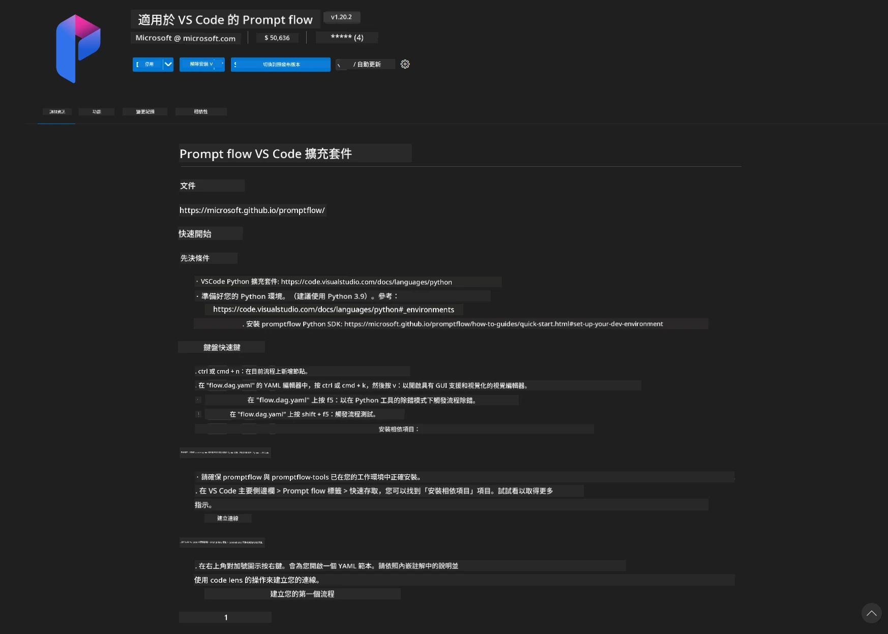
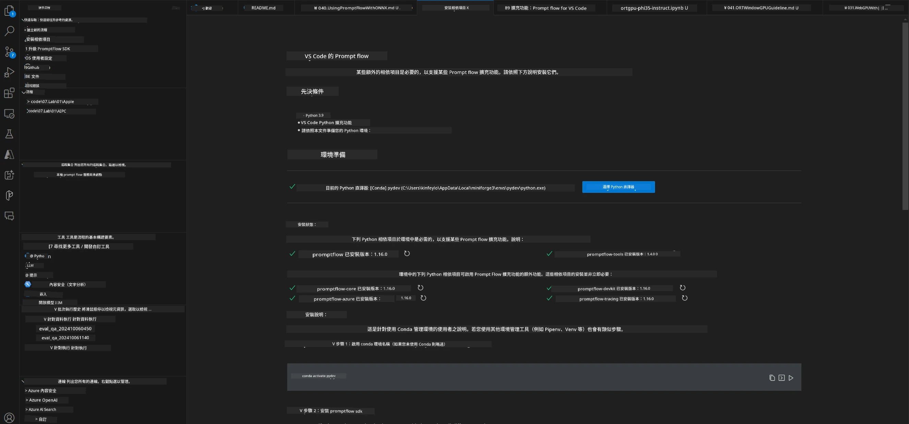
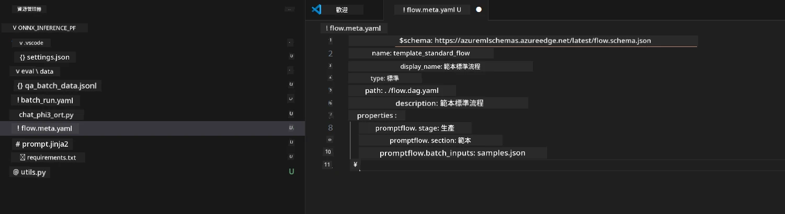
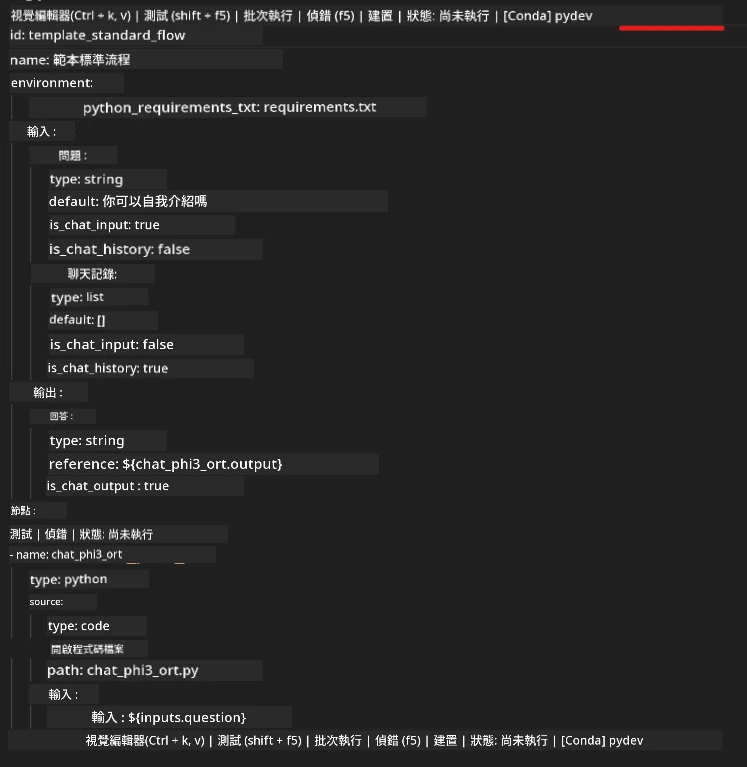
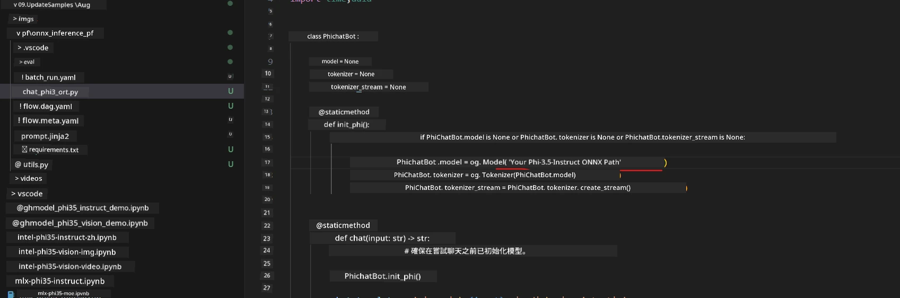
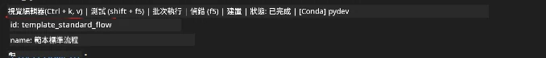
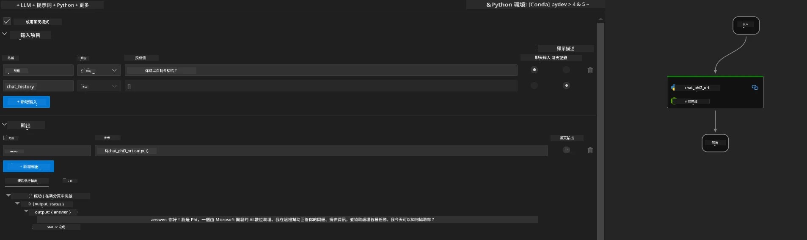
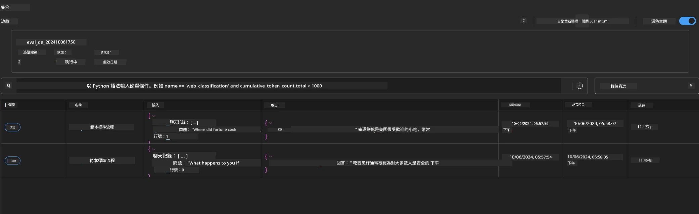

# 使用 Windows GPU 與 Phi-3.5-Instruct ONNX 建立 Prompt flow 解決方案

以下文件示範如何使用 PromptFlow 結合 ONNX（Open Neural Network Exchange）來開發基於 Phi-3 模型的 AI 應用程式。

PromptFlow 是一套開發工具，旨在簡化基於大型語言模型（LLM）的 AI 應用程式從構思、原型製作到測試與評估的端到端開發週期。

透過結合 PromptFlow 與 ONNX，開發人員可以：

- 優化模型效能：利用 ONNX 進行高效的模型推論和部署。
- 簡化開發流程：使用 PromptFlow 管理工作流程並自動化重複性任務。
- 強化團隊協作：提供統一的開發環境以促進團隊成員間更好的協作。

**Prompt flow** 是一套開發工具，旨在簡化基於大型語言模型的 AI 應用程式的端到端開發週期，包含構思、原型製作、測試、評估到生產部署及監控。它使提示工程變得更簡單，並幫助您打造具生產品質的 LLM 應用。

Prompt flow 可以連接 OpenAI、Azure OpenAI 服務及可自訂模型（Huggingface、在地 LLM/SLM）。我們希望將 Phi-3.5 的量化 ONNX 模型部署到在地應用中。Prompt flow 能協助我們更好地規劃業務並完成基於 Phi-3.5 的本地化解決方案。本範例將結合 ONNX Runtime GenAI Library 以完成基於 Windows GPU 的 Prompt flow 解決方案。

## <strong>安裝</strong>

### **Windows GPU 專用 ONNX Runtime GenAI**

請閱讀此指南以設定 Windows GPU 的 ONNX Runtime GenAI  [點此](./ORTWindowGPUGuideline.md)

### **在 VSCode 中設定 Prompt flow**

1. 安裝 Prompt flow VS Code 擴充套件



2. 安裝完成 Prompt flow VS Code 擴充套件後，點選該擴充套件，並選擇 <strong>安裝相依項</strong>，依照此指南在您的環境中安裝 Prompt flow SDK



3. 下載 [範例程式碼](../../../../../../code/09.UpdateSamples/Aug/pf/onnx_inference_pf) 並使用 VS Code 開啟該範例



4. 開啟 **flow.dag.yaml** 並選擇您的 Python 環境



   開啟 **chat_phi3_ort.py** 修改您的 Phi-3.5-instruct ONNX 模型路徑



5. 執行您的 prompt flow 進行測試

開啟 **flow.dag.yaml** 並點選視覺化編輯器



點選後執行以進行測試



1. 您也可以在終端機批次執行以檢視更多結果


```bash

pf run create --file batch_run.yaml --stream --name 'Your eval qa name'    

```

您可以在預設瀏覽器中查看結果




---

<!-- CO-OP TRANSLATOR DISCLAIMER START -->
**免責聲明**：
此文件已使用 AI 翻譯服務 [Co-op Translator](https://github.com/Azure/co-op-translator) 進行翻譯。雖然我們努力追求準確性，但請注意自動翻譯可能包含錯誤或不準確之處。原始文件的母語版本應視為權威來源。對於關鍵資訊，建議採用專業人工翻譯。我們不對因使用此翻譯所產生的任何誤解或誤譯承擔責任。
<!-- CO-OP TRANSLATOR DISCLAIMER END -->