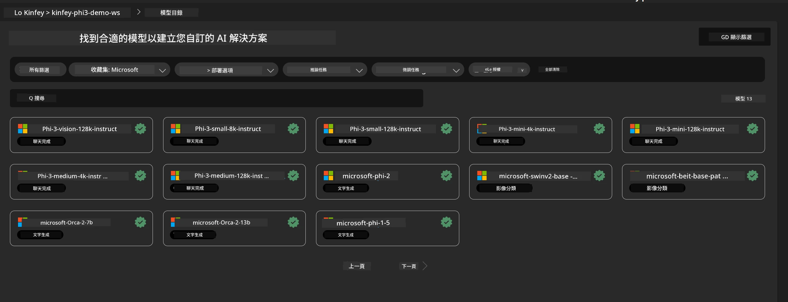
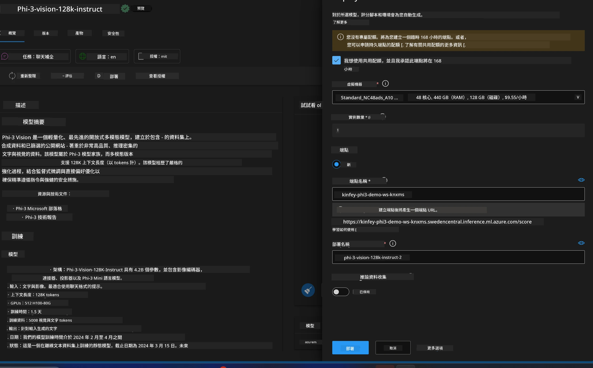

# **實驗室 3 - 在 Azure Machine Learning Service 上部署 Phi-3-vision**

我們使用 NPU 完成本地代碼的生產部署，接著想透過它引入 PHI-3-VISION 的能力，實現從圖片生成代碼。

在本介紹中，我們可以快速在 Azure Machine Learning Service 中建立一個 Model As Service Phi-3 Vision 服務。

***Note***：Phi-3 Vision 需要較強的運算能力以加快內容生成速度，因此我們需要雲端運算資源來協助達成。

### **1. 建立 Azure Machine Learning Service**

我們需要在 Azure 入口網站中建立 Azure Machine Learning Service。如果想了解如何操作，請參考此連結 [https://learn.microsoft.com/azure/machine-learning/quickstart-create-resources?view=azureml-api-2](https://learn.microsoft.com/azure/machine-learning/quickstart-create-resources?view=azureml-api-2)

### **2. 在 Azure Machine Learning Service 中選擇 Phi-3 Vision**



### **3. 在 Azure 上部署 Phi-3-Vision**



### **4. 在 Postman 測試端點**


***Note***

1. 傳送的參數必須包含 Authorization、azureml-model-deployment 以及 Content-Type，請確認部署資訊以取得這些參數。

2. 傳送參數時，Phi-3-Vision 需要傳送圖片連結。請參考 GPT-4-Vision 的參數傳送方式，例如

```json

{
  "input_data":{
    "input_string":[
      {
        "role":"user",
        "content":[ 
          {
            "type": "text",
            "text": "You are a Python coding assistant.Please create Python code for image "
          },
          {
              "type": "image_url",
              "image_url": {
                "url": "https://ajaytech.co/wp-content/uploads/2019/09/index.png"
              }
          }
        ]
      }
    ],
    "parameters":{
          "temperature": 0.6,
          "top_p": 0.9,
          "do_sample": false,
          "max_new_tokens": 2048
    }
  }
}

```

3. 使用 Post 方法呼叫 **/score**

**恭喜**！你已完成快速部署 PHI-3-VISION，並嘗試如何用圖片生成代碼。接下來，我們可以結合 NPU 與雲端來構建應用程式。

**免責聲明**：  
本文件係使用 AI 翻譯服務 [Co-op Translator](https://github.com/Azure/co-op-translator) 進行翻譯。雖然我們致力於確保翻譯的準確性，但請注意，自動翻譯可能包含錯誤或不準確之處。原始文件的母語版本應視為權威來源。對於重要資訊，建議採用專業人工翻譯。我們不對因使用本翻譯而產生的任何誤解或誤釋負責。