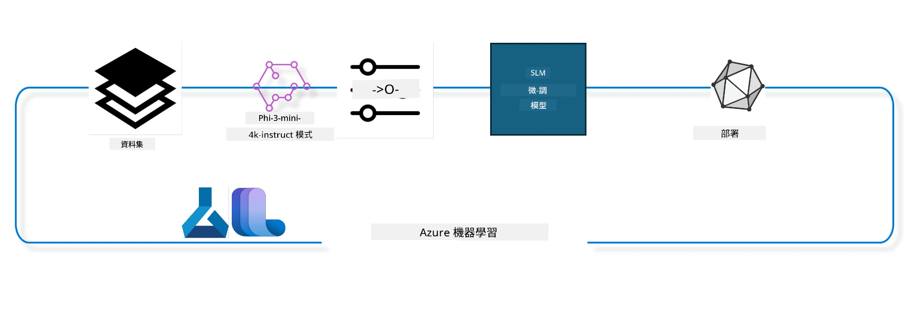

## 如何使用 Azure ML 系統登錄中的 chat-completion 組件進行微調模型

在此範例中，我們將進行 Phi-3-mini-4k-instruct 模型的微調，以完成兩人之間的對話，使用 ultrachat_200k 資料集。



此範例將展示如何使用 Azure ML SDK 和 Python 進行微調，然後將微調後的模型部署到線上端點以進行即時推論。

### 訓練資料

我們將使用 ultrachat_200k 資料集。這是 UltraChat 資料集經過嚴格過濾的版本，並用於訓練 Zephyr-7B-β，這是尖端的 7b 聊天模型。

### 模型

我們將使用 Phi-3-mini-4k-instruct 模型來展示如何為聊天完成任務微調模型。如果您是從特定模型卡打開此筆記本，請記得替換特定模型名稱。

### 任務

- 選擇一個要微調的模型。
- 選擇並探索訓練資料。
- 配置微調工作。
- 運行微調工作。
- 檢視訓練和評估指標。
- 註冊微調後的模型。
- 部署微調後的模型以進行即時推論。
- 清理資源。

## 1. 設定先決條件

- 安裝套件依賴
- 連接到 AzureML 工作區。詳細請參閱設置 SDK 認證。請將下方的 <WORKSPACE_NAME>、<RESOURCE_GROUP> 及 <SUBSCRIPTION_ID> 替換為您的資訊。
- 連接到 azureml 系統登錄
- 設定可選的實驗名稱
- 檢查或建立計算資源。

> [!NOTE]
> 需求是單一 GPU 節點可有多張 GPU 卡。例如，在一個 Standard_NC24rs_v3 節點中，有 4 張 NVIDIA V100 GPU，Standard_NC12s_v3 則有 2 張 NVIDIA V100 GPU。更多資訊請參閱官方文件。每節點 GPU 卡的數量由下面的參數 gpus_per_node 設定。正確設定此值可確保節點內所有 GPU 的利用率。推薦 GPU 計算 SKU 可參考此處和此處。

### Python 套件

請執行以下程式碼以安裝依賴套件。如果是在新環境中執行，此步驟不可跳過。

```bash
pip install azure-ai-ml
pip install azure-identity
pip install datasets==2.9.0
pip install mlflow
pip install azureml-mlflow
```

### 與 Azure ML 互動

1. 此 Python 腳本用於與 Azure 機器學習（Azure ML）服務互動。簡述如下：

    - 載入 azure.ai.ml、azure.identity 與 azure.ai.ml.entities 套件所需模組，並載入 time 模組。

    - 嘗試使用 DefaultAzureCredential() 進行身份驗證，這提供簡化的認證體驗讓您快速開始開發於 Azure 雲端部署的應用程式。若此方法失敗，則使用 InteractiveBrowserCredential() 進行互動式登入。

    - 嘗試透過 from_config 方法創建 MLClient 實例，從預設設定檔(config.json)讀取設定。若失敗，則手動提供 subscription_id、resource_group_name 與 workspace_name 建立 MLClient。

    - 創建另一個 MLClient 實例，用於名為 "azureml" 的 Azure ML 系統註冊表，此系統註冊表中存放模型、微調管線與環境。

    - 設定實驗名稱為 "chat_completion_Phi-3-mini-4k-instruct"。

    - 產生唯一時間戳記，將當前時間（自 Epoch 起的秒數，浮點數）轉成整數，然後再轉成字串。此時間戳記可用於創建唯一名稱與版本。

    ```python
    # 從 Azure ML 和 Azure Identity 匯入必要的模組
    from azure.ai.ml import MLClient
    from azure.identity import (
        DefaultAzureCredential,
        InteractiveBrowserCredential,
    )
    from azure.ai.ml.entities import AmlCompute
    import time  # 匯入 time 模組
    
    # 嘗試使用 DefaultAzureCredential 進行認證
    try:
        credential = DefaultAzureCredential()
        credential.get_token("https://management.azure.com/.default")
    except Exception as ex:  # 如果 DefaultAzureCredential 失敗，改用 InteractiveBrowserCredential
        credential = InteractiveBrowserCredential()
    
    # 嘗試使用預設設定檔建立 MLClient 實例
    try:
        workspace_ml_client = MLClient.from_config(credential=credential)
    except:  # 如果失敗，手動提供詳細資訊建立 MLClient 實例
        workspace_ml_client = MLClient(
            credential,
            subscription_id="<SUBSCRIPTION_ID>",
            resource_group_name="<RESOURCE_GROUP>",
            workspace_name="<WORKSPACE_NAME>",
        )
    
    # 為名為 "azureml" 的 Azure ML 註冊中心建立另一個 MLClient 實例
    # 這個註冊中心是儲存模型、微調管線和環境的地方
    registry_ml_client = MLClient(credential, registry_name="azureml")
    
    # 設定實驗名稱
    experiment_name = "chat_completion_Phi-3-mini-4k-instruct"
    
    # 產生一個唯一的時間戳記，可用於需唯一的名稱和版本
    timestamp = str(int(time.time()))
    ```

## 2. 選擇基礎模型進行微調

1. Phi-3-mini-4k-instruct 是一個擁有 38 億參數、輕量且先進的開放模型，基於用於 Phi-2 的資料集建立。此模型屬於 Phi-3 系列，而 Mini 版本有兩種變體：4K 及 128K，分別代表可支援的上下文長度（以 token 計）。我們需要為特定用途微調此模型。您可以在 AzureML Studio 的模型目錄瀏覽這些模型，並過濾聊天完成任務。在此範例中，我們使用 Phi-3-mini-4k-instruct 模型。若您打開此筆記本時針對不同模型，請相應替換模型名稱與版本。

> [!NOTE]
> 模型的 model id 屬性將作為微調工作的輸入。此資訊亦可在 AzureML Studio 模型目錄的模型詳細資料頁面看到，作為「Asset ID」欄位。

2. 此 Python 腳本用於與 Azure 機器學習（Azure ML）服務互動。簡述如下：

    - 設定 model_name 為 "Phi-3-mini-4k-instruct"。

    - 透過 registry_ml_client 物件的 models 屬性使用 get 方法，從 Azure ML 系統註冊表取得指定名稱的最新版本模型。get 方法帶兩個參數：模型名稱與標籤「latest」以取得最新版本。

    - 在控制台輸出將用於微調的模型名稱、版本與 id。使用字串的 format 方法將模型的名稱、版本與 id 帶入訊息字串。這些屬性由 foundation_model 物件提供。

    ```python
    # 設定模型名稱
    model_name = "Phi-3-mini-4k-instruct"
    
    # 從 Azure ML 登錄中取得模型的最新版本
    foundation_model = registry_ml_client.models.get(model_name, label="latest")
    
    # 輸出模型名稱、版本和 ID
    # 這些資訊對於追蹤和除錯很有用
    print(
        "\n\nUsing model name: {0}, version: {1}, id: {2} for fine tuning".format(
            foundation_model.name, foundation_model.version, foundation_model.id
        )
    )
    ```

## 3. 建立用於工作的計算資源

微調作業只能使用 GPU 計算資源。計算資源大小依模型大小而異，且在多數情況下挑選適合的計算資源很具挑戰。本段將指導使用者選擇合適的計算資源。

> [!NOTE]
> 下方列出的計算資源皆以最優化配置執行。改變配置可能導致 Cuda 記憶體不足錯誤（Out Of Memory）。若發生此狀況，請嘗試升級至更大的計算資源。

> [!NOTE]
> 選擇 compute_cluster_size 時，請確認該計算資源在您的資源組中可用。若某計算資源無法使用，您可以申請存取該計算資源。

### 檢查模型對微調支援情況

1. 此 Python 腳本與 Azure ML 模型物件交互。簡述如下：

    - 匯入 ast 模組，該模組提供處理 Python 抽象語法樹的函數。

    - 檢查 foundation_model 物件（代表 Azure ML 中的模型）是否含有名為 finetune_compute_allow_list 的標籤。Azure ML 的標籤是可建立並用於篩選與排序模型的鍵值對。

    - 若存在 finetune_compute_allow_list 標籤，利用 ast.literal_eval 函數安全解析標籤值（字串）為 Python 清單，並指派給 computes_allow_list 變數，隨後輸出提示表示應從此清單中建立計算資源。

    - 若無此標籤，將 computes_allow_list 設為 None，並輸出提示表示該模型標籤中並無 finetune_compute_allow_list。

    - 總結：此腳本會檢查模型標籤中是否有指定的清單，若有則轉換為清單並提醒用戶。

    ```python
    # 匯入 ast 模組，該模組提供處理 Python 抽象語法語法樹的函數
    import ast
    
    # 檢查模型標籤中是否存在 'finetune_compute_allow_list' 標籤
    if "finetune_compute_allow_list" in foundation_model.tags:
        # 如果標籤存在，使用 ast.literal_eval 安全地將標籤值（字串）解析成 Python 列表
        computes_allow_list = ast.literal_eval(
            foundation_model.tags["finetune_compute_allow_list"]
        )  # 將字串轉換成 Python 列表
        # 印出一則訊息，表示應該從列表建立一個 compute
        print(f"Please create a compute from the above list - {computes_allow_list}")
    else:
        # 如果標籤不存在，將 computes_allow_list 設為 None
        computes_allow_list = None
        # 印出一則訊息，表示 'finetune_compute_allow_list' 標籤不在模型的標籤中
        print("`finetune_compute_allow_list` is not part of model tags")
    ```

### 檢查計算資源狀態

1. 此 Python 腳本用於與 Azure ML 服務互動，並對計算資源進行幾項檢查。簡述如下：

    - 嘗試從 Azure ML 工作區取得名稱為 compute_cluster 的計算資源。若該計算資源的配置狀態為「failed」，則拋出 ValueError。

    - 檢查 computes_allow_list 是否非 None。若非，則將清單中所有計算資源大小轉成小寫並比對當前計算資源大小是否存在於該清單。若不存在，拋出 ValueError。

    - 若 computes_allow_list 為 None，則檢查計算資源大小是否在不支援的 GPU VM 大小清單中。若是，則拋出 ValueError。

    - 取得工作區中所有可用的計算資源大小清單。針對每個清單條目，檢查其名稱是否與當前計算資源大小相符。相符時取得該計算資源的 GPU 數量，並將 gpu_count_found 設為 True。

    - 若 gpu_count_found 為真，輸出計算資源中的 GPU 數量。若為假，則拋出 ValueError。

    - 總結：此程式碼對 Azure ML 工作區中的計算資源執行多項檢查，包括配置狀態、大小是否允許、以及 GPU 數量檢查。

    ```python
    # 印出例外訊息
    print(e)
    # 若計算資源大小不在工作區中，擲回 ValueError
    raise ValueError(
        f"WARNING! Compute size {compute_cluster_size} not available in workspace"
    )
    
    # 從 Azure ML 工作區中取得計算實例
    compute = workspace_ml_client.compute.get(compute_cluster)
    # 檢查計算實例的佈建狀態是否為「失敗」
    if compute.provisioning_state.lower() == "failed":
        # 若佈建狀態為「失敗」，擲回 ValueError
        raise ValueError(
            f"Provisioning failed, Compute '{compute_cluster}' is in failed state. "
            f"please try creating a different compute"
        )
    
    # 檢查 computes_allow_list 是否不為 None
    if computes_allow_list is not None:
        # 將 computes_allow_list 中所有計算資源大小轉為小寫
        computes_allow_list_lower_case = [x.lower() for x in computes_allow_list]
        # 檢查計算實例的大小是否在 computes_allow_list_lower_case 中
        if compute.size.lower() not in computes_allow_list_lower_case:
            # 若計算實例的大小不在 computes_allow_list_lower_case 中，擲回 ValueError
            raise ValueError(
                f"VM size {compute.size} is not in the allow-listed computes for finetuning"
            )
    else:
        # 定義一個不支援 GPU 的 VM 大小清單
        unsupported_gpu_vm_list = [
            "standard_nc6",
            "standard_nc12",
            "standard_nc24",
            "standard_nc24r",
        ]
        # 檢查計算實例的大小是否在 unsupported_gpu_vm_list 中
        if compute.size.lower() in unsupported_gpu_vm_list:
            # 若計算實例的大小在 unsupported_gpu_vm_list 中，擲回 ValueError
            raise ValueError(
                f"VM size {compute.size} is currently not supported for finetuning"
            )
    
    # 初始化一個旗標以檢查是否找到計算實例的 GPU 數量
    gpu_count_found = False
    # 取得工作區中所有可用計算大小列表
    workspace_compute_sku_list = workspace_ml_client.compute.list_sizes()
    available_sku_sizes = []
    # 遍歷可用計算大小清單
    for compute_sku in workspace_compute_sku_list:
        available_sku_sizes.append(compute_sku.name)
        # 檢查計算大小名稱是否與計算實例的大小匹配
        if compute_sku.name.lower() == compute.size.lower():
            # 若匹配，取得該計算大小的 GPU 數量並將 gpu_count_found 設為 True
            gpus_per_node = compute_sku.gpus
            gpu_count_found = True
    # 若 gpu_count_found 為 True，印出計算實例的 GPU 數量
    if gpu_count_found:
        print(f"Number of GPU's in compute {compute.size}: {gpus_per_node}")
    else:
        # 若 gpu_count_found 為 False，擲回 ValueError
        raise ValueError(
            f"Number of GPU's in compute {compute.size} not found. Available skus are: {available_sku_sizes}."
            f"This should not happen. Please check the selected compute cluster: {compute_cluster} and try again."
        )
    ```

## 4. 選擇用於模型微調的資料集

1. 我們將使用 ultrachat_200k 資料集。該資料集有四個分割，適用於監督式微調（Supervised fine-tuning，簡稱 sft）與生成排序（generation ranking, gen）。各分割的樣本數如下：

    ```bash
    train_sft test_sft  train_gen  test_gen
    207865  23110  256032  28304
    ```

1. 接下來的數個程式碼區塊示範微調的基本資料準備：

### 視覺化部分資料列

為使本範例能快速執行，我們將 train_sft、test_sft 資料集保存為原資料的 5% 範圍，這表示微調模型精度會較低，故不適於實務應用。
download-dataset.py 用來下載 ultrachat_200k 資料集，並轉換成微調管線元件可用格式。因為資料集很大，這裡僅使用部分資料。

1. 執行下方腳本只會下載 5% 資料。此數量可透過修改參數 dataset_split_pc 為所需百分比來調整。

> [!NOTE]
> 部分語言模型有不同語言代碼，因此資料集的欄位名稱也應相對應。

1. 以下為資料格式範例：
聊天完成資料集以 parquet 格式儲存，每筆資料依下列結構：

    - 這是一個 JSON（JavaScript 物件表示法）文件，是常用的資料交換格式。不是執行程式碼，而是一種資料儲存與傳輸方式。結構說明如下：

    - "prompt": 此鍵對應字串，代表 AI 助手收到的任務或問題。

    - "messages": 此鍵對應一陣列，內含多個物件，每個物件代表使用者與 AI 助手之間的對話訊息。每個訊息物件有兩個鍵：

    - "content": 訊息內容字串。
    - "role": 傳送訊息者的角色字串，可能是 "user" 或 "assistant"。
    - "prompt_id": 代表該 prompt 唯一識別碼的字串。

1. 此 JSON 範例呈現一段對話，使用者請 AI 助手建立反烏托邦故事的主角；助手回應後，使用者請求更詳細內容；助手同意提供。整段對話關聯指定的 prompt_id。

    ```python
    {
        // The task or question posed to an AI assistant
        "prompt": "Create a fully-developed protagonist who is challenged to survive within a dystopian society under the rule of a tyrant. ...",
        
        // An array of objects, each representing a message in a conversation between a user and an AI assistant
        "messages":[
            {
                // The content of the user's message
                "content": "Create a fully-developed protagonist who is challenged to survive within a dystopian society under the rule of a tyrant. ...",
                // The role of the entity that sent the message
                "role": "user"
            },
            {
                // The content of the assistant's message
                "content": "Name: Ava\n\n Ava was just 16 years old when the world as she knew it came crashing down. The government had collapsed, leaving behind a chaotic and lawless society. ...",
                // The role of the entity that sent the message
                "role": "assistant"
            },
            {
                // The content of the user's message
                "content": "Wow, Ava's story is so intense and inspiring! Can you provide me with more details.  ...",
                // The role of the entity that sent the message
                "role": "user"
            }, 
            {
                // The content of the assistant's message
                "content": "Certainly! ....",
                // The role of the entity that sent the message
                "role": "assistant"
            }
        ],
        
        // A unique identifier for the prompt
        "prompt_id": "d938b65dfe31f05f80eb8572964c6673eddbd68eff3db6bd234d7f1e3b86c2af"
    }
    ```

### 下載資料集

1. 此 Python 腳本使用輔助腳本 download-dataset.py 下載資料集。簡述如下：

    - 匯入 os 模組，提供跨平台的作業系統功能。

    - 利用 os.system 函式執行 shell 指令，呼叫 download-dataset.py 下載 HuggingFaceH4/ultrachat_200k 資料集到資料夾 ultrachat_200k_dataset，並且將資料切割為 5% 。os.system 回傳執行結果狀態碼，並存入 exit_status。

    - 若 exit_status 非 0（代表命令執行失敗），程式會拋出 Exception，提醒下載資料集時出錯。

    - 總結：此腳本透過輔助指令下載資料集，執行失敗則例外通知。

    ```python
    # 匯入 os 模組，該模組提供使用作業系統相關功能的方法
    import os
    
    # 使用 os.system 函數在 shell 中執行 download-dataset.py 腳本並帶入特定的命令列參數
    # 參數指定要下載的資料集（HuggingFaceH4/ultrachat_200k）、下載的目錄（ultrachat_200k_dataset），以及資料集的切分百分比（5）
    # os.system 函數會回傳所執行指令的退出狀態；該狀態會存到 exit_status 變數
    exit_status = os.system(
        "python ./download-dataset.py --dataset HuggingFaceH4/ultrachat_200k --download_dir ultrachat_200k_dataset --dataset_split_pc 5"
    )
    
    # 檢查 exit_status 是否不等於 0
    # 在類 Unix 作業系統中，退出狀態為 0 通常表示指令執行成功，其他數字表示發生錯誤
    # 如果 exit_status 不為 0，則丟出 Exception 並附上下載資料集時發生錯誤的訊息
    if exit_status != 0:
        raise Exception("Error downloading dataset")
    ```

### 載入資料至 DataFrame

1. 此 Python 腳本將 JSON Lines 檔案載入 pandas DataFrame，並顯示前 5 列。簡述如下：

    - 載入 pandas 套件，強大的資料操作與分析庫。

    - 設置 pandas 的最大欄寬顯示為 0，意思是當列印 DataFrame 時，欄位會完整顯示不被截斷。
    - 它使用 pd.read_json 函數從 ultrachat_200k_dataset 目錄加載 train_sft.jsonl 文件到 DataFrame 中。lines=True 參數表示該文件是 JSON Lines 格式，每行是一個獨立的 JSON 對象。

    - 它使用 head 方法顯示 DataFrame 的前 5 行。如果 DataFrame 少於 5 行，則會顯示全部。

    - 總結來說，該腳本將 JSON Lines 文件加載到 DataFrame，並顯示前 5 行完整欄位文本。
    
    ```python
    # 匯入 pandas 函式庫，這是一個強大的資料操作與分析函式庫
    import pandas as pd
    
    # 設定 pandas 顯示選項中的最大欄寬為 0
    # 這表示在印出 DataFrame 時，每個欄位的完整文字將會顯示，且不會被截斷
    pd.set_option("display.max_colwidth", 0)
    
    # 使用 pd.read_json 函式從 ultrachat_200k_dataset 目錄中載入 train_sft.jsonl 檔案至 DataFrame
    # lines=True 參數表示檔案為 JSON Lines 格式，每一行都是獨立的 JSON 物件
    df = pd.read_json("./ultrachat_200k_dataset/train_sft.jsonl", lines=True)
    
    # 使用 head 方法顯示 DataFrame 的前 5 筆資料
    # 如果 DataFrame 中的列數少於 5 筆，則會顯示全部資料
    df.head()
    ```

## 5. 使用模型和數據作為輸入提交微調作業

創建使用 chat-completion 管道組件的作業。了解所有支持微調的參數。

### 定義微調參數

1. 微調參數可分為兩類－訓練參數和優化參數。

1. 訓練參數定義了訓練的各方面，例如：

    - 使用的優化器、排程器
    - 微調優化的指標
    - 訓練步數、批次大小等等
    - 優化參數有助於優化 GPU 記憶體並有效使用計算資源。

1. 以下是屬於此類的一些參數。優化參數因模型而異，並隨模型打包以處理這些差異。

    - 啟用 deepspeed 和 LoRA
    - 啟用混合精度訓練
    - 啟用多節點訓練

> [!NOTE]
> 監督式微調可能導致對齊喪失或災難性遺忘。建議檢查此問題並在微調後運行對齊階段。

### 微調參數

1. 這段 Python 腳本正在設置機器學習模型微調的參數。詳細說明如下：

    - 它設置了預設訓練參數，如訓練周期數、訓練與驗證批次大小、學習率和學習率排程器類型。

    - 它設置了預設優化參數，如是否應用 Layer-wise Relevance Propagation (LoRa) 和 DeepSpeed，及 DeepSpeed 階段。

    - 它將訓練和優化參數合併成一個名為 finetune_parameters 的字典。

    - 它檢查 foundation_model 是否有任何模型特定的預設參數。如果有，則打印警告訊息並用 ast.literal_eval 函數將模型特定預設從字串轉為 Python 字典，再更新 finetune_parameters 字典。

    - 它打印最終用於本次運行的微調參數集合。

    - 總結來說，該腳本設置並顯示微調機器學習模型所用參數，並可用模型特定參數覆蓋預設參數。

    ```python
    # 設定預設的訓練參數，如訓練週期數、訓練與評估的批次大小、學習率及學習率調度器類型
    training_parameters = dict(
        num_train_epochs=3,
        per_device_train_batch_size=1,
        per_device_eval_batch_size=1,
        learning_rate=5e-6,
        lr_scheduler_type="cosine",
    )
    
    # 設定預設的優化參數，如是否應用分層相關性傳遞（LoRa）和 DeepSpeed，以及 DeepSpeed 階段
    optimization_parameters = dict(
        apply_lora="true",
        apply_deepspeed="true",
        deepspeed_stage=2,
    )
    
    # 將訓練與優化參數合併成一個叫做 finetune_parameters 的字典
    finetune_parameters = {**training_parameters, **optimization_parameters}
    
    # 檢查 foundation_model 是否有任何模型特定的預設參數
    # 若有，列印警告訊息並更新 finetune_parameters 字典以包含這些模型特定的預設值
    # ast.literal_eval 函數用於將模型特定的預設值從字串轉換成 Python 字典
    if "model_specific_defaults" in foundation_model.tags:
        print("Warning! Model specific defaults exist. The defaults could be overridden.")
        finetune_parameters.update(
            ast.literal_eval(  # 將字串轉換為 Python 字典
                foundation_model.tags["model_specific_defaults"]
            )
        )
    
    # 列印將用於此次執行的最終微調參數集
    print(
        f"The following finetune parameters are going to be set for the run: {finetune_parameters}"
    )
    ```

### 訓練管線

1. 這段 Python 腳本定義一個函數生成機器學習訓練管線的顯示名稱，然後調用該函數生成並打印該名稱。詳細說明如下：

1. 定義 get_pipeline_display_name 函數。該函數依據與訓練管線相關的多個參數生成顯示名稱。

1. 函數內計算總批次大小，方法是將每設備批次大小、梯度累積步數、每節點 GPU 數量，及微調節點數相乘。

1. 取得其他參數，如學習率排程器類型、是否使用 DeepSpeed、DeepSpeed 階段、是否使用 Layer-wise Relevance Propagation （LoRa）、保留模型檢查點數量上限及最大序列長度。

1. 組合包含所有這些參數的字串，使用連字符分隔。如果有使用 DeepSpeed 或 LoRa，字串中分別包含 "ds" 加上 DeepSpeed 階段，或 "lora" 字樣；否則分別包含 "nods" 或 "nolora"。

1. 函數返回此字串，作為訓練管線的顯示名稱。

1. 定義函數後調用它來生成顯示名稱，並打印該名稱。

1. 總結來說，該腳本根據多個參數產生機器學習訓練管線的顯示名稱，然後打印該名稱。

    ```python
    # 定義一個函數以生成訓練流程的顯示名稱
    def get_pipeline_display_name():
        # 通過將每個裝置的批次大小、梯度累積步驟數、每節點GPU數量及用於微調的節點數相乘來計算總批次大小
        batch_size = (
            int(finetune_parameters.get("per_device_train_batch_size", 1))
            * int(finetune_parameters.get("gradient_accumulation_steps", 1))
            * int(gpus_per_node)
            * int(finetune_parameters.get("num_nodes_finetune", 1))
        )
        # 取得學習率調度器類型
        scheduler = finetune_parameters.get("lr_scheduler_type", "linear")
        # 取得是否使用DeepSpeed
        deepspeed = finetune_parameters.get("apply_deepspeed", "false")
        # 取得DeepSpeed階段
        ds_stage = finetune_parameters.get("deepspeed_stage", "2")
        # 如果使用DeepSpeed，則在顯示名稱中包含「ds」後接DeepSpeed階段；如果未使用，則包含「nods」
        if deepspeed == "true":
            ds_string = f"ds{ds_stage}"
        else:
            ds_string = "nods"
        # 取得是否使用分層相關性傳播（LoRa）
        lora = finetune_parameters.get("apply_lora", "false")
        # 如果使用LoRa，則在顯示名稱中包含「lora」；如果未使用，則包含「nolora」
        if lora == "true":
            lora_string = "lora"
        else:
            lora_string = "nolora"
        # 取得要保留的模型檢查點數量限制
        save_limit = finetune_parameters.get("save_total_limit", -1)
        # 取得最大序列長度
        seq_len = finetune_parameters.get("max_seq_length", -1)
        # 通過連接所有這些參數並以連字號分隔來構建顯示名稱
        return (
            model_name
            + "-"
            + "ultrachat"
            + "-"
            + f"bs{batch_size}"
            + "-"
            + f"{scheduler}"
            + "-"
            + ds_string
            + "-"
            + lora_string
            + f"-save_limit{save_limit}"
            + f"-seqlen{seq_len}"
        )
    
    # 呼叫函數生成顯示名稱
    pipeline_display_name = get_pipeline_display_name()
    # 印出顯示名稱
    print(f"Display name used for the run: {pipeline_display_name}")
    ```

### 配置管線

這段 Python 腳本使用 Azure Machine Learning SDK 定義並配置機器學習管線。詳細說明如下：

1. 從 Azure AI ML SDK 匯入必要模組。

1. 從註冊表中獲取名為 "chat_completion_pipeline" 的管線組件。

1. 使用 `@pipeline` 裝飾器和函數 `create_pipeline` 定義管線作業。管線名稱設為 `pipeline_display_name`。

1. 在 `create_pipeline` 函數內，用各種參數初始化取得的管線組件，包含模型路徑、不同階段的計算叢集、訓練與測試的數據集切分、微調使用的 GPU 數量，以及其他微調參數。

1. 將微調作業的輸出映射到管線作業的輸出，以便輕鬆註冊微調後的模型，這是將模型部署到線上或批次端點所需。

1. 呼叫 `create_pipeline` 函數建立管線實例。

1. 設定管線的 `force_rerun` 為 `True`，表示不使用先前作業的快取結果。

1. 設定管線的 `continue_on_step_failure` 為 `False`，表示若任何步驟失敗則停止管線。

1. 總結來說，該腳本使用 Azure Machine Learning SDK 定義並配置用於聊天完成任務的機器學習管線。

    ```python
    # 從 Azure AI ML SDK 匯入必要的模組
    from azure.ai.ml.dsl import pipeline
    from azure.ai.ml import Input
    
    # 從註冊表中取得名為 "chat_completion_pipeline" 的管線元件
    pipeline_component_func = registry_ml_client.components.get(
        name="chat_completion_pipeline", label="latest"
    )
    
    # 使用 @pipeline 裝飾器及 create_pipeline 函數定義管線作業
    # 管線的名稱設為 pipeline_display_name
    @pipeline(name=pipeline_display_name)
    def create_pipeline():
        # 使用各種參數初始化取得的管線元件
        # 包含模型路徑、不同階段的計算叢集、訓練和測試的資料集切割、用於微調的 GPU 數量及其他微調參數
        chat_completion_pipeline = pipeline_component_func(
            mlflow_model_path=foundation_model.id,
            compute_model_import=compute_cluster,
            compute_preprocess=compute_cluster,
            compute_finetune=compute_cluster,
            compute_model_evaluation=compute_cluster,
            # 將資料集切割映射到參數
            train_file_path=Input(
                type="uri_file", path="./ultrachat_200k_dataset/train_sft.jsonl"
            ),
            test_file_path=Input(
                type="uri_file", path="./ultrachat_200k_dataset/test_sft.jsonl"
            ),
            # 訓練設定
            number_of_gpu_to_use_finetuning=gpus_per_node,  # 設定為計算資源中可用的 GPU 數量
            **finetune_parameters
        )
        return {
            # 將微調作業的輸出映射到管線作業的輸出
            # 這樣做是為了方便我們登錄微調後的模型
            # 登錄模型是將模型部署到線上或批次端點所必需的
            "trained_model": chat_completion_pipeline.outputs.mlflow_model_folder
        }
    
    # 呼叫 create_pipeline 函數建立管線實例
    pipeline_object = create_pipeline()
    
    # 不使用先前作業的快取結果
    pipeline_object.settings.force_rerun = True
    
    # 將步驟失敗時是否繼續設定為 False
    # 這表示若有任何步驟失敗，管線將停止
    pipeline_object.settings.continue_on_step_failure = False
    ```

### 提交作業

1. 這段 Python 腳本向 Azure Machine Learning 工作區提交機器學習管線作業，並等待作業完成。詳細說明如下：

    - 它呼叫 workspace_ml_client 中 jobs 物件的 create_or_update 方法提交管線作業。要運行的管線由 pipeline_object 指定，作業所屬實驗由 experiment_name 指定。

    - 然後呼叫 workspace_ml_client 中 jobs 物件的 stream 方法等待管線作業完成。要等待的作業由 pipeline_job 物件的 name 屬性指定。

    - 總結來說，該腳本向 Azure Machine Learning 工作區提交機器學習管線作業，並等待作業完成。

    ```python
    # 將管線作業提交到 Azure 機器學習工作區
    # 要運行的管線由 pipeline_object 指定
    # 運行作業的實驗由 experiment_name 指定
    pipeline_job = workspace_ml_client.jobs.create_or_update(
        pipeline_object, experiment_name=experiment_name
    )
    
    # 等待管線作業完成
    # 待等待的作業由 pipeline_job 物件的 name 屬性指定
    workspace_ml_client.jobs.stream(pipeline_job.name)
    ```

## 6. 將微調後模型註冊到工作區

我們將從微調作業的輸出註冊模型。這可追蹤微調模型與微調作業之間的沿襲關係。而微調作業則進一步追蹤基礎模型、數據與訓練代碼的沿襲。

### 註冊機器學習模型

1. 這段 Python 腳本註冊在 Azure Machine Learning 管線中訓練的機器學習模型。詳細說明如下：

    - 從 Azure AI ML SDK 匯入必要模組。

    - 呼叫 workspace_ml_client 中 jobs 物件的 get 方法並訪問其 outputs 屬性，以檢查管線作業是否有 trained_model 輸出。

    - 通過格式化管線作業名稱與輸出名稱（"trained_model"）建立模型路徑。

    - 定義微調模型名稱，方法是將原模型名稱後綴 "-ultrachat-200k" 並將斜線替換為連字符。

    - 創建 Model 物件準備註冊模型，包含模型路徑、模型類型（MLflow 模型）、模型名稱和版本以及描述。

    - 調用 workspace_ml_client 中 models 物件的 create_or_update 方法，使用 Model 物件完成模型註冊。

    - 打印已註冊的模型。

1. 總結來說，該腳本註冊了在 Azure Machine Learning 管線中訓練的機器學習模型。
    
    ```python
    # 從 Azure AI ML SDK 匯入必要的模組
    from azure.ai.ml.entities import Model
    from azure.ai.ml.constants import AssetTypes
    
    # 檢查管線作業中是否有 `trained_model` 輸出
    print("pipeline job outputs: ", workspace_ml_client.jobs.get(pipeline_job.name).outputs)
    
    # 透過格式化包含管線作業名稱和輸出名稱（"trained_model"）的字串來構造訓練模型的路徑
    model_path_from_job = "azureml://jobs/{0}/outputs/{1}".format(
        pipeline_job.name, "trained_model"
    )
    
    # 定義微調模型名稱，方法是將 "-ultrachat-200k" 附加到原始模型名稱並將所有斜線替換為連字號
    finetuned_model_name = model_name + "-ultrachat-200k"
    finetuned_model_name = finetuned_model_name.replace("/", "-")
    
    print("path to register model: ", model_path_from_job)
    
    # 透過建立具有各種參數的 Model 物件準備註冊模型
    # 這些參數包括模型路徑、模型類型（MLflow 模型）、模型名稱及版本，還有模型描述
    prepare_to_register_model = Model(
        path=model_path_from_job,
        type=AssetTypes.MLFLOW_MODEL,
        name=finetuned_model_name,
        version=timestamp,  # 使用時間戳記當作版本以避免版本衝突
        description=model_name + " fine tuned model for ultrachat 200k chat-completion",
    )
    
    print("prepare to register model: \n", prepare_to_register_model)
    
    # 透過在 workspace_ml_client 的 models 物件上呼叫 create_or_update 方法並傳入 Model 物件來註冊模型
    registered_model = workspace_ml_client.models.create_or_update(
        prepare_to_register_model
    )
    
    # 印出已註冊的模型
    print("registered model: \n", registered_model)
    ```

## 7. 將微調模型部署到線上端點

線上端點提供持久的 REST API，可用於集成需要使用模型的應用程序。

### 管理端點

1. 這段 Python 腳本在 Azure Machine Learning 中為已註冊模型建立管理的線上端點。詳細說明如下：

    - 從 Azure AI ML SDK 匯入必要模組。

    - 定義線上端點唯一名稱，方法是在字串 "ultrachat-completion-" 後追加時間戳。

    - 準備建立線上端點，通過創建 ManagedOnlineEndpoint 物件並設定名稱、描述和身份驗證模式 ("key")。

    - 呼叫 workspace_ml_client 的 begin_create_or_update 方法，並等待建立完成。

1. 總結來說，該腳本在 Azure Machine Learning 中為已註冊模型建立了管理的線上端點。

    ```python
    # 從 Azure AI ML SDK 匯入必要的模組
    from azure.ai.ml.entities import (
        ManagedOnlineEndpoint,
        ManagedOnlineDeployment,
        ProbeSettings,
        OnlineRequestSettings,
    )
    
    # 定義一個唯一的線上端點名稱，透過在字串 "ultrachat-completion-" 後附加時間戳
    online_endpoint_name = "ultrachat-completion-" + timestamp
    
    # 透過建立 ManagedOnlineEndpoint 物件並設定各種參數，準備建立線上端點
    # 這些參數包括端點名稱、端點描述和驗證模式（"key"）
    endpoint = ManagedOnlineEndpoint(
        name=online_endpoint_name,
        description="Online endpoint for "
        + registered_model.name
        + ", fine tuned model for ultrachat-200k-chat-completion",
        auth_mode="key",
    )
    
    # 呼叫 workspace_ml_client 的 begin_create_or_update 方法，並將 ManagedOnlineEndpoint 物件作為參數，以建立線上端點
    # 然後呼叫 wait 方法等待建立操作完成
    workspace_ml_client.begin_create_or_update(endpoint).wait()
    ```

> [!NOTE]
> 這裡可以找到支持部署的 SKU 清單 - [Managed online endpoints SKU list](https://learn.microsoft.com/azure/machine-learning/reference-managed-online-endpoints-vm-sku-list)

### 部署機器學習模型

1. 這段 Python 腳本將已註冊的機器學習模型部署到 Azure Machine Learning 中的管理線上端點。詳細說明如下：

    - 匯入 ast 模組，此模組提供處理 Python 抽象語法樹的函數。

    - 設定部署的實例類型為 "Standard_NC6s_v3"。

    - 檢查基礎模型是否有 inference_compute_allow_list 標籤。如果有，將該標籤字串轉為 Python 列表並指派給 inference_computes_allow_list；否則設為 None。

    - 檢查指定實例類型是否在允許清單中。若否，則打印訊息請使用者從允許清單中選擇。

    - 創建 ManagedOnlineDeployment 物件準備部署，包含部署名稱、端點名稱、模型 ID、實例類型與數量、生命探測設定和請求設定。

    - 呼叫 workspace_ml_client 的 begin_create_or_update 方法並等待部署完成。

    - 設定端點流量，將所有流量 (100%) 導入名為 "demo" 的部署。

    - 更新端點狀態，呼叫 workspace_ml_client 的 begin_create_or_update 並等待更新結果。

1. 總結來說，該腳本將已註冊模型部署到 Azure Machine Learning 的管理線上端點。

    ```python
    # 匯入 ast 模組，該模組提供處理 Python 抽象語法樹的函式
    import ast
    
    # 設定部署的執行個體類型
    instance_type = "Standard_NC6s_v3"
    
    # 檢查基礎模型中是否存在 `inference_compute_allow_list` 標籤
    if "inference_compute_allow_list" in foundation_model.tags:
        # 如果存在，將標籤值從字串轉換為 Python 清單並指派給 `inference_computes_allow_list`
        inference_computes_allow_list = ast.literal_eval(
            foundation_model.tags["inference_compute_allow_list"]
        )
        print(f"Please create a compute from the above list - {computes_allow_list}")
    else:
        # 如果不存在，將 `inference_computes_allow_list` 設定為 `None`
        inference_computes_allow_list = None
        print("`inference_compute_allow_list` is not part of model tags")
    
    # 檢查指定的執行個體類型是否在允許清單中
    if (
        inference_computes_allow_list is not None
        and instance_type not in inference_computes_allow_list
    ):
        print(
            f"`instance_type` is not in the allow listed compute. Please select a value from {inference_computes_allow_list}"
        )
    
    # 準備建立部署，透過建立包含各種參數的 `ManagedOnlineDeployment` 物件
    demo_deployment = ManagedOnlineDeployment(
        name="demo",
        endpoint_name=online_endpoint_name,
        model=registered_model.id,
        instance_type=instance_type,
        instance_count=1,
        liveness_probe=ProbeSettings(initial_delay=600),
        request_settings=OnlineRequestSettings(request_timeout_ms=90000),
    )
    
    # 呼叫 `workspace_ml_client` 的 `begin_create_or_update` 方法，並以 `ManagedOnlineDeployment` 物件作為參數來建立部署
    # 然後呼叫 `wait` 方法等待建立操作完成
    workspace_ml_client.online_deployments.begin_create_or_update(demo_deployment).wait()
    
    # 設定端點的流量，將百分之百流量導向 "demo" 部署
    endpoint.traffic = {"demo": 100}
    
    # 使用 `endpoint` 物件作為參數，呼叫 `workspace_ml_client` 的 `begin_create_or_update` 方法來更新端點
    # 然後呼叫 `result` 方法等待更新操作完成
    workspace_ml_client.begin_create_or_update(endpoint).result()
    ```

## 8. 用範例數據測試端點

我們將從測試數據集中獲取一些範例數據，提交到線上端點進行推理，然後顯示得分標籤與真實標籤。

### 讀取結果

1. 這段 Python 腳本將 JSON Lines 檔案讀入 pandas DataFrame，並隨機抽取樣本，最後重設索引。詳細說明如下：

    - 讀取檔案 ./ultrachat_200k_dataset/test_gen.jsonl 到 pandas DataFrame 中。使用 read_json 函數配合 lines=True 參數，因為檔案為 JSON Lines 格式，每行為獨立 JSON 對象。

    - 從 DataFrame 隨機抽取一筆資料。使用 sample 函數並指定 n=1 選取一筆隨機列。

    - 重設 DataFrame 索引。使用 reset_index 函數且 drop=True 參數丟棄舊索引，換成新整數索引。

    - 使用 head 函數顯示前 2 行資料。但因篩選後資料只有一行，實際只顯示該行。

1. 總結來說，該腳本將 JSON Lines 文件讀入 pandas DataFrame，抽取 1 筆隨機資料，重設索引，並顯示該筆資料。
    
    ```python
    # 載入 pandas 函式庫
    import pandas as pd
    
    # 將 JSON Lines 檔案 './ultrachat_200k_dataset/test_gen.jsonl' 讀取到 pandas DataFrame 中
    # 'lines=True' 參數表示檔案是 JSON Lines 格式，每行都是一個獨立的 JSON 物件
    test_df = pd.read_json("./ultrachat_200k_dataset/test_gen.jsonl", lines=True)
    
    # 從 DataFrame 中隨機抽取 1 筆資料
    # 'n=1' 參數指定要選擇的隨機列數
    test_df = test_df.sample(n=1)
    
    # 重設 DataFrame 的索引
    # 'drop=True' 參數表示要丟棄原本的索引，改為預設的整數索引
    # 'inplace=True' 參數表示在原地修改 DataFrame（不建立新物件）
    test_df.reset_index(drop=True, inplace=True)
    
    # 顯示 DataFrame 的前 2 列資料
    # 但由於抽樣後 DataFrame 只有一列，因此只會顯示那一列資料
    test_df.head(2)
    ```

### 建立 JSON 物件

1. 這段 Python 腳本建立帶有特定參數的 JSON 物件並保存到檔案。詳細說明如下：

    - 匯入 json 模組，該模組提供處理 JSON 資料的函數。
    - 它建立了一個名為 parameters 的字典，其中的鍵和值代表機器學習模型的參數。鍵包含 "temperature"、"top_p"、"do_sample" 和 "max_new_tokens"，對應的值分別是 0.6、0.9、True 和 200。

    - 它建立另一個字典 test_json，該字典有兩個鍵："input_data" 和 "params"。 "input_data" 的值是一個字典，包含鍵 "input_string" 和 "parameters"。 "input_string" 的值是一個清單，包含來自 test_df DataFrame 的第一則訊息。 "parameters" 的值是先前建立的 parameters 字典。 "params" 的值是一個空字典。

    - 它會打開一個名為 sample_score.json 的檔案
    
    ```python
    # 匯入 json 模組，提供操作 JSON 資料的函式
    import json
    
    # 建立一個字典 `parameters`，包含表示機器學習模型參數的鍵和值
    # 鍵為 "temperature"、"top_p"、"do_sample" 和 "max_new_tokens"，對應的值分別是 0.6、0.9、True 和 200
    parameters = {
        "temperature": 0.6,
        "top_p": 0.9,
        "do_sample": True,
        "max_new_tokens": 200,
    }
    
    # 建立另一個字典 `test_json`，包含兩個鍵："input_data" 和 "params"
    # "input_data" 的值是另一個字典，鍵為 "input_string" 和 "parameters"
    # "input_string" 的值是一個列表，包含 `test_df` DataFrame 中的第一則訊息
    # "parameters" 的值是先前建立的 `parameters` 字典
    # "params" 的值是一個空字典
    test_json = {
        "input_data": {
            "input_string": [test_df["messages"][0]],
            "parameters": parameters,
        },
        "params": {},
    }
    
    # 以寫入模式開啟位於 `./ultrachat_200k_dataset` 資料夾中的 `sample_score.json` 檔案
    with open("./ultrachat_200k_dataset/sample_score.json", "w") as f:
        # 使用 `json.dump` 函式將 `test_json` 字典寫入檔案，格式為 JSON
        json.dump(test_json, f)
    ```

### 呼叫端點

1. 這段 Python 腳本正在調用 Azure 機器學習中的線上端點來評分 JSON 檔案。下面是它的流程說明：

    - 它使用 workspace_ml_client 物件的 online_endpoints 屬性中的 invoke 方法。這個方法用來向線上端點發送請求並取得回應。

    - 它透過 endpoint_name 和 deployment_name 參數指定端點與部署的名稱。此範例中，端點名稱存於 online_endpoint_name 變數，部署名稱為 "demo"。

    - 它使用 request_file 參數指定要評分的 JSON 檔案路徑。這裡的檔案是 ./ultrachat_200k_dataset/sample_score.json。

    - 它將從端點取得的回應存入 response 變數。

    - 它列印原始的回應資料。

1. 總結來說，此腳本是在 Azure 機器學習中調用線上端點進行 JSON 檔案評分，並列印該回應。

    ```python
    # 呼叫 Azure 機器學習中的線上端點以評分 `sample_score.json` 檔案
    # 使用 `workspace_ml_client` 物件的 `online_endpoints` 屬性的 `invoke` 方法來傳送請求至線上端點並獲取回應
    # `endpoint_name` 參數指定端點名稱，該名稱存放於 `online_endpoint_name` 變數中
    # `deployment_name` 參數指定部署名稱，為 "demo"
    # `request_file` 參數指定用於評分的 JSON 檔案路徑，為 `./ultrachat_200k_dataset/sample_score.json`
    response = workspace_ml_client.online_endpoints.invoke(
        endpoint_name=online_endpoint_name,
        deployment_name="demo",
        request_file="./ultrachat_200k_dataset/sample_score.json",
    )
    
    # 印出來自端點的原始回應
    print("raw response: \n", response, "\n")
    ```

## 9. 刪除線上端點

1. 別忘了刪除線上端點，否則會持續產生該端點所使用資源的計費費用。這行 Python 程式碼會刪除 Azure 機器學習中的線上端點。下面是它的說明：

    - 它呼叫 workspace_ml_client 物件的 online_endpoints 屬性的 begin_delete 方法。這個方法用來開始刪除線上端點的操作。

    - 它利用 name 參數指定要刪除的端點名稱。此範例中，端點名稱存於 online_endpoint_name 變數。

    - 它呼叫 wait 方法等待刪除作業完成。這是一個阻塞操作，會阻止腳本執行直到刪除完成。

    - 總結來說，這行程式碼啟動 Azure 機器學習中線上端點的刪除作業，並等待這個操作完成。

    ```python
    # 刪除 Azure 機器學習中的線上端點
    # 使用 `workspace_ml_client` 物件的 `online_endpoints` 屬性中的 `begin_delete` 方法來開始刪除線上端點
    # `name` 參數指定要刪除的端點名稱，該名稱存儲在 `online_endpoint_name` 變數中
    # 呼叫 `wait` 方法以等待刪除操作完成。這是一個阻塞操作，意味著在刪除完成之前腳本將無法繼續執行
    workspace_ml_client.online_endpoints.begin_delete(name=online_endpoint_name).wait()
    ```

---

<!-- CO-OP TRANSLATOR DISCLAIMER START -->
**免責聲明**：  
本文件係使用 AI 翻譯服務 [Co-op Translator](https://github.com/Azure/co-op-translator) 所翻譯。雖然我們努力確保準確性，但自動翻譯可能包含錯誤或不準確之處。原始文件之母語版本應視為權威來源。對於重要資訊，建議採用專業人工翻譯。我們不對因使用本翻譯所產生之任何誤解或誤譯負責。
<!-- CO-OP TRANSLATOR DISCLAIMER END -->