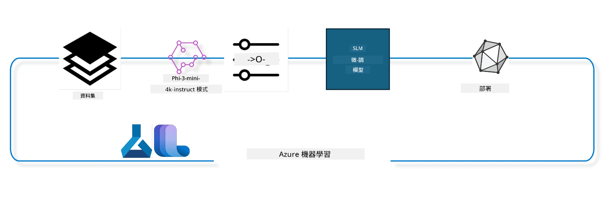

## 如何使用來自 Azure ML 系統註冊表的 chat-completion 組件來微調模型

在此範例中，我們將使用 ultrachat_200k 資料集對 Phi-3-mini-4k-instruct 模型進行微調，以完成兩人之間的對話。



此範例將示範如何使用 Azure ML SDK 和 Python 進行微調，然後將微調後的模型部署到線上端點以進行即時推論。

### 訓練資料

我們將使用 ultrachat_200k 資料集。這是 UltraChat 資料集經過大量篩選的版本，並被用於訓練 Zephyr-7B-β，一款最先進的 7b 聊天模型。

### 模型

我們將使用 Phi-3-mini-4k-instruct 模型示範如何進行 chat-completion 任務的模型微調。如果你從特定模型卡開啟此筆記本，記得將模型名稱替換成該特定模型。

### 任務

- 選擇一個模型進行微調。
- 選擇並探索訓練資料。
- 配置微調工作。
- 執行微調工作。
- 查看訓練和評估指標。
- 註冊微調後的模型。
- 部署微調後的模型以進行即時推論。
- 清理資源。

## 1. 設定前置條件

- 安裝相依套件
- 連接到 AzureML 工作區。詳細操作請參閱設置 SDK 驗證。請替換下方的 <WORKSPACE_NAME>、<RESOURCE_GROUP> 和 <SUBSCRIPTION_ID>。
- 連接到 azureml 系統註冊表
- 設定一個可選的實驗名稱
- 檢查或建立運算資源。

> [!NOTE]
> 需求為單一 GPU 節點可擁有多個 GPU 卡。例如，Standard_NC24rs_v3 的一個節點有 4 張 NVIDIA V100 GPU，而 Standard_NC12s_v3 則有 2 張 NVIDIA V100 GPU。細節請參閱文件。節點中 GPU 卡數量在下方參數 gpus_per_node 中設定。正確設定此值可確保所有 GPU 被利用。建議的 GPU 運算 SKU 可在這裡和這裡找到。

### Python 函式庫

透過執行下方區塊安裝相依套件。若在新的環境中執行，這步驟不可省略。

```bash
pip install azure-ai-ml
pip install azure-identity
pip install datasets==2.9.0
pip install mlflow
pip install azureml-mlflow
```

### 與 Azure ML 互動

1. 此 Python 腳本用於與 Azure 機器學習 (Azure ML) 服務互動。以下是其說明：

    - 匯入 azure.ai.ml、azure.identity 和 azure.ai.ml.entities 套件中的必要模組，並匯入 time 模組。

    - 嘗試使用 DefaultAzureCredential() 驗證，該方法提供簡化的驗證體驗以快速開始開發並於 Azure 雲端執行。如果失敗，則退回使用 InteractiveBrowserCredential()，此方法提供互動式登入提示。

    - 接著嘗試使用 from_config 方法建立 MLClient 實例，從預設設定檔(config.json)讀取設定。若失敗，則手動提供 subscription_id、resource_group_name 和 workspace_name 以建立 MLClient 實例。

    - 建立另一個 MLClient 實例，針對名為 "azureml" 的 Azure ML 註冊表。該註冊表用於存放模型、微調流程與環境。

    - 設定 experiment_name 為 "chat_completion_Phi-3-mini-4k-instruct"。

    - 利用將當前時間（自 Epoch 起的秒數，浮點數）轉為整數後再轉為字串，產生唯一時間戳記。此時間戳記可用於建立唯一的名稱和版本。

    ```python
    # 從 Azure ML 與 Azure Identity 匯入必要的模組
    from azure.ai.ml import MLClient
    from azure.identity import (
        DefaultAzureCredential,
        InteractiveBrowserCredential,
    )
    from azure.ai.ml.entities import AmlCompute
    import time  # 匯入時間模組
    
    # 嘗試使用 DefaultAzureCredential 進行身份驗證
    try:
        credential = DefaultAzureCredential()
        credential.get_token("https://management.azure.com/.default")
    except Exception as ex:  # 如果 DefaultAzureCredential 失敗，使用 InteractiveBrowserCredential
        credential = InteractiveBrowserCredential()
    
    # 嘗試使用預設組態檔建立 MLClient 實例
    try:
        workspace_ml_client = MLClient.from_config(credential=credential)
    except:  # 如果失敗，手動提供詳細資訊建立 MLClient 實例
        workspace_ml_client = MLClient(
            credential,
            subscription_id="<SUBSCRIPTION_ID>",
            resource_group_name="<RESOURCE_GROUP>",
            workspace_name="<WORKSPACE_NAME>",
        )
    
    # 為名為 "azureml" 的 Azure ML 註冊表建立另一個 MLClient 實例
    # 該註冊表是模型、微調管線與環境的儲存處
    registry_ml_client = MLClient(credential, registry_name="azureml")
    
    # 設定實驗名稱
    experiment_name = "chat_completion_Phi-3-mini-4k-instruct"
    
    # 產生可用於需要唯一名稱與版本的唯一時間戳記
    timestamp = str(int(time.time()))
    ```

## 2. 選擇基礎模型進行微調

1. Phi-3-mini-4k-instruct 是一款擁有 3.8 億參數的輕量級前沿開源模型，建構於 Phi-2 使用的資料集之上。該模型屬於 Phi-3 模型家族，Mini 版本有兩種變體，分別為 4K 和 128K，代表其支援的上下文長度（以令牌數計）。我們需要針對特定用途微調該模型。你可以在 AzureML Studio 的模型目錄中瀏覽這些模型，並透過 chat-completion 任務進行篩選。在此範例中，我們使用 Phi-3-mini-4k-instruct 模型。如果你開啟此筆記本針對其他模型，請相應替換模型名稱與版本。

> [!NOTE]
> 這裡指的是模型的 id 屬性。此 id 將作為輸入傳遞給微調工作。它同時也可在 AzureML Studio 模型目錄中模型詳細資訊頁面的「Asset ID」欄位找到。

2. 這段 Python 腳本用於與 Azure 機器學習 (Azure ML) 服務互動。以下是功能說明：

    - 將 model_name 設為 "Phi-3-mini-4k-instruct"。

    - 使用 registry_ml_client 物件的 models 屬性的 get 方法從 Azure ML 註冊表中取得指定名稱模型的最新版本。get 方法帶兩個參數：模型名稱及表示取得最新版本的標籤。

    - 在主控台顯示訊息，指明將用於微調的模型名稱、版本與 id。字串格式化方式用以將模型的名稱、版本與 id 插入訊息中。模型的名稱、版本與 id 為 foundation_model 物件的屬性。

    ```python
    # 設定模型名稱
    model_name = "Phi-3-mini-4k-instruct"
    
    # 從 Azure ML 註冊表取得模型的最新版本
    foundation_model = registry_ml_client.models.get(model_name, label="latest")
    
    # 列印模型名稱、版本和 ID
    # 這些資訊有助於追蹤和除錯
    print(
        "\n\nUsing model name: {0}, version: {1}, id: {2} for fine tuning".format(
            foundation_model.name, foundation_model.version, foundation_model.id
        )
    )
    ```

## 3. 建立工作運算資源

微調工作只能使用 GPU 計算資源。運算資源大小視模型大小而定，通常判斷適合的運算資源較為繁複。在此區塊中，我們指引使用者選擇適合的運算資源。

> [!NOTE]
> 下列運算資源均為最佳化配置。任何配置更動都可能導致 Cuda 記憶體不足錯誤。若出現此類錯誤，嘗試升級至更大規模的運算資源。

> [!NOTE]
> 選擇下方 compute_cluster_size 時，請確認該運算資源在你的資源群組中可用。若某運算資源不可用，可申請取得運算資源的使用權。

### 檢測模型的微調支援

1. 此 Python 腳本用於與 Azure 機器學習 (Azure ML) 模型互動。說明如下：

    - 匯入 ast 模組，該模組提供用以處理 Python 抽象語法樹的功能。

    - 檢查 foundation_model 物件（代表 Azure ML 中模型）是否擁有名為 finetune_compute_allow_list 的標籤。Azure ML 中的標籤是可自行建立並用來篩選與排序模型的鍵值對。

    - 若有 finetune_compute_allow_list 標籤，使用 ast.literal_eval 函式將該標籤值（字串）安全地解析為 Python 清單，並指派給 computes_allow_list 變數。並印出訊息，表示應根據該清單建立運算資源。

    - 若無 finetune_compute_allow_list 標籤，則將 computes_allow_list 設為 None，並印出訊息表示該標籤不在模型標籤中。

    - 總結，此腳本檢查模型的特定標籤，若存在則將標籤值轉為清單，並依情況提供使用者相應回饋。

    ```python
    # 匯入 ast 模組，該模組提供處理 Python 抽象語法樹的函式
    import ast
    
    # 檢查模型標籤中是否存在 'finetune_compute_allow_list' 標籤
    if "finetune_compute_allow_list" in foundation_model.tags:
        # 如果標籤存在，使用 ast.literal_eval 安全地將標籤值（字串）解析為 Python 列表
        computes_allow_list = ast.literal_eval(
            foundation_model.tags["finetune_compute_allow_list"]
        )  # 將字串轉換為 Python 列表
        # 印出訊息，表示應該根據列表創建一個 compute
        print(f"Please create a compute from the above list - {computes_allow_list}")
    else:
        # 如果標籤不存在，將 computes_allow_list 設為 None
        computes_allow_list = None
        # 印出訊息，表示 'finetune_compute_allow_list' 標籤不在模型標籤中
        print("`finetune_compute_allow_list` is not part of model tags")
    ```

### 檢查運算實例

1. 此 Python 腳本用於與 Azure 機器學習 (Azure ML) 服務互動，並對運算實例進行多項檢查。說明如下：

    - 嘗試從 Azure ML 工作區取得名稱為 compute_cluster 的運算實例。若該運算實例的部署狀態為 "failed"，則引發 ValueError。

    - 檢查 computes_allow_list 是否不為 None。若不是，將該清單中所有運算大小轉為小寫，並檢查目前運算實例大小是否在清單中。若不在，則引發 ValueError。

    - 若 computes_allow_list 為 None，則檢查運算實例大小是否在不支援的 GPU VM 大小清單中，若是則引發 ValueError。

    - 取得工作區內所有可用運算大小清單，遍歷該清單，若名稱與目前實例大小匹配，取得該運算大小的 GPU 數量，並設置 gpu_count_found 為 True。

    - 若 gpu_count_found 為 True，印出該運算實例的 GPU 數量，否則引發 ValueError。

    - 總結，此腳本對 Azure ML 工作區中的運算實例執行多項檢查，包含部署狀態、大小是否符合允許清單或拒絕清單，及 GPU 數量。

    ```python
    # 列印例外訊息
    print(e)
    # 如果計算大小在工作區中不可用則引發 ValueError
    raise ValueError(
        f"WARNING! Compute size {compute_cluster_size} not available in workspace"
    )
    
    # 從 Azure ML 工作區檢索計算實例
    compute = workspace_ml_client.compute.get(compute_cluster)
    # 檢查計算實例的佈建狀態是否為「failed」
    if compute.provisioning_state.lower() == "failed":
        # 如果佈建狀態為「failed」則引發 ValueError
        raise ValueError(
            f"Provisioning failed, Compute '{compute_cluster}' is in failed state. "
            f"please try creating a different compute"
        )
    
    # 檢查 computes_allow_list 是否不為 None
    if computes_allow_list is not None:
        # 將 computes_allow_list 中所有計算大小轉換為小寫
        computes_allow_list_lower_case = [x.lower() for x in computes_allow_list]
        # 檢查計算實例的大小是否在 computes_allow_list_lower_case 中
        if compute.size.lower() not in computes_allow_list_lower_case:
            # 如果計算實例大小不在 computes_allow_list_lower_case 中則引發 ValueError
            raise ValueError(
                f"VM size {compute.size} is not in the allow-listed computes for finetuning"
            )
    else:
        # 定義不支援的 GPU VM 大小清單
        unsupported_gpu_vm_list = [
            "standard_nc6",
            "standard_nc12",
            "standard_nc24",
            "standard_nc24r",
        ]
        # 檢查計算實例的大小是否在 unsupported_gpu_vm_list 中
        if compute.size.lower() in unsupported_gpu_vm_list:
            # 如果計算實例大小在 unsupported_gpu_vm_list 中則引發 ValueError
            raise ValueError(
                f"VM size {compute.size} is currently not supported for finetuning"
            )
    
    # 初始化一個標誌來檢查是否找到計算實例中 GPU 的數量
    gpu_count_found = False
    # 檢索工作區中所有可用計算大小的清單
    workspace_compute_sku_list = workspace_ml_client.compute.list_sizes()
    available_sku_sizes = []
    # 遍歷可用計算大小的清單
    for compute_sku in workspace_compute_sku_list:
        available_sku_sizes.append(compute_sku.name)
        # 檢查計算大小的名稱是否與計算實例的大小匹配
        if compute_sku.name.lower() == compute.size.lower():
            # 如果匹配，檢索該計算大小的 GPU 數量並將 gpu_count_found 設為 True
            gpus_per_node = compute_sku.gpus
            gpu_count_found = True
    # 如果 gpu_count_found 為 True，列印計算實例中的 GPU 數量
    if gpu_count_found:
        print(f"Number of GPU's in compute {compute.size}: {gpus_per_node}")
    else:
        # 如果 gpu_count_found 為 False，則引發 ValueError
        raise ValueError(
            f"Number of GPU's in compute {compute.size} not found. Available skus are: {available_sku_sizes}."
            f"This should not happen. Please check the selected compute cluster: {compute_cluster} and try again."
        )
    ```

## 4. 選擇用於微調模型的資料集

1. 我們將使用 ultrachat_200k 資料集。該資料集分為四個部分，適合進行監督式微調（sft）。生成排名（gen）。各部分範例數如下：

    ```bash
    train_sft test_sft  train_gen  test_gen
    207865  23110  256032  28304
    ```

1. 接下來幾個區塊示範微調的基本資料準備：

### 視覺化部分資料列

為了讓此範例快速執行，將 train_sft 及 test_sft 檔案各保存為已裁減資料列 5% 的子集。這意味著微調後的模型準確度會較低，故不宜應用於實際場景。
download-dataset.py 用於下載 ultrachat_200k 資料集並將其轉換成微調流程組件可用的格式。同時，由於資料集龐大，此處僅使用部分資料。

1. 執行下方腳本僅下載 5% 的資料。可透過更改 dataset_split_pc 參數來調整下載比例。

> [!NOTE]
> 部分語言模型有不同語言代碼，因此資料集中的欄位名稱應與之對應。

1. 以下是資料的範例格式
chat-completion 資料集以 parquet 格式存儲，每筆條目使用以下結構：

    - 這是一份 JSON (JavaScript 物件表示法) 文件，是常用的資料交換格式。它不是可執行程式碼，而是用來儲存與傳輸資料的方式。以下為其結構說明：

    - "prompt"：此鍵包含字串值，代表交給 AI 助手的任務或問題。

    - "messages"：此鍵包含物件陣列。每個物件指示使用者與 AI 助手間的對話訊息。每個訊息物件有兩個鍵：

    - "content"：此鍵包含字串值，代表訊息內容。
    - "role"：此鍵包含字串值，表示發送該訊息的角色，可能為 "user" 或 "assistant"。
    - "prompt_id"：此鍵包含字串值，表示該提示的唯一識別碼。

1. 在此 JSON 文件中，呈現一段使用者請求 AI 助手為反烏托邦故事創造主角的對話。助手回應後，使用者要求提供更多細節，助手同意提供。整段對話皆關聯於同一 prompt_id。

    ```python
    {
        // The task or question posed to an AI assistant
        "prompt": "Create a fully-developed protagonist who is challenged to survive within a dystopian society under the rule of a tyrant. ...",
        
        // An array of objects, each representing a message in a conversation between a user and an AI assistant
        "messages":[
            {
                // The content of the user's message
                "content": "Create a fully-developed protagonist who is challenged to survive within a dystopian society under the rule of a tyrant. ...",
                // The role of the entity that sent the message
                "role": "user"
            },
            {
                // The content of the assistant's message
                "content": "Name: Ava\n\n Ava was just 16 years old when the world as she knew it came crashing down. The government had collapsed, leaving behind a chaotic and lawless society. ...",
                // The role of the entity that sent the message
                "role": "assistant"
            },
            {
                // The content of the user's message
                "content": "Wow, Ava's story is so intense and inspiring! Can you provide me with more details.  ...",
                // The role of the entity that sent the message
                "role": "user"
            }, 
            {
                // The content of the assistant's message
                "content": "Certainly! ....",
                // The role of the entity that sent the message
                "role": "assistant"
            }
        ],
        
        // A unique identifier for the prompt
        "prompt_id": "d938b65dfe31f05f80eb8572964c6673eddbd68eff3db6bd234d7f1e3b86c2af"
    }
    ```

### 下載資料

1. 此 Python 腳本用於透過輔助腳本 download-dataset.py 下載資料集。說明如下：

    - 匯入 os 模組，提供跨平台使用作業系統功能的方式。

    - 使用 os.system 函式在 shell 執行 download-dataset.py 腳本並帶入特定參數。參數指定要下載的資料集為 HuggingFaceH4/ultrachat_200k、下載目錄為 ultrachat_200k_dataset，以及資料切分比例為 5%。該函式回傳命令執行狀態，存入 exit_status。

    - 檢查 exit_status 是否不等於 0。在類 Unix 作業系統中，狀態 0 代表命令成功，其他數字表示錯誤。若非 0，則拋出 Exception，指出下載資料集時發生錯誤。

    - 總結，此腳本透過執行命令下載資料集，若命令失敗則拋出例外。

    ```python
    # 匯入 os 模組，它提供使用作業系統依賴功能的方法
    import os
    
    # 使用 os.system 函數以特定命令列參數在 Shell 中執行 download-dataset.py 腳本
    # 參數指定要下載的資料集（HuggingFaceH4/ultrachat_200k）、下載目錄（ultrachat_200k_dataset）以及資料集切分百分比（5）
    # os.system 函數會回傳所執行指令的結束狀態；此狀態儲存在 exit_status 變數中
    exit_status = os.system(
        "python ./download-dataset.py --dataset HuggingFaceH4/ultrachat_200k --download_dir ultrachat_200k_dataset --dataset_split_pc 5"
    )
    
    # 檢查 exit_status 是否不等於 0
    # 在類 Unix 作業系統中，結束狀態為 0 通常表示指令執行成功，非零數字則表示錯誤
    # 如果 exit_status 不為 0，則拋出 Exception 並顯示下載資料集時發生錯誤的訊息
    if exit_status != 0:
        raise Exception("Error downloading dataset")
    ```

### 載入資料至 DataFrame
1. 這個 Python 腳本正在將 JSON Lines 文件載入 pandas DataFrame 並顯示前 5 行。以下是它的功能解析：

    - 它導入了 pandas 函式庫，這是強大的資料操作和分析函式庫。

    - 它將 pandas 顯示選項中的最大欄寬設定為 0，這表示當 DataFrame 被印出時，每個欄位的完整文字將不會被截斷。

    - 它使用 pd.read_json 函數將 ultrachat_200k_dataset 目錄下的 train_sft.jsonl 檔案載入為 DataFrame。lines=True 參數表示該檔案是 JSON Lines 格式，每行都是一個獨立的 JSON 對象。

    - 它使用 head 方法顯示 DataFrame 的前 5 行。如果 DataFrame 小於 5 行，則會顯示全部。

    - 總結來說，這個腳本將 JSON Lines 檔案載入 DataFrame，並以完整欄位文字顯示前 5 行。
    
    ```python
    # 匯入 pandas 函式庫，這是一個強大的資料操作與分析函式庫
    import pandas as pd
    
    # 設定 pandas 顯示選項中的最大欄寬為 0
    # 這表示在列印 DataFrame 時，每個欄位的完整文字將會被顯示而不會被截斷
    pd.set_option("display.max_colwidth", 0)
    
    # 使用 pd.read_json 函式將 ultrachat_200k_dataset 資料夾中的 train_sft.jsonl 檔案讀取至 DataFrame
    # lines=True 參數表示該檔案是 JSON Lines 格式，檔案中每一行都是一個獨立的 JSON 物件
    df = pd.read_json("./ultrachat_200k_dataset/train_sft.jsonl", lines=True)
    
    # 使用 head 方法顯示 DataFrame 的前 5 筆資料
    # 如果 DataFrame 小於 5 筆資料，則會顯示全部資料
    df.head()
    ```

## 5. 使用模型和資料作為輸入提交微調工作

建立使用 chat-completion pipeline 組件的工作。了解更多關於微調支援的所有參數。

### 定義微調參數

1. 微調參數可以分為兩大類：訓練參數及優化參數。

1. 訓練參數定義訓練的相關方面，例如：

    - 使用的最佳化器與排程器
    - 微調優化的指標
    - 訓練步數、批次大小等等
    - 優化參數有助於優化 GPU 記憶體並有效使用計算資源。

1. 以下是屬於此分類的一些參數，優化參數因模型不同而異，並隨模型套件提供以處理這些差異。

    - 啟用 deepspeed 和 LoRA
    - 啟用混合精度訓練
    - 啟用多節點訓練

> [!NOTE]
> 監督式微調可能會導致失去對齊或災難性遺忘。我們建議檢查此問題並在微調後執行對齊階段。

### 微調參數

1. 這段 Python 腳本設定微調機器學習模型的參數。以下是它的功能解析：

    - 設定預設的訓練參數，如訓練週期數、訓練與評估的批次大小、學習率及學習率排程器類型。

    - 設定預設的優化參數，如是否啟用 Layer-wise Relevance Propagation (LoRa) 和 DeepSpeed，以及 DeepSpeed 階段。

    - 將訓練與優化參數合併成一個字典 finetune_parameters。

    - 檢查 foundation_model 是否有任何模型特定的預設參數。如果有，則印出警告訊息並使用 ast.literal_eval 函數將這些模型特定預設值從字串轉為 Python 字典，更新 finetune_parameters。

    - 印出此次執行要使用的最終微調參數。

    - 總結而言，這段腳本是在設定及顯示微調機器學習模型的參數，並可用模型特定參數取代預設值。

    ```python
    # 設定預設的訓練參數，如訓練輪數、訓練和評估的批次大小、學習率及學習率調度器類型
    training_parameters = dict(
        num_train_epochs=3,
        per_device_train_batch_size=1,
        per_device_eval_batch_size=1,
        learning_rate=5e-6,
        lr_scheduler_type="cosine",
    )
    
    # 設定預設的優化參數，如是否應用分層關聯傳播（LoRa）和 DeepSpeed，以及 DeepSpeed 階段
    optimization_parameters = dict(
        apply_lora="true",
        apply_deepspeed="true",
        deepspeed_stage=2,
    )
    
    # 將訓練參數與優化參數合併成一個名為 finetune_parameters 的字典
    finetune_parameters = {**training_parameters, **optimization_parameters}
    
    # 檢查 foundation_model 是否有任何特定模型的預設參數
    # 若有，則列印警告訊息並以這些特定模型的預設更新 finetune_parameters 字典
    # ast.literal_eval 函式用來將模型特定的預設從字串轉換為 Python 字典
    if "model_specific_defaults" in foundation_model.tags:
        print("Warning! Model specific defaults exist. The defaults could be overridden.")
        finetune_parameters.update(
            ast.literal_eval(  # 將字串轉換為 Python 字典
                foundation_model.tags["model_specific_defaults"]
            )
        )
    
    # 列印將用於執行的最終微調參數集
    print(
        f"The following finetune parameters are going to be set for the run: {finetune_parameters}"
    )
    ```

### 訓練管線

1. 這段 Python 腳本定義一個函式用來產生訓練管線的顯示名稱，並呼叫該函式產生名稱並印出。以下是它的功能解析：

1. 定義了名為 get_pipeline_display_name 的函數，用來根據訓練管線相關參數生成顯示名稱。

1. 函式內計算總批次大小，方法是乘以每裝置批次大小、梯度累積步數、每節點 GPU 數量及微調節點數。

1. 取得其他參數，如學習率排程器類型、是否啟用 DeepSpeed 及其階段、是否啟用 LoRa、保留模型檢查點數量限制，以及最大序列長度。

1. 建構一字串，將這些參數用連字號分隔。如果啟用 DeepSpeed 或 LoRa，字串會包括 "ds" 加上 DeepSpeed 階段，或 "lora"。若未啟用，則標示為 "nods" 或 "nolora"。

1. 函數回傳此字串，作為訓練管線的顯示名稱。

1. 函式定義後被呼叫以產生顯示名稱，接著印出該名稱。

1. 總結而言，此腳本根據多個參數產生訓練管線的顯示名稱，並將名稱印出。

    ```python
    # 定義一個函式來產生訓練流程的顯示名稱
    def get_pipeline_display_name():
        # 通過將每個設備的批次大小、梯度累積步數、每個節點的GPU數量以及用於微調的節點數相乘來計算總批次大小
        batch_size = (
            int(finetune_parameters.get("per_device_train_batch_size", 1))
            * int(finetune_parameters.get("gradient_accumulation_steps", 1))
            * int(gpus_per_node)
            * int(finetune_parameters.get("num_nodes_finetune", 1))
        )
        # 取得學習率調度器類型
        scheduler = finetune_parameters.get("lr_scheduler_type", "linear")
        # 取得是否使用DeepSpeed
        deepspeed = finetune_parameters.get("apply_deepspeed", "false")
        # 取得DeepSpeed階段
        ds_stage = finetune_parameters.get("deepspeed_stage", "2")
        # 如果使用DeepSpeed，在顯示名稱中包含 "ds" 加上DeepSpeed階段；如果未使用，則包含 "nods"
        if deepspeed == "true":
            ds_string = f"ds{ds_stage}"
        else:
            ds_string = "nods"
        # 取得是否使用層級相關性傳播（LoRa）
        lora = finetune_parameters.get("apply_lora", "false")
        # 如果使用LoRa，在顯示名稱中包含 "lora"；如果未使用，則包含 "nolora"
        if lora == "true":
            lora_string = "lora"
        else:
            lora_string = "nolora"
        # 取得要保留的模型檢查點數量限制
        save_limit = finetune_parameters.get("save_total_limit", -1)
        # 取得最大序列長度
        seq_len = finetune_parameters.get("max_seq_length", -1)
        # 將所有這些參數以連字號連接，構造顯示名稱
        return (
            model_name
            + "-"
            + "ultrachat"
            + "-"
            + f"bs{batch_size}"
            + "-"
            + f"{scheduler}"
            + "-"
            + ds_string
            + "-"
            + lora_string
            + f"-save_limit{save_limit}"
            + f"-seqlen{seq_len}"
        )
    
    # 呼叫函式來產生顯示名稱
    pipeline_display_name = get_pipeline_display_name()
    # 輸出顯示名稱
    print(f"Display name used for the run: {pipeline_display_name}")
    ```

### 配置管線

這段 Python 腳本使用 Azure Machine Learning SDK 定義及配置機器學習管線。以下是它的功能解析：

1. 從 Azure AI ML SDK 導入必要模組。

1. 從註冊中心取得名為 "chat_completion_pipeline" 的管線組件。

1. 使用 `@pipeline` 裝飾器與函數 `create_pipeline` 定義管線作業，管線名稱設定為 `pipeline_display_name`。

1. `create_pipeline` 函式中初始化該管線組件，帶入多個參數，包括模型路徑、不同階段的計算群集、訓練及測試資料集切割、微調所用 GPU 數量，以及其他微調參數。

1. 將微調工作的輸出映射到管線工作的輸出，以便能輕鬆註冊微調模型，這是部署模型到線上或批次端點所需。

1. 透過呼叫 `create_pipeline` 函式建立管線實例。

1. 將管線的 `force_rerun` 設定為 `True`，表示不使用先前工作的快取結果。

1. 將管線的 `continue_on_step_failure` 設定為 `False`，表示若任一步驟失敗，管線會停止。

1. 總結來說，這段腳本使用 Azure Machine Learning SDK 定義及配置用於聊天完成任務的機器學習管線。

    ```python
    # 從 Azure AI ML SDK 匯入必要的模組
    from azure.ai.ml.dsl import pipeline
    from azure.ai.ml import Input
    
    # 從註冊表中擷取名為 "chat_completion_pipeline" 的管線元件
    pipeline_component_func = registry_ml_client.components.get(
        name="chat_completion_pipeline", label="latest"
    )
    
    # 使用 @pipeline 裝飾器和 create_pipeline 函數定義管線工作
    # 管線名稱設定為 pipeline_display_name
    @pipeline(name=pipeline_display_name)
    def create_pipeline():
        # 使用各種參數初始化擷取到的管線元件
        # 這些包括模型路徑、不同階段的運算叢集、訓練和測試用的資料集分割、用於微調的 GPU 數量，以及其他微調參數
        chat_completion_pipeline = pipeline_component_func(
            mlflow_model_path=foundation_model.id,
            compute_model_import=compute_cluster,
            compute_preprocess=compute_cluster,
            compute_finetune=compute_cluster,
            compute_model_evaluation=compute_cluster,
            # 將資料集分割映射到參數
            train_file_path=Input(
                type="uri_file", path="./ultrachat_200k_dataset/train_sft.jsonl"
            ),
            test_file_path=Input(
                type="uri_file", path="./ultrachat_200k_dataset/test_sft.jsonl"
            ),
            # 訓練設定
            number_of_gpu_to_use_finetuning=gpus_per_node,  # 設定為運算資源中可用的 GPU 數量
            **finetune_parameters
        )
        return {
            # 將微調工作的輸出映射到管線工作的輸出
            # 如此我們才能輕鬆地註冊微調後的模型
            # 註冊模型是部署模型到線上或批次終端所必須的
            "trained_model": chat_completion_pipeline.outputs.mlflow_model_folder
        }
    
    # 呼叫 create_pipeline 函數以建立管線實例
    pipeline_object = create_pipeline()
    
    # 不使用先前工作的快取結果
    pipeline_object.settings.force_rerun = True
    
    # 將步驟失敗時繼續設定為 False
    # 這表示如果任一步驟失敗，管線將會停止
    pipeline_object.settings.continue_on_step_failure = False
    ```

### 提交工作

1. 這段 Python 腳本提交機器學習管線工作到 Azure Machine Learning 工作區，然後等待工作完成。以下是它的功能解析：

    - 呼叫 workspace_ml_client 的 jobs 物件的 create_or_update 方法來提交管線工作。指定要執行的管線透過 pipeline_object，指定該工作的實驗名稱為 experiment_name。

    - 接著呼叫 jobs 物件的 stream 方法等待管線工作完成。等待的工作以 pipeline_job 的 name 屬性指定。

    - 總結來說，這段腳本是在提交機器學習管線工作到 Azure Machine Learning 工作區，並等待該工作完成。

    ```python
    # 提交管線工作到 Azure 機器學習工作區
    # 要執行的管線由 pipeline_object 指定
    # 執行工作的實驗由 experiment_name 指定
    pipeline_job = workspace_ml_client.jobs.create_or_update(
        pipeline_object, experiment_name=experiment_name
    )
    
    # 等待管線工作完成
    # 要等待的工作由 pipeline_job 物件的 name 屬性指定
    workspace_ml_client.jobs.stream(pipeline_job.name)
    ```

## 6. 在工作區註冊微調後的模型

我們將從微調工作的輸出註冊模型。這樣可以追蹤微調模型與微調工作的關聯。微調工作還會追蹤基礎模型、資料與訓練程式碼的血統。

### 註冊機器學習模型

1. 這段 Python 腳本註冊在 Azure Machine Learning 管線中訓練的機器學習模型。以下是它的功能解析：

    - 從 Azure AI ML SDK 導入所需模組。

    - 透過 workspace_ml_client 的 jobs 物件呼叫 get 方法並存取 outputs 屬性，檢查管線工作是否有 trained_model 輸出。

    - 建構訓練模型的路徑：格式化字串包含管線工作名及輸出名稱 "trained_model"。

    - 定義微調模型的名稱，將原模型名稱加上 "-ultrachat-200k" 並將斜線替換為連字號。

    - 准備註冊模型，建立 Model 物件，包含模型路徑、模型類型（MLflow 模型）、名稱和版本及描述。

    - 呼叫 workspace_ml_client 的 models 物件的 create_or_update 方法註冊模型，帶入 Model 物件。

    - 印出已註冊的模型資訊。

1. 總結來說，這段腳本是註冊在 Azure Machine Learning 管線中訓練的機器學習模型。
    
    ```python
    # 從 Azure AI ML SDK 匯入必要的模組
    from azure.ai.ml.entities import Model
    from azure.ai.ml.constants import AssetTypes
    
    # 檢查 pipeline 工作是否有 `trained_model` 輸出
    print("pipeline job outputs: ", workspace_ml_client.jobs.get(pipeline_job.name).outputs)
    
    # 透過格式化字串，使用 pipeline 工作名稱和輸出名稱（"trained_model"）來構建訓練模型的路徑
    model_path_from_job = "azureml://jobs/{0}/outputs/{1}".format(
        pipeline_job.name, "trained_model"
    )
    
    # 定義微調模型的名稱，在原始模型名稱後加上 "-ultrachat-200k" 並將所有斜線替換為連字號
    finetuned_model_name = model_name + "-ultrachat-200k"
    finetuned_model_name = finetuned_model_name.replace("/", "-")
    
    print("path to register model: ", model_path_from_job)
    
    # 透過建立包含多個參數的 Model 物件來準備註冊模型
    # 參數包括模型路徑、模型類型（MLflow 模型）、模型名稱和版本以及模型描述
    prepare_to_register_model = Model(
        path=model_path_from_job,
        type=AssetTypes.MLFLOW_MODEL,
        name=finetuned_model_name,
        version=timestamp,  # 使用時間戳記作為版本來避免版本衝突
        description=model_name + " fine tuned model for ultrachat 200k chat-completion",
    )
    
    print("prepare to register model: \n", prepare_to_register_model)
    
    # 呼叫 workspace_ml_client 中的 models 物件的 create_or_update 方法，並以 Model 物件作為參數來註冊模型
    registered_model = workspace_ml_client.models.create_or_update(
        prepare_to_register_model
    )
    
    # 印出已註冊的模型
    print("registered model: \n", registered_model)
    ```

## 7. 部署微調模型至線上端點

線上端點提供持久的 REST API，可用於整合需使用模型的應用程式。

### 管理端點

1. 這段 Python 腳本在 Azure Machine Learning 中為已註冊模型建立一個受管理的線上端點。以下是它的功能解析：

    - 從 Azure AI ML SDK 導入必要模組。

    - 為線上端點定義一個獨特名稱，在字串 "ultrachat-completion-" 後附加時間戳。

    - 準備建立線上端點，建立 ManagedOnlineEndpoint 物件，帶入端點名稱、描述及驗證模式（"key"）。

    - 透過呼叫 workspace_ml_client 的 begin_create_or_update 方法建立線上端點，並呼叫 wait 等待建立完成。

1. 總結來說，這段腳本是在 Azure Machine Learning 建立為已註冊模型管理的線上端點。

    ```python
    # 從 Azure AI ML SDK 匯入必要的模組
    from azure.ai.ml.entities import (
        ManagedOnlineEndpoint,
        ManagedOnlineDeployment,
        ProbeSettings,
        OnlineRequestSettings,
    )
    
    # 定義在線端點的唯一名稱，通過在字串 "ultrachat-completion-" 後附加時間戳
    online_endpoint_name = "ultrachat-completion-" + timestamp
    
    # 準備建立線上端點，透過建立具有各種參數的 ManagedOnlineEndpoint 物件
    # 這些參數包括端點名稱、端點描述及驗證模式（"key"）
    endpoint = ManagedOnlineEndpoint(
        name=online_endpoint_name,
        description="Online endpoint for "
        + registered_model.name
        + ", fine tuned model for ultrachat-200k-chat-completion",
        auth_mode="key",
    )
    
    # 呼叫 workspace_ml_client 的 begin_create_or_update 方法，並以 ManagedOnlineEndpoint 物件作為參數來建立線上端點
    # 接著呼叫 wait 方法，等待建立操作完成
    workspace_ml_client.begin_create_or_update(endpoint).wait()
    ```

> [!NOTE]
> 你可以在這裡找到支援部署的 SKU 列表 - [Managed online endpoints SKU list](https://learn.microsoft.com/azure/machine-learning/reference-managed-online-endpoints-vm-sku-list)

### 部署機器學習模型

1. 這段 Python 腳本將已註冊的機器學習模型部署到 Azure Machine Learning 的受管理線上端點。以下是功能解析：

    - 導入 ast 模組，提供處理 Python 抽象語法樹的方法。

    - 設定部署的實例類型為 "Standard_NC6s_v3"。

    - 檢查 foundation model 是否有 inference_compute_allow_list 標籤，若有，將其從字串轉成 Python 清單並賦給 inference_computes_allow_list；否則設為 None。

    - 檢查指定的實例類型是否在允許清單內，若不在，印出訊息請使用清單中允許的實例類型。

    - 準備建立部署，建立 ManagedOnlineDeployment 物件，帶入部署名稱、端點名稱、模型 ID、實例類型與數量、liveness 探針設定及請求設定。

    - 呼叫 workspace_ml_client 的 begin_create_or_update 方法建立部署，並呼叫 wait 等待完成。

    - 設定端點流量，使 100% 流量導向 "demo" 部署。

    - 呼叫 begin_create_or_update 方法更新端點，並呼叫 result 等待更新完成。

1. 總結來說，這段腳本將已註冊模型部署到 Azure Machine Learning 受管理線上端點。

    ```python
    # 匯入 ast 模組，提供處理 Python 抽象語法樹的函式
    import ast
    
    # 設定部署的實例類型
    instance_type = "Standard_NC6s_v3"
    
    # 檢查基礎模型中是否存在 `inference_compute_allow_list` 標籤
    if "inference_compute_allow_list" in foundation_model.tags:
        # 若存在，將標籤值從字串轉換為 Python 清單，並賦值給 `inference_computes_allow_list`
        inference_computes_allow_list = ast.literal_eval(
            foundation_model.tags["inference_compute_allow_list"]
        )
        print(f"Please create a compute from the above list - {computes_allow_list}")
    else:
        # 若不存在，將 `inference_computes_allow_list` 設為 `None`
        inference_computes_allow_list = None
        print("`inference_compute_allow_list` is not part of model tags")
    
    # 檢查指定的實例類型是否在允許清單中
    if (
        inference_computes_allow_list is not None
        and instance_type not in inference_computes_allow_list
    ):
        print(
            f"`instance_type` is not in the allow listed compute. Please select a value from {inference_computes_allow_list}"
        )
    
    # 準備透過建立具有多種參數的 `ManagedOnlineDeployment` 物件來創建部署
    demo_deployment = ManagedOnlineDeployment(
        name="demo",
        endpoint_name=online_endpoint_name,
        model=registered_model.id,
        instance_type=instance_type,
        instance_count=1,
        liveness_probe=ProbeSettings(initial_delay=600),
        request_settings=OnlineRequestSettings(request_timeout_ms=90000),
    )
    
    # 透過呼叫 `workspace_ml_client` 的 `begin_create_or_update` 方法並傳入 `ManagedOnlineDeployment` 物件來創建部署
    # 然後呼叫 `wait` 方法等待創建操作完成
    workspace_ml_client.online_deployments.begin_create_or_update(demo_deployment).wait()
    
    # 設定端點流量，使 100% 流量導向 "demo" 部署
    endpoint.traffic = {"demo": 100}
    
    # 透過呼叫 `workspace_ml_client` 的 `begin_create_or_update` 方法並傳入 `endpoint` 物件來更新端點
    # 然後呼叫 `result` 方法等待更新操作完成
    workspace_ml_client.begin_create_or_update(endpoint).result()
    ```

## 8. 使用範例資料測試端點

我們將從測試資料集中取得一些範例資料，提交至線上端點進行推論，並顯示預測結果與真實標籤。

### 讀取結果

1. 這段 Python 腳本將 JSON Lines 檔案讀入 pandas DataFrame，隨機抽取一筆樣本並重設索引。以下是功能解析：

    - 讀取檔案 ./ultrachat_200k_dataset/test_gen.jsonl 至 pandas DataFrame。使用 read_json 並帶入 lines=True 參數，因為檔案格式為 JSON Lines，每行為獨立 JSON 物件。

    - 從 DataFrame 隨機抽取 1 筆資料。使用 sample 函數並帶入 n=1 參數指定抽取數量。

    - 重設 DataFrame 索引。使用 reset_index 並帶入 drop=True 參數，捨棄原索引並以預設整數索引取代。

    - 使用 head 函數並帶入參數 2 顯示 DataFrame 前 2 行。但因為抽樣後只有 1 行，所以只會顯示那 1 行。

1. 總結來說，這段腳本是將 JSON Lines 檔案讀入 pandas DataFrame，抽取 1 筆隨機樣本，重設索引，並顯示第一筆資料。
    
    ```python
    # 匯入 pandas 函式庫
    import pandas as pd
    
    # 將 JSON Lines 檔案 './ultrachat_200k_dataset/test_gen.jsonl' 讀取為 pandas DataFrame
    # 'lines=True' 參數表示該檔案為 JSON Lines 格式，每一行都是一個獨立的 JSON 物件
    test_df = pd.read_json("./ultrachat_200k_dataset/test_gen.jsonl", lines=True)
    
    # 從 DataFrame 中隨機選取 1 列
    # 'n=1' 參數指定要選取的隨機列數為 1
    test_df = test_df.sample(n=1)
    
    # 重設 DataFrame 的索引
    # 'drop=True' 參數表示要丟棄原始索引，並用預設整數索引替代
    # 'inplace=True' 參數表示要直接在原 DataFrame 上修改（不建立新物件）
    test_df.reset_index(drop=True, inplace=True)
    
    # 顯示 DataFrame 的前 2 列
    # 不過，由於抽樣後 DataFrame 只有 1 列，這裡只會顯示那一列
    test_df.head(2)
    ```

### 建立 JSON 物件
1. 這個 Python 腳本正在建立一個具有特定參數的 JSON 物件並將其保存到一個檔案。以下是它的分解說明：

    - 它匯入了 json 模組，該模組提供了處理 JSON 資料的函式。

    - 它建立了一個字典 parameters，其中包含代表機器學習模型參數的鍵和值。鍵分別是 "temperature"、"top_p"、"do_sample" 和 "max_new_tokens"，對應的值分別是 0.6、0.9、True 和 200。

    - 它建立另一個字典 test_json，裡面有兩個鍵："input_data" 和 "params"。 "input_data" 的值是另一個字典，包含鍵 "input_string" 和 "parameters"。 "input_string" 的值是一個包含 test_df DataFrame 第一個訊息的列表。 "parameters" 的值是先前建立的 parameters 字典。 "params" 的值則是空字典。

    - 它打開一個名為 sample_score.json 的檔案
    
    ```python
    # 匯入 json 模組，該模組提供處理 JSON 資料的函式
    import json
    
    # 建立一個名為 `parameters` 的字典，包含代表機器學習模型參數的鍵和值
    # 鍵分別是 "temperature"、"top_p"、"do_sample" 和 "max_new_tokens"，其對應的值分別為 0.6、0.9、True 和 200
    parameters = {
        "temperature": 0.6,
        "top_p": 0.9,
        "do_sample": True,
        "max_new_tokens": 200,
    }
    
    # 建立另一個字典 `test_json`，包含兩個鍵："input_data" 和 "params"
    # "input_data" 的值是另一個字典，鍵為 "input_string" 和 "parameters"
    # "input_string" 的值是一個列表，包含 `test_df` 資料框中第一則訊息
    # "parameters" 的值是先前建立的 `parameters` 字典
    # "params" 的值是一個空字典
    test_json = {
        "input_data": {
            "input_string": [test_df["messages"][0]],
            "parameters": parameters,
        },
        "params": {},
    }
    
    # 以寫入模式開啟位於 `./ultrachat_200k_dataset` 目錄下的 `sample_score.json` 檔案
    with open("./ultrachat_200k_dataset/sample_score.json", "w") as f:
        # 使用 `json.dump` 函式將 `test_json` 字典寫入檔案，格式為 JSON
        json.dump(test_json, f)
    ```

### 呼叫端點

1. 這個 Python 腳本正在呼叫 Azure Machine Learning 中的線上端點來評分一個 JSON 檔案。以下是它的分解說明：

    - 它呼叫 workspace_ml_client 物件的 online_endpoints 屬性的 invoke 方法。此方法用於向線上端點發送請求並取得回應。

    - 它使用 endpoint_name 和 deployment_name 參數指定端點名稱和部署名稱。在此情況下，端點名稱儲存在 online_endpoint_name 變數中，部署名稱為 "demo"。

    - 它使用 request_file 參數指定要評分的 JSON 檔案路徑。本例中，檔案為 ./ultrachat_200k_dataset/sample_score.json。

    - 它將端點回應存放在 response 變數中。

    - 它列印原始回應。

1. 總之，這段腳本是在呼叫 Azure Machine Learning 的線上端點來評分 JSON 檔案，並列印回應結果。

    ```python
    # 調用 Azure 機器學習中的線上端點以對 `sample_score.json` 文件進行評分
    # 使用 `workspace_ml_client` 對象的 `online_endpoints` 屬性中的 `invoke` 方法向線上端點發送請求並獲取回應
    # `endpoint_name` 參數指定端點的名稱，該名稱儲存在 `online_endpoint_name` 變數中
    # `deployment_name` 參數指定部署的名稱，為 "demo"
    # `request_file` 參數指定要評分的 JSON 文件路徑，為 `./ultrachat_200k_dataset/sample_score.json`
    response = workspace_ml_client.online_endpoints.invoke(
        endpoint_name=online_endpoint_name,
        deployment_name="demo",
        request_file="./ultrachat_200k_dataset/sample_score.json",
    )
    
    # 輸出端點的原始回應
    print("raw response: \n", response, "\n")
    ```

## 9. 刪除線上端點

1. 別忘了刪除線上端點，否則使用該端點的運算資源將持續計費。這行 Python 程式碼正在刪除 Azure Machine Learning 中的線上端點。以下是它的分解說明：

    - 它呼叫 workspace_ml_client 物件的 online_endpoints 屬性的 begin_delete 方法。此方法用於開始刪除線上端點的程序。

    - 它使用 name 參數指定要刪除的端點名稱。在此情況下，端點名稱儲存在 online_endpoint_name 變數中。

    - 它呼叫 wait 方法等待刪除操作完成。這是阻塞操作，表示程式會等待直到刪除完成才會繼續往下執行。

    - 總之，這行程式碼是開始刪除 Azure Machine Learning 的線上端點並等待操作完成。

    ```python
    # 刪除 Azure 機器學習中的線上端點
    # 使用 `workspace_ml_client` 物件的 `online_endpoints` 屬性的 `begin_delete` 方法來開始刪除線上端點
    # `name` 參數指定要刪除的端點名稱，該名稱儲存在 `online_endpoint_name` 變數中
    # 呼叫 `wait` 方法以等待刪除操作完成。這是一個阻塞操作，意即在刪除完成前會阻止腳本繼續執行
    workspace_ml_client.online_endpoints.begin_delete(name=online_endpoint_name).wait()
    ```

---

<!-- CO-OP TRANSLATOR DISCLAIMER START -->
**免責聲明**：  
本文件由 AI 翻譯服務 [Co-op Translator](https://github.com/Azure/co-op-translator) 翻譯而成。雖然我們致力於確保譯文的準確性，但請注意，自動翻譯可能包含錯誤或不準確之處。原始文件的母語版本應視為權威來源。對於重要資訊，建議採用專業人工翻譯。對於因使用此翻譯而產生的任何誤解或誤譯，我們不承擔任何責任。
<!-- CO-OP TRANSLATOR DISCLAIMER END -->