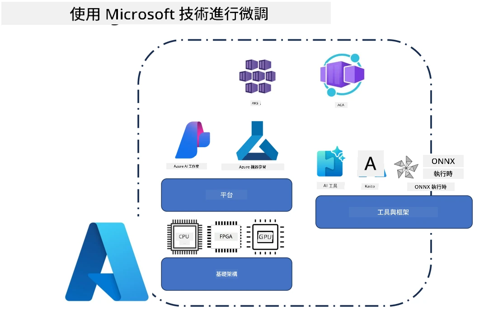
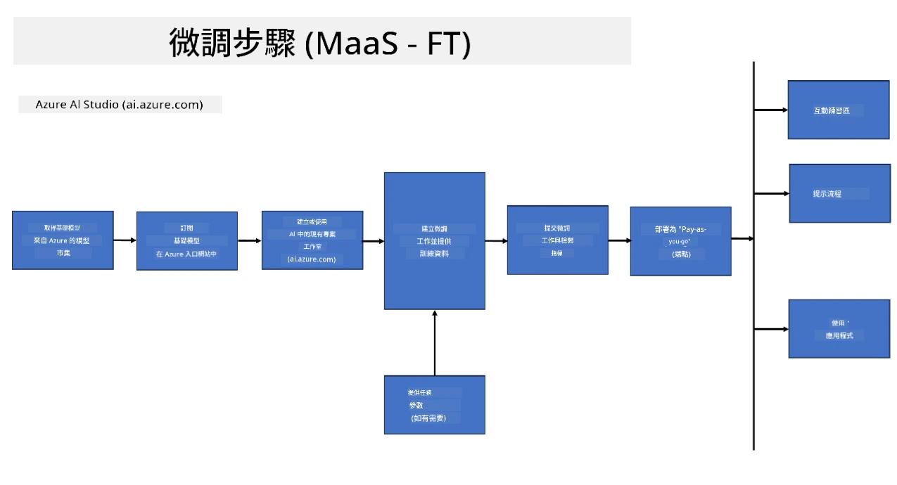
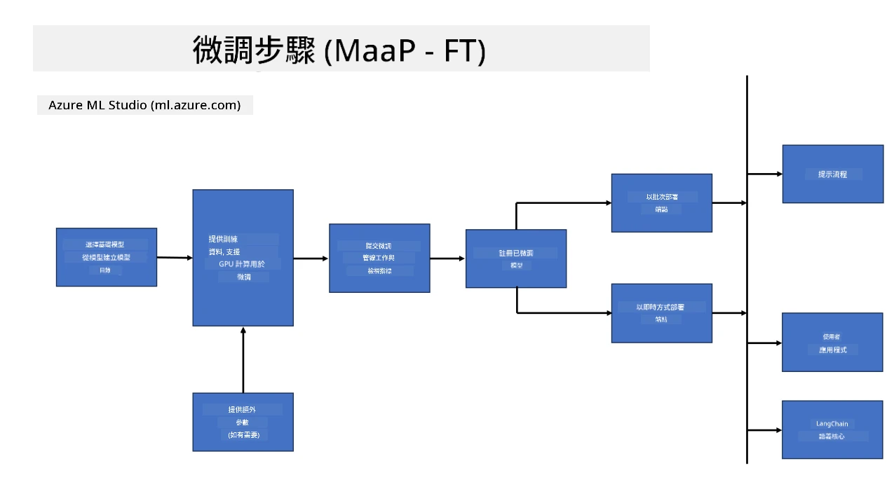
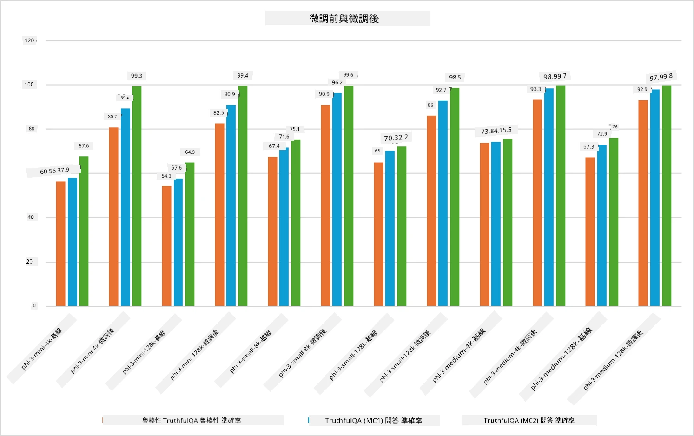

## 微調場景

本節概述 Microsoft Foundry 和 Azure 環境中的微調場景，包括部署模型、基礎設施層以及常用的優化技術。

**平台**  
包含受管服務，如 Microsoft Foundry（前稱 Azure AI Foundry）和 Azure 機器學習，提供模型管理、編排、實驗追蹤和部署流程。

**基礎設施**  
微調需要可擴展的計算資源。在 Azure 環境中，這通常包括基於 GPU 的虛擬機以及用於輕量級工作負載的 CPU 資源，並配備可擴展的儲存以存放資料集和檢查點。

**工具與框架**  
微調流程通常依賴框架和優化庫，如 Hugging Face Transformers、DeepSpeed 和 PEFT（參數高效微調）。

使用 Microsoft 技術的微調流程涵蓋平台服務、計算基礎設施與訓練框架。透過理解這些組件如何協同工作，開發人員能有效地將基礎模型調整至特定任務與生產場景。

## 模型即服務

使用託管微調來微調模型，無需自行建立和管理計算資源。

無伺服器微調現已支援 Phi-3、Phi-3.5 和 Phi-4 模型系列，使開發人員能夠快速且輕鬆地為雲端與邊緣場景自訂模型，無需安排計算資源。

## 模型即平台

使用者自行管理計算資源，以微調自己的模型。

[微調範例](https://github.com/Azure/azureml-examples/blob/main/sdk/python/foundation-models/system/finetune/chat-completion/chat-completion.ipynb)

## 微調技術比較

|場景|LoRA|QLoRA|PEFT|DeepSpeed|ZeRO|DoRA|
|---|---|---|---|---|---|---|
|將預訓練大型語言模型調整至特定任務或領域|是|是|是|是|是|是|
|用於文字分類、命名實體識別和機器翻譯等自然語言處理任務的微調|是|是|是|是|是|是|
|用於問答任務的微調|是|是|是|是|是|是|
|用於在聊天機器人產生類人回應的微調|是|是|是|是|是|是|
|用於生成音樂、藝術或其他創意形式的微調|是|是|是|是|是|是|
|降低計算與財務成本|是|是|是|是|是|是|
|降低記憶體使用量|是|是|是|是|是|是|
|使用更少參數以實現高效微調|是|是|是|否|否|是|
|記憶體效能型資料平行形式，可利用所有 GPU 裝置的總 GPU 記憶體|否|否|否|是|是|否|

> [!NOTE]
> LoRA、QLoRA、PEFT 和 DoRA 是參數高效微調方法，而 DeepSpeed 和 ZeRO 則專注於分散式訓練和記憶體優化。

## 微調效能範例

---

<!-- CO-OP TRANSLATOR DISCLAIMER START -->
**免責聲明**：  
本文件使用 AI 翻譯服務 [Co-op Translator](https://github.com/Azure/co-op-translator) 進行翻譯。雖然我們致力於確保準確性，但請注意自動翻譯可能包含錯誤或不準確之處。原始文件的原文版本應視為具有權威性的來源。對於關鍵資訊，建議採用專業人工翻譯。我們不對因使用本翻譯而產生的任何誤解或誤釋負責。
<!-- CO-OP TRANSLATOR DISCLAIMER END -->