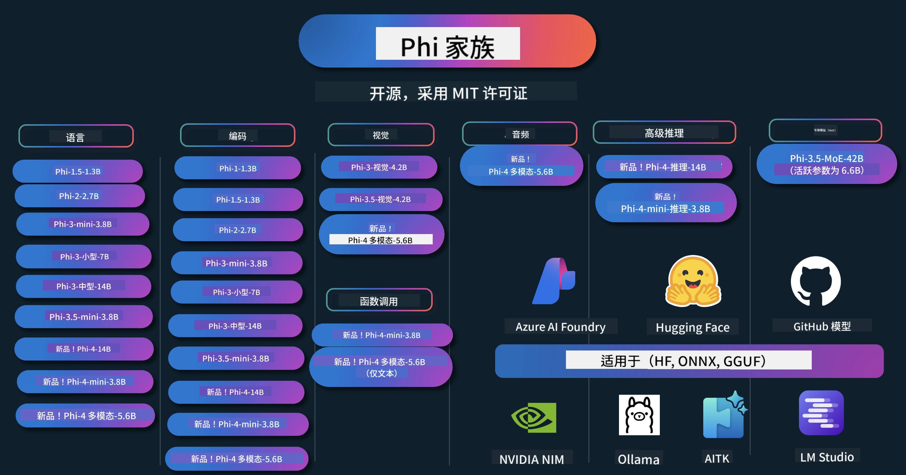

<!--
CO_OP_TRANSLATOR_METADATA:
{
  "original_hash": "ef3a50368712b1a7483d0def1f70c490",
  "translation_date": "2025-12-21T10:16:53+00:00",
  "source_file": "README.md",
  "language_code": "zh"
}
-->
# Phi 烹饪书：使用微软的 Phi 模型的动手示例

Phi 是微软开发的一系列开源 AI 模型。

Phi 目前是最强大且具有成本效益的小型语言模型 (SLM)，在多语言、推理、文本/聊天生成、编码、图像、音频和其他场景中具有非常好的基准表现。

您可以将 Phi 部署到云端或边缘设备，并可以在计算能力有限的情况下轻松构建生成式 AI 应用。

按照以下步骤开始使用这些资源：
1. **Fork 仓库**: 点击 
2. **克隆仓库**:   `git clone https://github.com/microsoft/PhiCookBook.git`
3. [**加入 Microsoft AI Discord 社区，结识专家和其他开发者**](https://discord.com/invite/ByRwuEEgH4?WT.mc_id=aiml-137032-kinfeylo)

### 🌐 多语言支持

#### 通过 GitHub Action 支持（自动化且始终保持最新）

<!-- CO-OP TRANSLATOR LANGUAGES TABLE START -->
[阿拉伯语](../ar/README.md) | [孟加拉语](../bn/README.md) | [保加利亚语](../bg/README.md) | [缅甸语（缅甸）](../my/README.md) | [中文（简体）](./README.md) | [中文（繁体，香港）](../hk/README.md) | [中文（繁体，澳门）](../mo/README.md) | [中文（繁体，台湾）](../tw/README.md) | [克罗地亚语](../hr/README.md) | [捷克语](../cs/README.md) | [丹麦语](../da/README.md) | [荷兰语](../nl/README.md) | [爱沙尼亚语](../et/README.md) | [芬兰语](../fi/README.md) | [法语](../fr/README.md) | [德语](../de/README.md) | [希腊语](../el/README.md) | [希伯来语](../he/README.md) | [印地语](../hi/README.md) | [匈牙利语](../hu/README.md) | [印尼语](../id/README.md) | [意大利语](../it/README.md) | [日语](../ja/README.md) | [卡纳达语](../kn/README.md) | [韩语](../ko/README.md) | [立陶宛语](../lt/README.md) | [马来语](../ms/README.md) | [马拉雅拉姆语](../ml/README.md) | [马拉地语](../mr/README.md) | [尼泊尔语](../ne/README.md) | [尼日利亚皮钦语](../pcm/README.md) | [挪威语](../no/README.md) | [波斯语（法尔西）](../fa/README.md) | [波兰语](../pl/README.md) | [葡萄牙语（巴西）](../br/README.md) | [葡萄牙语（葡萄牙）](../pt/README.md) | [旁遮普语（古鲁姆基）](../pa/README.md) | [罗马尼亚语](../ro/README.md) | [俄语](../ru/README.md) | [塞尔维亚语（西里尔字母）](../sr/README.md) | [斯洛伐克语](../sk/README.md) | [斯洛文尼亚语](../sl/README.md) | [西班牙语](../es/README.md) | [斯瓦希里语](../sw/README.md) | [瑞典语](../sv/README.md) | [塔加洛语（菲律宾）](../tl/README.md) | [泰米尔语](../ta/README.md) | [泰卢固语](../te/README.md) | [泰语](../th/README.md) | [土耳其语](../tr/README.md) | [乌克兰语](../uk/README.md) | [乌尔都语](../ur/README.md) | [越南语](../vi/README.md)
<!-- CO-OP TRANSLATOR LANGUAGES TABLE END -->

## 目录

- 介绍
  - [欢迎来到 Phi 家族](./md/01.Introduction/01/01.PhiFamily.md)
  - [设置您的环境](./md/01.Introduction/01/01.EnvironmentSetup.md)
  - [理解关键技术](./md/01.Introduction/01/01.Understandingtech.md)
  - [Phi 模型的 AI 安全](./md/01.Introduction/01/01.AISafety.md)
  - [Phi 硬件支持](./md/01.Introduction/01/01.Hardwaresupport.md)
  - [Phi 模型及各平台可用性](./md/01.Introduction/01/01.Edgeandcloud.md)
  - [使用 Guidance-ai 与 Phi](./md/01.Introduction/01/01.Guidance.md)
  - [GitHub Marketplace 模型](https://github.com/marketplace/models)
  - [Azure AI 模型目录](https://ai.azure.com)

- 在不同环境中对 Phi 的推理
    -  [Hugging face](./md/01.Introduction/02/01.HF.md)
    -  [GitHub 模型](./md/01.Introduction/02/02.GitHubModel.md)
    -  [Azure AI Foundry 模型目录](./md/01.Introduction/02/03.AzureAIFoundry.md)
    -  [Ollama](./md/01.Introduction/02/04.Ollama.md)
    -  [AI Toolkit VSCode (AITK)](./md/01.Introduction/02/05.AITK.md)
    -  [NVIDIA NIM](./md/01.Introduction/02/06.NVIDIA.md)
    -  [Foundry Local](./md/01.Introduction/02/07.FoundryLocal.md)

- Phi 家族的推理
    - [在 iOS 上对 Phi 进行推理](./md/01.Introduction/03/iOS_Inference.md)
    - [在 Android 上对 Phi 进行推理](./md/01.Introduction/03/Android_Inference.md)
    - [在 Jetson 上对 Phi 进行推理](./md/01.Introduction/03/Jetson_Inference.md)
    - [在 AI PC 上对 Phi 进行推理](./md/01.Introduction/03/AIPC_Inference.md)
    - [使用 Apple MLX 框架对 Phi 进行推理](./md/01.Introduction/03/MLX_Inference.md)
    - [在本地服务器上对 Phi 进行推理](./md/01.Introduction/03/Local_Server_Inference.md)
    - [在远程服务器上使用 AI Toolkit 对 Phi 进行推理](./md/01.Introduction/03/Remote_Interence.md)
    - [使用 Rust 对 Phi 进行推理](./md/01.Introduction/03/Rust_Inference.md)
    - [在本地对 Phi 进行视觉推理](./md/01.Introduction/03/Vision_Inference.md)
    - [使用 Kaito AKS、Azure Containers（官方支持）对 Phi 进行推理](./md/01.Introduction/03/Kaito_Inference.md)
-  [对 Phi 家族进行量化](./md/01.Introduction/04/QuantifyingPhi.md)
    - [使用 llama.cpp 对 Phi-3.5 / 4 进行量化](./md/01.Introduction/04/UsingLlamacppQuantifyingPhi.md)
    - [使用 onnxruntime 的生成式 AI 扩展对 Phi-3.5 / 4 进行量化](./md/01.Introduction/04/UsingORTGenAIQuantifyingPhi.md)
    - [使用 Intel OpenVINO 对 Phi-3.5 / 4 进行量化](./md/01.Introduction/04/UsingIntelOpenVINOQuantifyingPhi.md)
    - [使用 Apple MLX 框架对 Phi-3.5 / 4 进行量化](./md/01.Introduction/04/UsingAppleMLXQuantifyingPhi.md)

-  评估 Phi
    - [负责任的 AI](./md/01.Introduction/05/ResponsibleAI.md)
    - [用于评估的 Azure AI Foundry](./md/01.Introduction/05/AIFoundry.md)
    - [使用 Promptflow 进行评估](./md/01.Introduction/05/Promptflow.md)
 
- 使用 Azure AI Search 的 RAG
    - [如何将 Phi-4-mini 和 Phi-4-multimodal(RAG) 与 Azure AI Search 一起使用](https://github.com/microsoft/PhiCookBook/blob/main/code/06.E2E/E2E_Phi-4-RAG-Azure-AI-Search.ipynb)

- Phi 应用开发示例
  - 文本与聊天应用
    - Phi-4 示例 🆕
      - [📓] [使用 Phi-4-mini ONNX 模型聊天](./md/02.Application/01.TextAndChat/Phi4/ChatWithPhi4ONNX/README.md)
      - [使用 Phi-4 本地 ONNX 模型进行聊天 .NET](../../md/04.HOL/dotnet/src/LabsPhi4-Chat-01OnnxRuntime)
      - [使用 Sementic Kernel 的 Phi-4 ONNX .NET 控制台聊天应用](../../md/04.HOL/dotnet/src/LabsPhi4-Chat-02SK)
    - Phi-3 / 3.5 示例
      - [在浏览器中使用 Phi3、ONNX Runtime Web 和 WebGPU 的本地聊天机器人](https://github.com/microsoft/onnxruntime-inference-examples/tree/main/js/chat)
      - [OpenVINO 聊天](./md/02.Application/01.TextAndChat/Phi3/E2E_OpenVino_Chat.md)
      - [多模型 - 交互式 Phi-3-mini 与 OpenAI Whisper](./md/02.Application/01.TextAndChat/Phi3/E2E_Phi-3-mini_with_whisper.md)
      - [MLFlow - 构建封装并在 MLFlow 中使用 Phi-3](./md//02.Application/01.TextAndChat/Phi3/E2E_Phi-3-MLflow.md)
      - [模型优化 - 如何使用 Olive 为 ONNX Runtime Web 优化 Phi-3-min 模型](https://github.com/microsoft/Olive/tree/main/examples/phi3)
      - [带 Phi-3 mini-4k-instruct-onnx 的 WinUI3 应用](https://github.com/microsoft/Phi3-Chat-WinUI3-Sample/)
      -[带多模型 AI 功能的 WinUI3 记事本示例](https://github.com/microsoft/ai-powered-notes-winui3-sample)
      - [使用 Prompt flow 微调并集成自定义 Phi-3 模型](./md/02.Application/01.TextAndChat/Phi3/E2E_Phi-3-FineTuning_PromptFlow_Integration.md)
      - [在 Azure AI Foundry 中使用 Prompt flow 微调并集成自定义 Phi-3 模型](./md/02.Application/01.TextAndChat/Phi3/E2E_Phi-3-FineTuning_PromptFlow_Integration_AIFoundry.md)
      - [在 Azure AI Foundry 中评估微调后的 Phi-3 / Phi-3.5 模型，聚焦微软的负责任 AI 原则](./md/02.Application/01.TextAndChat/Phi3/E2E_Phi-3-Evaluation_AIFoundry.md)
      - [📓] [Phi-3.5-mini-instruct 语言预测示例（中文/英文）](./md/02.Application/01.TextAndChat/Phi3/phi3-instruct-demo.ipynb)
      - [Phi-3.5-Instruct WebGPU RAG 聊天机器人](./md/02.Application/01.TextAndChat/Phi3/WebGPUWithPhi35Readme.md)
      - [在 Windows GPU 上使用 Phi-3.5-Instruct ONNX 创建 Prompt flow 解决方案](./md/02.Application/01.TextAndChat/Phi3/UsingPromptFlowWithONNX.md)
      - [使用 Microsoft Phi-3.5 tflite 创建 Android 应用](./md/02.Application/01.TextAndChat/Phi3/UsingPhi35TFLiteCreateAndroidApp.md)
      - [Q&A .NET 示例，使用 Microsoft.ML.OnnxRuntime 和本地 ONNX Phi-3 模型](../../md/04.HOL/dotnet/src/LabsPhi301)
      - [使用 Semantic Kernel 和 Phi-3 的控制台聊天 .NET 应用](../../md/04.HOL/dotnet/src/LabsPhi302)

  - Azure AI Inference SDK 基于代码的示例 
    - Phi-4 示例 🆕
      - [📓] [使用 Phi-4-multimodal 生成项目代码](./md/02.Application/02.Code/Phi4/GenProjectCode/README.md)
    - Phi-3 / 3.5 示例
      - [使用 Microsoft Phi-3 系列 构建您自己的 Visual Studio Code GitHub Copilot 聊天](./md/02.Application/02.Code/Phi3/VSCodeExt/README.md)
      - [使用 GitHub Models 的 Phi-3.5 在 Visual Studio Code 中创建您自己的聊天 Copilot 代理](/md/02.Application/02.Code/Phi3/CreateVSCodeChatAgentWithGitHubModels.md)

  - 高级推理示例
    - Phi-4 示例 🆕
      - [📓] [Phi-4-mini-reasoning 或 Phi-4-reasoning 示例](./md/02.Application/03.AdvancedReasoning/Phi4/AdvancedResoningPhi4mini/README.md)
      - [📓] [使用 Microsoft Olive 对 Phi-4-mini-reasoning 进行微调](./md/02.Application/03.AdvancedReasoning/Phi4/AdvancedResoningPhi4mini/olive_ft_phi_4_reasoning_with_medicaldata.ipynb)
      - [📓] [使用 Apple MLX 对 Phi-4-mini-reasoning 进行微调](./md/02.Application/03.AdvancedReasoning/Phi4/AdvancedResoningPhi4mini/mlx_ft_phi_4_reasoning_with_medicaldata.ipynb)
      - [📓] [使用 GitHub Models 的 Phi-4-mini-reasoning](./md/02.Application/02.Code/Phi4r/github_models_inference.ipynb)
      - [📓] [使用 Azure AI Foundry 模型 的 Phi-4-mini-reasoning](./md/02.Application/02.Code/Phi4r/azure_models_inference.ipynb)
  - 演示
      - [托管在 Hugging Face Spaces 上的 Phi-4-mini 演示](https://huggingface.co/spaces/microsoft/phi-4-mini?WT.mc_id=aiml-137032-kinfeylo)
      - [托管在 Hugginge Face Spaces 上的 Phi-4-multimodal 演示](https://huggingface.co/spaces/microsoft/phi-4-multimodal?WT.mc_id=aiml-137032-kinfeylo)
  - 视觉示例
    - Phi-4 示例 🆕
      - [📓] [使用 Phi-4-multimodal 阅读图像并生成代码](./md/02.Application/04.Vision/Phi4/CreateFrontend/README.md) 
    - Phi-3 / 3.5 示例
      -  [📓][Phi-3-vision-Image 文本到文本](./md/02.Application/04.Vision/Phi3/E2E_Phi-3-vision-image-text-to-text-online-endpoint.ipynb)
      - [Phi-3-vision-ONNX](https://onnxruntime.ai/docs/genai/tutorials/phi3-v.html)
      - [📓][Phi-3-vision CLIP 嵌入](./md/02.Application/04.Vision/Phi3/E2E_Phi-3-vision-image-text-to-text-online-endpoint.ipynb)
      - [演示：Phi-3 Recycling](https://github.com/jennifermarsman/PhiRecycling/)
      - [Phi-3-vision - 视觉语言助手 - 使用 Phi3-Vision 和 OpenVINO](https://docs.openvino.ai/nightly/notebooks/phi-3-vision-with-output.html)
      - [Phi-3 Vision Nvidia NIM](./md/02.Application/04.Vision/Phi3/E2E_Nvidia_NIM_Vision.md)
      - [Phi-3 Vision OpenVino](./md/02.Application/04.Vision/Phi3/E2E_OpenVino_Phi3Vision.md)
      - [📓][Phi-3.5 Vision 多帧或多图像示例](./md/02.Application/04.Vision/Phi3/phi3-vision-demo.ipynb)
      - [使用 Microsoft.ML.OnnxRuntime .NET 的 Phi-3 Vision 本地 ONNX 模型](../../md/04.HOL/dotnet/src/LabsPhi303)
      - [基于菜单的 Phi-3 Vision 本地 ONNX 模型 使用 Microsoft.ML.OnnxRuntime .NET](../../md/04.HOL/dotnet/src/LabsPhi304)

  - 数学示例
    -  Phi-4-Mini-Flash-Reasoning-Instruct 示例 🆕 [使用 Phi-4-Mini-Flash-Reasoning-Instruct 的数学演示](./md/02.Application/09.Math/MathDemo.ipynb)

  - 音频示例
    - Phi-4 示例 🆕
      - [📓] [使用 Phi-4-multimodal 提取音频转录](./md/02.Application/05.Audio/Phi4/Transciption/README.md)
      - [📓] [Phi-4-multimodal 音频示例](./md/02.Application/05.Audio/Phi4/Siri/demo.ipynb)
      - [📓] [Phi-4-multimodal 语音翻译示例](./md/02.Application/05.Audio/Phi4/Translate/demo.ipynb)
      - [.NET 控制台应用 使用 Phi-4-multimodal 音频 分析音频文件并生成转录](../../md/04.HOL/dotnet/src/LabsPhi4-MultiModal-02Audio)

  - MOE 示例
    - Phi-3 / 3.5 示例
      - [📓] [Phi-3.5 混合专家模型 (MoEs) 社交媒体示例](./md/02.Application/06.MoE/Phi3/phi3_moe_demo.ipynb)
      - [📓] [使用 NVIDIA NIM Phi-3 MOE、Azure AI Search 和 LlamaIndex 构建检索增强生成 (RAG) 管道](./md/02.Application/06.MoE/Phi3/azure-ai-search-nvidia-rag.ipynb)
      - 
  - 函数调用示例
    - Phi-4 示例 🆕
      -  [📓] [在 Phi-4-mini 中使用函数调用](./md/02.Application/07.FunctionCalling/Phi4/FunctionCallingBasic/README.md)
      -  [📓] [使用函数调用创建 Phi-4-mini 的多代理](./md/02.Application/07.FunctionCalling/Phi4/Multiagents/Phi_4_mini_multiagent.ipynb)
      -  [📓] [与 Ollama 一起使用函数调用](./md/02.Application/07.FunctionCalling/Phi4/Ollama/ollama_functioncalling.ipynb)
      -  [📓] [与 ONNX 一起使用函数调用](../../md/02.Application/07.FunctionCalling/Phi4/ONNX/onnx_parallel_functioncalling_ipynb)
  - 多模态混合示例
    - Phi-4 示例 🆕
      -  [📓] [将 Phi-4-multimodal 用作技术记者](./md/02.Application/08.Multimodel/Phi4/TechJournalist/phi_4_mm_audio_text_publish_news.ipynb)
      - [.NET 控制台应用 使用 Phi-4-multimodal 分析图像](../../md/04.HOL/dotnet/src/LabsPhi4-MultiModal-01Images)

- Phi 微调示例
  - [微调场景](./md/03.FineTuning/FineTuning_Scenarios.md)
  - [微调 与 RAG](./md/03.FineTuning/FineTuning_vs_RAG.md)
  - [微调：让 Phi-3 成为行业专家](./md/03.FineTuning/LetPhi3gotoIndustriy.md)
  - [使用 VS Code 的 AI Toolkit 微调 Phi-3](./md/03.FineTuning/Finetuning_VSCodeaitoolkit.md)
  - [使用 Azure Machine Learning 服务 微调 Phi-3](./md/03.FineTuning/Introduce_AzureML.md)
  - [使用 Lora 微调 Phi-3](./md/03.FineTuning/FineTuning_Lora.md)
  - [使用 QLora 微调 Phi-3](./md/03.FineTuning/FineTuning_Qlora.md)
  - [使用 Azure AI Foundry 微调 Phi-3](./md/03.FineTuning/FineTuning_AIFoundry.md)
  - [使用 Azure ML CLI/SDK 微调 Phi-3](./md/03.FineTuning/FineTuning_MLSDK.md)
  - [使用 Microsoft Olive 进行微调](./md/03.FineTuning/FineTuning_MicrosoftOlive.md)
  - [Microsoft Olive 实操实验室 微调](./md/03.FineTuning/olive-lab/readme.md)
  - [使用 Weights and Bias 微调 Phi-3-vision](./md/03.FineTuning/FineTuning_Phi-3-visionWandB.md)
  - [使用 Apple MLX 框架 微调 Phi-3](./md/03.FineTuning/FineTuning_MLX.md)
  - [微调 Phi-3-vision（官方支持）](./md/03.FineTuning/FineTuning_Vision.md)
  - [使用 Kaito AKS、Azure Containers 对 Phi-3 进行微调（官方支持）](./md/03.FineTuning/FineTuning_Kaito.md)
  - [微调 Phi-3 和 3.5 Vision](https://github.com/2U1/Phi3-Vision-Finetune)

- 实操实验室
  - [探索前沿模型：LLMs、SLMs、本地开发等](https://github.com/microsoft/aitour-exploring-cutting-edge-models)
  - [释放 NLP 潜力：使用 Microsoft Olive 进行微调](https://github.com/azure/Ignite_FineTuning_workshop)

- 学术研究论文与出版物
  - [Textbooks Are All You Need II：phi-1.5 技术报告](https://arxiv.org/abs/2309.05463)
  - [Phi-3 技术报告：在本地手机上运行的高能力语言模型](https://arxiv.org/abs/2404.14219)
  - [Phi-4 技术报告](https://arxiv.org/abs/2412.08905)
  - [Phi-4-Mini 技术报告：通过 Mixture-of-LoRAs 构建紧凑而强大的多模态语言模型](https://arxiv.org/abs/2503.01743)
  - [优化用于车载功能调用的小型语言模型](https://arxiv.org/abs/2501.02342)
  - [(WhyPHI) 微调 PHI-3 以进行多项选择题问答：方法、结果和挑战](https://arxiv.org/abs/2501.01588)
  - [Phi-4-reasoning 技术报告](https://www.microsoft.com/en-us/research/wp-content/uploads/2025/04/phi_4_reasoning.pdf)
  - [Phi-4-mini-reasoning 技术报告](https://huggingface.co/microsoft/Phi-4-mini-reasoning/blob/main/Phi-4-Mini-Reasoning.pdf)

## 使用 Phi 模型

### Phi 在 Azure AI Foundry 上

您可以了解如何使用 Microsoft Phi 以及如何在不同硬件设备上构建端到端解决方案。要亲自体验 Phi，请先试用这些模型，并使用 [Azure AI Foundry Azure AI Model Catalog](https://aka.ms/phi3-azure-ai) 为您的场景定制 Phi。您可以在“开始使用 [Azure AI Foundry](/md/02.QuickStart/AzureAIFoundry_QuickStart.md)”中了解更多信息。

**演示区**
每个模型都有一个专门的演示区用于测试模型 [Azure AI Playground](https://aka.ms/try-phi3).

### Phi on GitHub Models

您可以了解如何使用 Microsoft Phi 以及如何在不同硬件设备上构建端到端解决方案。要亲自体验 Phi，请先试用该模型，并使用 [GitHub 模型目录](https://github.com/marketplace/models?WT.mc_id=aiml-137032-kinfeylo) 为您的场景定制 Phi。您可以在“开始使用 [GitHub Model Catalog](/md/02.QuickStart/GitHubModel_QuickStart.md)”中了解更多信息。

**演示区**
Each model has a dedicated [用于测试模型的演示区](/md/02.QuickStart/GitHubModel_QuickStart.md).

### Phi 在 Hugging Face 上

您也可以在 [Hugging Face](https://huggingface.co/microsoft) 找到该模型

**演示区**
 [Hugging Chat 演示区](https://huggingface.co/chat/models/microsoft/Phi-3-mini-4k-instruct)

 ## 🎒 其他课程

我们的团队制作了其他课程！查看：

<!-- CO-OP TRANSLATOR OTHER COURSES START -->
### LangChain

---

### Azure / Edge / MCP / Agents

---
 
### Generative AI Series

[-9333EA?style=for-the-badge&labelColor=E5E7EB&color=9333EA)](https://github.com/microsoft/Generative-AI-for-beginners-dotnet?WT.mc_id=academic-105485-koreyst)
[-C084FC?style=for-the-badge&labelColor=E5E7EB&color=C084FC)](https://github.com/microsoft/generative-ai-for-beginners-java?WT.mc_id=academic-105485-koreyst)
[-E879F9?style=for-the-badge&labelColor=E5E7EB&color=E879F9)](https://github.com/microsoft/generative-ai-with-javascript?WT.mc_id=academic-105485-koreyst)

---
 
### Core Learning

---
 
### Copilot Series

<!-- CO-OP TRANSLATOR OTHER COURSES END -->

## 负责任的 AI

Microsoft 致力于帮助我们的客户负责任地使用我们的 AI 产品，分享我们的经验教训，并通过诸如 Transparency Notes 和 Impact Assessments 之类的工具建立基于信任的合作伙伴关系。许多这些资源可在 [https://aka.ms/RAI](https://aka.ms/RAI) 找到。
Microsoft 对负责任 AI 的方法基于我们的 AI 原则：公平、可靠与安全、隐私与安全、包容、透明和问责。

大规模的自然语言、图像和语音模型——例如本示例中使用的模型——可能会以不公平、不可靠或冒犯性的方式表现，从而造成伤害。请查阅 [Azure OpenAI service Transparency note](https://learn.microsoft.com/legal/cognitive-services/openai/transparency-note?tabs=text) 以了解相关风险和局限性。

建议缓解这些风险的方法是在您的架构中包含一个安全系统，能够检测并防止有害行为。[Azure AI Content Safety](https://learn.microsoft.com/azure/ai-services/content-safety/overview) 提供了一层独立的保护，能够检测应用和服务中有害的用户生成和 AI 生成内容。Azure AI Content Safety 包括文本和图像 API，可让您检测有害材料。在 Azure AI Foundry 中，Content Safety 服务允许您查看、探索并试用用于检测不同模态中有害内容的示例代码。以下 [快速入门文档](https://learn.microsoft.com/azure/ai-services/content-safety/quickstart-text?tabs=visual-studio%2Clinux&pivots=programming-language-rest) 指导您如何向该服务发出请求。

另一个需要考虑的方面是整体应用性能。在多模态和多模型应用中，我们认为性能意味着系统按照您和您的用户的期望运行，包括不生成有害输出。评估整个应用的性能时，请使用 [性能与质量以及风险与安全评估器](https://learn.microsoft.com/azure/ai-studio/concepts/evaluation-metrics-built-in)。您也可以创建并使用 [自定义评估器](https://learn.microsoft.com/azure/ai-studio/how-to/develop/evaluate-sdk#custom-evaluators) 进行评估。

您可以在开发环境中使用 [Azure AI Evaluation SDK](https://microsoft.github.io/promptflow/index.html) 评估您的 AI 应用。无论是给定测试数据集还是目标，您的生成式 AI 应用的生成结果都可以使用内置评估器或您选择的自定义评估器进行定量测量。要开始使用 azure ai evaluation sdk 来评估您的系统，您可以遵循 [快速入门指南](https://learn.microsoft.com/azure/ai-studio/how-to/develop/flow-evaluate-sdk)。一旦您执行评估运行，您可以 [在 Azure AI Foundry 中可视化结果](https://learn.microsoft.com/azure/ai-studio/how-to/evaluate-flow-results)。 

## 商标
此项目可能包含项目、产品或服务的商标或徽标。对 Microsoft 商标或徽标的授权使用须遵守并符合 [Microsoft 的商标与品牌指南](https://www.microsoft.com/legal/intellectualproperty/trademarks/usage/general)。
在本项目的修改版本中使用 Microsoft 商标或徽标不得造成混淆或暗示 Microsoft 的赞助。任何第三方商标或徽标的使用均须遵守相应第三方的政策。

## 获取帮助

如果在构建 AI 应用时遇到问题或有任何疑问，请加入：

如果在构建过程中有产品反馈或遇到错误，请访问：

---

<!-- CO-OP TRANSLATOR DISCLAIMER START -->
免责声明：
本文件由 AI 翻译服务 Co‑op Translator (https://github.com/Azure/co-op-translator) 翻译。尽管我们力求准确，但请注意自动翻译可能包含错误或不准确之处。原文（以其原始语言编写的版本）应被视为权威来源。对于重要信息，建议采用专业人工翻译。因使用本翻译而产生的任何误解或曲解，我们不承担任何责任。
<!-- CO-OP TRANSLATOR DISCLAIMER END -->