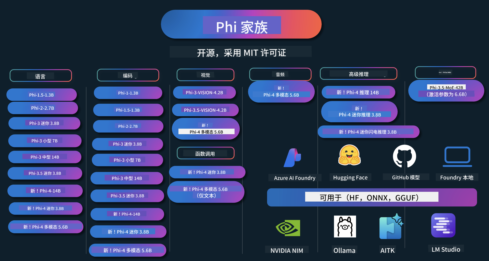

<!--
CO_OP_TRANSLATOR_METADATA:
{
  "original_hash": "5c07bb4c3c89a36c9be332a065a9a33c",
  "translation_date": "2025-07-16T14:56:17+00:00",
  "source_file": "README.md",
  "language_code": "zh"
}
-->
# Phi Cookbook：微软Phi模型实战示例

  

  
  
  

  
  

Phi是微软开发的一系列开源AI模型。

Phi目前是最强大且性价比最高的小型语言模型（SLM），在多语言、推理、文本/聊天生成、编码、图像、音频等多种场景中表现优异。

你可以将Phi部署到云端或边缘设备，并且能够轻松构建计算资源有限的生成式AI应用。

按照以下步骤开始使用这些资源：  
1. **Fork仓库**：点击   
2. **克隆仓库**：`git clone https://github.com/microsoft/PhiCookBook.git`  
3. [**加入微软AI Discord社区，结识专家和开发者**](https://discord.com/invite/ByRwuEEgH4?WT.mc_id=aiml-137032-kinfeylo)

### 🌐 多语言支持

#### 通过GitHub Action支持（自动且始终保持最新）

[法语](../fr/README.md) | [西班牙语](../es/README.md) | [德语](../de/README.md) | [俄语](../ru/README.md) | [阿拉伯语](../ar/README.md) | [波斯语（法尔西语）](../fa/README.md) | [乌尔都语](../ur/README.md) | [中文（简体）](./README.md) | [中文（繁体，澳门）](../mo/README.md) | [中文（繁体，香港）](../hk/README.md) | [中文（繁体，台湾）](../tw/README.md) | [日语](../ja/README.md) | [韩语](../ko/README.md) | [印地语](../hi/README.md)  
[孟加拉语](../bn/README.md) | [马拉地语](../mr/README.md) | [尼泊尔语](../ne/README.md) | [旁遮普语（古鲁姆基）](../pa/README.md) | [葡萄牙语（葡萄牙）](../pt/README.md) | [葡萄牙语（巴西）](../br/README.md) | [意大利语](../it/README.md) | [波兰语](../pl/README.md) | [土耳其语](../tr/README.md) | [希腊语](../el/README.md) | [泰语](../th/README.md) | [瑞典语](../sv/README.md) | [丹麦语](../da/README.md) | [挪威语](../no/README.md) | [芬兰语](../fi/README.md) | [荷兰语](../nl/README.md) | [希伯来语](../he/README.md) | [越南语](../vi/README.md) | [印尼语](../id/README.md) | [马来语](../ms/README.md) | [他加禄语（菲律宾语）](../tl/README.md) | [斯瓦希里语](../sw/README.md) | [匈牙利语](../hu/README.md) | [捷克语](../cs/README.md) | [斯洛伐克语](../sk/README.md) | [罗马尼亚语](../ro/README.md) | [保加利亚语](../bg/README.md) | [塞尔维亚语（西里尔字母）](../sr/README.md) | [克罗地亚语](../hr/README.md) | [斯洛文尼亚语](../sl/README.md)

## 目录

- 介绍  
  - [欢迎加入Phi大家庭](./md/01.Introduction/01/01.PhiFamily.md)  
  - [环境搭建](./md/01.Introduction/01/01.EnvironmentSetup.md)  
  - [关键技术解析](./md/01.Introduction/01/01.Understandingtech.md)  
  - [Phi模型的AI安全](./md/01.Introduction/01/01.AISafety.md)  
  - [Phi硬件支持](./md/01.Introduction/01/01.Hardwaresupport.md)  
  - [Phi模型及其在各平台的可用性](./md/01.Introduction/01/01.Edgeandcloud.md)  
  - [使用Guidance-ai和Phi](./md/01.Introduction/01/01.Guidance.md)  
  - [GitHub Marketplace模型](https://github.com/marketplace/models)  
  - [Azure AI模型目录](https://ai.azure.com)

- 不同环境下的Phi推理  
  - [Hugging face](./md/01.Introduction/02/01.HF.md)  
  - [GitHub模型](./md/01.Introduction/02/02.GitHubModel.md)  
  - [Azure AI Foundry模型目录](./md/01.Introduction/02/03.AzureAIFoundry.md)  
  - [Ollama](./md/01.Introduction/02/04.Ollama.md)  
  - [AI Toolkit VSCode (AITK)](./md/01.Introduction/02/05.AITK.md)  
  - [NVIDIA NIM](./md/01.Introduction/02/06.NVIDIA.md)  
  - [Foundry本地部署](./md/01.Introduction/02/07.FoundryLocal.md)

- Phi家族推理  
  - [iOS上的Phi推理](./md/01.Introduction/03/iOS_Inference.md)  
  - [Android上的Phi推理](./md/01.Introduction/03/Android_Inference.md)  
  - [Jetson上的Phi推理](./md/01.Introduction/03/Jetson_Inference.md)  
  - [AI PC上的Phi推理](./md/01.Introduction/03/AIPC_Inference.md)  
  - [使用Apple MLX框架进行Phi推理](./md/01.Introduction/03/MLX_Inference.md)  
  - [本地服务器上的Phi推理](./md/01.Introduction/03/Local_Server_Inference.md)  
  - [使用AI Toolkit进行远程服务器上的Phi推理](./md/01.Introduction/03/Remote_Interence.md)  
  - [使用Rust进行Phi推理](./md/01.Introduction/03/Rust_Inference.md)  
  - [本地Phi视觉推理](./md/01.Introduction/03/Vision_Inference.md)  
  - [使用Kaito AKS、Azure容器（官方支持）进行Phi推理](./md/01.Introduction/03/Kaito_Inference.md)

- Phi家族量化  
  - [使用llama.cpp量化Phi-3.5 / 4](./md/01.Introduction/04/UsingLlamacppQuantifyingPhi.md)  
  - [使用onnxruntime的生成式AI扩展量化Phi-3.5 / 4](./md/01.Introduction/04/UsingORTGenAIQuantifyingPhi.md)  
  - [使用Intel OpenVINO量化Phi-3.5 / 4](./md/01.Introduction/04/UsingIntelOpenVINOQuantifyingPhi.md)  
  - [使用Apple MLX框架量化Phi-3.5 / 4](./md/01.Introduction/04/UsingAppleMLXQuantifyingPhi.md)

- Phi评估  
  - [负责任的AI](./md/01.Introduction/05/ResponsibleAI.md)  
  - [Azure AI Foundry评估](./md/01.Introduction/05/AIFoundry.md)  
  - [使用Promptflow进行评估](./md/01.Introduction/05/Promptflow.md)

- 结合Azure AI Search的RAG  
  - [如何使用Phi-4-mini和Phi-4-multimodal（RAG）与Azure AI Search](https://github.com/microsoft/PhiCookBook/blob/main/code/06.E2E/E2E_Phi-4-RAG-Azure-AI-Search.ipynb)

- Phi应用开发示例  
  - 文本与聊天应用  
    - Phi-4示例 🆕  
      - [📓] [使用Phi-4-mini ONNX模型聊天](./md/02.Application/01.TextAndChat/Phi4/ChatWithPhi4ONNX/README.md)  
      - [使用Phi-4本地ONNX模型的.NET聊天](../../md/04.HOL/dotnet/src/LabsPhi4-Chat-01OnnxRuntime)  
      - [使用语义内核的Phi-4 ONNX .NET控制台聊天应用](../../md/04.HOL/dotnet/src/LabsPhi4-Chat-02SK)  
    - Phi-3 / 3.5示例  
      - [基于Phi3、ONNX Runtime Web和WebGPU的浏览器本地聊天机器人](https://github.com/microsoft/onnxruntime-inference-examples/tree/main/js/chat)  
      - [OpenVino聊天](./md/02.Application/01.TextAndChat/Phi3/E2E_OpenVino_Chat.md)  
      - [多模型 - 交互式Phi-3-mini和OpenAI Whisper](./md/02.Application/01.TextAndChat/Phi3/E2E_Phi-3-mini_with_whisper.md)  
      - [MLFlow - 构建包装器并使用Phi-3与MLFlow](./md//02.Application/01.TextAndChat/Phi3/E2E_Phi-3-MLflow.md)  
      - [模型优化 - 如何使用Olive优化Phi-3-min模型以适配ONNX Runtime Web](https://github.com/microsoft/Olive/tree/main/examples/phi3)  
      - [使用Phi-3 mini-4k-instruct-onnx的WinUI3应用](https://github.com/microsoft/Phi3-Chat-WinUI3-Sample/)  
      - [WinUI3多模型AI驱动笔记应用示例](https://github.com/microsoft/ai-powered-notes-winui3-sample)
- [使用 Prompt flow 微调并集成自定义 Phi-3 模型](./md/02.Application/01.TextAndChat/Phi3/E2E_Phi-3-FineTuning_PromptFlow_Integration.md)
- [在 Azure AI Foundry 中使用 Prompt flow 微调并集成自定义 Phi-3 模型](./md/02.Application/01.TextAndChat/Phi3/E2E_Phi-3-FineTuning_PromptFlow_Integration_AIFoundry.md)
- [在 Azure AI Foundry 中评估微调后的 Phi-3 / Phi-3.5 模型，聚焦微软的负责任 AI 原则](./md/02.Application/01.TextAndChat/Phi3/E2E_Phi-3-Evaluation_AIFoundry.md)
- [📓] [Phi-3.5-mini-instruct 语言预测示例（中英文）](../../md/02.Application/01.TextAndChat/Phi3/phi3-instruct-demo.ipynb)
- [Phi-3.5-Instruct WebGPU RAG 聊天机器人](./md/02.Application/01.TextAndChat/Phi3/WebGPUWithPhi35Readme.md)
- [使用 Windows GPU 创建基于 Phi-3.5-Instruct ONNX 的 Prompt flow 解决方案](./md/02.Application/01.TextAndChat/Phi3/UsingPromptFlowWithONNX.md)
- [使用 Microsoft Phi-3.5 tflite 创建 Android 应用](./md/02.Application/01.TextAndChat/Phi3/UsingPhi35TFLiteCreateAndroidApp.md)
- [使用 Microsoft.ML.OnnxRuntime 的本地 ONNX Phi-3 模型的 Q&A .NET 示例](../../md/04.HOL/dotnet/src/LabsPhi301)
- [基于 Semantic Kernel 和 Phi-3 的控制台聊天 .NET 应用](../../md/04.HOL/dotnet/src/LabsPhi302)

- Azure AI 推理 SDK 代码示例  
  - Phi-4 示例 🆕  
    - [📓] [使用 Phi-4-multimodal 生成项目代码](./md/02.Application/02.Code/Phi4/GenProjectCode/README.md)  
  - Phi-3 / 3.5 示例  
    - [使用 Microsoft Phi-3 系列构建自己的 Visual Studio Code GitHub Copilot 聊天](./md/02.Application/02.Code/Phi3/VSCodeExt/README.md)  
    - [使用 GitHub 模型和 Phi-3.5 创建自己的 Visual Studio Code 聊天 Copilot 代理](/md/02.Application/02.Code/Phi3/CreateVSCodeChatAgentWithGitHubModels.md)  

- 高级推理示例  
  - Phi-4 示例 🆕  
    - [📓] [Phi-4-mini-reasoning 或 Phi-4-reasoning 示例](./md/02.Application/03.AdvancedReasoning/Phi4/AdvancedResoningPhi4mini/README.md)  
    - [📓] [使用 Microsoft Olive 微调 Phi-4-mini-reasoning](../../md/02.Application/03.AdvancedReasoning/Phi4/AdvancedResoningPhi4mini/olive_ft_phi_4_reasoning_with_medicaldata.ipynb)  
    - [📓] [使用 Apple MLX 微调 Phi-4-mini-reasoning](../../md/02.Application/03.AdvancedReasoning/Phi4/AdvancedResoningPhi4mini/mlx_ft_phi_4_reasoning_with_medicaldata.ipynb)  
    - [📓] [使用 GitHub 模型的 Phi-4-mini-reasoning](../../md/02.Application/02.Code/Phi4r/github_models_inference.ipynb)  
    - [📓] [使用 Azure AI Foundry 模型的 Phi-4-mini-reasoning](../../md/02.Application/02.Code/Phi4r/azure_models_inference.ipynb)  
- 演示  
    - [托管于 Hugging Face Spaces 的 Phi-4-mini 演示](https://huggingface.co/spaces/microsoft/phi-4-mini?WT.mc_id=aiml-137032-kinfeylo)  
    - [托管于 Hugging Face Spaces 的 Phi-4-multimodal 演示](https://huggingface.co/spaces/microsoft/phi-4-multimodal?WT.mc_id=aiml-137032-kinfeylo)  
- 视觉示例  
  - Phi-4 示例 🆕  
    - [📓] [使用 Phi-4-multimodal 读取图像并生成代码](./md/02.Application/04.Vision/Phi4/CreateFrontend/README.md)  
  - Phi-3 / 3.5 示例  
    - [📓][Phi-3-vision-图像文本到文本](../../md/02.Application/04.Vision/Phi3/E2E_Phi-3-vision-image-text-to-text-online-endpoint.ipynb)  
    - [Phi-3-vision-ONNX](https://onnxruntime.ai/docs/genai/tutorials/phi3-v.html)  
    - [📓][Phi-3-vision CLIP 嵌入](../../md/02.Application/04.Vision/Phi3/E2E_Phi-3-vision-image-text-to-text-online-endpoint.ipynb)  
    - [演示：Phi-3 回收](https://github.com/jennifermarsman/PhiRecycling/)  
    - [Phi-3-vision - 视觉语言助手 - 结合 Phi3-Vision 和 OpenVINO](https://docs.openvino.ai/nightly/notebooks/phi-3-vision-with-output.html)  
    - [Phi-3 Vision Nvidia NIM](./md/02.Application/04.Vision/Phi3/E2E_Nvidia_NIM_Vision.md)  
    - [Phi-3 Vision OpenVino](./md/02.Application/04.Vision/Phi3/E2E_OpenVino_Phi3Vision.md)  
    - [📓][Phi-3.5 Vision 多帧或多图像示例](../../md/02.Application/04.Vision/Phi3/phi3-vision-demo.ipynb)  
    - [使用 Microsoft.ML.OnnxRuntime .NET 的 Phi-3 Vision 本地 ONNX 模型](../../md/04.HOL/dotnet/src/LabsPhi303)  
    - [基于菜单的 Phi-3 Vision 本地 ONNX 模型，使用 Microsoft.ML.OnnxRuntime .NET](../../md/04.HOL/dotnet/src/LabsPhi304)  

- 数学示例  
  - Phi-4-Mini-Flash-Reasoning-Instruct 示例 🆕 [使用 Phi-4-Mini-Flash-Reasoning-Instruct 的数学演示](../../md/02.Application/09.Math/MathDemo.ipynb)  

- 音频示例  
  - Phi-4 示例 🆕  
    - [📓] [使用 Phi-4-multimodal 提取音频转录](./md/02.Application/05.Audio/Phi4/Transciption/README.md)  
    - [📓] [Phi-4-multimodal 音频示例](../../md/02.Application/05.Audio/Phi4/Siri/demo.ipynb)  
    - [📓] [Phi-4-multimodal 语音翻译示例](../../md/02.Application/05.Audio/Phi4/Translate/demo.ipynb)  
    - [使用 Phi-4-multimodal 的 .NET 控制台应用，分析音频文件并生成转录](../../md/04.HOL/dotnet/src/LabsPhi4-MultiModal-02Audio)  

- MOE 示例  
  - Phi-3 / 3.5 示例  
    - [📓] [Phi-3.5 专家混合模型 (MoEs) 社交媒体示例](../../md/02.Application/06.MoE/Phi3/phi3_moe_demo.ipynb)  
    - [📓] [使用 NVIDIA NIM Phi-3 MOE、Azure AI Search 和 LlamaIndex 构建检索增强生成 (RAG) 流水线](../../md/02.Application/06.MoE/Phi3/azure-ai-search-nvidia-rag.ipynb)  
- 函数调用示例  
  - Phi-4 示例 🆕  
    - [📓] [使用 Phi-4-mini 的函数调用](./md/02.Application/07.FunctionCalling/Phi4/FunctionCallingBasic/README.md)  
    - [📓] [使用函数调用创建多代理，基于 Phi-4-mini](../../md/02.Application/07.FunctionCalling/Phi4/Multiagents/Phi_4_mini_multiagent.ipynb)  
    - [📓] [使用 Ollama 的函数调用](../../md/02.Application/07.FunctionCalling/Phi4/Ollama/ollama_functioncalling.ipynb)  
    - [📓] [使用 ONNX 的函数调用](../../md/02.Application/07.FunctionCalling/Phi4/ONNX/onnx_parallel_functioncalling.ipynb)  
- 多模态混合示例  
  - Phi-4 示例 🆕  
    - [📓] [将 Phi-4-multimodal 用作科技记者](../../md/02.Application/08.Multimodel/Phi4/TechJournalist/phi_4_mm_audio_text_publish_news.ipynb)  
    - [使用 Phi-4-multimodal 分析图像的 .NET 控制台应用](../../md/04.HOL/dotnet/src/LabsPhi4-MultiModal-01Images)  

- Phi 微调示例  
  - [微调场景](./md/03.FineTuning/FineTuning_Scenarios.md)  
  - [微调与 RAG 的比较](./md/03.FineTuning/FineTuning_vs_RAG.md)  
  - [微调让 Phi-3 成为行业专家](./md/03.FineTuning/LetPhi3gotoIndustriy.md)  
  - [使用 AI Toolkit for VS Code 微调 Phi-3](./md/03.FineTuning/Finetuning_VSCodeaitoolkit.md)  
  - [使用 Azure 机器学习服务微调 Phi-3](./md/03.FineTuning/Introduce_AzureML.md)  
  - [使用 Lora 微调 Phi-3](./md/03.FineTuning/FineTuning_Lora.md)  
  - [使用 QLora 微调 Phi-3](./md/03.FineTuning/FineTuning_Qlora.md)  
  - [使用 Azure AI Foundry 微调 Phi-3](./md/03.FineTuning/FineTuning_AIFoundry.md)  
  - [使用 Azure ML CLI/SDK 微调 Phi-3](./md/03.FineTuning/FineTuning_MLSDK.md)  
  - [使用 Microsoft Olive 微调](./md/03.FineTuning/FineTuning_MicrosoftOlive.md)  
  - [Microsoft Olive 微调实操实验室](./md/03.FineTuning/olive-lab/readme.md)  
  - [使用 Weights and Bias 微调 Phi-3-vision](./md/03.FineTuning/FineTuning_Phi-3-visionWandB.md)  
  - [使用 Apple MLX 框架微调 Phi-3](./md/03.FineTuning/FineTuning_MLX.md)  
  - [Phi-3-vision 微调（官方支持）](./md/03.FineTuning/FineTuning_Vision.md)  
  - [使用 Kaito AKS 和 Azure 容器微调 Phi-3（官方支持）](./md/03.FineTuning/FineTuning_Kaito.md)  
  - [Phi-3 和 3.5 Vision 微调](https://github.com/2U1/Phi3-Vision-Finetune)  

- 实操实验室  
  - [探索前沿模型：LLMs、SLMs、本地开发等](https://github.com/microsoft/aitour-exploring-cutting-edge-models)  
  - [释放 NLP 潜力：使用 Microsoft Olive 进行微调](https://github.com/azure/Ignite_FineTuning_workshop)  

- 学术论文与出版物  
  - [Textbooks Are All You Need II: phi-1.5 技术报告](https://arxiv.org/abs/2309.05463)  
  - [Phi-3 技术报告：一款可在手机本地运行的高性能语言模型](https://arxiv.org/abs/2404.14219)  
  - [Phi-4 技术报告](https://arxiv.org/abs/2412.08905)  
  - [Phi-4-Mini 技术报告：通过 LoRA 混合实现紧凑而强大的多模态语言模型](https://arxiv.org/abs/2503.01743)  
  - [优化车载功能调用的小型语言模型](https://arxiv.org/abs/2501.02342)  
  - [(WhyPHI) 微调 PHI-3 用于多项选择题问答：方法、结果与挑战](https://arxiv.org/abs/2501.01588)
- [Phi-4-reasoning 技术报告](https://www.microsoft.com/en-us/research/wp-content/uploads/2025/04/phi_4_reasoning.pdf)
- [Phi-4-mini-reasoning 技术报告](https://huggingface.co/microsoft/Phi-4-mini-reasoning/blob/main/Phi-4-Mini-Reasoning.pdf)

## 使用 Phi 模型

### Azure AI Foundry 上的 Phi

您可以了解如何使用 Microsoft Phi 以及如何在不同硬件设备上构建端到端解决方案。想亲自体验 Phi，可以先通过[Azure AI Foundry Azure AI 模型目录](https://aka.ms/phi3-azure-ai)试玩模型并根据您的场景定制 Phi。更多信息请参见[Azure AI Foundry 快速入门](/md/02.QuickStart/AzureAIFoundry_QuickStart.md)。

**Playground**  
每个模型都有专门的 playground 用于测试模型，[Azure AI Playground](https://aka.ms/try-phi3)。

### GitHub 上的 Phi 模型

您可以了解如何使用 Microsoft Phi 以及如何在不同硬件设备上构建端到端解决方案。想亲自体验 Phi，可以先通过[GitHub 模型目录](https://github.com/marketplace/models?WT.mc_id=aiml-137032-kinfeylo)试玩模型并根据您的场景定制 Phi。更多信息请参见[GitHub 模型目录快速入门](/md/02.QuickStart/GitHubModel_QuickStart.md)。

**Playground**  
每个模型都有专门的[playground 用于测试模型](/md/02.QuickStart/GitHubModel_QuickStart.md)。

### Hugging Face 上的 Phi

您也可以在[Hugging Face](https://huggingface.co/microsoft)找到该模型。

**Playground**  
[Hugging Chat playground](https://huggingface.co/chat/models/microsoft/Phi-3-mini-4k-instruct)

## 负责任的 AI

微软致力于帮助客户负责任地使用我们的 AI 产品，分享我们的经验，并通过透明度说明和影响评估等工具建立基于信任的合作关系。许多相关资源可在[https://aka.ms/RAI](https://aka.ms/RAI)找到。  
微软的负责任 AI 方法基于我们的 AI 原则：公平性、可靠性与安全性、隐私与安全、包容性、透明度和问责制。

大规模的自然语言、图像和语音模型——如本示例中使用的模型——可能会表现出不公平、不可靠或冒犯性的行为，从而造成伤害。请查阅[Azure OpenAI 服务透明度说明](https://learn.microsoft.com/legal/cognitive-services/openai/transparency-note?tabs=text)，了解相关风险和限制。

推荐的风险缓解方法是在架构中包含安全系统，能够检测并防止有害行为。[Azure AI 内容安全](https://learn.microsoft.com/azure/ai-services/content-safety/overview)提供了独立的保护层，能够检测应用和服务中的有害用户生成内容和 AI 生成内容。Azure AI 内容安全包括文本和图像 API，允许您检测有害内容。在 Azure AI Foundry 中，内容安全服务允许您查看、探索并试用跨不同模态检测有害内容的示例代码。以下[快速入门文档](https://learn.microsoft.com/azure/ai-services/content-safety/quickstart-text?tabs=visual-studio%2Clinux&pivots=programming-language-rest)指导您如何向该服务发起请求。

另一个需要考虑的方面是整体应用性能。对于多模态和多模型应用，我们认为性能意味着系统能够按您和用户的预期运行，包括不生成有害输出。评估整体应用性能时，建议使用[性能与质量以及风险与安全评估器](https://learn.microsoft.com/azure/ai-studio/concepts/evaluation-metrics-built-in)。您也可以创建并使用[自定义评估器](https://learn.microsoft.com/azure/ai-studio/how-to/develop/evaluate-sdk#custom-evaluators)进行评估。

您可以在开发环境中使用[Azure AI 评估 SDK](https://microsoft.github.io/promptflow/index.html)评估您的 AI 应用。无论是测试数据集还是目标，您的生成式 AI 应用输出都可以通过内置评估器或您选择的自定义评估器进行量化测量。要开始使用 Azure AI 评估 SDK 评估系统，请参阅[快速入门指南](https://learn.microsoft.com/azure/ai-studio/how-to/develop/flow-evaluate-sdk)。执行评估运行后，您可以在[Azure AI Foundry 中可视化结果](https://learn.microsoft.com/azure/ai-studio/how-to/evaluate-flow-results)。

## 商标

本项目可能包含项目、产品或服务的商标或标识。微软商标或标识的授权使用须遵守并遵循[微软商标与品牌指南](https://www.microsoft.com/legal/intellectualproperty/trademarks/usage/general)。  
在本项目的修改版本中使用微软商标或标识不得引起混淆或暗示微软的赞助。任何第三方商标或标识的使用均须遵守相应第三方的政策。

**免责声明**：  
本文件使用 AI 翻译服务 [Co-op Translator](https://github.com/Azure/co-op-translator) 进行翻译。虽然我们力求准确，但请注意，自动翻译可能包含错误或不准确之处。原始文件的母语版本应被视为权威来源。对于重要信息，建议采用专业人工翻译。对于因使用本翻译而产生的任何误解或误释，我们不承担任何责任。