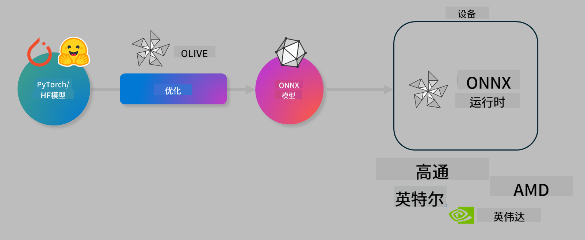

<!--
CO_OP_TRANSLATOR_METADATA:
{
  "original_hash": "76956c0c22e5686908a6d85ec72126af",
  "translation_date": "2025-04-03T06:15:02+00:00",
  "source_file": "code\\03.Finetuning\\olive-lab\\readme.md",
  "language_code": "zh"
}
-->
# 实验：优化 AI 模型以实现设备端推理

## 简介

> [!IMPORTANT]
> 本实验需要安装**Nvidia A10 或 A100 GPU**及相关驱动程序和 CUDA 工具包（版本 12 以上）。

> [!NOTE]
> 本实验为时**35分钟**，将为您提供使用 OLIVE 优化设备端推理模型的核心概念的实践介绍。

## 学习目标

完成本实验后，您将能够使用 OLIVE：

- 使用 AWQ 量化方法对 AI 模型进行量化。
- 为特定任务微调 AI 模型。
- 生成 LoRA 适配器（微调模型），以便在 ONNX Runtime 上实现高效的设备端推理。

### 什么是 Olive

Olive (*O*NNX *live*) 是一个模型优化工具包，配备了 CLI，帮助您为 ONNX runtime +++https://onnxruntime.ai+++ 提供高质量和高性能的模型。



Olive 的输入通常是一个 PyTorch 或 Hugging Face 模型，输出则是一个优化后的 ONNX 模型，该模型将在运行 ONNX runtime 的设备（部署目标）上执行。Olive 会根据硬件供应商（如 Qualcomm、AMD、Nvidia 或 Intel）提供的 AI 加速器（NPU、GPU、CPU）优化模型以适配部署目标。

Olive 执行一个*工作流*，这是一个按顺序排列的单独模型优化任务序列，称为*passes*。示例任务包括：模型压缩、图捕获、量化、图优化。每个任务都有一组参数，可以调整以达到最佳指标，例如准确性和延迟，这些指标由相应的评估器评估。Olive 使用搜索策略，通过搜索算法自动调整每个任务单独或多个任务组合。

#### Olive 的优势

- **减少挫败感和时间**，免去通过反复试验手动实验不同图优化、压缩和量化技术的麻烦。定义您的质量和性能约束，让 Olive 自动找到最佳模型。
- **40 多个内置模型优化组件**，涵盖量化、压缩、图优化和微调的前沿技术。
- **易于使用的 CLI**，可完成常见的模型优化任务。例如：olive quantize、olive auto-opt、olive finetune。
- 内置模型打包和部署功能。
- 支持生成用于**多 LoRA 服务**的模型。
- 使用 YAML/JSON 构建工作流，以协调模型优化和部署任务。
- 与 **Hugging Face** 和 **Azure AI** 集成。
- 内置**缓存机制**，可**节省成本**。

## 实验说明
> [!NOTE]
> 请确保您已按照实验 1 的要求配置 Azure AI Hub 和项目，并设置 A100 计算资源。

### 第 0 步：连接到 Azure AI 计算资源

您将使用 **VS Code** 的远程功能连接到 Azure AI 计算资源。

1. 打开您的 **VS Code** 桌面应用程序：
1. 使用 **Shift+Ctrl+P** 打开 **命令面板**。
1. 在命令面板中搜索 **AzureML - remote: Connect to compute instance in New Window**。
1. 按屏幕上的说明连接到计算资源。这将涉及选择您在实验 1 中设置的 Azure 订阅、资源组、项目和计算名称。
1. 一旦连接到您的 Azure ML 计算节点，连接状态将显示在 **VS Code 的左下角** `><Azure ML: Compute Name`。

### 第 1 步：克隆此仓库

在 VS Code 中，您可以使用 **Ctrl+J** 打开新终端并克隆此仓库：

在终端中，您应该看到提示：

```
azureuser@computername:~/cloudfiles/code$ 
```
克隆解决方案：

```bash
cd ~/localfiles
git clone https://github.com/microsoft/phi-3cookbook.git
```

### 第 2 步：在 VS Code 中打开文件夹

在终端中执行以下命令以在相关文件夹中打开 VS Code，这将打开一个新窗口：

```bash
code phi-3cookbook/code/04.Finetuning/Olive-lab
```

或者，您可以通过选择 **文件** > **打开文件夹** 来打开文件夹。

### 第 3 步：安装依赖项

在 VS Code 的 Azure AI 计算实例中打开终端窗口（提示：**Ctrl+J**），并执行以下命令安装依赖项：

```bash
conda create -n olive-ai python=3.11 -y
conda activate olive-ai
pip install -r requirements.txt
az extension remove -n azure-cli-ml
az extension add -n ml
```

> [!NOTE]
> 安装所有依赖项大约需要 5 分钟。

在本实验中，您将下载并上传模型到 Azure AI 模型目录。为了能够访问模型目录，您需要登录 Azure：

```bash
az login
```

> [!NOTE]
> 登录时，系统会要求您选择订阅。请确保选择为本实验提供的订阅。

### 第 4 步：执行 Olive 命令

在 VS Code 的 Azure AI 计算实例中打开终端窗口（提示：**Ctrl+J**），确保已激活 `olive-ai` conda 环境：

```bash
conda activate olive-ai
```

接下来，在命令行中执行以下 Olive 命令：

1. **检查数据：** 在此示例中，您将微调 Phi-3.5-Mini 模型，使其专注于回答与旅行相关的问题。以下代码将显示数据集的前几条记录，这些记录为 JSON lines 格式：

    ```bash
    head data/data_sample_travel.jsonl
    ```
1. **量化模型：** 在训练模型之前，首先使用以下命令进行量化，该命令使用一种称为主动感知量化（AWQ）的技术 +++https://arxiv.org/abs/2306.00978+++。AWQ 根据推理过程中产生的激活来量化模型的权重。这意味着量化过程会考虑激活中的实际数据分布，与传统权重量化方法相比，更能保留模型的准确性。

    ```bash
    olive quantize \
       --model_name_or_path microsoft/Phi-3.5-mini-instruct \
       --trust_remote_code \
       --algorithm awq \
       --output_path models/phi/awq \
       --log_level 1
    ```

    AWQ 量化大约需要 8 分钟完成，模型大小将从约 7.5GB 减少到约 2.5GB。

    在本实验中，我们展示了如何从 Hugging Face 输入模型（例如：`microsoft/Phi-3.5-mini-instruct`). However, Olive also allows you to input models from the Azure AI catalog by updating the `model_name_or_path` argument to an Azure AI asset ID (for example:  `azureml://registries/azureml/models/Phi-3.5-mini-instruct/versions/4`). 

1. **Train the model:** Next, the `olive finetune` 命令微调量化模型。在量化之后而非之前微调模型可以获得更好的准确性，因为微调过程会恢复量化导致的一些损失。

    ```bash
    olive finetune \
        --method lora \
        --model_name_or_path models/phi/awq \
        --data_files "data/data_sample_travel.jsonl" \
        --data_name "json" \
        --text_template "<|user|>\n{prompt}<|end|>\n<|assistant|>\n{response}<|end|>" \
        --max_steps 100 \
        --output_path ./models/phi/ft \
        --log_level 1
    ```

    微调大约需要 6 分钟（100 步）。

1. **优化：** 在模型训练完成后，您可以使用 Olive 的 `auto-opt` command, which will capture the ONNX graph and automatically perform a number of optimizations to improve the model performance for CPU by compressing the model and doing fusions. It should be noted, that you can also optimize for other devices such as NPU or GPU by just updating the `--device` and `--provider` 参数优化模型，但在本实验中我们将使用 CPU。

    ```bash
    olive auto-opt \
       --model_name_or_path models/phi/ft/model \
       --adapter_path models/phi/ft/adapter \
       --device cpu \
       --provider CPUExecutionProvider \
       --use_ort_genai \
       --output_path models/phi/onnx-ao \
       --log_level 1
    ```

    优化大约需要 5 分钟完成。

### 第 5 步：快速测试模型推理

为了测试模型的推理功能，请在您的文件夹中创建一个名为 **app.py** 的 Python 文件，并复制粘贴以下代码：

```python
import onnxruntime_genai as og
import numpy as np

print("loading model and adapters...", end="", flush=True)
model = og.Model("models/phi/onnx-ao/model")
adapters = og.Adapters(model)
adapters.load("models/phi/onnx-ao/model/adapter_weights.onnx_adapter", "travel")
print("DONE!")

tokenizer = og.Tokenizer(model)
tokenizer_stream = tokenizer.create_stream()

params = og.GeneratorParams(model)
params.set_search_options(max_length=100, past_present_share_buffer=False)
user_input = "what is the best thing to see in chicago"
params.input_ids = tokenizer.encode(f"<|user|>\n{user_input}<|end|>\n<|assistant|>\n")

generator = og.Generator(model, params)

generator.set_active_adapter(adapters, "travel")

print(f"{user_input}")

while not generator.is_done():
    generator.compute_logits()
    generator.generate_next_token()

    new_token = generator.get_next_tokens()[0]
    print(tokenizer_stream.decode(new_token), end='', flush=True)

print("\n")
```

使用以下命令执行代码：

```bash
python app.py
```

### 第 6 步：上传模型到 Azure AI

将模型上传到 Azure AI 模型库可以使模型可以与开发团队的其他成员共享，并且可以处理模型的版本控制。要上传模型，请运行以下命令：

> [!NOTE]
> 更新 `{}` 占位符为您的 `resourceGroup` 和 Azure AI 项目名称，然后运行以下命令：

```
az ml workspace show
```

或者，您可以访问 +++ai.azure.com+++ 并选择 **管理中心** > **项目** > **概览**。

更新 `{}` 占位符为您的资源组名称和 Azure AI 项目名称。

```bash
az ml model create \
    --name ft-for-travel \
    --version 1 \
    --path ./models/phi/onnx-ao \
    --resource-group {RESOURCE_GROUP_NAME} \
    --workspace-name {PROJECT_NAME}
```
然后，您可以在 https://ml.azure.com/model/list 查看已上传的模型并进行部署。

**免责声明**：  
本文档使用 AI 翻译服务 [Co-op Translator](https://github.com/Azure/co-op-translator) 翻译而成。尽管我们努力确保翻译的准确性，但请注意，自动翻译可能包含错误或不准确之处。应以原始语言的文档为权威来源。对于关键信息，建议使用专业人工翻译。因使用本翻译而导致的任何误解或误读，我们概不负责。