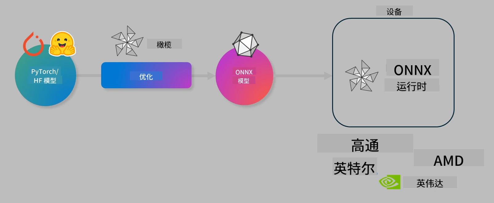

<!--
CO_OP_TRANSLATOR_METADATA:
{
  "original_hash": "6bbe47de3b974df7eea29dfeccf6032b",
  "translation_date": "2025-07-16T16:09:18+00:00",
  "source_file": "code/04.Finetuning/olive-lab/readme.md",
  "language_code": "zh"
}
-->
# 实验室：优化 AI 模型以实现设备端推理

## 介绍

> [!IMPORTANT]  
> 本实验需要配备 **Nvidia A10 或 A100 GPU**，并安装相应的驱动程序和 CUDA 工具包（版本 12 及以上）。

> [!NOTE]  
> 这是一个 **35 分钟** 的实验，将带你动手了解使用 OLIVE 优化模型以实现设备端推理的核心概念。

## 学习目标

完成本实验后，你将能够使用 OLIVE 来：

- 使用 AWQ 量化方法对 AI 模型进行量化。
- 针对特定任务微调 AI 模型。
- 生成 LoRA 适配器（微调模型），以便在 ONNX Runtime 上高效进行设备端推理。

### 什么是 Olive

Olive（*O*NNX *live*）是一个模型优化工具包，配有命令行界面，能够帮助你为 ONNX runtime +++https://onnxruntime.ai+++ 提供高质量和高性能的模型。



Olive 的输入通常是 PyTorch 或 Hugging Face 模型，输出是一个经过优化的 ONNX 模型，该模型将在运行 ONNX runtime 的设备（部署目标）上执行。Olive 会针对部署目标的 AI 加速器（NPU、GPU、CPU）进行优化，这些硬件由 Qualcomm、AMD、Nvidia 或 Intel 等厂商提供。

Olive 执行一个*工作流*，即一系列有序的模型优化任务，称为*passes*——示例包括：模型压缩、图捕获、量化、图优化。每个 pass 都有一组可调参数，用于实现最佳指标，比如准确率和延迟，这些指标由相应的评估器进行评估。Olive 采用搜索策略，使用搜索算法逐个或批量自动调优每个 pass。

#### Olive 的优势

- **减少手动试错的挫败感和时间**，无需反复尝试不同的图优化、压缩和量化技术。定义你的质量和性能约束，Olive 会自动帮你找到最佳模型。
- **内置 40 多个模型优化组件**，涵盖量化、压缩、图优化和微调的前沿技术。
- **易用的命令行工具**，支持常见的模型优化任务。例如，olive quantize、olive auto-opt、olive finetune。
- 内置模型打包和部署功能。
- 支持生成用于 **多 LoRA 服务** 的模型。
- 使用 YAML/JSON 构建工作流，协调模型优化和部署任务。
- 集成 **Hugging Face** 和 **Azure AI**。
- 内置 **缓存** 机制，帮助 **节省成本**。

## 实验步骤
> [!NOTE]  
> 请确保你已按照实验 1 的要求配置好 Azure AI Hub 和项目，并设置好 A100 计算资源。

### 步骤 0：连接到你的 Azure AI 计算资源

你将使用 **VS Code** 的远程功能连接到 Azure AI 计算资源。

1. 打开你的 **VS Code** 桌面应用程序。  
2. 使用 **Shift+Ctrl+P** 打开 **命令面板**。  
3. 在命令面板中搜索 **AzureML - remote: Connect to compute instance in New Window**。  
4. 按照屏幕提示连接计算资源，这包括选择你的 Azure 订阅、资源组、项目和你在实验 1 中设置的计算名称。  
5. 连接成功后，VS Code 左下角会显示 `><Azure ML: Compute Name`。

### 步骤 1：克隆此仓库

在 VS Code 中，按 **Ctrl+J** 打开新终端，克隆此仓库：

终端中应显示提示：

```
azureuser@computername:~/cloudfiles/code$ 
```  
克隆解决方案

```bash
cd ~/localfiles
git clone https://github.com/microsoft/phi-3cookbook.git
```

### 步骤 2：在 VS Code 中打开文件夹

在终端执行以下命令打开相关文件夹，会弹出新窗口：

```bash
code phi-3cookbook/code/04.Finetuning/Olive-lab
```

或者，你也可以通过选择 **文件** > **打开文件夹** 来打开。

### 步骤 3：安装依赖

在 VS Code 中的 Azure AI 计算实例终端（提示：**Ctrl+J**）执行以下命令安装依赖：

```bash
conda create -n olive-ai python=3.11 -y
conda activate olive-ai
pip install -r requirements.txt
az extension remove -n azure-cli-ml
az extension add -n ml
```

> [!NOTE]  
> 安装所有依赖大约需要 5 分钟。

本实验中你将下载并上传模型到 Azure AI 模型目录。为访问模型目录，你需要登录 Azure：

```bash
az login
```

> [!NOTE]  
> 登录时会要求选择订阅，请确保选择本实验提供的订阅。

### 步骤 4：执行 Olive 命令

在 VS Code 中的 Azure AI 计算实例终端（提示：**Ctrl+J**）确保激活了 `olive-ai` conda 环境：

```bash
conda activate olive-ai
```

接下来，在命令行执行以下 Olive 命令。

1. **查看数据：** 本例中，你将微调 Phi-3.5-Mini 模型，使其专注于回答旅游相关问题。以下代码展示了数据集的前几条记录，数据格式为 JSON 行：

    ```bash
    head data/data_sample_travel.jsonl
    ```

2. **量化模型：** 在训练模型之前，先用以下命令进行量化，采用一种称为 Active Aware Quantization (AWQ) +++https://arxiv.org/abs/2306.00978+++ 的技术。AWQ 通过考虑推理时产生的激活值来量化模型权重，这意味着量化过程考虑了激活的实际数据分布，相比传统的权重量化方法能更好地保持模型准确度。

    ```bash
    olive quantize \
       --model_name_or_path microsoft/Phi-3.5-mini-instruct \
       --trust_remote_code \
       --algorithm awq \
       --output_path models/phi/awq \
       --log_level 1
    ```

    AWQ 量化大约需要 **8 分钟**，能将模型大小从约 7.5GB 减少到约 2.5GB。

    本实验演示如何从 Hugging Face 输入模型（例如：`microsoft/Phi-3.5-mini-instruct`）。Olive 也支持通过将 `model_name_or_path` 参数更新为 Azure AI 资产 ID（例如：`azureml://registries/azureml/models/Phi-3.5-mini-instruct/versions/4`）来输入 Azure AI 目录中的模型。

3. **训练模型：** 接着，使用 `olive finetune` 命令微调量化后的模型。先量化再微调比先微调后量化能获得更好的准确度，因为微调过程能恢复部分量化带来的损失。

    ```bash
    olive finetune \
        --method lora \
        --model_name_or_path models/phi/awq \
        --data_files "data/data_sample_travel.jsonl" \
        --data_name "json" \
        --text_template "<|user|>\n{prompt}<|end|>\n<|assistant|>\n{response}<|end|>" \
        --max_steps 100 \
        --output_path ./models/phi/ft \
        --log_level 1
    ```

    微调（100 步）大约需要 **6 分钟**。

4. **优化模型：** 模型训练完成后，使用 Olive 的 `auto-opt` 命令优化模型，该命令会捕获 ONNX 图并自动执行多项优化，以通过压缩和融合提升 CPU 上的模型性能。需要注意的是，你也可以通过更新 `--device` 和 `--provider` 参数来针对 NPU 或 GPU 进行优化，但本实验中我们使用 CPU。

    ```bash
    olive auto-opt \
       --model_name_or_path models/phi/ft/model \
       --adapter_path models/phi/ft/adapter \
       --device cpu \
       --provider CPUExecutionProvider \
       --use_ort_genai \
       --output_path models/phi/onnx-ao \
       --log_level 1
    ```

    优化过程大约需要 **5 分钟**。

### 步骤 5：模型推理快速测试

为了测试模型推理，在你的文件夹中创建一个名为 **app.py** 的 Python 文件，并复制粘贴以下代码：

```python
import onnxruntime_genai as og
import numpy as np

print("loading model and adapters...", end="", flush=True)
model = og.Model("models/phi/onnx-ao/model")
adapters = og.Adapters(model)
adapters.load("models/phi/onnx-ao/model/adapter_weights.onnx_adapter", "travel")
print("DONE!")

tokenizer = og.Tokenizer(model)
tokenizer_stream = tokenizer.create_stream()

params = og.GeneratorParams(model)
params.set_search_options(max_length=100, past_present_share_buffer=False)
user_input = "what is the best thing to see in chicago"
params.input_ids = tokenizer.encode(f"<|user|>\n{user_input}<|end|>\n<|assistant|>\n")

generator = og.Generator(model, params)

generator.set_active_adapter(adapters, "travel")

print(f"{user_input}")

while not generator.is_done():
    generator.compute_logits()
    generator.generate_next_token()

    new_token = generator.get_next_tokens()[0]
    print(tokenizer_stream.decode(new_token), end='', flush=True)

print("\n")
```

使用以下命令运行代码：

```bash
python app.py
```

### 步骤 6：上传模型到 Azure AI

将模型上传到 Azure AI 模型仓库，可以让团队成员共享模型，并支持模型版本控制。上传模型请运行以下命令：

> [!NOTE]  
> 请将 `{}` 占位符替换为你的资源组名称和 Azure AI 项目名称。

若要查找资源组 `"resourceGroup"` 和 Azure AI 项目名称，请运行以下命令：

```
az ml workspace show
```

或者访问 +++ai.azure.com+++，选择 **管理中心** > **项目** > **概览**。

将 `{}` 占位符替换为你的资源组名称和 Azure AI 项目名称。

```bash
az ml model create \
    --name ft-for-travel \
    --version 1 \
    --path ./models/phi/onnx-ao \
    --resource-group {RESOURCE_GROUP_NAME} \
    --workspace-name {PROJECT_NAME}
```

然后你可以在 https://ml.azure.com/model/list 查看已上传的模型并进行部署。

**免责声明**：  
本文件使用 AI 翻译服务 [Co-op Translator](https://github.com/Azure/co-op-translator) 进行翻译。虽然我们力求准确，但请注意，自动翻译可能包含错误或不准确之处。原始语言的文档应被视为权威来源。对于重要信息，建议使用专业人工翻译。对于因使用本翻译而产生的任何误解或误释，我们不承担任何责任。