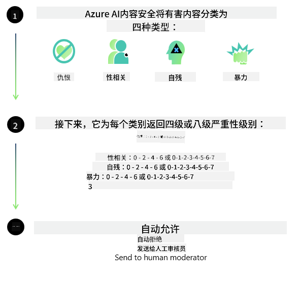
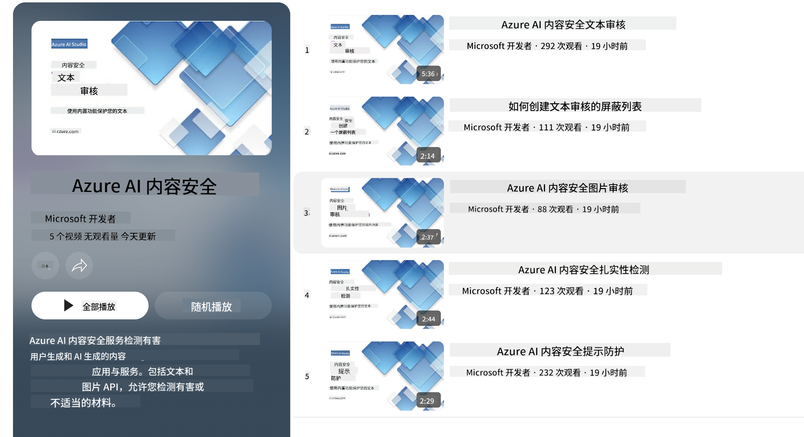

<!--
CO_OP_TRANSLATOR_METADATA:
{
  "original_hash": "1f6b561a224336bd4f413176ec40d994",
  "translation_date": "2025-04-03T06:32:34+00:00",
  "source_file": "md\\01.Introduction\\01\\01.AISafety.md",
  "language_code": "zh"
}
-->
# Phi 模型的 AI 安全性

Phi 系列模型是根据 [Microsoft Responsible AI Standard](https://query.prod.cms.rt.microsoft.com/cms/api/am/binary/RE5cmFl) 开发的，这是基于以下六项原则的公司级要求：责任、透明性、公平性、可靠性与安全性、隐私与安全性以及包容性，这些原则构成了 [Microsoft 的负责任 AI 原则](https://www.microsoft.com/ai/responsible-ai)。

与之前的 Phi 模型一样，此次发布采用了多方面的安全评估和安全后训练方法，并采取了额外措施以应对多语言能力。我们在 [Phi 安全后训练论文](https://arxiv.org/abs/2407.13833) 中概述了我们对安全训练和评估的做法，包括在多种语言和风险类别中的测试。尽管 Phi 模型受益于这些方法，开发者仍应应用负责任的 AI 最佳实践，包括映射、测量和缓解与其特定使用场景及文化和语言环境相关的风险。

## 最佳实践

与其他模型一样，Phi 系列模型可能会以不公平、不可靠或冒犯的方式表现。

需要注意的一些 SLM 和 LLM 的限制行为包括：

- **服务质量：** Phi 模型主要基于英语文本进行训练。非英语语言的性能会较差，而在训练数据中代表性较低的英语语言变体可能会比标准美式英语表现更差。
- **伤害表现与刻板印象的延续：** 这些模型可能会过度或不足地代表某些群体，抹去某些群体的存在，或强化贬低性或负面的刻板印象。尽管进行了安全后训练，但由于不同群体的代表性水平不同或训练数据中反映现实世界模式和社会偏见的负面刻板印象示例的普遍性，这些限制可能仍然存在。
- **不适当或冒犯性内容：** 这些模型可能会生成其他类型的不适当或冒犯性内容，这可能使其在没有针对具体使用场景的额外缓解措施的情况下，不适合在敏感场景中部署。
- **信息可靠性：** 语言模型可能会生成无意义的内容，或捏造听起来合理但实际上不准确或过时的内容。
- **代码范围有限：** Phi-3 的大部分训练数据基于 Python，并使用了常见的包，例如 "typing, math, random, collections, datetime, itertools"。如果模型生成的 Python 脚本使用了其他包或其他语言的脚本，我们强烈建议用户手动验证所有 API 的使用。

开发者应应用负责任的 AI 最佳实践，并负责确保特定使用场景符合相关法律法规（例如隐私、贸易等）。

## 负责任 AI 的注意事项

与其他语言模型一样，Phi 系列模型可能会以不公平、不可靠或冒犯的方式表现。需要注意的一些限制行为包括：

**服务质量：** Phi 模型主要基于英语文本进行训练。非英语语言的性能会较差，而在训练数据中代表性较低的英语语言变体可能会比标准美式英语表现更差。

**伤害表现与刻板印象的延续：** 这些模型可能会过度或不足地代表某些群体，抹去某些群体的存在，或强化贬低性或负面的刻板印象。尽管进行了安全后训练，但由于不同群体的代表性水平不同或训练数据中反映现实世界模式和社会偏见的负面刻板印象示例的普遍性，这些限制可能仍然存在。

**不适当或冒犯性内容：** 这些模型可能会生成其他类型的不适当或冒犯性内容，这可能使其在没有针对具体使用场景的额外缓解措施的情况下，不适合在敏感场景中部署。

**信息可靠性：** 语言模型可能会生成无意义的内容，或捏造听起来合理但实际上不准确或过时的内容。

**代码范围有限：** Phi-3 的大部分训练数据基于 Python，并使用了常见的包，例如 "typing, math, random, collections, datetime, itertools"。如果模型生成的 Python 脚本使用了其他包或其他语言的脚本，我们强烈建议用户手动验证所有 API 的使用。

开发者应应用负责任的 AI 最佳实践，并负责确保特定使用场景符合相关法律法规（例如隐私、贸易等）。需要重点考虑的领域包括：

**分配：** 在可能对法律地位、资源分配或生活机会（例如住房、就业、信贷等）产生重大影响的场景中，模型可能不适用，除非进行了进一步的评估和额外的去偏技术。

**高风险场景：** 开发者应评估在高风险场景中使用模型的适用性，这些场景中不公平、不可靠或冒犯的输出可能会带来极高的代价或导致伤害。这包括在敏感或专业领域中提供建议的场景，在这些领域中，准确性和可靠性至关重要（例如法律或健康建议）。应根据部署环境在应用层面实施额外的保护措施。

**错误信息：** 模型可能会生成不准确的信息。开发者应遵循透明性最佳实践，并告知最终用户他们正在与 AI 系统交互。在应用层面，开发者可以构建反馈机制和管道，将响应与特定使用场景的上下文信息相结合，这种技术被称为检索增强生成 (RAG)。

**有害内容的生成：** 开发者应根据上下文评估输出，并使用可用的安全分类器或适合其使用场景的定制解决方案。

**滥用：** 其他形式的滥用（例如欺诈、垃圾信息或恶意软件生产）可能会发生，开发者应确保其应用程序不违反适用的法律法规。

### 微调和 AI 内容安全

在对模型进行微调后，我们强烈建议利用 [Azure AI Content Safety](https://learn.microsoft.com/azure/ai-services/content-safety/overview) 措施来监控模型生成的内容，识别并阻止潜在的风险、威胁和质量问题。

[Azure AI Content Safety](https://learn.microsoft.com/azure/ai-services/content-safety/overview) 支持文本和图像内容，可在云端、离线容器以及边缘/嵌入式设备上部署。

## Azure AI 内容安全概览

Azure AI Content Safety 不是一刀切的解决方案；它可以根据企业的具体政策进行定制。此外，其多语言模型使其能够同时理解多种语言。

- **Azure AI 内容安全**
- **Microsoft 开发者**
- **5 个视频**

Azure AI 内容安全服务可检测应用程序和服务中用户生成和 AI 生成的有害内容。它包括文本和图像 API，允许您检测有害或不适当的材料。

[AI 内容安全播放列表](https://www.youtube.com/playlist?list=PLlrxD0HtieHjaQ9bJjyp1T7FeCbmVcPkQ)

**免责声明**：  
本文档使用 AI 翻译服务 [Co-op Translator](https://github.com/Azure/co-op-translator) 进行翻译。虽然我们努力确保翻译的准确性，但请注意，自动翻译可能会包含错误或不准确之处。应以原文档的母语版本作为权威来源。对于关键信息，建议使用专业人工翻译。对于因使用本翻译而产生的任何误解或误读，我们概不负责。