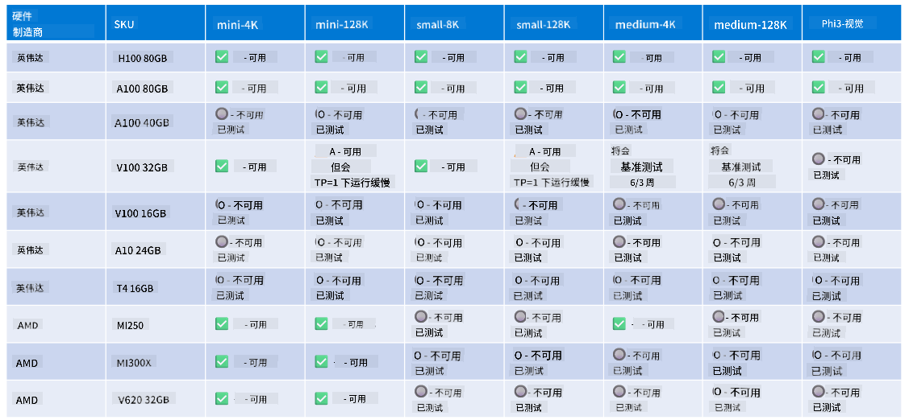

<!--
CO_OP_TRANSLATOR_METADATA:
{
  "original_hash": "c4afa6ffd13f29eb34e5f204b94310ff",
  "translation_date": "2025-04-03T06:37:59+00:00",
  "source_file": "md\\01.Introduction\\01\\01.Hardwaresupport.md",
  "language_code": "zh"
}
-->
# Phi 硬件支持

Microsoft Phi 已针对 ONNX Runtime 进行了优化，并支持 Windows DirectML。它在多种硬件类型上表现良好，包括 GPU、CPU，甚至是移动设备。

## 设备硬件
具体支持的硬件包括：

- GPU 型号：RTX 4090（DirectML）
- GPU 型号：1 A100 80GB（CUDA）
- CPU 型号：标准 F64s v2（64 个 vCPU，128 GiB 内存）

## 移动设备型号

- 安卓设备 - 三星 Galaxy S21
- 苹果 iPhone 14 或更高版本，A16/A17 处理器

## Phi 硬件规格

- 最低配置要求：
- Windows：支持 DirectX 12 的 GPU，至少 4GB 的综合内存

CUDA：NVIDIA GPU，计算能力 >= 7.02



## 在多个 GPU 上运行 onnxruntime

目前可用的 Phi ONNX 模型仅支持 1 个 GPU。虽然可以为 Phi 模型支持多 GPU，但使用 ORT 的 2 个 GPU 不保证会比运行 2 个 ORT 实例获得更高的吞吐量。请访问 [ONNX Runtime](https://onnxruntime.ai/) 了解最新动态。

在 [Build 2024 的 GenAI ONNX 团队](https://youtu.be/WLW4SE8M9i8?si=EtG04UwDvcjunyfC) 宣布，他们已经为 Phi 模型启用了多实例支持，而不是多 GPU。

目前，这允许您使用 CUDA_VISIBLE_DEVICES 环境变量运行一个 onnxruntime 或 onnxruntime-genai 实例，如下所示：

```Python
CUDA_VISIBLE_DEVICES=0 python infer.py
CUDA_VISIBLE_DEVICES=1 python infer.py
```

欢迎进一步探索 [Azure AI Foundry](https://ai.azure.com) 上的 Phi。

**免责声明**：  
本文档使用 AI 翻译服务 [Co-op Translator](https://github.com/Azure/co-op-translator) 进行翻译。虽然我们努力确保翻译的准确性，但请注意，自动翻译可能会包含错误或不准确之处。应以原始语言版本的文档作为权威来源。对于关键信息，建议使用专业的人工翻译。我们不对因使用此翻译而引起的任何误解或误读承担责任。