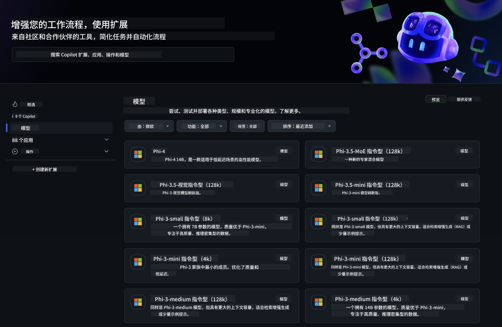
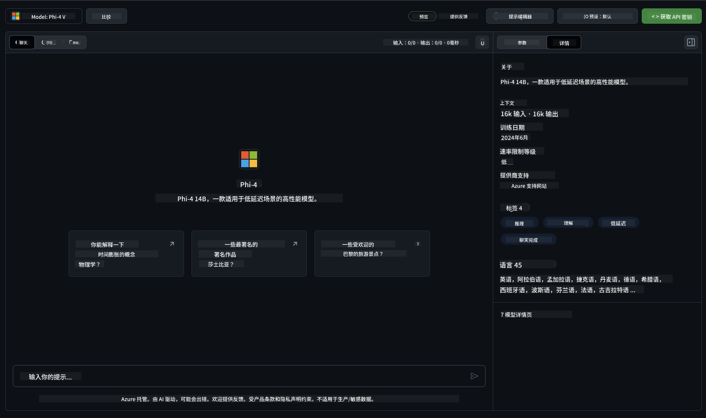
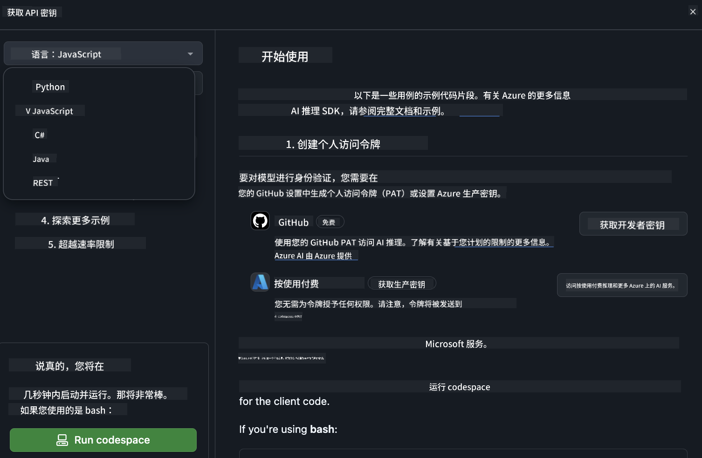
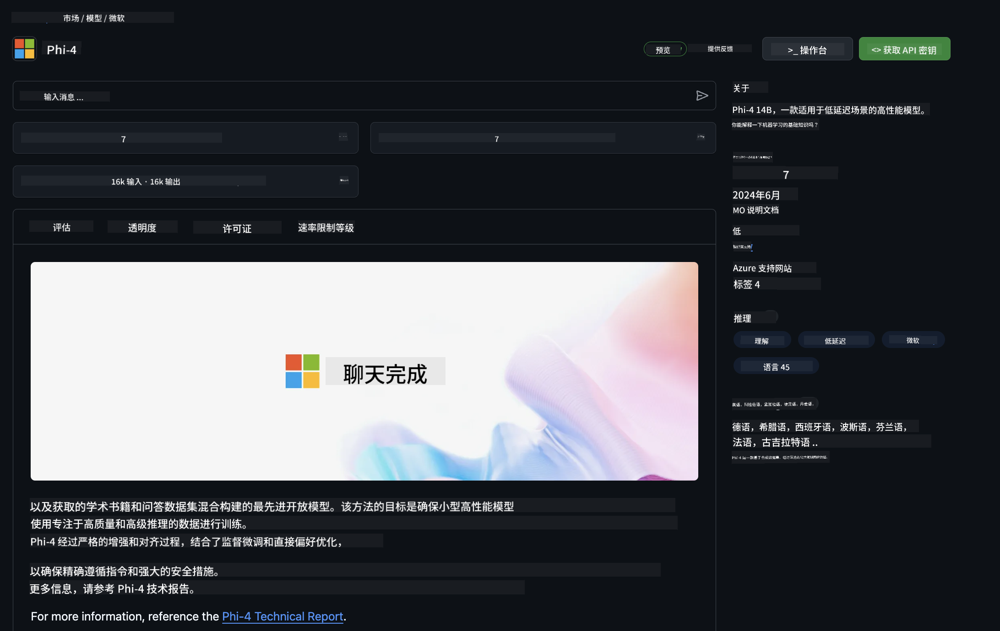

<!--
CO_OP_TRANSLATOR_METADATA:
{
  "original_hash": "fb67a08b9fc911a10ed58081fadef416",
  "translation_date": "2025-05-07T15:11:06+00:00",
  "source_file": "md/01.Introduction/02/02.GitHubModel.md",
  "language_code": "zh"
}
-->
## GitHub Models 中的 Phi 系列

欢迎来到 [GitHub Models](https://github.com/marketplace/models)！我们已经为您准备好了在 Azure AI 上托管的 AI 模型，等待您来探索。



想了解更多关于 GitHub Models 中可用模型的信息，请查看 [GitHub Model Marketplace](https://github.com/marketplace/models)

## 可用模型

每个模型都配有专属的 Playground 和示例代码



### GitHub 模型目录中的 Phi 系列

- [Phi-4](https://github.com/marketplace/models/azureml/Phi-4)

- [Phi-3.5-MoE instruct (128k)](https://github.com/marketplace/models/azureml/Phi-3-5-MoE-instruct)

- [Phi-3.5-vision instruct (128k)](https://github.com/marketplace/models/azureml/Phi-3-5-vision-instruct)

- [Phi-3.5-mini instruct (128k)](https://github.com/marketplace/models/azureml/Phi-3-5-mini-instruct)

- [Phi-3-Medium-128k-Instruct](https://github.com/marketplace/models/azureml/Phi-3-medium-128k-instruct)

- [Phi-3-medium-4k-instruct](https://github.com/marketplace/models/azureml/Phi-3-medium-4k-instruct)

- [Phi-3-mini-128k-instruct](https://github.com/marketplace/models/azureml/Phi-3-mini-128k-instruct)

- [Phi-3-mini-4k-instruct](https://github.com/marketplace/models/azureml/Phi-3-mini-4k-instruct)

- [Phi-3-small-128k-instruct](https://github.com/marketplace/models/azureml/Phi-3-small-128k-instruct)

- [Phi-3-small-8k-instruct](https://github.com/marketplace/models/azureml/Phi-3-small-8k-instruct)

## 快速开始

这里有一些基础示例，您可以直接运行。它们都放在 samples 目录中。如果您想直接使用自己喜欢的编程语言，以下语言的示例代码也都可用：

- Python
- JavaScript
- C#
- Java
- cURL

此外，还有专门的 Codespaces 环境用于运行示例和模型。



## 示例代码

以下是几个使用场景的示例代码片段。有关 Azure AI Inference SDK 的更多信息，请参阅完整文档和示例。

## 设置

1. 创建个人访问令牌  
您不需要为令牌赋予任何权限。请注意，令牌会发送到微软服务。

要使用下面的代码片段，请创建一个环境变量，将令牌设置为客户端代码的密钥。

如果您使用 bash：  
```
export GITHUB_TOKEN="<your-github-token-goes-here>"
```  
如果您使用 powershell：  

```
$Env:GITHUB_TOKEN="<your-github-token-goes-here>"
```  

如果您使用 Windows 命令提示符：  

```
set GITHUB_TOKEN=<your-github-token-goes-here>
```

## Python 示例

### 安装依赖  
使用 pip 安装 Azure AI Inference SDK（要求：Python >=3.8）：

```
pip install azure-ai-inference
```

### 运行基础示例

此示例演示了如何调用聊天完成 API。它使用 GitHub AI 模型推理端点和您的 GitHub 令牌。调用为同步执行。

```python
import os
from azure.ai.inference import ChatCompletionsClient
from azure.ai.inference.models import SystemMessage, UserMessage
from azure.core.credentials import AzureKeyCredential

endpoint = "https://models.inference.ai.azure.com"
model_name = "Phi-4"
token = os.environ["GITHUB_TOKEN"]

client = ChatCompletionsClient(
    endpoint=endpoint,
    credential=AzureKeyCredential(token),
)

response = client.complete(
    messages=[
        UserMessage(content="I have $20,000 in my savings account, where I receive a 4% profit per year and payments twice a year. Can you please tell me how long it will take for me to become a millionaire? Also, can you please explain the math step by step as if you were explaining it to an uneducated person?"),
    ],
    temperature=0.4,
    top_p=1.0,
    max_tokens=2048,
    model=model_name
)

print(response.choices[0].message.content)
```

### 运行多轮对话

此示例展示了如何使用聊天完成 API 进行多轮对话。在构建聊天应用时，您需要管理对话历史，并将最新消息发送给模型。

```
import os
from azure.ai.inference import ChatCompletionsClient
from azure.ai.inference.models import AssistantMessage, SystemMessage, UserMessage
from azure.core.credentials import AzureKeyCredential

token = os.environ["GITHUB_TOKEN"]
endpoint = "https://models.inference.ai.azure.com"
# Replace Model_Name
model_name = "Phi-4"

client = ChatCompletionsClient(
    endpoint=endpoint,
    credential=AzureKeyCredential(token),
)

messages = [
    SystemMessage(content="You are a helpful assistant."),
    UserMessage(content="What is the capital of France?"),
    AssistantMessage(content="The capital of France is Paris."),
    UserMessage(content="What about Spain?"),
]

response = client.complete(messages=messages, model=model_name)

print(response.choices[0].message.content)
```

### 流式输出

为了获得更好的用户体验，您可以流式传输模型响应，这样首个 token 会更快出现，避免长时间等待完整响应。

```
import os
from azure.ai.inference import ChatCompletionsClient
from azure.ai.inference.models import SystemMessage, UserMessage
from azure.core.credentials import AzureKeyCredential

token = os.environ["GITHUB_TOKEN"]
endpoint = "https://models.inference.ai.azure.com"
# Replace Model_Name
model_name = "Phi-4"

client = ChatCompletionsClient(
    endpoint=endpoint,
    credential=AzureKeyCredential(token),
)

response = client.complete(
    stream=True,
    messages=[
        SystemMessage(content="You are a helpful assistant."),
        UserMessage(content="Give me 5 good reasons why I should exercise every day."),
    ],
    model=model_name,
)

for update in response:
    if update.choices:
        print(update.choices[0].delta.content or "", end="")

client.close()
```

## GitHub Models 的免费使用和速率限制



[playground 和免费 API 使用的速率限制](https://docs.github.com/en/github-models/prototyping-with-ai-models#rate-limits)旨在帮助您试验模型并快速构建 AI 应用原型。若超出这些限制，或想让应用规模化运行，您需要从 Azure 账户中配置资源，并从那里进行身份验证，而非使用 GitHub 个人访问令牌。您无需更改代码中的其他内容。点击此链接了解如何突破 Azure AI 免费额度限制。

### 免责声明

请记住，您在与模型交互时是在试验 AI，内容可能存在错误。

此功能受到多种限制（包括每分钟请求数、每日请求数、每次请求的 token 数和并发请求数），不适合生产环境使用。

GitHub Models 使用 Azure AI 内容安全过滤器。作为 GitHub Models 体验的一部分，无法关闭这些过滤器。如果您选择通过付费服务使用模型，请根据需求配置内容过滤器。

此服务受 GitHub 预发布条款约束。

**免责声明**：  
本文件由 AI 翻译服务 [Co-op Translator](https://github.com/Azure/co-op-translator) 翻译而成。尽管我们力求准确，但请注意，自动翻译可能存在错误或不准确之处。原始文件的母语版本应被视为权威来源。对于重要信息，建议采用专业人工翻译。对于因使用本翻译而引起的任何误解或误释，我们不承担任何责任。