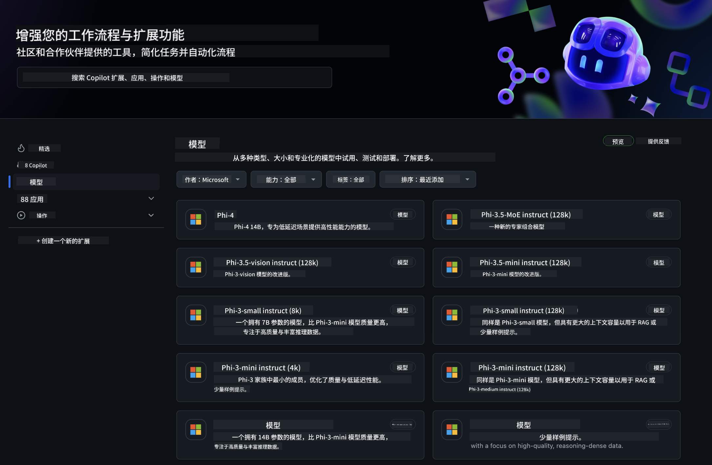
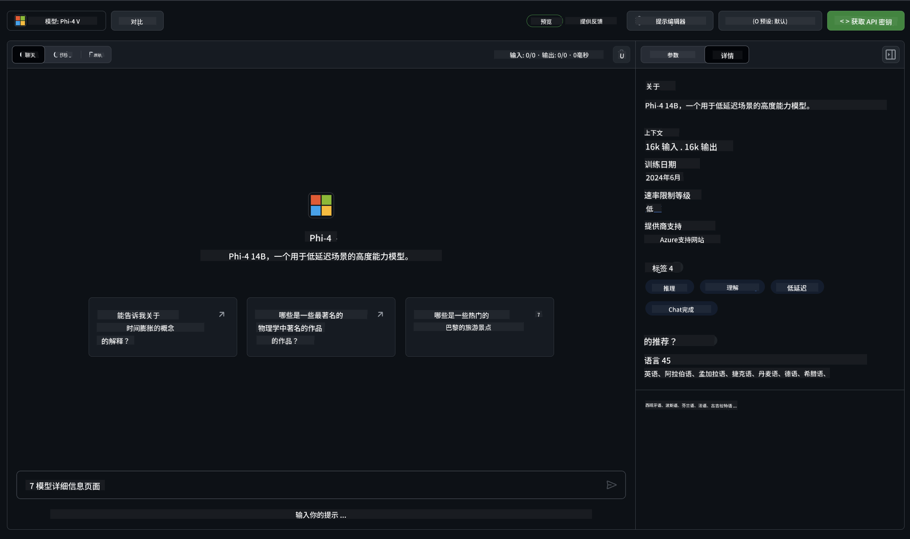
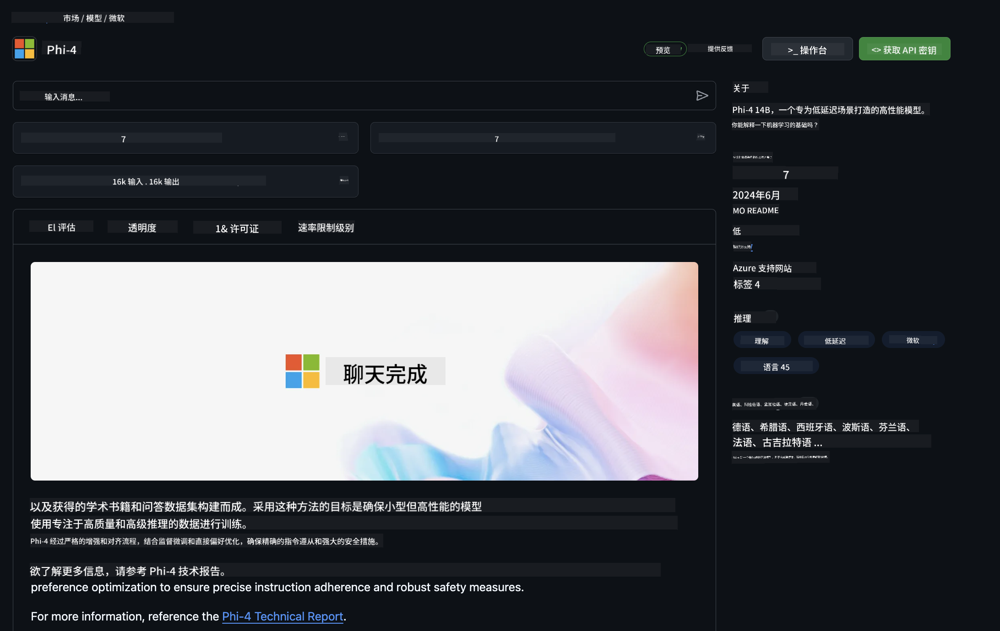

<!--
CO_OP_TRANSLATOR_METADATA:
{
  "original_hash": "fa5cdbc832e5bcffebb25ce25ec1a3c3",
  "translation_date": "2025-04-03T06:42:02+00:00",
  "source_file": "md\\01.Introduction\\02\\02.GitHubModel.md",
  "language_code": "zh"
}
-->
## GitHub 模型中的 Phi 系列

欢迎来到 [GitHub 模型](https://github.com/marketplace/models)！我们已为您准备好一切，您可以探索托管在 Azure AI 上的 AI 模型。



有关 GitHub 模型中可用模型的更多信息，请查看 [GitHub 模型市场](https://github.com/marketplace/models)。

## 可用模型

每个模型都有专属的交互式体验区和示例代码。



### GitHub 模型目录中的 Phi 系列

- [Phi-4](https://github.com/marketplace/models/azureml/Phi-4)

- [Phi-3.5-MoE instruct (128k)](https://github.com/marketplace/models/azureml/Phi-3-5-MoE-instruct)

- [Phi-3.5-vision instruct (128k)](https://github.com/marketplace/models/azureml/Phi-3-5-vision-instruct)

- [Phi-3.5-mini instruct (128k)](https://github.com/marketplace/models/azureml/Phi-3-5-mini-instruct)

- [Phi-3-Medium-128k-Instruct](https://github.com/marketplace/models/azureml/Phi-3-medium-128k-instruct)

- [Phi-3-medium-4k-instruct](https://github.com/marketplace/models/azureml/Phi-3-medium-4k-instruct)

- [Phi-3-mini-128k-instruct](https://github.com/marketplace/models/azureml/Phi-3-mini-128k-instruct)

- [Phi-3-mini-4k-instruct](https://github.com/marketplace/models/azureml/Phi-3-mini-4k-instruct)

- [Phi-3-small-128k-instruct](https://github.com/marketplace/models/azureml/Phi-3-small-128k-instruct)

- [Phi-3-small-8k-instruct](https://github.com/marketplace/models/azureml/Phi-3-small-8k-instruct)

## 入门指南

我们为您准备了一些基本示例，可以直接运行。您可以在 samples 目录中找到这些示例。如果您希望快速使用自己熟悉的语言，可以在以下语言中找到示例：

- Python
- JavaScript
- C#
- Java
- cURL

我们还提供了专属的 Codespaces 环境，用于运行示例和模型。


## 示例代码

以下是一些用例的示例代码片段。有关 Azure AI Inference SDK 的更多信息，请参阅完整文档和示例。

## 设置

1. 创建个人访问令牌  
您无需为令牌授予任何权限。请注意，令牌将发送到 Microsoft 服务。

要使用以下代码片段，请创建一个环境变量，将令牌设置为客户端代码的密钥。

如果您使用的是 bash:
```
export GITHUB_TOKEN="<your-github-token-goes-here>"
```  
如果您使用的是 powershell:

```
$Env:GITHUB_TOKEN="<your-github-token-goes-here>"
```  

如果您使用的是 Windows 命令提示符:

```
set GITHUB_TOKEN=<your-github-token-goes-here>
```  

## Python 示例

### 安装依赖项  
使用 pip 安装 Azure AI Inference SDK (要求：Python >=3.8):

```
pip install azure-ai-inference
```  

### 运行基础代码示例  

此示例展示了如何调用聊天补全 API 的基本方法。它利用了 GitHub AI 模型推理端点和您的 GitHub 令牌。调用是同步的。

```python
import os
from azure.ai.inference import ChatCompletionsClient
from azure.ai.inference.models import SystemMessage, UserMessage
from azure.core.credentials import AzureKeyCredential

endpoint = "https://models.inference.ai.azure.com"
model_name = "Phi-4"
token = os.environ["GITHUB_TOKEN"]

client = ChatCompletionsClient(
    endpoint=endpoint,
    credential=AzureKeyCredential(token),
)

response = client.complete(
    messages=[
        UserMessage(content="I have $20,000 in my savings account, where I receive a 4% profit per year and payments twice a year. Can you please tell me how long it will take for me to become a millionaire? Also, can you please explain the math step by step as if you were explaining it to an uneducated person?"),
    ],
    temperature=0.4,
    top_p=1.0,
    max_tokens=2048,
    model=model_name
)

print(response.choices[0].message.content)
```  

### 运行多轮对话  

此示例展示了如何通过聊天补全 API 进行多轮对话。当您将模型用于聊天应用时，需要管理对话的历史记录并将最新消息发送到模型。

```
import os
from azure.ai.inference import ChatCompletionsClient
from azure.ai.inference.models import AssistantMessage, SystemMessage, UserMessage
from azure.core.credentials import AzureKeyCredential

token = os.environ["GITHUB_TOKEN"]
endpoint = "https://models.inference.ai.azure.com"
# Replace Model_Name
model_name = "Phi-4"

client = ChatCompletionsClient(
    endpoint=endpoint,
    credential=AzureKeyCredential(token),
)

messages = [
    SystemMessage(content="You are a helpful assistant."),
    UserMessage(content="What is the capital of France?"),
    AssistantMessage(content="The capital of France is Paris."),
    UserMessage(content="What about Spain?"),
]

response = client.complete(messages=messages, model=model_name)

print(response.choices[0].message.content)
```  

### 流式输出  

为了获得更好的用户体验，您可能希望流式传输模型的响应，以便第一个 token 能够尽早显示，从而避免等待长时间的响应。

```
import os
from azure.ai.inference import ChatCompletionsClient
from azure.ai.inference.models import SystemMessage, UserMessage
from azure.core.credentials import AzureKeyCredential

token = os.environ["GITHUB_TOKEN"]
endpoint = "https://models.inference.ai.azure.com"
# Replace Model_Name
model_name = "Phi-4"

client = ChatCompletionsClient(
    endpoint=endpoint,
    credential=AzureKeyCredential(token),
)

response = client.complete(
    stream=True,
    messages=[
        SystemMessage(content="You are a helpful assistant."),
        UserMessage(content="Give me 5 good reasons why I should exercise every day."),
    ],
    model=model_name,
)

for update in response:
    if update.choices:
        print(update.choices[0].delta.content or "", end="")

client.close()
```  

## GitHub 模型的免费使用和速率限制



[游乐场和免费 API 使用的速率限制](https://docs.github.com/en/github-models/prototyping-with-ai-models#rate-limits) 旨在帮助您实验模型并原型化您的 AI 应用程序。如果超出这些限制，并希望扩大应用规模，您需要从 Azure 账户中配置资源，并通过该账户进行身份验证，而不是使用 GitHub 个人访问令牌。除此之外，您无需更改代码。使用此链接了解如何超越 Azure AI 的免费层限制。

### 声明

请记住，与模型交互时，您是在尝试 AI，因此可能会出现内容错误。

此功能受各种限制（包括每分钟请求数、每天请求数、每次请求 token 数量以及并发请求数）的约束，并不适用于生产环境。

GitHub 模型使用 Azure AI 内容安全。这些过滤器无法在 GitHub 模型体验中关闭。如果您决定通过付费服务使用模型，请根据您的需求配置内容过滤器。

此服务遵循 GitHub 的预发布条款。

**免责声明**：  
本文档使用 AI 翻译服务 [Co-op Translator](https://github.com/Azure/co-op-translator) 进行翻译。尽管我们努力确保翻译的准确性，但请注意，自动翻译可能包含错误或不准确之处。原始语言的文档应被视为权威来源。对于重要信息，建议使用专业的人工翻译。对于因使用此翻译而产生的任何误解或误读，我们不承担任何责任。