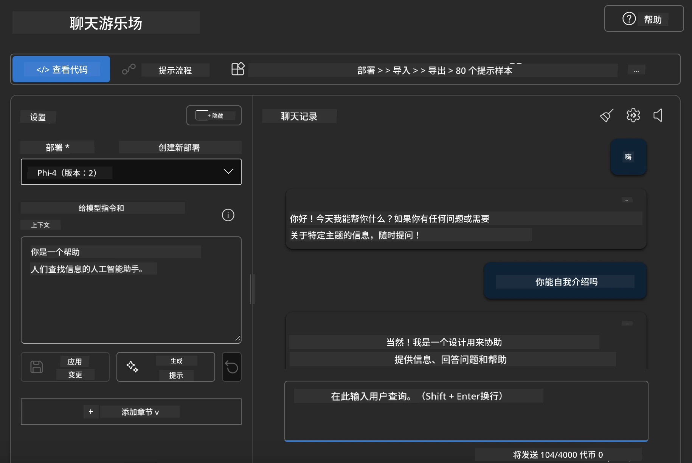

<!--
CO_OP_TRANSLATOR_METADATA:
{
  "original_hash": "3ae21dc5554e888defbe57946ee995ee",
  "translation_date": "2025-07-16T19:07:14+00:00",
  "source_file": "md/01.Introduction/02/03.AzureAIFoundry.md",
  "language_code": "zh"
}
-->
## Azure AI Foundry 中的 Phi 系列

[Azure AI Foundry](https://ai.azure.com) 是一个值得信赖的平台，帮助开发者以安全、可靠且负责任的方式推动创新，塑造 AI 的未来。

[Azure AI Foundry](https://ai.azure.com) 专为开发者设计，能够：

- 在企业级平台上构建生成式 AI 应用。
- 利用先进的 AI 工具和机器学习模型进行探索、构建、测试和部署，同时坚持负责任的 AI 实践。
- 与团队协作，完成应用开发的全生命周期。

通过 Azure AI Foundry，您可以探索各种模型、服务和功能，快速构建最符合您需求的 AI 应用。Azure AI Foundry 平台支持从概念验证到成熟生产应用的无缝扩展。持续的监控和优化助力长期成功。


除了在 Azure AI Foundry 中使用 Azure AOAI Service，您还可以在 Azure AI Foundry 模型目录中使用第三方模型。如果您希望将 Azure AI Foundry 作为 AI 解决方案平台，这是一个不错的选择。

我们可以通过 Azure AI Foundry 的模型目录快速部署 Phi 系列模型

[Microsoft Phi Models in Azure AI Foundry Models](https://ai.azure.com/explore/models/?selectedCollection=phi)


### **在 Azure AI Foundry 中部署 Phi-4**


### **在 Azure AI Foundry Playground 中测试 Phi-4**



### **运行 Python 代码调用 Azure AI Foundry Phi-4**

```python

import os  
import base64
from openai import AzureOpenAI  
from azure.identity import DefaultAzureCredential, get_bearer_token_provider  
        
endpoint = os.getenv("ENDPOINT_URL", "Your Azure AOAI Service Endpoint")  
deployment = os.getenv("DEPLOYMENT_NAME", "Phi-4")  
      
token_provider = get_bearer_token_provider(  
    DefaultAzureCredential(),  
    "https://cognitiveservices.azure.com/.default"  
)  
  
client = AzureOpenAI(  
    azure_endpoint=endpoint,  
    azure_ad_token_provider=token_provider,  
    api_version="2024-05-01-preview",  
)  
  

chat_prompt = [
    {
        "role": "system",
        "content": "You are an AI assistant that helps people find information."
    },
    {
        "role": "user",
        "content": "can you introduce yourself"
    }
] 
    
# Include speech result if speech is enabled  
messages = chat_prompt 

completion = client.chat.completions.create(  
    model=deployment,  
    messages=messages,
    max_tokens=800,  
    temperature=0.7,  
    top_p=0.95,  
    frequency_penalty=0,  
    presence_penalty=0,
    stop=None,  
    stream=False  
)  
  
print(completion.to_json())  

```

**免责声明**：  
本文件使用 AI 翻译服务 [Co-op Translator](https://github.com/Azure/co-op-translator) 进行翻译。虽然我们力求准确，但请注意，自动翻译可能包含错误或不准确之处。原始语言的原文应被视为权威来源。对于重要信息，建议采用专业人工翻译。我们不对因使用本翻译而产生的任何误解或误释承担责任。