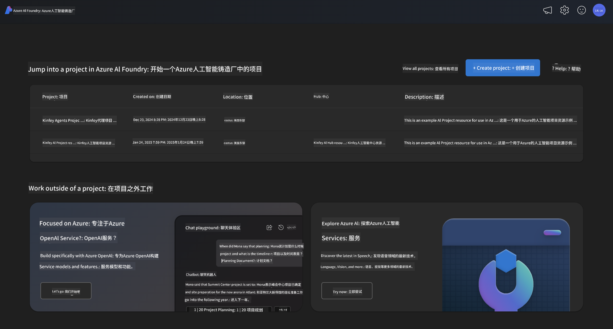
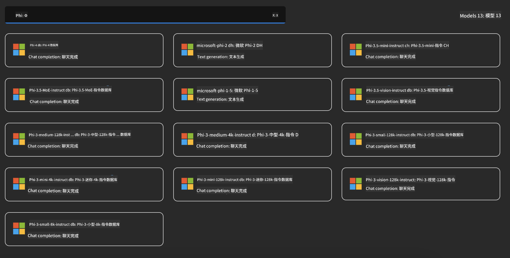
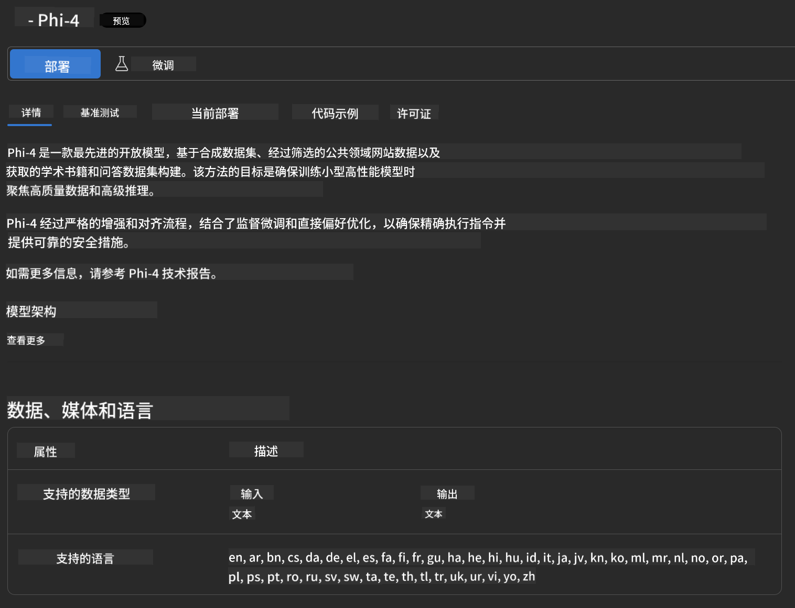
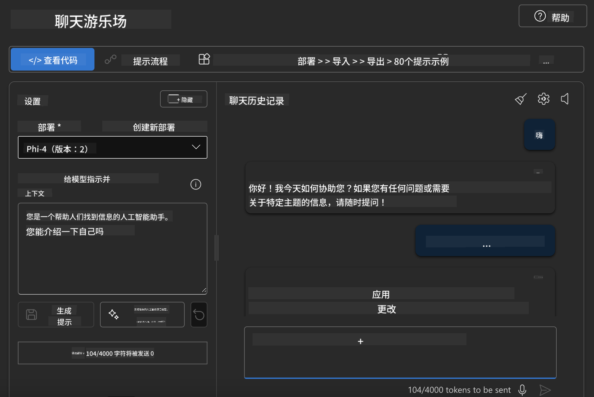

<!--
CO_OP_TRANSLATOR_METADATA:
{
  "original_hash": "70dc9bd6453f70f1a5f6833fe6e24bd0",
  "translation_date": "2025-04-03T06:43:02+00:00",
  "source_file": "md\\01.Introduction\\02\\03.AzureAIFoundry.md",
  "language_code": "zh"
}
-->
## Azure AI Foundry中的Phi系列

[Azure AI Foundry](https://ai.azure.com) 是一个值得信赖的平台，帮助开发者以安全、可靠、负责任的方式利用AI推动创新并塑造未来。

[Azure AI Foundry](https://ai.azure.com) 专为开发者设计，旨在：

- 在企业级平台上构建生成式AI应用程序。
- 使用最先进的AI工具和机器学习模型进行探索、构建、测试和部署，同时遵循负责任的AI实践。
- 与团队协作完成应用程序开发的全生命周期。

通过Azure AI Foundry，您可以探索各种模型、服务和功能，开始构建最符合您目标的AI应用程序。Azure AI Foundry平台支持从概念验证到全面生产应用的轻松扩展，并通过持续监控和优化助力长期成功。



除了在Azure AI Foundry中使用Azure AOAI Service，您还可以在Azure AI Foundry模型目录中使用第三方模型。如果您希望将Azure AI Foundry作为您的AI解决方案平台，这是一个不错的选择。

我们可以通过Azure AI Foundry的模型目录快速部署Phi系列模型。



### **在Azure AI Foundry中部署Phi-4**



### **在Azure AI Foundry Playground中测试Phi-4**



### **运行Python代码调用Azure AI Foundry中的Phi-4**

```python

import os  
import base64
from openai import AzureOpenAI  
from azure.identity import DefaultAzureCredential, get_bearer_token_provider  
        
endpoint = os.getenv("ENDPOINT_URL", "Your Azure AOAI Service Endpoint")  
deployment = os.getenv("DEPLOYMENT_NAME", "Phi-4")  
      
token_provider = get_bearer_token_provider(  
    DefaultAzureCredential(),  
    "https://cognitiveservices.azure.com/.default"  
)  
  
client = AzureOpenAI(  
    azure_endpoint=endpoint,  
    azure_ad_token_provider=token_provider,  
    api_version="2024-05-01-preview",  
)  
  

chat_prompt = [
    {
        "role": "system",
        "content": "You are an AI assistant that helps people find information."
    },
    {
        "role": "user",
        "content": "can you introduce yourself"
    }
] 
    
# Include speech result if speech is enabled  
messages = chat_prompt 

completion = client.chat.completions.create(  
    model=deployment,  
    messages=messages,
    max_tokens=800,  
    temperature=0.7,  
    top_p=0.95,  
    frequency_penalty=0,  
    presence_penalty=0,
    stop=None,  
    stream=False  
)  
  
print(completion.to_json())  

```

**免责声明**：  
本文件使用 AI 翻译服务 [Co-op Translator](https://github.com/Azure/co-op-translator) 进行翻译。虽然我们尽力确保准确性，但请注意，自动翻译可能包含错误或不准确之处。原始文件的母语版本应被视为权威来源。对于关键信息，建议使用专业人工翻译。对于因使用此翻译而引起的任何误解或误读，我们不承担任何责任。