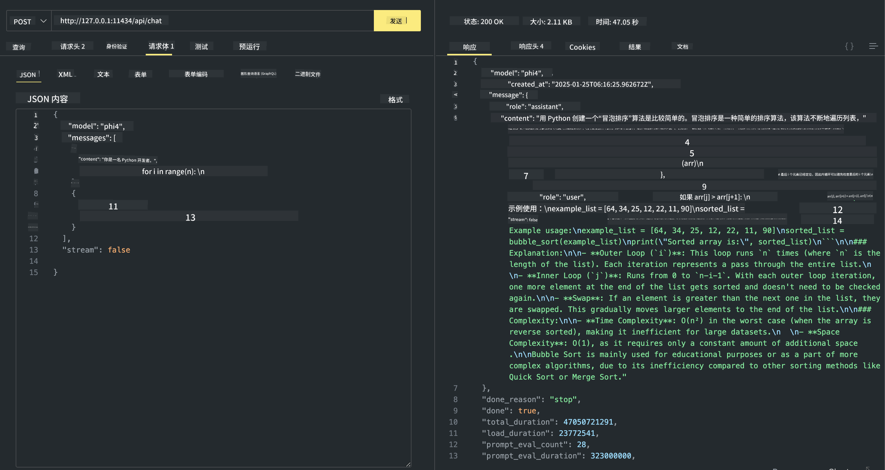

<!--
CO_OP_TRANSLATOR_METADATA:
{
  "original_hash": "ea58f7c3348e894feaeecb90f5bfa98f",
  "translation_date": "2025-04-03T06:44:16+00:00",
  "source_file": "md\\01.Introduction\\02\\04.Ollama.md",
  "language_code": "zh"
}
-->
## Phi 家族在 Ollama 中

[Ollama](https://ollama.com) 通过简单的脚本让更多人可以直接部署开源的 LLM 或 SLM，同时也可以构建 API，支持本地的 Copilot 应用场景。

## **1. 安装**

Ollama 支持在 Windows、macOS 和 Linux 上运行。你可以通过这个链接安装 Ollama ([https://ollama.com/download](https://ollama.com/download))。安装成功后，你可以直接通过终端窗口使用 Ollama 脚本调用 Phi-3。你可以查看 [Ollama 中的所有可用库](https://ollama.com/library)。如果你在 Codespace 中打开这个仓库，Ollama 已经安装好了。

```bash

ollama run phi4

```

> [!NOTE]
> 第一次运行时，模型会被下载。当然，你也可以直接指定下载的 Phi-4 模型。以下以 WSL 为例运行命令。模型下载成功后，你可以直接在终端上进行交互。


## **2. 从 Ollama 调用 phi-4 API**

如果你想调用 Ollama 生成的 Phi-4 API，可以在终端中使用这个命令启动 Ollama 服务器。

```bash

ollama serve

```

> [!NOTE]
> 如果运行 macOS 或 Linux，请注意可能会遇到以下错误 **"Error: listen tcp 127.0.0.1:11434: bind: address already in use"**。运行命令时可能会出现此错误。这通常表明服务器已经在运行，你可以忽略该错误，或者停止并重新启动 Ollama：

**macOS**

```bash

brew services restart ollama

```

**Linux**

```bash

sudo systemctl stop ollama

```

Ollama 支持两种 API：generate 和 chat。你可以根据需要通过发送请求到运行在端口 11434 的本地服务来调用 Ollama 提供的模型 API。

**Chat**

```bash

curl http://127.0.0.1:11434/api/chat -d '{
  "model": "phi3",
  "messages": [
    {
      "role": "system",
      "content": "Your are a python developer."
    },
    {
      "role": "user",
      "content": "Help me generate a bubble algorithm"
    }
  ],
  "stream": false
  
}'

This is the result in Postman



## Additional Resources

Check the list of available models in Ollama in [their library](https://ollama.com/library).

Pull your model from the Ollama server using this command

```bash
ollama pull phi4
```

Run the model using this command

```bash
ollama run phi4
```

***Note:*** Visit this link [https://github.com/ollama/ollama/blob/main/docs/api.md](https://github.com/ollama/ollama/blob/main/docs/api.md) to learn more

## Calling Ollama from Python

You can use `requests` or `urllib3` to make requests to the local server endpoints used above. However, a popular way to use Ollama in Python is via the [openai](https://pypi.org/project/openai/) SDK, since Ollama provides OpenAI-compatible server endpoints as well.

Here is an example for phi3-mini:

```python
import openai

client = openai.OpenAI(
    base_url="http://localhost:11434/v1",
    api_key="nokeyneeded",
)

response = client.chat.completions.create(
    model="phi4",
    temperature=0.7,
    n=1,
    messages=[
        {"role": "system", "content": "You are a helpful assistant."},
        {"role": "user", "content": "Write a haiku about a hungry cat"},
    ],
)

print("Response:")
print(response.choices[0].message.content)
```

## Calling Ollama from JavaScript 

```javascript
// 使用 Phi-4 总结文件的示例
script({
    model: "ollama:phi4",
    title: "Summarize with Phi-4",
    system: ["system"],
})

// 总结示例
const file = def("FILE", env.files)
$`Summarize ${file} in a single paragraph.`
```

## Calling Ollama from C#

Create a new C# Console application and add the following NuGet package:

```bash
dotnet add package Microsoft.SemanticKernel --version 1.34.0
```

Then replace this code in the `Program.cs` file

```csharp
using Microsoft.SemanticKernel;
using Microsoft.SemanticKernel.ChatCompletion;

// 使用本地 Ollama 服务器端点添加聊天补全服务
#pragma warning disable SKEXP0001, SKEXP0003, SKEXP0010, SKEXP0011, SKEXP0050, SKEXP0052
builder.AddOpenAIChatCompletion(
    modelId: "phi4",
    endpoint: new Uri("http://localhost:11434/"),
    apiKey: "non required");

// 向聊天服务发送一个简单的提示
string prompt = "Write a joke about kittens";
var response = await kernel.InvokePromptAsync(prompt);
Console.WriteLine(response.GetValue<string>());
```

Run the app with the command:

```bash
dotnet run

**免责声明**：  
本文件使用 AI 翻译服务 [Co-op Translator](https://github.com/Azure/co-op-translator) 进行翻译。尽管我们努力确保翻译的准确性，但请注意，自动翻译可能包含错误或不准确之处。应以原始语言的文件作为权威来源。对于重要信息，建议使用专业人工翻译。我们对于因使用本翻译而产生的任何误解或误读不承担责任。